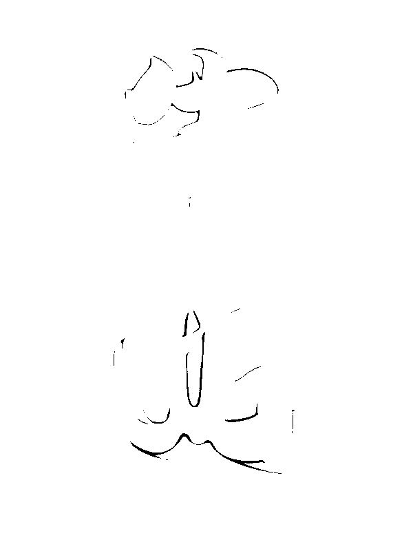
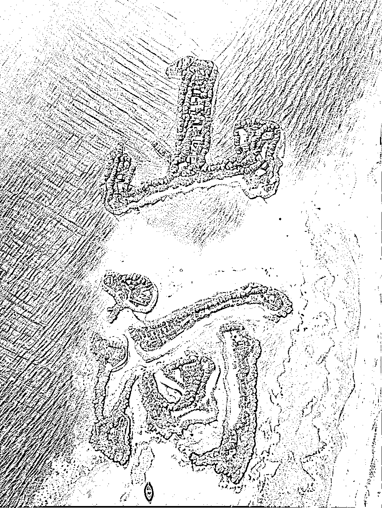
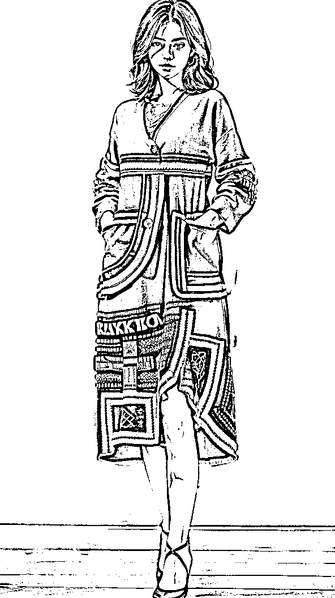

# 《爆肝7天！AI创意字终极攻略，光影、隐藏、嵌入、海报4种创意字全拆解！》

> 来源：[https://ry5hwpuf7b.feishu.cn/docx/VfbzdxsF6orYgSxE7tXcRWyMnBf](https://ry5hwpuf7b.feishu.cn/docx/VfbzdxsF6orYgSxE7tXcRWyMnBf)

《爆肝7天！AI创意字终极攻略，光影、隐藏、嵌入、海报4种创意字全拆解！》

各位好，我是吴东子

随着AIGC技术迭代，越来越多有趣的玩法也被逐渐挖掘了出来，像最近特别火的AI创意字

我花了一周的时间把所有的玩法研究了一遍，整理出来一套完整的制作流程

文章包含了从制作底图、选大模型、写关键词和ControlNet参数四大步骤，你只需要一步一步跟着操作，也能做出同款的AI创意字

１.光影文字

２.嵌入文字

３.隐藏文字

４.海报文字

每种都有对应的使用场景和变现方式，真正地帮助了生产者提高生产力以及拓宽了变现渠道

另外，文中需要用到的模型文件，也都给大家打包好放在末尾的网盘链接里，不需要大家再自己到处去找

花了很多时间才整理出来，希望对你有帮助

严禁抄袭搬运，势必追诉到底！

# 一、AI创意字有多牛逼？

## 1.海报文字

简单背景

场景背景

## 2.嵌入文字

## 3.隐藏文字

左边“东子真帅”，中间“东子666”，最右边“wudongzi”

把图片缩小就可以看出字，把图片放大又显得很合理

## 4.光影文字

“无敌”

# 二、四步做出同款AI创意字

想要做出上面四种同款文字类型，只需要跟着我做到以下四步

1.制作底图

2.选大模型

3.写关键词

4.controlnet设置

由于制作底图和选大模型的操作方法都是一样的，我们就统一先讲一遍

## 制作底图

用PS、修图软件（美图秀秀等）或者其他做图网站，生成一张 白底黑字 或者 黑底白字 的图片

海报文字、嵌入文字用白底黑字

隐藏文字、光影文字用黑底白字

目前来说，如果不是有非常专业的文字设计和排版需求的话，用美图秀秀就足够了

具体的制作方法：

①打开美图秀秀，点击“图片美化”

②点击右上角的“制作壁纸”

③在最下面可以选择颜色，在这篇文章教程里面会用到白色和黑色两个颜色

然后点击“下一步”

④在下面的工具栏里面

可以裁剪图片尺寸，选择你最后想要出图的尺寸

点击“文字”就可以输入文字

⑤在“文字”里面可以修改文字的颜色和字体，手指缩放文字就可以改变大小

字体种类和大小可以根据自己的需求自由调整

这张底图会确定后面生成的文字的大小位置

根据自己想要生成什么样的图片，图片上面有什么元素，去决定字体和字体的粗细

像生成蛋糕、面包这种文字，可以适当加粗文字

## 选大模型

底图做好了之后，就可以来到SD生成文字

首先先选一个真实的大模型

在我实际测试下来，表现比较好的大模型有以下几个

revAnimated，realisticVision，chilloutmix，majicmixRealistic，deliberate

本文中所用到的所有模型资料，都会给大家打包整理好，放在文末的网盘链接里

真人图片就用：majicmixRealistic，chilloutmix

其他用：revAnimated，realisticVision，deliberate

生成不同的物品，不同的模型会出来不同的效果，没有哪个是最正确的答案

如果在做图过程中发现效果不好

可以多试几个大模型

# 三、海报文字

海报文字分成两种图片形式：纯文字和背景文字

第一种纯文字

第二种是背景文字

它们具体的操作方法都是一样的

纯文字会更加方便我们后期抠图出来，用到海报设计或者其他字体设计的地方

背景文字则是直出效果，在特定情况下，也能抽出文字和背景非常融洽丝滑的图片

## 1.制作底图

做一张白底黑字图

## 2.选大模型

## 3.写关键词

接下来就是写关键词

现在我们要生成的是“蛋糕”两个字，那就希望用蛋糕的元素生成这两个字

可以在关键词里面输入：蛋糕，奶油，巧克力，水果等等

还可以加上“简单背景”、“白色背景”这些词

如果是想生成带背景的海报，在关键词里就要加上整体环境的描述

下面的参数 采样步数和采样方法

我设置的是30和DPM++ SDE Karras

可以参照我的，也可以自己多试试，会有一些不一样的效果

## 4.controlnet设置

打开controlnet，把原始的“蛋糕”文字图片导入进去

预处理器选invert

模型选depth

没更新ControlNet模型的小伙伴，可以去看我之前的《ControlNet终极攻略》

最后点击生成

## 5.细节补充

如果是生成液体材质的文字，可以用canny，lineart，softedg，scribble这几个线稿

然后稍微降低一点controlnet的控制权重（0.6~0.8之间）

这样出来的文字就会有液体飞溅的感觉

# 四、嵌入文字

把文字融合到了场景里面，在合理不合理之间碰撞，非常有趣

## 1.制作底图

一样做一张 白底黑字 的图片

## 2.选大模型

## 3.写关键词

关键词要多尝试

不同的字出来的效果会不一样

我就在跑图的过程中发现“东子”两个字拿来生成瀑布的效果还不错

于是就有了下面的关键词：竹林、竹子、池塘、瀑布

## 4.controlnet设置

接着就是controlnet的选择，这里就要选 canny，lineart，softedg，scribble 这些线稿的模型

在我实际测试下来，canny和scribble出来的效果都还可以，大家可以优先尝试这两个模型

降低权重，这样文字才能更好和场景融合到一起

可以把权重设置到 0.65~0.85 之间，想要文字更加突出权重就加大

最后生成图片

# 五、隐藏文字

把字藏到场景里

建筑，或者变成衣服设计等等都可以

## 1.制作底图

这里和前面是不一样的，我们要弄一张 黑底白字 的图

## 2.选大模型

然后来到SD，还是先选一个大模型

如果是做人物的图片，可以用majicmixRealistic，这个出来的人物效果会比较好

如果是做建筑或者风景，只要选一个真实的大模型就可以

## 3.写关键词

接下来就是关键词

关键词都是可以自己随意修改的，主要看自己要什么样的画面

下面两个就是我用到的关键词：

城市建筑：

Best quality, ultra high definition, masterpiece, ultimate details, 8K,

Urban night view, buildings, cars, headlights, streets, roads, water reflection

最好的质量，超高清，杰作，极致细节，8K，

城市夜景，建筑，汽车，前灯，街道，道路，水反射

人物：

The highest quality, masterpiece, ultimate detail,

1 girl, beautiful, full body, long skirt, standing with hands in pockets

最高的质量，杰作，极致细节，

1个女孩，漂亮，全身，长裙，站着，双手插在口袋里

## 4.controlnet设置

接下来就是比较重要的controlnet

这里我们需要下载一个新的controlnet模型

模型可以在网盘下载

模型存放位置：sd目录 \ models \ ControlNet

不需要预处理器，模型就选我们新下载的

特别要注意的是控制权重

只要在0.45~0.65之间就可以了

权重可以多来回试试效果，需要字清晰一点权重就大一点

最后点击生成就可以了

把照片缩小就可以看清楚字

“牛逼”，“东子真帅”，“东子666”

就差做多一个“东子真不要脸”

用微信号做图也是这种制作方法

“wudongzi”

（非微信号，请勿添加，仅作演示）

# 六、光影文字

这一种就是把文字变成光影

## 1.制作底图

做一张黑底白字图

文字在画面中的占比可以稍微大一点

## 2.选大模型

选真实感大模型（majicRealistic或者chilloutmix）

## 3.写关键词

①先写画面质量的词

②然后写小姐姐的外型描述

③最后加上一些“阳光”、“光和阴影”、“明暗对比”之类的词，并且加一点权重

## 4.controlnet设置

这一部分用到的是tile模型

需要特别注意的就是控制权重和引导终止时机

控制权重：设置在0.35~0.55之间

引导终止时间：0.7~1，越接近 1 字越清晰

没有固定的参数，不同的字需要分别调整，只能自己多试试

最后点击生成

“牛逼！”

# 七、变现方式

变现方式分为以下四种及其延申

1.艺术设计

2.定制头像

3.定制祝福

4.引流方式

主要模式分两种，提效 和 定制

提效：

加入自己现有工作流中去提效

*   比如你本身是设计师，以前要制作这样的艺术字，可能需要通过各种3D工具去渲染

而现在通过SD制作艺术字，不仅能以非常低的时间成本去做出来这种效果，还能做出更有创意的设计

*   比如你本身团队有从公域平台引流的需求，现在通过SD创意字去做到避开检测

能提高引流效率（但相信很快平台也会研究出检测系统，所以只能是短期）

定制：

结合现有的互联网玩法，通过做视频到公域引流，然后到私域成交的模式

*   定制头像，给客户的名字或者想要的字，做成很酷的图，成为专属头像

*   定制祝福，比如XX生日快乐，用作祝福礼物送给朋友新奇的体验

*   定制引流，如果有客户需要有引流的需求，可以去定制引流图片

# 八、结尾

好了，以上就是我们这篇文章的全部内容

如果你对AI感兴趣的话，可以关注我的公众号：吴东子AI，也欢迎分享给你身边想学AI技术的朋友

里面有我之前发过的所有文章，之后也会持续给大家更新实用的AI干货教程

我是吴东子，用奶奶都能听懂的方式，分享可以落地实操的干货，我们下篇文章再见！

网盘链接：https://pan.baidu.com/s/11p8zSDRs5XLgQPSqkcqe-Q?pwd=wdz6

提取码：wdz6

吴东子AI账号简介：https://ry5hwpuf7b.feishu.cn/wiki/space/7283841978071072772?ccm_open_type=lark_wiki_spaceLink