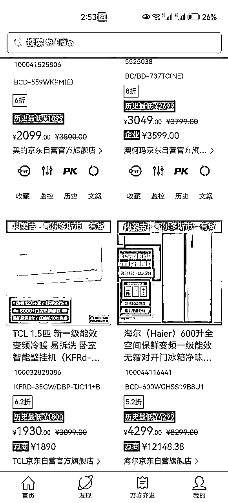
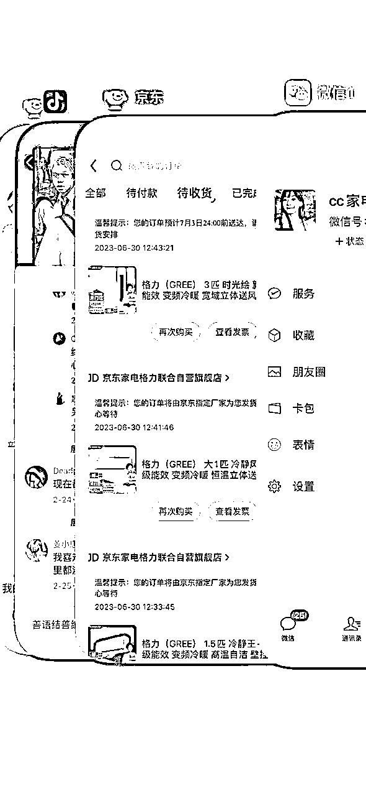
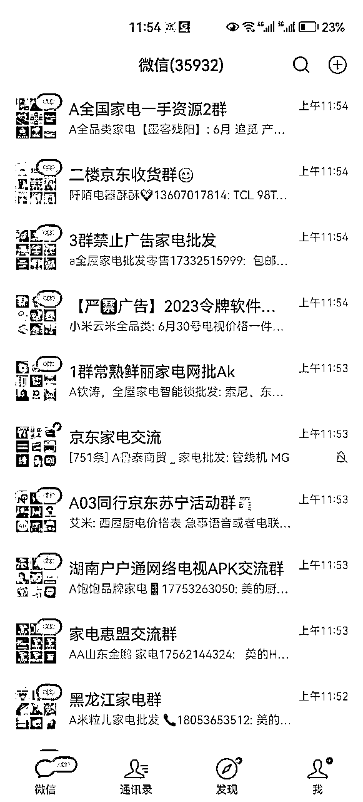
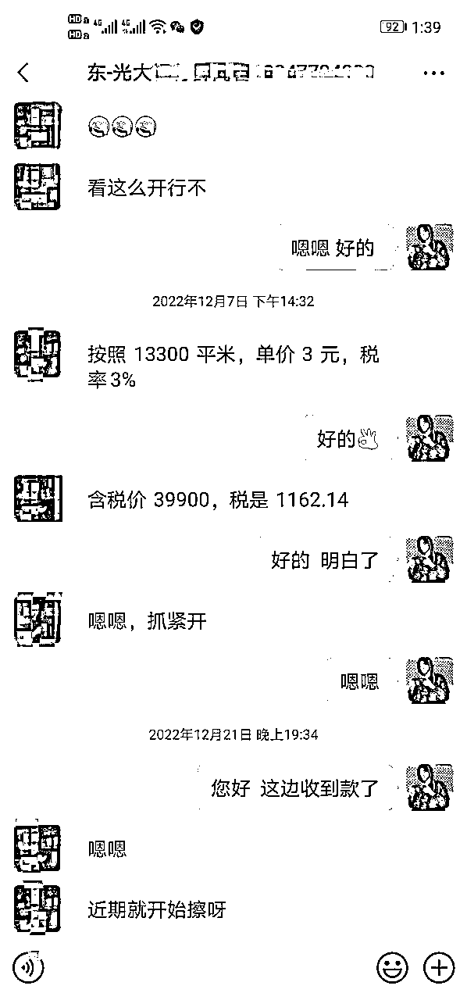
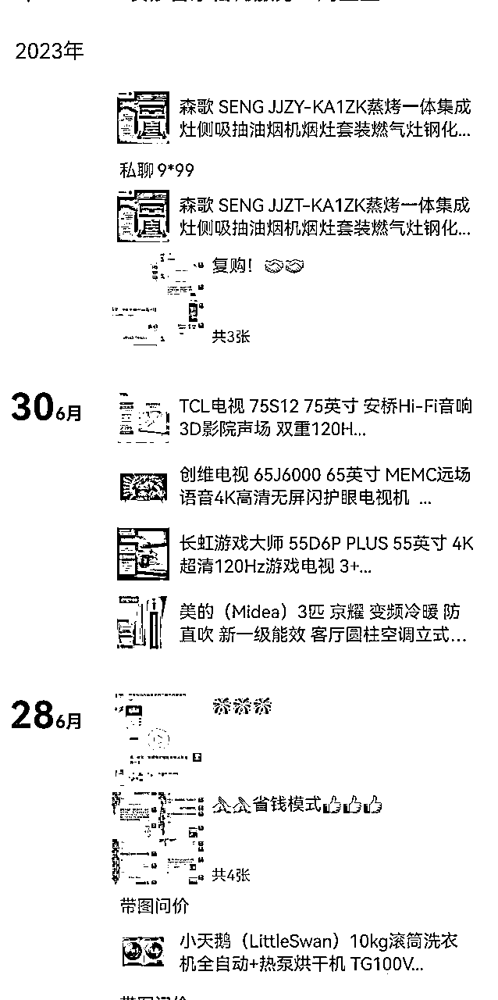

# 京东家电代+家政店群+除甲醛 ，小白也能轻松上手的项目

> 来源：[https://se2oqury81.feishu.cn/docx/VubWdxEcpoHbiCxdkH3cw6j9nne](https://se2oqury81.feishu.cn/docx/VubWdxEcpoHbiCxdkH3cw6j9nne)

大家好，进入生财3年之久了，通过家政+家电代下+除甲醛的项目组合赚到了7位数的钱，也将通过生财有术把利他精神传递下去。这是进入生财以来发表的第一篇文章，希望大家能从中汲取自己想要的知识。

*   一、什么是京东家电代下

*   二、其余渠道获取低价家电

*   三、如何通过家政店群去获取购买家电客户

*   四、如何通过除甲醛进行多重变现

### 一、什么是京东家电代下

首先我们需要了解”京东令牌价“是什么，大家都知道京东是有实体线下店的，加盟了京东线下专卖店后，京东官方会给店主一个内部账号，这个账号享受京东家电内部的批发价格裸价，俗称令牌价，令牌价一般优惠3-8折，特别是一些中高端的产品差价更大。通过京东令牌下单的全部都是由京东直营仓库发出，和京东上下单是一模一样的。

知道令牌价后我们可以通过俩个方式拿到令牌价格：

1.和当地京东店合作，说明自己是做装修的，会有很多新房客户，可以帮你们做高销售额，达成合作后下单可以直接找他们下，但是本地京东店也是有局限性的，就是只能做当地的订单，如果跨区域的话是不允许串货的。

2.做过代下的都知道cc，他们是第一批做京东代下的大佬。整合了全国的京东令牌价账号，从cc那边下单的话是可以全国发货的。

## 二、其余渠道获取低价家电

京东令牌下单存在一部分缺陷，并不是所有家电都有令牌价。而且京东令牌是有变动的，存在今天这个电器有令牌价，明天就没有了。很多时候会遇到客户想要某款家电型号时，未必当天就有令牌价，而且查不到，所以必须有更多的渠道去获取低价家电。

很多有资金实力的就会利用京令牌的缺陷，玩一种囤货的模式。比如今天有一款家电有令牌价，而且这款家电还是热销品，那很多人就会选择囤货几十台或者上百台，屯在自己的仓库里面过几天这款屯道德家电没有了令牌价，那么他仓库里屯的嚯就有了价格优势，当有客户需求时直接从他仓库发出，这个过程产品其实一模一样，并且享有售后。

很多品牌并不是只跟京东合作的，他会跟很多销售渠道去合作。比如天猫、苏宁、国美、还有一些线下经销商、代理商合作。由于这些渠道知名度没有京东大，反而有时候他们的内部价要比京东令牌价便宜。

在国内大部分家电都是品牌售后，尽管是从京东下的单，其实售后也是品牌来售后的。当你联系京东客服的时候，京东客服也是去联系品牌售后的，跟自己拨打品牌400电话也是一样的道理。

## 三、如何通过家政店群去获取购买家电用户

一般需要购买家电的大多都是装修新房的用户，这些客户装修完是需要进行开荒打扫的，然后才是购买家电。很多人都知道云家政，也就是在美团上开一家纯线上店，有了订单以后派给群里的保洁阿姨就完事了，做完以后从中抽取30%左右的利润，单子小的可以提几十的信息费，有一些大点的单子可以提到几百甚至上千的信息费。

由于开店成本特别低，无非就营业执照成本和商户通成本（按城市规模分为一二线城市6800,三线城市3800,四线城市1000），我们在将一个城市的店开稳定后可以迅速复制到其他城市，一个人可同时管理4个城市的店。而且商户通的费用是可以随时退的，这也极大程度降低了我们的风险成本，可以说是一本万利的活了，遇到好一点的城市一个月用不了就可以回本。我其中一个四线城市的店，开店就花了1000元，营业执照没花钱，每月可以有差不多3000的收入，所以不要小看四线城市，竞争特别小，反而更加容易做。

以线上家政店作为切入点，在平时接到客户电话时，都可以以发具体位置的理由让客户加到微信，然后再通过朋友圈营销继续二次变现，或者以搞活动的方式私信客户， 只需要将我们的家电优惠活动信息发到自己的业主群，即可优惠50元。这样做虽然我们打扫卫生的利润降低了，但是能做到很有效的裂变，要知道客户业主群里也都是需要装修和购买家电的有效用户。

## 四、如何通过除甲醛就行多重变现

除甲醛利润十分可观，我们可以以直营+共享的方式进行变现。直营的方式很简单，通过家政进来的可以送一次免费甲醛检测，很多客户都是贪小便宜的，一般都是愿意做的。这种做的好处也可以提高我们家政用户的成交率，另一方面我们在给客户做除甲醛的时候也就可以顺理成章的推销我们的除甲醛服务了。

主要说一下共享模式，在做家政店群的时候，我们会认识很多当地的保洁，每个城市的开荒用户基本上都会被他们消化。他们在做开荒的时候是有和业主长达几小时的接触，所以如果他们进行推销除甲醛的话是有很高的成交率。那我们就可以将利润让给保洁将除甲醛仪器和药剂租赁给保洁，我们只赚设备租赁的钱和药剂的钱。也不用担心设备不够用的情况，因为网上就有专门出租除甲醛设备的。平时在群里也多普及一下除甲醛设备的使用方法，在做单的时候也就更加专业了。