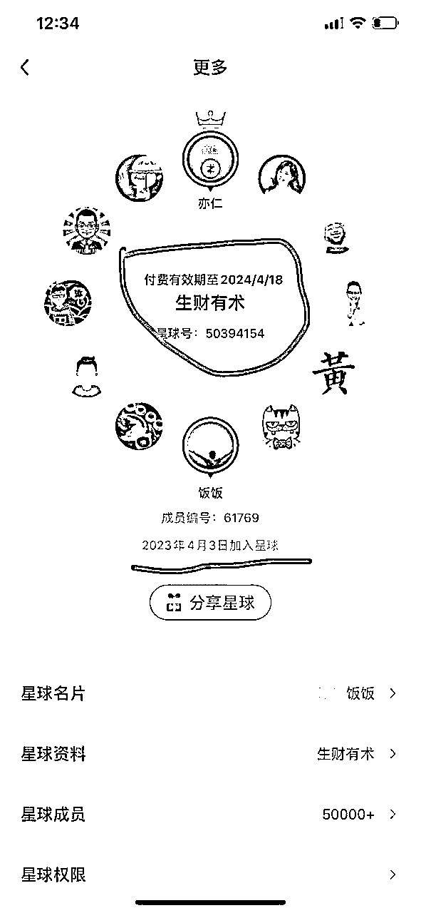
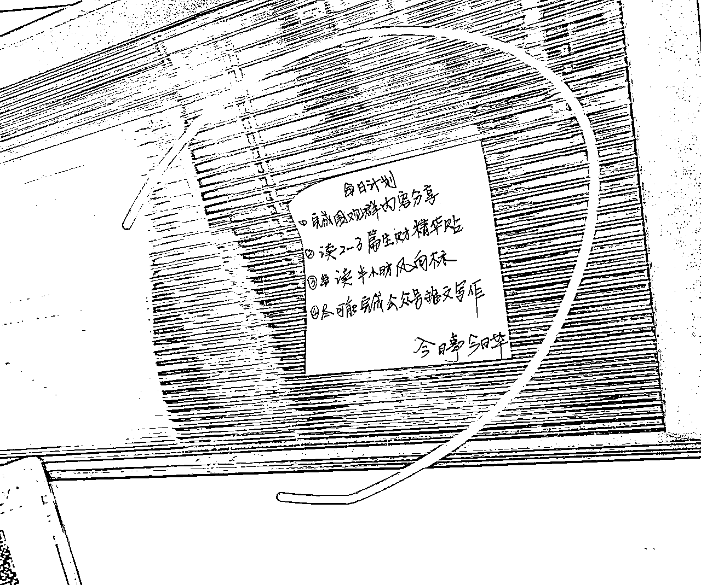
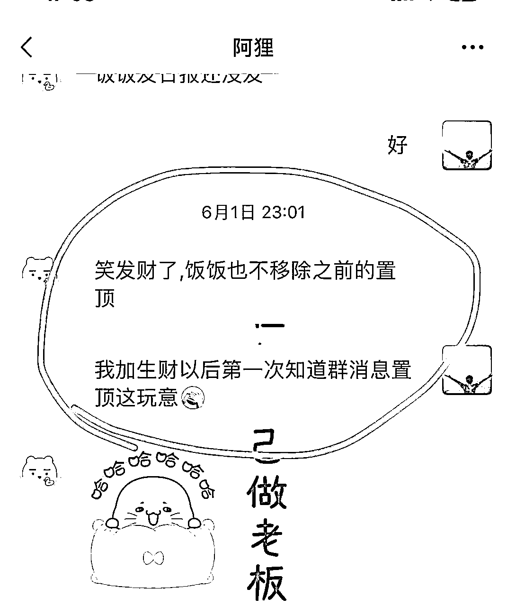
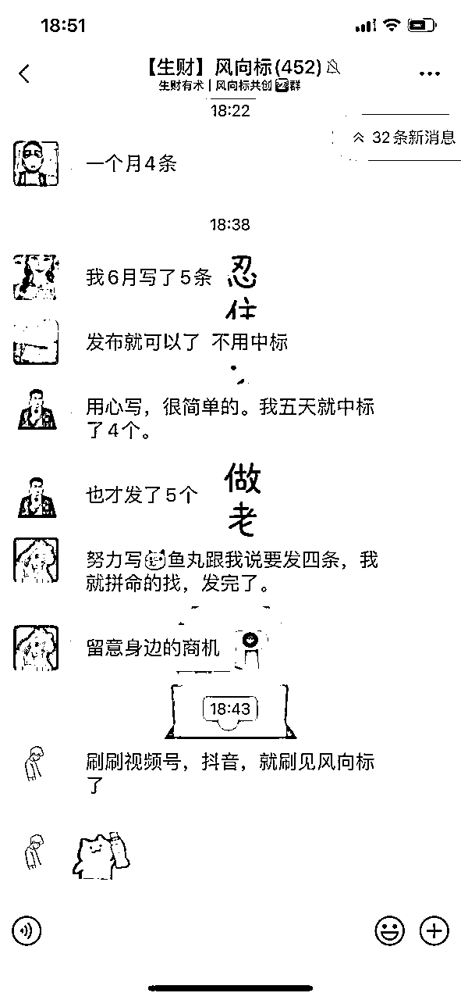
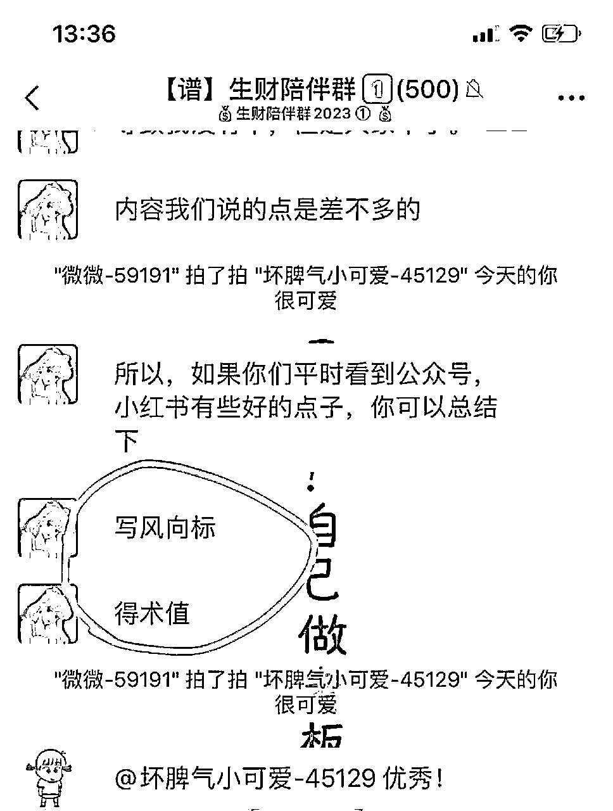
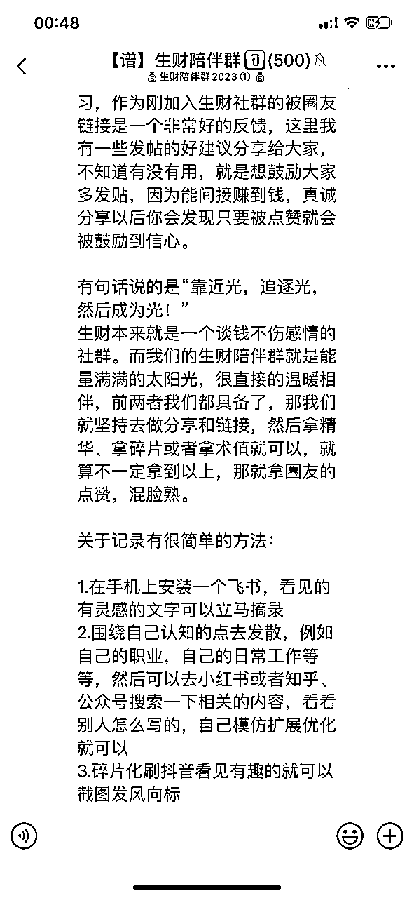
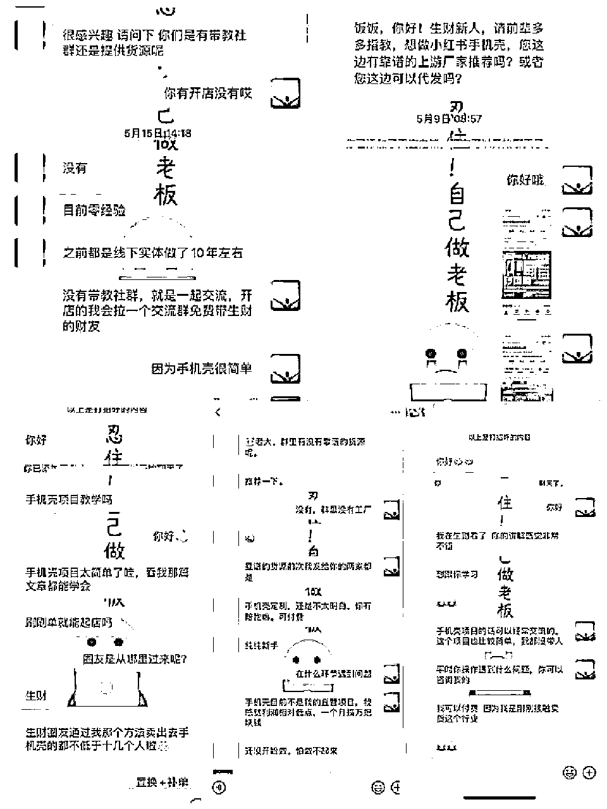
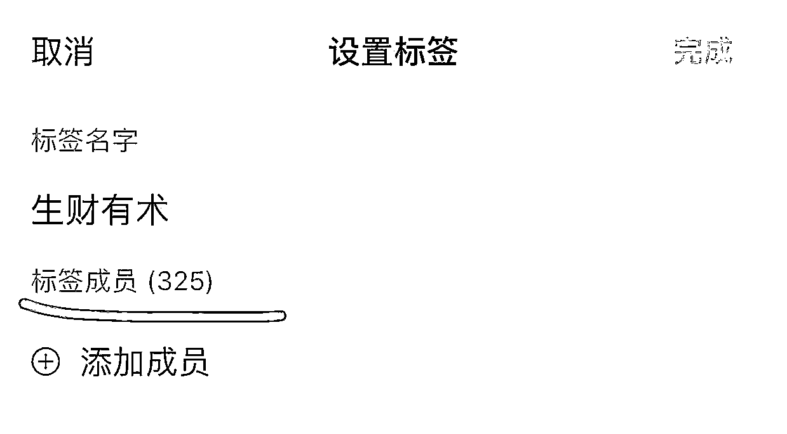
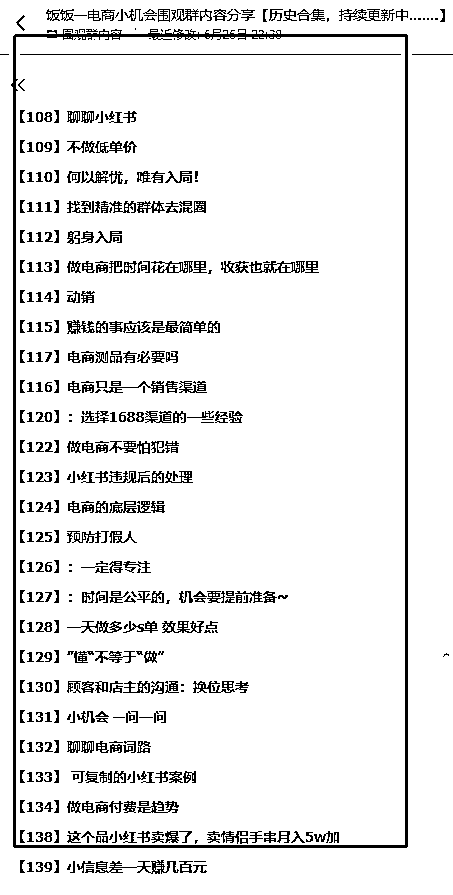
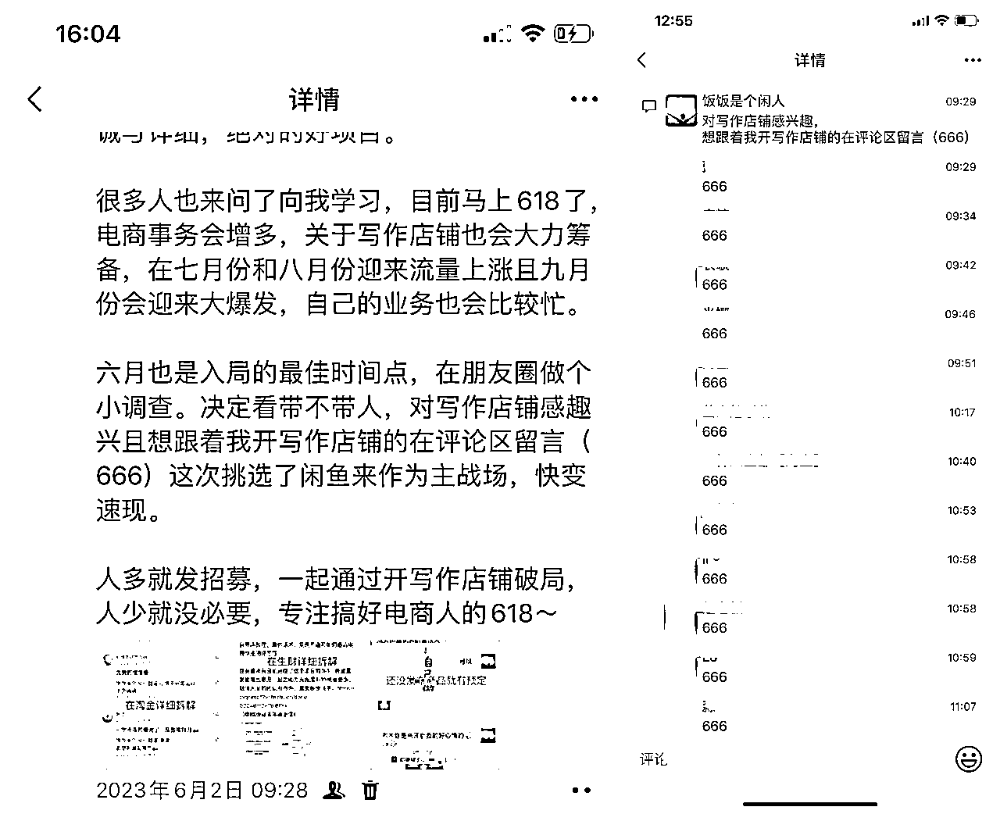

# 互联网小白，加入生财2个月赚回了30倍门票复盘

> 来源：[https://cxqeimz77vr.feishu.cn/docx/VvtkdyJaEoorHoxqFPacK0zsnVe](https://cxqeimz77vr.feishu.cn/docx/VvtkdyJaEoorHoxqFPacK0zsnVe)

加入生财2个月，我真的发现了一个大问题：你永远赚不到你认知以外的钱，先动起来，实践是提升认知的最佳方法。

各位圈友大家好，我是饭饭

实体店从业6年后转型的95后电商从业者，

今年的4.3日机缘巧合通过生财首席医官梁靠谱的朋友圈加入生财。

其实从加入那天起，我就注定赚到了。现在看来，因为我的一个正确选择，生财的体验期从今年的4.03到了明年4.18，多了整整15天，互联网一个互联网的小萌新来说，我觉得我正大光明的白嫖了生财15天。

通过在生财认识了很多生财圈友以后，我通过主动和他们交流和围观他们的高质量朋友圈，再结合我自己所拥有的经验去总结分享后，我发现了普通人在生财有术也可以大步往前走的“生财之道”，我总结为了以下16字：潜心学习、真诚分享、礼貌社交、价值互换

欢迎各位圈友阅读指点，一起看一下我对生财的使用指南~

# 心态转变

刚进入生财知识星球的时候我是对这里是陌生的，仅仅是在通过朋友圈了解到生财，知道生财是一个很牛的知识头部社群，其它方面一无所知，其实真正的改变就是从我的心态改变开始，心态从迷茫到坚定，行动从旁观者到参与者。

## 初入逛生财：迷茫

我现在还在清晰的记得我刚加入生财那天的激动，觉得打开了一扇神奇的门。激情满满的感觉好兴奋，反正我也不知道兴奋啥，就赶紧的在生财的知识星球逛，看帖子、点赞、关注圈友等等，里面好多干货，看精华帖就已经看不完了，还有风向标，还有航海计划，还有这么多圈友的分享，看不完，更本看不完！越看越焦虑，怎么都这么卷，我至今都还想不清楚一个问题“他们好多人疯狂输出内容，难道都不休息的吗？”

然后天天看帖子，我想着这么多项目，很多风口，总觉得自己可以找到一个风口项目，然后也付费了一些我觉得不错的项目，例如AI绘画，快团团等等，跟着做了项目，看见别人做的效果都很不错，但是我自己就是做不起来，然后焦虑加重了，看见别人赚钱很简单，自己操作起来难于上青天！这就让我很苦恼，然后我陷入了这样的状态：焦虑、迷茫、内耗，心有余而力不足，会怀疑自己。

后面开始反思，懂了一个道理：经验是通过实践得来的，"懂"和"做"是两回事。

看的帖子太多以后我会有一个错觉，误以为自己懂的很多，这也让我走了不少弯路，浪费了不少时间，如果不下定决心做舍弃、做筛选、那只会越来越认不清自己，同样会越来越难。

后面还是决定，始终坚持能够把自己原有产品放大的基础上，再去再放大选品测试项目，学会过滤保留精力，放大原有优势。

看见很多圈友和我一样迷茫焦虑，我知道我需要放空自己，减少焦虑，认真做好屏蔽、筛选、学以致用，然后我开始了我的破局之道“潜心学习、真诚分享、礼貌社交、价值互换”

## 现在逛生财：渐入佳境

拒绝内耗，拒绝迷茫，拒绝做旁观者。

站在岸上始终感受不到航海的魅力，也学不会游泳。我就报名了一些0门槛的生财活动，报名志愿者、然后报名航海，然后参加生财风向标共创，这些活动都是有经验的圈友带领，渐渐的也就熟悉了生财的一些活动，特别是这些活动全部有实操的sop，只要花点时间去认真看一下就懂的，积极参加活动，会有不少的收获，给自己一点信心，多参加实操。

在分享帖子的时候我也尝到了甜头，我愿意去把我做的事情，我有的经验、我看见的机会，我交流的快乐等等的都去分享，赚回门票是一点，逐渐的跟上生财的玩法，在接下来的每一天，都是赚到。

# 潜心学习：

我要先动起来，每天学点什么，写点什么，写的好不好不重要，我主要就是想先动起来，一开始我不想着我要写的有多好，因为这样我压力太大了，在生财学点东西然后我就分享到我的围观群里，这样我的行动就开始了。

## 01.看文章

看过了太多文章以后我选择性的去学习，也是由于特别绝佳的运气，能够在生财筛选适合自己的文章

第1篇：根源老师分享的一篇文章《9年传统行业1年时间，从一无所有到年入200万》

对于我来说这篇文章简直就是新人的指路明灯、看着根源老师的细心分享，清楚的看见了一个从传统行业转型线上的新人成为大佬的路径，有思路、有做法、更有成绩，看了这篇文章以后感觉全程就像在手把手教我们这种互联网小白怎么去通过线上生财，感觉很棒！

第2篇：梁靠谱老师的《一个工具和两个贵人，让我从人员极差的农村孩子，逆袭成生财拉新第一名的IP》

在开始之前我都不知道“盖洛普”是啥东西，因为我没听过更没接触过过，进入生财看见这篇文章以后我对盖洛普有了一个简单认识，然后也做了盖洛普测试，报名了醒醒教练的个人优势挖掘的航海，我成为了我自己圈子最先知道盖洛普的了，我发现了自己最突出的才干”关系建立“。这篇文章极大的帮助了我树立一种正确的观念，放大自己的优势才能去更好的吸引到愿意向你靠近的人。

第3篇 ：逆熵增者老师的《通过生财有术提升商业认知，我做付费成长社群实现月入3万+的经验分享》，这篇帖子对于我来说帮助也是巨大，看见牛人的成长路径，自己也被鼓励到，帖子里面提到：要增大自己的表达和输出，要让别人知道你在做什么，你的价值观是什么，提供一个正向的情绪价值，然后沉下心来去做一件事，加入生财这样的圈子，能极大的提升商业敏锐度。

我在潜心学习的过程中入反复的吸收这些优质的帖子，找到属于我目前这个阶段的商业路径、认知和放大优势的能力，除此之外还浏览了非常多的帖子，如果不是和自己行业相关的就没有去深入挖掘测试，不然看多了我又会误以为我懂太多，我属于容易健忘的一个状况，加上自己店铺的事宜，有时候容易忘记，所以选用了办公桌上贴了提示小纸条的方法。

这里有个小建议：在生财看见这些优质文章的时候千万不要收藏吃灰，立马看立马学，不要给自己留后路想着等下看，等下会忘记。如果复盘记录的话可以考虑使用【飞书】软件，真的是超级好用，电脑版和手机版同步，用起来比较方便。

## 02.报航海、做志愿者

个人优势挖掘船员、Ai绘画志愿者

这段时间里我在生财分享了两篇文章都很幸运的得到精华帖的认可，我是定了一个自己的小目标希望能在生财完成破圈，看见太多太多的优秀的圈友，在他们身上有一个共同点，那就是他们很清楚的认识自己。

然后我自己也尝试了去认真思考，想要做到真正的了解自己，在报名个人优势挖掘之后，我对自己的认识也更加明确了不少，参加的时候我给自己的要求是：

发现自己的优势是什么？

我的短板又是什么？

我到底想要什么，又不想要什么？

我的优势应该怎么去放大？

我很清楚的知道，没有人可以给我精准的破圈计划，这个只能是我自己 。而参加这个航海之后，我又链接到了一群厉害的圈友，好友数量增多。

如果作为生财的小白，当志愿者能够让你很快速的了解生财，这21天成长的不仅仅是船员，边学边实操的整个过程，志愿者的成长速度更快，很有意思的是，在和领队阿狸沟通的时候我才发现，没加入生财之前，我连群消息置顶都没听说过，21天的航海结束，我现在也能熟练的去运营一个社群。

同时在AI绘画的志愿者活动中，作为志愿者我又链接了34位航海的船员，邀请他们上船和他们一起航海，好有数量又增多，高密度的知识强度和一群执行力超强的圈友直接间接性的拉高了我的沟通能力和执行力。

## 03.积极参加风向标共创

风向标共创是有一个专门的社群的，加入社群以后能够看见很多新资讯、新机会，也能有一个更好的交流小圈子。和关注风向标的这群人交流，也是一个很好的提升商业嗅觉的方式，就像鱼丸所说的，“赚钱的路上，一个人做事，不如一群人行动”

和一群有想法，有行动的圈友一起深入交流，会给你带来很多意想不到的赚钱和成长新机遇。

# 真诚分享：

其实从最开始的分享我是没有规划意识的，完全是因为迷茫，

因为迷茫，打不过就加入，看不懂就大家一起卷，看大家发风向标，我也跟着发。

## 01初次尝试：风向标被圈友点赞

这个是我误打误撞发的风向标，那时候还不知道有中标这回事，就看见大家都在发，我就是抱着一个凑热闹的心态去的，当时印象还特别深刻，“发风向标的时候怎么只能打上一个#风向标 的标签，根本打不上#中标、

现在回想起来真的笑死，原来是选中的才会中标，很庆幸的是我发的第一条被很多圈友点赞评论，然后还中标了，得到亦仁大大的“术值+1”，感觉很开心，但我并不知道“术值”是用来干嘛的，直到后面在我们的陪伴群里面看见坏脾气小可爱鼓励大家写 风向标，可以拿到术值，我才清楚的知道，原来这是生财给到我们的惊喜，积攒术值，可以兑换碎片、可以兑换礼物、可以兑换生财门票等等。

由于第一次发风向标就中标了，我信心被极大的鼓励到，后面陆续发了很多条风向标，但是内容价值并不够，也没有中标，我并没有挫败感，相反让我对生财有了新的认识，我应该主动举手，做一个参与者、做分享一些我走过的经验。

如果朝着正确的方向做正确的事情的时候，对结果不要报太高的预期，因为求的是做正确，而不是求结果。就例如我在生财去发风向标的时候我发现求结果，想中标，往往就容易把我陷入到错误的情绪消耗里面，容易跑远更容易走错路。第一次分享中标以后大概有三四个生财的圈友主动链接到我，收获了几个生财圈友。

这里很多圈友可能也在焦虑，内心觉得自己发不了风向标或者不太想去发风向标，何必焦虑呢？

先相信，后拥有，我曾在我们靠谱生财的陪伴群里分享一些记录风向标的小方法，发帖能间接的赚到钱。我尝试到不错的方法，我都愿意分享给我身边的人，就像他们说的一样“靠近饭饭，财富不断~”

## 02信心建立：发帖被圈友认可加精华

情况是这样的，看见别人发帖，我也跟着发帖，我第一次在生财发帖子，认真的拆解了一下我自己团队在实操了三年的项目，做定制类的手机壳，当时自己的心理是（这种一个月赚点小钱的项目可能在生财别人看不上）虽然仅仅是分享了一下我做手机壳的经验。在写完文章以后经过@梁靠谱 的修改，我发到生财星球里 ， 没想到收到一些圈友的的喜欢和点赞，帖子破了300多的点赞。更幸运的是这篇帖子被加精华、被鱼丸单独发朋友圈、被生财的公众号转载以及被好多财友分享到他们的圈子里， 这对于互联网小萌新来说，给了我极大的曝光，也让一部分圈友对我有了一点印象，发帖子过后就有很多圈友主动链接我。很多人想做手机壳的我给他们赠送了我自己在用的货源，这点就被很多圈友认可了，生财的圈友太有礼貌了，很多人上来就先发红包打招呼，我没收红包，(但我是一个俗人，很喜欢这种有礼貌的打招呼) ，每一次都是一次极大的鼓励，信心越来越足。让我觉得更厉害的一点就是有一部分圈友用我发的帖子里面的方法，一周内就出单好几个手机壳，而且其中还有批发10多个的团单。也算是我的一次真诚分享，看见这些正反馈，我的分享欲逐渐提升，原来通过价值吸引的用户，真的是非常的高质量。

第一次发帖被选中以后大概有100多位圈友链接到我，还给我的公众号涨了200多粉丝，不得不感叹，生财的强大，真是分享者的红利！

## 03放大势能：二次发帖被加精华

这次发帖我是有了一点基础信心，在书中有一个惊人的命运法则：你相信什么就发生什么！

在写稿的时候我就想着拿一篇精华帖，因为我知道我拿到精华帖后我就有机会拿到龙珠、我就有机会间接性赚到钱、我更能够在生财完成破圈，很幸运，如我所愿！

我分享了自己在做的主营项目，《通过开写作店铺年入50w的项目拆解》文章里面分享了项目的优势劣势和我自己的实操sop，写了好几天就是尽可能的去把文章写详细一天，争取能够写的让新手也能看着就上手。想着“真诚”的去分享绝对是没有问题的，在文章写完以后又经过【梁靠谱】的用心指导，

这篇帖子也受到了很多圈友的喜欢，得到了不少圈友链接，有合作写作单子的、有交流回忆录的、还有一部分想付费让我带他们的，这样的正反馈太惊喜啦！踏上生财的大船，我正在逐渐从新人一步一步的融入这个大团队。

这次的分享同样大概有150人左右圈友主动链接到我，这就是一笔宝贵财富

我主动的去分享，在分享的过程中我从对生财的一无所知，到知道的生财有术值、有精华帖、有龙珠、拿到龙珠以后还可以链接更多大佬，整个过程心态发生了非常大的改变，

写到这里可能对于很多小伙伴会有一点焦虑，说自己没经验、没项目、没好友，

对于还没有取得正反馈的小伙伴来说，不要焦虑，不要着急，深入学习，持续做，可以不断根据反馈调整自己，得到正反馈以后，放大正反馈。

## 03真诚分享：意外之喜！

虽然加入生财才2个月的时间，但是在生财分享绝对会给你很多惊喜，以下这些我得到的，都是意外之喜！

龙珠：1

龙珠碎片：3

生财术值：25

精华：2

超强人脉，生财圈友：325

# 礼貌社交

每天逛生财的时候我就有点这种感觉：高手的朋友圈，普通人的学习园地、分享者的掘金宝地

都说“人是环境的产物”，在生财以后完全被能量场推动着前进，当你发现一个很厉害的人，执行力很强又有结果，这是你的福气，可以链接他，主动学习，礼貌社交，感受他的能量，围观他的朋友圈，甚至可以为他付费将交流更近一步。

我属于在互联网起步较晚的，自从接触了越来越多的圈友以后我发现一个问题，有部分圈友多多少少会意识不到互联网上的社交礼仪，这点也很重要。

在生财以后我很多时候主动链接到一些很优秀的大佬，礼貌的和他们打招呼，围观他们的朋友圈，800以内的很多社群或者星球等等我都毫不犹豫的支持，好几个圈友需要拉新打榜我也会支持。其实这样我自己的收获很大，短暂的一次付费多了一个具有积极情绪的朋友，也和生财的很多圈友有了深一点的链接，得到了他们不少的经验，这里把我主动链接圈友用到的社交礼仪分享给大家，适合和我一样起步晚的小萌新。

## 基本礼仪

### 1.主动添加后主动打招呼，添加说明来意

在和圈友互相链接的时候我也感觉到这点尤其重要，特别是像生财的这些大佬的好友基数非常大的，在你认可他添加他的时候也会有很多其他圈友和你有类似的想法去添加他，如果你添加一句话不说，也不主动打一下招呼，这其实不太礼貌的，即使你是想添加围观一下他们的朋友圈，你也无法让别人第一时间记住你，我发现厉害的人他们都会定期的清理通讯录好友，做好精力管理。而在清理通讯录好友的时候，就会优先选择清理这种类型。

### 2.添加好友，红包开路

这是在生财感受到的一个高级礼仪，不能说谁都喜欢红包，谁会讨厌一个上来就很有礼貌的打招呼方式呢

尝试了很多人，我添加就发红包留个好友位，领不领是对方的决定，发不发是你的态度，实际很多人都不愿意收红包的，但是在后续的聊项目、聊方法的时候会格外轻松，而且会得到好多对方给的意向不到的前辈经验。

### 3.认真倾听、不要说教

有很多人喜欢“表达”，主动添加对方以后就是各种自嗨，自己有多牛，在做了多豪华的数据，然后就是一顿“教别人做事”。如果是主动添加对方，那这种做事习惯大可不必！互联网上初次认识，没人知道对方经历、阅历和认知，认真倾听胜过说教。

## 社交雷区

### 1.初加好友，勿发语音

这些厉害的人的认知、经验、能量场、判断力、时间管理的能力都是必然存在而且比较高阶的，不要刚加上好友就给人家发一个语音。发语音仅仅是方便自己而已，会给对方造成不友好，

尤其是你向别人请教问题，60秒语音方阵的那种，你明明文字整理问题对方几秒钟就看完的问题，但是对方要花一分钟才能听完，现在很大部分的工作状态都是在家、在路上、在办公室一起工作啥的，很少有适合整天听语音的。你发语音万一碰到对方有事呢，那不是更不方便。

但是有一个特殊的情况，你向别人请教问题，别人给你解答，用语音能够很好的回复你，那需要尊重她，可以把语音转文字，认真吸收。

### 2.不要问“在吗”

采访了身边大量的朋友，包括我自己的感同身受，有问题直接提问，莫名的收到一个“在吗？”

很害怕！

能到生财的大都是有比较高的认知的，不要搞的让对方摸不清头脑，这样很难开展后面的深入交流，那这样的链接毫无意义。

### 3.不要莫名其妙的发一些符号

互联网沟通是通过文字沟通，每个人的理解不一样不同的文字产生的情绪也是不一样。线上聊天没有感情，少用一些“！！！” “？？？”这样的符号。这些符号是冰冷的情绪表现，很容易产生极大的误会。

### 4.不要群发广告

我在被一些圈友添加都以后时常会收到部分圈友的群发广告，虽然这是你宣传的一种方式，但这种方式极其不友好，我不知道其他人收到会不会反感，但就我而言我会将这种人删除，我们之间的链接毫无礼貌，自然毫无以后链接的可能性。

### 5.不要屏蔽对方

有些人的确是脑回路清奇，主动链接别人然后就是把对方屏蔽，这个不提倡。通讯录本来就位置有限，大家都是留给值得的人。如果屏蔽别人会让对方摸不清底细、到底是同行还是恶搞，这种不可能产生深入链接，这种肯定是被通讯录清理的对象。

# 价值交换

社交的本质还是价值交换，而价值交换之时，钱财就只是附带物而已。

在生财很多人可能会误以为自己没什么价值，你仅仅是没有认清自己而已，认清你自己，是获得幸福的第一步。

我们人人都有价值，只不过能量不同所输出的价值多少不一样而已，你所传达的价值一定会吸引到同频的人，这部分人就能和你产生价值互换。

看见很多厉害的人，他们一直都厉害，深入相处后发现，原来是他们价值交换的次数太多了。

在生财以后我因为价值交换，非常多的圈友为我的价值付费，所以我两个月赚回了30倍以上的门票。

## 99元的围观群变现

首先我自己有一个围观群，这是我在生财圈友【随心】的朋友圈看见的一个记录成长和打卡复盘的一个好方法，最起码对于目前我这个阶段来说是比较适用的，随着围观群人数的越来越多，围观我做电商的人就越来越多，这直接是倒逼输出，所以我坚持了不停的去做分享，不停的去做输出，过程虽然累点，但是我的每次回头去看我踩过的坑，这都是一种闭坑指南，坚持就是一种能量，加入生财以后大概有40人左右加入我的围观群，我的围观群变现约3960元

围观群仅仅是一种小的变现方式，不赚钱，我真实的将我自己从0~1的成长路径像直播一样展现给了其他人，有的人或许是出于好奇心、有的人或许是想和我交个朋友而已、或者想要在群里复制一下这个模式亦或者是在群里学习我分享的知识，总之，会有很大一部分人感兴趣，并且愿意交换价值。

## 写作boss项目内训会员招募

在生财看见了很多关于ip的精华文章，特别是看见：根源老师分享的一篇文章《9年传统行业1年时间，从一无所有到年入200万》的这篇精华帖以后，我对自己能驾驭并做好超预期交付的知识付费模型有了一个基本的认知。很多生财圈友加到我以后都问我有没有私教、有没有课程、能不能收费带带，索性我就在我的朋友圈做了个调查，饭饭不打无把握的仗。仅仅是两分钟整理一条文案，做了个小调查，炸出潜在有意支持的客户，评论区满满的“666"，发挥了我执行力的成就，说干就干。

每个电商业务都会有淡旺季，我都提前说清楚七八月份上涨，九月才会爆发，然后直接做好预售、做好交付，做好实操手册。

我的单个产品定价1880，在这一波交付收获了25个内训会员，总营收：47000元

其中的关于课程的预售，课程的交付、课程的制作、课程的优化和放大等等都可以在生财去找到优质的精华帖学习，整个成长过程有迹可循，生财门票得到多倍回报。

## 圈友链接，下单写作

在生财做了写作店铺的分享以后，好几个生财圈友知道我有一个优质的写作团队，找到我写了商业文案、公众号以及一些公文类别的单子，这也是非常大的惊喜，没有想到在这里还能接到一些写作业务的单子，写作单子变现约1800元。

只能说生财的曝光太大了，每一个人都有公平展现的机会。每一个真诚分享的圈友，都会被幸运加持。

## 4.意外之财

除此之外生财给与我的还有很多我没想到也没想过的钱，有好多圈友上来就是要给你发个红包，然后请教你一个问题，不收还不行！这种咨询红包据我不完全统计有近2000元钱。

然后被我还在朋友圈帮一些我比较认可的朋友推荐了一下社群，朋友圈发了一下动态，能给他们推荐到2位数的朋友进群（为了避免被引流，不提及名字），我也得到了一些不错的佣金，也有近2000元。

在加入生财之前我的收入来源仅仅是我的手机壳店铺和文章写作店铺。加入生财2个月，我仅仅是在生财做了这几个动作：在星球潜心学习、真诚分享了两篇文章，礼貌社交了300多位圈友，我价值互换变现了约=56760

这是直接现的，没计入龙珠、碎片、精华等等潜在财富，远远超过30倍此次进入生财的30被门票。

# 我总结出的普通人变富模板

我相信很多圈友和我一样很普通，但是愿意尝试，主动出击。我们又没做过什么过人的成绩，没有可复盘的经验，那怎么办？我的整个变现路径，对你有用。这里和技术无关、和学历无关、和背景无关，每个普通人都伸手可及。

认清自己+主动学习+基础业务+真诚分享+放大基础业务=钱

## 认清自己：

我时常看见一句话“认清自己是获得幸福的第一步”，在项目的时候不骄不躁，不要太高看自己，更不要看轻自己，一定要发掘自己的优势，摆正自己的心态，行稳致远。

认真思考：

你有什么？

你会什么？

你能借到什么资源？

你可以分享什么经验？

你可以通过什么变现？

## 主动学习：

一个很真实的情况，能摆脱假象，才能成为高手！懂得主动学习，要远远比等待学习重要得多，没有人是什么都擅长的。有结果的人和没结果的人有一个很本质的区别就在于前者会主动解决短板，后者会等待长板趋于短板。

在生财的项目已经数不过来了，如果什么都不会，那就把自己当做一个工具人，在生财挖掘，拆解项目、分享项目，整合信息，然后再去深度思考。

## 基础业务：

每个人都是有一定的经济来源的，而这个经济来源就是我们的一个基础业务，怎么来的钱，来钱的过程会遇到什么情况，需要什么资源，这些都是值得被分享和认可的。

这个基础业务因人而异，对位入座就可以。

## 真诚分享：

这个时代是分享者的红利，越分享越富有！做一个能量体，这个时代靠近能量足的人本身就是一种充电，释放能量，我们就是超级个体，我们走过的每一步路，都是一个脚印，这个脚印的形成就是一件值得分享的事情。

我们在成长的过程中走过了这么多岁月，复盘过去，你可以发现你曾经的哪些闪光点，然后告诉别人，吸引曾经和你一样的人，何乐而不为！

而这个分享渠道就很多，自媒体平台、小红书、抖音、生财、其他社群、等等

## 放大基础业务：

在一个群体中一定要找到自己学习的目标，找到离自己最近的圈友，努努力便可以赶上哪种。

在我们的分享的过程中肯定会吸引到一部分资源，可能是渠道，可能是同行、可能是支持者，者一切的一切都是在做起来的过程中慢慢的向你靠近，在执行的过程中大方拥有的。

有了更多的资源以后就是把1块钱的业务放大变成10块钱，把10块钱的放大变成100，把100的放大变成1000，去复制，去大量复制！

# 写在最后

从实体到电商再到认知提升，我的一个财富观顿悟：太辛苦的钱，最好不要挣！

我还记得我之前做餐饮和做京东电脑数码店的时候，那时候每天流水在银行卡里转动，但是兜里就比脸还干净，在我们小县城的消费其实蛮低的，为了节省成本，我自己也不敢招多少员工，很多事情都是落在自己的身上，做餐饮就不说了，我做过一次以后再也没有重新去做的念头，因为我吃不起早起买菜洗菜的苦，更吃不起大中午别人都在休息，还得洗菜备菜，做营销的辛苦，整个处境就是根本没有时间停下来思考，那几年的时间中，我的能力明显没有太大的实质性的提升。我整个人的状态就是“忙的要死、累的要死、挣不到钱，不停的怀疑自己平庸的能力。

互联网于我而言是陌生领域，我没有足够的能力去进行刻意规划，但是我每积极的走出一步的都收到了一定反馈，每次收到反馈以后我都去进行了小范围的改进和目标树立，我永远相信，主动举手就是答案，每一个答案，都会帮我成长，而这个成长，就是不断刷新认识，直到找到属于我自己的那个正确选项。

就像亦仁所说：在生财，人人都能（有大机会）赚到百万！

祝你、祝我、都有机会！