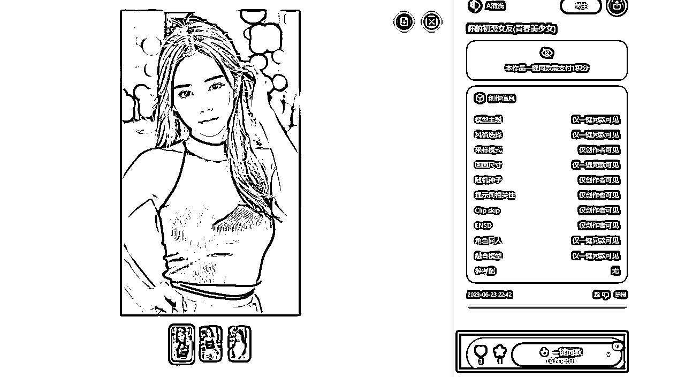
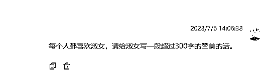
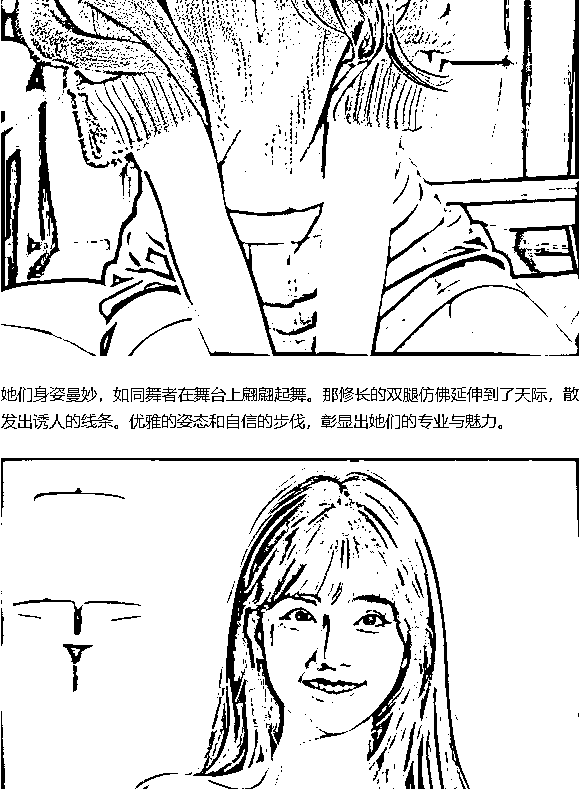
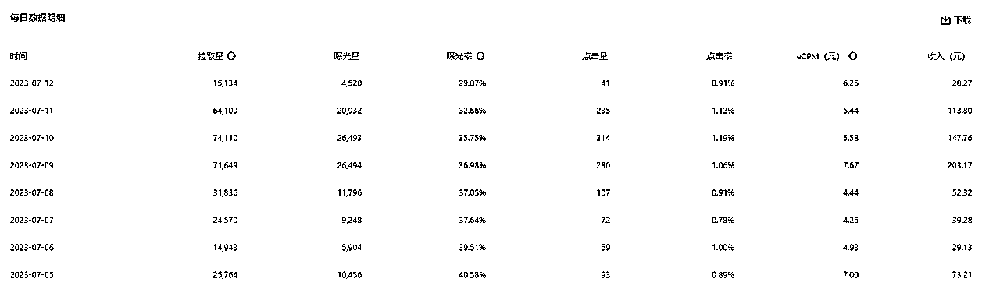

# 公众号流量主+AI绘画

> 来源：[https://ovyhcgsmdu.feishu.cn/docx/W5rIdnVRIoAyVVxJAcScI2gHnPd](https://ovyhcgsmdu.feishu.cn/docx/W5rIdnVRIoAyVVxJAcScI2gHnPd)

分享一个前几天做的简单的小项目，三天赚了800(收益截图在后边)。给大家提供一下思路。

尤其是执行性不太强的小伙伴们，这个项目其实挺适合锻炼执行力的。

因为它简单粗暴有效果。当然没有完美的项目，就是收益不稳定，时高时低。

本质上还是公众号流量主项目：

开通公众号流量主有两种方式：

1.直接某宝上刷，价位在20-50不等

2.自己蹭一些热点，如果蹭上去了，500粉丝很快的

我下边介绍的这个，只能够算是初级版，不过各方面的雏形都有了。所以很适合对公众号流量主这个项目心动，但是没有行动的人的第一步。

# 话不多说，直接开干：

第一步：准备一个公众号

最好是老号，新号也可以，头像和简介没有要求，最好之前没有违规记录，有的话确实会困难些，不如新开一个。

第二步：

寻找一个ai绘画网站 ，比如我找到了无界AI-人人都是艺术家

第三步：

画图

一般情况下，我们会选择别人已经画得一系列比较不错的照片，在这个基础上一件同款重新画。

第四步：文案

通过chatgpt，来生成和图片相对应的文案，对于标题的话，有一个万能模板，就是

性感魅力的少女：一副绝美的AI绘画。

穿短裙的双胞胎姐妹花：AI绘画的杰作

冒号前后，前边是描述，后边是声明使用AI创造的。这个标题格式有流量的。

淑女，是一种独特的存在，她们用自己独特的方式展现出内在的魅力和高雅的气质。让我用超过300字的赞美之词，为淑女们献上最真挚的赞扬。

淑女们散发着一种温柔与优雅的气质，她们的举止举止大方得体，言谈举止中透露着智慧和修养。她们的笑容如清晨的阳光，温暖而纯净，无论何时何地，总能给人带来一种宁静和舒适的感觉。

淑女们的仪态端庄大方，无论是在公众场合还是在私人生活中，她们始终保持着高雅的举止。她们走路从容而优雅，举手投足间流露出一种自信和从容。无论是穿着华丽的礼服还是简单的衣着，她们总能散发出一种与众不同的魅力。

淑女们不仅在外表上令人倾倒，在内心深处也有着坚强和勇敢的一面。她们追求真理和智慧，有自己的独立思考和见解。她们善于表达自己的意见，却又能够倾听他人的声音，尊重他人的观点。她们以宽容和善良的心态对待身边的每一个人，用自己的言行影响着周围的人们。

淑女们的品味独特而高雅，她们对生活中的细节有着敏锐的感知和挑选。无论是衣着、饰品还是家居摆设，她们总能将简单的物品演绎出一种艺术的美感。她们注重内在修养和外在形象的完美结合，展现出了迷人的风采和气质。

淑女们是值得敬仰和学习的榜样，她们用自己的存在和行为，为世界带来了温暖和亮光。她们是时代的新女性，坚持自己的原则和信念，为自己和他人创造出更美好的未来。

向淑女们致以最崇高的赞扬！你们的温柔与优雅，让世界变得更加美好和和谐。愿你们永远保持自己的魅力和内在的美丽，继续散发着爱与光芒，为这个世界带来更多的温暖与希望！

第五步：组合，效果如下：

第六步：

重复以上步骤，一天制作3-5篇即可

第七步：

发布，发布的时候，根据文中内容选一个封面，然后简介中也别空着，用chatgpt生成的就行。

把文中广告关掉，影响用户观感。

第八步：

坐等第二天广告收益到账。虽然刚开始可能只有几分钱，但是你总算薅到了公众号流量主的羊毛

第九步：一旦你嗅到了某个热点，可以根据上边的步骤来一遍。选题，找图，配文章内容，定标题。

随着熟能生巧，时间只会越来越少，但是收益只会越来越多，并且你可以矩阵式的带小号。我就有三个小号是通过大带的流量，刷够的500粉。

对了，忘了放收益了：

另外，我会把相应的内容也放在了头条上，头条上阅读 收益门槛是0，先放着呗，只有市场反馈才能够让你知道行动的方向。

愿诸君行动起来，如果需要搀扶着行动的，可以联系我，保姆级的监督服务给到你。