# 小红书店铺百万营业额实战经验

> 来源：[https://eulbg0ph20.feishu.cn/docx/W9XadHymEozXKqxtJU8c3bbpnix](https://eulbg0ph20.feishu.cn/docx/W9XadHymEozXKqxtJU8c3bbpnix)

哈喽大家好，我是陶金金

简单介绍：全网ip陶金金/阎老板，粉丝20万+，互联网从业5年。玩赚抖音视频号小红书。2020年操盘千川投放全品类累计千万（茶叶类头部前10皆有合作），2022年微信视频号做护肤品月均百万GMV，2023年的主要研究小红书店铺：目前操盘女装单月百万营业额、家纺水果女鞋等品类累计百万

——————————————————————

今天跟大家分享【小红书店铺单月营收百万】的一些心得～

在做的各位如果做了小红书店铺，就会发现：

小红书出单其实很容易，但不会轻易爆单，更不会极其容易持续的爆单～

<h7>首先我们可以探讨一个问题，一个小红书店铺在不直播不投流只发笔记的情况下，一个月的营业额到底可以有多少？</h7> <h9>大概可以分成4等级（自认为），50万到500万之间（1），100000-50万之间（2），5000-100000之间（3），5000以下（4）</h9>

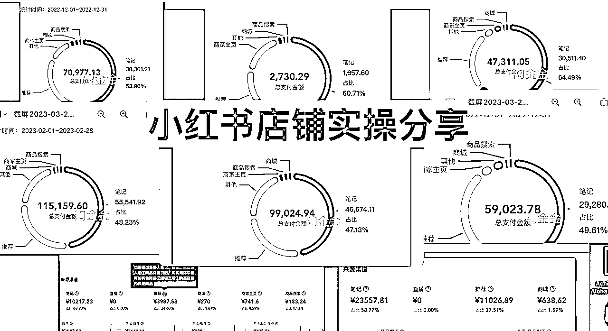

<h9>大部分新手上车，可能是4级3级的水平，如果加入付费投流和直播带货，大概能✖️2-10倍，如果任何一个效果出众，比如投产很大，比如直播效果非常好，要在10倍20倍甚至30倍以上了（此发表数据皆金金日常接触的数据分析，仅限参考）</h9>

那么单独靠自然流就达到1级水平的，真的存在吗？存在。

<h9>__________________________________</h9> <h9>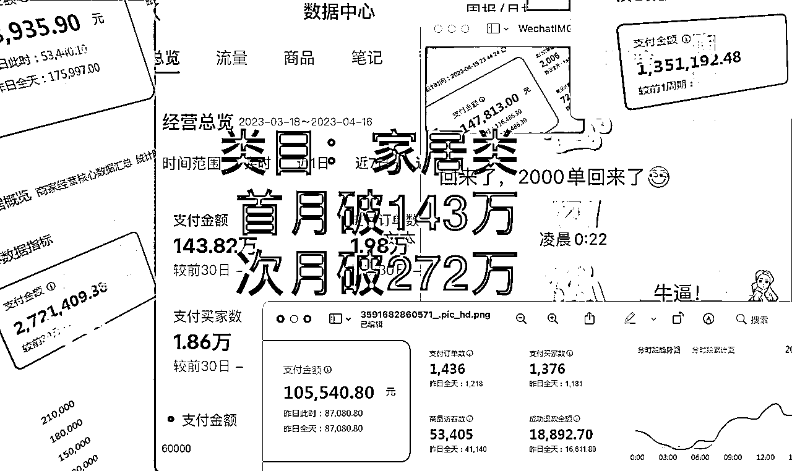

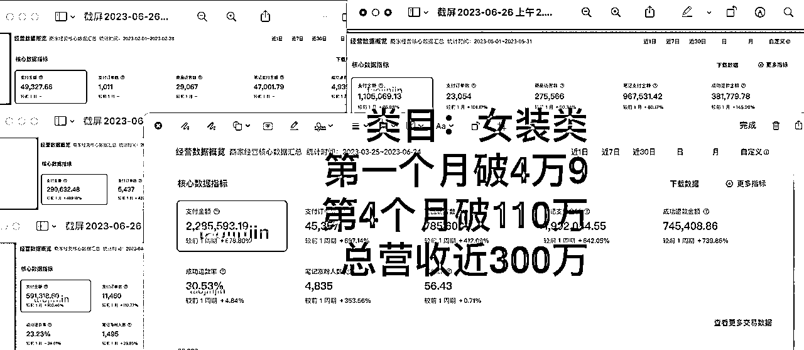

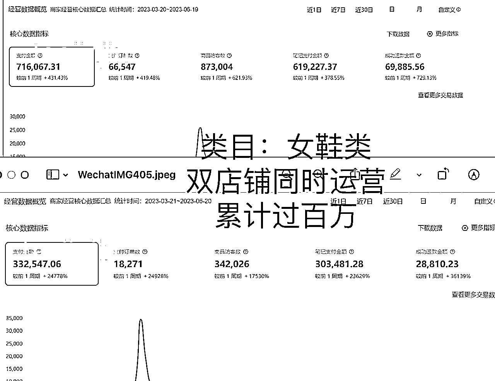

<h9>很多1级水平破百万的，大都是做矩阵店铺，这也是成功率大，简单粗暴的方式，也有一些朋友早期做小红书矩阵店铺达到千万级别，财富小自由了。</h9>

### 我们进入主题：当下一个小红书店铺能够做到一个百万数据，0直播，0投流，只是每天发发笔记就得此成绩，我们需要做对哪些事情呢？

 <h9>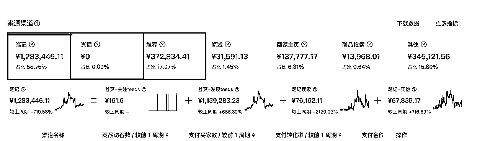

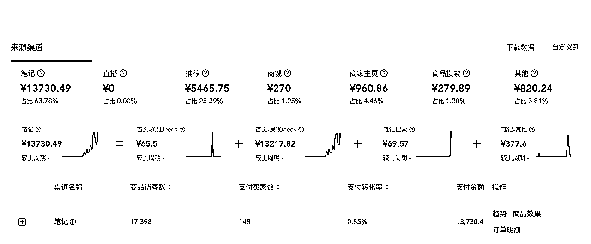

### 1.坚持上新品，同时延长爆款的生命周期

如果卖的产品是女装，建议提前布局好货盘，笔记要及时挂车新品，目的就是测款，测哪个款卖的好，哪个款卖的不好，把时间和内容都放在爆款上面。女装在抖音还是小红书，任何形式下的带货，你都会发现，女装靠爆款，总是有那么几个款爆单了能带动整体的营业额，

看下我们这个200万退货率不到30%的小红书女装店铺，也是如此。我粗略的数了下上架了180个左右的款，有2个款销量过万单，7个款过千单，24个款过百单，97个款百单以下。共计130个（左右）产品出单，还有50个产品是0

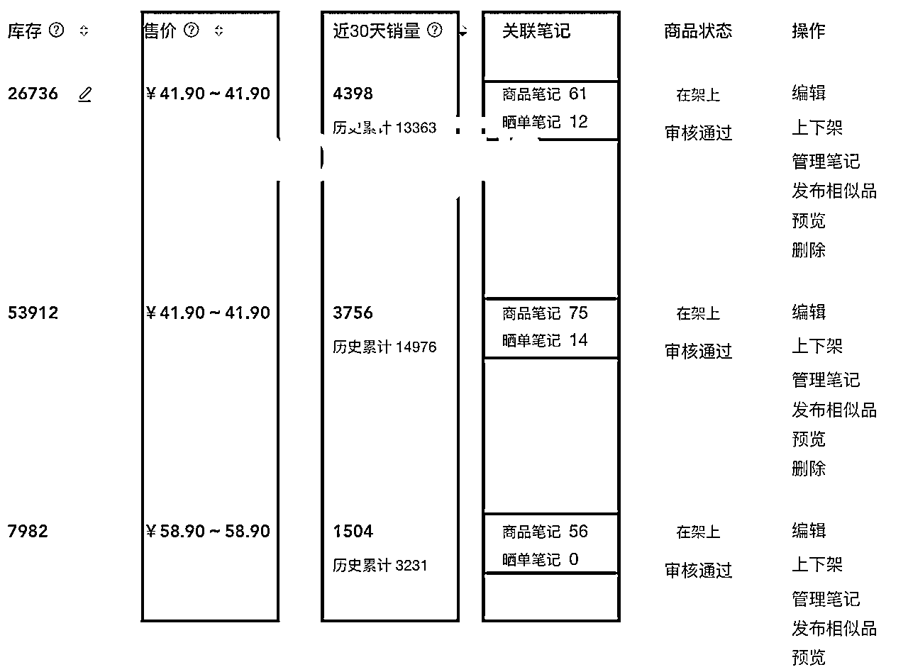

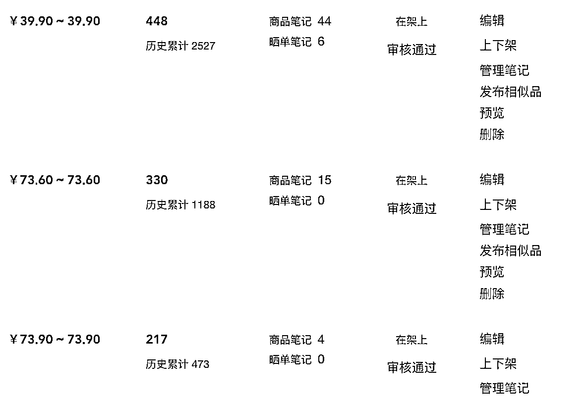

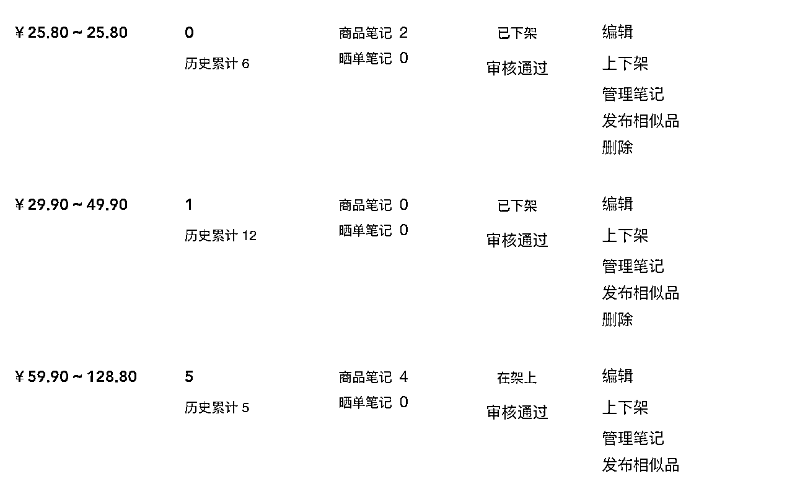

品一定要多上，但不至于一天上架几千单，一周上架几个新款就够，不断测试哪个款出单数据好，哪篇关联的商品笔记出单多，自己设计一套比例，每天发布3-5条笔记里，3条可以关联出单过的款（同时测试笔记封面哪个更受欢迎等），两条测试新款，号是需要养的店铺是需要养的，不上款，你永远不知道当下时间，什么款更容易爆单，什么款更受大家的喜欢。毕竟，产品是有季节性的，笔记也是有时效性的

除了女装，在小红书很多的产品都是靠好看的颜值取胜，比如穿戴甲，比如鞋子包包毛绒玩具等等，什么好看，交给观众判断，而不是自己判断

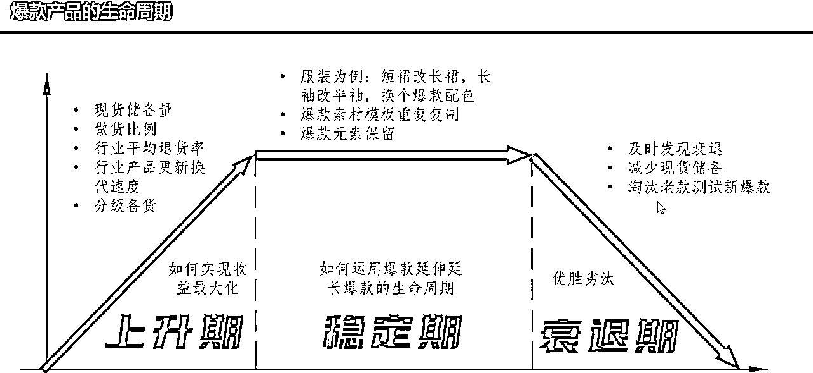

当有了爆款后，并不是一直卖一个品，但可以一直以这个品为模板，延续它的生命周期，比如一条无袖的连衣裙火了，卖了半个月，热度有些下降，这个时候，我可以把这个款改成一个长袖的连衣裙，同样的颜色同样的领口同样的面料，再过半过月，我又可以继续优化一下，比如本来是无袖短裙的连衣裙，我加长一下，长裙的无袖连衣裙，它又会火。类似的放法我们屡试不爽，小红书抖音都是如此！！！！

### 2.“爆款笔记是重复的”

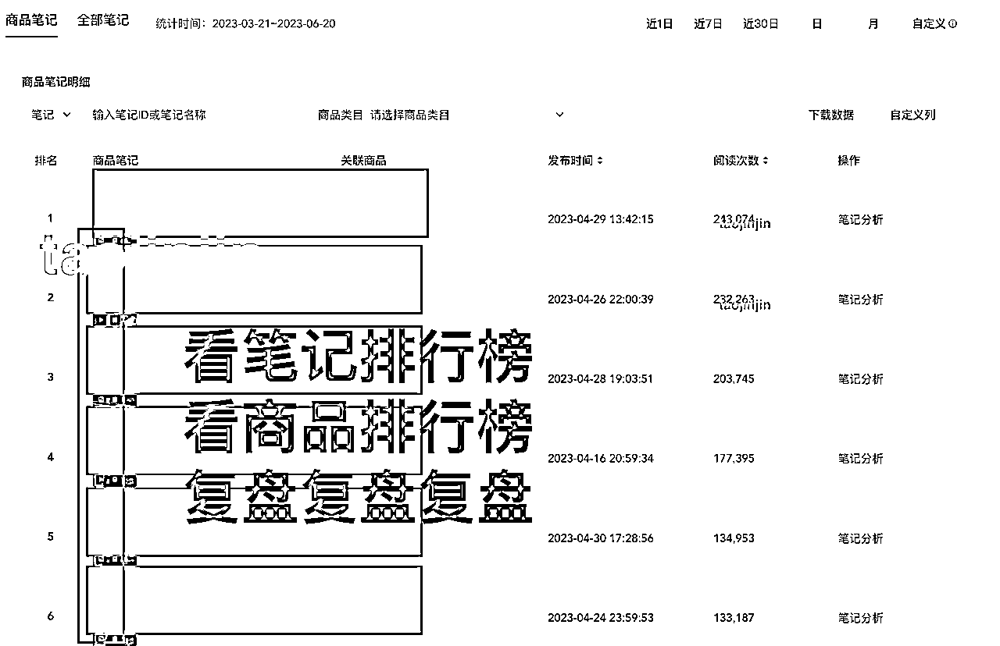

（笔记排行榜一眼望去，封面都是一样的，但看左下角，有的是图片形式，有的是视频形式）

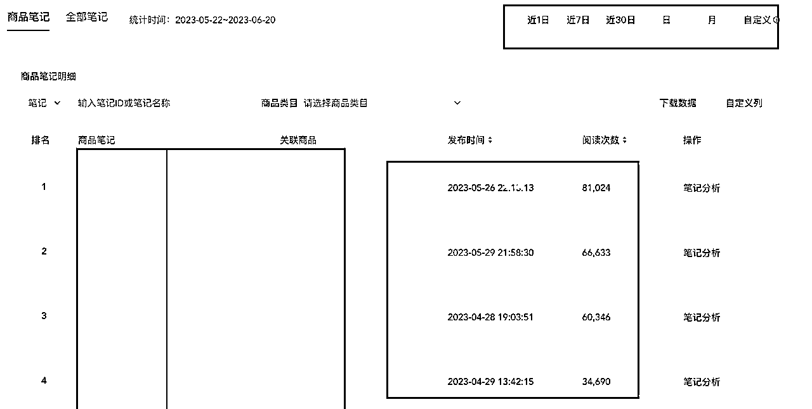

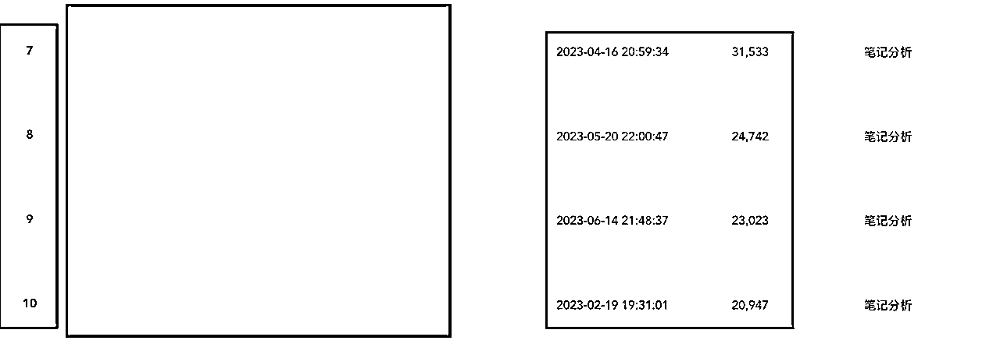

根据笔记阅读量的排行，近30天，近90天的排行，你会发现，爆款笔记是可以百分百重复的，比如我的笔记排行前10名的笔记封面，几乎都是同一张图，不同点：BGM不同，配音的音色不同，标题有所洗稿，文案有所洗稿，有的是纯图片挂车笔记，有的是图片生成视频的商品笔记，但发布时间有的是4月份，3月份，5月份，

拆解爆款笔记的爆点是什么，一篇笔记的构成我们可以拆解成“封面+标题+文案”封面占比50%，标题占比30%，文案占比10%，还有10%靠运气。对于带货笔记而言，我会觉得10%里面的5%是靠选品

封面：封面就参考拼多多和淘宝的封面，虽然是不同的平台，但封面的重要意义都是一样的，他们为什么选择这张图片而不是那张当作封面，其实都是经过大量的数据和测试筛选的，我们要做的事情的同行已经帮我们走了大半弯路了，干哈不抄近道走呢，像有结果的同类产品的封面学习，搬运，就完事（注意封面搬运，内容不管是图片还是视频都要做更多的细节处理，小心被识别违规）

听起来你可能会觉得夸张或者震惊，怎么可能都是封面是一模一样，但爆款逻辑的背后就是这么简单，没有什么花里胡哨的各种论有的就是，你要爆单，就要出爆款笔记

爆款笔记但凡有一条，你就可以持续的优化式复制（怎么复制，就好比你把你的原型笔记当作你要搬运的笔记，你会怎么做？一系列洗稿、搬运的动作都可以做）

其次标题和文案：我们的挂车笔记都是商业化笔记，完全可以照搬我们做其他电商平台的思路，比如9.9的营销策略，都是可以应用在小红书上面的，数字+小表情+感叹号+夸张语气词不可缺少。

选品：在小红书上面只要选择女生能买、吃、穿等的产品几乎都是有市场的，大类目无需过于纠结，但在大类目下的小类目其细分赛道，就要认真选选品了。好比女装类，一定要先从人群方面确定好

记住一句话，就是抄，抄同行是最好的方式，同行卖啥你卖啥就完了

可以看下爆款笔记排行榜（上面的图片），右边的日期，事实就是证明，生出一个爆款笔记，必须！要持续复制！因为你永远不知道哪天能火！但你能做的就是！发笔记！因为你比别人有更大的优势，就是你掌握的你的爆款笔记

所以当你有了，只要你持续去做的这个事情，每天3、5篇笔记输出，选选新品，你会过的非常舒服，一个月20万的利润真的就是躺赚

### 3.关于选品/对标同行/团队运营

关于选品/对标同行/团队运营之前在2月份航海的时候跟大家分享过，大家可以点击这个蓝色字体链接：小红书的干货分享，查看

（补充一句选品）选品：在小红书上面只要选择女生能买、吃、穿等的产品几乎都是有市场的，大类目无需过于纠结，但在大类目下的小类目其细分赛道，就要认真选选品了。

记住一句话，就是抄，抄同行是最好的方式，对标好你的同行，同行卖啥你卖啥就完了，你的弯路他都帮你走完了

### 4.根据后台人群定选品策略

比如一个还没有开通店铺的小红书账号打算开通店铺卖货，目前现状为：穿搭账号，粉丝占比95%以上女性，其中25-38岁占比最高，超过50%以上，其中爆款视频最多为通勤风，后台查看粉丝消费能力占比区间为200-500元，请问这个账号应该怎么选品？（看到这儿大家可以思考一些）

答：穿搭账号，一级品类为服装：粉丝95%女性，25-38占比50%以上，唯品类为中淑女装，拍的最火的是通勤风穿搭，风格为通勤风，粉丝消费200+占比最多，定位中高端；最终信息汇总产品定位为中高端通勤风中淑女装

我们也可以通过现有的店铺定位，风格、年龄、价格，比如自己就喜欢简约风就可以卖此类风格，再往下定位一些关键点，比如均价50元，小红书中消费人群，18-30岁为主

那可以卖什么呢？

可以卖T恤，那么T恤无非就是找爆款的关键词，比如今年比较火的U型圆领T恤（比较粗略的自己有个方向，但框架已经出来了）

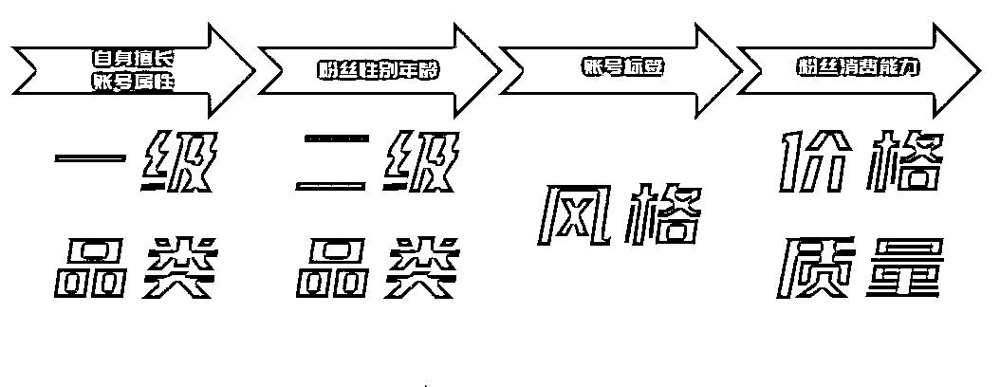

无非从以上纬度，找准自己的店铺定位。

当实践出一定的数据后，要在跟后台的人群画像继续优化

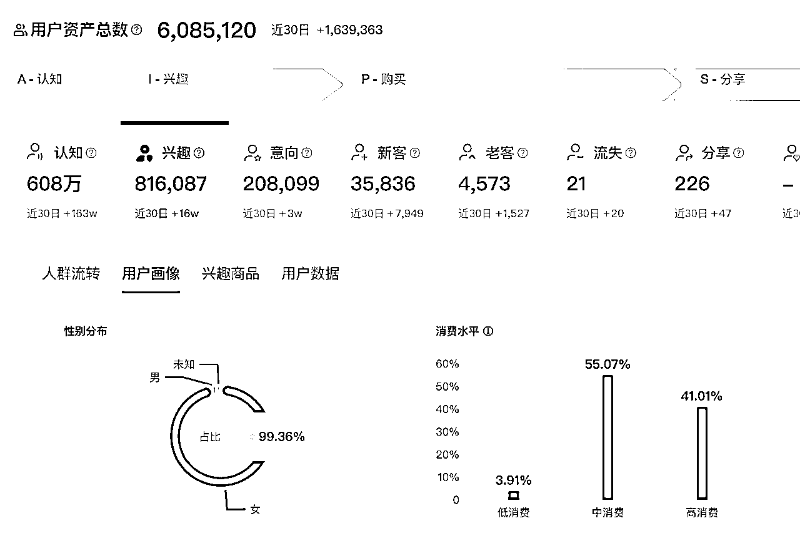

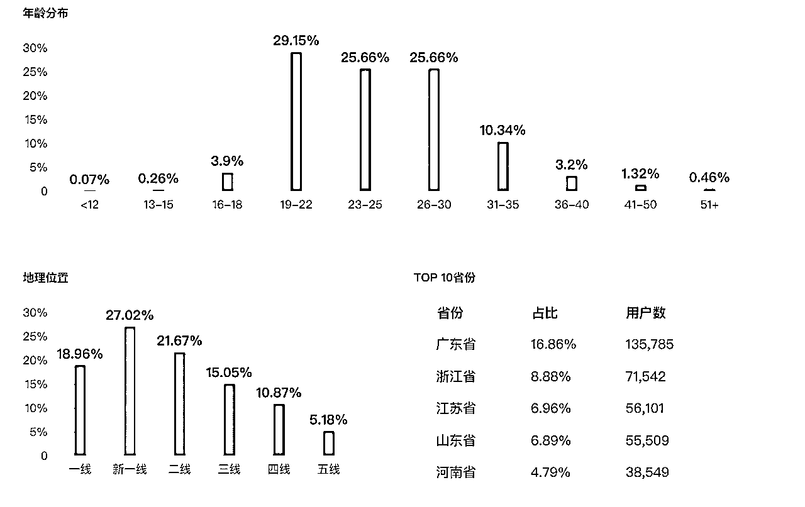

后台数据给我们的反馈，能让我们更加肯定，我们的受众人群是那一类，根据人群画像继续优化笔记的选题方向，乃至更加精细化运营笔记，比如女大学生占比多，可以从标题话题等切入女大学生关键词，可以从制作视频的BGM优化当下比较流行的音乐，可以优化买家秀场景化的晒单笔记（宿舍场景化买家秀），等等

### 5.店铺违规被扣分真的不可怕

做小红书店铺，大家的心态一定要放平，平到就是写日记，给身边的好朋友分享种草笔记的心态，过于把小红书当作营销的敲门砖，就会过于重视平台的任何小动作，比如说分数

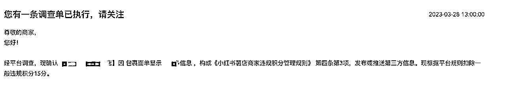

这个就是我上面说的那家近300万营业额的女装店铺，这个做女装的学员也是无货源（我们大部分人都是无货源），但当时没处理好拼多多的面单问题，出现了客户投诉，官方扣分的情况

这个时候！！！！！！！！！！！！！！

很多很多老铁的第一反应不是任何的补救动作！而是直接弃店而逃！咱就是说在座的各位尤其是新手，有多少人面对官方的警告处分的时候，会觉得“以后发笔记肯定不给推荐了”“店铺肯定不出单了”之类的大冤种的想法～

如果真的，不小心，触碰了规矩收到了类似的处分，大家一定要沉住心继续做下去！真的小眼睛0的时候放弃也不迟！

这个学生就没有理会，笔记继续钻研，货盘继续钻研，3月营业额29万（月末扣分了），4月破了59万！5月破了110万！！！！！！！！！！！！！！！！！！！！！！！！！！！！！！！！！！！！

所以大家，坚持本心做好自己该做的内容，你给官方贡献好GMV，官方给予你的保护伞也会越大！！！！

### 6.小红书直播带货,月过百万很轻松

99%做小红书店铺的新人玩家，不会接触直播带货

原因：没意识到，不会，做过没效果等

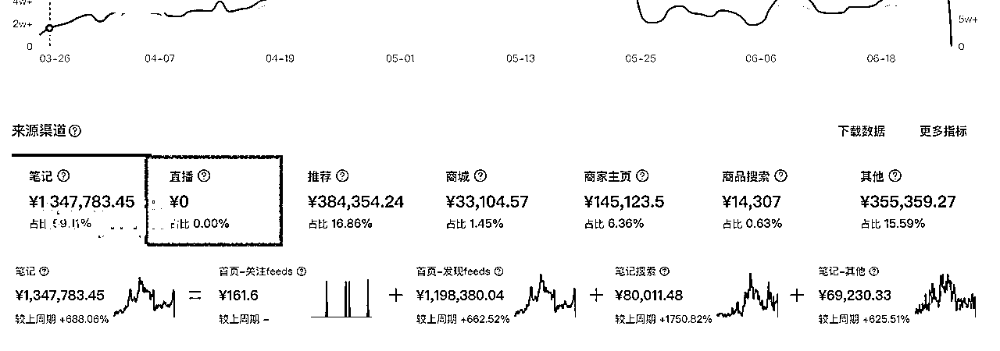

这是近3个月，0直播，纯靠笔记的女装店铺，是200万+

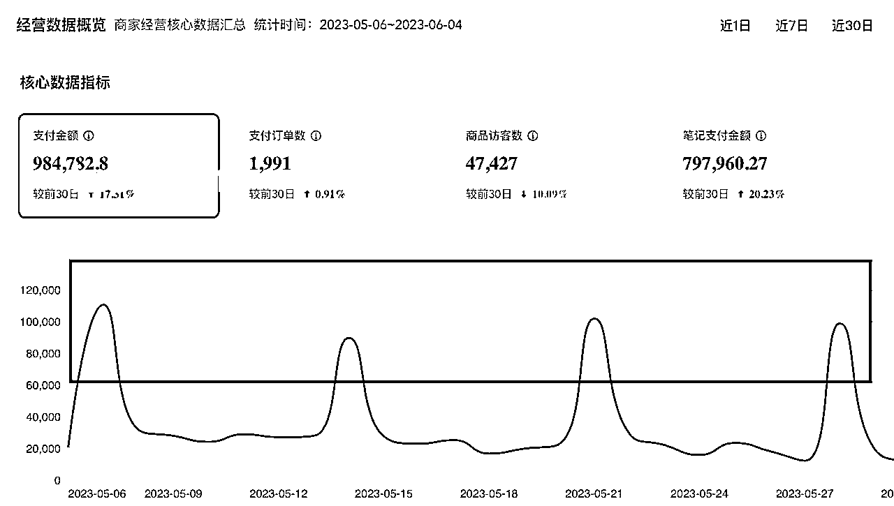

这是另外一个做女装店铺，一个月只播4场直播的数据，也是纯自然流，很明显看到纯靠笔记日营业额在2万左右，但是直播能在10万以上

这个概念就是，同样的账号基础，直播带货单日过10万营业额很稳，单如果只靠笔记单日过10万，就是佼佼者中的佼佼者中的佼佼者..........

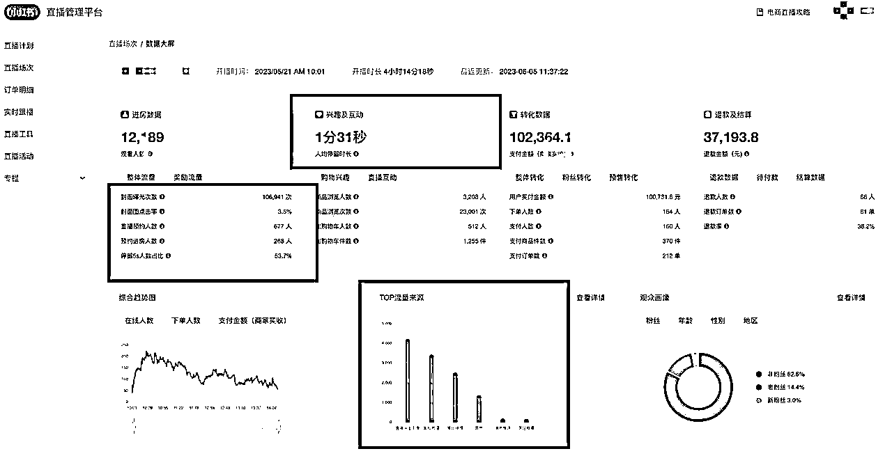

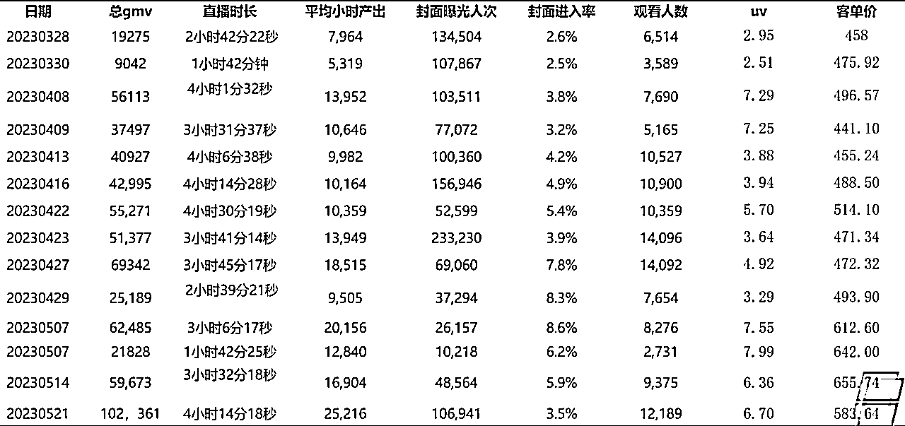

这是我们自己统计的某个店铺的直播数据，大家可以看看，

<h9>那么，小红书店铺靠直播带货，GMV过百万需要注意什么？</h9> <h9>（1）笔记越垂直越好，比如穿搭博主卖女装，而不是发各种生活照自拍照卖各种东西，直播带货的定位是跟笔记挂钩的</h9> <h9>（2）蓄水期越长，对GMV越有帮助。</h9>

什么是蓄水期？

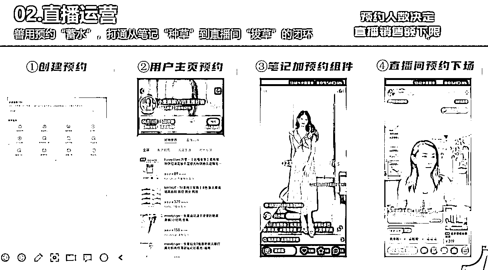

这个蓄水的意思，就是小红书的直播预约功能，提前把直播预约发布出去，在直播前期一直做直播的预热动作，比如发布笔记预热，比如粉丝群里互动

这个蓄水跟抖音也是有些区别，不可能指望小红书靠一场直播达到董洁的水平

如果大家玩过抖音的话，一定体验过抖音的爆发性，比如我们把自己的货品分成ABS级等等，S级就是大爆款，A级可以是潜力可持续出单款，B级可以是垃圾款之类的。S级一旦上小黄车就会疯狂购买，这个时候，同样的主播，同样的团队，同样的账号运营内容，在抖音上播S级的时候，抖音200人在线可能会瞬间几千再到几万，小红书200人在线可能就是500到600然后1000这样了。

小红书爆发性太弱，我们也测试一些数据，同样的风格，货盘，量级，同样的时长，小红书15万，抖音45万，抖音是小红书的2-5倍。

为什么我们有的店铺，小红书就是一周播1-2场 ，抖音能天天播，为什么小红书不做抖音的日不落，归根结底就是平台（算法）问题，也可以理解为玩法不同，但结果相同，如果每天开播大概就是每天2万，加起来一周14万，但一周蓄水一次一周开播一次就14万，多预热罢了，7份精力的回馈和一次精力相等，那为啥我要7天呢

所以这里也能看出一些弊端，百万可以达到，但不是一下子达到，天花板稍低

直播带货这块，小红书在粘性层面比抖音还是牛很多，小红书的用户很多都是买一件后小黄车的产品全部都买一遍，抖音类似用户很少

<h9>（3）小白不要一上来就直播带货，先把笔记运营好，涨粉几千的时候在研究直播带货是最好的，我们都是过万在做直播带货，测试数据，几百粉丝做直播带货一个是煎熬，一个是推流效果不大</h9>

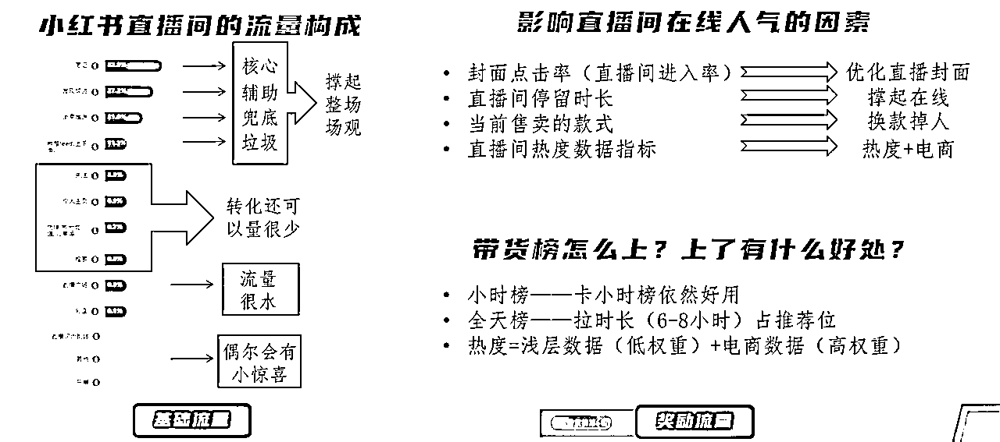

这个构成图大家可以参考，影响小红书的直播带货的维度有哪些，点对点提升自己的直播能力，效果一定不会差

今天跟大家就分享到这，我个人认为能够做到百万的小红书店铺，一定会存在运气，但如果没有以上的基底，这个运气找上你你可能也接不住，拥有自己坚实的后盾，把账号运营好，笔记永远是核心，等待你的也许只是一个时机。

最后最后，想说一句，我发现身边做小红书电商贼优秀的人的特质，首先就是非常认可小红书这个平台，认可小红书能变现！你抱着怀疑的眼光来做事，你一定做不好！再者就是心态，这个月没赚到钱没关系，多复盘，好好运营，不要把小红书笔记写的过于商业过于广告，你是来种草你的产品，不是推销。多实践多体会多优化一定会有数据，很多人就是半途而废，或许你在坚持多发一篇笔记，或许它就成为了爆款笔记，有时候，只是差了一步而已</h9></h9>