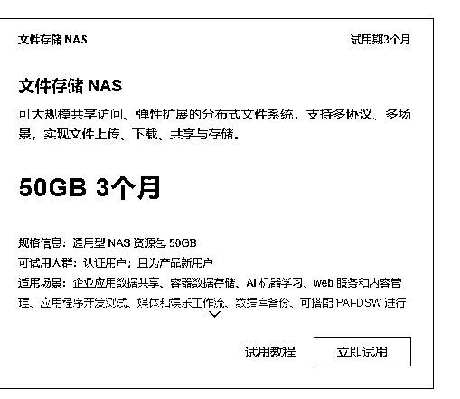
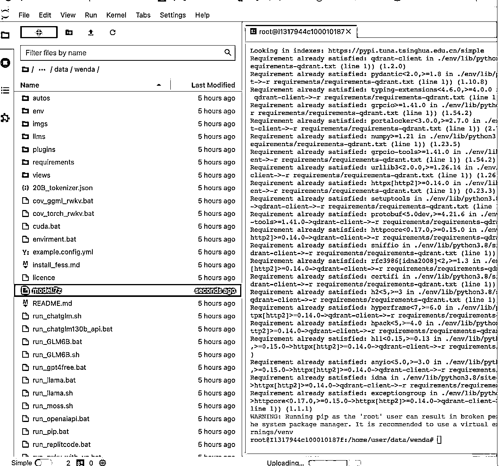

# 训练专属私有模型搭建企业知识库

> 来源：[https://l0lupq5bcjq.feishu.cn/docx/WETgddhGpoDwsUxlyrMcNqD7nnd](https://l0lupq5bcjq.feishu.cn/docx/WETgddhGpoDwsUxlyrMcNqD7nnd)

大家好，我是峰兄。

本文是Prompt三部曲的第二篇《训练专属私有模型搭建企业知识库》，第一篇《一文讲透ChatGPT及如何正确提问》。第三篇《调优Prompt为各行业赋能》已经在路上，希望各位老铁一键三连，给点鼓励，我会创作更多优质的干货文章感谢大家的支持。

其实很多企业或个人都有这样的诉求，打造一个属于自己的个性化的AI助手，从而可以解放双手，将重复的问题交给AI，降本增效，把精力用在更重要的事情上。

针对个人，可以打造个人专属“数字分身”，专属个人知识库。

比如前段时间特别火的AI孙燕姿；

外国23岁美国网红卡琳·玛乔丽售AI版本的自己，和1000个粉丝谈恋爱，按分钟收费，一周时间创收了7.16万美元（约合人民币近50万元），预计年入6000万美元（约4.16亿元）；

某网络大V，将自己过往的文章喂给GPT，打造了一个自己的数字分身，可以用自己文章风格自动回复粉丝问题，跟粉丝互动。

针对企业，可以构建AI客服机器人，替代人工客服，降低成本。

搭建企业AI知识库，对外，可以对合作伙伴赋能；对内，员工可以快速学习知识。

我们可以调整 prompt，匹配不同的知识库，让你的私有 LLM模型 扮演不同的角色

*   上传公司财报，充当财务分析师

*   上传客服聊天记录，充当智能客服

*   上传经典Case，充当律师助手

*   上传医院百科全书，充当在线问诊医生

等等等等。。。。

总之能做的太多太多了

这样个人和小公司都可以部署自己的语言模型，用自有的数据集训练出对行业领域和业务场景有着深刻理解的语言模型，还避免了用户的数据可能泄露到第三方，公司训练自己的语言模型可以在专业性、差异性、可控性等多方面为产品和业务带来很大的优势和价值。

如果你也有这样的诉求，下面的文章对您来说价值千金，因为整个过程都是经过我实操过的，是切实可行的，而且我几乎研究了市面上目前大部分搭建企业知识库的解决方案，目前这套方案应该是成本最低、效果最高、可执行性最高的，只要按照步骤操作，即使是小白也可以为自己或者公司搭建一套属于自己的专属模型，打造一个真正属于自己的个性化的AI助手！

目前这套搭建企业知识库的解决方案已经在多个行业的公司落地，一家报业公司使用这套方案做了内部的企业知识库，反映效果还不错；还有一家电商公司也在用这套方案做自己的智能客服系统，目前还在持续优化中。

本文内容有点多，为了让大家能把握住重点，先列个大纲

一.为什么要搭建自己的私有模型？

二.基于类GPT的大模型和私有数据构建智能知识库和个性化AI的应用场景

三.如何构建一个个性化的垂直领域的 LLM 专属模型

四.服务器如何选择

五.项目离线私有部署实战

## 一.为什么要搭建自己的私有模型？

我们都使用过ChatGPT，也能感受得到他的大模型能力。但是他也有自己的缺点。比如：

1.数据安全无法保证，数据都是直接发送给ChatGPT,存在泄露私有数据的风险。

2.无法做到个性化定制。每个企业或个人的要求都是独一无二的，而ChatGPT无法做到针对相同的问题，基于企业或个人的实际情况，给出更加智能个性化的回复。

更多的原因我就不一一列举了，相信每个人使用过GPT的人都是有一些自己的想法的。

## 二.基于类GPT的大模型和私有数据构建智能知识库和个性化AI的应用场景

✅ 更智能，基于ChatGPT大模型算法，回答准确，逻辑清晰

✅ 更安全，支持私有化部署，文档数据本地化，安全可控

✅ 更全面，可用于企业AI客服，企业内部知识查询&经验分享，员工自助服务，赋能企业外部合作伙伴、个人知识库等场景

基于ChatGPT和私有数据构建智能知识库可用于AI客服机器人、企业AI知识库、个人知识库等场景，可以扮演客服、销售、培训师、营销人员、行业专家等角色。通过录入文档或问答来创建知识库，让机器人学习，根据机器人训练情况可随时删除或替换文档。

## 三.如何构建一个个性化的垂直领域的 LLM 专属模型

## 1.这里补充一下目前主流的训练模型的两种方式Fine-tuning和Embedding。

### (1).基本概念

*   Fine-tuning（微调）：Fine-tuning是指在预训练模型的基础上，使用特定的任务数据对模型进行重新训练，以适应具体的应用场景或任务。通常，预训练模型通过大规模数据集进行事先训练，获得了广泛的语言理解和生成能力。而Fine-tuning则是在此基础上，针对特定任务的数据集进行进一步训练，以使模型更好地适应该任务，并提高其性能。通过Fine-tuning，可以使模型更加专业化，提高在具体任务上的准确性和效果。

*   Embedding（嵌入）：Embedding是将高维的离散数据转化为低维连续向量表示的过程。在自然语言处理中，Word Embedding是一种常见的技术，将词汇表中的单词映射为实数向量。这些向量在低维空间中对应着单词的语义信息，使得计算机可以更好地理解和处理文本数据。通过将词汇嵌入到低维向量空间中，可以捕捉到单词之间的关联和语义相似性，从而使得模型能够更好地进行语言理解和相关任务。

*   在使用GPT模型进行自然语言处理任务时，通常会先进行预训练得到一个通用的语言模型，然后根据具体的任务数据对模型进行Fine-tuning，使其适应特定任务的需求。同时，模型将单词和文本嵌入到低维向量空间中，用于表示和处理文本数据，从而提高模型的语义理解能力和任务性能。Fine-tuning和Embedding可以共同帮助模型更好地适应特定任务，并提升模型在该任务上的表现。

这里为了大家更好的理解，我举一个Fine-tuning（微调）的示例：

1.  想让 GPT-3 按照某种格式来识别 Prompt ，或按照某种格式来回答

1.  想让 GPT-3 按照某种语气、性格来回答

1.  想让 completion 具有某种倾向

比如不进行 fine-tune 提问

```
prompt: 
小红喜欢洋娃娃。小红的性别是？ 

completion: 
女孩，所以她很喜欢洋娃娃。洋娃娃通常有着丰富多彩的服装和装饰，可以让小红玩得很开心。此外，红还可以给洋娃娃起名字，造出一个属于自己的小世界，从而获得更多的乐趣。
```

GPT-3 详尽的回答了你的问题，但是可能你只想知道是 男 or 女。

使用Fine-tuning（微调），在 prompt 里加入示例

```
prompt:
示例：小红喜欢洋娃娃。小红的性别是？
答案：女 

下面是问题：小明喜欢坦克，小明的性别是？ 

completion:
答案：男
```

经过提示的 prompt 会按照示例的格式回答你的问题。

如果通过对大量如下数据进行 fine-tuning。

```
prompt:
小红喜欢洋娃娃。小红的性别是？ 

completion: 
答案: 女
```

训练后的模型中，按照 prompt 格式书写，那么 completion 会自动按照期望的格式返回，而不是返回其他内容.

类似于 Masked Language Modeling（MLM） ，系统会将回答识别为「答案: [mask] 」，模型去预测 mask 的内容，或者理解为「完形填空」

### (2).Fine-tuning和Embedding的区别

*   微调就像你通过学习准备考试，是一种长期记忆，但过了一周后考试来临，模型可能会忘记袭击，或者记错它从来没有读过的事实。

*   嵌入就像记笔记，是一种短期记忆，当考试的时候，你把笔记带上，随时翻看笔记，对于笔记上有的内容可以得到准确的答案。

*   另外嵌入的搜索提问方式相对于微调有一个缺点就是它每次附带的文本数量是有限制的，因为除了原始的问题，它还需要带上搜索出来的问题，GPT-3.5是4K（大约5页），GPT-4最大是32K（大约40页）。 就好比你有成书的教科书可以借鉴，但每次却只能翻看其中几页笔记。

*   如果你想构建一个对大量文本问答的系统，OpenAI建议“搜索-问”（Search-Ask）的方法。 也就是先在本地文档库中Search，拿到本地的数据结果，再去Ask，把搜索结果和问题一起交给GPT，这样GPT可以根据你提供的内容以及它模型中的数据，一起将结果返还给你。

### (3).Fine-tuning和Embedding的适用场景

Fine-tuning和Embedding是两种完全不同的技术，各自适用于不同的场景。Fine-tuning更适合于教授模型新的任务或模式，而不是新的信息。例如，你可以使用Fine-tuning来训练模型生成特定风格的文本，或者执行特定的NLP任务。然而，Fine-tuning并不适合于作为知识存储，也不适合于问答任务。

相反，语义搜索或Embedding则非常适合于问答任务。你可以使用语义搜索来快速找到相关的文档，然后使用大型语言模型来生成答案。此外，与Fine-tuning相比，语义搜索更快、更容易，也更便宜。

因此，如果你的目标是创建一个问答系统，或者你需要在大量的数据中快速找到相关的信息，那么你应该考虑使用语义搜索和Embedding。然而，如果你的目标是教模型执行特定的任务，比如生成特定风格的文本，那么你可能会发现Fine-tuning更有用。

一句话总结，两种技术的使用场景：

我有一堆语料，想让 GPT-3 依据我的语料输出内容 - 使用 embedding

想让 GPT-3 模仿一个温柔贤惠的女人和我对话 - 使用 fine-tune

希望用户按照一定格式提交问题 - 使用 fine-tune

可以根据产品的使用手册来回答用户的问题 - 使用 embedding

从上面的内容可以看出，如果我们要做一个问答系统或者企业个人知识库还是需要用Embedding（嵌入）的方式进行训练。

由于篇幅原因，接下来我重点讲清楚Embedding（嵌入）这种方式的训练流程，如对Fine-tuning（微调）感兴趣的朋友，可以网上搜一下资料，这方面资料还是比较多的。

想要实现智能AI问答功能，现在大部分都是嵌入（Embedding）的形式，基于向量数据库。

### (4).什么是向量 Embedding，如何工作？

首先，所谓向量 Embedding 简单地说就是 N 维数字向量，可以代表任何东西，包括文本、音乐、视频等等，我们主要关注的是文本。要创建一个向量 Embedding，我们需要借助于 Embedding 模型（例如 OpenAI 的 Ada），把想要处理的文本内容输入到模型里面，就可以生成一个向量表示，并把它存储起来以备之后使用。


更为直观的例子：

假设你是一个孩子，有一个大玩具盒子。现在你想找一些类似的玩具，比如玩具汽车和玩具巴士。它们都是交通工具，这就被称为“语义相似性”（事物有着相似的含义）。

再假设你有两个相关的玩具，但并不相同。例如一个玩具汽车和一条玩具道路。尽管它们不完全相同，但会被认为是相似的，因为汽车通常是开在道路上的。

### (5).如何让 LLM 读取大文本呢？

假设你有一个巨大的 PDF 文件，你很懒不想读整个文件，而且你也不能把整个文件复制进去，因为它超过了一亿页，怎么办？

我们可以利用向量 Embedding 的优势来将相关文本注入 LLM 上下文窗口。对 PDF 进行向量 Embedding 并将其存储在向量数据库中。

具体做法：

1）把 PDF 切分成小的文本片段，通过 Embedding 模型创建向量 Embedding 放到本地或远程向量数据库。

2）把用户的提问也创建成向量 Embedding，用它和之前创建的 PDF 向量比对，通过语义相似性搜索（比如余弦算法），找到最相关的文本片段。

3）把用户提问和相似文本片段发给 LLM，写 Prompt 要求 LLM 基于给定的内容生成回答，如果没有相似文本或关联度不高，则回答不知道。

这就是向量 Embedding 的最典型应用。Github 上非常火的 langchain-ChatGLM 项目，用的就是 LLM 结合向量 Embedding，来达到本地知识库问答的效果。

## 2.Embedding训练流程

项目实现原理如下图所示，过程包括加载文件 -> 读取文本 -> 文本分割 -> 文本向量化 -> 问句向量化 -> 在文本向量中匹配出与问句向量最相似的top k个 -> 匹配出的文本作为上下文和问题一起添加到 prompt 中 -> 提交给 LLM 生成回答。


从上面就能看出，其核心技术就是向量 embedding，将用户知识库内容经过 embedding 存入向量知识库，然后用户每一次提问也会经过 embedding，利用向量相关性算法（例如余弦算法）找到最匹配的几个知识库片段，将这些知识库片段作为上下文，与用户问题一起作为 promt 提交给 LLM 回答，很好理解吧。一个典型的 prompt 模板如下：

```
"""
已知信息：
{context} 

根据上述已知信息，简洁和专业的来回答用户的问题。如果无法从中得到答案，请说 “根据已知信息无法回答该问题” 或 “没有提供足够的相关信息”，不允许在答案中添加编造成分，答案请使用中文。 
问题是：{question}
"""
```

上面是目前市面上最流行的使用LangChain+ChatGLM搭建专属模型的训练流程，市面上其他的搭建流程思路都是大同小异，基本都是一个大模型的调用框架（如上面的LangChain）+一个大模型（如ChatGLM）。为什么要怎么做呢？

因为LLM生成结果的不确定性和不准确性，目前还无法仅依靠LLM提供智能化服务。因此，需要LangChain这样的大模型调用框架，其主要目标是将LLM与开发者现有的知识和系统相结合，以提供更智能化的服务。

由于很多朋友对专属模型这块了解不多，所以这里花一点时间对LangChain和ChatGLM做一下介绍，如果对这块了解的朋友可直接跳过。

#### LangChain：

LangChain是一个用于开发基于语言模型的应用程序开发框架。总的来说，LangChain是一个链接面向用户程序和LLM之间的一个中间层。

它在 2023 年 3 月获得了 Benchmark Capital 的 1000 万美元种子轮融资，在近期又拿到了红杉2000-2500万美金的融资，估值已经提升到了2亿美金左右。

LangChain 可以轻松管理与语言模型的交互，将多个组件链接在一起，并集成额外的资源，例如 API 和数据库。其组件包括了模型（各类LLM），提示模板（Prompts），索引，代理（Agent），记忆等等。

前段时间GitHub上的热门项目Auto-GPT和Babyagi所使用的链式思考能力都是由LangChain启发而来。

#### ChatGLM：

ChatGLM是国内知名的AI公司智谱AI研发的生成式大语言模型。智谱AI是由清华大学计算机系技术成果转化而来的公司，致力于打造新一代认知智能通用模型。公司合作研发了双语千亿级超大规模预训练模型GLM-130B，并构建了高精度通用知识图谱，形成数据与知识双轮驱动的认知引擎，基于此模型打造了ChatGLM（chatglm.cn）。此外，智谱AI还推出了认知大模型平台Bigmodel.ai，包括CodeGeeX和CogView等产品，提供智能API服务，链接物理世界的亿级用户、赋能元宇宙数字人、成为具身机器人的基座，赋予机器像人一样“思考”的能力。

智谱AI的目标是：让每个人都能用上千亿模型，目标纯粹且让人敬佩。

我们的例子里使用的是ChatGLM-6B 作为预训练模型，ChatGLM-6B 是一个开源的、支持中英双语的对话语言模型，基于 General Language Model (GLM) 架构，具有 62 亿参数。结合模型量化技术，用户可以在消费级的显卡上进行本地部署（INT4 量化级别下最低只需 6GB 显存）。ChatGLM-6B 使用了和 ChatGPT 相似的技术，针对中文问答和对话进行了优化。经过约 1T 标识符的中英双语训练，辅以监督微调、反馈自助、人类反馈强化学习等技术的加持，62 亿参数的 ChatGLM-6B 已经能生成相当符合人类偏好的回答。之所以选用ChatGLM-6B，一方面是它的中文支持效果好，另一方面是它的参数是 62 亿，对 GPU 性能要求相对较低，可以压缩成本。

具体细节大家可以看一下知乎上的这篇文章：https://zhuanlan.zhihu.com/p/627509623

## 四.服务器如何选择

我们的模型需要跑在服务器上，因此打造个人专属模型离不开GPU服务器。关于服务器有两个选择，一个是购买或租赁一台GPU服务器，另一种是选择类似阿里云、腾讯云这样的云服务器。两种选择各有利弊。

因为我们只是为了演示如何搭建一套属于自己的专属模型，没必要去买一台GPU服务器，大家可以在淘宝看一下，一台GPU服务器的价格区间一般是在几万到几十万，还是很贵的。


阿里云目前有免费的机器学习 GPU 服务器可以试用，免费试用活动页https://free.aliyun.com

只要没有申请过 PAI-DSW 资源的新老用户皆可申请 5000CU 的免费额度，3个月内使用。

#### 选择第一个进行立即试用


#### 可以看到试用的界面


#### 如果遇到下面的错误，当前账号没有权限开通PAI，请联系主账号。


#### 您可以前往NAS免费试用查看您的阿里云账号是否有文件存储NAS资源包试用资格，点击立即试用



这个时候再去刷新刚才的PAI开通界面，就可以看到能够点击创建默认空间了

在服务角色授权模块单击去授权，根据界面提示为PAI完成授权，然后返回开通页面，刷新页面，继续开通操作。


开通成功后单击进入PAI控制台，在默认工作空间中创建DSW实例。其中关键参数配置如下，其他参数取默认配置即可。更多详细内容，请参见创建及管理DSW实例。

【说明】：创建DSW实例需要一定时间，与当前的资源数有关。如果您使用地域资源不足，可更换其他支持免费试用的地域申请开通试用并创建DSW实例。


## 五.项目离线私有部署实战

我们上面演示Embedding训练流程的时候使用的是目前市面上最流行的LangChain+ChatGLM搭建专属模型，开源项目地址：基于本地知识库的 ChatGLM 等大语言模型应用实现

这个开源项目的文档非常详细，从安装环境、设置模型默认参数、执行脚本体验 Web UI 或命令行交互等方面进行了详细的介绍，另外也提供了项目交流群用于大家之间的相互交流。

但是我体验后发现，操作还是有一些繁琐，针对没有基础的小白比较难上手。另外，训练的效果也一般，有时候回复的内容差强人意。因此，这里就不介绍基于LangChain+ChatGLM搭建本地知识库的技术方案，而是用了另一套技术方案：Wenda+ChatGLM来搭建本地知识库。

大模型没有变，都是使用ChatGLM。但应用程序开发框架从LangChain替换成了Wenda，采用Wenda+ChatGLM后，步骤简化了不少，另外，训练的效果也很显著，大家一会可以看一下展示效果。

#### 创建个人知识库索引

*   项目根目录下新建一个 txt 文件夹，将个人知识库的文件导入其中


#### 展示效果




大家可以看到，当我们使用闻达平台搭建的企业私有知识库时，会先优先从我们投喂的知识库数据中查找，如果查到不到，再去大模型中搜索答案，因此答案还是比较精确。

PS:其实上面的话不太严谨，其实本质是：将用户知识库内容经过 embedding 存入向量知识库，然后用户每一次提问也会经过 embedding，利用向量相关性算法（例如余弦算法）找到最匹配的几个知识库片段，将这些知识库片段作为上下文，与用户问题一起作为 promt 提交给 LLM 回答，然后LLM将融合了本地知识库的答案响应给用户。

大家如果对训练自己的私有模型有兴趣，或者有私有化部署专属模型的需求，可以一起交流交流。

这里也帮我的朋友乔帮主训练了一个AI版的乔帮主，也欢迎大家向帮主提问。

训练资料文档（文档链接 ）

访问以下AI乔帮主数字分身，向帮主提问问题：

https://wenwen-ai.com/chat/share?shareId=bsljlyq1x3haih0zyt4pr2sl

感谢您的阅读，AI时代没有权威，谁先关注，谁先行动，谁在未来就能抢占更多话语权。

独行快，众行远，我是峰兄，希望在AIGC探索的这条道路上与您同行。