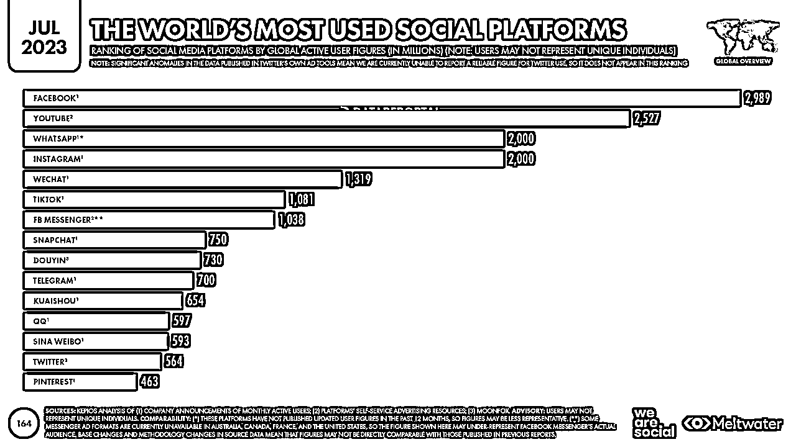
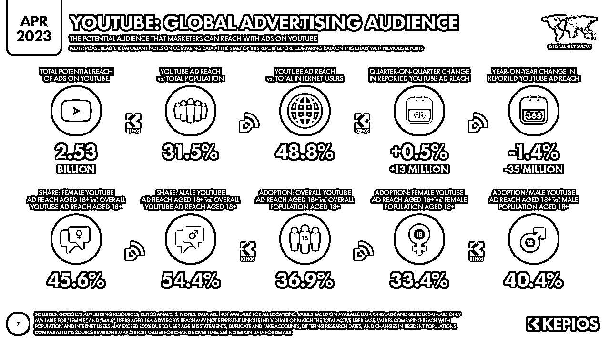
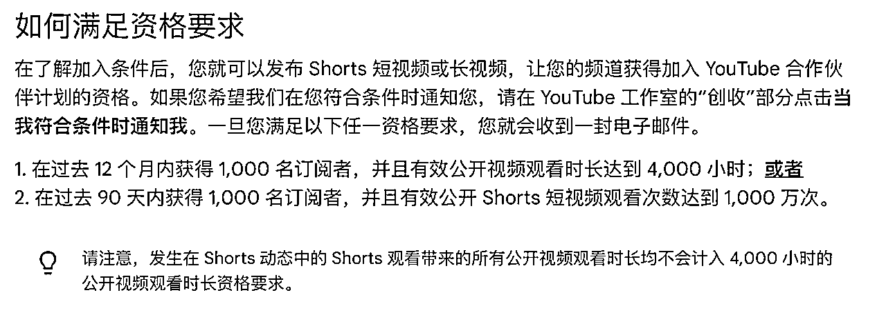
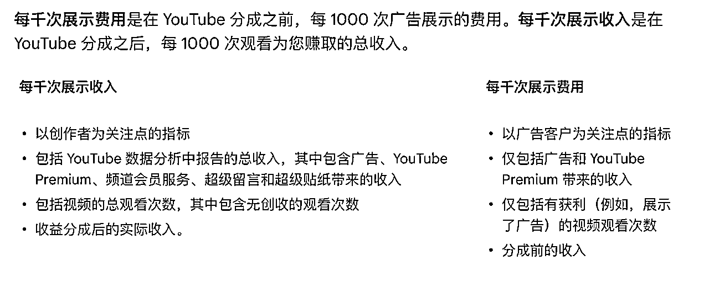
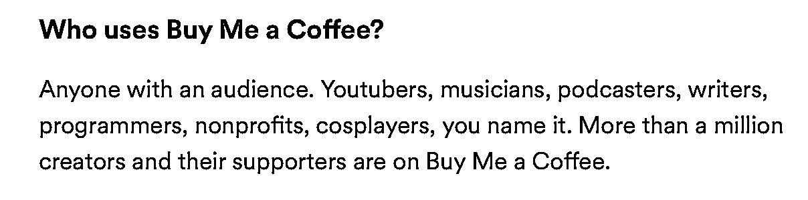
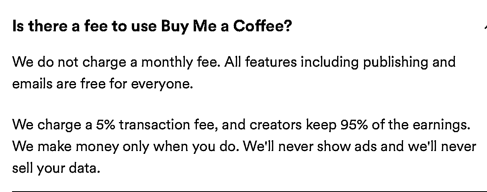
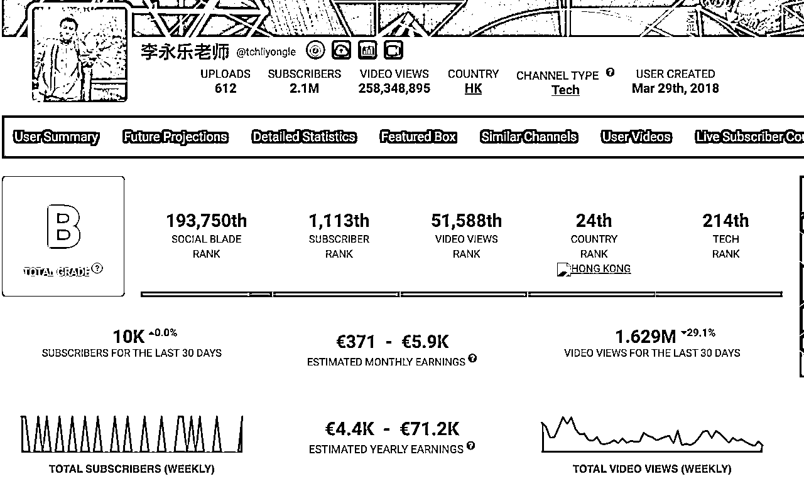
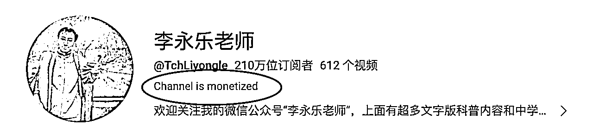

# 8种在YouTube赚钱的方法

> 来源：[https://y1em4gkc5yu.feishu.cn/docx/WJjpdMbcCoqAHRxCe7PcxaHCntf](https://y1em4gkc5yu.feishu.cn/docx/WJjpdMbcCoqAHRxCe7PcxaHCntf)

## YouTube也就是我们常说的油管,作为全球第二大搜索引擎,虽说这几年受到Tiktok的冲击,不过依然保持月活20亿+,在中长视频领域依然是当之无愧的全球霸主,其中的shorts(短视频)也在21年7月上线.今天就给大家说一下在YouTube平台赚钱的8种方法.

数据来源:https://datareportal.com/essential-youtube-stats?rq=YouTube

## 广告收益

1.  广告主投放广告-广告会放置在我们视频的开头、中间、或是结尾.

1.  广告分成:博主55%,YouTube平台抽成45%

1.  需要申请"YouTube合作伙伴计划"

1.  订阅粉丝数达到1000

1.  一年的累计观看时长在4000个小时以上

1.  如果是Shorts创作者,需要在90天内达到1000粉丝,且有效观看时长达到1000万次

1.  注意:广告收益是按照广告的有效播放次数来计算的,而不是视频的播放量,一般广告分为以下两种.

1.  Trueview广告,观看5秒可以跳过的,这种广告只有当用户播放到30秒或者小于30秒的广告播放完成才算有效播放(这也造成了广告的卷,尽量做到前5秒就要足够吸引人)

1.  不可以跳过的插播广告,这类广告时长不会超过15秒,用户是无法跳过的.

1.  有2个关键的指标用来查看频道的赚钱能力,分别是CPM 和 RPM

1.  CPM(千次展示费用):计算方法是广告收入/有效视频播放量*1000,衡量的的是广告收入能力(广告主最看重的指标)

1.  一般CPM达到30及以上就是高质量的频道了,10-20是普通水平,10以下就是比较差了

1.  RPM:千次展示收入:计算方法是所有频道收入(包括广告,会员频道,打赏等)/视频总播放量*1000,衡量的是该频道总的收入能力

1.  区别:

1.  通过Google Ads的"关键字规划师"工具,可以查看对应领域的关键词的历史广告报价.

## 联盟行销

1.  联盟行销(Affiliate marketing),简单点说就是分销.

1.  YouTube平台是不限制你往外部引流的,我们可以在视频中引入产品或者服务,比如可以在视频中插入链接或者是在评论区置顶链接,只要通过我们的链接购买商品,我们就有佣金收入.

1.  国外有很多成熟的联盟交易的平台,比如Clikbanc、Amazon,也可引流到Shopify或者自建站等等.

1.  联盟行销的优点是不需要粉丝数量(即使是0订阅也可以),而且大量的联盟也有海量的产品供你选择,当然,也要尽量选择符合自己频道定位的产品或是服务.

## 频道会员

1.  频道会员机制,粉丝通过付费加入该频道,付费频道一般会有会员专属视频或者专属直播等

1.  分成:博主70%,YouTube平台抽成30%

## 超级留言和超级贴纸

1.  这是粉丝与创作者在直播和首映期间进行的2种互动形式(因为一般视频是只能在评论区评论的,只有直播和首映有实时聊天功能)

1.  超级留言就是类似于聊天频道的VIP,实时的聊天可以突出显示,价格在1美元到500美元不等,粉丝自己定价支付,出价最高的留言会显示在顶部(有点竞拍的味道)

1.  超级贴纸是可以在实时聊天中发送动画图片,贴纸价格在99美分-50美元不等

1.  分成:博主70%,YouTube平台抽30%

## 超级感谢

1.  类似于打赏

1.  分成:博主70%,YouTube平台抽成30%

1.  也可以接入外部平台打赏,手续费低很多,比如Buy Me a Coffee,只抽5%.

1.  Buy Me a Coffee平台

## 带货/知识付费

1.  Youtube也可以是一个你展示自己的平台,如果你有好的产品或者服务,完全也可以卖自己的课或者服务.

1.  因为不限制引流,所以你懂的.

## 商业合作

1.  当你的频道越做越好,自然也会有对应的品牌商家来找你合作.

1.  不同的品牌会有不同的要求,需要根据品牌方的要求来制作视频或是植入广告等.

1.  价格通常根据频道的粉丝数和播放量来算,参考价格:播放量*(6美分-25美分)

1.  参考价格

*   一个1万订阅的博主每个视频收费在300美金左右

*   10万订阅的博主每个视频收费3000美金左右

*   1百万订阅的就是差不多30000美金了

## 引流平台

1.  如果你在国内的视频平台有做视频相关的内容, 比如抖音、快手、B站等,建议也发到YouTube这个平台.

1.  因为,如果你的内容够好的话,至少YouTube的广告收益是可以开通的

1.  其次,如果你不发,也可能会被别人搬运...多个平台分发,附加成本是很低的,唯一麻烦一点的可能就是🪜了.

1.  比如国内一些平台(某东方)的语言课程是可以在YouTube免费看的,再比如一些腾讯视频/爱奇艺的一些电视剧也都是可以看的,一些剧的更新时间会比国内慢几集(毕竟是免费的)

## 附录/一些常用网址

1.  YouTube帮助官方频道,各种问题YouTube问题基本都可以找到答案. https://support.google.com/youtube/?hl=zh-Hans#topic=9257498

1.  可以查看YouTube频道的一些数据,比如订阅、播放、收益等(不仅限于油管) https://socialblade.com

1.  谷歌趋势,关键词布局 https://trends.google.com/trends/

1.  一个可以查看该频道是否盈利的Chrome插件:Is YouTube Channel Monetized?

这个是李永乐老师的油管频道😂😂

## 最后,想说的话

1.  Youtube是个我几乎每天都用的平台,前几年疫情期间接触了联盟行销,不过没做出什么成绩,就放在那里了.前几天在和群友讨论的时候,说到生财的油管资料不多,我想这不机会来了,我就整理了一下该平台的一些赚钱方法,希望对大家有帮助.

1.  如果大家对油管赚钱感兴趣的话,我也会持续更新一些我看到的一些赚钱玩法.

1.  如有错误,欢迎指正,谢谢观看.