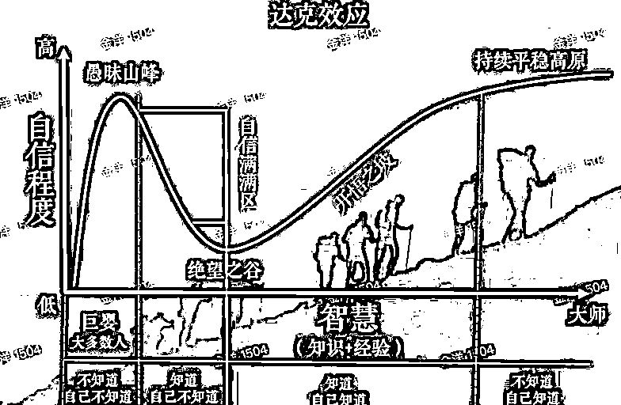

# 想正式创业/加入创业团队，请先做好踩坑准备。

> 来源：[https://uwdpzjnryu8.feishu.cn/docx/WeJLdq07MojzBHxxjLdcgEq9nzh](https://uwdpzjnryu8.feishu.cn/docx/WeJLdq07MojzBHxxjLdcgEq9nzh)

本文是我司内部论坛中的文档，原作者【Tom Chu】，文档作者允许了分享授权，感觉内容写得很干货，虽然偏向于大厂员工的视角出发，但我相信对于星球里的各位其实还是很有帮助的，于是贡献出来与诸位共勉。

# 前言

想创业或加入创业团队?请先做好踩坑准备

写在开头，主要是自己的总结与反思，有点长，大多是主观，不论战正不正确，就是开放式交流，不断积累完善这文档并期待它能一直进化，另外，写的目的不是想打压创业的热情，而是奔着提高创业成功的概率，因为创业的高回报，肯定还是不断会有年轻人涌入，如果有好好深度思考与准备，那么就跟21点或德州的牌桌一样，你是在"算牌"还是在"赌博"? 差别很大。

# 入伙前的思考 :

## #请先诚实拷问自己是想创业还是在逃避

很多从大厂出来的创业者或者是想加入创业的人，认真聆听他们的说法后，大部分的人可以发现一条共性，就是愤愤不平的情绪，"觉得大厂里内卷严重，自己不被重视"、"凭什么我干得这么多，好绩效是别人的"、"我不看好公司未来的发展"、"公司的战略不清晰"、 "内斗严重，我不喜欢工作氛围"等等，类似的大白话能听到很多，但如果冷静下来问问自己，其实会发现，是自己的认知与能力遇到局限，尝试用看似自洽的逻辑性去说服自己创业或加入创业公司，因为可以自己说了算，为情绪找到出口，但认知局限的本质问题并没有解决，所以为什么创业失败的概率是非常高的。

## #理性面对本质问题而不是情绪高涨觉得遇到知音

逃避并不可耻，它是人性，但这个时候切忌几件情绪上的摩擦 :

1.  都是公司的错， 公司不重视我，不给我资源，所以我想出来看看机会

1.  明明是奔着创业高杠杆的回报，但又要包装是为了创业的情怀

1.  觉得遇到知音跟真正的伙伴，特别被對方觸動失去已久的熱情，请先冷静一晚

1.  自己真的懂或热爱所做的产品吗? 还是被话术感染情绪

1.  忽略创业公司商业模式是否成立，觉得人对了最重要

每个人离开学校后，都是不断在做"选择"，选择没有对错，但会造成不一样的结果，今天想创业或加入创业团队是否在逃避面对自己的短板? 请回归"理性"，一个简单的检验方式就是自我总结，列下来自己最真实的困境与短板，今天造成需要再做新选择的原因，其实是自己，只有深入挖掘与确认问题的根本，才能开始尝试解题，大厂与创业公司的选择只有一个逻辑，自身的风险承受能力，当然这个前提是你有选择的权力，如果没有那只能提升自己技能，先求生存，别把all in跟一起干成事业常挂嘴边。

## #创投圈人脉建立远比你想象中重要

拿出一张白纸，列出来所有能联络上，创投圈的朋友，包含正在创业的、FA、VC等等，如果发现特别少，那么你对创业或加入创业团队的认知就有非常大的局限，当下要做的不是选择创业或加入创业公司，而是找到一切的方法去扩展这样的人脉圈，而且这些人脉是愿意跟你坐下来好好聊上一个小时，我称之为有效的创投人脉圈，唯有这样，才能用最高效的方式，提升对市场的认知，给自己的选择扫盲，踩坑的概率才有可能下降。

## #合伙人需要的是相似而非互补

创业团队，往往资源有限，如果合伙人团队并没有一致的使命与共识，那么会发现每个人所想的，其实不一样，就会不断产生磨擦，举例，可能CEO想要的是尽快短期"做好"数据，融资下一轮，其他合伙人想的却是做长期有价值的事，摩擦就会发生 ; "时间"，创业公司间最公平且重要的生命线，当时间都花费在磨擦、争执时，已经输掉一半，所以找到相似的合伙人，默契、信任能非常快建立，哪怕有想法不一致时，因为有足够的默契与信任，就能比很多创业团队更快沟通找到共识，千万别忽略这点差距，影响是巨大的。

## #当下对业务的信心大概率都是假象

达克效应的曲线图，相信很多人都看过，在创业的过程中，无法避免，一定会不断走好几遍，请相信当下对业务的信心主要是认知局限造成，只有当跌到绝望之谷时，才能清楚意识到，业务没有想象中简单，这时候考验的就是合伙人团队的认知提升速度，受挫时怎么还能坚持住，去爬开悟之坡，很可能爬坡时做出来的业务跟原本完全不一样，这是非常正常的，所以选对合伙人远比选对业务方向重要。

## #用战术上的勤奋来掩盖战略上的偷懒

很多创业者常说有焦虑症、抑郁症，纠结无法做决策，但它的核心原因还是对业务认知不足而非性格缺陷，当尝试去观察与分析很多创业者，就会发现，基本上都能做到在战术上非常勤奋，因为至少做到这点时，在心理上获得安慰，觉得够努力所以对得起投资人跟团队，但其实是在掩盖战略上的偷懒。问题的根源还是不肯承认对业务的认知不足，所以在重要的决策上就会产生依赖心态，寻找内部或外部的"浮木"，想走捷径，到后面甚至会焦虑，也不敢让团队知道自己的焦虑，但真正的问题是自己，外部能给的建议都是在信息不足下给到的，如果自己无法独立思考，就会发现业务愈做愈虚，一直靠话术去圆自己的缺失，最终迷失，优秀的候选人吸引不来、业务无法突破、投资人也就没有信心，最终就只能面临项目结束的那一刻。

## #一句话说明白业务是能力而不是话术

很多的创业团队，都在逃避这个灵魂拷问题，我们在做一个什么样的业务? 美团的老王(王慧文)在清华产品的公开课里提到，王兴跟他在做校内网时，整整花了两年的时间，也没想明白在做一款什么产品，所以创业者，一定要清楚意识到会经历一段很痛苦验证的过程，业务抽象的能力，远远比你想象来的重要，这个能力不是一天就能促成的，需要有积累足够的业务洞察、业务试错、业务体感后，才可能忽然发现一个机会点，尝试去验证，渐渐验明白这事，如果做的业务不能很简单抽象出底层逻辑自洽，那么这个业务失败的概率非常高。

# 搭班子绝对是痛中之痛 :

## #认清没有雇主品牌的事实

没有经历创业公司真的无法认知到，原来招人是这么痛苦的一件事，当你在大厂，因为雇主品牌优势，所以优秀的候选人会主动来投简历，一旦自己创业，这个底层的优势就立即消失，当你在boss直聘上发消息给候选人已读不回、当安排面试被候选人放鸽子、发了offer对方不接、入职当天说接到大厂offer不来了等，这才是真正开始掉到绝望之谷的心情，在招人的策略上，合伙人一定要坐下来讨论足够长的时间，做好分工、拟定战术，有一个招人的战术能分享给所有创业团队就是 : 放弃跟大厂抢优秀人才，寻找被遗落的年轻、聪明、穷的人才来培养。

## #招人不是给到HR指标这么简单

"我找个猎头背景的HR，就应该能搞定招人这事"，"给HR招聘的指标，每个月要提供多少简历、面试多少人、入职多少人"，是不是很熟悉的对话? 很多创业公司的失败就是在招人这件事上，不够接地气，合伙人团队里一定要有人去把这苦活、累活、脏活给拎起来，怎么说? 因为在早期根本不可能负担得起很好的HR，这事就是一分钱一分货，不能指望一个低薪偏执行的HR能吸引到多牛逼的人才，这也是为什么很多的成功创业者都会总结，创业早期自己花了80~90%的时间在招聘上，每天在boss直聘上花多少时间在sourcing与候选人聊? 是否愿意每天早上五点起床发消息，目的就是希望发给目标候选人的消息能人肉置顶; 是否愿意认真写800字的招呼与上千字的JD，不断ab实验迭代文案，为的就是让不同岗位的候选人打招呼的回复率能提升? 这些都是避不开的基本功，因为你做这件事肯定会比HR团队做更高效，更能找到突破口。

## #招聘流程里的资源浪费远超乎你的想象

很多创业团队常常忽视了面试不通过的成本，今天如果安排给研发负责人面试了6个候选人，都没有通过的话，那么等于一整天的时间他是无法在研发上有生产力，请仔细算笔帐，一个月所有面试不通过的人占面试官的总时间，然后再乘上他们的时薪，你会被这个算出来的数字吓到的， 请正视招聘流程资源的浪费才是真的浪费，这里还没进一步计算招错人的成本，所以愈早在人才策略上想明白、定义清楚，愈早能大幅降低成本。

## #用人可以有一条通用的黄金原则

首选聪明且ego小，这种人万中挑一，遇到就要全力拿下与重点培养

次选聪明且ego大，这种人百里挑一，就是要能有信心培养他降ego，"大白话hold的住"

再次选不聪明但ego小，这种人十里挑一，就是要有耐心手把手教

如果选了不聪明且ego大，那这是自己识人能力不足，该缴的学费还是要缴

## #高端候选人不加入的原因不是薪水问题

很多创业的CEO们都很喜欢张一鸣说的"Develop a company as a product"，员工就是一个公司产品的核心用户，获取高价值用户，并且留住才有机会带动产品的增长，道理都懂，真正在落实时，就还是没有想明白，怎么围绕这事去真真切切的做，我自己也犯过很大的错，不断去跟优秀候选人说你其它机会有多大的问题、我们这有多好多好，加入我们可以怎样怎样，想用战术取巧去拿结果，但事后来复盘，这些取巧的方式，真正优秀的人才都会识破的，请回到结构上，一个高端候选人为什么看机会? 他的预期是什么? 再者自己的产品目前是不是能匹配上他的预期，如果匹配不上时，是不是能很坦诚跟对方讨论沟通如何一起提升匹配度，薪资永远都不是最关键的deal breaker，仍然是"预期匹配"的问题。

# 带队伍考验的是耐心 :

## #90%产品功能与想法其实是没有效果的

ICE评估法则是我学习到，实践想象MVP最有值价的方式，因为够简单，所以团队学习也没有门槛，当这样的工作方式融入团队的DNA里，就不容易去踩"90%以上的产品功能与想法其实是没有效果"的坑，原因很简单，多了这样的思考，发现很多想法评出来的分数都很低，进而就能收获团队花更多时间在思考本质，寻找三个维度都非常高分的解题之道。

I (Impact) - 做此功能带来的业务影响1~10分

C (Confidence) - 对此功能带来的业务影响信心度1~10分

E (Easiness) - 实现此功能的容易程度1~10分

## #没有验证成功PMF (Product Market Fit)之前不要谈"用户体验"

"这样的设计很伤用户体验"、"功能不完整上线体验不好"、"我的专业不允许我做这半吊子的功能" 、"这产品上线我都不敢跟人说是我做的"，这样的对话是创业时产品团队最常挂嘴边的争执，曾经一个用户动态功能，产品团队花了两周设计一个超级完善，觉得是市面上最好的动态， 研发三端投入45人天去做，没有上ab实验，最后发现功能渗透率非常低，这功能有没有做，都不影响业务本质，然后其实公司就烧掉了百万的成本，请记住，在产品没有PMF之前，所有的获客都是为了实验，然后去验证假设，那怕是一个搜索框，先放上去，不能搜出结果，也去验证用户使用率，如果对常识或功能认知没有那么明确的信心或共识时，最低成本提高对用户的认知与理解就是你要做的，而不是奔着想做一款用户体验多好、能出去吹牛逼的产品，做的再好，设计再漂亮、交互多么创新，但最后停掉，就永远没有人记得，请记住一个原则，愈快上线收数据、愈快能验证没想明白的假设，才能继续往前。

## #本质还是摩擦、结构还是骚操作(tricks)

当业务上，我们做的是本质、是结构，那么团队创造的是"1"，如果做的是骚操作，那就是在后面加许多的"0"，必须想清楚当下重要的是本质，还是加零，如果没有1，那在后面加再多的0，也是枉然，甚至有时候，因为骚操作多了，迷失了本质，反而带来非常多的摩擦，功能愈堆愈多，那个是有效、那个是没效都不清楚，导致最后没有一个功能敢下线，用户也就愈玩不明白。

## #一切没有经过科学方法验证的功能都是耍流氓的行为

用户留存不好? 那我们加个灵魂匹配功能，还不好? 再加个语音匹配、再加个视频匹配、再加个狼人杀、再加个剧本杀，有没有很熟悉? 非常害怕研发停滞下来，没有新功能做，所以不断的堆新功能，最后产品愈做愈大、愈做愈复杂，这也是为什么，网上流传一个段子，产品经理需求宣讲半天，研发最后一句，你直接告诉我要抄那个产品好了，我直接去研究。"大胆假设、小心求证"，当你发现世界的先进生产力公司，都已经采用非常科学的方法在验证假设、加速迭代时，从创业的第一天就要想明白，是不是让团队赋能这样的基因与工作方法，不然很可能会发现，失败就是来自错判了数据上的一个机会点，而成功也就是抓住一个假设，并用科学的方式去验证它，进而证明是第一性原理，就可以不断扩圈做增长。

## #给到做事的目的而不是做事的压力

Simon Sinek "Always start with WHY"这本书对我的团队管理方式有着最深的影响，特别是从外企刚进到滴滴时，发现以前所学的管理方式，不适用在这些90后、95后的年轻人身上，他们没有跟自己相似的成长环境与教育背景，他们更有着独立思考、渴望成功的目标，所以管理团队的方式，就是不断沟通背景上下文，一次不清楚就再一次，如果他不能想明白为什么做、做事的目的是什么，那么工作就不会有效率、自然就不会有好的产出与影响，发现这是本质，所以创业团队在招人搭团队时，就会明白要招年轻 (passionate)、聪明 (hard working)、穷 (hungry) 的伙伴，这样能让沟通效率大幅提升。

注 : 年轻不是指年纪，而是永远一颗年轻热情的工作态度; 聪明不是指IQ, 而是努力型的天才; 穷不是指经济上，而是ego够小，很渴望学习成长

## #背景上下文沟通、复盘跟反思往往变成虚应一应故事

推行KPI还是OKR? 上下班要不要打卡? 要不要996或大小周?要不要写日报、周报?要不要开周会、月会、复盘会?这些在创业时，我都经历过，但其实很多时候都是在没有灵魂的做表面的功夫，没有想明白做这些事的原因，然后沟通不到位，从外企出来的我，坚决反对996或大小周，还有无效的加班，后来说服自己的原因就是想明白"为什么"，创业公司当下只有一个目标: "求生存"，如果能挤出更多有效的工作时间，那么在求生存的竞赛上，就有更高的概率跑出来，这是小学生数学就能算明白的账，但往往没有跟员工讲明白，也就造成员工体验不好，自然就流失。请把自己的脑袋换成员工后，就能想明白，没有人喜欢复盘跟反思，这是极度反人性的修炼，而很多员工做的复盘跟反思都是虚应一应故事，老板交待，就做一下，那么再推进这么多的周会、月会、复盘会时，想要得到的结果是什么? 请先以身作则，写出好的复盘文，让团队明白背景与学习，这样才会给到这些"会议"的价值意义。曾经很多人问我怎么学习复盘跟反思，怎么能写出来相似的复盘文，我的答案只有一个"真实的面对自己"，当写出来的复盘文，自己都会一读再读时，那么你就成长不会再踩同样的坑了。

## #拥抱先进生产力工具让你不会输在起跑点

如果今天创业还是从零开始，那其实已经输掉一半，原因是很多先进生产力公司已经把成功经验透过工具赋能出来，甚至可以零成本采用，元气森林就是个很明显的例子，当用互联网思维、大数据科学方法在做快消时，就有高维打低维的优势出现，下面与两个创业公司可以立即采用的字节跳动用得特别成熟的工具 :

1.  飞书真的香，是上段创业经历里一个很重要的收获，在滴滴、阿里工作时，从钉钉到企业微信都是重度用户，但真的使用飞书后，才发现，它是真的从"协同办公"出发在做产品，而不是仅仅只是"办公IM抽离私人微信"。亲身体验后， 企业里80%的邮件可以不需要了，再不用把时间浪费在处理cc、bcc跟reply to all; 另外就是50%的会议，完全可以因为有协同云文档就不需要开了。

1.  字节火山引擎的Finder、Tester、APM让数据驱动真正高效落地，请记住一个真理，研发写的绝大部分是Bug，再牛逼的程序员，都会写很多自己没有发现的Bug，所以字节的Finder跟APM是我经历过最好上手看产品数据与问题的工具，效率的提升远超过你能想像，当然要会用、用对，另外就是Tester，应该是市面上最好的A/B测试平台了，真的是让大胆假设、小心求证的的科学工作方法落地，所以用先进生产力的工具，前期还能免费，创业公司有羊毛当撸直需撸，如此就能比对手验证想法的效率大幅提升。

## #发现对业务上瘾的员工需要全力培养

对业务有热情的员工眼里是有光的，可以从几个点去观察到，他们对数据的上瘾，使用数据平台的频次、时长，进而能提出想法，而往往扼杀掉一个员工的热情就是忽略了他们的想法，他们有着想要"被看到"的渴望，所以一定要全力培养那些每天醒来第一时间就是登入数据平台看业务结果，做分析的员工，让他们有机会输出想法，去试错并且收获认知的成长。

## #情绪下做出的决策、说出的话一定会后悔

当特别兴奋，觉得想到个大招想要立即去做时，请停一下，尝试把想法写成文档，你会发现兴奋的情绪过去后，原本觉得是大招的想法，没有自己想得那么美好，漏洞还是百出，所以请学习感知兴奋的情绪，能提升不少效率。另外就是恶言相向的过激情绪 :

外卖送到那了? 再不快点我要投诉你了; 你傻吗，会不会开车啊? 你的语文是体育老师教的吗? 怎么能做出这样的汇报内容; 你工作几年了啊? 怎么能犯这样的低级错误? 有没有觉得很熟悉? 在我们的生活充斥着情绪的语言，在说出来的那一刻，情绪找到出口，肯定很爽，但其实并不解决当下问题，反而让情绪刺激情绪，摩擦被放大，合伙人之间、团队之间，每天都容易发生相似的摩擦，特别是ego很大的人，谁也不让谁，谁也不肯承认自己的错，得理不要不饶人，尝试感知自己的情绪，感知他人的情绪，然后深呼吸，心跳如果是加速的，请先冷静不要在群里回复、也不要直接沟通，因为表述出来的是情绪不是沟通，所以一定会后悔，感知情绪的能力是创业修炼的"道"而不是"术"。

# 国际惯例

## 如何连接我

V：Coast1209

最近一段时间主业比较忙，链接上可能能交流的时间不多，但也欢迎来围观朋友圈。

## 过往文章