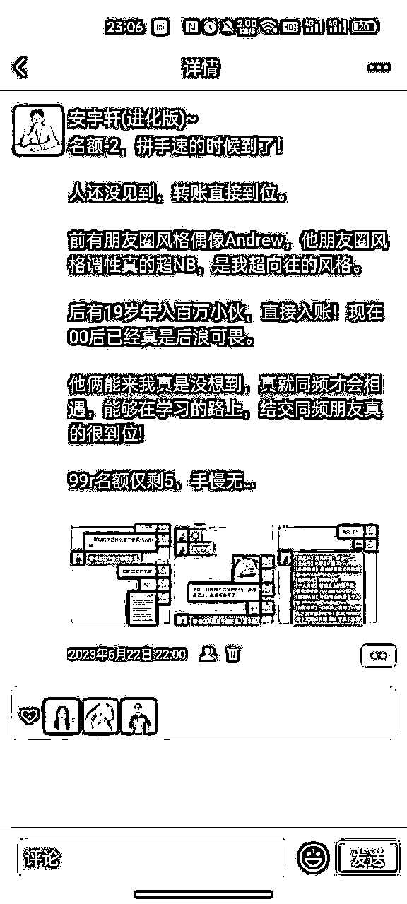
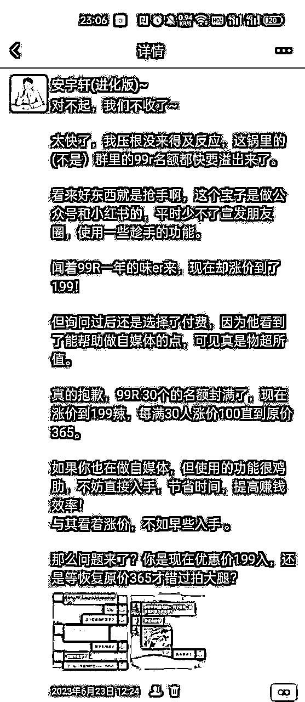
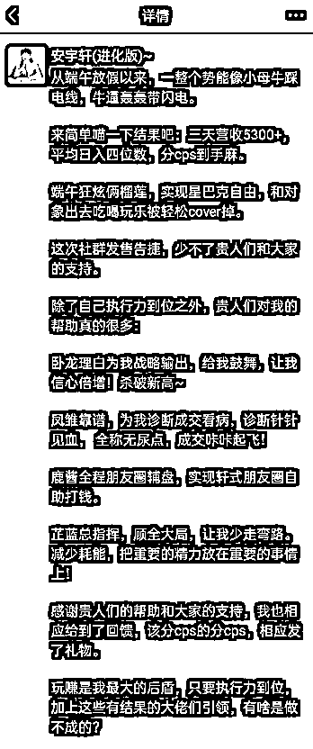

# 加入自媒体赛道一个半月，端午告捷营收5300+，适合自媒体小白发售的心法指南

> 来源：[https://oprlej7lc1.feishu.cn/docx/X8BEd8X7joEKaZxbTsBc26Gfnrf](https://oprlej7lc1.feishu.cn/docx/X8BEd8X7joEKaZxbTsBc26Gfnrf)

端午发售社群课程，营收5300+，我打响了在玩赚的第一炮，以下是适合小白发售的心法指南，全文3309字，预计阅读3min。

大家好，见贴欢喜。我是宇轩，19岁退学北漂，21岁月入过万：正轨步入自媒体一个半月，端午集体小爆发，营收5300+，迈出了ip营收第一步。

之前自己在自媒体这块纯纯摸石头过河，跌进不少的坑，后来幸运的遇到了理白和靠谱，收获了真正意义上自媒体道路的第一桶金。

社群现总人数：55 总营收 7400+，从看葫芦画瓢，到贵人引路，再到有小成，我有很多内容分享，全程无尿点， 小朋友们请系好安全带，司机焊死车门，我们出发了！！！

再次感谢@理白 @梁靠谱 @芷蓝 @小鹿几位贵人的指导帮助。

# 前景

宇轩出生于五线小城市，19岁大一退学，北漂学习编程两年，工作三年，2022年6月开始觉醒，深知做一辈子打工人无出路，奔赴二线城市厦门寻找新的工作和第二曲线。

从2023年接触知识付费，一直在找自己能做的一个内容，在大年初一做了见证群，那我第一次感受到了副业带来收入的爽感。

但我犯了一个错误，本打算分享一个月就解散，分享完之后感觉，解散有些可惜，如果能用一句话来表达当时的想法就是：食之无味,弃之可惜。

迷茫之际，遇到了卧龙（理白）和凤雏（靠谱），他们带我进入了圈子，从此我的自媒体之路才算真正步上正轨，缓缓铺开。

在小群的定位下做了个营销高效工具搜商群，这个群的主旨是：帮助大家减少自媒体道路上：提高赚钱效率，大量节省时间，培养搜商。

在帮助到他人同时，也对自己的技能做了一个梳理。

# 为什么要做营销高效工具定位

先说一下什么叫定位？

定位就是：在自己现有的技能点里，找出最适合发挥自己长处的定位。

如果没有特别擅长的，那就去慢慢培养，先从做小项目开始。

之前看某个互联网前辈做他的做课内容：有一大节叫作检索。但是看了就是：百度简单的搜索，对于学习程序的我来说就是家常便饭，当时很诧异，这也叫可以叫做课吗？这不是大家都应该会的东西吗？？

后来仔细一琢磨，也对啊：也不是人人都是程序员，也不是所有的程序员都很会搜，何况大多数没有检索习惯的人呢？

用明白老师的话来说：就是，我陷入了知识诅咒。

自己会的东西不代表别人也懂，看似习以为常的内容，在别人那便就是信息差！

所以，做定位就要从自己擅长的内容开始，那么我擅长检索，可以检索到Cover市面上收费小几百的vip音频类。也简单做了一个偏向娱乐类目的社群，也获得了一致好评。

所以，在已有经验的技能点上，营销高效工具搜商群的定位就诞生了，它的主旨是：帮助1000名自媒体人节省时间，提高赚钱效率。

# 定位和自己的优势结合

如果不知道自己做什么，那就拿出盖洛普看一看，通过它我尝试打开我的任督二脉，选择定位和自己优势结合，会更的心应手，我的盖洛普长这样：

秉承着有需求就有市场的战略，有市场就有钱赚的理念，结合我统筹的才干，善于合理安排现有资源以实现最大功效。

之前 做过见证群/工具群，加上本质就是程序员，就很会搜，结合这一块优势，所以做了这个群，对于这一块相对比较有经验。

对我来说属于：踮踮脚尖就能够够到的事情。

所以就做了这次定位，大框架是：前期工具人：帮助大家解决问题；中期：陪伴者：陪伴大家一起成长，持续解决问题。后期势能起来了，也就形成了ip。

# 产生的这个产品能够为别人带来什么帮助

我的这个产品能够提升你做自媒体的效率，批量做事，主打一个高效。

比如同样的话术，每次都要手打一遍，费时费力？使用群里的方案仅需一次设置，两步快速回复！

别人朋友圈轻松防折叠，你还条发条折叠，一次设置终身受用！

大佬视频课程， 生怕错过重点，倍速反复回听？没关系，语音转文字一目十行，高效学完！！！

聊天记录发圈打马赛克，繁琐又难看，仅需三步，一招搞定！告别低效产图发圈。

想看大佬历史朋友圈，手磨破了也没翻完，没关系，神器一件导出帮你搞定，快速检索，想看哪里看哪里！！！

甚至：做自媒体电脑时间用久了卡顿，技巧设置一步到位，三步教你装自己的电脑系统，让电脑焕然一新。

等很多有用的功能技巧，一次设置，终身受用！

懂搜商，拿捏所有问题，脚把脚教你如何用搜索解决问题。

它涵盖了：认知差、信息差、资源差，从根本上解营销效能决问题， 学会搜商全部拿下！！！这个产品能解决：朋友圈防折叠、快速替换二维码、一秒马赛克、肌肉记忆快捷回答、采集必要文档的内容，也会不定期在群内分享有用的干货解决难题！

# 做社群初期要做什么？？

## 市场调研：没有调研就没有发言权

如果不知道对标用户缺什么，就不能够精准拿捏他们的点！

所以我在做这个内容之前，在两个高客单社群都做了调查，对于做自媒体的痛点收集。

光有痛点没用啊，自己脑袋哪有一群人的脑袋好使？好用的功能和神器也要采集。

对于选中作为群内容的获得初次内部发售营收额的5%作为分红。

为了调动大家的积极性，我采用发红包的形式进行接龙。

## 为啥要在群里做调研？

流量足够精准，群里都是做自媒体的，对于痛点无疑是对味er的。同时我也在网上做了大量的调研。

基本框架定下，上手填充就完了。

# 社群课程为什么要内测？？

前期收少量人进入群，进行参与、体验，给出产品建议点。

收集客户需求。 因为我是个程序员嘛，深知一个产品上线，要经过多种测试，经过测试的产品，才是好产品，如果测都没测，那上线之后必定漏洞百出。

影响到自己的口碑，那就是搬起石头砸自己的脚了。

所以，内测会让大家有更好的体验感，必须内测。

# 发售策略，具体怎么卖？

半个多月后，自己的产品做的差不多了，开始制定发售策略

老话说的好：没有营销的发售不是好发售。

对于这个产品我的定价策略是99元/年，每增加30人涨价199, 直到365封顶。

因为目前这个是我的第一个低客单产品，所以，我一定要做好。前期在社群内部消化内测，告诉大家我们做了个xxx产品，朋友圈也同步文案。每天观摩朋友圈的人不计其数，如果你的产品，是从无到有都发圈的，那么你做的这个过程就会让大家有一种参与感：大家亲眼见证了你的成长，对于后期成交来说更容易。

有营收的同时，一定记得群里报喜：你会有意想不到的收获。根据能量守恒定律：自己变优秀，其余圈子里的人都会向你靠拢。

去群里报喜=势能崛起，本质上和上学时候咔咔学的好的好学生一样。大家同在一个班级，谁还不想和好学生做好朋友哇，说不定能带自己一把，所以，当你去报喜的时候，大家都会向你靠拢。运气好的话，还能成交一波er。

## 朋友圈成交

课程内容发售，朋友圈占据很重要的一环！

我经常看到理白、靠谱、芷蓝姐等一些大佬们朋友圈静默成交，看了一波圈，回来直接打钱那种感觉真的美妙~

所以，在大佬的影响下也去学习了文案，站在巨人肩膀上成长谁不爱啊，学习朋友圈打造，可以实现自动化成交。

课程发售前期，要在朋友圈造势：告诉大家我要做xxx事情了

开单紧跟着发圈：制造开始售卖的紧张感：

满30人节点，一定要发圈告知：涨价！！！一定表明 现在不入手，还会接着涨的既视感，

玩的就是一个真实！！！！同时你的生活线和认知线也要跟上，自媒体主打一个贩卖生活！！！

这三条圈，成交了8单，营收1500+~

这里墙裂推荐大家学习一下航海朋友圈文案，学好内容真的很重要。

朋友圈每天必发：人设、生活、产品、认知类，做到过典型案例：看朋友圈隔空打钱、实现自主成交。让朋友圈为自己发声，实现被动收益~

## 如何有效成交：话术实战篇

### 垂类用户：

大佬给推荐过来能加你的，都是比较精准的流量，在群里都分享过内容 知道你是干啥的，所以省略介绍产品的流程，成交链路最短。

所以我问的话术就是：给选择题不要给问答题

1：直接询问是否来入手xxxx社群的吗？

如果对方回答：是，这时候给选择题，不给问答题。

如果对方不清楚或者询问，再给出课程介绍即可。

原价xxx转账199即可，支付宝还是微信？

一般会遇到两种情况：

买和不买

买了就说：感谢宝子信任哇，送你一份见面礼吧：xxxx

跟上自我介绍

不买就说：没关系，宝子，相信以后我们交流的机会还有很多

初次见面送你一份见面礼：xxx，跟上自我介绍

不管卖不卖，自己的自我介绍一定要安排到位，并引导看朋友圈。

达到占领用户心智的一个作用。

给选择题是让他走进你的框架，之前靠谱说过：一名合格的销售，那就要占据主动权，客户问啥回答什么，那叫工具人。

### 非垂类用户

一般这类来的，加上好有80%的几率先翻你朋友圈，

打招呼，等对方回你，再送个小礼物，根据对方反馈，再发自我介绍。

朋友圈有人设、生活、认知、产品圈涵盖养着就行。

每天定时发圈，时间久了，感兴趣的自然就找你下单了。

## 不回复客户，持续逼单，成交三单

遇到发消息超过48小时没回你这种的，要给出要删除用户的触达感.

引流过来的用户，没回复你的再后面基本上不会有什么交际。

所以，这种的就可以告知她在不回复要删除了，这样会起到激活用户的作用，再根据以上择类选择回复话术。

再没回复的直接删掉就好。

基本上激活的用户，也会有成交的可能，就这样宇轩成交了3单。

# 感恩环节

好了结合以上内容，实现了端午应收5300+的战绩，虽然不是很多，但是我真正意义做自媒体的第一次。

赚到了第一个5000，后面就会有十倍，百倍的5000~

最后：

感谢@理白：深度挖掘我的优势，让我用优势赚钱，给足我信心；

感谢@梁靠谱，在成交细节上，给我验货，补充细节。

感谢小鹿，朋友圈全程辅盘，祝我建立自动打钱系统

感谢芷蓝姐，占据顶层，占大局，给方向。

希望我的文章能给在做自媒体的小伙伴们带来一丝帮助，也祝愿大家能在自媒体上冲出自己的一条路!!!

路虽远,行则将至;事虽难,做则必成; cong！！！

（欢迎各位圈友前来交流：shianyuxuan）