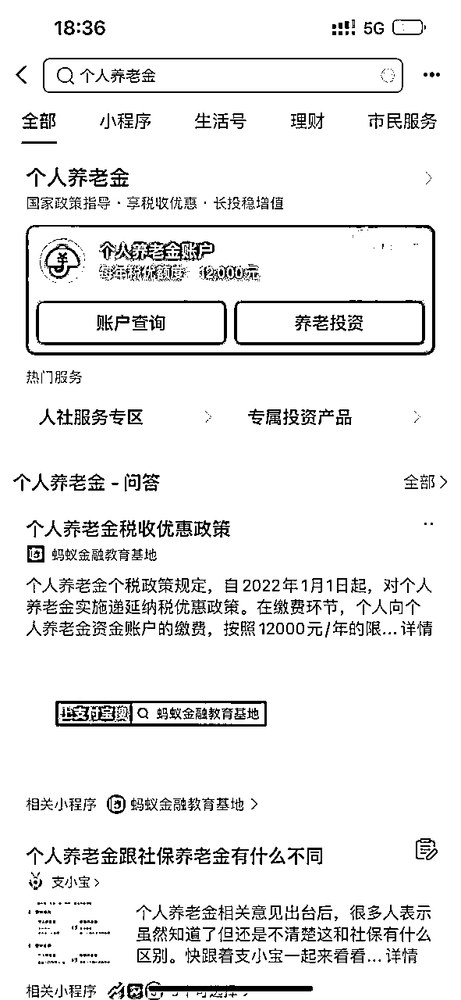
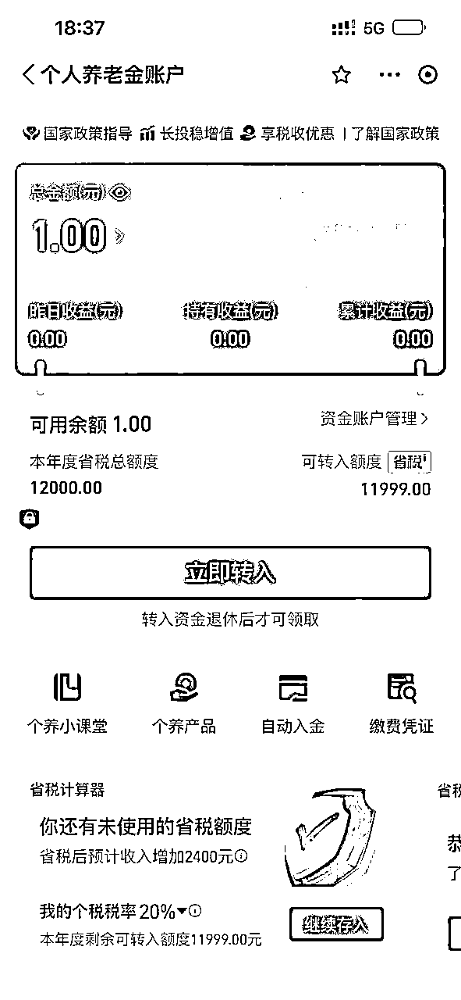
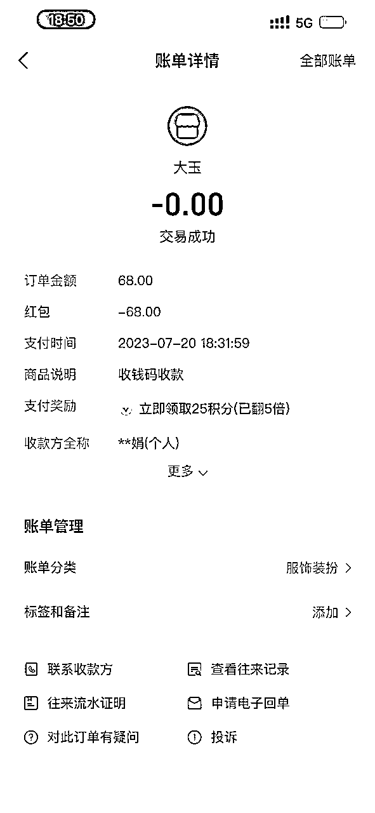
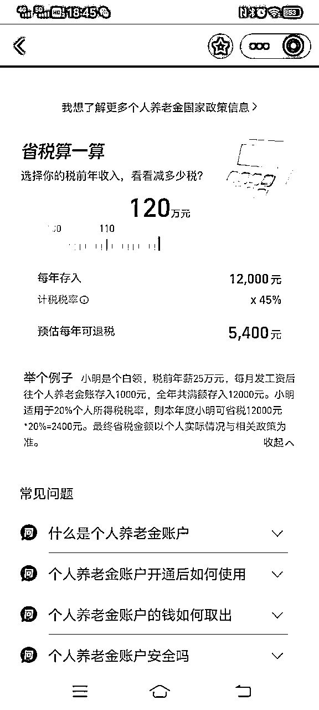
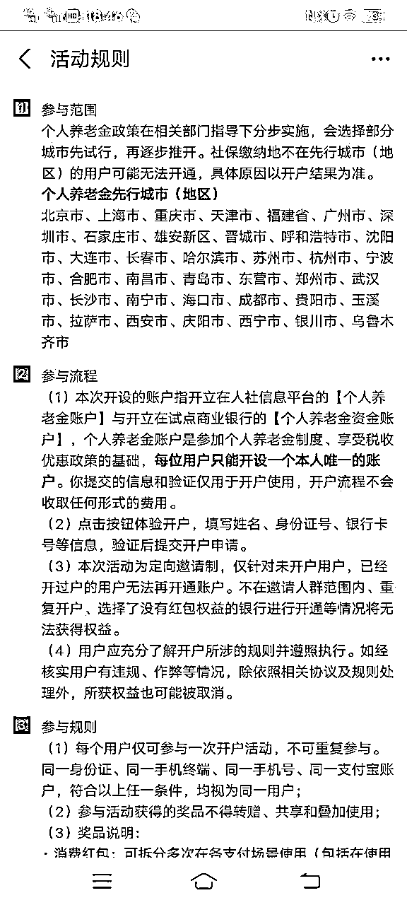
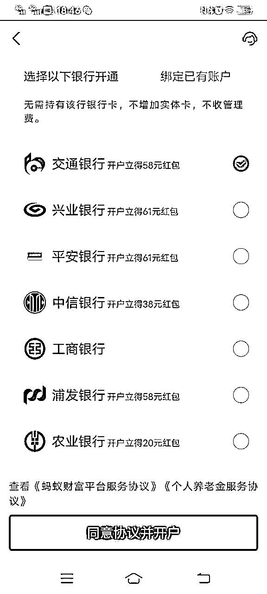
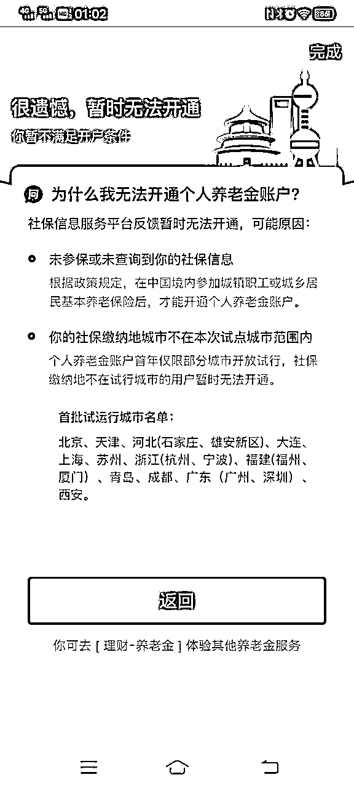

# 个人养老金拉新

> 来源：[https://g5usx6i4u7.feishu.cn/docx/XC9HdwiGIofOuox0hfgcxG8rnXd](https://g5usx6i4u7.feishu.cn/docx/XC9HdwiGIofOuox0hfgcxG8rnXd)

2022年底我就做了一波养老金拉新，当时是做银行推广任务，每天需要对数据。

开通账户上传很多资料比较麻烦，操作难度较高，相对应的佣金也高。

这是去年做这个项目的时候公众号写的介绍

https://mp.weixin.qq.com/s/80oRWDgKce3dcP7ZJikpRA

去年为了快速推广赚钱，我找了在富士康当领导的哥哥，朋友的亲戚武汉社保局的领导等

* * *

今天一个在深圳的朋友给我说，有人摆摊推广支付宝个人养老金，他去注册了一个，领了个大鹅（毛绒玩具），问我这是什么套路靠什么赚钱。

他大概流程给我说了一下，全程操作不到两分钟结束。只扫了一个付款码，根据我的判断这就是撸支付宝的推广红包，一个人利润在40左右。

前几年做京东白条推广可比这个难度大的多，纯利润是差不多的。

那这就是非常值得做的一件事情，这里面有很大的信息差，值得花点时间去尝试一下。

由于试点城市限制，全国可推广区域的小伙伴更有优势。

通过支付宝做个人养老金拉新具备哪些优势呢，不需要上传各类证件以及银行卡，人脸识别就行，介绍起来更简单，页面清晰，操作难度大大降低，以及支付宝品牌背书等。

* * *

如果不能开通也很快就显示，快速筛选非精准客户

这个业务需要在试点城市缴纳过社保的群体，有相关群体资源操作起来更容易。