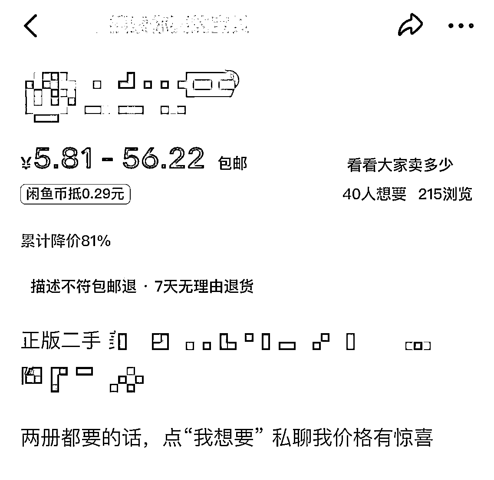
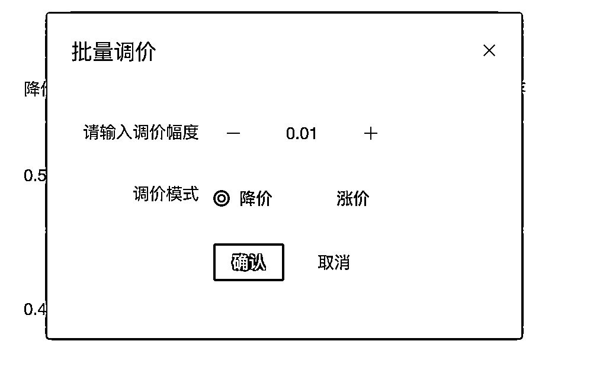

# 二手书 0 分钟科学选品法，借力闲大师实现日赚 300

> 来源：[https://uhk55xjy84.feishu.cn/docx/XQ7xdU4pSot28uxCraac4zHZnkd](https://uhk55xjy84.feishu.cn/docx/XQ7xdU4pSot28uxCraac4zHZnkd)

大家好，我是来自厦门的明哥。

一个机械出身、做过电商卖过家具、后来兜兜转转跑去写代码，并通过运营公众号并成功赚到 100w 的程序员。

加入生财估计有 3 年时间了，今天第一次发帖，诚惶诚恐，当前在闲鱼手书上深耕近三个月，有一些结果，也有一些思考，想跟大家分享。

本篇文章，将以全新的视角，拆解图书的基本元素，并通过自由组合的方式，借力自研的闲大师系统，实现 0 分钟选品，5 分钟快速上架 500 本书，轻松体验日赚 300 的快乐。

* * *

文章开始之前，说下个人成绩：

1、入局两个多月，两本证目前营业额近 6w+（扣掉退款的），利润 2.3w，其中第二本证只运营了一个半月

2、整体算下来，日利润 300 左右，前期由于证少摊低了日均利润，后期日利润相对更高一些

第一本证（运营两个多月时间）

第二本证（运营一个半月时间）

每日 300 也许微不足道，但这仅仅是两本证的成绩，具备了持续放大的能力，在社群里 ，10 本证几十个号的大有人在。

而自己之所以没有继续放大，是因为我不仅平时要上班，要运营写公众号，并且为了自己提高二手书上书和运营效率，独立开发了一套具有用户界面的二手书系统，可以说是当下（我所知晓的）市场上功能最多，效率最高的系统，6 个号已经是我运营的极限。

而在上月，我的系统已经开发完成，提高了数倍的效率，让我有精力可以继续放大账号。

这套系统的开发设计，植入了我的 0 分钟选品法，在极限状态下 5 分钟就可以将你的账号全部上满书。

得益于上周一个圈友的推荐，让一个本来开发给自己用的二手书系统，开始有了小小几十个的真实用户（一部分原因可能是好像是某圈内知名系统开始收费了），一些还没有取得结果赚到钱的圈友，慢慢接入了我这小而美，快而全的闲大师。

（30 分钟？你还是低估了我的系统）

我的系统有一套自己的运营逻辑在里边，只有理解了我这套逻辑，才能用好这套系统。

因此在本篇文章出了讲方法论和核心逻辑外，会配合闲大师的操作来演示。并不是一篇又臭又长的软件使用文档，大可放心往下阅读。

详细使用文档，可以参考：

我的运营方法，总结起来，就两句话：

1，用最多的时间，做有用的事情

2，用最少的时间，做重复的事情

# 「用最多的时间，做有用的事情」

电商，特别是无货源电商，选对了品，就是抱上了财神爷的大腿。

而对于二手书项目来说，比较常规的选品思路是，选热门领域的热门书籍，像孔夫子网上的 7 天热销榜单，几乎是新手必经的选品之路，我也相信很多人的第一单都来自销量榜。

但缺点也很明显：

*   第一个缺点：太过“常规”，你能想到别人也能想到，竞争过于激烈，属于红海选品思路

*   第二个缺点：排行榜是大类目，而不是细分类目，且每个类目只有 5 页，数量有限，无法持续后续 “换血” 操作

只按销量来做为选品思路，思维还是被受限了，不妨脑洞放大，把高中的排列组合拾起来。

理论上，书籍的任何信息，都可以纳入选品的维度。

*   书的原价

*   书的售价

*   书的作者

*   书的领域

*   书的销量

*   书的受众

*   书的年份

*   书的印刷

*   书的出版社

*   书是否套装

而这些信息，可以衍生出非常多的组合，每一个组合，在现实生活中也都有成功案例。

下面我说一些我在用的选品思路，抛砖引玉

### 第一个思路：售价 + 销量 => 10 元店

在现实生活中有不少 10 元饰品店，通常都是挤满了人，是一些学生的最爱，这样的店，有特定的群体，基本上也不用愁客源，并且有统一定价，消费群体的有不讲价的共识，因此也没有售前压力。

而在二手书项目中，是否可以借鉴这个思路，10 元书店或者 9.9 包邮店，你别看价格这么低，还有得赚吗？哈哈

别担心，孔夫子上 4块钱包邮的书，多如牛毛，并且销量还不错。

对于这个选品思路，我是这么操作的，在系统上：

*   销量条件，设置>50，有个起码的基础销量，可以规避过于冷门的书籍

*   并且设定价格区间：0-10 元（推荐价格），低价书利润都有 50%

直接在页面上点 全选 ，批量上架 就行了，选品加上架，前前后后 10 秒不到，而这个选品思路可以非常稳定的 “换血”（什么是 换血，后面会讲）

### 第二个思路：售价 + 原价 => 溢价书店

何为溢价：书的售价超过书原本的定价。

这些书，通常有固定的受众，是可以有大量的溢价空间的，比如

*   某冷门行业大咖的绝版书

*   某些专业考试必学的经典书籍

通过在系统中，选择：

*   选择类目：系统的书太多，避免查询太慢

*   价格区间：50< 价格

*   原价区间：原价 < 50

以 50 元为例（也可以是其他的），就可以过滤出有溢价的书籍。

### 第三个思路：受众 + 质量 => 高回购

大家在买衣服的时候，都是怎么买的呢？

我自己在买衣服的时候，都是去 “写生” 这个牌子，衣服很好看，低调时尚，质量也好，虽然价格比较贵，但是并不妨碍我一年四季都来回购。

这种就是 “高回购” 店铺的一个典型例子。

回到二手书项目中，也有这样一些类目，回购率特别高的，买这些书的客户，有大部分的人，买了一次如果不是书的质量真的不行，一般都会回购。

因为这些人是行业的爱好者，他们买书，并不是带着书名来买的（指的是非搜索入口），而是带着看书的目的来买，只要你把店铺做得够垂直，当他们看完书后，书荒了，就会来你店里逛逛，就像你逛商场一样。

对于这种类目，请注意做好主页的专栏，方便你的客户去 “逛”。

不然店铺里 500 本的书，你的书质量再好，价格再便宜，再喜欢的书，也逛不下去。

### 第四个思路：作者 + 受众 => 粉丝群体

通常来说，一个“合格”的明星，都有自己的粉丝群体。

这些粉丝，喜欢偶像们的一切，当然也包括他们写的书，买回去个人收藏，还有人专门做这样生意，我就遇到几个，每隔几天就来问我，这本书还有没有？要几本。

即使不是明星，某些特定领域里的大佬也有自己的粉丝群体

当客户指名要某作者的书籍时，就可以在系统上：

*   直接按作者进行搜索

*   若有同名作者，再根据类目二次过滤

*   若书籍过多，再根据销量排除掉客户可能不会要的书

*   然后直接在页面上，点批量上架

以上分享了四种我最常用的选书思路，基本上只要确实了该帐号的定位 ，在上书的时候，就是 0 分钟选品，选定条件，搜索了直接上就行，有多简单就有多简单。

并且这些思路，都是基于数据选出来的，不用担心选品枯竭的问题。

# 「用最少的时间，做重复的事 」

闲鱼自身平台的基因决定了闲鱼店铺的运营比较单一，但是对于二手书这个项目来说，商品数量过于庞大，人均 1500 个商品起步，不依靠软件辅助，运营就需要投入大量的时间和精力。

我将每天要做的事情，分成两类：

第一类：手机端，抠细节，养帐号

做二手书项目，闲鱼不需要养号，有资格后，可以直接上书，但保持帐号的活跃度，有一定的流量的倾斜

目前我的每天都在做的有

*   坚持每天擦亮：一键擦亮和超级擦亮

*   发布优化商品：发布后立即优化商品

*   开启闲鱼币：开启闲鱼币的曝光和浏览大大提升

*   做基本的任务：签到，升级小店

*   做浏览的动作：

*   定时重启闲鱼：经常重启后，就有询单的，不知道是不是玄学

以此来保持帐号活跃。

除了像擦亮、签到这种点一下就行的动作，其他的基本都很耗时，比如优化一个商品基本要 3 秒左右，开启一个闲鱼币要 2-3 秒左右，对于每天都要“换血”的我，如果不能自动化，意思味着我每天都要投入数小时的时间在这些重复的事情上，于是我就写了一个《闲大师工具箱》来处理这些每天重复的事情。

第二类：SOP，策略式降价，起链接

通过软件可以辅助完成这些运营动作。

### 第一阶段：先涨后降，步步为营

在发布时，统一给书籍加价，留足降价空间

而在这个降价空间系统会记录下来，方便你在后续降价的时候，把握降价的力度，在每次降价后，这个数据也一并刷新

### 第二阶段：明降暗涨，利润翻番

经常出现一种情况是你上架的时候还有利润在，但是由于孔夫子网的低价书被买完了后，等你出单了，就没利润空间了。

这时候如果直接对商品进行涨价操作，闲鱼会直接断了你的流量。

更好的方式是，通过设置多 SKU 来达到明面上降价，但暗地里是涨价的，这样不但保证了我们的利润，还能享受闲鱼降价带来的大量曝光。

### 第三阶段：小额降价，坚持为王

当你进行完前面两次大额降价后，你的商品就会获取 “累计降价%" 的标识，这个时候曝光会非常大

但我们需要长久稳定的曝光，就得每日进行 批量小额降价，正常是降价 0.01 元，而不管是单规格，还是多规格，系统都是支持的。

### 第四阶段：虚拟货源，无本万利

通过以上三个阶段的运营后，你的商品会持续的来单，对于好卖的书，可以增加一个电子书的 SKU，电子书这种虚拟产品比实体书优点可太多了

*   零售后

*   无成本

*   回款快

数据库里已经对接了 z-lib 的千万级电子书库，你在其他渠道找得到的找不到的，在zlib 里面都有。

而对于 PDF 这个特殊的 SKU 来说，闲大师系统会做判断，zlib里有的书（可下载的）的才能设置上，避免客户下单后找不到电子版交付的尴尬。

### 第五阶段：持续换血，持续出单

闲鱼的流量是公平的，你持续投入运营就会持续获得流量，没有爆发地增长，只有平衡的分配流量。

一个闲鱼帐帐号目前只能上传 500 本书，这 500 本书里大部分是炮灰，没有想要，没有浏览，甚至没有啥曝光，是纯纯的死链接。

对于这些商品来说，下架后重新换一波新的书上去，能让你的帐号一直保持活跃状态。

通过长时间的迭代换血，到最后留下的都是有流量、有销量的品，帐号的单子也会趋于稳定。

# 写在最后

在我刚入局二手书的时候，我也是用了社群里某大佬的系统（以下称某系统），但由于这个系统，需要一个本一本书搜索添加，并完善价格，图片等信息，因此我差不多花了我一周时间去建立选品库，才把 500 本书上完，也几乎快磨灭了我对一个新项目的激情。

这个系统，作为二手书工具的先行者，有里程碑意义，结束了纯手工上书的时代，开启了一个新的项目模式，但实际体验下来，用起来并不方便（仅于我来说，客观评价，如有冒犯还请谅解）：

1、只有 Windows 才能上书，Mac 不行的，得装虚拟机

2、上书流程过长，建立选品库的远大于我的可支配时间

3、缺乏数据分析的能力，不管是前期选品，还是后期运营

4、降价需要排队，无法立竿见影，无法多规格降价，运营工具的支持相对欠缺

市场是多元的，与此同时，也有个圈友有在开发一个 chrome 插件来辅助上书，是直接从孔夫子同步上书的，虽然没体验过，但从设计上来，速度确实快。

根据目前已知的工具，我针对已上线的功能进行全面对比（客观评价，功能方面如有填错，请联系我更新）

以发稿时间2023.7.7 已上线的功能为准

开发这套系统，初心是为了自用，因为我坚信了二手书这个项目是一个长期的副业项目，而平时自己上班又无法投入太多的精力，故此开发了软件。

经过上面的整理，我才发现闲大师功能如此之全，却只有我一个人用，实在是才太可惜了。

于是，我经过一番的思想斗争，在朋友圈发了个帖子，被一个老乡圈友看到，他体验了下，确实好用，于是帮我自发宣传了，最后才得以有了第一批大概 40 几个尝鲜者，经过一周的检验测试，增加了不少功能，也修复了不少问题。目前已经相对稳定，准备开放给生财正在做二手书的兄弟们使用。

如果生财的圈友，认可我这套软件的运营逻辑，可以联系我（微信: stromwbm），由于服务器配置不是很高，用户多了之后，希望大家不要暴力操作，鼠标轻一点，不必要的操作少一点 。

以上就是我做了二手书项目以来的一些思考，验证行之有效，并将这些方案落地成软件，抛开零散时间的客服，每天基本上只要投入 1 个多小时的时间来运营维护即可。系统目前进入稳定运营的阶段，下一阶段扩大运营，办他个 10 个证，争取早日实现月入 5w 的目标。

最后，我要感谢生财有术，三年来在社群里学习了不少技能，交了不少朋友，当然也挣到了一些钱，非常感谢有生财。

还要感谢三位福建圈友。首先感谢 @叫我李同学 和 @诗与远方 推荐了一批早期的体验用户，没有他们，就没有闲大师与大家的相遇。另外，还要感谢生财大师兄 @杨涛 对本篇文章的指点，让我不断要求要自己要真诚分享，拿出点真干货出来，不辜负大家花时间看帖的宝贵时间。

最后，若大家对二手书项目，或者闲大师，有什么问题，欢迎评论区交流，知无不言，言无不尽。