# 《新手小白受到一条风向标的启发，执行拉满，跑通抖音四维彩超AI 项目，实现17 天收入过万的复盘》

> 来源：[https://xqya1zd76f2.feishu.cn/docx/Xqmed28eTomg4bxVEmkcCwgtnSd](https://xqya1zd76f2.feishu.cn/docx/Xqmed28eTomg4bxVEmkcCwgtnSd)

大家好，我是竹子。今年 4 月 22 日加入生财的新人。出生财新手村后，5月6日看到了一条四维彩超ai生成宝宝照片的风向标后，5 月 7 日晚上入场抖音，发了第一条关于四维彩超 AI 预测宝宝长相的短视频，当天晚上开始有客单咨询，完成了从 0 到 1 的变现，17 天完成收入过万，目前视频合集播放量超 100w。

这是一篇复盘帖，我将从AI绘画的变现形式和路径、引流转化的方式、我遇到的各种问题和解决方式来分享这个项目的跑通经验。

### 一、前言

和所有加入生财的新人一样，刚进生财的时候都是：开眼了啊！原来赚钱有这么多的途径！但是自己一无资源二没人脉，并没有什么方向。

尝试 AI 绘画是因为 5 月 6 日 Midjourney 推出 V5.1，并且开放了一个周末的免费试用，于是下载了 discord 开始用 MJ 画卡通头像。

恰巧在生财风向标上，看到了一条根据四维彩超用 AI 画宝宝头像的内容。于是立马拿自己宝宝的四维照片用 Midjourney 图生图进行了尝试，发现 ai 真的有点东西，确实很像。

然后发了一条抖音短视频试水，发视频之前搜索发现之前有人发过四维 ai 相关的视频，但是没有特别火，所以我当时也没有做好它会火的准备，但是它居然火了。

这是我看到的那条风向标，是 4 月份发的，当时做这个的人还比较少，妥妥的蓝海，感谢这条风向标和这位圈友。

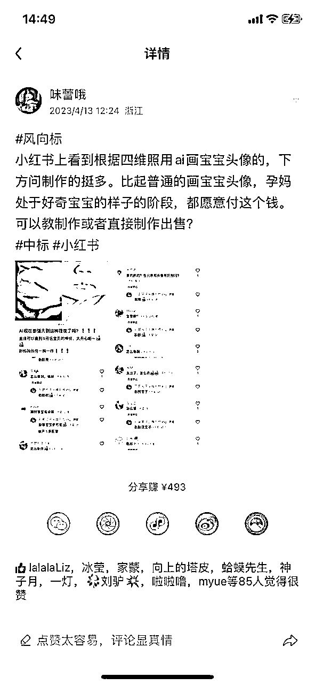

### 二、四维彩照AI 绘画的变现形式和变现路径

#### 2.1 变现路径一：客单画图变现

抖音短视频/小红书笔记-引流到微信-客单画图变现

5 月 8 日的时候我的第一条视频浏览量已经 8.5w 了，这个时候抖音私信咨询怎么画图的已经非常多了，幸好在这之前我为了想做副业，多办了两张手机卡，连夜创建了两个微信，开始引流到私域，引流方式详见第三节（引流和转化）。

引流到私域后的变现方式，就是接四维 ai 绘图的客单，根据市场调研，客单价19.9~80 的商家都有，所以价格可以自己定，最开始我定的19.9一张图，第二天涨价到29.9，这个价格做了一段时间，价格也还能被大部分用户接受，最近涨价到49.9，这个价格就只有少部分用户接受了，不过做一个顶之前的两个也不亏。

前期每天的客单量大概 20 到 30 左右（团队内有位小伙伴一天可以做 50+，日收入连续三天 1k+，很猛，如果不那么追求完美的话），后期稳定的话一天也有 10 单+，这样就比较轻松，可以有空学习一些别的知识。

#### 2.2 变现路径二：知识付费

当你的项目做的有起色的时候，就会有别人想入场赚钱，客单中也夹杂了个别询问怎么收徒，愿意付费学习的人。不但可以自己收学员，还能让做出成绩的学员收徒自己拿小部分比例的返点。

知识付费是一个很好的变现渠道，比自己画图收入来的快得多。目前我们是直接将学员放在微信项目群里，群里有项目相关的所有资料，喂饭教程，随时答疑。

除此之外还可以选择在一些抖音合作的知识付费平台上传课程（之前有个叫做“海豚知道”的平台在抖音上找过我），说是可以上传课程后将课程购买链接挂载在短视频或者直播间，这样应该可以卖得更多（当然，课程平台是需要付费的，了解了一下大概 1999-5999 一年）。

效果可查看如下截图。这里我还没做到这一步，不做具体推荐哦，大家做选择时注意甄别是否为官方人员，避免上当受骗。

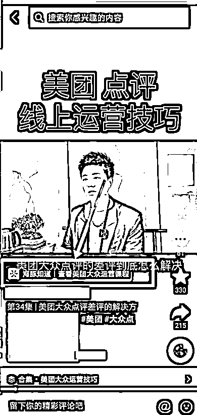

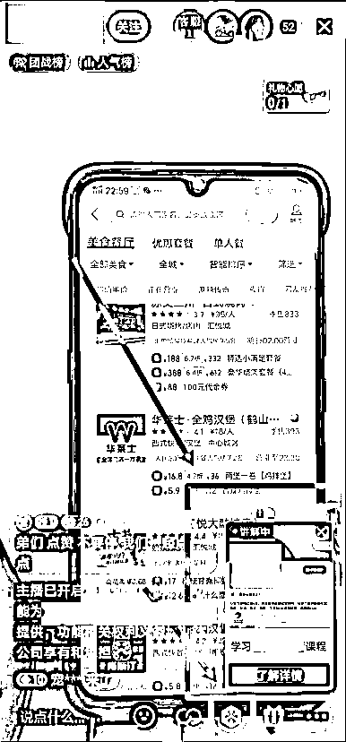

### 三、怎么引流和转化

引流这里踩了不少坑。首先是对平台规则没有很了解，私信又多，回了很多同样的信息，里面夹带了微信账号，尽管用了谐音，做了表情包图片，还是被吞了很多私信。

一开始没发现，后来发现咨询都没有回音才觉得奇怪，找了好友测试，发现私信内容收不到。然后只能换着不同的话术去回复，回复几个人就换个说法，但是咨询太多了，一个人又要当客服又要做图，很难搞定，导致有一些客户过了一两天才回复然后流失了。

而且很惨的是 3 个微信号，都因为一天加人过于频繁被限制添加好友，属于是看到钱在你面前跑，但是赚不到的感觉。

在这里感谢带我进生财的朋友&大学同学方波妮，她入场抖音比我早，告诉我抖音企业号认证后有很多功能可以帮到我，比如自动回复，比如视频或者图文挂咨询卡片等等。

于是就有了接下来我要介绍的我后来用到的引流方式。

#### 3.1 引流方式

##### 3.1.1 办理个体工商户

办理一个个体工商户（目的是认证抖音企业号），自己在当地市场监督管理所网站（每个城市应该有对应的网站，比如湖南的叫做“湖南省企业登记全程电子化业务系统”）或者现场办理（地图搜索所在街道的市场监督管理所），价格是免费的。

办理前，可以打电话询问需要的资料和填报注意事项（每个街道的电话都不一样，可以打 114 查询），避免被一次次打回来重新填，审核很快的，基本上当天上午填报下午就能出审核结果。

申报步骤一般是：

先登记名称（登记名称时的经营范围不用详细写，是以后续登记营业执照信息为准的），名称审核通过后就可以申请营业执照了。

填报注意事项：

电商的执照需要先注册一个个人网店，比如淘宝店（在千牛注册很快），然后在千牛上申请一个淘宝网店铺经营证明。

填报个体工商户营业执照的时候，经营场所就不用写实体地址了，写这个证明上的网址，备注仅网络经营即可（每个地方要求可能不一样，建议先打电话问清楚哦）。

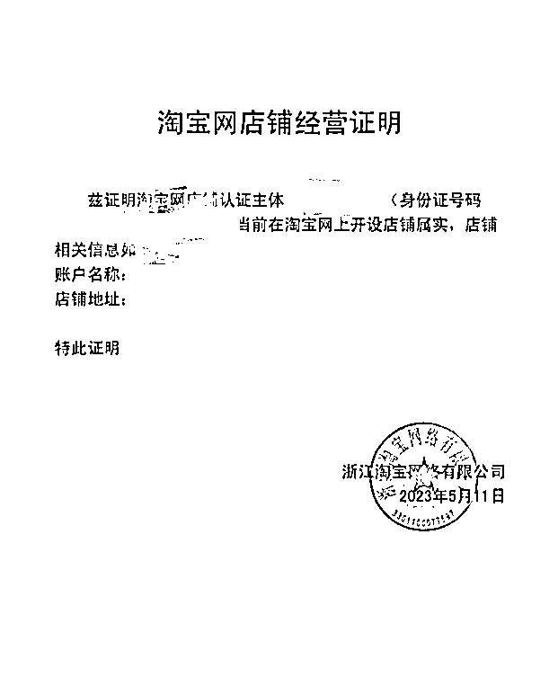

pdd /淘宝上也可以代办理，搜索个体工商户办理，电商专用就行，费用 80 左右就可以搞定，自己找靠谱&没有隐形消费的店铺。有些店铺是营业执照和食品经营许可证捆绑销售，费用多出两三百，实际上自己办理营业执照不需要办食品经营许可证。

注意：经验范围可以多填一点，能经营的都写上，这样以后想做电商卖东西也没有问题：

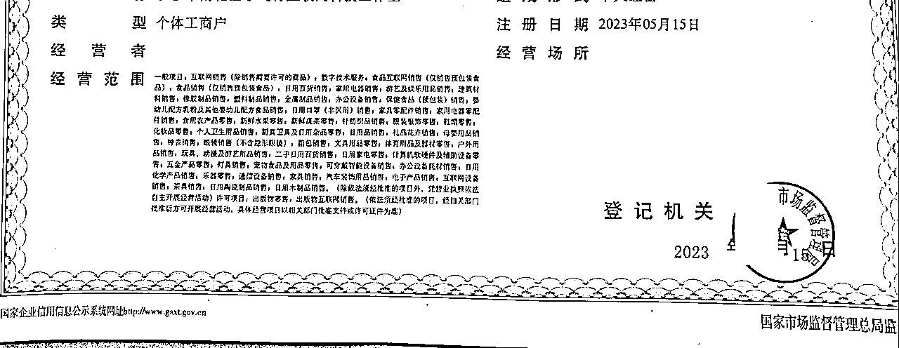

##### 3.1.2 认证抖音企业号

抖音可以用个体工商户营业执照进行企业认证。在“抖音创作者中心”--“企业号开通”进行认证。

企业认证的好处就是，达到黄金等级之后就可以开通私信自动回复，以及可以在短视频中挂载私域经营咨询卡片，用户观看视频后可以直接点击卡片跳转到私信（在抖音企业号商家管理后台设置 https://e.douyin.com/site/douyin-mp/home ）：

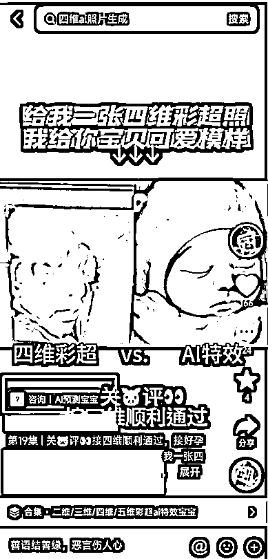

企业号认证需要涨粉到550个人，黄金等级需要经营值和涨粉才能完成，前期粉丝不够可以选择投流或者买粉丝。买粉丝涨粉（大约150元买1200粉），但都是老年粉，这样来的粉丝只能提升抖音对账号的权重，基本不能依靠这些粉丝变现。可以先买粉起号，再养号自己投流涨粉。

我们只需要将询问怎么画图，怎么收费，引导客户留资的内容都放进自动回复中，省时省力，直接筛选出意向客户。

话术如图：

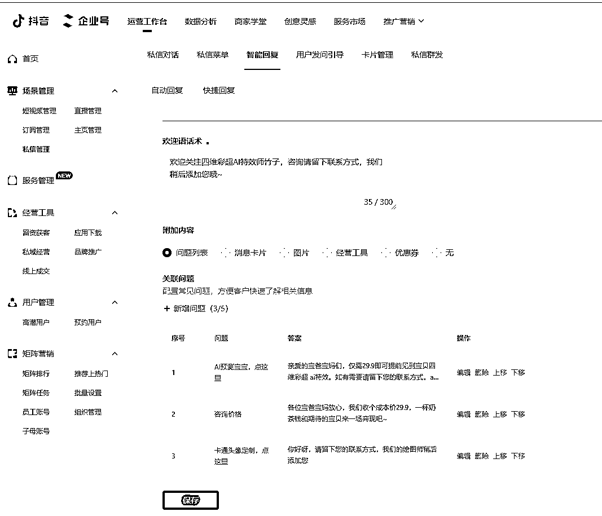

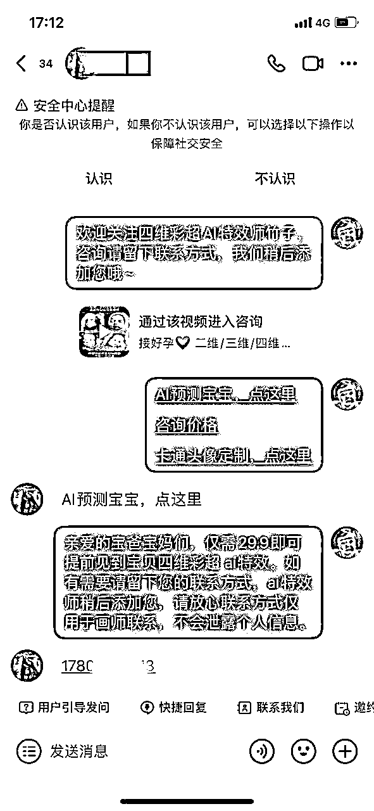

然后去抖音企业号后台预约用户版块，把客户留的信息一个个加上微信就行，主动加人频繁，比被加频繁要恢复得快很多。能留资的这些客户对价格等信息都已经了解了，基本上加上微信的 80%的客户都能成交。

#### 3.2 转化方式

##### 3.2.1 加上好友之后打招呼

加上好友之后主动打招呼，然后告诉用户可以直接发四维照片并且转账预约，并且告知用户我们需要看到付款信息后登记制作，会先返图再点击收款，消除客户怕被骗的疑虑，我们就可以开始制作了。

##### 3.2.2 朋友圈运营

当然，仅靠话术可能不能完全消除疑虑，需要经营朋友圈，朋友圈内容：

1、日常做图宝宝可爱照片分享（告诉客户我是正儿八经画图的）

2、客户好评聊天截图分享（告诉客户我的产品质量确实很好）

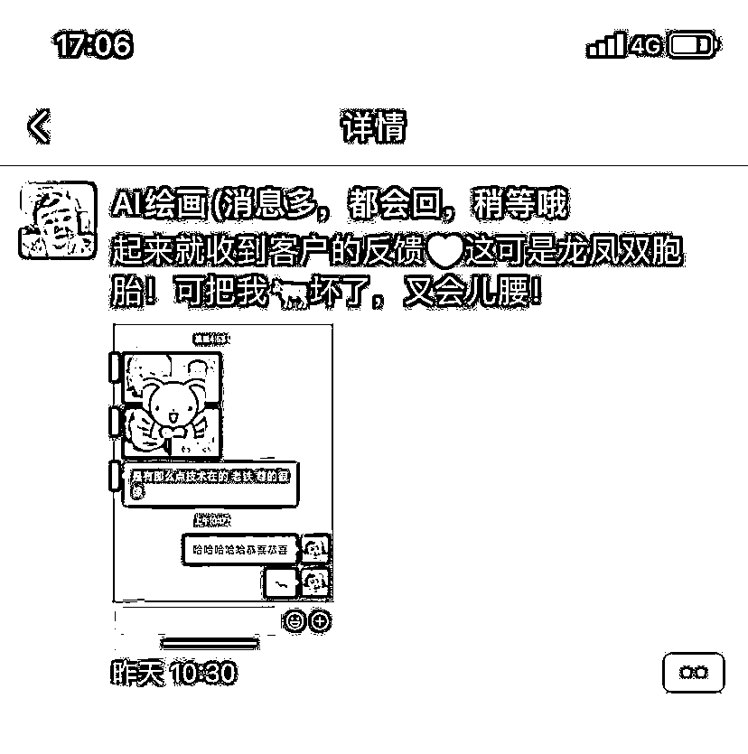

3、跑单白嫖客户聊天截图分享和信任你的客户的聊天截图分享（下单规则和建立信任，咱们是先付款-返图-再点收款，诚信经营，互相信任）

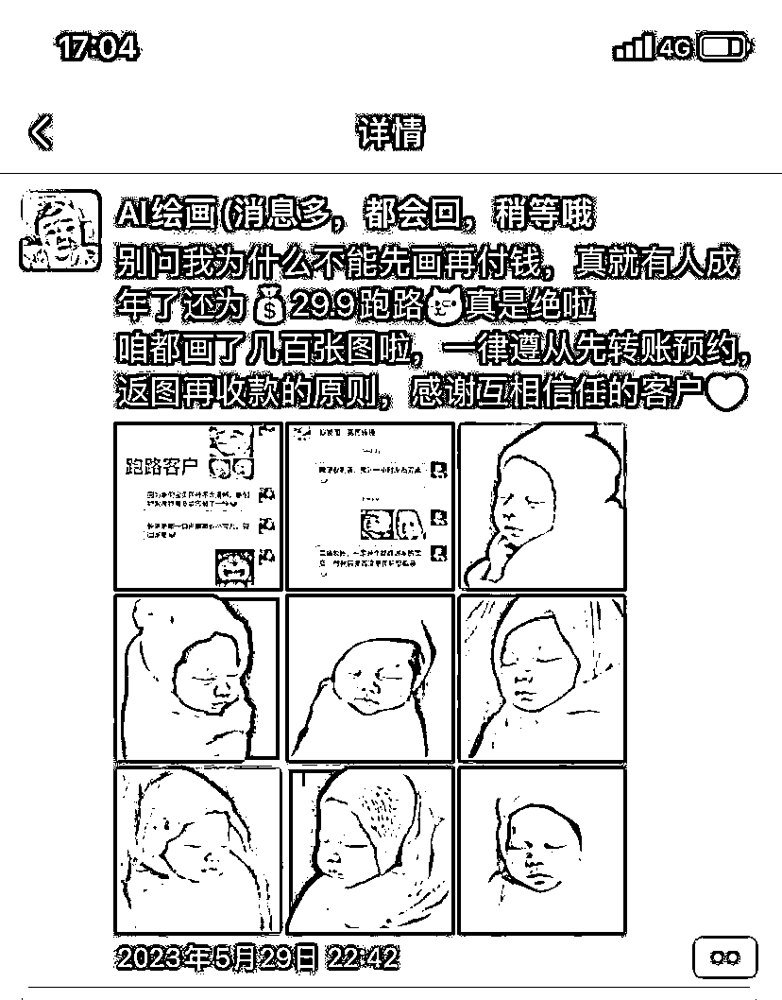

每一个孕妈背后都有好几个孕妇群，这个潜力是很大的。对于特别满意的用户，可以主动和孕妈说满意的话可以帮我们多多宣传，给福利。

比如介绍成功返现 3-5 元都可以，给孕妈群团购福利价格，或者说可以等她宝宝出生送她卡通头像，这样用户可以留你更久，也方便日后转型做母婴社群。

### 四、遇到的问题和解决方案

#### 4.1 问题一：四维画图咒语和生成的图片宝宝脸上有异物

解决方案：航海的时候问了教练，可以修改一下咒语，四维照片除了脸之外的地方用工具码死。

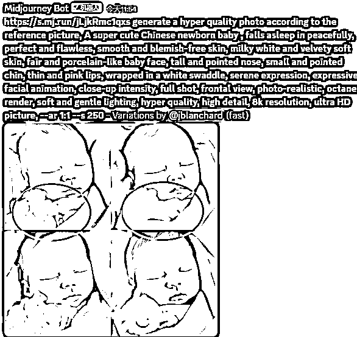

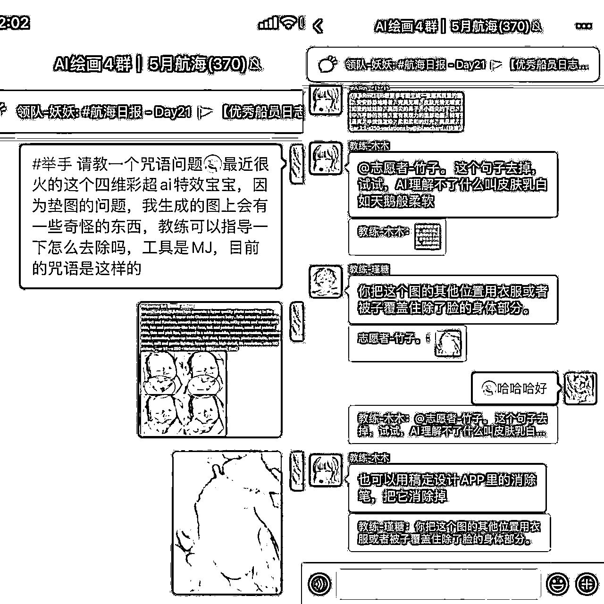

#### 4.2 问题二：客户说不像怎么办

① 满足要做到像+漂亮以后发给客户，客户如果说不像，请把标的物对准四维彩超，宝妈的标的物是她自己和老公/大宝，我们不要被带偏，我们要和彩超像，如果彩超不清晰可以直接说彩超不清晰，咱们是按照彩超做特效，您觉得哪里不像咱们可以优化，然后发以下标注一模一样的嘴巴和鼻子图片给对方。

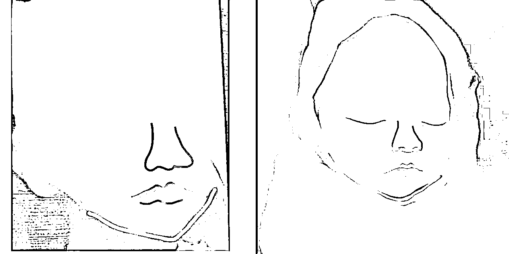

②实在不行退几块钱给他们，总有那么几个客户难缠，可太正常了，放下他们，去拥抱更多好的客户。

#### 4.3 问题三：客户质疑所有的ai宝宝长得都一样

首先自己要确保没有用重复的图忽悠客户，其他的就靠话术解决了，告诉客户每个宝宝都是根据对应的四维照片生成的，都是独一无二的，仔细看五官都是有区别的。

### 五、一些小技巧分享

1.  画出来的宝宝图一定要可爱，哪个当妈的不希望自己的宝贝可爱呢？

1.  嘴甜，夸夸夸，夸宝宝可爱，夸孕妈漂亮，客户开心付钱你也开心收钱；

1.  生成的图片尽量选和四维图片方向差不多的，返图可以把四维和 ai 图拼在一起，便于对比；

1.  如果有四维可以看出宝宝的五官有特别之处，但是 ai 图还差一点，比如鼻子很高，可以用美图秀秀微调；

1.  在各个平台发视频或者笔记的时候记得查询平台违禁词，避免被限流或者被举报违规；

1.  制作视频合集以及学习抖音 SEO，对作品的流量有很大的帮助，抖音 SEO 航海手册👉https://i.shengcaiyoushu.com/docx/XEb4d9F4WogubixyOM9cMVeen0d；

1.  针对孕妇群体发视频，可以了解一下孕妇群体最在意的是什么，比如四维顺利通过，宝宝健康足月，产检一路绿灯，以下这种带点玄学的视频点赞互动都很高。

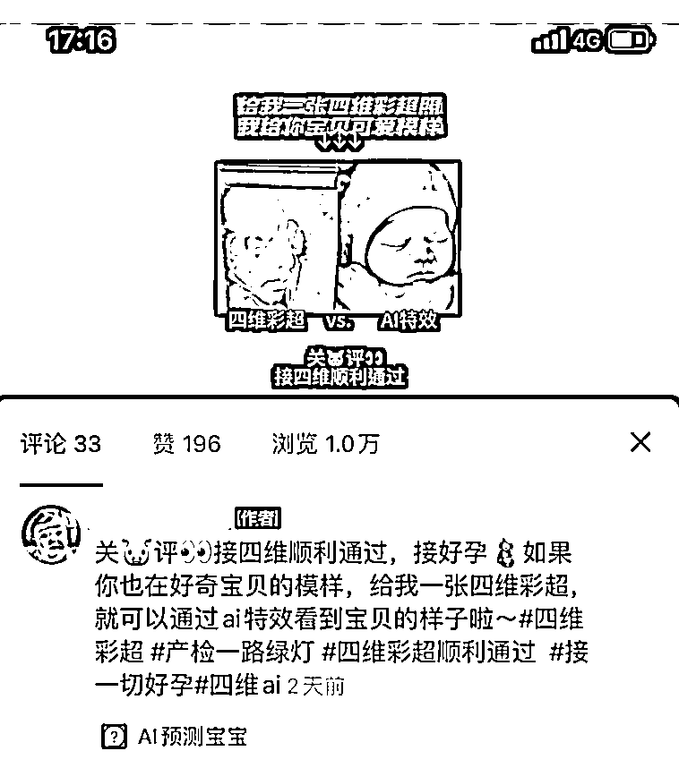

这次从 0-1 跑通项目的成功，有 30%的运气和 70%的行动力。这就是传说中的三分天注定，七分靠打拼吧哈哈哈。虽然比不上大佬们的变现金额，但是咱有跑通项目的经验了！

项目成功后大家都在夸我行动力棒棒的。没错，这个项目能成功靠的就是执行力，如果我看到风向标之后一刷而过，没有去实践画图也没有去抖音发视频，那我可能仍然是一个在不断看着精华帖，不断刷风向标，想着我要什么时候才能赚回门票的新手。

大家既然加入了生财，都是想要赚钱的（没错吧），我刚进生财的时候也看了好多精华帖，感叹大佬们好厉害，并且已经在脑子里想象了一万遍自己也赚了好多钱的场景（哈哈哈哈我不信你们没有！！），但现实中自己只是个压根不知道从哪开始赚钱的焦虑的小趴菜。

所以，焦虑怎么办呢，和别人的差距这么大怎么办呢？行动破除一切焦虑，或许你已经看过了许多大佬的精华帖但是还是没有找到方向，那么不如先挑一个对自己来说相对好上手的领域去实践，去开账号，去发作品，想一千遍不如做一遍。遇到不会的问题生财有大把资料可以查，查不到的可以去链接和请教做出成绩的人，切记要真诚。

对于我个人而言，我觉得永远没有完全准备好的一天，就像我发视频的时候，我也刚学会使用 MJ，只会卡通头像和四维 ai 的咒语，但是我还是去做了，因为我怕等我学会所有的技能，风口已经过去了，蓝海都变成红海了。

所以放下心里的包袱，啥也别怕，干就完事了，边行动边摸索，实践了才知道哪里要改善，即使失败也是宝贵的经验，这样你下一个项目才知道哪些坑不必踩，哪些事情可以提前准备好。

冲吧圈友们！