# 1分钟生成AI艺术二维码（小白贴）

> 来源：[https://tjqtxsd47u.feishu.cn/docx/Y2mYd0L9dooiGQxxz8gcdskwneb](https://tjqtxsd47u.feishu.cn/docx/Y2mYd0L9dooiGQxxz8gcdskwneb)

大家好，我是火星人

最近AI圈有一个很火的小道消息，有小伙伴通过一张定制的艺术二维码，一次赚了2万！

就是下面这一张

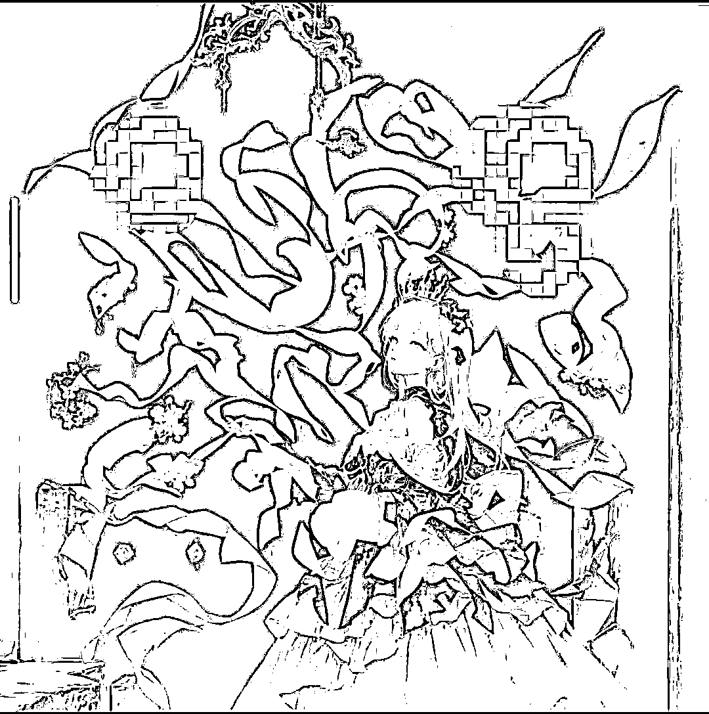

（PS：大家扫不出来是因为我在关键位置打了马赛克，实际上是可以扫的哦！如下图）

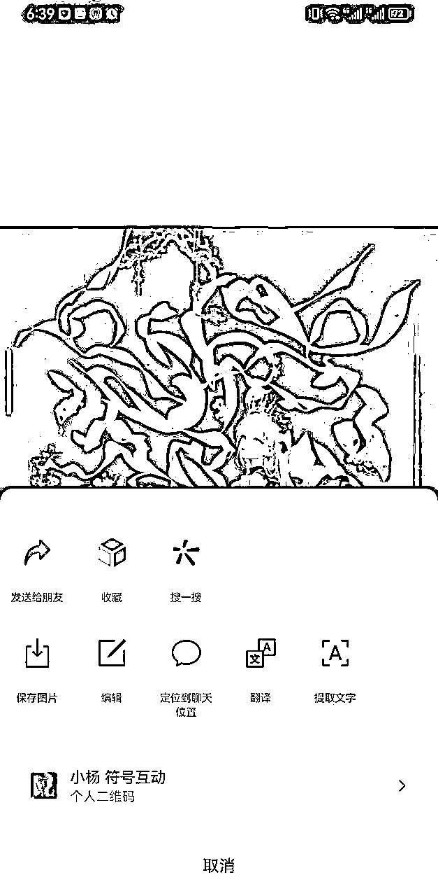

我还在别的微信群里，看到了需求：

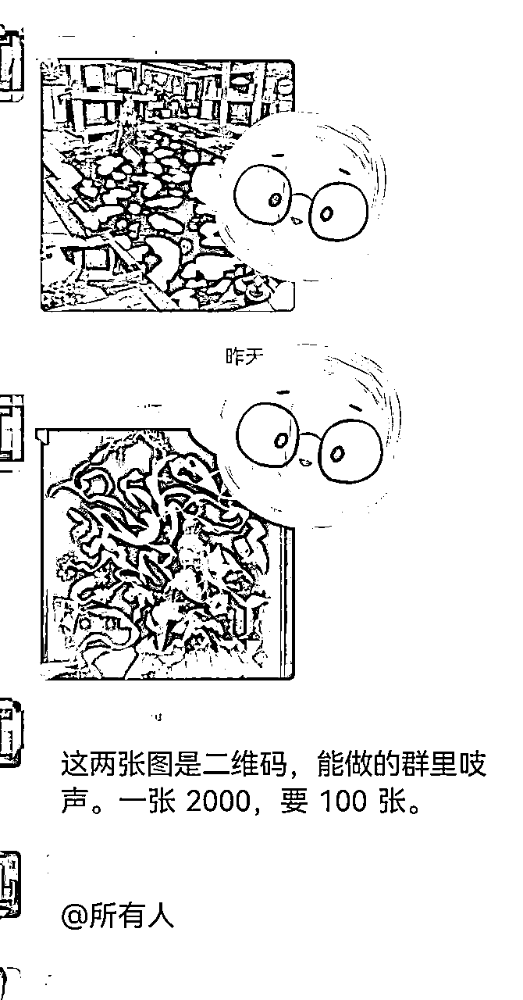

相信大家最近也看到了很多相关的帖子，艺术二维码除了好看，变现的路径也不少，我大概整理了几条：

1、做课程，教别人怎么做（卖水卖铲子的最容易赚钱）

2、定制属于自己 IP 的艺术二维码，可以在某音、某红书引流，预防平台检测

3、私人定制，开网店，现在某宝、某咸鱼有挺多的

4、为各种周边衍生品做好看的宣传，比如手提袋、纸杯、书包等

5、做出好看的艺术二维码，发各个微信群做引流，吸引感兴趣的人加你

6、有一定技术的小伙伴，可以做成模型，为广大用户提供简易生成操作，收点卡费

.....

更多变现方法，欢迎大家在评论区留言！

那么，具体要怎么生成AI艺术二维码呢？

实际上，比较常见的方法，是我们需要用到 quickqr.art 和 discord（用过MJ的小伙伴应该都知道，需要魔法）这两个工具，生财也有小伙伴有过介绍，就是会稍微麻烦一些~~

不过，国内很多人已经嗅到了这个商机，做出了自己的模型，供大家生成，目前我了解的有以下三个网站：

1：https://hysli.io/#/app?i=9n6sd7

2：https://qr.zzfw.cc/draw

3：https://qr.mewx.art/?invite_code=jsxgyhGR

根据我自己的测试，第一个网站功能比较齐全，性价比较高，这里我向大家手把手演示如何使用：

## 第一步：输入网址

## https://hysli.io/#/app?i=9n6sd7

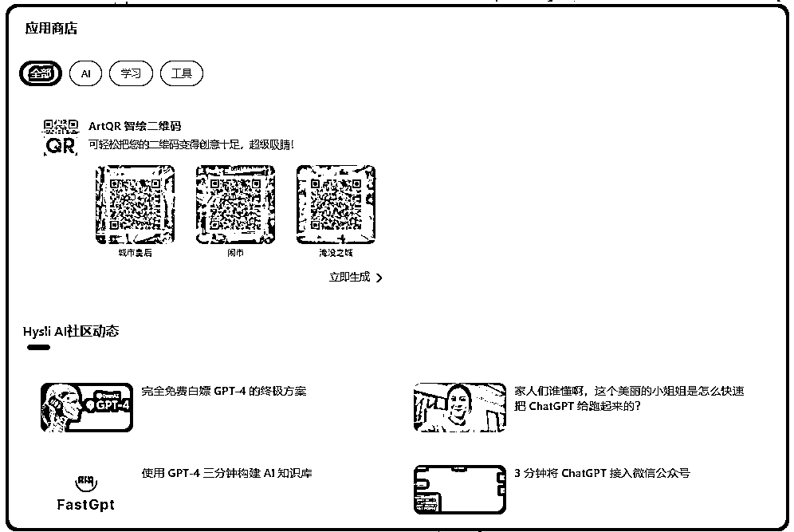

点击“立即生成”，在左上角会出现【立即登录】

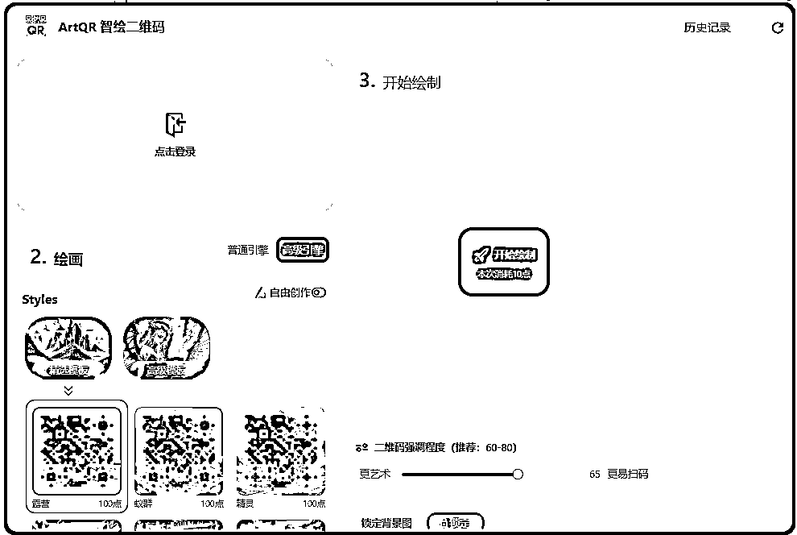

点击“立即登录”-“新用户注册”，输入你的手机号和验证码

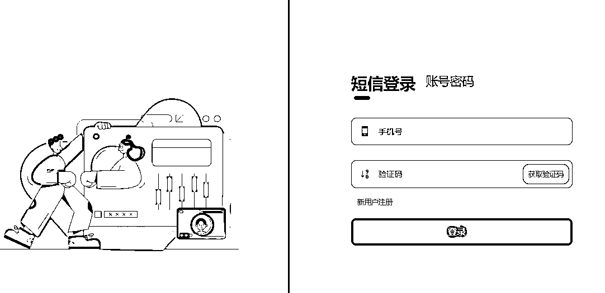

最后，进入首页

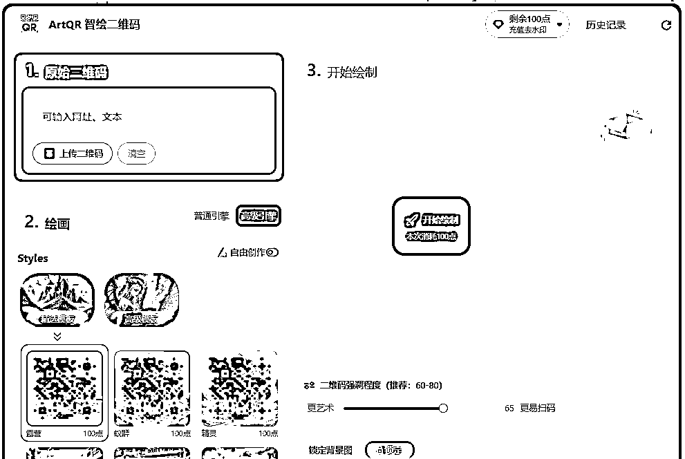

## 第二步：准备生成

我们先看上图的几大组成部分：

*   左上角的【原始二维码】是我们需要上传自己的原始二维码，比如微信二维码、QQ二维码等等

*   左下角的绘画，有两种模式

### 第一种，直接套网站现有的模板，模板分高级和普通（如下图）

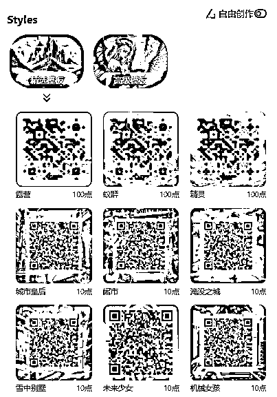

*   普通的模板，生成一张消耗10个点（价格为几毛钱，一开始会送400点），很便宜，不过一看就是二维码，简单来说，就是模型比较普通~~

*   高级的模板，消耗的点数比较多100点，但是看起来比较美，目前只有3个高级模板，网站还在不断更新中~~

下图为我自己生成的：

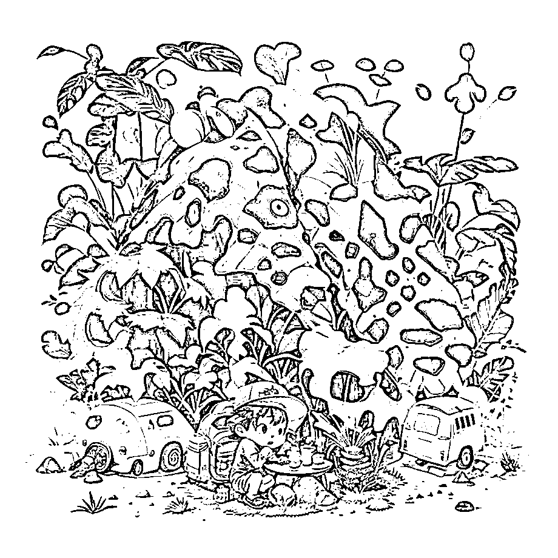

### 第二种，点击“自由创作”，可以写上自己的提示词

同样，我们要选择“普通引擎”还是“高级引擎”，普通引擎生成的就很像二维码，高级引擎就是高级哈哈！

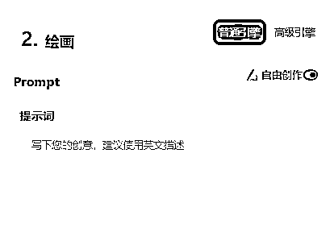

这个就考验自己的功力啦，大家可以不断尝试，画出自己满意的作品（温馨提醒：尝试需要扣点数哦~~）

我分享一段提示词，以及生成的图片

([balloons:Small planets:0.5]:1.4), (Small_planets inside of balloons:1.4), (lots of colorful Small_planets:1.35) (colorful planets, earth, floating petals, big balloons:1.22), 1 girl, cute face, Full body, sitting, detailed beautiful eyes, costume combination, Goddess, perfect body, [nsfw:0.88] (sitting on ice_planet:1.22) (lots of [floting blue Butterflies:floting ice:0.4]:1.22) (detailed light), (an extremely delicate and beautiful), volume light, best shadow,cinematic lighting, Depth of field, dynamic angle, Oily skin,

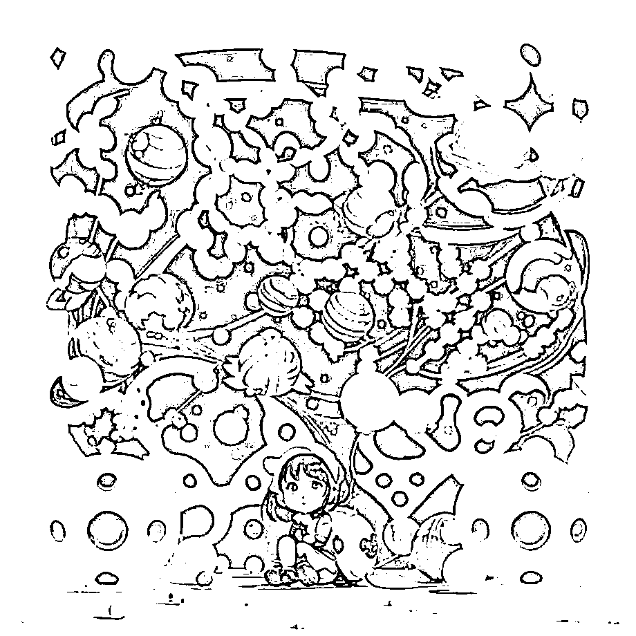

这个部分，我们也可以直接写中文，网页会自动翻译成英文

## 第三步：开始绘制

在点击开始绘制前，我们要注意下方的“二维码强调程度”，往左边拉，图片更艺术，但是很可能扫不出来二维码；往右边拉，生成图片的二维码更清晰，会不好看，所以我们需要取一个平衡点。

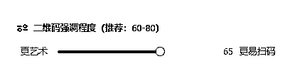

我一般是取60-70，如果60扫不出来，就换65或者70，如果70都不行的话，那可能需要换提示词了（不要一直刷哦，每生成一次，都要消耗点数）

一切就绪后，点击【开始绘制】，一般需要等待1分钟左右，你就可以生成自己的艺术二维码啦！

我分别选取了【普通引擎】和【高级引擎】做对比：

第一张是普通引擎

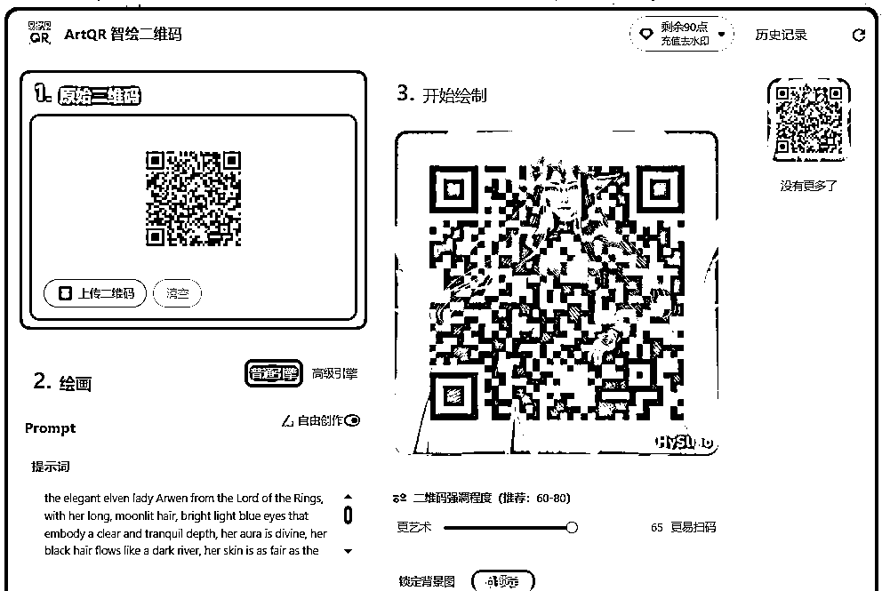

第二张是高级引擎

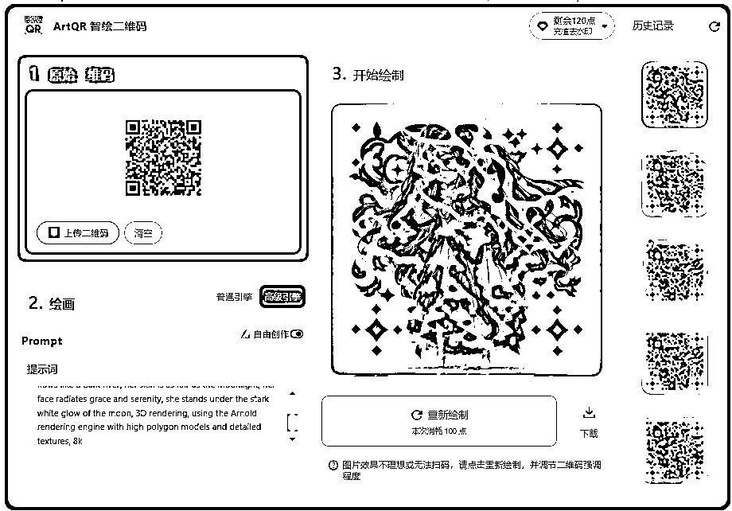

效果是不是差很多哈哈~~

如果不满意，就点击【重新绘制】

再放几张我做出来觉得不错的艺术二维码：

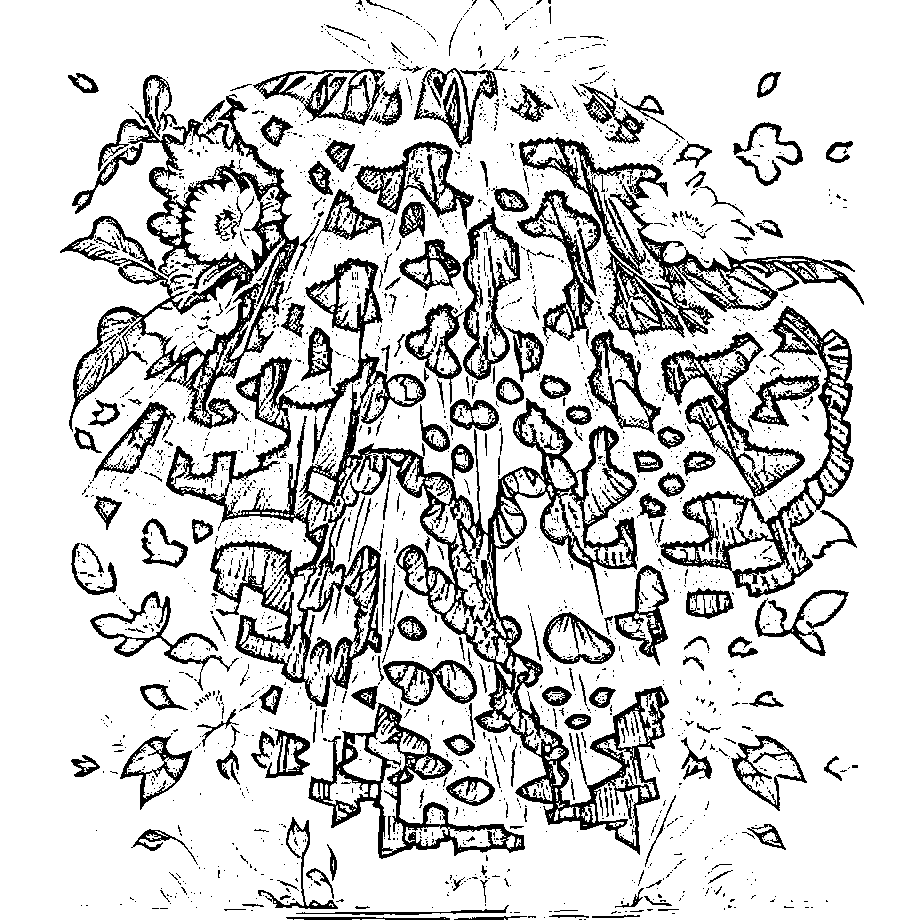

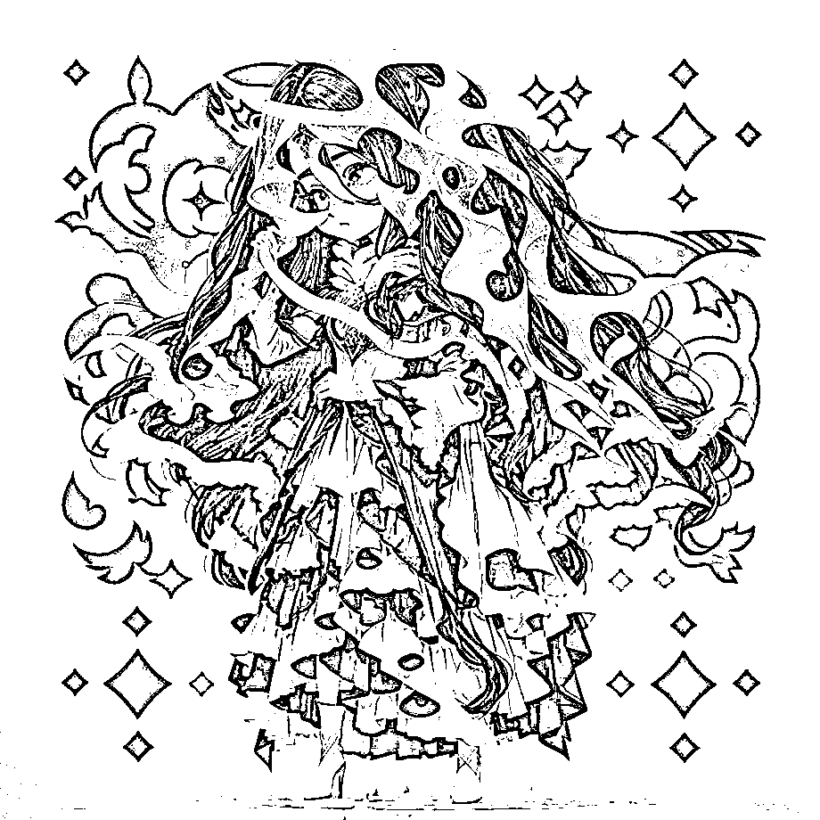

最后，截图一下充值的价格，我个人觉得，还是挺亲民的哈哈哈

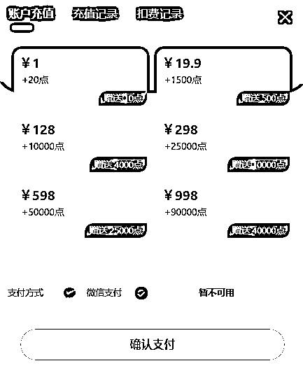

个人声明：本人和该网站没有任何关系，只是觉得好用，纯属推荐！