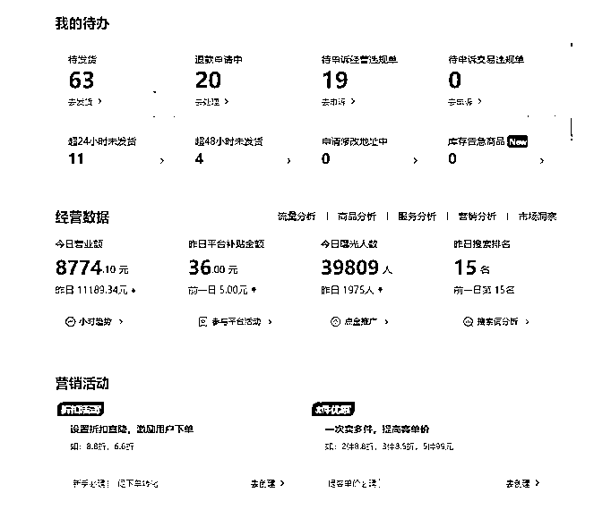
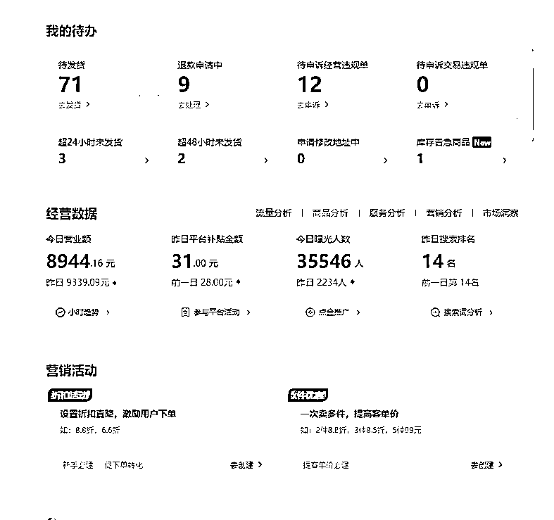
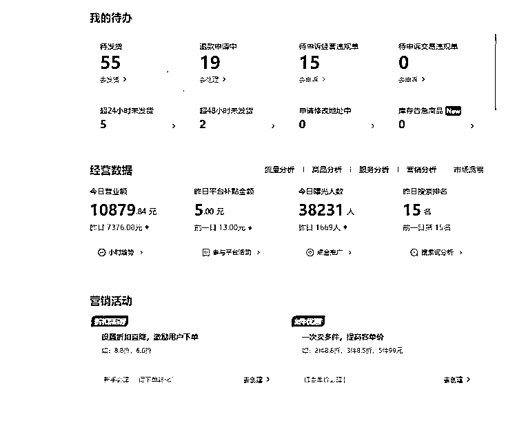
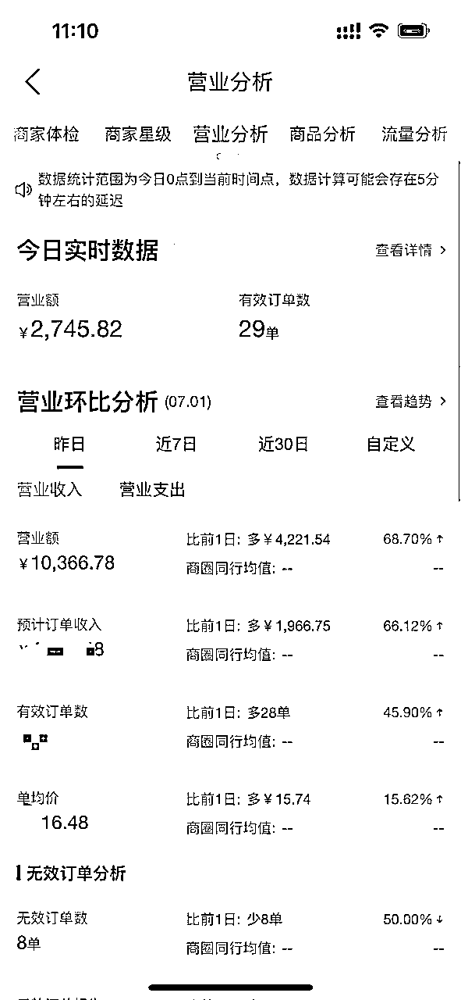
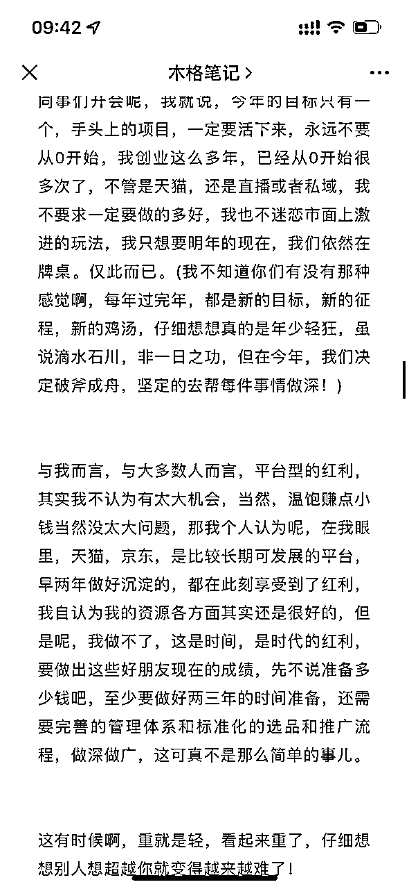
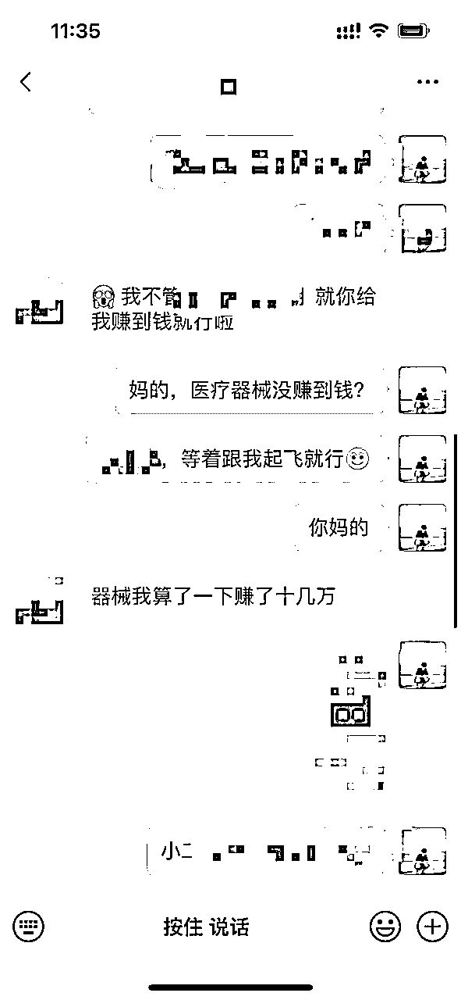
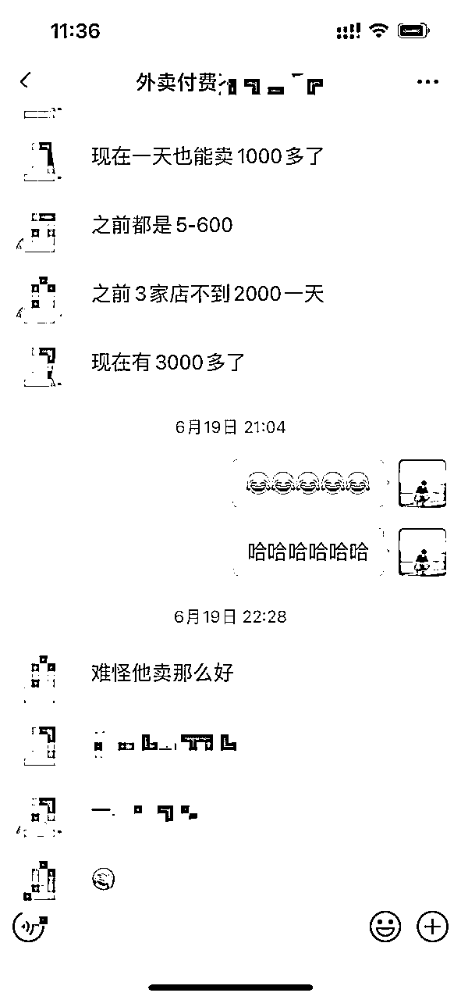
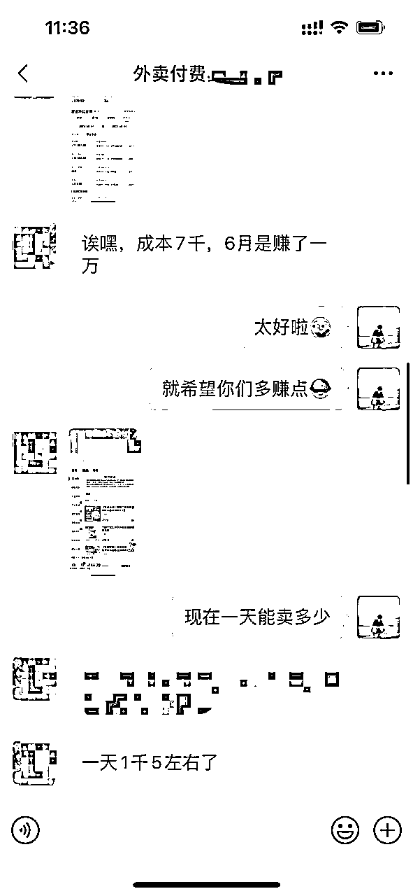

# 美团店群蓝海二类医疗，从零做到月利润30万➕复盘思考

> 来源：[https://e8bqmagdu0.feishu.cn/docx/YZIIdsceXofIIgxWRhKctepxn4e](https://e8bqmagdu0.feishu.cn/docx/YZIIdsceXofIIgxWRhKctepxn4e)

生财有术的圈友们大家好，我是木格，今天我想分享下，我们美团的心路历程，通过8个月时间，从0做到稳定月利润30W+的心路历程及行走路径【文末附带“运营方法”和“下店流程”】

在此之前，我先给大家看我们几家店的数据

早在去年11月，今年年初，我都有做过一些关于美团的分享，一个是电商板块，一个是药房板块，很庆幸我们一直坚持到了现在，并且，我们也会朝着这条路，一直走下去，今天这篇文章，我复盘分享下我们是怎么一路走过来的。我们每一步，是怎么做的。

https://mp.weixin.qq.com/s/JD0K5u5C3Z3el5STCarcyw 有需要了解详情的可以回顾几个月前我发布的这篇文章。我的心路历程给大家梳理一下

从去年下半年的美团电商，再到年底的医疗器械，再到大药房，我们一直没有去开特别多的店铺，一直就帮店铺控制在个位数，并没有去铺很多，原因也很简单，不是不赚钱，我就是想做慢一点，熟悉我的朋友应该知道，我在这方面是吃过两次大亏的了，第一个是天猫，一个是抖音小店，都是大风口，我选择了最快的路线，最后的结果就是赚了点小钱，团队人员各方面能力和认知并没有得到成长，反而是身边原先不放在眼里，慢工出细活的大哥们，现在遥遥领先，拿天猫来说，普通的一年几百万，做得好的，一家店，一年几千万，也许，当时他们做的没我早，没我好，也没有我店多，但是，这就是实实在在发生在我身上的例子，我也不是相信而看见，我只是和大多数普通人一样，看见而相信。所以这种错误，我是真的不会再犯第三次了

“这有时候啊，重就是轻，慢就是快，看起来重了，仔细想想别人想超越你就变得越来越难了！”

当时做这些的想法就是，宁可慢点，少赚点，我只要我能活下来，走对的方向，做正确的选择，从电商，转到医疗器械，再到大药房，我们一直走的很慢…

目前我们医疗器械还是只有五六家，有一家因为提现流水的问题，这两天刚关了，这家店铺一个月有个两三万利润，也挺可惜的。 另外一个就是大药房了，目前就只有小几家，刚跑通渠道，正在铺，但是产出，可以做到五六万利润一个月，好了，不扯太多，这并没有多赚钱，或者说，我认为还没到我真正赚钱的时候，因为我们做的还可以再深很多，我想。再积累个两年，再完善下供应链和流量渠道，所以文章中“店群”二字，我认为应该加个引号，想长久发展一定是脱离店群的。

其实，我更多想表达的是，第一，这个赛道有机会，第二，我们做的很慢！半年多过去了，我们也就到这个进度。放在从前，我毫不夸张的讲，我大概率已经开了上百家店铺了，但是这次我没有这么做，我经常在文章中强调，要慢一点点，稳一点点。我用实际行动告诉大家，我确实是这么做的。

红利

我依然认为现在是处在红利期的，流量虽说没有抖音那么大，但是做的人少，商家少。

第二是调性，有做过京东的就会比较清楚了，相对比较稳定，不像抖音，三天捕鱼，两天撒网，店铺起来了基本不会怎么掉，只要在运营上不出大问题，店铺维护好，差不多就可以了

深耕

我呀，自认为，我的资源各方面，还是比较好的，但是这一两年来，其实我在电商圈并没有看到什么比较好的项目，最近我又去了杭州和西安，见了好多好朋友，大家对目前的形势其实都是相对比较悲观的，和目前市面上比较热的项目相比，医疗类目 有机会深耕。这也是我们一直坚持下去的原因。

回到正轨，三个月前，我们有做了一期关于医疗器械的训练营，我可以很明确的告诉大家，百分之80以上的人是取得到了结果，如果你有做培训，你就会知道这个数据意味着什么，正常我们说能有个百分之30的人取得结果就已经非常不错了！

像这样的数据，我们还有很多，只是平时，我真不爱晒这些数据，写到这里，我不禁想起去年重新拾起做ip写在文章中的第一句话；“真诚，利他，永远是对未来最好的价值投资”！

我呢，清楚我的交付做的并不是很好，为啥会有这么好的效果，就是项目选的好！只要店铺能下来，我不担心朋友们会赚不到钱，只要你听话照做，基本都没问题

前几天我在视频号开直播和大家说，这都赚不到钱，和猪没啥区别！忠言逆耳，但这也是事实，我说这些话并不是为了让大家去参加我的内训社，你们大可放心，我会帮我们运营的两种操作方法毫无保留的告诉大家，帮目前的两种运营方式分享给大家，之前没分享是因为担心会影响到内训社学员的利益，现在大家大多都盈利了，况且都在做更有沉淀的事情了，所以并不影响。这不是一时半会儿就能被其他人赶得上的事儿

运营玩法分享

①多铺货，注意下不要去传百货的，容易被停业整顿，正常按类目上传，选择热搜词，只要是符合条件的，铺就好了，对了，要注意下，医疗相关的类目，打假会非常多，进口，otc，等产品不要去传。选品流程走通后，就是铺，多铺就好了。能铺多尽量铺多，这种玩法大概一天做个两千左右营业额是正常的，好处在于出效果快，但是呢，链接太多，就会有风险，虽说目前不抓，但是… 看个人选择

②选优质的商品，去拿授权，天猫1688都可以，再配合平台报活动，做下推广，这种玩法就很稳，只需要上一百两百个产品就可以，我更偏向于这种操作方式，起店周期虽然慢一点，但是绝对持久，前期一个月左右卖个大几百，两个月左右可以做到一两千

目前这两种运营方式都是可行的，最后透露给大家一个不为人知的小细节，第一种，可以做到几天回本，从财务的角度来说，已经是非常好的了，嗯我只能说到这儿了，第二种方式呢，就是细水长流更长久的玩法，优化供应链，优化运营和选品，这种方式目前的情况就是，保守估计哈，光一家店铺，一年赚个二十万左右问题不大

坦白说，原本在我内容框架里，想再写下深度和机会的，也就是我们自己在深耕的事儿，大概内容分为测试，流量，工商，资源，运营深度，供应链这几个板块内容，别小瞧，这个项目虽简单，但是门槛是可以做的非常高的，我想了想，现在写这些似乎大家目前来说似乎还没啥参考价值，等大家做了再说吧，过两个月我再去做这方面的深度分享！

关于下店

“这个大概需要一个月左右的时间，资质办理到店铺下来时间是比较长的，不是说像抖音淘宝拼多多一样，说开就开，时间的壁垒，那也是壁垒” 结尾查收哈！

最后我想分享我的近日思考

时间过去了好久，这是我创业的第七年了，从18岁到25岁，我经历了很多，起起落落，跌宕起伏，我从不忌讳告诉大家我失败的经历和我做过的错误的选择，这些对我未来都是有意义有价值的事情，毕竟，吃亏要趁早。

我清楚，做长线，就得忍受长期的痛苦，要屏蔽各种诱惑的信息，一步错步步错，要顾全大局。

做短线，就要接受项目随时不好做，做好随时倒闭的准备，简而言之，能捞多少捞多少，别又当婊子又立牌坊

人这一生最重要的就是选择，选择什么样的项目，找什么样的合伙人，娶什么样的媳妇等等

我们选择深耕大药房，再加上慢慢做，定长远的计划，没有一下子做的很宽，这就给我们未来带了希望

现在呢，我希望我做的所有事情，就如我的公众号，我的药房这样，有迹可循，有积累，有沉淀，”走宅路，做时间的朋友！”

共勉

关于下店，我做了个文档：美团医疗器械店申请流程 By 木格

PS：【有药品供应链或有药品经营许可证的，有这方面经验的朋友们，欢迎联系我一起合作哈，一起来做点有深度的事儿！】