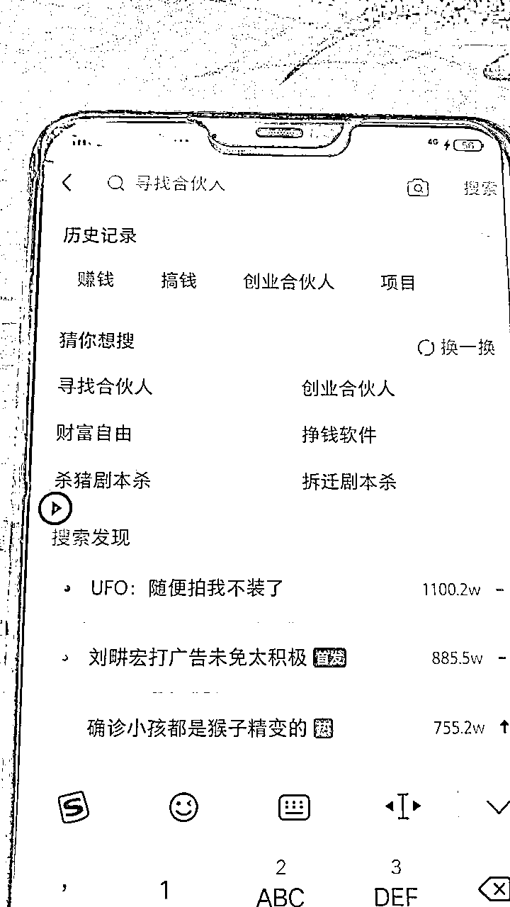
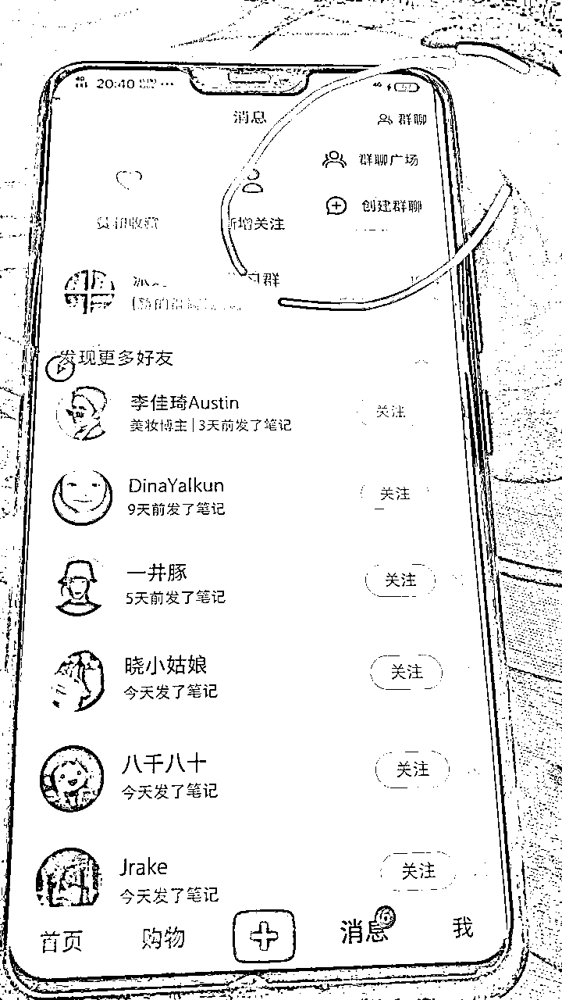
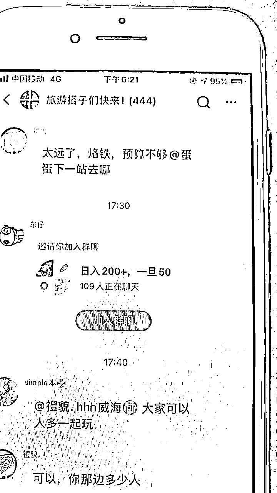
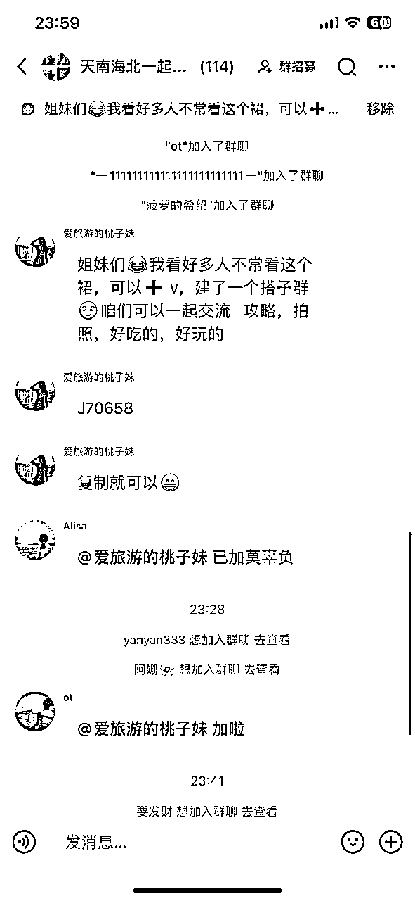
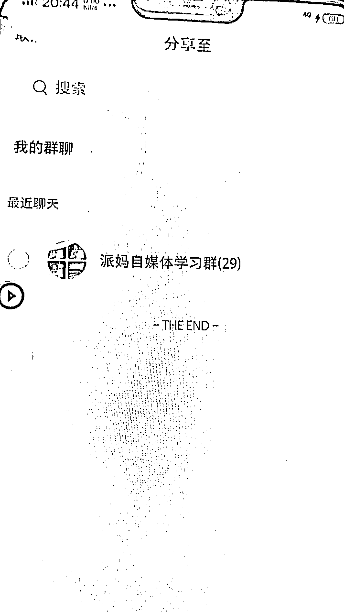

# 小红书精准截留创业粉玩法

> 来源：[https://dte8en3l2y.feishu.cn/docx/YfqQdgwwvo51OYxWey2c412lnMf](https://dte8en3l2y.feishu.cn/docx/YfqQdgwwvo51OYxWey2c412lnMf)

这个玩法，不仅仅适用于创业粉，其他领域的精准粉也可以这样玩。

玩法一共分为手动和脚本，

缺点是都需要大量的设备才能看到明显的效果。

优点是，门槛低，新手也能十分钟学会。

具体怎么做呢？

# 账号

首先我们要去买号，只要群聊功能正常的，就可以了

新号老号无所谓，资料改个女性就行。

# 刷标签

以创业粉为例，登录上去之后，我们就先去搜索一下，关键词，比如我们做创业粉的，就搜索创业，搞钱，赚钱，自媒体这类关键词

这么做的目的就是为了让小红书给我们推荐相关的群聊，多搜索几个关键词，这样子推荐的群聊更加精准。你要引流什么精准粉就去搜索什么关键词。

# 打开群聊广场

对标刷出来以后，我们就打开群聊广场

大家看到了，这时候推荐出来的就是我们想要的群聊了，然后大家挨个去加就行了。

手工玩家千万别懒，懒的话，你啥事也做不成。别说什么没效果，你先每个号加个100群没有？

你加了50个号没有？没有加到一定数量，看不到效果的。

# 怎么引流

加完之后我们就编辑好自己的广告去发就可以了

号如果能建群就发群聊链接,不能建群的话，就直接发文字,转发的时候，一次是9个群聊。

然后记得选我的群聊，这里面才是你加的所有群，从下面往上面发，这样子就不会太乱

这种玩法合适批量操作，一两个号，引流的效果并不大。

# 注意事项：

*   一个号不要加太多，会很卡，一般加一百来个就OK了。

*   不要边加边发，那样子很容易号就被限制了。我们这么截流本身就容易被举报踢出群聊，边加边发的话，很容易废号。

*   等号加了百来个群了，然后再去发

*   发完一轮，看着号没死，隔一个把小时再去发一轮。

# 账号哪里来？

相信大家也有自己买号的路子，淘宝有卖的，你们搜索小红书注册，换绑，这些关键词，然后去问店家就知道了。

# 软件版怎么玩？

软件说白了就是把上面的加群动作和发广告动作变成了自动，软件相当于挂机。

但是软件市面上肯定收费的，有程序员大佬就自己写一个，挺简单的。

# 总结

这个属于野路子，在他规则之内，首先小红书群内没法禁言，然后账号一天加群的数量也没有限制，对账号的要求也不高，账号成本很低，根据我十来年的引流经验来分析，大家有设备的，可以快速搞一波，因为不知道啥时候规则就来了。

如果你是没有这么多设备的，还是建议慎重下手，设备虽然不贵，但是万一你设备还没到，可能规则已经改了。

好了，感谢大家的观看，觉得不错就点个赞。