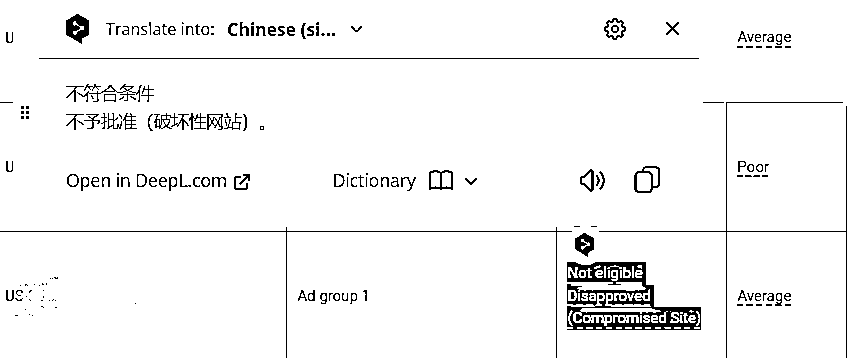
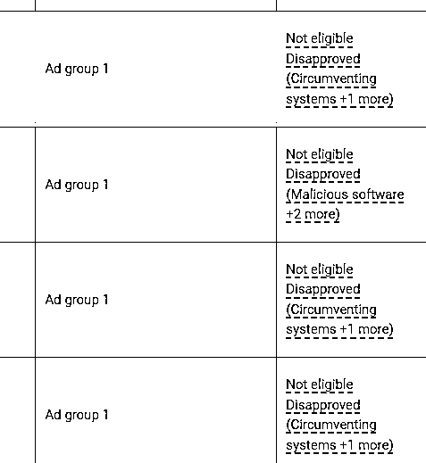
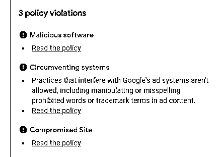

# 最新！如果你做MediaBuy，最近有遇到这个情况，希望这篇文章对你有所帮助

> 来源：[https://viuejh8h99y.feishu.cn/docx/Yt2wdNfYLoVKBgxtj83ch9Z2nHb](https://viuejh8h99y.feishu.cn/docx/Yt2wdNfYLoVKBgxtj83ch9Z2nHb)

闲言碎语就不多说了，直接进入到今天文章的正题！

关于近来用GoogleAds跑MediaBuy的朋友们，如果你遇到了“恶意软件”、“破坏性网站”、“受损网站”等等问题，这篇文章，或许会给你提供一些解决办法。

我是什么时候遇到的“破坏性网站”这个问题的呢？大概是在1个月之前（如下图所示），当时不以为意，也很快解决了这个问题。为什么不以为意呢？因为身边在跑MediaBuy的朋友，都没有遇到这个情况，好像我是个“特例”。

# 一、我什么时候开始重视这个问题？

我什么时候开始重视这个问题呢？在过去的1个月时间里，包括我自己在内，身边有两三个朋友陆续遇到了这个问题，有的人处理之后没有再出现这个问题；而有的人处理之后，跑了几天广告又出现了同样的问题。

*   比如这样的：

*   又或者这样的：

这时候，我开始寻求解决方案了。

# 二、解决的问题的一些思路及方法

频繁出现这个问题之后，也向行业中的一些大牛求教过，自己也开始想办法解决这个问题。通常出现这个问题，有3个原因：

1.  谷歌官方原因（换句话说，就是谷歌抽风）；

1.  追踪链接的原因（也就是Tracker可能出现的问题导致）；

1.  offer的原因（offer中含有的一些关键字、词组导致这个问题）。

那么，针对上述的三个原因，针对性地进行排查：

1.  首先，查找Tracker的域名中，是否含有敏感词，比如违禁词或者缩写等等；

1.  其次，查看offer的关键词中，是否含有敏感词，比如违禁词或者缩写等等；

1.  在更换offer无果之后，开始更换域名；

1.  在更换域名之后，再进行广告、广告组的修改；

1.  通常情况下，上述几步能够解决这个问题了。

但是，这里也要注意：

1.  谷歌抽风的问题，其实不太好解决，你要想通过他赚钱，只能随着他去变，这也是做这个行业的人所必须具备的技能；（换句话说，就是谷歌善变，你也要跟着善变，学会处理各种问题）

1.  你也可以不经过Tracker，直接跑直链，只是你需要应对联盟的审查；

1.  你也可以上述，因为最近也有朋友在说，遇到了这个问题，通过上述可以解决。但是上述一般的审核周期会稍微长一些，一般2-3天。

# 三、这个情况的影响以及启发

可能也有不少对MediaBuy不了解的朋友，看到这篇文章，不太能够感同身受。这个情况的出现，其实意味着你所跑的广告，全部都暂停了（据说7天内不处理，官方就会封账号）。

或者更加直白一点举个例子：假如你通过谷歌投放海外广告，出现这样的情况，意味着你的广告投不出去，也就是说没有人能够看到你的产品，你也就无法赚到钱了。

看过我前面文章的朋友们，应该都知道我是3月底开始实操这个项目，也写过一些关于这个项目的一些文章。今天这篇文章，差不多简单和大家分享到这里，如果你也遇到同样的问题，希望对你有所帮助；如果你暂时没有遇到类似的问题，那恭喜老板，可以顺顺利利赚美金！

当然，这其中也是蛮有启发的，因为要想赚一个行业的钱，就真的要全身心投入这个行业，并且不断去解决问题。问题会实时出现，解决问题的能力，也会实时得到提升。

# 四、往期回顾

1.  《聊聊我对Google Cash的一点个人看法》

1.  《Google Cash稳定日入200美金，首先需要做对这件事》

1.  《GoogleAds广告账户被封，有点儿小经验，分享给大家》

1.  《年中总结篇：一个纯小白在海外广告MediaBuy项目的进阶之路》

### 真诚希望对你有所帮助，祝各位生财老板，财源广进！