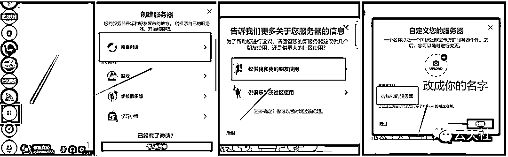

# 思维语录制作保姆级教程（图片会说话）

> 来源：[https://ixy2s5ruvqf.feishu.cn/docx/Z073dMlcmomg5CxeZKQcd5Y6nVg](https://ixy2s5ruvqf.feishu.cn/docx/Z073dMlcmomg5CxeZKQcd5Y6nVg)

思维语录，老人图像、小和尚图片会说话，月涨粉10w+

大家好，我是云天， 一个网赚自媒体人，有爱的知识分享者。目前主要从事知识分享社群，钻研网络黑科技。

今天给大家拆解一个最近一个月短视频平台超级火，涨粉超快，变现可观的项目，就是通过一张图片，给她配上思维语录、禅语、创业语录等音频，同时图片的嘴巴是动的视频。整体的流程超级简单，做出来的就是原创视频，不被判搬运和重复，熟练后基本上十几分钟一个视频。

变现方面，起号后可以收徒、卖书、做小程序等，基本上整个项目是又简单，涨粉又快。具体展示如下图，想必大家都刷到过类似的视频。。

上图1小和尚6月9日五万粉丝，现在半个月过去了，已经17万粉丝了，可以自行搜索账号查看。

以下为图文教程，我还录制了6节课的视频教程，有需要的可以到文末领取。感谢大家的点赞。

# 一、软件安装

目前这类软件有三种，经过我对比测试，选择了 CT8-CrazyTalk 这款软件。特点是中文、界面简单、操作简单、小白上手就会。首先按照标记的顺序安装，这里为了照顾小白，软件都是傻瓜式的，即装即用，无需设置。只需要一直按下一步即可，切记，千万不要改变默认安装路径。否则可能是英文版本。（软件我放在了文末）

# 二、素材寻找和制作

## 1、音频方面：

可以在抖音、快手平台搜索老人思维语录、创业语录、禅语等关键字，找到视频之后，点击右下角箭头，复制链接，打开“轻抖小程序”去水印下载视频。

然后将视频素材拖入“格式工厂”软件转换成mp3格式，这样就获得了一个MP3格式的音频文件

或者也可以选择网络上的配音软件进行配音，这样声音也相当于原创声音，效果更加。

## 2、图片素材制作：

第一种方法可以去百度、头条各大平台搜索，这里就不在阐述，我们主要讲如何进行AI原创图片

### AI图片的制作方法：

1、首先到某宝购买Midjourney，这里不建议大家自己注册账号并充值，因为自己充值很贵，一个月要几百块。我们到某宝上只需要购买下图这种一个月16-32元的共享账号即可。跑路也不心疼。

2、登录https://discord.com/，通过你购买的共享账号登陆进入社区。

3、进入账号之后，点击左下角的加号，创建自己的服务器。

4、我们这个时候就进入了自己的服务器，然后点击左下角的导航图标，进去之后，选择Midjourney社区

5、当你第一次进去的时候，右边是不显示列表的，这个时候我们点击右上角的人物图像，这个时候右边就会有列表，我们点击Midjourney，添加Midjourney机器人，安装到我们的服务器。

6、这个时候我们就进入我们的服务器，因为网站是外国的，所以我们的描述与要写成英文，我们可以打开百度翻译，输入类似的描述语。《一个戴着灰色帽子，白色长胡子的中国老年人，站在书架前，微笑着看着这个前方。全身照》。这里建议描述与不要写书架，选择素背影。因为后期做的视频可能会有问题。

7、复制英文，鼠标点击服务器里的最下方。选择/imagine

8、然后在如图处输入进去我们的描述语言，然后敲击回车。（注意——在输入描述语之后，后面加上 --ar 9:16 这样他会生成抖音比例的图片）

9、这个时候机器人开始运行，我们等待百分百运行到100%。

10、运行结束，MJ给我们生成了四张写实逼真的原创图片

在这里给大家解释一下U1-U4和V1-V4的意思

U1-U4：如果你看中了第一排第二张图片，你点击U2，机器人会重新给你发送一张这张图的大图版本。

V1-V4：如果你觉得第一排第二张图片不错，那么你点击V2，机器人会根据这张图的风格再给你生成四张图片

右边的刷新按钮：对着四幅图都不满意，点击刷新，会根据这个描述重新生成图片。

这时我们点击就可以右键下载这副图片了。

## 3、如何使图片的嘴巴会说话

1、首先点开我们安装的CrazyTalk v8.13 Pipeline Trial，按我下图点击，进入软件。

2、用鼠标将图片拖入软件内，选择2D，

3、点击切割按键，框选老人的头部，点右边的应用，之后点下一步

4、如图所示，将眼角和嘴角选到合适的位置。点下一步

5、通过鼠标拖动，将脸部轮廓定位，点下一步

6、将鼻子轮廓定位。

7、选择输入声音，选择我们提取的音频或者配好的声音，选择说话模式或者仅嘴唇同步。这个根据实际请款供选择，不好就撤销重新选择。一般只选择第三个。等缓冲生成好之后，

8、生成好之后，我们点击播放就发现嘴巴懂了，但是没有牙很难看。我们选择左上角的嘴巴按钮

双击牙齿之后，嘴巴就有牙了。我们在根据情况微调牙齿的位置。

最后点击左下角的播放按钮预览。觉得没问题，点导出，选择MP4格式导出。

## 4、视频的合成

首先将图片导入剪映，比例选择9:16，将图形放大到充满整个画面

再讲做好的动态头部拖入剪映，将图片的长度拉到和视频一样的长度。

然后选中头部图层，

然后我们选择圆形型蒙版进行选择脸部选择即可

这样一个视频雏形就完成了，后面再添加封面、字幕、标题等。一个完美的视频就大功告成了。

## 5、如何精进视频

这个还需要各位在努力摸索一下。

# 三、视频教程

除了文字教程，我还单独录了一份视频教程，总共6节课，比较详细。就直接发在这里吧

云天--思维老者语录教程（图片会说话）

视频教程+配套软件全在这里。

链接：https://pan.quark.cn/s/a86d02a61a32

# 写在最后：

好了，写这么多，如果你对我拆解的思维语录图片会说话项目比较感兴趣，可以去实际操作下这个项目

因为现在这种视频流量确实很大，实操一遍之后你会发现，做起来真的很简单，外面有培训这个项目都要499-999，也别让人家去割你韭菜，你看完我拆解的基本上可以去测试了，如果你有问题在找我交流哈！