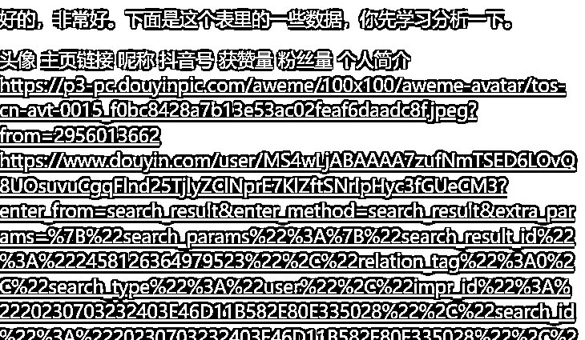
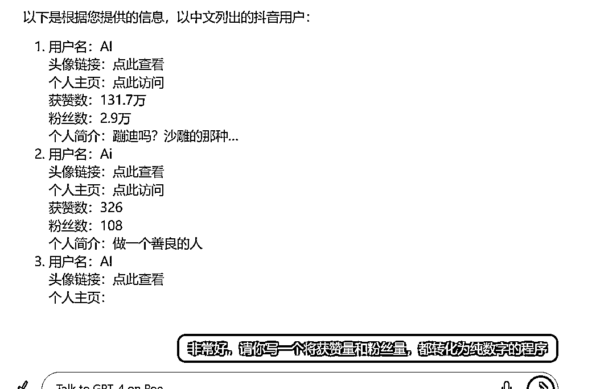
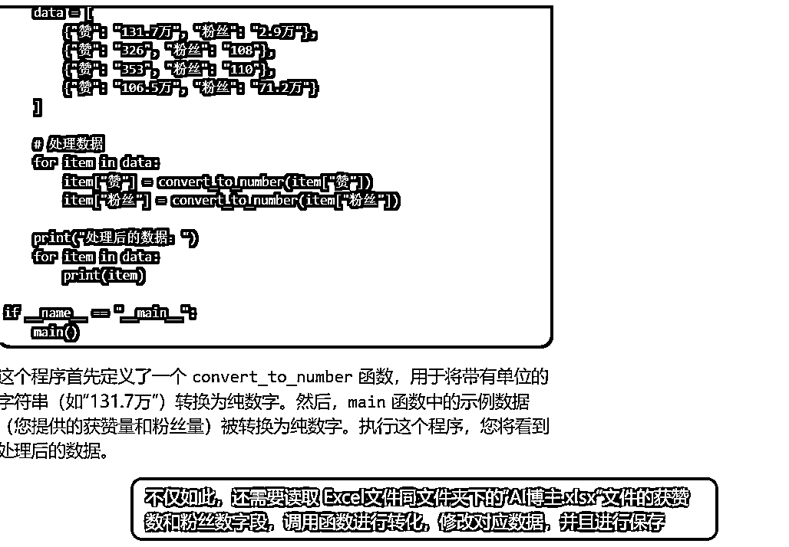
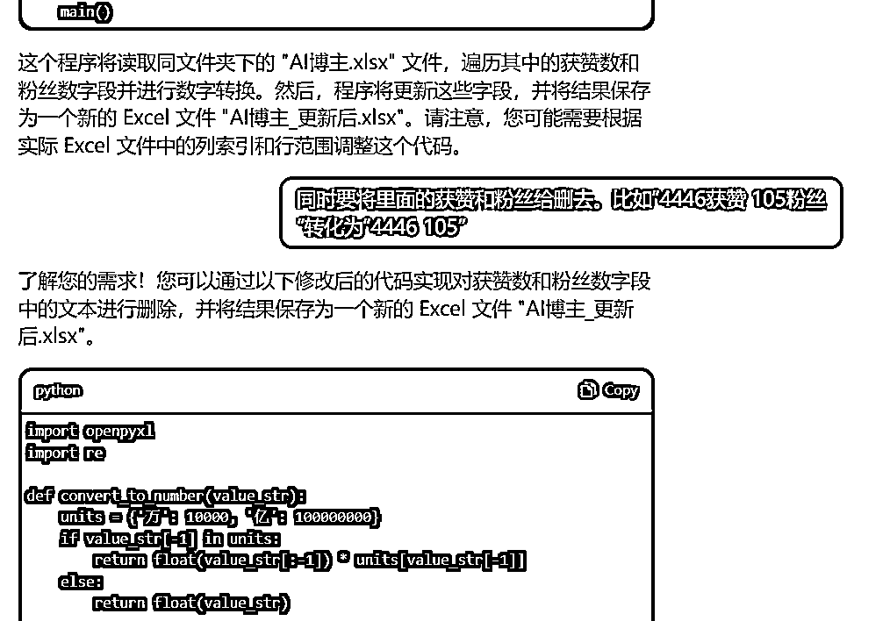
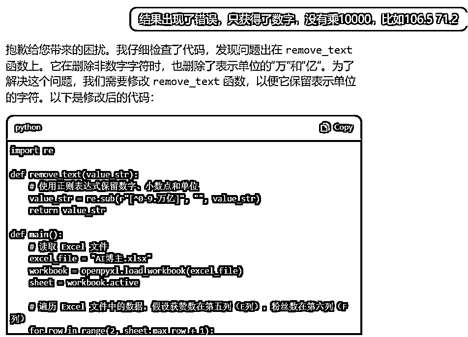
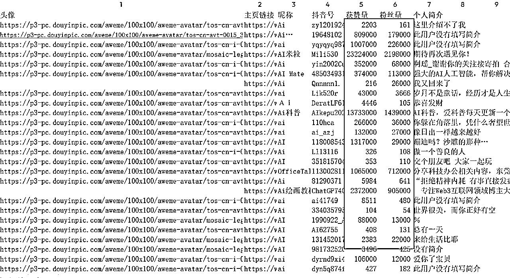
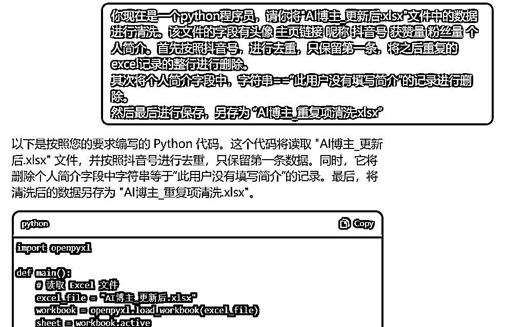
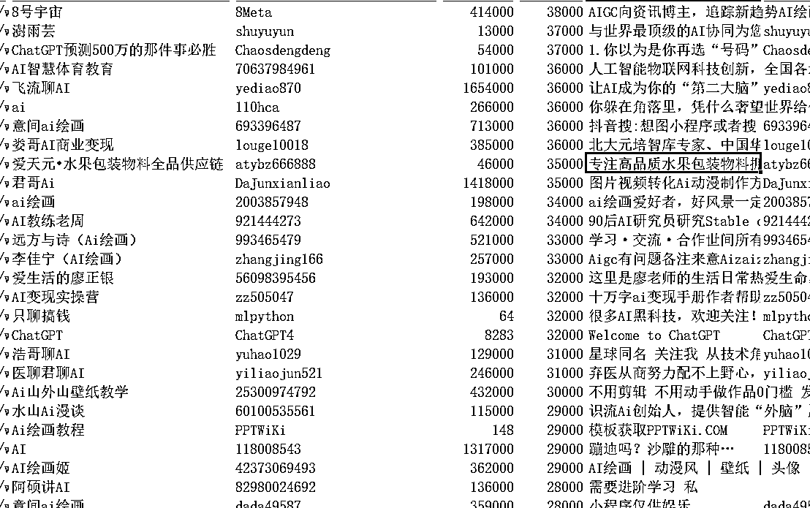

# 利用AI批量爬取并且清洗1000名AI方向博主微信，并且自动化添加好友

> 来源：[https://xjfih5idi1.feishu.cn/docx/BoKPdTPxgo63yCxJRnOcePutnZb](https://xjfih5idi1.feishu.cn/docx/BoKPdTPxgo63yCxJRnOcePutnZb)

任何足够先进的技术，都与魔法无异。 ——阿瑟·克拉克《2001太空漫游》

有时候我们需要多认识一些特定的领域的朋友

比如AI领域，自媒体领域，创业领域等等

其实优秀的人都会做抖音，而做抖音一般都会留下自己的微信联系方式

但是手动收集和添加有非常的麻烦，几千个微信想想就很难

那么有没有一种可能通过 技术批量爬取 ，并且自动化添加微信呢？

AI可以帮助你！

这里又利用AI的力量进行了Python程序的编写，丝滑无比。希望能够帮到屏幕前的你

# AI博主信息爬取

## 八爪鱼软件

使用八爪鱼进行抖音AI博主的爬取

在抖音的用户搜索框里面，搜索AI博主

## 搜索的关键词有

AI 聊AI 说AI 教AI ai绘画 AI变现

然后手动整理到一个excel表中

# AI博主数据清洗

## 将点赞和收藏转化为数字

将点赞和收藏转化为数字，便于由高到低进行排序。

默认爬取到的是文字和数字混合在一起的，不便于使用


给GPT设置角色，并且让他学习Excel的数据结构






学习会结构之后，让他编写一个数字转化程序。可以逐步的提出要求





程序运行完毕之后出现了错误，只是转化了数字，但是没有乘10000


输入错误，让GPT进行修改



最终完成了正确的代码

```
import openpyxl
import re

def convert_to_number(value_str):
    units = {'万': 10000, '亿': 100000000}
    try:
        if value_str[-1] in units:
            return float(value_str[:-1]) * units[value_str[-1]]
        else:
            return float(value_str)
    except ValueError as e:
        print(f"无法转换的字符串：'{value_str}'，跳过此行。")
        return None

def remove_text(value_str):
    # 使用正则表达式保留数字、小数点和单位
    value_str = re.sub(r"[^0-9.万亿]", "", value_str)
    return value_str

def main():
    # 读取 Excel 文件
    excel_file = "AI博主.xlsx"
    workbook = openpyxl.load_workbook(excel_file)
    sheet = workbook.active

    # 遍历 Excel 文件中的数据，假设获赞数在第五列（E列），粉丝数在第六列（F列）
    for row in range(2, sheet.max_row + 1):
        # 读取获赞数和粉丝数
        like_str = sheet.cell(row=row, column=5).value
        follower_str = sheet.cell(row=row, column=6).value

        # 删除文本
        like_str = remove_text(like_str)
        follower_str = remove_text(follower_str)

        # 转换为纯数字
        like_num = convert_to_number(like_str)
        follower_num = convert_to_number(follower_str)

        # 如果转换成功，则更新数据
        if like_num is not None and follower_num is not None:
            sheet.cell(row=row, column=5).value = like_num
            sheet.cell(row=row, column=6).value = follower_num

    # 保存修改后的 Excel 文件
    workbook.save("AI博主_更新后.xlsx")
    print("已成功更新并保存为 'AI博主_更新后.xlsx' 文件！")

if __name__ == "__main__":
    main()
```

最终运行成功



## 将没有简介的，以及重复的记录进行删除

如果没有个人简介的，大概率不是AI博主。

个人简介 为【此用户没有填写简介】，【谢谢你的关注】【空】的进行删除

同时爬取的过程中可能会重复爬取

所以按照 抖音号 字段删除重复项




代码如下

```
import openpyxl

def main():
    # 读取 Excel 文件
    excel_file = "AI博主_更新后.xlsx"
    workbook = openpyxl.load_workbook(excel_file)
    sheet = workbook.active

    # 去重抖音号
    unique_douyin_ids = set()
    row = 2
    while row <= sheet.max_row:
        douyin_id = sheet.cell(row=row, column=4).value

        # 如果抖音号已经存在，删除整行记录
        if douyin_id in unique_douyin_ids:
            sheet.delete_rows(row)
        else:
            unique_douyin_ids.add(douyin_id)
            row += 1

    # 删除个人简介为“此用户没有填写简介”的记录
    row = 2
    while row <= sheet.max_row:
        bio = sheet.cell(row=row, column=7).value

        # 如果个人简介等于“此用户没有填写简介”，删除整行记录
        if bio == "此用户没有填写简介":
            sheet.delete_rows(row)
        else:
            row += 1

    # 保存清洗后的 Excel 文件
    workbook.save("AI博主_重复项清洗.xlsx")
    print("已成功清洗并保存为 'AI博主_重复项清洗.xlsx' 文件！")

if __name__ == "__main__":
    main()

```

运行结果如下


## 将抖音号字段的潜在微信号，进行析出

通常很多人会把抖音号设置为微信号


你现在要检查【抖音号】字段，有很多人会将抖音号设置为微信号。

微信号的特征是：仅支持6-20个字母、数字、下划线或者减号，以字母开头。

微信如果绑定了手机号（11位数字，1开头），QQ号（5位到10位数字），那么也可以被算作是微信号，很多人留微信号也直接留手机号或者微信号。

请你使用正则，将抖音号字段里面，可能的微信号，过滤出来，并且保存到 “AI博主_重复项清洗.xlsx”文件中的 【微信号】字段 ，是第8列。

输出为Python代码

代码为下

```
import openpyxl
import re

def is_wechat_id(douyin_id):
    # 检查是否符合微信号规则
    wechat_rule = re.compile(r"^[a-zA-Z][a-zA-Z0-9_-]{5,19}$")
    phone_rule = re.compile(r"^1\d{10}$")
    qq_rule = re.compile(r"^\d{5,10}$")

    if wechat_rule.match(douyin_id) or phone_rule.match(douyin_id) or qq_rule.match(douyin_id):
        return True
    return False

def main():
    # 读取 Excel 文件
    excel_file = "AI博主_重复项清洗.xlsx"
    workbook = openpyxl.load_workbook(excel_file)
    sheet = workbook.active

    # 检查抖音号字段，并将可能的微信号保存到第8列
    for row in range(2, sheet.max_row + 1):
        douyin_id = sheet.cell(row=row, column=4).value

        # 使用正则表达式检查抖音号是否可能是微信号
        if is_wechat_id(douyin_id):
            sheet.cell(row=row, column=8).value = douyin_id

    # 保存更改后的 Excel 文件
    workbook.save("AI博主_重复项清洗.xlsx")
    print("已成功将可能的微信号保存到 'AI博主_重复项清洗.xlsx' 文件中的【微信号】字段！")

if __name__ == "__main__":
    main()
```


## 将个人简介中的微信号进行析出

同时有些人还有可能将微信号写在个人简介里面

你写的非常好，下面从个人简介中解析出微信号：

匹配微信的正则表达式是：

[a-zA-Z\d][ a-zA-Z\d_-](5,19}

除此之外

1、内容出现1开头的11位手机号，基本上多半是微信号，正则表达式如下：

1\d(10}

2、冒号（分中文冒号和英文冒号）后面跟的英文+数字的内容，基本上多半是微信

号，正则表达式如下：

[:\uff1a][\s]?[a-zA-Z\d][a-zA-Z\d_-]{5,19]

3、包含"联系或者"合作"内容，后面跟的英文+数字的内容，基本上多半是微信号，正

则表达式如下：

[\u52a0/\u5fae].{0,10}[a-zA-Z\d][a-zA-Z\d_-](5,19]

(\u5fae\u4fe1/\u8054\u7cfb/\u5408\u4f5c).{0,10}[a-zA-Z\d][a-zA-

Z\d_-1{5,19}

请你根据这里的提醒，匹配个人简介字段中可能存在的微信号，添加到 微信号1字段中（第9列），输出为Python代码

```
import openpyxl
import re

def find_wechat_id(bio):
    patterns = [
        r"[a-zA-Z\d][ a-zA-Z\d_-]{5,19}",
        r"1\d{10}",
        r"[:：][\s]?[a-zA-Z\d][a-zA-Z\d_-]{5,19}",
        r"[\u52a0/\u5fae].{0,10}[a-zA-Z\d][a-zA-Z\d_-]{5,19}",
        r"(\u5fae\u4fe1/\u8054\u7cfb/\u5408\u4f5c).{0,10}[a-zA-Z\d][a-zA-Z\d_-]{5,19}"
    ]

    for pattern in patterns:
        match = re.search(pattern, bio)
        if match:
            return match.group()
    return None

def main():
    # 读取 Excel 文件
    excel_file = "AI博主_重复项清洗.xlsx"
    workbook = openpyxl.load_workbook(excel_file)
    sheet = workbook.active

    # 从个人简介字段解析可能的微信号，并保存到第9列
    for row in range(2, sheet.max_row + 1):
        bio = sheet.cell(row=row, column=7).value

        # 使用正则表达式检查个人简介中是否可能包含微信号
        wechat_id = find_wechat_id(bio)
        if wechat_id:
            sheet.cell(row=row, column=9).value = wechat_id

    # 保存更改后的 Excel 文件
    workbook.save("AI博主_重复项清洗.xlsx")
    print("已成功将个人简介中可能的微信号保存到 'AI博主_重复项清洗.xlsx' 文件中的【微信号1】字段！")

if __name__ == "__main__":
    main()
```


* * *

最终结果如下



# 进行AI博主微信的自动化添加

其实市面上可以自动添加的软件一抓一大把

下面这个是相对口碑比较好的，也有专人一直在维护（不是广告，他们确实是一直在维护这个软件）

这种添加方式是RPA，其实就和我们手动添加是一样的，只不过是程序帮你做了操作而已，是最安全的一种方法

我看了一下最新的更新是在7.3日


软件官网http://www.jisubianxian.com/

需要安装特定版本的微信 https://soft.3dmgame.com/down/247977.html

禁止微信升级补丁https://cup.lanzoui.com/pcwxnoupdate

使用方法

1.  添加名单

名单有四个字段，分别是微信号，昵称，标签和招呼语

1.  修改规则

目前我这个账号每天添加20-30人是可以的

1.  开始进行添加

# 我是谁

我想要在宇宙中留下痕迹，不是被宇宙留下痕迹。 ——史蒂夫·乔布斯

伟业简介：

1.  AI创业者

1.  比特飓风创始人，专注于人工智能商业化

1.  过往开发应用：成大助手、中科心测、慧读慧写校务通、invoicesAdmin

1.  玩赚AI社群创始人（社群英文名：AI Value Makers)

1.  抖音账号博主“伟业聊AI”，账号运营20天，累计播放量已达200万，点赞3万，精准粉丝1800人

1.  正在进行AI应用-AI口语研习社的开发

1.  大学期间通过两年的时间自学编程，领导7人团队独立开发并推广成都大学学生综合服务平台——成大助手。总用户量一万+，日活2000+

从小我就有三个理想：

第一个理想是成为一个优秀的企业家，开创属于自己的事业，哪怕只是一个10人的小公司，我不想辜负我的名字。

第二个理想是成为一个教育者，传授知识，启迪思维。我享受传授知识的过程，我希望通过我的教导，人们能够受益，不再为知识而困扰。我渴望把我的经验和见解变成语言，写成书，让我的声音被世界听见。

第三个理想是成为一个创造者，把想象力转化为现实。我热爱将东西从无到有、从混乱到有序的过程。我痴迷于优化和完善事物，享受着从混乱中创造出秩序的过程，这给我带来了无与伦比的满足感。

何其幸运，就在今年，这三个理想在我身上得到了融合，它们已经成为了我生活的一部分。

最后感谢生财这个平台，感谢亦仁大大！