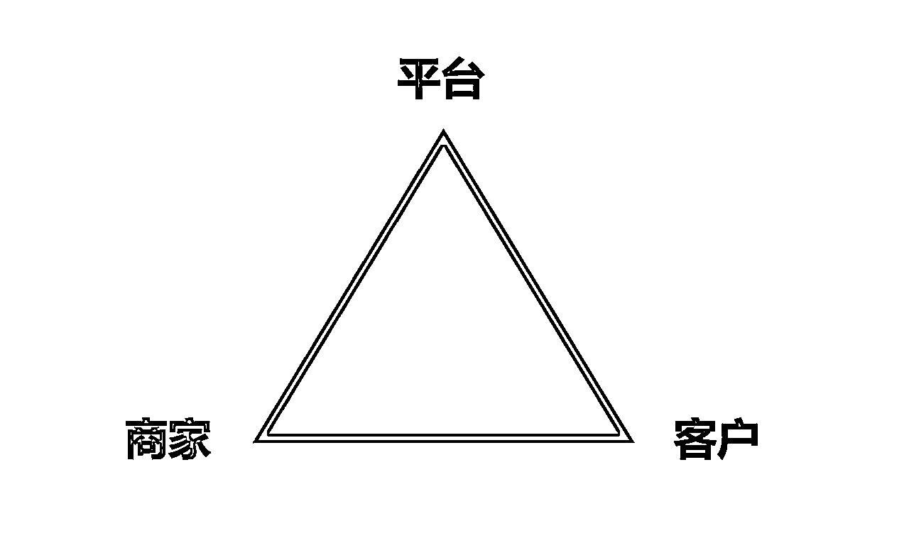

# 如何从0到1做起来一个电商项目

> 来源：[https://qingling21.feishu.cn/docx/ZTobd06Zzod1xNxOwKvc1oTznFb](https://qingling21.feishu.cn/docx/ZTobd06Zzod1xNxOwKvc1oTznFb)

大家好，我是老瞿Qu，今天想用2年做闲鱼二手书电商的经验，跟大家聊聊，如何从0-1做起来一个电商项目。

虽然聊的是电商的经验，但我觉得做任何一个项目，其实本质是差不多的。

放眼目前市面上赚钱的项目，核心无非两种，一是卖商品，即电商，二是卖服务，如知识付费、咨询等。

今天将主要围绕下面几个问题和大家聊聊：

一、扎心：你为什么做不起来一个项目？

二、做成功一个项目的公式是什么？

三、你成功的标志是什么？

## 一、扎心：你为什么做不起来一个项目？

大家看惯了月入十万百万的分享，但总是苦恼为什么自己做的项目都没有什么结果？

或者总是一顿操作猛如虎，一看收入两块五。

到底赚到钱的人做对了什么是我不知道的？还是那些做知识付费的割我韭菜了？

所以先给大家扎心一下，请大家一定要记住下面这句话，当你在做项目迷茫的时候，摸着自己的良心去问一问自己。

赚钱不是因为你做了某个项目就应该赚钱，而是因为你做这个项目的能力超过了80%以上的人。

大多数人做互联网项目之前都有一些职场打工的经验，这样很容易会有一种打工人心态。

什么是打工人心态？

就是觉得我付出了，就应该有回报，就好像我上班一月，你就应该给我5000块钱工资。

但做项目跟打工不一样，打工你就是划水、摸鱼一个月，公司一份钱不赚，你也能拿到5000块钱工资。

做项目更多的是一个老板的心态，你干的不好可能颗粒无收，你干好了，可能一个月能赚到你打工一年的钱。

就好像高考，不是因为你上学了就能考上985、211、一本，而是你学习能力超过了80%以上的人。

这就是所谓的二八定律，世界本生因为资源的有限性，导致竞争无所不在，所以二八定律也无所不在。

那如何才能让自己做项目的能力超过80%的人呢？

首先你要摸着良心问自己一句话：

对于这个项目，我付出的努力有没有超过80%以上的人？

能力可能大家会感觉比较难界定，但是有没有努力其实相对容易衡量。

比如二手书项目就是你开了几个帐号？上架了多少本？每天降价、优化过多少个商品？等等。

而且这里还是指大家都是同一起跑线的情况下，你付出超过80%的人的努力大概率会成功。

如果你是一个电商小白，而群里很多都是干了好几年电商的人，

那你要成功，可能要付出超过100%人的努力才可能有结果。

## 二、做成功一个项目的公式是什么？

在经历过很多项目以后，我觉得做成功一个项目的公式是这样的：

做项目成功 = 熟悉项目流程（10%）+理解项目底层逻辑（10%）+ 执行的过程中反复迭代（80%）

下面我们拿闲鱼二手书项目举例：

### 1、熟悉项目流程，你只有10%的概率成功

就好像二手书项目，你要了解如何办理出版物许可证，出版物许可证怎么认证，如何包装帐号，怎么上架商品，怎么补单，怎么做数据，怎么接客服，如何处理订单，如何处理售后等

其实很多人做项目之所以失败，是因为熟悉项目流程这个阶段都达不到，就开始问：我为什么没赚钱了。

我们只有对项目的流程足够的熟悉，你才能提升自己上书、处理订单等的效率，从而为成功做一个项目提供可能性。

所以当你还在纠结二手书订单遇到盗版了怎么办？孔夫子上面的书涨价了怎么办的时候，你凭什么赚钱。

这些都是做闲鱼二手书项目所必须熟悉的流程而已。

### 2、理解项目的底层逻辑，你成功的概率增加10%

为什么我们需要理解项目底层逻辑？

因为只有这样我们才不会焦虑，你不会去问为什么我的商品没有曝光量？我是不是被平台限流了？

因为99%以上的情况，平台都不会给你限流，平台哪里有那个功夫啊，人家几百亿的身价会去针对你这个月入还没有过万的商户吗？图什么？

所以我们一定要理解电商的底层逻辑，其实就是一个三角关系。

在这个关系中，我们的角色是商家，所以我们时常要站在平台和客户的角度去想想：

相对于其他商家，为什么他们要多爱我一点？我能为他们提供什么价值？

作为一个平台，他需要的是商家能为他留住客户，能成交客户，从而利用手里的权力，给予你更多的曝光。

作为一个客户，他需要的是更加优质、价格更实惠的商品，从而才会在那么多曝光中点击购买你的商品。

所以组织补单已经被列入刑法里面，是因为这玩意真的能赚很多钱，他能让平台以为你这个商品链接很好，从而给予你更多的曝光。

所以上架商品、优化商品描述、降价等手段都能让平台给予我们一些流量扶持，因为这是平台想让我们做的事情。

所以我们一定要选好首图，设置好价格，文案抓住客户的痛点，因为这样用户才可能点击进去，才有成交的可能性。

还有一点就是各个平台为啥会禁止铺货，比如一天上几百上千个链接，因为这玩意真的能赚钱，在商品价格和展示效果差不多的情况下，真的能测试出哪些链接运气比较好，转化比较高，但是相对暴力，而且挑战了平台的规则，所以才会被打击。

在今天，比如闲鱼、淘宝这些平台就是一个黑匣子，我们没有办法知道背后的每个数据到底是怎么样的，但是如果我们把其背后复杂的程序语言简化，基本上的逻辑如下：

当你发布商品链接以后，平台会根据这个商品的搜索量，分配曝光量给你。

比如今天你发布了一本《平凡的世界》，这本书今天一共有100个人搜索，假设70%的曝光平台给了过去成交比较好的商品链接，30%的曝光给了今天新发布这个商品的链接，假如今天一共6个人发布，最后给了你5个曝光。

因为平台其实也不能完全界定哪个用户会买，所以我们举几个极端的例子：

例子1：给你5个曝光，刚好都是最好的用户，都着急用书，全部直接下单，那你这个链接数据就很好。

例子2：给你5个曝光，刚好都是大家来闲鱼看看价格的，今天都不买，那你这个链接就数据就很差。

例子3：给你5个曝光，刚好跟你同时曝光的商品链接，全部价格比你低，图片也拍的更好，那你不会有人点击的。

例子4：给你5个曝光，刚好跟你同时曝光的商品链接，全部价格高，图片很差，就你不错，那肯定会点击你的。

当然现在平台的系统规则远比这个要复杂很多，包括你开店的时间，多少粉丝，好评率等都会关联上，最后才决定怎么分配流量，但其背后的基本逻辑不会变。

所以我们需要做好选品、产品的图片、合理定价等基础工作以后，剩下的就靠在平台允许的情况下，多进行产品链接的测试，然后辅助补单做些数据，最后留下那些各方面转化都不错的商品链接。

同时服务好客户，争取更多的好评，这样才是平台喜欢的商家，才会有更多的流量。

### 3、执行过程中反复迭代，才是成功的关键，占据成功80%以上的原因

看过一个例子，我觉得特别适合解释执行的力量，就是：

明明知道管住嘴迈开腿，守住热量差就能瘦，那为什么100个胖子里面只有2个人能瘦身成功呢

当我们了解做一个项目的流程，也了解了项目背后的底层逻辑不再焦虑以后，那剩下能拉开差距的就是强有力的执行力了，

还有个更重要的是你要不断的自我迭代，要在执行的过程中去思考，这样才能不断的自我提升和进步。

## 三、做项目成功的标志是什么？

成功最重要的标志毫无疑问是赚到钱，但其实你应该还有一些精神层面的体会，这种感觉就好像：

1、当你刚进入职场的时候，你觉得师兄很厉害，什么都能带着你，好像什么都知道，等你干了一年后，觉得师兄好像就那样，很多层面都超过他了。

2、然后你对标的对象变了，你觉得你师傅很厉害，就是某个部门负责人很厉害，年入几十万，能把部门管理的井井有条。等你干了3-5年的时候，你发现师傅好像也就这样，我只需要一个机会就可以坐上这个位置了。

3、然后你对标对象又变了，你开始觉得总经理很厉害，管理一个公司，年入百万，你觉得如果你干到这个位置就知足了。等你干了8-10年，你觉得总经理只不过是熬到了一个年纪后得到了一个机会，他很多地方其实不如你。

做项目其实也一样，这就是一个人成长过程中的感受，你要做的就是要这种感受的时间尽可能缩短。

就好像刚开始你觉得小嵩做二手书月入过万就是神了，后来觉得老瞿这种开工作室做二手书的月入10W+的才厉害，最后你会觉得其实每个项目，其实就那样，你都可以达到他们的高度。

当你已经超越了老瞿这些在某个项目拿到小结果的人以后，等有一天你觉得亦仁现在做的事情，好像你也能努力够得着的时候，你就离年入千万不远了，哈哈。

我是老瞿Qu，生财有术最懂二手书的男人，目前也在跟着航海尝试一些新的项目。

以上是关于做项目的一些思考，2023年，让我们一起生财有术。