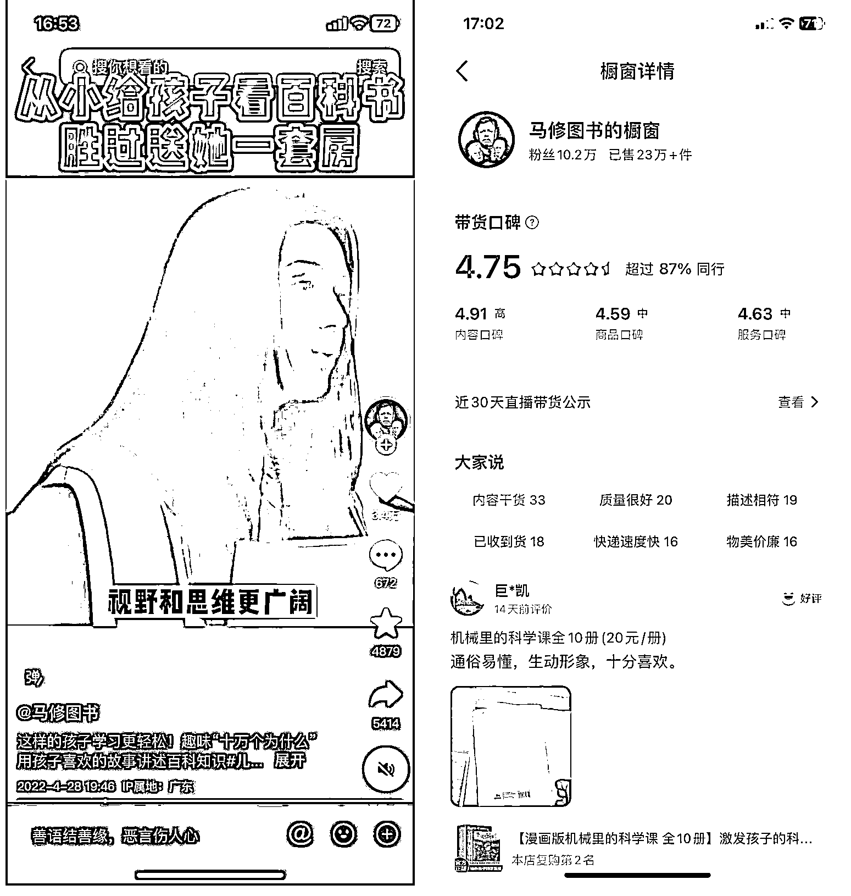

# 逐渐丰富赚钱技能库，我终于通过英文育儿书单项目做到单日利润破万

> 原文：[`www.yuque.com/for_lazy/thfiu8/aw081fd5xot8g7tm`](https://www.yuque.com/for_lazy/thfiu8/aw081fd5xot8g7tm)

## (精华帖)(324 赞)逐渐丰富赚钱技能库，我终于通过英文育儿书单项目做到单日利润破万 

作者： 秋海 

日期：2023-07-05 

大家好，我是秋海。这是我加入生财的第三年，实操过淘宝店群，中老年女装视频带货，还有书单号。目前在做自媒体和英文育儿书单带货。 

之前分享过一篇[《视频号蓝海英文育儿书单带货一年累计粉丝 120w+，月入 2w+》](https://t.zsxq.com/0f67Gr4lB)的精华帖，具体的项目操作都在帖子里，所以在这篇里我想和大家聊聊，我前期做了哪些准备，让我看到这个项目就能马上找到思路，一步步优化迭代，并达成单日利润破万的。 

## 一、如何找到思路 

这个项目做到现在，已经超过一年时间。在做这个项目之前，我参加过抖音短视频带货的航海，当时做的中老年女装带货和书单号。 

中老年女装带货做了四个月，变现了 1w 多，后来赛道越来越卷，出单越来越难，于是我开始转向书单号。当时书单号做了一个多月都没有什么起色，又在这个时候知道了视频号有红利，于是下一期航海，我便报名参加了视频号带货航海。 

在视频号带货的航海里，我准备了三个号做美食带货，但航海期间只出了一单。 

这几个项目虽然没有做出太好的业绩，但我养成了每天刷短视频的习惯。 

有一次刷短视频刷到一个用国外大学毕业演讲带童书的视频，点赞 3w+，橱窗销量 10w+。看到这种形式，我就产生了一个想法：「这种视频我也能做」。 

一看到这个视频，我就能想到用什么方式把它做出来，马上就有清晰的思路。 

  

能有这样的想法，和之前做过的项目经验和自己的一些经历密不可分。 <ne-oli index-type="0">1.  在参加短视频带货航海做中老年女装带货的时候，学会了跟爆款； <ne-oli index-type="0">2.  在航海中做书单号的时候，学会了先发流量视频涨粉，再用流量视频带动带货视频出单的方法，还学会了使用配音工具； <ne-oli index-type="0">3.  再加上曾经看过一段时间 TED 演讲，知道了哪里可以找到演讲素材； <ne-oli index-type="0">4.  参加视频号带货航海，又学到了拆解视频，将爆款视频混剪发布进行带货。 

这些因素加到一起，就让我一下子有了做英文育儿视频带货项目的思路。真的有点像乔布斯说的「connect the dots」，把想法都串起来了。 

## 三、验证思路可行，两天赚到近 4w 佣金 

有了思路，就要验证思路是否可行。 

本来我自己做中老年女装带货和书单号的时候，只做了抖音和快手两个平台。但在视频号带货的航海中，一直看到很多人说视频号是红利期。 

所以我做英文育儿视频带货时，就决定先用搬运的方式把抖音上的同行作品，发到视频号上，没想到发一个火一个，账号很快就起来了。 

下图是视频爆了之后开直播的数据，24 小时涨了 10w 粉，大部分都是从视频导入的流量。 

  

由此可见，这个思路是可行的。所以接下来，我就开始自己剪视频。 

因为当时的同行还很少，而且不管是内容质量还是视频质量都不高，很多都是在英文视频直接配上中文字幕，一条视频用到底，连配音都没有，字幕和音频都对不上。如下面的视频： [千万不要把孩子养的太老实 这 5 条浅规则早点让孩子知道#家庭教育 #父母 - 抖音](https://v.douyin.com/iJGW1rt/) 

我就把按照自己思路剪视频，在对标账号视频的基础上，用了配音，并把口型对上。剪的视频同步发到视频号、抖音快手三个平台上。剪了一个星期，有一个视频在三个平台同时火起来。抖音播放量突破 500w，快手播放量突破 200w，视频号的播放量突破 1000w。有这种效果更加证实了项目的可行性。 

视频爆起来的时候，我马上制作带货视频。抖音和快手开通了小黄车，直接挂车带货。视频号还没有获得小黄车的权限，我就用在中老年女装学到的引导橱窗购买，就这样还能一天出几十单。 

后来，流量还在持续爆，我才考虑开直播转化。因为我觉得没有样品不太适合直播，所以刚开始有点犹豫要不要播，看到流量实在太猛了，才决定开播。 

我用孩子的童书和书架，简易地搭了一个场景，用手机直接对着书架播。我也没什么其他准备，口播什么的都没有，简单地手写了一张引导下单的纸，后面又换成打印的纸引导。 

跟无人直播差不多，只不过场景是真实的。 

 

在这种情况下，竟然很快就出单了，而且频率还挺高。于是我就一直没下播，直到播了 24 小时，系统强制下播。一天卖出 700 多单，直播间 500 单，橱窗出了 200 多单。这 24 小时我基本上都没怎么睡，因为只要一刷新后台，就能看到出单，实在兴奋得睡不着。 

  

在变现方面，我也深刻体会到视频号的流量红利。抖音和快手也有出单，但都是零零散散。而视频号在没有小黄车的情况下，光靠橱窗出单也能卖 10000 多。我就用这种简陋的直播方式，播了将近两天两夜，赚了快四万的佣金。 

 

## 四、从头开始，用不对抗平台的方式起号 

但好景不长，很快账号被人举报侵权，关了一个月小黑屋，账号视频全部被清空，猜测是前期搬运的视频被人举报。 

 

当时惋惜了好几天，因为如果不被举报的话，流量肯定会继续爆下去，至少可以多赚几个 W。不过惋惜也没有用，毕竟流量爆了，容易遭人眼红，而且自己又确实搬运了别人的视频，挨罚也只能接受。 

不过既然思路可行，那就再试一次，再起一个号。 

这回学乖了，自己找素材，自己做配音，并改进了剪视频的方法，在演讲视频中间，加入了辅助素材。这么做可以让视频内容更丰富，也可以在演讲视频口型对不上的时候，进行转场，让视频更自然一点。 

因为我知道这条路走得通，所以干劲十足，每天都剪 4-5 条视频。剪视频其实花的时间并不多，在找素材上花的时间更多，我想要尽量找到符合主题的素材。比如讲学校教育的主题就要找在学生在学校上课的素材，而讲家庭教育的主题则要找一些亲子的素材。 

按照翻译爆款文案，先发流量涨粉视频，再发带货视频的思路，经过半个多月时间又重新起了一个号。在视频号上面爆了两个 10w+点赞的视频，粉丝涨到 20w+。虽然流量没有第一个账号那么猛，但用同样的方式一个月赚了 3w+佣金。 

过了一个月之后，之前被关小黑屋的账号放出来了，于是我就两个账号同时更新。为了省事，我就先做一个视频，然后调整一下字体，用镜像的方式再生成另一个视频，就可以做到剪一次生成两个不同的视频，发到两个账号上。但是长期这么做还是违规过两次，被判非原创，账号流量被限制。违规的都是新起的那个账号，本来每天至少几万的流量，只剩下几千。 

 

第一次违规，根据要求发了 10 条自己拍的原创视频，通过了审核。但我还是抱着侥幸心理，继续使用镜像的方式剪视频，结果就是不到一个月等来了第二次违规通知。 

我同样发了 10 条原创视频，竟然没有通过审核，账号流量就跌到了谷底，每个视频发出去都只有一两百的播放量，出单都是零。但是账号已经有 50w 粉丝了，又舍不得放弃，便抱着试试看的想法，持续发了半个多月原创视频，流量才恢复正常。 

经过这两次教训，我就不敢偷懒了，把两个账号使用的素材分开，不再共用。将近半年时间，就都没再遇到过这种违规了。 

## 五、总结 

爆款视频有概率，可遇不可求。同一个文案，别人能爆，你不一定能爆。但时间做久一点，或者多做几个号，用数量对抗概率总归能做出爆款视频的。就算爆了流量肯定也会有慢慢减少的过程，流量下降，也就意味着出单量减少。但只要账号起来了，有了一定的权重，每天至少也会有一些基础流量，靠着基础流量也会有稳定的出单。 

体会过流量爆发的感觉之后，等到流量恢复正常，难免心态会有落差。所以，做项目过程中，还要注意调整心态，尽量抱着高投入-低预期的心态，才能保持持续行动。高投入可以保证执行力，低预期就不那么容易放弃。这个心态在其他项目上应该也适用。 

总结一下： <ne-oli index-type="0">1.  优点：这个项目的优点是可以长期做，相对稳定； <ne-oli index-type="0">2.  缺点：天花板不高，虽然有爆款的时候也可以做到日入过万，但总体而言只能做到平均月入小几万。而且因为需要视频精剪，找素材花费的时间比较多，难以放大规模化。如果说作为副业的话，还算是个不错的选择。 

以上就是我的分享，这个项目的经历让我体会到：不管做什么，都要下场去做，只要做了，总会学到一些东西。而这些学到的东西，会在意想不到的时候，给你带来惊喜。 

航海就是一件十分有价值的事情，让你下场实操学东西。持续参加航海，相信大家都会乘风破浪，生财有术。 

评论区： 

肉松 : 看到就知道自己能做这个项目，这个技能我也想拥有 离心之巅 : 正在跟着实操，正在经历账号被举报发啥都限流的那个阶段😂 菜菜 : [强][强] 影子 : 大佬之前的那篇精华帖我看到时就收藏了，读了好几遍，也按着实操发了效果基本一致的视频，但流量很少，想问下这种类型的育儿视频现在还能做么，是否有被平台限制 江吉仪-墨鱼 : 感谢分享，有收获这个 秋海 : 我自己目前还在做，有不少同行也在做，暂时没有发现被限制。 Sean : 大佬 ted 视频是否存在侵权问题？ 秋海 : 存在，之前的帖子有写规避方法