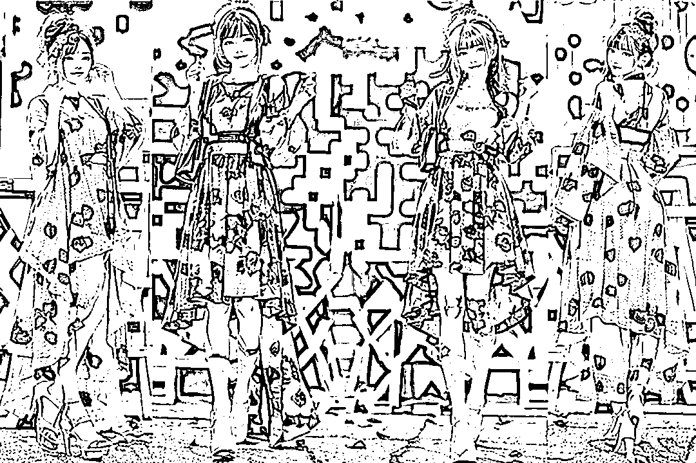
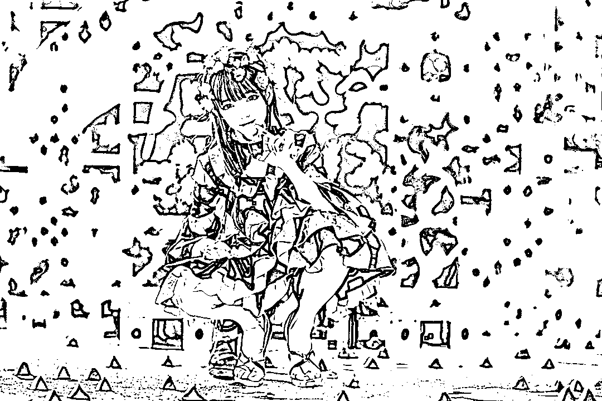
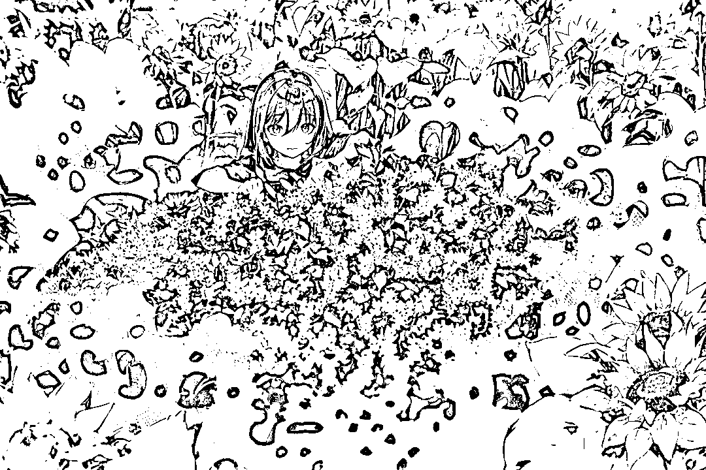
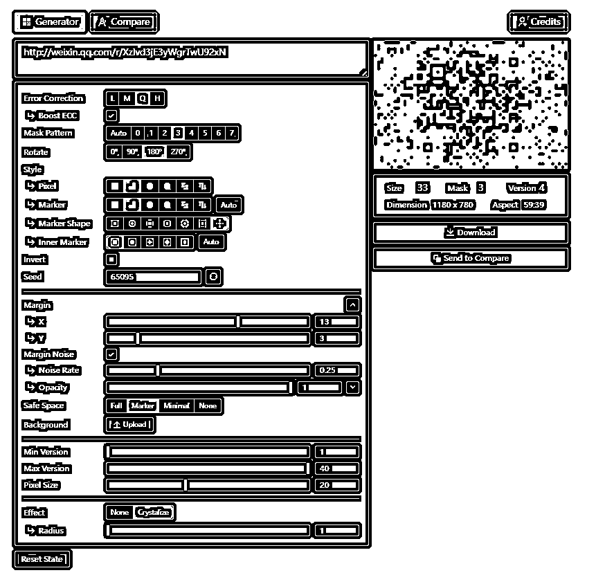
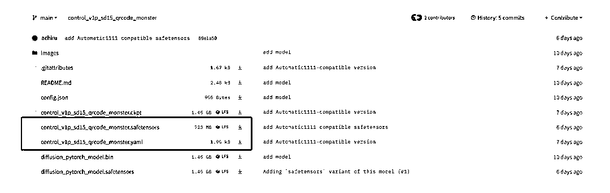
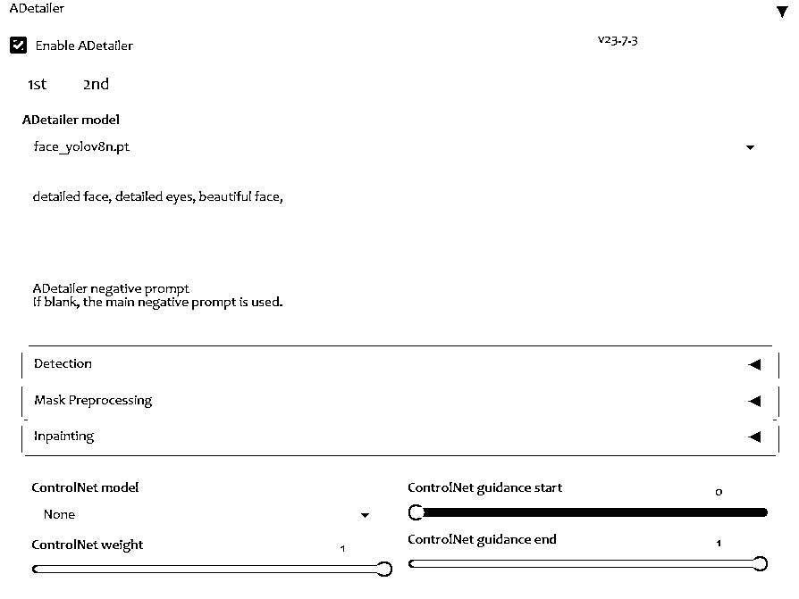
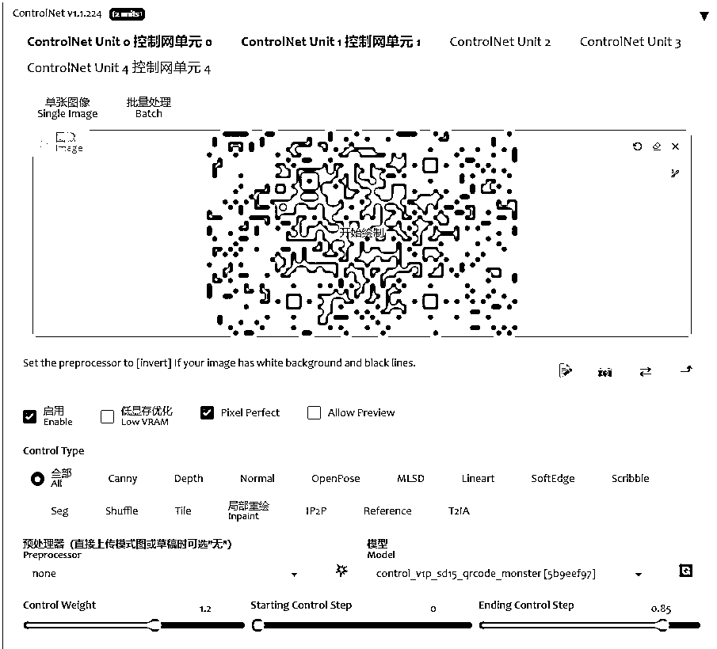
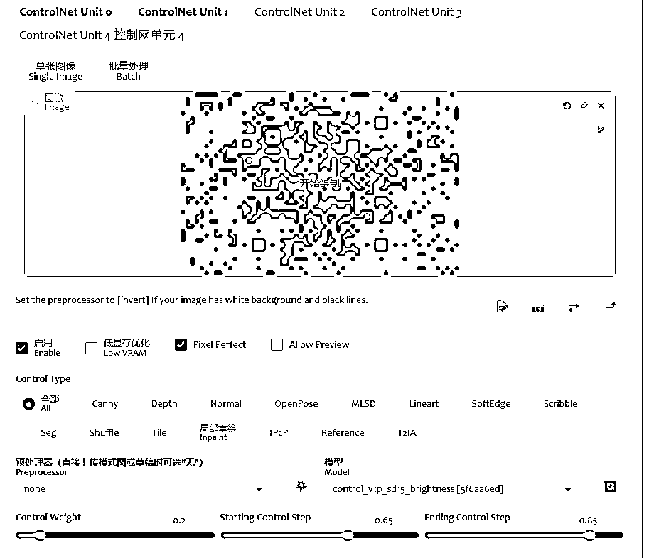

# 最近很火的艺术二维码，是怎么创作的？

> 原文：[`www.yuque.com/for_lazy/thfiu8/xnxrmif2rag1ulgy`](https://www.yuque.com/for_lazy/thfiu8/xnxrmif2rag1ulgy)

<ne-h2 id="8061c6fb" data-lake-id="8061c6fb"><ne-heading-ext><ne-heading-anchor></ne-heading-anchor><ne-heading-fold></ne-heading-fold></ne-heading-ext><ne-heading-content><ne-text id="u3eb41871">(精华帖)(61 赞)最近很火的艺术二维码，是怎么创作的？</ne-text></ne-heading-content></ne-h2> <ne-p id="u21ae17cd" data-lake-id="u21ae17cd"><ne-text id="u645d8fbd">作者： 小布</ne-text></ne-p> <ne-p id="u080e1fcb" data-lake-id="u080e1fcb"><ne-text id="u83615b92">日期：2023-07-06</ne-text></ne-p> <ne-p id="u556baf6d" data-lake-id="u556baf6d"><ne-text id="u7ca3c2db">前言 & to 亦仁老大/生财工作人员：</ne-text></ne-p> <ne-p id="u02a5bde4" data-lake-id="u02a5bde4"><ne-text id="u2988cf4f">本文介绍了艺术二维码的制作方法，因此难以避免有一些二维码的图像。如果你们觉得不妥，和我说我改或者删文就是。</ne-text></ne-p> <ne-p id="u4f47be63" data-lake-id="u4f47be63"><ne-text id="uec7932d6">不过，这套制作方法感觉对一些大佬引流或者线下制作二维码提升逼格/艺术性还是有帮助的。</ne-text></ne-p> <ne-p id="u18f38f40" data-lake-id="u18f38f40"><ne-text id="ud2604705">希望对大家有用~</ne-text></ne-p> <ne-p id="ue17a1163" data-lake-id="ue17a1163"><ne-card data-card-name="image" data-card-type="inline" id="VUqd2" data-event-boundary="card">  <ne-p id="u458432ba" data-lake-id="u458432ba"><ne-text id="u06aa4638">（“美女天团 G4 出道”）</ne-text></ne-p> <ne-p id="udf9410d6" data-lake-id="udf9410d6"><ne-card data-card-name="image" data-card-type="inline" id="btLEh" data-event-boundary="card">  <ne-p id="ue4e1325f" data-lake-id="ue4e1325f"><ne-text id="u23198c6f">（”小弟弟，过来给姐姐摸摸头“）</ne-text></ne-p> <ne-p id="u0039aca6" data-lake-id="u0039aca6"><ne-card data-card-name="image" data-card-type="inline" id="WPJMS" data-event-boundary="card">  <ne-p id="ufed98b3a" data-lake-id="ufed98b3a"><ne-text id="u0c3ef09d">（”哥哥，来玩躲猫猫吧“）</ne-text></ne-p> <ne-p id="uc3e3e2aa" data-lake-id="uc3e3e2aa"><ne-card data-card-name="image" data-card-type="inline" id="QdVdM" data-event-boundary="card">  <ne-p id="u9039d715" data-lake-id="u9039d715"><ne-text id="u0193b5ef">（”卷心菜女王“）</ne-text></ne-p> <ne-p id="u14677dba" data-lake-id="u14677dba"><ne-text id="u397f620c">（上面的每一张图，都可以 wechat 扫一扫试试）</ne-text></ne-p> <ne-p id="u3675411c" data-lake-id="u3675411c"><ne-text id="u493ce8ae" ne-bold="true">一.</ne-text></ne-p> <ne-p id="ubea294a3" data-lake-id="ubea294a3"><ne-text id="u5ca5bfdd">自从六月，nhciao 发布了艺术化二维码的文章出来之后，AI 绘画圈就变得很不平静。</ne-text></ne-p> <ne-p id="u6d3733ff" data-lake-id="u6d3733ff"><ne-text id="u1f48452d">但是，大家都很难做出和他们差不多水平的二维码。</ne-text></ne-p> <ne-p id="uc8c5eeff" data-lake-id="uc8c5eeff"><ne-text id="u43851cf0">不过，高手在民间。</ne-text></ne-p> <ne-p id="ue430f165" data-lake-id="ue430f165"><ne-text id="u4bef5522">很快，各路大佬就迭代出了</ne-text>[<ne-text id="uf64e9158">controlnet 的 brightness+tile</ne-text>](http://mp.weixin.qq.com/s?__biz=MzI2NTQ0MjY5Nw==&mid=2247485969&idx=1&sn=7322bd8668f63315db3cddb5ac8279b5&chksm=ea9c0ef7ddeb87e144a1d713b590e8fb197a6fa325808164b7fa64a913869813058f2c9eb187&scene=21#wechat_redirect)<ne-text id="u315c43fb">的做法，以及 brightness+illumination 的做法，比常规二维码好看不少，但是距离又好看又能扫，甚至完全不像二维码的二维码，还有一些差距。</ne-text></ne-p> <ne-p id="u240d16c5" data-lake-id="u240d16c5"><ne-card data-card-name="image" data-card-type="inline" id="cNITB" data-event-boundary="card">  <ne-p id="uac7bf68e" data-lake-id="uac7bf68e"><ne-text id="u7fa53de9">只能说比纯黑的二维码稍微好看那么一点。</ne-text></ne-p> <ne-p id="u34d39300" data-lake-id="u34d39300"><ne-text id="u2c6b2c13">而最近几天，随着 antfu 大佬的测试分享（</ne-text>[<ne-text id="u53ef7214">https://antfu.me/posts/ai-qrcode-refine</ne-text>](https://antfu.me/posts/ai-qrcode-refine)<ne-text id="u94a6c97d">），以及 qrcode monster 的 controlnet 模型放出。</ne-text></ne-p> <ne-p id="u98c8d6fa" data-lake-id="u98c8d6fa"><ne-text id="u2fbffd17">现在生成的二维码，艺术化水平已经大大超过了之前。</ne-text></ne-p> <ne-p id="u5efc9fff" data-lake-id="u5efc9fff"><ne-text id="uc12dd5fd">比如我开头放的四张图片，以及下面这张，不提前和你说，你能想象，它会是二维码吗？</ne-text></ne-p> <ne-p id="u1c6015a1" data-lake-id="u1c6015a1"><ne-card data-card-name="image" data-card-type="inline" id="HJU4x" data-event-boundary="card">  <ne-p id="ubdc162ff" data-lake-id="ubdc162ff"><ne-text id="u99c9cc18">那么这样的图像怎么做呢？</ne-text></ne-p> <ne-p id="u0502b99c" data-lake-id="u0502b99c"><ne-text id="u229c027e" ne-bold="true">二.</ne-text></ne-p> <ne-p id="u6d38e45e" data-lake-id="u6d38e45e"><ne-text id="u901549a5">下面就来教大家如何生成这种高度艺术化的二维码，就以公众号的二维码为例好了。</ne-text></ne-p> <ne-p id="ua7bc79d0" data-lake-id="ua7bc79d0"><ne-text id="u3b70e856">1.首先你导出你的公众号二维码，然后放草料二维码里面解析。获得你的二维码目标地址。</ne-text></ne-p> <ne-p id="u475e63ac" data-lake-id="u475e63ac"><ne-text id="uce43c00f">2.接着打开 antfu 大佬的二维码工具网站</ne-text>[<ne-text id="u8861538e">https://qrcode.antfu.me/</ne-text>](https://qrcode.antfu.me)</ne-p> <ne-p id="u611f7acf" data-lake-id="u611f7acf"><ne-text id="u6e71ef52">对二维码调整长宽，大小。并在二维码的外缘增加一些噪点，让后续生成的图像整体性更强。</ne-text></ne-p> <ne-p id="uae2eb5af" data-lake-id="uae2eb5af"><ne-text id="ubcb37ae4">基本设置请查看下面图片。</ne-text></ne-p> <ne-p id="ue895858a" data-lake-id="ue895858a"><ne-text id="u5e7874cf">也可以自己摸索测试更好的设置（比如就不一定要像我这个横向长方形一样，你可以正方形，也可以竖的长方形等）。</ne-text></ne-p> <ne-p id="ua6ce7ea4" data-lake-id="ua6ce7ea4"><ne-text id="u5c8bfcf8">设置好之后，点击图像下面的 download 下载图片。</ne-text></ne-p> <ne-p id="u190e0d0f" data-lake-id="u190e0d0f"><ne-card data-card-name="image" data-card-type="inline" id="WJcat" data-event-boundary="card">  <ne-p id="u5808ec6d" data-lake-id="u5808ec6d"><ne-text id="udaf2b842">3.下载 controlnet 相关模型</ne-text></ne-p> <ne-p id="ucb023121" data-lake-id="ucb023121"><ne-text id="ua2bed8f2">（1）下载 controlnet brightness 模型</ne-text></ne-p> <ne-p id="u7c57070d" data-lake-id="u7c57070d"><ne-text id="u2ef290de">地址</ne-text>[<ne-text id="u3cad9280">https://huggingface.co/ioclab/ioc-controlnet/blob/main/models/control_v1p_sd15_brightness.safetensors</ne-text>](https://huggingface.co/ioclab/ioc-controlnet/blob/main/models/control_v1p_sd15_brightness.safetensors)</ne-p> <ne-p id="u0da709a8" data-lake-id="u0da709a8"><ne-text id="u324babec">（2）下载 controlnet qucodemonster 模型和配置文件</ne-text></ne-p> <ne-p id="ucbee3dbe" data-lake-id="ucbee3dbe"><ne-text id="u0b5269a8">地址</ne-text>[<ne-text id="uea68cade">https://huggingface.co/monster-labs/control_v1p_sd15_qrcode_monster/tree/main</ne-text>](https://huggingface.co/monster-labs/control_v1p_sd15_qrcode_monster/tree/main)</ne-p> <ne-p id="u276661f3" data-lake-id="u276661f3"><ne-card data-card-name="image" data-card-type="inline" id="A7Sn2" data-event-boundary="card">  <ne-p id="ubeda04f3" data-lake-id="ubeda04f3"><ne-text id="u2a7d08a1">（3）把上面下载好的三个 controlnet 模型文件及配置文件放入 controlnet 插件的 models 文件夹。</ne-text></ne-p> <ne-p id="u1e58b131" data-lake-id="u1e58b131"><ne-text id="u40010920">参考路径：stable-diffusion-webui\extensions\sd-webui-controlnet\models</ne-text></ne-p> <ne-p id="ubf7952e4" data-lake-id="ubf7952e4"><ne-text id="u7131d2aa">4.生成图像设置</ne-text></ne-p> <ne-p id="u583d5c0e" data-lake-id="u583d5c0e"><ne-text id="u6cb252f0">写正负面提示词，正负面提示词就按正常的写就行，比如什么起手式之类的。你喜欢怎么写怎么写。不过如果加上 flowers, trees, forest 之类会相对更容易生成一些，但也更千篇一律一些。不容易有惊喜。</ne-text></ne-p> <ne-p id="u90e66f6f" data-lake-id="u90e66f6f"><ne-text id="udc322abd">采样方法建议 dpm+sde+2m，步数建议 30 步以上。</ne-text></ne-p> <ne-p id="u2fdbc6e8" data-lake-id="u2fdbc6e8"><ne-text id="u883acf8f">图像尺寸建议分辨率是 768 或者以上。比例和你在第二步导出来的二维码图片保持一致。</ne-text></ne-p> <ne-p id="u6e54b832" data-lake-id="u6e54b832"><ne-text id="ud25a067b">模型的话，建议使用动漫模型，比如 anything 之类的，你用惯的就好。（等你熟练稳定生成之后，再使用真人模型）</ne-text></ne-p> <ne-p id="u9b79af70" data-lake-id="u9b79af70"><ne-card data-card-name="image" data-card-type="inline" id="pw1OB" data-event-boundary="card">  <ne-p id="u20a45334" data-lake-id="u20a45334"><ne-text id="u7c2b93cb">5.Adetailer 设置（可选）</ne-text></ne-p> <ne-p id="ud7cb27b7" data-lake-id="ud7cb27b7"><ne-text id="u9778e8b5">这是一个插件，没有的可以下载安装后使用，</ne-text>[<ne-text id="ue3210add">安装插件教程</ne-text>](http://mp.weixin.qq.com/s?__biz=MzI2NTQ0MjY5Nw==&mid=2247485349&idx=1&sn=4c4af280bbb6e0fc428ac91b82bfbc18&chksm=ea9c0343ddeb8a5513f903e2b0a0c842548747468cc3966e9533cf0fc00b10d4fd27c22bd097&scene=21#wechat_redirect)<ne-text id="ue689b61a">可以看我之前的文章。</ne-text></ne-p> <ne-p id="u7afd675b" data-lake-id="u7afd675b"><ne-text id="ub0d082c3">它可以优化小图中的人像脸部，这样出小图也不容易脸崩。用它之后，会增加脸部的好看程度，但也会增加图像生成时间，可用可不用。</ne-text></ne-p> <ne-p id="ube962bca" data-lake-id="ube962bca"><ne-card data-card-name="image" data-card-type="inline" id="pgjZO" data-event-boundary="card">  <ne-p id="u5f551dde" data-lake-id="u5f551dde"><ne-text id="uaa91a9d8">6.controlnet 设置。</ne-text></ne-p> <ne-p id="uf159664e" data-lake-id="uf159664e"><ne-text id="ucf815263">（1）首先至少你要有 2 个或者以上的 controlnet 窗口，如果没用的话，自己去 setting 设置-controlnet-multicontrolnet 里面把 1 改成 4 或者 5.</ne-text></ne-p> <ne-p id="uec8cf4cb" data-lake-id="uec8cf4cb"><ne-text id="uf3490267">（2）第一个 controlnet 的设置。</ne-text></ne-p> <ne-p id="udb610c88" data-lake-id="udb610c88"><ne-text id="u79107077">上传图片之后，勾选启用 enable 和 pixel perfect 完美像素。</ne-text></ne-p> <ne-p id="u25be92c9" data-lake-id="u25be92c9"><ne-text id="u63099083">接着 preprocessor 预处理器不选。模型选 qrcode monster(没有就先按第三步的下载并正确放置文件后，点击右侧的刷新按钮，就有了)</ne-text></ne-p> <ne-p id="u6eb8d153" data-lake-id="u6eb8d153"><ne-text id="u42923483">接下来是关键了。</ne-text></ne-p> <ne-p id="u0278a1cb" data-lake-id="u0278a1cb"><ne-text id="ubaa2dfd6">weight 一般设置 1-1.5，这个根据不同的基础模型要动态调整，如果结果图更容易识别，但是没那么好看，就可以适度调低这个值。反之则调高。</ne-text></ne-p> <ne-p id="u4ee98d85" data-lake-id="u4ee98d85"><ne-text id="u36c3a0f8">ending step 写 0.85，给 ai 一点空间创造更好看的图。</ne-text></ne-p> <ne-p id="uf8015999" data-lake-id="uf8015999"><ne-card data-card-name="image" data-card-type="inline" id="u9ens" data-event-boundary="card">  <ne-p id="u751f0c9b" data-lake-id="u751f0c9b"><ne-text id="u2b9801d3">（3）第二个 controlnet 的设置</ne-text></ne-p> <ne-p id="ud736964a" data-lake-id="ud736964a"><ne-text id="u4f21ed29">同样上传图片，启用+pixel pefect</ne-text></ne-p> <ne-p id="u7a8cd976" data-lake-id="u7a8cd976"><ne-text id="u374d9292">预处理器不选。模型选 brightness.(没有就先按第三步的下载并正确放置文件后，点击右侧的刷新按钮，就有了)</ne-text></ne-p> <ne-p id="ue31e32c7" data-lake-id="ue31e32c7"><ne-text id="u9ade5189">wight 设置在 0.2-0.5 之间。一般设置 0.2 不动就行。</ne-text></ne-p> <ne-p id="ubedda7a0" data-lake-id="ubedda7a0"><ne-text id="ua8bfe97c">start step 和 end step 设置 0.65-0.85 即可。</ne-text></ne-p> <ne-p id="u3a8a6402" data-lake-id="u3a8a6402"><ne-card data-card-name="image" data-card-type="inline" id="mRg5p" data-event-boundary="card">  <ne-p id="u616e49b3" data-lake-id="u616e49b3"><ne-text id="u76f7deb2">7.设置完毕，可以点击右上角的生成按钮来生成图像了。</ne-text></ne-p> <ne-p id="u7878b94d" data-lake-id="u7878b94d"><ne-text id="u1b1cdc7f">不过，现在生成的图像，还是需要不断多生成，才能获得效果更好的图片。需要多次测试和抽卡。</ne-text></ne-p> <ne-p id="u9ee9c9d7" data-lake-id="u9ee9c9d7"><ne-text id="uaa63ae9b" ne-bold="true">答疑</ne-text></ne-p> <ne-p id="ue54a4f78" data-lake-id="ue54a4f78"><ne-text id="u7b5435cf">1.二维码艺术化有什么用？</ne-text></ne-p> <ne-p id="ubc7bef89" data-lake-id="ubc7bef89"><ne-text id="ua209e78d">就是原来的二维码很丑，想让他好看点而已。</ne-text></ne-p> <ne-p id="u7433efcd" data-lake-id="u7433efcd"><ne-text id="uebe6738f">去各种平台引流可能也用得上。但是你要让二维码能被微信识别，那各平台反作弊系统也一定能识别。但是至少人工审核这一关或者没加上这一层机审的平台还是能过关的。</ne-text></ne-p> <ne-p id="u5c171fa9" data-lake-id="u5c171fa9"><ne-text id="u8eae28f4">还有一些好处就是，你线下印名片，或者一些广告宣传等可以用二维码的场合，弄成这种艺术二维码，会更有逼格，更有科技感一些。</ne-text></ne-p> <ne-p id="uc3e49998" data-lake-id="uc3e49998"><ne-text id="ub63f7d6c">2.可不可以做得更好看一些？</ne-text></ne-p> <ne-p id="u0693e7ad" data-lake-id="u0693e7ad"><ne-text id="u9a5bcb5f">可以，但因为公众号的二维码地址实在是太长，而且还不支持短链。</ne-text></ne-p> <ne-p id="ud76c8a42" data-lake-id="ud76c8a42"><ne-text id="u52eb4eb8">如果你换成短链或者其他短一些的网址，比如十位字符以内的。生成难度会低很多，也会好看很多。</ne-text></ne-p> <ne-p id="u8a985758" data-lake-id="u8a985758"><ne-text id="u407b9d81" ne-bold="true">参考阅读</ne-text></ne-p> <ne-p id="ufadb35a0" data-lake-id="ufadb35a0"><ne-text id="u20dd9aa5" style="color: rgb(178, 178, 178);">Antfu: Refining AI Generated QR Code</ne-text></ne-p> <ne-p id="uda3f751a" data-lake-id="uda3f751a"><ne-text id="u253c57d7" style="color: rgb(178, 178, 178);">赛博迪克朗：二维码融合技术 2.0 简单实用 AI 教程 没想到一周不到就要把教程从头到尾推翻升级</ne-text></ne-p> <ne-p id="u5bb10527" data-lake-id="u5bb10527"><ne-text id="u8c49bb78" style="color: rgb(217, 217, 217);">另附上本教程原文，阅读体验可能更好一些：https://mp.weixin.qq.com/s?__biz=MzI2NTQ0MjY5Nw==&mid=2247486054&idx=1&sn=67589a219abf1a6979866fe6792a7350&chksm=ea9c0e80ddeb8796dd044f6d15f76704dea05c77ccf4ad7e175481aa4459d194b7c6c3ccbb78&token=1014845350&lang=zh_CN#rd</ne-text></ne-p> <ne-hole id="uaf32907e" data-lake-id="uaf32907e"><ne-card data-card-name="hr" data-card-type="block" id="Kgo8I" data-event-boundary="card"><ne-p id="u2965a4d0" data-lake-id="u2965a4d0"><ne-text id="uf635cc1f">评论区：</ne-text></ne-p> <ne-p id="udab393b8" data-lake-id="udab393b8"><ne-text id="u6d339269">叉叉敌 : 优秀</ne-text> <ne-text id="u36aaa1a8">控心 : 🐮</ne-text> <ne-text id="u20c7cce0">夏汉九 : 想问一下，这种隐藏式二维码平台能查出来吗？</ne-text> <ne-text id="ubccf3981">小布 : 看具体平台，也欢迎你测试一下然后发出来结果</ne-text> <ne-text id="uaa4bb481">小布 : 谢谢～</ne-text> <ne-text id="ua99fe796">小布 : [玫瑰]</ne-text> <ne-text id="u0f62cb9d">悦佬 : [强]</ne-text> <ne-text id="u73c141ab">田小田的甜 : 厉害</ne-text></ne-p></ne-card></ne-hole></ne-card></ne-p></ne-card></ne-p></ne-card></ne-p></ne-card></ne-p></ne-card></ne-p></ne-card></ne-p></ne-card></ne-p></ne-card></ne-p></ne-card></ne-p></ne-card></ne-p></ne-card></ne-p></ne-card></ne-p>