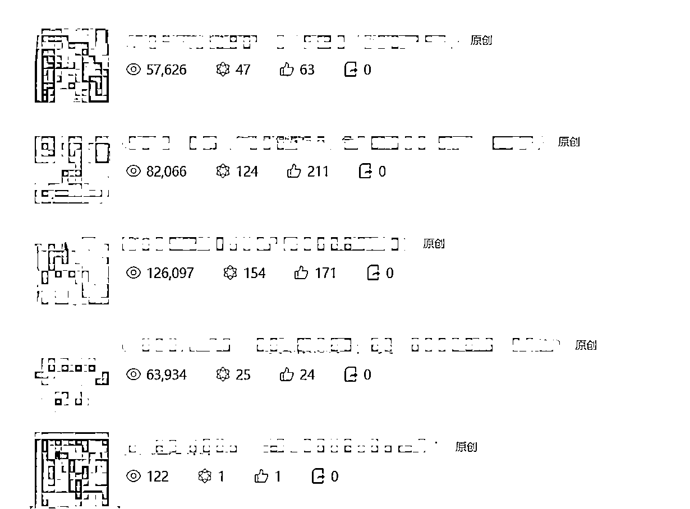
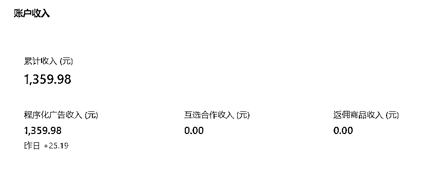
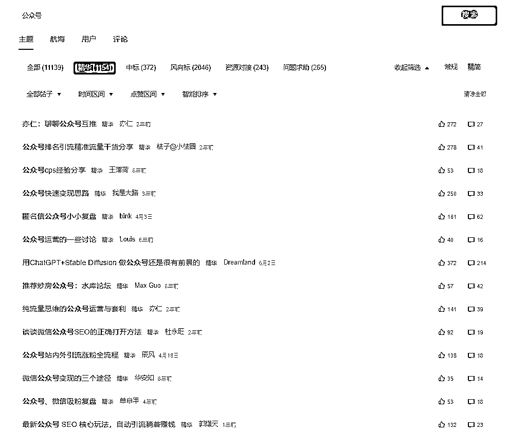
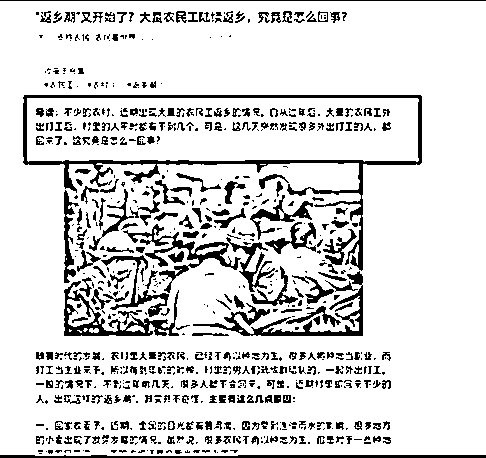
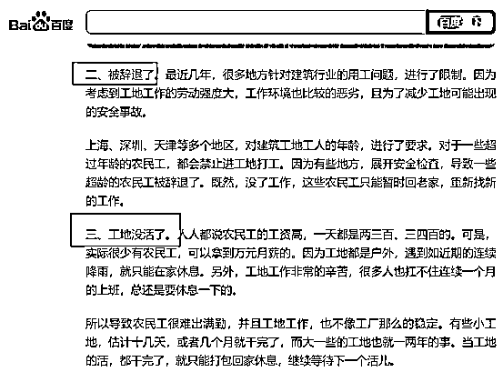
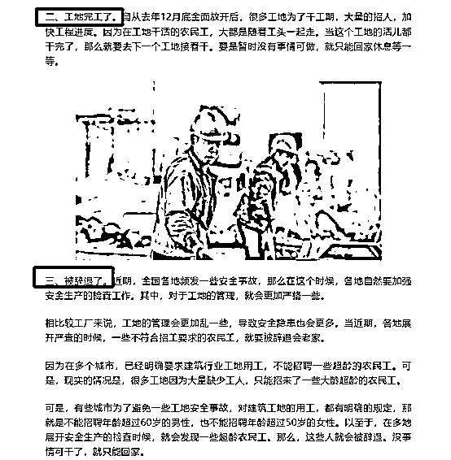
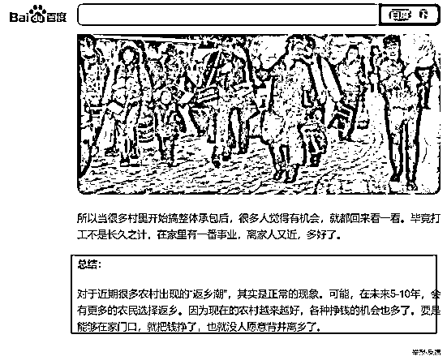
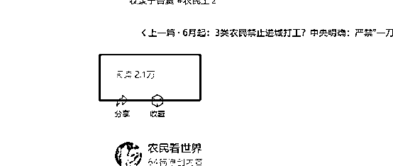
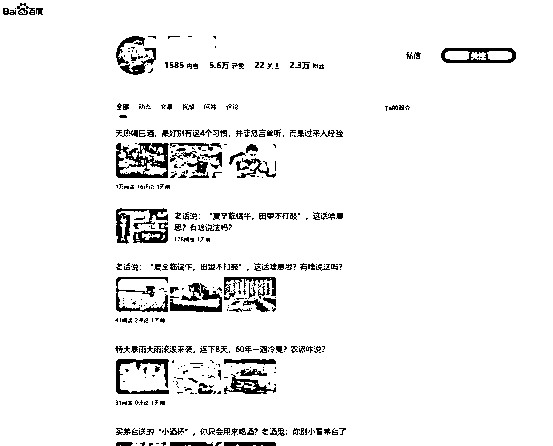

# 看了一个风向标，两篇文章入池，5 天 5 篇文章收益 1359

> 原文：[`www.yuque.com/for_lazy/thfiu8/ranrg3wbsy3rk60c`](https://www.yuque.com/for_lazy/thfiu8/ranrg3wbsy3rk60c)

## (精华帖)(128 赞)看了一个风向标，两篇文章入池，5 天 5 篇文章收益 1359 

作者： 林戏生 

日期：2023-07-06 

大家好，我是林戏生，自由职业者，坐标广州。 

主要做知识 IP 和副业培训两块内容。之前在生财分享过我是如何靠一条回答，[霸榜知乎副业话题第一名的](https://articles.zsxq.com/id_3w6huc1rg0sg.html)。有兴趣可以看一下，因为跟今天分享的内容，底层逻辑有共同处。 

由于我是写公众号起家的，17 年公众号每写一篇文章，保底可以变现 4w 块。 

所以那天在生财看到公众号流量主的时候，就引起我莫大的兴趣。第一时间把相关的内容刷完了，可以说这次来分享，我更多的是一个报告成绩的学员，大家才是我的老师。 

说一下成绩： 

第二篇文章就入池了，第三篇直接 10w+，用时五天，五篇文章收益 1359。 

  

  

那这是怎么做到的呢？接下来我要分享的内容，会打破大家的认知，如果觉得有帮助的话，记得点赞收藏。 

# 一、大量整理信息 

## 1.1 信息来源 

首先记住第一个要点：做项目最重要的是大量的数据和信息！ 

我切入公众号流量主这个项目， 当时是看到一来分享的一条信息。 

  

在看到这条信息之后，我优先思考了几个问题。 

① 是真实的吗？ 

在我的认知和了解到的信息，这个应该是真实的。 

② 那些有价值的内容？ 

  

③ 我能不能做？ 

④ 怎么做？ 

⑤ 我愿意花多长时间尝试，达到什么结果继续，达不到什么结果放弃？ 

后面 3 个问题，是基于前面 2 个问题靠谱的情况下，才会出现，正常我就考虑前 2 个问题。 

## 1.2 解读信息 

我刚才给图片中的一些有价值的点，画了红线，我们一起来看看。 

### 1.2.1 先看投入的成本 

① 时间投入，按照 3 个号来算，一个号每天更新 2-3 篇，一篇一千字，内容可以二创的情况下， 6 小时写完，快的话 3 小时可以搞定这个事情。 

② 资金投入，唯一的费用是买 500 粉，现在只需要 100 粉，门槛更低了。 

③ 精力投入，我觉得这一块的最大的投入，因为在起步的时候，可能要面临长达一个月以上（入池），没有收入和结果的时间（或者入池后收入很低），很容易让人放弃和折磨。 

### 1.2.2 再看一下产出 <ne-quote id="u1191b84b" data-lake-id="u1191b84b">

看完了投入和产出，这样我们就有清晰的对比了，这就是对信息的解读。 

以上方法同样适用于判断其他项目的可行性。许多朋友都会遇到类似困境：最近这个项目好像很火热，我可以做吗？我适合做吗？ 

如果自身认知尚且不足以支持你直接得出结论，就可以尝试上述办法，判断项目的性价比、可行性以及自己是否能做。 

既然项目确定可以做，而且自己也可以做，那么下一步并不是开始注册公众号，而是收集。 

# 二、分类和合并 

会收集是天性，会整理是天赋。 

① 收集实战经验 

生财的航海有航海手册，也有高手分享的文章，本身就是一个大宝库，建议把所有内容都整理一遍。 

比如我们可以在生财搜索关键词：公众号，写作，流量主等关键词。 

 

（生财索引站截图） 

再把搜索到的内容全部都整理起来，放到自己的文档里面，之后，再进行下一步的分类： 

 

（图为生财优秀作者分享的领域及介绍的分类） 

同时，如果还有精力的话，也可以通过公众号，百度等渠道，搜索公众号流量主这个项目，看看别人是怎么玩的。 

 

② 分类 

对收集的内容进行分类，比如如何写爆品的为一个类目，如何写标题的为一个类目，如何找同行为一个类目，如何找案例为一个类目等等。 

比如：我看到领域有一个是三农民生。 

 

这个时候我们就可以在看一看里面搜索相关内容。 

我们以这篇文章为例子：[https://mp.weixin.qq.com/s/nudwAJxRy9hFatUuwaaxSQ](https://mp.weixin.qq.com/s/nudwAJxRy9hFatUuwaaxSQ) 

 

我们把原文这一段复制到百度进行搜索： 

 

我们找到了一篇时间相近的文章，接着，我们打开对比一下： 

 

 

 

我们可以看到，几乎结构上，和内容的方式上，是一模一样的，唯一不一样的是，表达方式不一样，而且多了一些自己的思考，其他几乎可以说是一样的。 

这篇文章是 2.1w 的阅读，预估流量主的收入差不多 50-150 左右。 

 

我们点开文章的作者，可以看到是百度百家号，1585 篇更新： 

 

通过搜索我们可以看到他写了不止一篇，以农民返乡为主题的文章，而且阅读量都还可以，说明这个选题就非常不错，不然他也不会重复写。 

 

说明这个是很多农民关心的问题，那么，通过刚才： 

1.  复制文章到百度搜索 

2.  找到原作者的内容进行对比 

3.  分析原作者内容的情况 

我们就可以找到各大平台写三农的作者，以他们的内容为对标，作为我们的内容素材库，比如我做三农，那么我就可以弄一个素材库，对每一项内容进行分类。 

而且，经过这样的锻炼，我们对这个项目的理解会更加深刻，小白跟大神的区别，抛开实战无非就是对信息的获取程度，以及对信息的解读能力。 

③ 合并 

最后一步，就是把收集到的内容，进行合并同类型以及对有多重说法的内容保留存疑。 

什么是合并同类型？比如我们收集的一个类目：如何写标题。有好几个作者表达的意思是一样的，那么保留其中一个即可。 

什么是对有多重说法的内容保留存疑？ 

比如如何写爆文，A 说通过简单二创，甚至照抄都可以，B 说要提取主题，再根据主题进行创作。 

那么，我们对如何写爆文的几种方法要保留存疑，后续验证谁的方法更加有用准确。 

# 三、验证和确定方向 

## 3.1 用数据说话 

如果说 99%的人，对于写作都是不擅长的，那么 99%的人，对于收集是十分擅长的。就拿抖音的收藏夹，多少有价值的视频，束之高阁。 

那我们要收集什么？ 

① 确定领域 

不论是军事，历史，三农民生，明星吃瓜等，你得先确定一个领域，也就是方向，我们才好往下走。 

如果你并没有对某一个领域特别擅长，那么可以试一下我下面的方法。 

打开看一看，点击热点。 

这里有一个细节说一下，热点是类似抖音的兴趣推荐机制，你点开过某个类型的文章，后面刷出此类型的文章，会更加的多。 

所以，策略如下： 

准备 2 个以上微信号，第一个不断的刷，看到什么领域都点开来，查看账号是什么领域的，最早更文时间，第一篇爆文时间，一个月有多少篇爆文。 

将这些数据都整理成文档，方便我们后面确定领域。 

② 为什么是这 4 个维度？ 

查看账号是什么领域的，这个很容易理解，就是方便我们参考要做什么领域。 

最早更文时间，这个是来确定对标账号操作了多久，同时，可以点开公众号的信息，来查看账号的注册时间，看看对方用的是老号还是新号。总的来说，老号入池会更快，新号很吃领域和内容，各有各的参考性。 

第一篇爆文时间，这个是为了确定账号操作了多久入池的，我们要找越早入池的越好。 

一个月有多少篇爆文，这个是来判断该领域是否很容易出爆文，一个领域出爆文的概率越高，越值得操作。 

③ 启用第二个微信来验证 

当我们有上百条数据作为参考之后，我们会看到 A 领域很容易出爆文，B 领域很容易入池等等信息。 

此时，我们就可以大致的定下来要做某个领域了。 

接下来就是用第二个微信，打开看一看的热点，只点击浏览该领域的文章，不断的找对标同行，同样是刚才 4 个数据，找到 30 个以上的同行之后，我们已经有了碾压小白的资格，别的不说，当你手头有了这份数据，打包卖个 9.9 块，收点零花钱完全是小意思。 

## 3.2 用数据验证数据 

我们前面整理了大量作者的经验，以及看一看同行的实战数据，接下来的事情就是验证！ 

例如我们怎么对有存疑的内容进行验证？ 

 

还是拿这一条为例子。 

我们只需要复制对标同行爆文的多个段落，到各大搜索平台进行搜索，就可以发现对方是二创，原创，还是照抄。 

当我们验证了多个爆文同行的数据之后，我们会发现，A 的说法是错误的！而且如果简单的二创和洗稿，还有概率违规。 

通过数据验证，我们去其糟粕取其精华，这个时候，我们直接整理的这份数据，已经价值 99 了。 

# 四、测试，大量测试 

做好了前面 3 个步骤，最后才是实战！！！ 

## 4.1 工具优先 

最最重要的工具，就是公众号。通过我们收集和验证的数据可以发现，老号更容易入池。 

有能力的哪怕是买，也要买个老号来操作。 

当然，新账号也不是不可以。但是我信奉一点，如果能坐飞机就不做火车，能更早获得正反馈，就不要增加自己失败的概率。 

## 4.2 快速跑通 

工具，资源，全部配齐，就是快速把项目跑通了，这点靠的就是执行力，不多说。 

这部分的流程与技巧大家可以多看看航海手册与往期的高手分享，重点还是执行力要跟上：[https://i.shengcaiyoushu.com/docx/NSfNdXVuPoQ3mTx1LnpcBnpanie](https://i.shengcaiyoushu.com/docx/NSfNdXVuPoQ3mTx1LnpcBnpanie) 

# 五、优化 

当这个项目跑通之后，接下来就是优化各方面的细节。 

① 大量建立素材库 

无论如何，我们手头至少要有 30 个对标同行，同行才是最好的老师，因为他们永远在第一线。 

每天坚持收集优质的同行，淘汰手头不更新或者不出爆文的同行。 

同时，了解这个项目的最新动态，增加到自己的手册里面。 

② 多渠道变现 

当一个领域跑通之后，我们会发现一个很蛋疼的事情，XX 领域好像更赚钱，单价还高，而且还能二次变现，我是不是要放弃现在这个领域？ 

我们做项目就是为了赚钱，那么就得做赚钱的事情，当发现某个领域更赚钱，变现渠道更加多的时候，果断增加账号，加入队伍。 

毕竟付出同样的时间和精力，能取得更多的收益和回报，当然选择最佳的路线。 

写到这里还有点意犹未尽，毕竟我也是刚操作不久，还有很多方法和领域等着我去探索，下次有新的突破，会继续给大家分享。 

评论区： 

白也 : 现在 100 粉只能开通返佣商品权限，文中广告还是要 500 粉 林戏生 : 感谢反馈，会更正内容的。 平凡 : 很详细，很系统 书情小跟班 : 优秀，学习了 骏马 : 公众号不是马太效应嘛？[捂脸] 要成大事的王斐 : 厉害，思路清晰，执行高效，像猎人出击一样快准狠 垚垚 : 请问下阅读 2.1W，流量主收益 50-150,这个不是个固定数值吗？为什么差异会这么大啊？ 林戏生 : 插入广告的条数，还有点击，算的钱是不一样的</ne-quote>