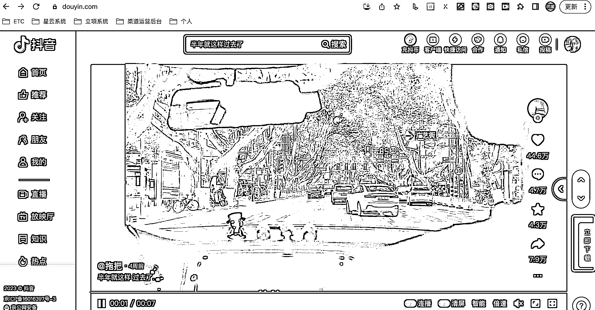

# 抖音无水印视频下载助手-chrome 插件

> 原文：[`www.yuque.com/for_lazy/thfiu8/zbl6359d25aq7bh3`](https://www.yuque.com/for_lazy/thfiu8/zbl6359d25aq7bh3)

<ne-h2 id="97564b26" data-lake-id="97564b26"><ne-heading-ext><ne-heading-anchor></ne-heading-anchor><ne-heading-fold></ne-heading-fold></ne-heading-ext><ne-heading-content><ne-text id="ufa0080d0">(34 赞)抖音无水印视频下载助手-chrome 插件</ne-text></ne-heading-content></ne-h2> <ne-p id="ubc099c5e" data-lake-id="ubc099c5e"><ne-text id="u33369523">作者： 技术老 baby</ne-text></ne-p> <ne-p id="u5689ba4f" data-lake-id="u5689ba4f"><ne-text id="ufd26fe2e">日期：2023-07-04</ne-text></ne-p> <ne-p id="uffda291b" data-lake-id="uffda291b"><ne-text id="u421b806d">抖音无水印视频下载助手-chrome 插件，摆脱看广告的烦恼......</ne-text></ne-p> <ne-p id="u1522410e" data-lake-id="u1522410e"><ne-text id="ud090b0b6">一、插件介绍</ne-text> <ne-text id="ucfa51952">一键下载抖音推荐页、首页、详情页无水印视频，免去看广告的烦恼。</ne-text> <ne-text id="ue010177b">二、背景介绍</ne-text> <ne-text id="u6e948138">最近看抖音，下载一些视频素材，会频繁用到下载无水印视频，以往都是微信搜个小程序直接下载了，少的时候还好，多的时候频繁的弹出广告感觉效率比较慢，心情也不是很美好......，本身做技术多年，靠着这门手艺混了这么多年，就打算自己搞一个，老看广告也挺烦了，正好也接机会练练手做一个浏览器插件。</ne-text> <ne-text id="u955c0ee9">三、开发过程</ne-text> <ne-text id="ua3ee58b0">开发之前觉得这事还是蛮简单的，无非是解决下面几个问题：</ne-text> <ne-text id="ufb0fa71e">1.排查要下载的几个页面的 html 结构，找到视频的原始地址，找到视频信息接口</ne-text> <ne-text id="u4c16bb4b">2.选择一个语言做个工具下载就 ok 了</ne-text> <ne-text id="uf8de1074">3.简单易用，方便入手</ne-text></ne-p> <ne-p id="u3f6a0fe1" data-lake-id="u3f6a0fe1"><ne-text id="u8e53302b">实际动手还是踩了一些坑.......，详细可以阅读文档：</ne-text>[<ne-text id="uaab529b8">https://av5n4p2l2z1.feishu.cn/docx/BXLyd4L44of3OBxIt0acBglinRb</ne-text>](https://av5n4p2l2z1.feishu.cn/docx/BXLyd4L44of3OBxIt0acBglinRb)<ne-card data-card-name="image" data-card-type="inline" id="DW6o1" data-event-boundary="card"></ne-card></ne-p> <ne-hole id="ua9c1509e" data-lake-id="ua9c1509e"><ne-card data-card-name="hr" data-card-type="block" id="f2cM4" data-event-boundary="card"><ne-p id="ub528fcdf" data-lake-id="ub528fcdf"><ne-text id="u6b0bbf45">评论区：</ne-text></ne-p> <ne-p id="u660560ff" data-lake-id="u660560ff"><ne-text id="ub8990f36">锋 : 好像不能用</ne-text> <ne-text id="u62158b40">技术老 baby : 不能呀都测试完的，有什么提示吗？[捂脸]</ne-text> <ne-text id="u0572b33e">锋 : 添加到扩展程序之后，点击插件按钮，显示 Request Failed，请求失败，提示设置密钥，密钥设置完了只提示设置已保存，不知道是不是我哪里操作不对</ne-text> <ne-text id="u1eb07e4a">技术老 baby : 用翻墙软件没，我这个密钥验证用的外网域名……[尴尬]</ne-text> <ne-text id="u7e3aefb6">锋 : 现在是 mKey 不存在[尴尬]</ne-text> <ne-text id="u0d9ed7c2">锋 :</ne-text> <ne-text id="ue1a35100">技术老 baby : 私聊吧[捂脸]</ne-text> <ne-text id="u4a0239a0">锋 : 现在可以了   这插件好用  看上哪个视频  直接下！牛[强]</ne-text></ne-p></ne-card></ne-hole>