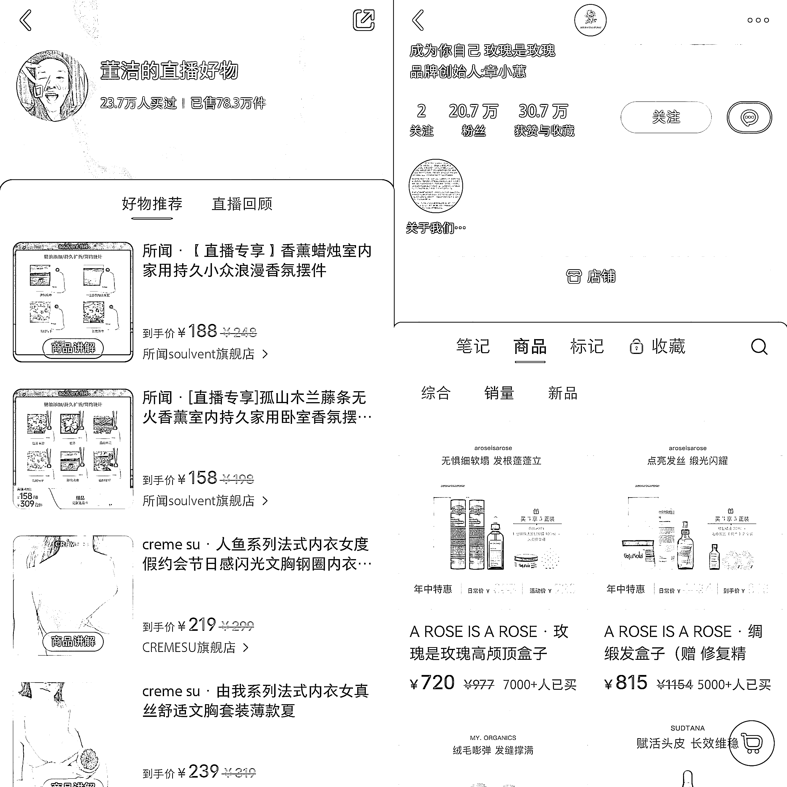
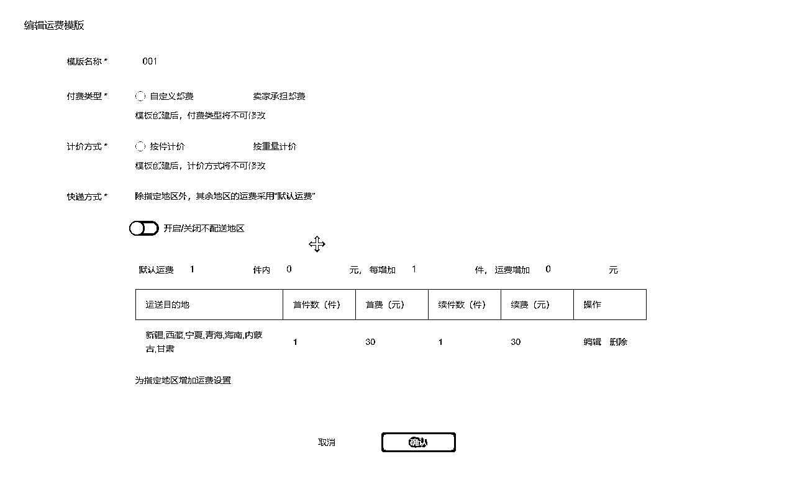
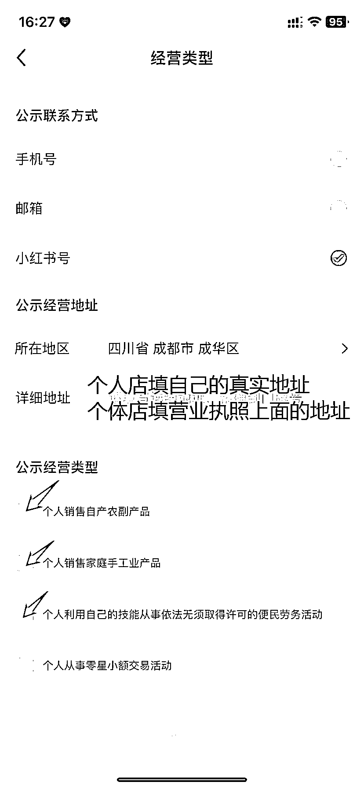
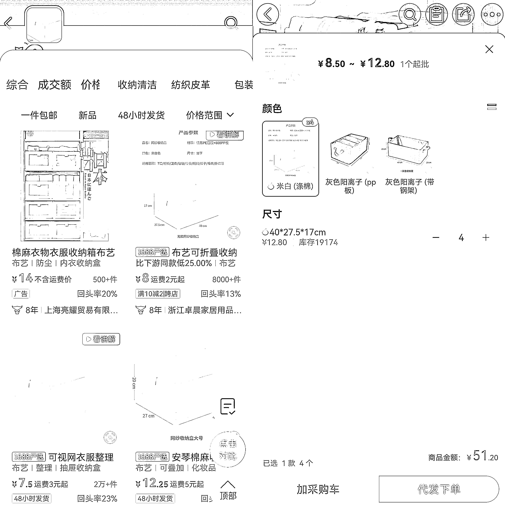
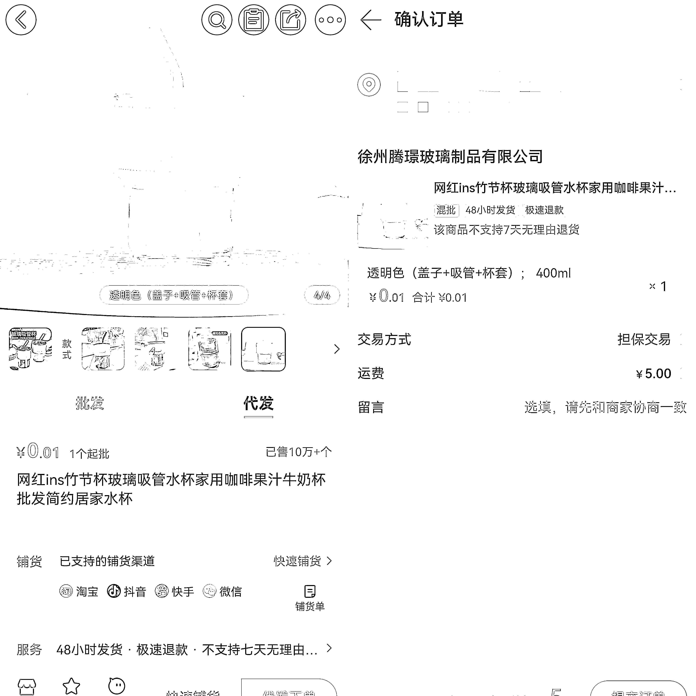

# 操作小红书店铺无货源，单品如何从 0 做到月销 30 万？

> 原文：[`www.yuque.com/for_lazy/thfiu8/ql29a51nwzl9q4z7`](https://www.yuque.com/for_lazy/thfiu8/ql29a51nwzl9q4z7)

<ne-h2 id="4c5bb87d" data-lake-id="4c5bb87d"><ne-heading-ext><ne-heading-anchor></ne-heading-anchor><ne-heading-fold></ne-heading-fold></ne-heading-ext><ne-heading-content><ne-text id="ub9a57bea">(87 赞)操作小红书店铺无货源，单品如何从 0 做到月销 30 万？</ne-text></ne-heading-content></ne-h2> <ne-p id="ufb42db39" data-lake-id="ufb42db39"><ne-text id="u59da69b5">作者： 宅男，（周恩俊）</ne-text></ne-p> <ne-p id="ufb393f06" data-lake-id="ufb393f06"><ne-text id="u033d09ae">日期：2023-07-04</ne-text></ne-p> <ne-p id="u5896473a" data-lake-id="u5896473a"><ne-text id="u18b9362d">生财的圈友们大家好，我是周恩俊，在 5 月时分享了一篇文章，有幸获得了一枚龙珠，</ne-text><ne-text id="u462b6e37" style="color: rgb(38, 38, 38);">原文链接是：</ne-text>[<ne-text id="uc39aba64">https://articles.zsxq.com/id_czskjwr8nbd5.html</ne-text>](https://articles.zsxq.com/id_czskjwr8nbd5.html)<ne-text id="ucc0e1c3e">，加入生财有术两年多了，也是第一次获奖，非常感谢大家的认可，在生财这里也学习到了很多超出认知的内容，给我带来了很多提升，感谢各位圈友的用心分享。</ne-text></ne-p> <ne-p id="u3b784fc9" data-lake-id="u3b784fc9"><ne-text id="uf3f1ce28">上一篇是给大家分享小红书店铺全流程的玩法，今天给大家详细拆解单品如何从 0 做到月销 30 万的思路玩法，除此之外也分享我对小红书平台的趋势以及数据感知，希望我的分享对各位圈友带来帮助。</ne-text></ne-p> <ne-p id="ufae72ff4" data-lake-id="ufae72ff4"><ne-card data-card-name="image" data-card-type="inline" id="uVoy4" data-event-boundary="card">  <ne-p id="u08517218" data-lake-id="u08517218"><ne-text id="ub681340b">本次主要围绕这几点内容去分享：</ne-text></ne-p> <ne-quote id="uf5821f40" data-lake-id="uf5821f40"><ne-p id="ub4db12a7" data-lake-id="ub4db12a7"><ne-text id="u101f7220" style="color: rgb(0, 82, 255);">1.2023 年小红书直播趋势数据分析</ne-text></ne-p> <ne-p id="ua0a8e3d7" data-lake-id="ua0a8e3d7"><ne-text id="udb048bfc">说起直播，很多人或许都会第一时间想到淘宝的李佳琦，快手的辛巴，以及抖音的大狼狗广东夫妇，那小红书的直播，你最先会想到谁？</ne-text></ne-p> <ne-p id="u8cc0a266" data-lake-id="u8cc0a266"><ne-text id="ubb7c25e8">今年 1 月，董洁第一次在小红书带货，GMV 为 300 万元，第二场 GMV 直接翻了 10 倍，第三场直播 GMV 超 6000 万元。</ne-text></ne-p> <ne-p id="u4aa8fb3d" data-lake-id="u4aa8fb3d"><ne-text id="u5382e97f">618 大促前夕，售价上万元的美容仪在香港名媛章小蕙小红书首场直播中迅速售罄。当天，直播间交易额突破了 5000 万元。</ne-text></ne-p> <ne-p id="u1abc65cd" data-lake-id="u1abc65cd"><ne-text id="u16dfbfa7">从中可以看出，小红书巨大可观的消费潜力，正在无限增长中。</ne-text></ne-p> <ne-p id="uf2ceb52e" data-lake-id="uf2ceb52e"><ne-text id="u0e1e9116">而且在董洁之前，姜思达的小红书直播间早已出现了 LV、戴森、始祖鸟等大牌身影。根据数据统计，董洁前三场直播的场均客单价均达到了约 677 元，章小蕙直播间客单价也超过了 500 元。</ne-text></ne-p> <ne-p id="u7ddbf7c3" data-lake-id="u7ddbf7c3"><ne-card data-card-name="image" data-card-type="inline" id="Id4uP" data-event-boundary="card">  <ne-p id="ue38ad4df" data-lake-id="ue38ad4df"><ne-text id="ue166f9db">相反，在抖音，赵雅芝直播间最新一场直播的客单价仅 15.44 元；柴碧云直播间客单价为 94.97 元；贾乃亮最近一场直播带货客单价也仅为 124.35 元。</ne-text></ne-p> <ne-p id="u29102a02" data-lake-id="u29102a02"><ne-text id="u0480da8b">小红书走了一条区别于淘宝、抖音、快手的路径，它选择了中高端品牌和高客单价的商品。这也是为什么小红书很多产品能够溢价的原因，对数字敏感的朋友应该也知道，如果可以溢价，那么在小红书做电商利润肯定不会差，甚至可能会高于传统的电商平台。</ne-text></ne-p> <ne-p id="u66771761" data-lake-id="u66771761"><ne-text id="u0da36c9c" style="color: rgb(0, 82, 255);">2.小红书的消费人群画像分析以及平台优势有哪些？</ne-text></ne-p> <ne-p id="udf2fb409" data-lake-id="udf2fb409"><ne-text id="ud24f68f6">无论是董洁，还是章小蕙，在选品的人群定位上与平台用户群体的消费调性是符合的。小红书平台月活用户 2.6 亿，其中 50%都在一、二线城市，90 后占比 70%，女性占比 7 成。这部分人群消费更加理性，但更看重生活品质，是中高端消费的重要力量。因此，在 2023 年，小红书无论是直播带货还是笔记带货都具有极高的增长势头。</ne-text></ne-p> <ne-p id="u497c4a86" data-lake-id="u497c4a86"><ne-text id="ufd40a38c">而且小红书的用户群体主要是年轻女性，其中大部分集中在年龄段为 18 到 35 岁之间，其中以 20 到 30 岁的年轻女性为主，这个年龄段的女性消费者通常具有较高的消费能力和消费意愿，她们关注时尚、美妆、生活方式等领域的内容，并喜欢分享自己的时尚穿搭和美妆技巧等。</ne-text></ne-p> <ne-p id="u5999fbaa" data-lake-id="u5999fbaa"><ne-text id="ue02fdfdc">此外，小红书的用户群体也对生活方式和旅行感兴趣。他们关注健康、健身、美食、旅行等领域的内容，喜欢了解各种生活方式的分享和体验，追求高品质的生活。</ne-text></ne-p> <ne-p id="u624a0ca2" data-lake-id="u624a0ca2"><ne-text id="u18f8ce76">这类数据分析，对于想要开店卖货的商家来讲，无疑是极佳的选品思路推荐。鉴于这类人群特殊，所以我们实测并且推荐的热门选品类目有：饰品，防晒类，水果，家居日用品，厨房好物，宠物用品，零食，美妆护肤，女性用品（内衣，内裤，丝袜这些），女装，各类花茶养生茶类等。</ne-text></ne-p> <ne-p id="u8d3838fc" data-lake-id="u8d3838fc"><ne-text id="ucda0812b">目前的小红书其实就相当于两年前的抖音小店，但是在用户属性方便又比抖店更加精准高效。一方面，小红书的用户是优质的消费人群，本身就是种草平台，而另一方面，今年被称为小红书电商元年，以前小红书电商门槛很高，而现在 0 粉丝就能开店，最低 1000 元保证金，并且只需一张身份证就能开店了。</ne-text></ne-p> <ne-p id="u43344056" data-lake-id="u43344056"><ne-text id="u6f468a4a">对于之前没有经验的朋友，建议详细看一下这篇项目拆解的文章，因为我会全面的把这个项目实操流程，完整的给你拆解一遍。</ne-text></ne-p> <ne-p id="ua7534026" data-lake-id="ua7534026"><ne-text id="u1a9e1e1f">所谓的无货源，其实本质上就是低买高卖+一件代发的模式。简言之就是客户通过小红书下单，然后我们去找一件代发的平台，让他直接给客户发货，赚取中间的差价。说白了，就是一个流量信息差的电商玩法。</ne-text></ne-p> <ne-p id="uce1937e2" data-lake-id="uce1937e2"><ne-text id="ue9bf030b">再加上小红书本身是一个兴趣电商的平台，只要你的笔记流量可以，那么带货的效果也不会差。接下来一步步的给你拆解一下，小红书无货源电商，应该怎么操作。</ne-text></ne-p> <ne-p id="u2d2bb369" data-lake-id="u2d2bb369"><ne-text id="ud3289df7" style="color: rgb(0, 82, 255);">3.小红书运营实操的前期准备工作流程</ne-text></ne-p> <ne-p id="u9fd1490f" data-lake-id="u9fd1490f"><ne-text id="u9ab9db78">01.前期准备以及注册流程：</ne-text></ne-p> <ne-p id="u1594cd98" data-lake-id="u1594cd98"><ne-text id="u0cb8e6ec">在做小红书电商之前，最好先准备一台手机和一台电脑。新号和老号都可以用来开店，不过开店之前要先进行养号操作。店铺名字这里有个注意事项为了方便搜索和传播，建议使用简单明了的名称，避免使用繁体字或生僻字。</ne-text></ne-p> <ne-p id="u154f00d9" data-lake-id="u154f00d9"><ne-text id="ufd8ad14e">头像建议以账号定位为准，并保持整洁简洁美观，名字最好有特色一点，这样的名称更容易被人记住，不可太过随意。</ne-text></ne-p> <ne-p id="u61cf588d" data-lake-id="u61cf588d"><ne-text id="u4acc539c">小红书店铺分为四种，包括个人、个体、企业和旗舰店。对于刚开始尝试的朋友，建议先选择个人店，因为目前不需要交保证金。过去需要先交保证金才能开店，但现在平台重视电商业务的发展。个人店开店速度很快，并且很多类目只需 1000 元左右的保证金。我建议初学者从个人店铺开始操作，个人店成本不高，方便运营，是目前性价比最高的店铺。不过，如果经济实力稍微好一点的小伙伴，可以尝试开个体店，因为一张身份信息只能够开一家店铺，而一张个体营业执照可以开三家店铺。</ne-text></ne-p> <ne-p id="u7a6fcb09" data-lake-id="u7a6fcb09"><ne-text id="u47bdc808">001.账号注册：</ne-text></ne-p> <ne-p id="uc7004a1c" data-lake-id="uc7004a1c"><ne-text id="u2ea33c2e">小红书账号注册和抖音一样，要遵循一机一卡一号原则，前期开个人店，只需要准备一个身份证，后期如果想要矩阵，可以用家人身份证，或者注册个体营业执照开店。一个营业执照可以开三家店，第一家店铺免认证费用，但是第 2-3 家需要缴纳 600 认证费，一共 1200 元。</ne-text></ne-p> <ne-p id="uabb07a3b" data-lake-id="uabb07a3b"><ne-text id="ucd76d781">注册个人店前一定要准备好自己账号的名称，提前在小红书搜索看看有没有重名，因为小红书个人店重名要 7 天才能修改一次，如果你的名字和别人重复，那需要 7 天之后才能再重新申请，所以一定要提前查好没有重名的，再去提交注册。</ne-text></ne-p> <ne-p id="u40277319" data-lake-id="u40277319"><ne-text id="u06d23d30">002.开店流程：</ne-text></ne-p> <ne-p id="u87e54029" data-lake-id="u87e54029"><ne-text id="u60d5965a">点击小红书——我——点击左上角三条杠——点击创作中心——点击更多服务——点击开通店铺，接下来根据系统提示，输入相关信息以及上传相关证件就可以了，这就是一个个人店基本的开店流程。一旦我们的店铺开店成功，这个时候就可以根据提示去完善相关的信息，这些信息包括物流模板、发货地址以及退货地址（发货地址可以选择自己的真实地址，退货地址可以选择国外的地址，参考下图模板），以及公示类型（一般选择前三个选项）这些。</ne-text></ne-p> <ne-p id="u62f6a7c8" data-lake-id="u62f6a7c8"><ne-card data-card-name="image" data-card-type="inline" id="z1zD2" data-event-boundary="card">  <ne-p id="ua23be993" data-lake-id="ua23be993"><ne-card data-card-name="image" data-card-type="inline" id="liuZR" data-event-boundary="card">  <ne-p id="u586e0e74" data-lake-id="u586e0e74"><ne-card data-card-name="image" data-card-type="inline" id="Ycee3" data-event-boundary="card">  <ne-p id="ufc579de3" data-lake-id="ufc579de3"><ne-text id="u96db754a">02.养号流程</ne-text></ne-p> <ne-p id="ud206825d" data-lake-id="ud206825d"><ne-text id="u456045cd">注册号的账号需要养 3 天，这个时间段不着急改昵称，而是集中看对标，选赛道，等到 3 天后，发一个笔记看看流量是不是正常，一般 50 左右就是正常的账号。那么我们就可以开店了，切记小红书账号开店前要进行养号。</ne-text></ne-p> <ne-p id="ubc83d7e2" data-lake-id="ubc83d7e2"><ne-text id="u9ffce0cd">001.养号前 3 天注意事项：</ne-text></ne-p> <ne-p id="uccd887b8" data-lake-id="uccd887b8"><ne-text id="udb736bef">第一天：账号刚注册下来，不要改头像改名字，不要动。</ne-text></ne-p> <ne-p id="u57343dbf" data-lake-id="u57343dbf"><ne-text id="u9756ffb3">第二天：开始养号，模仿真人去操作，刷你要做的那个领域笔记。</ne-text></ne-p> <ne-p id="ub5d2f31d" data-lake-id="ub5d2f31d"><ne-text id="uff8ed2fd">比如我打算做服装店铺，就多刷服装同行笔记，适量点赞收藏评论，一定要在 30 秒后才操作。</ne-text></ne-p> <ne-p id="u02f6147d" data-lake-id="u02f6147d"><ne-text id="uecc3be74">第三天：继续养号，刷到这个账号首页发现页都是你的领域笔记，就算是养成了垂直号。</ne-text></ne-p> <ne-p id="u1d0af1ae" data-lake-id="u1d0af1ae"><ne-text id="u3b2bae3c">如果着急的话：上午继续养号，下午包装小红书号，发干货笔记/普通笔记测试流量，流量大于 50 以上算正常。</ne-text></ne-p> <ne-p id="u95cd153a" data-lake-id="u95cd153a"><ne-text id="u8cbcce39">002.干货笔记类型：</ne-text></ne-p> <ne-p id="u74125d78" data-lake-id="u74125d78"><ne-text id="u21ad089b">服装干货笔记：衣服清洁小技巧，衣服保存小技巧。</ne-text></ne-p> <ne-p id="uc9ac8e2a" data-lake-id="uc9ac8e2a"><ne-text id="u83da29f4">普通笔记：风景、生活、争议型话题笔记。</ne-text></ne-p> <ne-p id="u3c3136ff" data-lake-id="u3c3136ff"><ne-text id="u8bb67596">如果不着急的话，第四天：上午改头像改昵称，发笔记测流量。</ne-text></ne-p> <ne-p id="ucf9e7800" data-lake-id="ucf9e7800"><ne-text id="ud174af8c">003.养号期间的注意事项：</ne-text></ne-p> <ne-p id="ue74675d6" data-lake-id="ue74675d6"><ne-text id="uba28d956">每天早中晚刷小红书，每天刷 2-3 个小时，同行账号，图文/视频都可以。</ne-text></ne-p> <ne-p id="u0c8ab4b8" data-lake-id="u0c8ab4b8"><ne-text id="udbc5527b">养号细节：</ne-text></ne-p> <ne-p id="u8f71d006" data-lake-id="u8f71d006"><ne-text id="u699441fe">每天关注 3-5 个权威账号或对标账号都可以，对于喜欢的内容点赞+收藏+评论，养成一个真人操作状态。</ne-text></ne-p> <ne-p id="u0d5e4fc1" data-lake-id="u0d5e4fc1"><ne-text id="ue0c13bf2">提升账号级别：</ne-text></ne-p> <ne-p id="udd0a7b9d" data-lake-id="udd0a7b9d"><ne-text id="u75e75054">小红书官方设置有自己的账号等级制度，可以依照官方的等级任务，依次完成来提升账号级别。</ne-text></ne-p> <ne-p id="u6020d3bf" data-lake-id="u6020d3bf"><ne-text id="ua51062de">注意事项：</ne-text></ne-p> <ne-p id="ucfd2d3ea" data-lake-id="ucfd2d3ea"><ne-text id="ud69f5ea1">建议是一机一卡一号，同一个设备不要频繁切换账号，不然会被系统检测到有问题。</ne-text></ne-p> <ne-p id="ue2eb1ff0" data-lake-id="ue2eb1ff0"><ne-text id="uc6f59d3c">账号权重越高，平台推荐的流量就会越多。</ne-text></ne-p> <ne-p id="uec52fa29" data-lake-id="uec52fa29"><ne-text id="u5c86af00" style="color: rgb(0, 82, 255);">4.小红书账号如何定位以及对标同行？</ne-text></ne-p> <ne-p id="u13677a7d" data-lake-id="u13677a7d"><ne-text id="ue6164499">一个账号最好服务一类人群的某一类需求，因为小红书的用户画像比较集中，大多数都是年轻女性，所以，从他们身上找到某一种需求，就是你这一个账号的定位，比如水果、内衣、美甲、手机挂饰等等，总之，想要做什么，就只做什么。还有一个小细节，就是这个工作应该在养号看对标的阶段，就要进行定位了。</ne-text></ne-p> <ne-p id="u9f37237a" data-lake-id="u9f37237a"><ne-text id="u5fada4d0">当然，除了前面的用户人群分析，如果你自己对某一个领域的深入了解，也可以作为账号定位的重要参考。</ne-text></ne-p> <ne-p id="ud5efed67" data-lake-id="ud5efed67"><ne-text id="u59b7c8ee">比如，你本身就喜欢种草某一类产品的话，并且，对这一类产品非常的了解，也可以作为你的账号定位。</ne-text></ne-p> <ne-p id="uf1f6c57f" data-lake-id="uf1f6c57f"><ne-text id="u166176e6">01.确定定位，如何找对标同行：</ne-text></ne-p> <ne-p id="u4d06072b" data-lake-id="u4d06072b"><ne-text id="u06e70c31">新手做任何项目，最简单粗暴的方法，就是模仿，但很多人不会模仿，很多人的模仿仅仅停留在表层，经不起深扒。</ne-text></ne-p> <ne-p id="u918aeaee" data-lake-id="u918aeaee"><ne-text id="ud90774e5">其实，想要模仿好，就一句话的事情：就是把对方的内容看明白，每个细节留意到位，然后用自己的话说出来。秉承这个原则，你再去找对标，去参考他们的笔记、选品、封面图、详情页等等，就知道该怎么做了。</ne-text></ne-p> <ne-p id="u4c7eddf8" data-lake-id="u4c7eddf8"><ne-text id="ud740afb4">首先，小红书找对标同行有三种方法：</ne-text></ne-p> <ne-p id="u6965a127" data-lake-id="u6965a127"><ne-text id="u2cc8a54f">第一.通过笔记找店铺：</ne-text></ne-p> <ne-p id="u8398b8e5" data-lake-id="u8398b8e5"><ne-text id="ubb091a05">搜索你要做的产品关键词，去寻找那些近期点赞比较多的，一般短期点赞能到 100 以上的，都算是不错的笔记。先不管他们有没有挂车，最起码，他们的爆款笔记，是值得借鉴的。如果他们挂车了，直接去看他们的店铺，按照销量排序，把销量过千的产品也都记录下来，这就是你要选的爆品备选。</ne-text></ne-p> <ne-p id="u7fa53aa0" data-lake-id="u7fa53aa0"><ne-text id="u4f6c5cc7">第二.通过产品找笔记：</ne-text></ne-p> <ne-p id="u7f9f5dcf" data-lake-id="u7f9f5dcf"><ne-text id="u09750d89">通过一个产品，可能会找到一个关联的店铺，再通过这个店铺，可能会发现好几个爆款产品，再通过新的爆款产品去寻找新的店铺，如此循环往复，其实我们是可以挖掘到很多不错的选品的。每一个店铺背后都有一堆优质的笔记，尤其是爆款产品背后，一定会有至少一篇以上的爆款笔记，这些就足以满足我们的对标内容库了。</ne-text></ne-p> <ne-p id="u6a2c2429" data-lake-id="u6a2c2429"><ne-text id="uc4ceee24">第三.通过发现页找同行：</ne-text></ne-p> <ne-p id="u59511f9d" data-lake-id="u59511f9d"><ne-text id="u8a6984b3">当我们用这个账号，经常性去刷某个领域后，就会养成垂直账号，在首页发现页会推出同领域的笔记出来，首页推出的笔记质量会比较高，而且低粉爆文的账号也会有很多，在这里面找到优质的同行，可以用小号去关注，去参考他的发文方式和爆款产品。</ne-text></ne-p> <ne-p id="ue6b5d7cd" data-lake-id="ue6b5d7cd"><ne-text id="u3ef2d17b" style="color: rgb(0, 82, 255);">5.小红书如何选品，以家居日用品为例拆解：</ne-text></ne-p> <ne-p id="u11d0a5b4" data-lake-id="u11d0a5b4"><ne-text id="uffb3270f">01.多平台选品：</ne-text></ne-p> <ne-p id="uc943b108" data-lake-id="uc943b108"><ne-text id="u2962a6c7">找好对标，建好产品库，接下来就要去各个平台去选品了，选品平台一般是：拼多多，淘宝，京东，抖音，快手，因为这些平台都是针对 C 端用户的，所以这个销量是值得参考的。就以拼多多为例，同品类 10W+销量的商品，也都可以进入我们的选品库，同时，小红书建立起来的选品库，也都建议挨个在电商平台搜索一遍，找到销量最好的品和产品链接，一方面要作为备选产品，另一方面，后面还要参考他们产品的主图、标题和详情页，现在各个平台都支持以图识图，所以找同行还是很轻松的。</ne-text></ne-p> <ne-p id="ua802ecb2" data-lake-id="ua802ecb2"><ne-text id="u5ccab260">02.分析能够迅速得到正反馈的类目：</ne-text></ne-p> <ne-p id="u43f0ba8e" data-lake-id="u43f0ba8e"><ne-text id="u478618a8">001、功能性半标品，比如：瑜伽服，防晒服，这一类一般满足人某一需求，防晒，减肥，都是真实强需求。</ne-text></ne-p> <ne-p id="u9818ce24" data-lake-id="u9818ce24"><ne-text id="u8e5560a9">002、红海市场中的蓝海思路：一般是只满足于特定人群的红海产品，例如专注于大胸显小或者小胸显大的内衣，专注于小个子的女鞋。</ne-text></ne-p> <ne-p id="u618b0c64" data-lake-id="u618b0c64"><ne-text id="u20c7dbf8">003、美妆护肤品，护肤产品，如有货源且资质齐全，非常建议在小红书上笔记带货。</ne-text></ne-p> <ne-p id="u6b031123" data-lake-id="u6b031123"><ne-text id="u8d554c24">004、自带流量的产品：例如，情侣内衣，JK 服，汉服等。</ne-text></ne-p> <ne-p id="uc027b076" data-lake-id="uc027b076"><ne-text id="u56df94fb">03.选品注意笔记和商品颜值权重：</ne-text></ne-p> <ne-p id="u16016259" data-lake-id="u16016259"><ne-text id="u745dabfa">作为女性为主的社区，很多商家更倾向于上架适合拍照发笔记的高颜值商品，消费者也对这类商品更感兴趣。这甚至形成了一种趋势，一位拼多多商家表示，拼多多的流量规则是“按价格分配”，谁价格低推谁。而小红书电商正在出现“按颜值分配”的迹象，所以在选品时，商品的颜值以及高颜值的商品也可作为选品的参考对象。这并非空穴来风，深入刷过小红书的朋友们都知道小红书的风格普遍偏向于好看的网红风格，或者 ins 风。</ne-text></ne-p> <ne-p id="u7173e5b8" data-lake-id="u7173e5b8"><ne-text id="u236fdb8f" style="color: rgb(22, 37, 102);">04.以家居日用品为例子，拆解选对品带来的正反馈。</ne-text></ne-p> <ne-p id="u2735b75e" data-lake-id="u2735b75e"><ne-text id="ua3e4b4b4">小红书能做的类目非常多，目前给大家推荐的这几个类目，是我们这边实操过并且有效果的，有饰品，防晒帽，水果，家居日用品，宠物用品，零食，女性用品（内衣，内裤，女装等）这些类目都是目前比较容易出效果的类目。</ne-text></ne-p> <ne-p id="ucdb0123b" data-lake-id="ucdb0123b"><ne-text id="uce2909a2">接下来就以家居日用品给大家举例子，我们在定了家居日用这个类目之后，可以先去小红书或者拼多多搜索家居日用，或者百货类的关键词，例如，先在小红书搜索家居用品，我们可以看到排名在前面的，并且销量不错的是一个收纳盒。我特意在拼多多也进行了搜索，排在前面的收纳整理栏目中，也是收纳盒，那么这个收纳盒就是一个不错的选品。</ne-text></ne-p> <ne-p id="u196d846a" data-lake-id="u196d846a"><ne-text id="uc5f4122f">紧接着，我们再去 1688 识图搜索，看看这个收纳盒的进货价，成本价如何。我们找了一家支持一家代发的，然后点击一件代发，选择代发下单，4 个收纳盒的成本价是 51.2 元，它在小红书的定价是 4 个收纳盒 98.9 元，其中 618 活动期间是 89.9 元，这其中的差价和利润，我们可以简单估算一下，这一个单品总利润在 28-34 万这个区间浮动。就光凭一个品，简简单单，30 万到手了，选对品，在小红书绝对大有可为。</ne-text></ne-p> <ne-p id="u4b5bf192" data-lake-id="u4b5bf192"><ne-card data-card-name="image" data-card-type="inline" id="BNMry" data-event-boundary="card">  <ne-p id="u41af0405" data-lake-id="u41af0405"><ne-card data-card-name="image" data-card-type="inline" id="iGrXE" data-event-boundary="card">  <ne-p id="u45e8585e" data-lake-id="u45e8585e"><ne-text id="ua8b0d183">因为小红书的人群质量比较高端，所以在追求生活品质这一块，亦是比较讲究的，所以好的生活用品，家居日用品，以及一些刚需品，都是可以考虑往上面布局的。</ne-text></ne-p> <ne-p id="u3e3968a4" data-lake-id="u3e3968a4"><ne-text id="ud82ec50e">接下来，再给大家拓展分析一下，佐证我前面这个说法。以水杯为例子，在小红书进行搜索，排名在前面的笔记以及销量高的水杯，基本都是带有吸管的那一种，这种杯子就比平时大家用的普通杯子颜值要高。这种杯子不仅外形美观，最主要的是平时也适合拍照，特别满足当下一些女性喜欢拍照发朋友圈的心理。</ne-text></ne-p> <ne-p id="u2939c541" data-lake-id="u2939c541"><ne-text id="u4a7bcff3">我们再看这一款杯子的价格，它在小红书的定价为 10 元，我们通过 1688 识图搜索，这样一个杯子的进货价为 5.01 元，小红书的销量显示为 4.6 万件，它的一单利润为：10-5.01=4.99 元，粗略估算了一下，这一款杯子的利润大约为 23 万，收益也是非常可观的。</ne-text></ne-p> <ne-p id="u95105116" data-lake-id="u95105116"><ne-card data-card-name="image" data-card-type="inline" id="vWpJS" data-event-boundary="card">  <ne-p id="u8dbf6c1e" data-lake-id="u8dbf6c1e"><ne-card data-card-name="image" data-card-type="inline" id="IFWuo" data-event-boundary="card">  <ne-p id="uae0d0268" data-lake-id="uae0d0268"><ne-text id="ufab1a0ed" style="color: rgb(0, 82, 255);">6.小红书怎么找到适合的货源以及快速上架？</ne-text></ne-p> <ne-p id="ue94a331d" data-lake-id="ue94a331d"><ne-text id="u72875da2">前面分享完选品，接着讲解一下怎么找到适合的货源？我们这里说的普通人指的是没有货源的朋友，像我一样，一定要走无货源一件代发模式，不用囤货，你可以选择自己在网上找供应商。比如，1688 就是一个不错的渠道。</ne-text></ne-p> <ne-p id="u506d3b66" data-lake-id="u506d3b66"><ne-text id="uc25dba7f">01.我们怎么筛选 1688 的优质上家呢？这里有几点建议参考：</ne-text></ne-p> <ne-p id="u66983459" data-lake-id="u66983459"><ne-text id="u76ce8143">001.在 1688 上怎么区分真假货源？</ne-text></ne-p> <ne-p id="ucca6a935" data-lake-id="ucca6a935"><ne-text id="u8b8d8589">相关生产许可证和授权证书、商品的质量保证等多方面来判断货源是否真实可靠。此外，在选择供应商时，可以点进去他店铺里查看其信用评价，了解其信誉状况，尽量避免选择未经验证的商品。</ne-text></ne-p> <ne-p id="uc58e1cf2" data-lake-id="uc58e1cf2"><ne-text id="u554bc918">002.在 1688 上如何找到更适合自己的商品？</ne-text></ne-p> <ne-p id="u735967c6" data-lake-id="u735967c6"><ne-text id="u3afd9f91">可以根据自己经营的品类和目标受众，使用 1688 搜索栏中的“筛选”模块，选择对应的类别、品牌、价格、评价等条件，缩小搜索范围。</ne-text></ne-p> <ne-p id="u940fa94d" data-lake-id="u940fa94d"><ne-text id="uc79942f9">003.在和供应商接洽时，如何判断价格和货源的可谈性？</ne-text></ne-p> <ne-p id="u8e5b16c3" data-lake-id="u8e5b16c3"><ne-text id="u87650d89">可以收集一定数量的报价信息，进行比较和协商。坚持自己的原则，但是更要适度灵活，多思考，借助优势算力，翻阅大量历史数据，分析供应商对市场的看法等，从而得出自己最合理的谈判策略。同样，根据市场的需求量，可以预测对方的谈判底线，在合理的价格范围内展开谈判。</ne-text></ne-p> <ne-p id="u50ae17cb" data-lake-id="u50ae17cb"><ne-text id="ua958c399">004.1688 上的供应商是否可信，应该选择哪些？</ne-text></ne-p> <ne-p id="u0ba02a3a" data-lake-id="u0ba02a3a"><ne-text id="u5350ce4c">在选择供应商时，要查看其资质、信誉评价、交易记录、阅读买家好评等多个“维度”，注意排除各类不良供应商，选择实力雄厚的顶级供应商和从长远角度合作的稳定供应商，可以极大提高合作的质量和效益。</ne-text></ne-p> <ne-p id="uefb0c862" data-lake-id="uefb0c862"><ne-text id="u26d274b3">02.批量上架产品工具推荐：</ne-text></ne-p> <ne-p id="u870d56a0" data-lake-id="u870d56a0"><ne-text id="u89ef51ab">打开小红书商家管理后台，点击“服务市场”"，用“摸鱼铺货、蚂蚁搬家，欢乐逛"等铺货工具，在 1688、拼多多、淘宝采集产品，进行商品批量上传，单店可上架 500+产品。</ne-text></ne-p> <ne-p id="ua392e286" data-lake-id="ua392e286"><ne-text id="ucd83046c">一键发货工具推荐:</ne-text></ne-p> <ne-p id="u6d0ec00e" data-lake-id="u6d0ec00e"><ne-text id="uaff40be0">还是在小红书商家管理后台的“服务市场”，用“逸淘、爱推"等一键下单工具，进行订单核对，并—键下单发货。这些工具都不贵，且有免费的体验期，过了之后一个月也就二三十元钱，且多平台适用，能极大的解放你的双手。</ne-text></ne-p> <ne-p id="ub71fdbce" data-lake-id="ub71fdbce"><ne-text id="ufc37c755" style="color: rgb(0, 82, 255);">7.小红书如何编辑爆款笔记，图文好还是视频好？</ne-text></ne-p> <ne-p id="uec7429f5" data-lake-id="uec7429f5"><ne-text id="u356aba7c">小红书图文笔记好，但是视频笔记在带货功能上优势更大，且选品不是单独选一个商品，更重要的是选择相关的带货视频，二者密不可分。</ne-text></ne-p> <ne-p id="uef95a499" data-lake-id="uef95a499"><ne-text id="u6e205dd4">当你选定一个商品的时候，把同类这些视频从别的平台给搬下来，前期刚开始做可以视频混剪，后期直接拿样品自己拍摄。</ne-text></ne-p> <ne-p id="u10189c36" data-lake-id="u10189c36"><ne-text id="u78063f61">首先我们寻找视频来源：</ne-text></ne-p> <ne-p id="uafc41de8" data-lake-id="uafc41de8"><ne-text id="ue7aa097c">在抖音、快手甚至视频号里面搜索：连衣裙，看看是否有相关视频（尽量不要真人露脸的）。</ne-text></ne-p> <ne-p id="uc80ffa6c" data-lake-id="uc80ffa6c"><ne-text id="u0b786a24">我们需要观察的内容是：</ne-text></ne-p> <ne-p id="uee4f4878" data-lake-id="uee4f4878"><ne-text id="u24e28ab3">001.专门做单一品类的达人</ne-text></ne-p> <ne-p id="ufe84cf50" data-lake-id="ufe84cf50"><ne-text id="u5c3fc9aa">是否有，决定我们是否有视频来源；</ne-text></ne-p> <ne-p id="u99cccbb3" data-lake-id="u99cccbb3"><ne-text id="ud190cae0">是否多，决定我们是否可以筛选最好的。</ne-text></ne-p> <ne-p id="u6b78ae06" data-lake-id="u6b78ae06"><ne-text id="u777520b0">002.某达人的视频数量是否够多</ne-text></ne-p> <ne-p id="u5388aab7" data-lake-id="u5388aab7"><ne-text id="uc63fe183">决定我们能参考多长时间，如果只有 10 条，那不用一个星期就发布完了！</ne-text></ne-p> <ne-p id="u296a9618" data-lake-id="u296a9618"><ne-text id="ua372aad5">003.达人的点赞数据、销量数据，研究他们在抖音平台做的如何。</ne-text></ne-p> <ne-p id="ue44d0de7" data-lake-id="ue44d0de7"><ne-text id="u2262151c">选择视频很重要，要找符合小红书人群调性的视频。同样的品，不同的视频去带，效果是完全不一样的，差距十分巨大。</ne-text></ne-p> <ne-p id="u925624f1" data-lake-id="u925624f1"><ne-text id="u20c64ce2">就拿连衣裙来说，不同的话术、场景、剧情、人物，带来的购物转化效果完全不同的，一定记得去选取（混剪）更适合小红书平台的视频内容。更极端一点的例子是，你发同一个品的 ABCD 四个账号，产品、话术都相同，只是场景不同，去测试哪一个场景更适合在小红书出单！</ne-text></ne-p> <ne-p id="u3660a0a5" data-lake-id="u3660a0a5"><ne-text id="u33e7737c">量当道，内容为王：这样做内容，低粉也能高变现，其实刚才我们做的一系列工作，都是为了内容这一步在做准备内容生产也可以流程化，比如我的内容，图片是有共性的，基本每篇笔记的一组图里，都会有产品整体展示图，细节展示图，客户反馈图。</ne-text></ne-p> <ne-p id="u395e336a" data-lake-id="u395e336a"><ne-text id="u0271a2ef">文案上也有大量共性，我一天可以生产这种内容 10 篇以上的笔记文案，我们前期在确定内容模板的时候可以多试几个，不要觉得是不是发多了就限流了，不会的，这点放心好了，只要你内容不完全重复就行。</ne-text></ne-p> <ne-p id="uad533638" data-lake-id="uad533638"><ne-text id="ud5a275e1">先说标题，分享一个起标题简单粗暴好用的方式，直接套用数据比较高的带货标题：</ne-text></ne-p> <ne-p id="uace61b3d" data-lake-id="uace61b3d"><ne-text id="u14d565e6">小红书标题可带：</ne-text></ne-p> <ne-p id="u3915dc02" data-lake-id="u3915dc02"><ne-text id="u5010b08e">被问了 x 遍</ne-text></ne-p> <ne-p id="u7a9a9bfb" data-lake-id="u7a9a9bfb"><ne-text id="ucbe658a8">我要安利给所有</ne-text></ne-p> <ne-p id="ud2e6a59b" data-lake-id="ud2e6a59b"><ne-text id="uf17bd39f">今年最火</ne-text></ne-p> <ne-p id="u720a6a13" data-lake-id="u720a6a13"><ne-text id="u7e6c6862">私藏</ne-text></ne-p> <ne-p id="u38898e64" data-lake-id="u38898e64"><ne-text id="u223e7802">我又挖到宝啦</ne-text></ne-p> <ne-p id="ue348761b" data-lake-id="ue348761b"><ne-text id="u4f4d216c">无限回购</ne-text></ne-p> <ne-p id="uaac2eb02" data-lake-id="uaac2eb02"><ne-text id="u59137e84">我后悔了</ne-text></ne-p> <ne-p id="u42db1736" data-lake-id="u42db1736"><ne-text id="u9eb6a7e0">直接炸裂</ne-text></ne-p> <ne-p id="u3157d96c" data-lake-id="u3157d96c"><ne-text id="ua65274c5">每天都</ne-text></ne-p> <ne-p id="u49bbf3ad" data-lake-id="u49bbf3ad"><ne-text id="ub9b73024">被问爆了的</ne-text></ne-p> <ne-p id="ueca8ff35" data-lake-id="ueca8ff35"><ne-text id="u52564686">还可以这样</ne-text></ne-p> <ne-p id="u0365eede" data-lake-id="u0365eede"><ne-text id="u008b24bd">这也太好看了吧</ne-text></ne-p> <ne-p id="u9abdaa69" data-lake-id="u9abdaa69"><ne-text id="uccb21e38">真想把这个</ne-text></ne-p> <ne-p id="udf3b5852" data-lake-id="udf3b5852"><ne-text id="u67fbd12d">我发现了</ne-text></ne-p> <ne-p id="uf19d7032" data-lake-id="uf19d7032"><ne-text id="u64d1b561">啊啊啊啊</ne-text></ne-p> <ne-p id="u5c12534a" data-lake-id="u5c12534a"><ne-text id="uc33b06da">yyds</ne-text></ne-p> <ne-p id="u97c056ba" data-lake-id="u97c056ba"><ne-text id="u823c9a88">绝绝子</ne-text></ne-p> <ne-p id="uf6cb4c76" data-lake-id="uf6cb4c76"><ne-text id="ue555e033">宝藏</ne-text></ne-p> <ne-p id="ue53b3217" data-lake-id="ue53b3217"><ne-text id="u52866492">神器！</ne-text></ne-p> <ne-p id="u179b545d" data-lake-id="u179b545d"><ne-text id="ufe2974b9">天呐！</ne-text></ne-p> <ne-p id="uff702ebf" data-lake-id="uff702ebf"><ne-text id="uc4ea93d8">真香</ne-text></ne-p> <ne-p id="u3afa1e7d" data-lake-id="u3afa1e7d"><ne-text id="uf1aa11d9">拯救我的</ne-text></ne-p> <ne-p id="ua4ca8adf" data-lake-id="ua4ca8adf"><ne-text id="u4198cd0d">这是文案标题的通用语气词汇总。</ne-text></ne-p> <ne-p id="u35fc0061" data-lake-id="u35fc0061"><ne-text id="u293b8589">接下来给大家分享小红书图片的细节，前面给大家分享了视频以及文案框架，但是图片也是笔记最重要的元素之一,在发图片时，有很多细节需要考虑，下面让我们来看看应该注意哪些事项。</ne-text></ne-p> <ne-p id="u7313a7e3" data-lake-id="u7313a7e3"><ne-text id="uc608de08">01\. 图片美观度</ne-text></ne-p> <ne-p id="u0dbd582c" data-lake-id="u0dbd582c"><ne-text id="ucae85969">首先，我们需要注意图片的美观度。美丽的图片可以让人眼前一亮，而丑陋或者不清晰的图片则会让人产生逆反心理。所以，在发表图片之前，一定要选择清晰、有质感、美观的照片。此外，在拍照时也要注意光线和角度，让照片更立体、自然和艺术感。</ne-text></ne-p> <ne-p id="u88ccb473" data-lake-id="u88ccb473"><ne-text id="u8dc54d80">02\. 图片大小和格式</ne-text></ne-p> <ne-p id="u57823b64" data-lake-id="u57823b64"><ne-text id="u81bff23e">图片的大小和格式也需要注意。小红书对于上传的图片有严格的大小和格式要求，一般来说，图片最大不超过 15MB，文件格式只支持 jpg、jpeg、png、gif、bmp、tif、tiff 等几种。如果您的图片不符合要求，上传会失败或者图像质量会严重受损。</ne-text></ne-p> <ne-p id="u9872bd6a" data-lake-id="u9872bd6a"><ne-text id="u87f2412a">03\. 图片的水印和版权</ne-text></ne-p> <ne-p id="u12c5a26a" data-lake-id="u12c5a26a"><ne-text id="u823fbd7c">当然，在发表图片时，我们还需要注意图片上的水印和版权问题。水印可以保护自己的照片不被盗用，但是如果满篇都是水印，那么用户就会感觉很烦躁，所以还是要照顾用户的心情。另外，对于盗用别人的图片，必须事先获得作者的授权，如果不遵守版权规定，可能会面临重罚款甚至被起诉的风险。</ne-text></ne-p> <ne-p id="ua41b9639" data-lake-id="ua41b9639"><ne-text id="ud77add5d">04\. 图片的标题和描述</ne-text></ne-p> <ne-p id="u5f1e1f32" data-lake-id="u5f1e1f32"><ne-text id="u31c76912">标题和描述在小红书发图片时也非常重要。一个精彩的标题和生动的描述可以吸引更多用户阅读和点赞。在选择标题时，可以考虑使用一些有趣的词汇、炫酷的表达、或者话题热点，同时也要适当引导用户阅读和互动，而对于描述，可以采用生动有趣的故事叙述方式，或者从图片角度出发进行详实描述，但是请不要过于冗长或者饶舌，让读者失去阅读兴趣。</ne-text></ne-p> <ne-p id="u4589737e" data-lake-id="u4589737e"><ne-text id="u01328aba">以上就是在小红书发图片时需要注意的几个细节，如果想要做好小红书店铺无货源，一定要重视每一个环节，精心筛选每一张图片，才能取得更多的正反馈。</ne-text></ne-p> <ne-p id="u7bec130a" data-lake-id="u7bec130a"><ne-text id="u5dd345a0" style="color: rgb(0, 82, 255);">8.小红书的售后问题以及常见的客服话术分享？</ne-text></ne-p> <ne-p id="u71d3f3e6" data-lake-id="u71d3f3e6"><ne-text id="uf14b396a">当出现售后纠纷时，如何妥善解决，将损失最小化?</ne-text></ne-p> <ne-p id="u872faea0" data-lake-id="u872faea0"><ne-text id="uefdaaacd">过来人都知道，电商本身就是一个不容易的行业，有出单，有爆单，就有退货退款，商品不可能每一件都是完美无缺的，当出现售后问题，怎么处理，才能够将损失降到最小呢？</ne-text></ne-p> <ne-p id="u94d0eda9" data-lake-id="u94d0eda9"><ne-text id="u4f8694cf">一般有售后的情况，我们要按照承诺给买家售后，同时也要及时跟上家沟通，了解上家的退货退款流程，跟上家说明了缘由之后，上家提供退货地址，我们这边再发给客户，客户按照地址退回之后，有了退货单号，我们再补充填到上家那边，这样两边都退，我们也没有什么损失。如果上家有运费险，那就更加方便了。</ne-text></ne-p> <ne-p id="u524953c7" data-lake-id="u524953c7"><ne-text id="u51d9c2df">小红书的商品也是可以开通运费险的，不过，它的名字在平台叫运费宝，在物流工具那里可以开通。一般像有尺寸的商品，比如女装，鞋子这些商品都建议开通，因为不开通的话，如果客户因为尺寸不合适要退货，但是他们那边又不想出运费的话，就比较麻烦了。</ne-text></ne-p> <ne-p id="u11475230" data-lake-id="u11475230"><ne-text id="u182a049f">开通了运费宝，其实在一定的程度上也是可以提高转化率的，或许别人就是看有运费险才放心大胆购买的。</ne-text></ne-p> <ne-p id="ub09a1521" data-lake-id="ub09a1521"><ne-text id="u8676b097">顺便提一下这个 7 天无理由退货，可以在上架的时候，就进行选择是否支持支持七天无理由退货，一般像水果生鲜类或者农产品可以不选择 7 天无理由退货，但是像女装这种退货率本身就很高的，后台是一定要选择支持 7 天无理由退货，这种也是可以提高店铺转化率。</ne-text></ne-p> <ne-p id="u2c8873f2" data-lake-id="u2c8873f2"><ne-text id="u2dd0eb46">小红书平台电商也是跟其他平台电商一样，可以设置自动回复以及关键词，设置流程为：登录小红书商家版后台，在客服-智能客服-欢迎语设置-自动回复问题设置这里进行设置。</ne-text></ne-p> <ne-p id="u32ecd696" data-lake-id="u32ecd696"><ne-text id="u4eedeb54">常见的客服话术+促单话术给大家分享参考一下，需要的可以直接搬运或者收藏，谢谢：</ne-text></ne-p> <ne-p id="u3465d6a8" data-lake-id="u3465d6a8"><ne-text id="ud256ef74">欢迎语</ne-text></ne-p> <ne-p id="u78a8d9e7" data-lake-id="u78a8d9e7"><ne-text id="ub46bfad9">“亲，您好！在的哦，请问您看中本店的哪个宝贝了呢?我可以为您介绍的呢？”</ne-text></ne-p> <ne-p id="u75df2bfe" data-lake-id="u75df2bfe"><ne-text id="u9607e7e3">“亲，您好！请问有什么可以帮助您的吗？”</ne-text></ne-p> <ne-p id="u0d0e4181" data-lake-id="u0d0e4181"><ne-text id="uce871b93">尺码问题</ne-text></ne-p> <ne-p id="uac56b207" data-lake-id="uac56b207"><ne-text id="u7ad77f1e">“亲，您好，本店的 XX 物品所标注的尺码都是标准码，亲可以按照自己的平时穿的尺码购买，如果方便的话您也可以把您的身高体重告诉我们，我们帮您选择最合适您的款式。”</ne-text></ne-p> <ne-p id="uc250713e" data-lake-id="uc250713e"><ne-text id="u26ed17ed">色差问题</ne-text></ne-p> <ne-p id="u94f1aae9" data-lake-id="u94f1aae9"><ne-text id="ua155d1a4">“您好,亲,我们的产品都是百分百实物拍摄的,但是由于光线及显示器的原因,可能会跟实物稍有差别,但是请您放心,我们已尽量把色差降到最低,也请您谅解！”</ne-text></ne-p> <ne-p id="uccea9823" data-lake-id="uccea9823"><ne-text id="ud59567c5">质量问题</ne-text></ne-p> <ne-p id="ue329007d" data-lake-id="ue329007d"><ne-text id="uc93b0292">“亲，您好！请您放心，本店的产品在发货之前都是有做检查的，保证质量是没有问题的哦，如果您还是不放心的话，可以看看评价里面都是买家对我们家的肯定的。如果之后我们的宝贝还是出现了质量问题的话，本店是支持 7 天内无理由退货的哦。”</ne-text></ne-p> <ne-p id="uf5777bef" data-lake-id="uf5777bef"><ne-text id="u90a74d15">发货时间</ne-text></ne-p> <ne-p id="u25c8ebd0" data-lake-id="u25c8ebd0"><ne-text id="u14814cc6">“亲，我们一般每天 4 点半前完成支付的订单，当天可以发货，4 点半之后就要第二天发货了 但是都会尽快给您发的 这个请您放心”</ne-text></ne-p> <ne-p id="u3041560c" data-lake-id="u3041560c"><ne-text id="uf13051bf">“亲，24-48 个小时左右发货的哦，这边亲放心，我们会尽快的给您安排发货的。”</ne-text></ne-p> <ne-p id="ue7924252" data-lake-id="ue7924252"><ne-text id="ua6e4d88d">物流问题</ne-text></ne-p> <ne-p id="u6bcbe43e" data-lake-id="u6bcbe43e"><ne-text id="u8c2a7372">“您好，亲，我们是默认申通快递的，您看申通快递您那里能到吗？”</ne-text></ne-p> <ne-p id="u0de78849" data-lake-id="u0de78849"><ne-text id="uab30a4d0">“快递一般均 2-3 天左右到达。节假日，自然灾害，交通意外，较偏远地区等，均有可能到货时间延迟！”</ne-text></ne-p> <ne-p id="u304bd45d" data-lake-id="u304bd45d"><ne-text id="ubcf801a9">利用“怕买不到”的心理</ne-text></ne-p> <ne-p id="u0872d93e" data-lake-id="u0872d93e"><ne-text id="u74c19a9c">“这款是我们最畅销的了，经常脱销，现在这批又只剩 3 个了，估计一两天之后又会没了，喜欢的话别错过了哦”</ne-text></ne-p> <ne-p id="u9bee05c5" data-lake-id="u9bee05c5"><ne-text id="ubd210701">“今天是优惠价的截止日，请把握良机，明天你就买不到这种折扣价了哦。”</ne-text></ne-p> <ne-p id="ubc2800f3" data-lake-id="ubc2800f3"><ne-text id="u46c2c949">利用顾客希望快点拿到商品的心理</ne-text></ne-p> <ne-p id="u03df6566" data-lake-id="u03df6566"><ne-text id="u075299ed">“如果真的喜欢的话就赶紧拍下吧，快递公司的人再过 10 分钟就要来了，如果现在支付成功的话，马上就能为你寄出了。”</ne-text></ne-p> <ne-p id="uc5e54cd0" data-lake-id="uc5e54cd0"><ne-text id="uf984a0cc">当顾客一再出现购买信号，却又犹豫不决拿不定主意时，可采用“二选其一”的技巧来促成交易。</ne-text></ne-p> <ne-p id="u872a7ba6" data-lake-id="u872a7ba6"><ne-text id="u79ea2ab4">“请问您需要第 6 款还是第 11 款？”</ne-text></ne-p> <ne-p id="u24fefb9c" data-lake-id="u24fefb9c"><ne-text id="ue3d6b7a9">“请问要平邮给您还是快递给您?”。</ne-text></ne-p> <ne-p id="u24483882" data-lake-id="u24483882"><ne-text id="u459dbbc9">这种“二选其一”的问话技巧，只要准顾客选中一个，其实就是你帮他拿主意，下决心购买了。</ne-text></ne-p> <ne-p id="u04fb636d" data-lake-id="u04fb636d"><ne-text id="u7c270e1b">帮助准顾客挑选，促成交易</ne-text></ne-p> <ne-p id="u7bc93910" data-lake-id="u7bc93910"><ne-text id="u4a37e2dc">许多准顾客即使有意购买，也不喜欢迅速签下订单，他总要东挑西拣，在产品颜色、规格、式样上不停地打转。这时候你就要改变策略，暂时不谈订单的问题，转而热情地帮对方挑选颜色、规格、式样等，一旦上述问题解决，你的订单也就落实了。</ne-text></ne-p> <ne-p id="ue9c64d53" data-lake-id="ue9c64d53"><ne-text id="uce7c646a">巧妙反问，促成订单</ne-text></ne-p> <ne-p id="ub4e8f615" data-lake-id="ub4e8f615"><ne-text id="u2ea53f94">当顾客问到某种产品，不巧正好没有时，就得运用反问来促成订单。</ne-text></ne-p> <ne-p id="uf6d5314c" data-lake-id="uf6d5314c"><ne-text id="u811cefa1">举例来说，顾客问：“这款有红色的吗?”</ne-text></ne-p> <ne-p id="u99286c02" data-lake-id="u99286c02"><ne-text id="u5090f620">这时，你不可回答没有，而应该反问道：“不好意思我们没有进货，不过我们有黑色、紫色、蓝色的，在这几种颜色里，您比较喜欢哪一种呢?</ne-text></ne-p> <ne-p id="ufdc5c9aa" data-lake-id="ufdc5c9aa"><ne-text id="u93294fcd">积极的推荐，促成交易</ne-text></ne-p> <ne-p id="udeba4338" data-lake-id="udeba4338"><ne-text id="u2672488b">当顾客拿不定主意，需要你推荐的时候，你可以尽可能多的推荐符合他的要求的款式，在每个链接后附上推荐的理由，而不要找到一个推荐一个。</ne-text></ne-p> <ne-p id="u8e11bd6b" data-lake-id="u8e11bd6b"><ne-text id="u0c9a7cdb">“这款是刚到的新款，目前市面上还很少见”</ne-text></ne-p> <ne-p id="uf1b1caf5" data-lake-id="uf1b1caf5"><ne-text id="u0f71ea88">“这款是我们最受欢迎的款式之一”</ne-text></ne-p> <ne-p id="u0cf2676b" data-lake-id="u0cf2676b"><ne-text id="u7774b19e">“这款是我们最畅销的了，经常脱销”等等，以此来尽量促成交易。</ne-text></ne-p> <ne-p id="uc76974ac" data-lake-id="uc76974ac"><ne-text id="u16937611">以上则是今天分享的内容，希望我的分享对你有帮助，有问题也欢迎一起交流，谢谢。</ne-text></ne-p> <ne-p id="u9f16c337" data-lake-id="u9f16c337"><ne-text id="u91cbbba2">写在最后，我想表达的是~</ne-text></ne-p> <ne-p id="u5cf17371" data-lake-id="u5cf17371"><ne-text id="u6b7139e7">每个人的成长都是能力和想要得到的东西，不断匹配的过程，当你的才华和欲望不匹配时，就该静下心来学习了。</ne-text></ne-p> <ne-p id="ua2e8d6fa" data-lake-id="ua2e8d6fa"><ne-text id="u6f76d280">坚持下去，一定会有一个不错的结果，感谢正在看的你，一起生财有术！</ne-text></ne-p> <ne-hole id="u50ec4b29" data-lake-id="u50ec4b29"><ne-card data-card-name="hr" data-card-type="block" id="JPBDW" data-event-boundary="card"><ne-p id="ue6cf3207" data-lake-id="ue6cf3207"><ne-text id="u7b079d8e">评论区：</ne-text></ne-p> <ne-p id="uef3e0c53" data-lake-id="uef3e0c53"><ne-text id="uc96c7d9f">低调创业说 : 男哥，牛逼！</ne-text> <ne-text id="u33f4bd26">静水 : 男哥 666[强][强][强]</ne-text> <ne-text id="u37f660e9">3 先生 : 我咋感觉在这篇文章里看到很多我看到过的文章呢[擦汗]</ne-text> <ne-text id="u8ff5b0bb">Lion : 牛逼</ne-text> <ne-text id="ucfa44c79">Lion : 这个才是最近浏览这么多小红书店铺分享最好的最详细最具体的，其它的分享看是不错都比较空</ne-text> <ne-text id="u00558d41">宅男，（周恩俊） : 谢谢，一起加油[玫瑰]</ne-text> <ne-text id="uf2971ffc">宅男，（周恩俊） : 感谢认可，一起加油[奋斗]</ne-text> <ne-text id="u349c41e7">宅男，（周恩俊） : 我们这边的玩法分享是比较早出来的，不过有些内容确实被许多博主拆分过多次了</ne-text></ne-p></ne-card></ne-hole></ne-card></ne-p></ne-card></ne-p></ne-card></ne-p></ne-card></ne-p></ne-card></ne-p></ne-card></ne-p></ne-card></ne-p></ne-card></ne-p></ne-quote></ne-card></ne-p>