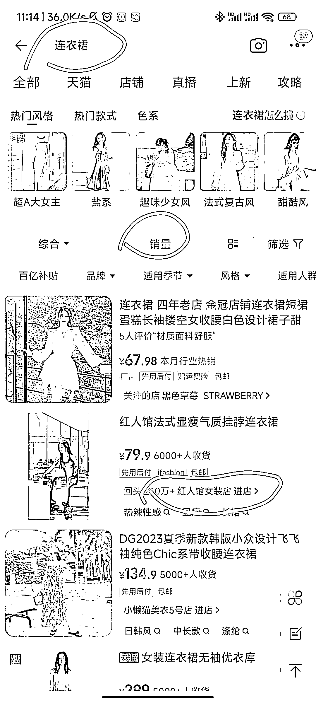

# 小红书无货源电商做女装如何选品？

> 原文：[`www.yuque.com/for_lazy/thfiu8/eue90o716rig5xi2`](https://www.yuque.com/for_lazy/thfiu8/eue90o716rig5xi2)

<ne-h2 id="8acab236" data-lake-id="8acab236"><ne-heading-ext><ne-heading-anchor></ne-heading-anchor><ne-heading-fold></ne-heading-fold></ne-heading-ext><ne-heading-content><ne-text id="u7327e64d">(66 赞)小红书无货源电商做女装如何选品？</ne-text></ne-heading-content></ne-h2> <ne-p id="ubb2bdf0b" data-lake-id="ubb2bdf0b"><ne-text id="u66c7b7dc">作者： 书豪</ne-text></ne-p> <ne-p id="ub0365906" data-lake-id="ub0365906"><ne-text id="uc2ac3b41">日期：2023-07-07</ne-text></ne-p> <ne-p id="u2ab7934e" data-lake-id="u2ab7934e"><ne-text id="ud0e3de82">各位朋友好，我是在杭州的圈友书豪，一个连续创业四年的 95 后，目前连续四年都年入百万。</ne-text></ne-p> <ne-p id="u223a9dce" data-lake-id="u223a9dce"><ne-text id="uf1b33919">前面的文章分享了我们关于小红书无货源电商低价百货的选品方法，今天我们来说说我们自己的店铺关于女装的选品方法。</ne-text></ne-p> <ne-p id="u51292b9b" data-lake-id="u51292b9b"><ne-text id="ub8f020b7">其实女装选品的</ne-text><ne-text id="ueef0160b" ne-bold="true">本质也是跟款</ne-text><ne-text id="uedbd4586">，只不过对标的平台变了。</ne-text></ne-p> <ne-p id="u65eee2aa" data-lake-id="u65eee2aa"><ne-text id="u8653199f" ne-bold="true">低价百货是在小红书上找粉丝两百以下，近七天带货笔记点赞 100 以上，带货商品销量 100 以上的品去跟。</ne-text></ne-p> <ne-p id="ua2e1775c" data-lake-id="ua2e1775c"><ne-text id="ue1cce7dc">而女装我们基本上不在小红书上找对标商品，而是在淘宝上找对标商品，</ne-text><ne-text id="uf0c261a9" ne-bold="true">原则是每天去关注淘宝天猫排名前五十的规模较大的女装店铺，他们的新品销量超过 500 单的品。（进入店铺后，不要直接选择【新品】，要选择【全部】栏目下方的【新品】，就可以查看销量了）</ne-text></ne-p> <ne-p id="u4dcece75" data-lake-id="u4dcece75"><ne-text id="ubafd6a8a">当然，通过之前的</ne-text><ne-text id="uaf6e1187" ne-bold="true">低粉爆文法</ne-text><ne-text id="uaa840738">在小红书上找到的女装，我们也是可以去跟的。</ne-text></ne-p> <ne-p id="u54cb832e" data-lake-id="u54cb832e"><ne-card data-card-name="image" data-card-type="inline" id="ZmU0R" data-event-boundary="card"><ne-card data-card-name="image" data-card-type="inline" id="NZF0U" data-event-boundary="card">  <ne-p id="uf7cd169c" data-lake-id="uf7cd169c"><ne-text id="u0d046e49">为什么要这样选品呢？</ne-text></ne-p> <ne-h1 id="fe480ce8" data-lake-id="fe480ce8"><ne-heading-ext><ne-heading-anchor></ne-heading-anchor><ne-heading-fold></ne-heading-fold></ne-heading-ext><ne-heading-content><ne-text id="u61daa7af">一、选品能力</ne-text></ne-heading-content></ne-h1> <ne-p id="u8c10881a" data-lake-id="u8c10881a"><ne-text id="u7eaaa6db">你要相信，这些女装店铺，他能够在淘宝做到头部腰部，他们的选品能力肯定是比一般卖家，比一般人要好不少的，特别是对于我们这种大部分员工是男性的团队来说，他们是一个非常非常值得借鉴跟款的方向。</ne-text></ne-p> <ne-p id="udc0af3b1" data-lake-id="udc0af3b1"><ne-text id="u0a9ba4ec">所以可以借助淘宝天猫的选品能力，在搜索关键词后，按照销量排名，关注前 30 家 50 家左右的店铺，然后每天去看这些店铺的新品情况，一般来说新品都是他们的主推款，而且可能一个新品昨天刚上没流量没销量，但是明天一看已经爆单了，因此需要每天都去关注这些店铺又上了什么新品，最近的新品销量如何。</ne-text></ne-p> <ne-p id="u55ee5f8a" data-lake-id="u55ee5f8a"><ne-text id="u1fe8ad2e">当然，如果你有精力，也可以去关注那些腰部的卖家，把 50 家店铺扩大到 100 家，都是没问题的。不要被一些条条框框束缚住，我们的方法可以是一个方向，具体实践时依照自己的情况去进行就可以。</ne-text></ne-p> <ne-h1 id="b1680f5e" data-lake-id="b1680f5e"><ne-heading-ext><ne-heading-anchor></ne-heading-anchor><ne-heading-fold></ne-heading-fold></ne-heading-ext><ne-heading-content><ne-text id="uc273eef9">二、选品素材</ne-text></ne-heading-content></ne-h1> <ne-p id="u5246c9f2" data-lake-id="u5246c9f2"><ne-text id="u0d5c5cbd">做无货源女装最头疼的就是</ne-text><ne-text id="ueb92c875" ne-bold="true">视频混剪素材问题。</ne-text></ne-p> <ne-p id="u8986b120" data-lake-id="u8986b120"><ne-text id="u053acf40">一般来说，在小红书上有爆款潜力的百货商品，在淘宝/抖音都是已经爆过的，所以混剪素材资源丰富，有利于我们去批量制作带货视频。</ne-text></ne-p> <ne-p id="u3dd2696b" data-lake-id="u3dd2696b"><ne-text id="u90b2f6b6">但是女装由于成本、模特、拍摄等等原因，它的</ne-text><ne-text id="u9a5a27ec" ne-bold="true">视频素材是十分有限</ne-text><ne-text id="u0debb331">的。这时我们如果通过小红书平台去选品的话，很可能跟其他博主撞素材，影响流量就不划算了。</ne-text></ne-p> <ne-p id="udad71b4f" data-lake-id="udad71b4f"><ne-text id="u2a617a43">那么通过淘宝天猫选品可以在一定程度上解决这个问题。</ne-text></ne-p> <ne-p id="ud47d78d2" data-lake-id="ud47d78d2"><ne-text id="u9f2e18eb">大部分女装店铺（非批发）在全网，都会选择在淘宝上上新品，然后再在其他平台分发，所以淘宝天猫上的女装新品的视频，一般都是最新的，甚至在抖音上都是找不到的，所以这种视频素材，我们做做去重，就能拿来直接用了，省时省力。</ne-text></ne-p> <ne-p id="u373435f2" data-lake-id="u373435f2"><ne-text id="u18980b8e">也可以扒商品主图和买家秀的图片去做</ne-text><ne-text id="u7e2de5d9" ne-bold="true">图文笔记</ne-text><ne-text id="uc990c8be">，百货很多需要通过视频去展示商品的功能性，但是女装可以通过图片去展示产品，不过做图文笔记一定要做二次原创，不能直接搬运图片！</ne-text></ne-p> <ne-h1 id="63610f4e" data-lake-id="63610f4e"><ne-heading-ext><ne-heading-anchor></ne-heading-anchor><ne-heading-fold></ne-heading-fold></ne-heading-ext><ne-heading-content><ne-text id="u501b538f">三、爆款潜力</ne-text></ne-heading-content></ne-h1> <ne-p id="u92e2ccfa" data-lake-id="u92e2ccfa"><ne-text id="u817f03aa">通过这种选品方式，很容易发现潜力大爆款，前面说过淘宝天猫的新品，除了一些在小红书上也有旗舰店的店铺，基本上是在小红书都是没有上过的，那么</ne-text><ne-text id="u5d7f539d" ne-bold="true">当你第一个上这个品，第一个用新品的素材时，极有可能会大爆特爆</ne-text><ne-text id="u2d3c2c1e">。</ne-text></ne-p> <ne-p id="u3286c70a" data-lake-id="u3286c70a"><ne-text id="ueed93daf">但是需要明白的一点是，会不会爆单是</ne-text><ne-text id="u63be7852" ne-bold="true">概率问题</ne-text><ne-text id="ubfe829dc">，淘宝上的爆品，小红书不一定爆，也要做好心理准备。</ne-text></ne-p> <ne-p id="u38f94bb9" data-lake-id="u38f94bb9"><ne-text id="u4b4555f8">我们之前就通过这个方法，在春夏换季的时候找到一个爆款，就因为第一个在小红书上发了这个品，几天就爆单了，所以一定要找 30 家 50 家店铺，去每天看它的新品内容，看最近几天新品的销量情况，都是潜在的大爆款。</ne-text></ne-p> <ne-p id="uda3cf09b" data-lake-id="uda3cf09b"><ne-text id="ud4bc7651">有一个可以比较简单地看这个品是否合适的方法，就是</ne-text><ne-text id="uef8bdf3e" ne-bold="true">看用户评价</ne-text><ne-text id="u793da087">，一件品销量大几百几千，结果评价寥寥无几，或者都是一些默认好评，那么极大可能这个品是刷单的，这种需不需要上品到小红书，就看你自己了。</ne-text></ne-p> <ne-p id="ufeee432d" data-lake-id="ufeee432d"><ne-text id="ueead0519">我建议是能上就上，就算这个品不爆，也没什么大不了，就当测品了，换个品接着发，接着测就行。</ne-text></ne-p> <ne-h1 id="0045806a" data-lake-id="0045806a"><ne-heading-ext><ne-heading-anchor></ne-heading-anchor><ne-heading-fold></ne-heading-fold></ne-heading-ext><ne-heading-content><ne-text id="u146e9ca5">四、大词长尾</ne-text></ne-heading-content></ne-h1> <ne-p id="uda6749df" data-lake-id="uda6749df"><ne-text id="u80bfa599">虽然女装是个大类目，但如果我们一直只搜索【连衣裙】这种大词，会发现按销量排名后，基本上前几十名的商品都是不变的，这样对我们选品的局限性就大了，无法找到一些新的店铺去看品测品。</ne-text></ne-p> <ne-p id="ub819a5b2" data-lake-id="ub819a5b2"><ne-text id="u4b7da118">因此我们需要用大词长尾的搜索方法去找到</ne-text><ne-text id="u46d3a733" ne-bold="true">源源不断的店铺</ne-text><ne-text id="u19f1e048">供我们选品测品。</ne-text></ne-p> <ne-p id="u5c1eefd3" data-lake-id="u5c1eefd3"><ne-text id="ub50921fa">什么是大词长尾呢？跟大家解释一下，比如说连衣裙这个品，连衣裙就是个大词，那么这时候我们搭配一个【夏季】，这就是一个长尾词。</ne-text></ne-p> <ne-p id="u7567cbda" data-lake-id="u7567cbda"><ne-text id="ua4fcd9f7">长尾词可以自行更换的，比如【连衣裙 瘦身】、【连衣裙 沙滩】等等都可以，稍微换一个长尾词，搜索的关键词不一样，出来的结果也会不同，然后我们再根据销量排名去找店铺，这样我们可以选择关注的店铺也就丰富了起来。</ne-text></ne-p> <ne-p id="ua5413977" data-lake-id="ua5413977"><ne-text id="ua0004368">然后就按前面的方法，点进商品店铺去看新品，销量不错的我们就可以发到小红书上测一下，销量不行的我们就换一家。</ne-text></ne-p> <ne-p id="u7717c74f" data-lake-id="u7717c74f"><ne-text id="u611e3efd">做个总结，做小红书无货源女装，</ne-text><ne-text id="ufab788e8" ne-bold="true">可以通过淘宝天猫去搜索对应的女装类目，按照销量进行排名，选择前 30 家/50 家/100 家的店铺，每天关注这些店铺的上新情况，和最近新品的销量情况，如果有销量超过 500 单的，马上跟款。</ne-text></ne-p> <ne-p id="u01001f4d" data-lake-id="u01001f4d"><ne-text id="u654c10e6">以上方法，把淘宝天猫换成拼多多/抖音精选联盟也同样适用，选择几家店铺，销量超过多少依自己情况而定。希望对大家能有帮助。</ne-text></ne-p> <ne-p id="u119c2229" data-lake-id="u119c2229"><ne-text id="ub9274c24">往期文章：</ne-text></ne-p> <ne-h2 id="6df2d92e" data-lake-id="6df2d92e"><ne-heading-ext><ne-heading-anchor></ne-heading-anchor><ne-heading-fold></ne-heading-fold></ne-heading-ext><ne-heading-content>[<ne-text id="u65341977" ne-underline="true">人生的第一个 100 万，我是怎么赚到的？！</ne-text>](https://articles.zsxq.com/id_kek27cqo56wf.html)</ne-heading-content></ne-h2> <ne-h2 id="f0708e79" data-lake-id="f0708e79"><ne-heading-ext><ne-heading-anchor></ne-heading-anchor><ne-heading-fold></ne-heading-fold></ne-heading-ext><ne-heading-content>[<ne-text id="u71a6e1c7" ne-underline="true">小红书单店铺单月 6000+利润选品保姆级教程</ne-text>](https://articles.zsxq.com/id_xwveu3e0usfv.html)</ne-heading-content></ne-h2> <ne-h2 id="877bffbd" data-lake-id="877bffbd"><ne-heading-ext><ne-heading-anchor></ne-heading-anchor><ne-heading-fold></ne-heading-fold></ne-heading-ext><ne-heading-content>[<ne-text id="ua3c34953" ne-underline="true">小红书无货源电商，单品 4w+利润，我做了什么？</ne-text>](https://articles.zsxq.com/id_8o3ptacdp6mj.html)</ne-heading-content></ne-h2> <ne-h2 id="b23d2e96" data-lake-id="b23d2e96"><ne-heading-ext><ne-heading-anchor></ne-heading-anchor><ne-heading-fold></ne-heading-fold></ne-heading-ext><ne-heading-content>[<ne-text id="u98d00383" ne-underline="true">抖音直播间月消耗过百万的千川投流经验分享</ne-text>](https://articles.zsxq.com/id_d3zembkeh2cw.html)</ne-heading-content></ne-h2> <ne-h2 id="4cd87268" data-lake-id="4cd87268"><ne-heading-ext><ne-heading-anchor></ne-heading-anchor><ne-heading-fold></ne-heading-fold></ne-heading-ext><ne-heading-content>[<ne-text id="ucb3df59a" ne-underline="true">2023 小红书幼教考编保姆级教程</ne-text>](https://articles.zsxq.com/id_cpdec6j4xtho.html)</ne-heading-content></ne-h2> <ne-p id="u93c60520" data-lake-id="u93c60520">[<ne-text id="u61d69851" ne-bold="true" ne-underline="true">小红书低粉爆款案例拆解教程</ne-text>](https://articles.zsxq.com/id_0nmnwdg6mb0l.html)</ne-p> <ne-p id="u64e1e285" data-lake-id="u64e1e285">[<ne-text id="uc69d8c09" ne-bold="true" ne-underline="true">小红书新人入局月入 100-1000 元保姆级教程</ne-text>](https://articles.zsxq.com/id_sbk8lqv5unca.html)</ne-p> <ne-p id="ub684e507" data-lake-id="ub684e507">[<ne-text id="u2c5c5ef4" ne-bold="true" ne-underline="true">抖音单品短视频带货 1000 万 GMV，我是怎么做到的？！</ne-text>](https://articles.zsxq.com/id_qoak1w7ptnwf.html)</ne-p> <ne-p id="u0e3f95c7" data-lake-id="u0e3f95c7">[<ne-text id="u8aae63ea" ne-bold="true">如何拆解一个小红书爆款视频</ne-text>](https://articles.zsxq.com/id_opo78sxacew9.html)</ne-p> <ne-hole id="u27f37388" data-lake-id="u27f37388"><ne-card data-card-name="hr" data-card-type="block" id="T5uNL" data-event-boundary="card"><ne-p id="u18ddd710" data-lake-id="u18ddd710"><ne-text id="u844eaf5c">评论区：</ne-text></ne-p> <ne-p id="uf4ace0af" data-lake-id="uf4ace0af"><ne-text id="uc553c8e2">谢安生 : 实用的知识 get，感谢豪哥分享～[强][强][强]</ne-text> <ne-text id="u384153af">ps：大词长尾真是一个总是忘记的冷知识。</ne-text> <ne-text id="u07e99734">书豪 : [呲牙][呲牙][呲牙]</ne-text> <ne-text id="u351ad31a">大蜂 : 豪哥 yyds</ne-text> <ne-text id="u5c3b9343">书豪 : 感谢认可，一起生财有术！</ne-text> <ne-text id="u11f02f26">Kyle : 谢谢，这个选品方式可以使用到别的平台</ne-text> <ne-text id="ube1ced96">书豪 : 也是跟品的思路，我们小卖家选品肯定不如天猫大卖家</ne-text> <ne-text id="u6f546b06">盗梦人 : 请问下，视频里面的模特是露脸的，这个需要处理一下吗</ne-text> <ne-text id="u729e8e22">书豪 : 加一个贴纸就好，不是特别火的模特没事</ne-text></ne-p></ne-card></ne-hole></ne-card></ne-card></ne-p>