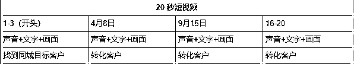
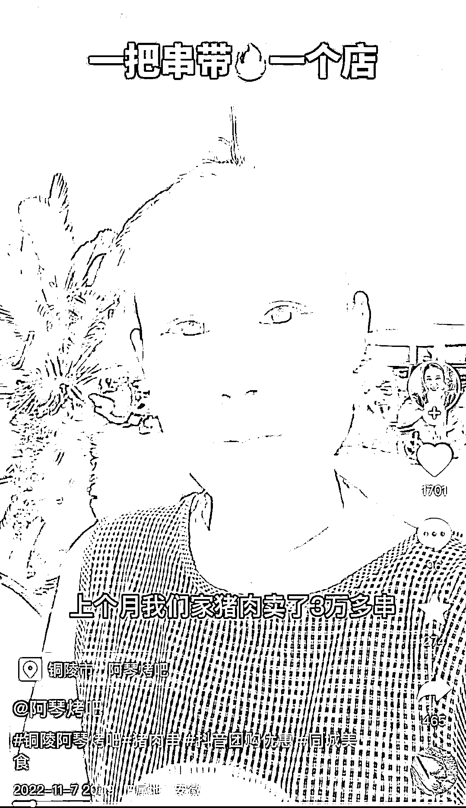
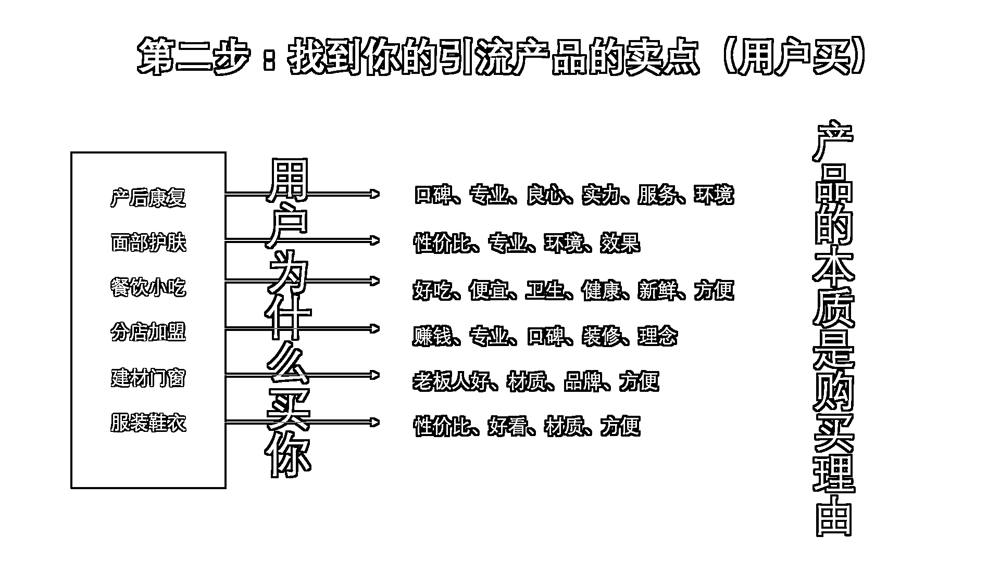
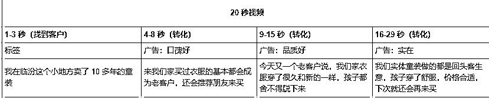
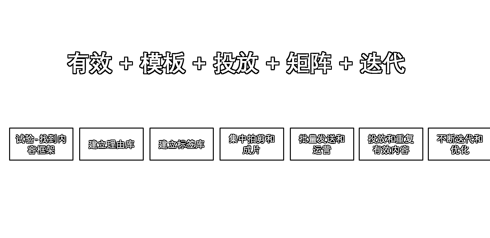

# 为什么实体店做抖音这么简单？

> 原文：[`www.yuque.com/for_lazy/thfiu8/rq7gypaanxformq0`](https://www.yuque.com/for_lazy/thfiu8/rq7gypaanxformq0)

<ne-h2 id="c42e08a2" data-lake-id="c42e08a2"><ne-heading-ext><ne-heading-anchor></ne-heading-anchor><ne-heading-fold></ne-heading-fold></ne-heading-ext><ne-heading-content><ne-text id="ue3bfbf20">(精华帖)(341 赞)为什么实体店做抖音这么简单？</ne-text></ne-heading-content></ne-h2> <ne-p id="u1dbfe7da" data-lake-id="u1dbfe7da"><ne-text id="ue0d9a97e">作者： 董十一</ne-text></ne-p> <ne-p id="ua5fdd28e" data-lake-id="ua5fdd28e"><ne-text id="u60ce3fae">日期：2023-07-05</ne-text></ne-p> <ne-p id="u268ace6b" data-lake-id="u268ace6b"><ne-text id="u2789b409">生财的小伙伴大家好，我是董十一，目前算是抖音实体商家培训的头部，靠的当然不是 40 万粉丝而是每个月的成交量。</ne-text></ne-p> <ne-p id="u79d7147f" data-lake-id="u79d7147f"><ne-text id="u89c7e772">所有做抖音想变现的人都应该从变现出发做抖音，这么简单的话，我说出来你肯定觉得可笑，直到你自己做抖音或进入这个行业，发现能够变现的少之又少，尤其是实体商家。</ne-text></ne-p> <ne-p id="uf48cc84b" data-lake-id="uf48cc84b"><ne-card data-card-name="image" data-card-type="inline" id="bPON6" data-event-boundary="card"></ne-card></ne-p> <ne-p id="u4a0b2f6c" data-lake-id="u4a0b2f6c"><ne-text id="u3e407524">今天给大家分享的是实体店抖音获客的实操核心。不谦虚的说，这个赛道有 30%的培训内容出自我这，如果你在任何地方看到过和这次分享相似的内容，如有雷同，抄的我的。</ne-text></ne-p> <ne-p id="ubc1abfcc" data-lake-id="ubc1abfcc"><ne-text id="u49bc286e">实在是，这套方法实在太过简单又太过有用，被我大量学员认证过的这套打法，哪怕你是一个完全不懂抖音，不会文案，不懂表达，拍剪很差的实体小老板，照着去执行不断实操，拿到结果的概率都非常大，连锁店就更不用说了，而且同样适用视频号，小红书和快手。</ne-text></ne-p> <ne-p id="u1c9353ce" data-lake-id="u1c9353ce"><ne-card data-card-name="image" data-card-type="inline" id="u8qTs" data-event-boundary="card"></ne-card></ne-p> <ne-p id="u88fe8283" data-lake-id="u88fe8283"><ne-text id="u9930ee7c">今天讲清楚 5 个关键词：</ne-text></ne-p> <ne-p id="u662e29b2" data-lake-id="u662e29b2"><ne-text id="u59a57c68" ne-bold="true">1.流量</ne-text></ne-p> <ne-p id="u6cc551ab" data-lake-id="u6cc551ab"><ne-text id="ue03cb07d" ne-bold="true">2.成交</ne-text></ne-p> <ne-p id="u6f7e063e" data-lake-id="u6f7e063e"><ne-text id="u4e05d294" ne-bold="true">3.标签</ne-text></ne-p> <ne-p id="u90443e54" data-lake-id="u90443e54"><ne-text id="u1eb27430" ne-bold="true">4.广告</ne-text></ne-p> <ne-p id="uf0b87ca9" data-lake-id="uf0b87ca9"><ne-text id="u87482a4d" ne-bold="true">5.模板</ne-text></ne-p> <ne-p id="ua6014c20" data-lake-id="ua6014c20"><ne-text id="u7846fd3f">我以亦仁的人格向你担保看完你会大呼过瘾。</ne-text></ne-p> <ne-p id="u2d143ea9" data-lake-id="u2d143ea9"><ne-text id="u2f4732cf">在真正讲干货之前先和大家同频一个理念，我觉得实体店做抖音简单是因为我觉得做任何事情都很简单。</ne-text></ne-p> <ne-p id="uf900fc5a" data-lake-id="uf900fc5a"><ne-text id="u2993c385">如果你和我一样不是一个天才，那么你在做抖音这件事情上的 80%甚至 90%的行为是无效的，无效的动作很多，所以我们只需要找到有效的动作，并且做对就行了能够在一件事情上拿到结果的方法其实都差不多：</ne-text></ne-p> <ne-p id="uf47633a8" data-lake-id="uf47633a8"><ne-text id="u24e81e96">找到做成这件事情的关键路径 1，2，3....，判断你找到的关键路径是正确的，想尽一切办法把关键路径做对，仅此而已。</ne-text></ne-p> <ne-p id="u33b34128" data-lake-id="u33b34128"><ne-text id="u4dfd74f9">每个人的时间精力都是有限的，加上大脑天生懒惰和逃避的天性，导致我们做事情想要成功的必须想尽一切办法追求一击必中。</ne-text></ne-p> <ne-p id="ua662c878" data-lake-id="ua662c878"><ne-text id="u01f16713">在错误的方向上不断提问，就是抖音小白，会在各个地方问的“能不能开蓝 V”“几点发视频”“一天多少条”“我这个赛道可以做抖音么”，无论多厉害的人回答这些问题，都对拿结果没有任何帮助，做抖音和做成抖音，完全是两种路径。</ne-text></ne-p> <ne-p id="ud2488084" data-lake-id="ud2488084"><ne-card data-card-name="image" data-card-type="inline" id="yF4P9" data-event-boundary="card"></ne-card></ne-p> <ne-p id="ucfc04ff7" data-lake-id="ucfc04ff7"><ne-text id="uea76fd5a">那么实体店做成抖音的有效路径是哪些？就两个：</ne-text></ne-p> <ne-p id="u22f6cea4" data-lake-id="u22f6cea4"><ne-text id="uab48a11a">（1）持续拍出能够带来客户的短视频</ne-text></ne-p> <ne-p id="u1fa567fd" data-lake-id="u1fa567fd"><ne-text id="u1ff00f1f">（2）持续做出能够带来客户的直播</ne-text></ne-p> <ne-p id="u9b8a1204" data-lake-id="u9b8a1204"><ne-text id="ua3a51515">投放和爆款不过是在有效的基础上做的增量，任何事情的第一步都是先完成闭环，在抖音上的闭环就等于从流量到成交。</ne-text></ne-p> <ne-p id="u099758b5" data-lake-id="u099758b5"><ne-card data-card-name="image" data-card-type="inline" id="TVCsd" data-event-boundary="card"></ne-card></ne-p> <ne-p id="ubda0a439" data-lake-id="ubda0a439"><ne-text id="u69c00da3">如果你想做成抖音，你必须具备做成抖音的认知。</ne-text></ne-p> <ne-p id="ubb85d76f" data-lake-id="ubb85d76f"><ne-text id="ud6671416">所谓的认知，是你对一件事情的看法究竟有多深刻和清晰，很多人在抖音上拿不到结果，除了实操不会，还有很多人困在了对抖音的理解，脑袋里没有的东西，是不会落到实际中的。</ne-text></ne-p> <ne-p id="u669cfc8e" data-lake-id="u669cfc8e"><ne-text id="udcedfdbd" ne-bold="true">对抖音的理解深刻和清晰 = 你知道抖音无非是渠道和内容。</ne-text></ne-p> <ne-p id="u6278c156" data-lake-id="u6278c156"><ne-text id="ud15d74ff">（1）渠道：无论你做的是什么生意，你想要的无非是通过渠道带来客户，以前发传单，现在通过视频和直播发传单，抖音/小红书/快手/视频号只是获客的渠道而已，没有什么秘密。</ne-text></ne-p> <ne-p id="u481c05d5" data-lake-id="u481c05d5"><ne-text id="ue4ab8dac">（2）内容：在抖音这些新媒体渠道上，你需要通过内容也就是视频/直播来获取客户。</ne-text></ne-p> <ne-p id="ud8a79e58" data-lake-id="ud8a79e58"><ne-text id="u84da4e0a">注意不是通过内容获取流量，你希望一个客户在刷到你之后点个赞，还是刷到你之后被你成交？傻子都会选后者。</ne-text></ne-p> <ne-p id="u630de14b" data-lake-id="u630de14b"><ne-text id="u3604f5df">如果你作为一个实体店现在做抖音还是看中流量本身的大小，我的建议是把账号注销掉，自己刷刷美女帅哥还养眼。</ne-text></ne-p> <ne-p id="u35ecbd08" data-lake-id="u35ecbd08"><ne-text id="u13a8e831" ne-bold="true">在抖音这个渠道上通过做内容的方式让流量变成客户</ne-text><ne-text id="u26ef63f4">，这句话就是实体店做抖音的一切。</ne-text></ne-p> <ne-p id="u9d199d59" data-lake-id="u9d199d59"><ne-text id="u7265c3dd" ne-bold="true">所以实体店做抖音的第一步：以终为始。</ne-text></ne-p> <ne-p id="u1f7ecad1" data-lake-id="u1f7ecad1"><ne-text id="u112fa050">太多人在出发之后会忘记了自己的初衷，人生和抖音没有任何区别，你只需要明确你的目的是成交，那么所谓的涨粉和流量无非是你成交的附属品，明确你的目标并且坚定执行，就这句话已经淘汰了很多人了。</ne-text></ne-p> <ne-p id="udd083cab" data-lake-id="udd083cab"><ne-text id="u08f46023">做抖音你说考验的是技巧，可能更多考验的是人性。</ne-text></ne-p> <ne-p id="ud7034b5e" data-lake-id="ud7034b5e"><ne-text id="u534a25ae" ne-bold="true">不要基于你知道什么去做抖音，基于你想要什么去做。</ne-text></ne-p> <ne-h1 id="3b879fe6" data-lake-id="3b879fe6"><ne-heading-ext><ne-heading-anchor></ne-heading-anchor><ne-heading-fold></ne-heading-fold></ne-heading-ext><ne-heading-content><ne-text id="u71f1be4a">一、流量和成交</ne-text></ne-heading-content></ne-h1> <ne-p id="uf6089988" data-lake-id="uf6089988"><ne-text id="u753cc494">我们从流量开始讲起。</ne-text></ne-p> <ne-p id="u047039a3" data-lake-id="u047039a3"><ne-text id="u6fce42b6">我真的想把这个词从实体老板的大脑里面摘出去，没有流量怎么会有成交，这句话误导了所有小白，大家默认有流量就会有成交，流量越大成交越好。</ne-text></ne-p> <ne-p id="u90fa1171" data-lake-id="u90fa1171"><ne-text id="uefe12fd9">如果你稍微了解一点流量，就明白流量的大小从来都和变现没有关系，抖音上无数个流量大成交差的账号。</ne-text></ne-p> <ne-p id="u62c5b78d" data-lake-id="u62c5b78d"><ne-text id="u99ca7eab">和变现有关系的只有流量本身的想法，我的天，这简直让我百思不得解，真正为你花钱的是活生生的人，所谓的流量无非是一个人刷到了你的视频或者直播，刷到你就会为你买单这种事情根本不存在。</ne-text></ne-p> <ne-p id="u440ecef3" data-lake-id="u440ecef3"><ne-text id="u8f21677a">为什么我的内容没有人下单？</ne-text></ne-p> <ne-p id="u1d65208d" data-lake-id="u1d65208d"><ne-text id="uda733b92">因为你的内容没有让流量产生为你下单的想法，所以实体店做抖音的一步，不是先做流量，而是从成交出发做流量。</ne-text></ne-p> <ne-p id="u2f1bb5c7" data-lake-id="u2f1bb5c7"><ne-text id="u7c80f985">你要让你的流量看到你视频/直播之后，会买你的窗帘，水果，烧烤，家具，而不是纠结流量本身的大小和互动，对实体店来说，最没用的东西，就是所谓的数据推流。</ne-text></ne-p> <ne-p id="ucf006b54" data-lake-id="ucf006b54"><ne-text id="u5c4169c0">当然，我们并不是不做流量，只是爆款和热门永远不是实体老板应该追寻的东西，做了十几年的实体给你再多的时间你能做出几条爆款？就算你好不容易做出来了？能变现几块钱？</ne-text></ne-p> <ne-p id="u2035f56f" data-lake-id="u2035f56f"><ne-text id="ufb68daa6" ne-bold="true">为了流量去做的流量得到的就是流量，为了成交去做流量，得到的才是成交。</ne-text></ne-p> <ne-p id="u9aed1b30" data-lake-id="u9aed1b30"><ne-text id="uf3bf7624">如果成交是你做抖音的唯一目标，那么先有流量后有成交，对实体店来说就是一句屁话。</ne-text></ne-p> <ne-p id="u95638ec2" data-lake-id="u95638ec2"><ne-text id="u7e9a4a80">你在抖音上看到的绝大部分流量大变现差的账号，除了各种原因外，一个核心点就是流量和粉丝永远属于抖音，而不是你。</ne-text></ne-p> <ne-p id="uf5719a4e" data-lake-id="uf5719a4e"><ne-text id="u866d94da">为什么抖音上不会诞生超级头部？</ne-text></ne-p> <ne-p id="uff5874e7" data-lake-id="uff5874e7"><ne-text id="u13b754dc">辛巴和李佳琦所有抖音卖货的主播加起来都不够打，抖音的去中心化算法决定了不管你是谁，你的视频除了因为粉丝给的基础流量之外，所有的竞争都是公平的。</ne-text></ne-p> <ne-p id="u8dd2fd7b" data-lake-id="u8dd2fd7b"><ne-text id="ud898f4a5">你要默认流量和粉丝今天会看你，明天不会，所以实体店做抖音的核心是：</ne-text><ne-text id="u9162f3c2" ne-bold="true">让流量和成交同时发生。</ne-text></ne-p> <ne-p id="u2a81064a" data-lake-id="u2a81064a"><ne-card data-card-name="image" data-card-type="inline" id="EGTUe" data-event-boundary="card"></ne-card></ne-p> <ne-p id="u65ac2524" data-lake-id="u65ac2524"><ne-text id="u53360088">你必须让流量看到你的视频和直播的这一刻被你成交，让他们停留之后直接私信，团单，外卖或者到店，这一刻不买，就默认他们永远不会买，你还会在那拍什么剧情做什么人设和个人 IP 么？</ne-text></ne-p> <ne-p id="u93ab8632" data-lake-id="u93ab8632"><ne-text id="ucc5a3ac7">那点三脚猫内容的引流效果和一个水果店老板说新店开业打五折的效果比起来简直不够看。</ne-text></ne-p> <ne-p id="uafb8582e" data-lake-id="uafb8582e"><ne-text id="ufb00c220">对实体抖音号来说，粉丝量价值微乎其微。</ne-text></ne-p> <ne-p id="uefa58191" data-lake-id="uefa58191"><ne-text id="uceb36c5c" ne-bold="true">总结一下，你的目的是为了获取客户，所以从成交出发做流量，流量属于平台，所以让流量和成交同时发生。</ne-text></ne-p> <ne-h1 id="81d77408" data-lake-id="81d77408"><ne-heading-ext><ne-heading-anchor></ne-heading-anchor><ne-heading-fold></ne-heading-fold></ne-heading-ext><ne-heading-content><ne-text id="ubc54f6a1">二、标签</ne-text></ne-heading-content></ne-h1> <ne-p id="ud82449bf" data-lake-id="ud82449bf"><ne-text id="u6e4f7852">那么究竟怎么做才能让流量变成客户？详细的步骤是什么？每一步究竟怎么做？</ne-text></ne-p> <ne-p id="ud669777f" data-lake-id="ud669777f"><ne-text id="ucdf1a006">我们先来第一步，让你从 0 到 1 学会拍出一条能够带来客户的短视频。</ne-text></ne-p> <ne-p id="u32082d13" data-lake-id="u32082d13"><ne-text id="u323d43ea">假如我们在某个地方开了一家童装店，万事俱备只需要客户，我们注册了抖音/快手/视频号，摩拳擦掌准备大干一场，然后呢？</ne-text></ne-p> <ne-p id="ub1d36343" data-lake-id="ub1d36343"><ne-text id="u8f87bfc4">然后就两眼四顾心茫然，让我们简单点，回到商业的本质，做生意无非就是交易，不断的交易造就了市场，童装交易是怎么发生的？</ne-text></ne-p> <ne-p id="u05a4d250" data-lake-id="u05a4d250"><ne-text id="u15dffe21">今天有 1000 个流量经过你的店铺，进来了 100 个想买童装的人，最终成交了 10 个。找到更多的目标客户，成交更多的目标客户，就是交易的核心，那么做抖音成交无非是通过内容：</ne-text></ne-p> <ne-p id="u535984a3" data-lake-id="u535984a3"><ne-text id="u490f3ee5">（1）找到同城的目标客户</ne-text></ne-p> <ne-p id="u7b826c69" data-lake-id="u7b826c69"><ne-text id="uf5b82fb1">（2）转化找到的同城客户</ne-text></ne-p> <ne-p id="u067f92b5" data-lake-id="u067f92b5"><ne-text id="u5f689f48">第一步：通过内容做流量找到属于你的同城目标客户，而不是纠结流量本身的大小。</ne-text></ne-p> <ne-p id="u1f7f921f" data-lake-id="u1f7f921f"><ne-text id="u6639409c">那么究竟什么是内容：一条 20 秒的短视频，分成几个段落，声音+文字配上一段画面组成的</ne-text></ne-p> <ne-p id="uc4e7c5de" data-lake-id="uc4e7c5de"><ne-card data-card-name="image" data-card-type="inline" id="O3Z6B" data-event-boundary="card"></ne-card></ne-p> <ne-p id="u1e7448b1" data-lake-id="u1e7448b1"><ne-text id="u70762505">如果你在临汾卖童装，你发了一条 20 秒的短视频，那么它的开头应该是这样：</ne-text></ne-p> <ne-p id="u47f58f8f" data-lake-id="u47f58f8f"><ne-text id="u12cfc929">我在临汾（地方）卖了十多年的童装（行业）。</ne-text></ne-p> <ne-p id="u8f055263" data-lake-id="u8f055263"><ne-text id="u1df355f7">没错，就是这么简单，你只需要在短视频的开头用上地域+行业的关键词，不断的造句，配上画面就是短视频的前几秒。</ne-text></ne-p> <ne-p id="uf4e8bdf2" data-lake-id="uf4e8bdf2"><ne-text id="u4bd599e3">你把一条 20 秒的短视频分成 4 个几秒钟，1-3s，4-9s，10-15s，16-20s，那么你的前 3 秒的核心目的只有一个，帮你找到临汾会买童装的人，而不是把流量做大。所以你的短视频开头都这么说：</ne-text></ne-p> <ne-p id="u187bd872" data-lake-id="u187bd872"><ne-text id="ud4ba17b9" style="color: rgb(166, 166, 166);">很多临汾的姐妹刷到我的视频来找我买衣服；</ne-text></ne-p> <ne-p id="u13d189b9" data-lake-id="u13d189b9"><ne-text id="uabf0a1de" style="color: rgb(166, 166, 166);">为什么我在临汾开的这家童装店每天有那么多客户；</ne-text></ne-p> <ne-p id="uec707c5a" data-lake-id="uec707c5a"><ne-text id="u49cb7bfa" style="color: rgb(166, 166, 166);">因为价格的问题 90%临汾的姐妹们不去商场更愿意来我这样的街边店买衣服；</ne-text></ne-p> <ne-p id="ub1e5d511" data-lake-id="ub1e5d511"><ne-text id="ub9771592" style="color: rgb(166, 166, 166);">是谁说在临汾找不到一家性价比高的童装店的；</ne-text></ne-p> <ne-p id="ue83912e8" data-lake-id="ue83912e8"><ne-text id="u8ce71f7e">所有的这些话，本质上都是一个逻辑，让抖音给这条视频临汾的童装客户，让临汾的童装客户刷到这条视频，而且停留。</ne-text></ne-p> <ne-p id="u8c0bd6c2" data-lake-id="u8c0bd6c2"><ne-text id="ub88a7162">这个方法，我们叫做打标签，开头的标签打的越好，流量越大，客户越精准，只有这一批附近有需求的人，才是你真正需要的流量，不去管流量的大小，而是通过流量找到属于你的目标客户。</ne-text></ne-p> <ne-p id="uffde1aa4" data-lake-id="uffde1aa4"><ne-text id="uaaf79461">那么如果我是一家烧烤店呢？我怎么打标签。把临汾变成铜陵，把衣服变成烧烤，就变成了：</ne-text></ne-p> <ne-p id="uce231ee4" data-lake-id="uce231ee4"><ne-text id="ua75f553a" style="color: rgb(166, 166, 166);">最近很多铜陵的朋友刷到我的视频来我们家吃烧烤；</ne-text></ne-p> <ne-p id="u783fc399" data-lake-id="u783fc399"><ne-text id="u48c63f52" style="color: rgb(166, 166, 166);">上个月我们的猪肉卖了 3 万多串；</ne-text></ne-p> <ne-p id="u6098c505" data-lake-id="u6098c505"><ne-card data-card-name="image" data-card-type="inline" id="CON37" data-event-boundary="card"></ne-card></ne-p> <ne-p id="u298dc924" data-lake-id="u298dc924"><ne-text id="uda260582">这句话里面为什么没有带上铜陵市呢？因为视频的左下角 POI 地址带了，所以打标签你可以是用文字，也可以是技术和画面。</ne-text></ne-p> <ne-p id="u6897b6eb" data-lake-id="u6897b6eb"><ne-text id="u065fba5a">底层只有一个：让你们家附近会买单的人刷到你并且留下来。</ne-text></ne-p> <ne-p id="u56427d4f" data-lake-id="u56427d4f"><ne-text id="uc91114fe">美容呢？家具呢？水果呢？本质上没有任何区别，不管你卖的是什么，抖音只是获客渠道而已，只是这个渠道需要通过内容去获取客户，获取客户的第一步都是通过内容找到本身就会买单的目标客户，每个行业都是这样，每个时代也都是这样。</ne-text></ne-p> <ne-p id="u97008e31" data-lake-id="u97008e31"><ne-text id="ue066fda0">500 年前你卖酒也是找到那批本身就会喝酒的人，商业的背后是人性，人性的背后是心理，心理的背后是诱导，用内容做诱导，诱导平台，诱导用户，让你想要的的人被你用内容抓取过来。</ne-text></ne-p> <ne-h1 id="bc140a15" data-lake-id="bc140a15"><ne-heading-ext><ne-heading-anchor></ne-heading-anchor><ne-heading-fold></ne-heading-fold></ne-heading-ext><ne-heading-content><ne-text id="ub512afeb">三、广告</ne-text></ne-heading-content></ne-h1> <ne-p id="ucb0b4359" data-lake-id="ucb0b4359"><ne-text id="ub0e0fc94">当你通过视频流量帮你找到了 100/1000 个附近会买单的人，第二步是什么？转化。</ne-text></ne-p> <ne-p id="u16e135d8" data-lake-id="u16e135d8"><ne-text id="u0e2a2516">让这批人里面尽可能多的最终来买，转化靠的是什么？还记得你为什么去买现在的手机，鞋子，房子么？当然是因为你觉得好才会去买，所谓的好，就是用户心目中的购买理由，也就是卖点。</ne-text></ne-p> <ne-p id="u92641d49" data-lake-id="u92641d49"><ne-card data-card-name="image" data-card-type="inline" id="Mz7Cg" data-event-boundary="card"></ne-card></ne-p> <ne-p id="ucee61cb1" data-lake-id="ucee61cb1"><ne-text id="ub0d6fa7b">在图片的主标题中你看到了引流品这三个字，也就是我们常说的团单，很多人会问如果我没有团单的实体店怎么做？</ne-text></ne-p> <ne-p id="u124cabe9" data-lake-id="u124cabe9"><ne-text id="uc8833a0a">没有任何区别，团单是引流客户到店的产品，那么只要你有引流品，可以是团单，小风车，当然可以是你的店铺。假如你卖童装，你的引流产品可以是，某款具体的童装，也可以是你们这家店。</ne-text></ne-p> <ne-p id="u6f380be7" data-lake-id="u6f380be7"><ne-text id="u3e154351" ne-bold="true">当你确定引流品之后，你需要做的，是找到你的引流品的卖点。</ne-text></ne-p> <ne-p id="udebc6fbc" data-lake-id="udebc6fbc"><ne-text id="u998b7371">当 100 个临汾附近会买童装的人留在了你的短视频上，她看完之后，产生了你们家的童装，品质好，款式好，性价比高，老板实在...的购买理由，最终有 10 个人找你下单。</ne-text></ne-p> <ne-p id="uadfd8cb1" data-lake-id="uadfd8cb1"><ne-text id="u44e99c26">做抖音的目的是成交，成交的核心是给目标客户打产品的广告，想要把东西卖出去，你需要把产品变成广告，也就是提炼你的产品卖点：</ne-text></ne-p> <ne-p id="u28eb8482" data-lake-id="u28eb8482"><ne-text id="u3df40ca0">性价比高、品质好、服务号，实在，口碑好。</ne-text></ne-p> <ne-p id="ubdbf30b8" data-lake-id="ubdbf30b8"><ne-text id="u3f02ebcd">这一步，</ne-text><ne-text id="u210822ac" ne-bold="true">叫做产品广告化，</ne-text><ne-text id="u0b5fd448">但是这里有个问题，打广告，抖音是和用户是不会理你的，他们喜欢的是内容，但是内容本身带来的是流量，广告才会带来成交，我们就需要用做内容的方式去打广告。</ne-text></ne-p> <ne-p id="u148b3745" data-lake-id="u148b3745"><ne-text id="u0f5b2e7d">打广告 = 我们家口碑好</ne-text></ne-p> <ne-p id="u52415df1" data-lake-id="u52415df1"><ne-text id="u339049cc">把广告变成内容 = 来我们家买过童装的姐妹都变成了老朋友，还会推荐新朋友来买。两句话，就是你的 1-3 秒的开头之后的 4-7 秒，再配上画面，就是短视频的一个段落，接下来，你只需要把其他广告变成内容。</ne-text></ne-p> <ne-p id="u91939950" data-lake-id="u91939950"><ne-text id="u03b99a84" style="color: rgb(166, 166, 166);">口碑好：来我们家买过童装的基本都会成为老客户，还会推荐朋友来买</ne-text></ne-p> <ne-p id="u38e7dea9" data-lake-id="u38e7dea9"><ne-text id="uae88f258" style="color: rgb(166, 166, 166);">品质好：今天又一个老客户说，来我们家买的童装穿了很久和新的一样，孩子穿上不愿意脱下来</ne-text></ne-p> <ne-p id="u4ab18b53" data-lake-id="u4ab18b53"><ne-text id="u31e6e3dc" style="color: rgb(166, 166, 166);">性价比高：商场买的上千块的和我们的原料其实差不多，给你对比看一下</ne-text></ne-p> <ne-p id="ud0c50e2e" data-lake-id="ud0c50e2e"><ne-text id="u635fe16f" style="color: rgb(166, 166, 166);">实在：我们实体卖童装做的都是回头客生意，孩子穿着舒服，价格合适，下次就还会再来买</ne-text></ne-p> <ne-p id="u73529559" data-lake-id="u73529559"><ne-text id="ua4dd2801">接下来，你把标签和广告放在一起，就变成了一条完整的视频，它既能带来目标客户，又能转化目标客户</ne-text></ne-p> <ne-p id="u39c482a7" data-lake-id="u39c482a7"><ne-text id="u6052f938">视频，所以一条视频就变成了：</ne-text></ne-p> <ne-p id="u4d83bf4c" data-lake-id="u4d83bf4c"><ne-card data-card-name="image" data-card-type="inline" id="JMk6j" data-event-boundary="card"></ne-card></ne-p> <ne-p id="ucdc731c9" data-lake-id="ucdc731c9"><ne-text id="u8175b797" ne-bold="true">这一步，就叫广告内容化。</ne-text></ne-p> <ne-p id="u09cc2f3a" data-lake-id="u09cc2f3a"><ne-text id="u00028fe7">广告带来成交，内容带来流量。有人看的同时有人买。我们再总结下：</ne-text></ne-p> <ne-p id="u937ef067" data-lake-id="u937ef067"><ne-text id="u1553292e" ne-bold="true">（1）别去在意流量的大小，要从流量里面找到足够多的目标客户</ne-text></ne-p> <ne-p id="u460766d5" data-lake-id="u460766d5"><ne-text id="u8c38f774" ne-bold="true">（2）通过地域+行业标签找到目标客户</ne-text></ne-p> <ne-p id="u11f90f0c" data-lake-id="u11f90f0c"><ne-text id="u9fe395de" ne-bold="true">（3）把产品变成广告再把广告变成内容转化目标客户</ne-text></ne-p> <ne-p id="u82a8b24c" data-lake-id="u82a8b24c"><ne-text id="u8cf624b7">好到这一步了，就必须提到另外一个概念，叫做概率。其实不管抖音也好人生也好，都是一道概率题，我们要做的是尽可能提升做成的概率，怎么做呢？怎么才能让一个实体店做抖音成功的概率无限的趋近于 100%呢？</ne-text></ne-p> <ne-p id="u8cff62e3" data-lake-id="u8cff62e3"><ne-text id="ud8b5b586" ne-bold="true">在有效的基础上堆数量</ne-text></ne-p> <ne-p id="ub73c17cb" data-lake-id="ub73c17cb"><ne-text id="ub2f51f80">大力出奇迹这句话不是空谈，但是如果你发的内容素材本身是没有效果的，就像做投放一样，素材不行，你投放技巧再好投再多钱都没有用。</ne-text></ne-p> <ne-h1 id="2a19da41" data-lake-id="2a19da41"><ne-heading-ext><ne-heading-anchor></ne-heading-anchor><ne-heading-fold></ne-heading-fold></ne-heading-ext><ne-heading-content><ne-text id="u055dc0b2">四、模板</ne-text></ne-heading-content></ne-h1> <ne-p id="u7a716fab" data-lake-id="u7a716fab"><ne-text id="u7f3b58f1">可是作为一个实体店，你让我一个星期拍几条视频都已经很难了，你让我多发，一天 3 条，而且还要有效果，太难了。</ne-text></ne-p> <ne-p id="u2a0a1ca0" data-lake-id="u2a0a1ca0"><ne-text id="ucdd9e853">但是接下来的这个脱胎于好物混剪的矩阵技巧，可以让你轻松的一个星期拍出 100 条有效的短视频，我们接下来讲：</ne-text><ne-text id="u58f5d3a0" ne-bold="true">模板。</ne-text></ne-p> <ne-p id="u997806e1" data-lake-id="u997806e1"><ne-text id="u5ce191ed">接着上面的表格，当我拍出一条有效的内容之后，我需要堆数量来提升做成的概率，100 条视频，需要 100 个开头文案，这也太难了，但如果是这么做：</ne-text></ne-p> <ne-p id="u1b273d8b" data-lake-id="u1b273d8b"><ne-text id="u7dd32eba">我在临汾卖了 10 多年的童装，抽取这句话里面的地域关键词：临汾；行业关键词：童装。我们其他视频的开头这么说：</ne-text></ne-p> <ne-p id="ue1af4e3d" data-lake-id="ue1af4e3d"><ne-text id="u2e2b7ace" style="color: rgb(166, 166, 166);">这两天很多临汾的宝妈通过抖音来我们家买童装；</ne-text></ne-p> <ne-p id="uaf32f2f5" data-lake-id="uaf32f2f5"><ne-text id="u25d1a769" style="color: rgb(166, 166, 166);">上个月这款童装我们在临汾的小店卖了上百件；</ne-text></ne-p> <ne-p id="uc3363ee4" data-lake-id="uc3363ee4"><ne-text id="u2b1a810b" style="color: rgb(166, 166, 166);">这两天来我们临汾店给孩子买这款衣服的都要排队了；</ne-text></ne-p> <ne-p id="uc8530fa4" data-lake-id="uc8530fa4"><ne-text id="ufd43010f">然后把这些标签，写到一个表格里，形成标签库：</ne-text></ne-p> <ne-p id="uc4899b3d" data-lake-id="uc4899b3d"><ne-card data-card-name="image" data-card-type="inline" id="WsAXm" data-event-boundary="card"></ne-card></ne-p> <ne-p id="u14072196" data-lake-id="u14072196"><ne-text id="u2b1d05fa">这是一个开头的标签库，那么转化呢？</ne-text></ne-p> <ne-p id="udd099ad3" data-lake-id="udd099ad3"><ne-text id="u55cf0a2d">前面说的打广告也就是给目标客户买单的理由，我们再按照同样的方式做一个理由库：</ne-text></ne-p> <ne-p id="u843cbc38" data-lake-id="u843cbc38"><ne-card data-card-name="image" data-card-type="inline" id="u6KIH" data-event-boundary="card"></ne-card></ne-p> <ne-p id="uc7abcbd0" data-lake-id="uc7abcbd0"><ne-text id="udfb4885f">把标签和理由，组合在一起：</ne-text></ne-p> <ne-p id="u0b1b5b3b" data-lake-id="u0b1b5b3b"><ne-card data-card-name="image" data-card-type="inline" id="TF5MS" data-event-boundary="card"></ne-card></ne-p> <ne-p id="u326c71b4" data-lake-id="u326c71b4"><ne-text id="u912c3bef">当你拍视频的时候，只需要从里面提取几句话，比如：</ne-text></ne-p> <ne-p id="u909c8d6e" data-lake-id="u909c8d6e"><ne-text id="ud1799b31" ne-bold="true">标签 1 + 实在理由 1+口碑理由 1+品质理由 1</ne-text></ne-p> <ne-p id="u2418475e" data-lake-id="u2418475e"><ne-text id="u95b8c794">我在临汾做了十多年的童装（打标签找到临汾附近想买童装的人），其实实体店卖童装，做的就是良心生意（实在），买过我们家童装的几乎没有差评（口碑好），好的衣服孩子穿上是会有感觉的，来我们家试衣服的小孩都舍不得脱下来（品质好）。</ne-text></ne-p> <ne-p id="u9efaf863" data-lake-id="u9efaf863"><ne-text id="udbf8a10a">把这条视频稍微改一下字，翻拍 10 遍，就是 10 条视频，那么剩下的 90 条呢？</ne-text></ne-p> <ne-p id="ub625e529" data-lake-id="ub625e529"><ne-text id="ufd61e50c">排列组合：</ne-text></ne-p> <ne-p id="u2a4e6b32" data-lake-id="u2a4e6b32"><ne-card data-card-name="image" data-card-type="inline" id="SsC30" data-event-boundary="card"></ne-card></ne-p> <ne-p id="u73e32070" data-lake-id="u73e32070"><ne-text id="uf242edb4">1+1+1+1 = 1 条视频翻拍 10 遍 = 10 条短视频</ne-text></ne-p> <ne-p id="u5e6620f7" data-lake-id="u5e6620f7"><ne-text id="u95f57510">1+2+1+1 = 1 条视频翻拍 10 遍 = 10 条短视频</ne-text></ne-p> <ne-p id="ucaf242bd" data-lake-id="ucaf242bd"><ne-text id="u2b23f78e">2+1+1+1 = 1 条视频翻拍 10 遍 = 10 条短视频</ne-text></ne-p> <ne-p id="udcbb58bc" data-lake-id="udcbb58bc"><ne-text id="uc98d7ecc">........</ne-text></ne-p> <ne-p id="u3e8a8a62" data-lake-id="u3e8a8a62"><ne-text id="u35cc6778">到了这里，你会发现，以后你想拍一条带来客户的短视频，只需要简单的从库里面拿出东西来组合，标签库 + 理由库，形成了无数条能够带来客户的短视频。</ne-text></ne-p> <ne-p id="u3ce0de0f" data-lake-id="u3ce0de0f"><ne-text id="u74046e33">接着就开始运营你的账号，有了内容，其他的就是技巧方面的事儿。</ne-text></ne-p> <ne-p id="u5563ddf3" data-lake-id="u5563ddf3"><ne-card data-card-name="image" data-card-type="inline" id="PEDb8" data-event-boundary="card"></ne-card></ne-p> <ne-p id="u775ba23f" data-lake-id="u775ba23f"><ne-text id="u0cf3e32f">一个星期你们家附近想要买这类东西的人几乎都会刷到你的视频，所以这套打法用在三四线城市几乎无敌，你可以简单的吃到抖音至少 2 年的红利。</ne-text></ne-p> <ne-p id="u8aa03250" data-lake-id="u8aa03250"><ne-text id="uc1ec9d7e">那两年之后呢？当整个市场都刷过我的视频，同行都在模仿我了？</ne-text></ne-p> <ne-p id="u7e8bbdf8" data-lake-id="u7e8bbdf8"><ne-text id="ufaf0f8d8">我怎么再度突出重围，简单，我们两年之后生财再见。</ne-text></ne-p> <ne-hole id="u15521685" data-lake-id="u15521685"><ne-card data-card-name="hr" data-card-type="block" id="CGQtt" data-event-boundary="card"><ne-p id="ud9b8167b" data-lake-id="ud9b8167b"><ne-text id="u62e26347">评论区：</ne-text></ne-p> <ne-p id="ue21a1d51" data-lake-id="ue21a1d51"><ne-text id="ue93a586d">朱明晔 : 请问这套打法适合本地的代理记账/企业服务公司吗？</ne-text> <ne-text id="u89a75f32">楚川 : 我做内容就是跟董老师学的，大家可以参考一下</ne-text> <ne-text id="ue35f6b97">许义 : 这套思维价值连城，做小红书也是一样，“连接即交易”，流量就是供需的连接机会。热闹虽好，我要生意。</ne-text> <ne-text id="u6e3dc860">子鹏 : 十一老师都出来了[强]</ne-text> <ne-text id="u4320c488">周彦充 : 专业级的，牛逼[强][强][强]</ne-text> <ne-text id="uf52e2aca">郑玉斌。 : 适合的。现在财税公司做好抖音的还是少数</ne-text> <ne-text id="u80d85673">碧海云天 : 感谢老师分享，思路开阔了许多</ne-text> <ne-text id="ud33c6677">伟业 : 董十一大佬</ne-text></ne-p></ne-card></ne-hole>