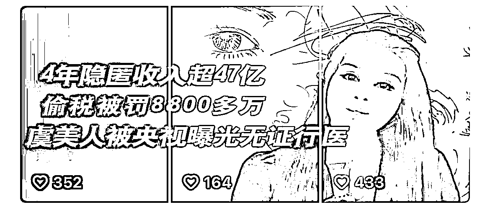
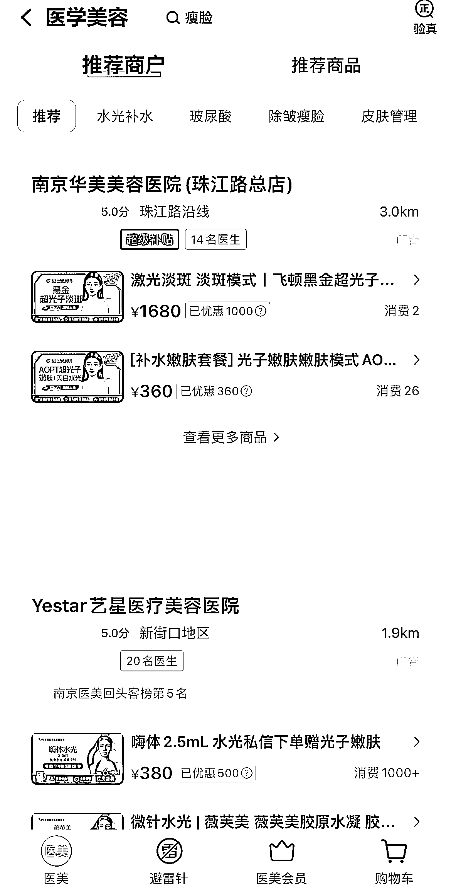
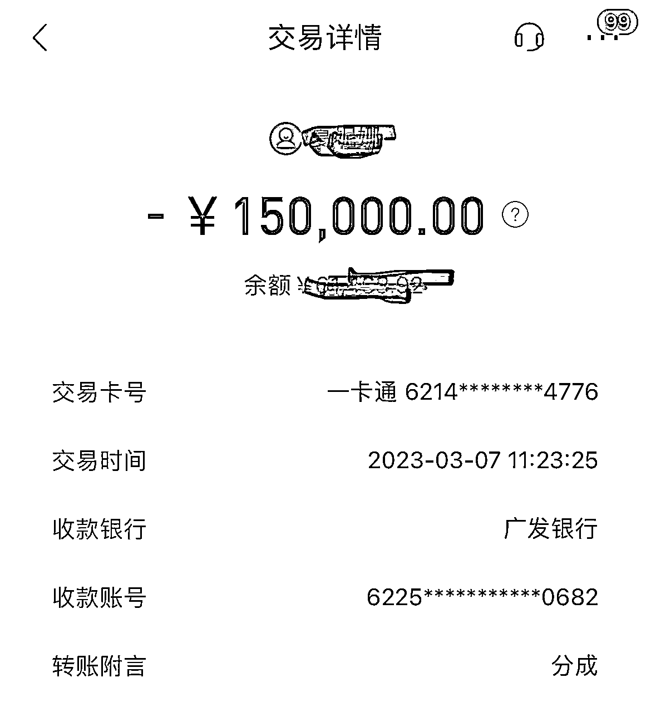
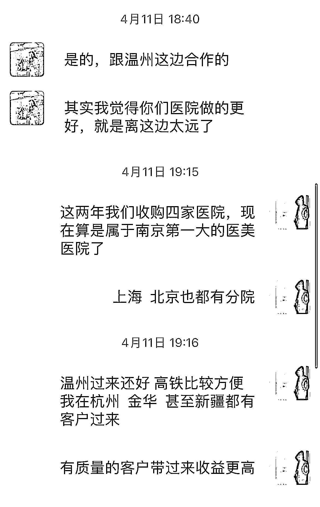
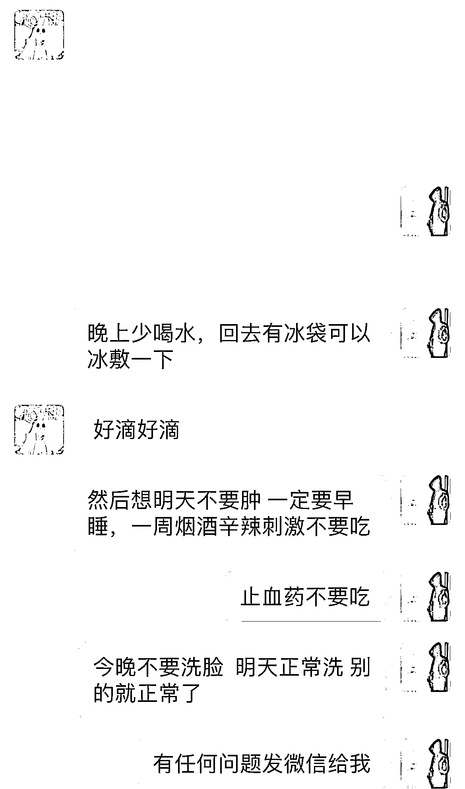

# 挖掘传统渠道的客源，在二三线城市做医美成功变现 100-150W+

> 原文：[`www.yuque.com/for_lazy/thfiu8/lgby6g1s5yzq86xe`](https://www.yuque.com/for_lazy/thfiu8/lgby6g1s5yzq86xe)

<ne-h2 id="bc15a819" data-lake-id="bc15a819"><ne-heading-ext><ne-heading-anchor></ne-heading-anchor><ne-heading-fold></ne-heading-fold></ne-heading-ext><ne-heading-content><ne-text id="u38aa2c54">(精华帖)(113 赞)挖掘传统渠道的客源，在二三线城市做医美成功变现 100-150W+</ne-text></ne-heading-content></ne-h2> <ne-p id="ud8383803" data-lake-id="ud8383803"><ne-text id="uf5264f3c">作者： 司尘</ne-text></ne-p> <ne-p id="ue50d3bf1" data-lake-id="ue50d3bf1"><ne-text id="ue91d672d">日期：2023-07-04</ne-text></ne-p> <ne-p id="u8714283f" data-lake-id="u8714283f"><ne-text id="u4ae42cf2">大家好，我是司尘，一个从事医疗整形行业七年的老手，目前在一家大型医疗整形医院任职大客户总监以及自己有个市场小团队，一年业绩在 1000W 左右。</ne-text></ne-p> <ne-p id="uaed0018c" data-lake-id="uaed0018c"><ne-text id="u424d8973">医美这个类目比较敏感，做过的人都知道，线上引流很难，但把在一二线城市做得烂的一些传统线下获客的方式拿去三四线城市去玩，也能像我这样赚个 100W+。</ne-text></ne-p> <ne-p id="u71f3b929" data-lake-id="u71f3b929"><ne-text id="u27d4a51d">下面，和大家聊一聊我是怎么通过传统线下获客的方式在医美这行赚到钱的，希望能帮助到你。</ne-text></ne-p> <ne-h1 id="22150a96" data-lake-id="22150a96"><ne-heading-ext><ne-heading-anchor></ne-heading-anchor><ne-heading-fold></ne-heading-fold></ne-heading-ext><ne-heading-content><ne-text id="ued522954">一、行业介绍</ne-text></ne-heading-content></ne-h1> <ne-p id="ud2202dd1" data-lake-id="ud2202dd1"><ne-text id="uadaa2c8e">医疗美容顾名思义就是通过医疗手段让一个人的容貌或者身材发生变化，爱美之心人皆有之，特别现在这个社会是个看脸的社会，有需求就有市场。</ne-text></ne-p> <ne-p id="u221cc1cd" data-lake-id="u221cc1cd"><ne-text id="uffd2012b">2022 年，中国医美项目渗透率为 4.5%，增速很快，但较日本 11.3%、美国 17.2%和韩国 22%的数据，仍有很大的提升空间，有空间说明就有钱赚。</ne-text></ne-p> <ne-p id="u7ad59249" data-lake-id="u7ad59249"><ne-text id="ue8b2cfaa">根据新氧数据，2022 年，中国医美市场规模接近 2300 亿，而消费者规模约 2354 万人，其中高速增长的微整（轻医美）已取得压倒性优势，成为机构营收的大功臣。</ne-text></ne-p> <ne-p id="uf0d92bbc" data-lake-id="uf0d92bbc"><ne-text id="uce579cbb">这个轻医美我后面会详细的说。</ne-text></ne-p> <ne-p id="u890c2bbf" data-lake-id="u890c2bbf"><ne-card data-card-name="image" data-card-type="inline" id="IqLRL" data-event-boundary="card"></ne-card></ne-p> <ne-p id="ue5f9cd42" data-lake-id="ue5f9cd42"><ne-text id="u4060ed72">很多人对医美的第一印象就是它是暴利行业，如果放在以前行业规范以及政策没有约束这么强的情况下的确是这样，六七年前我的周边有不少人靠着胆子大，心思活络哪怕没有好的学历打擦边球一年几百上千万收入大有人在。</ne-text></ne-p> <ne-p id="ua27b7050" data-lake-id="ua27b7050"><ne-text id="u213d371d">这种擦边现在是违法的就不叙述了。</ne-text></ne-p> <ne-p id="u0fdf0656" data-lake-id="u0fdf0656"><ne-text id="u855bebdc">医美是个专业要求度比较高的行业，下面给各位圈友简单的概括下。主要分为五个品类：</ne-text></ne-p> <ne-p id="u6340d9d3" data-lake-id="u6340d9d3"><ne-text id="u2f856144">微整（轻医美），手术，仪器，口腔，植发。</ne-text></ne-p> <ne-p id="ue7b60bb4" data-lake-id="ue7b60bb4"><ne-text id="uf4e227ef">微整主要以打针为主，大家所熟知的玻尿酸注射，瘦脸针，除皱针这些都属于微整范畴。价格其实浮动很大，几百也能打一针，几万甚至几十万也能打一针，要看客户的质量以及医院的模式水平。</ne-text></ne-p> <ne-p id="u5f44701b" data-lake-id="u5f44701b"><ne-text id="ueef6cf46">现在很多赚钱的医美医院主做的就是这个品类。</ne-text></ne-p> <ne-p id="u2228146e" data-lake-id="u2228146e"><ne-text id="u1d45538a">优势在于价格不低，风险小，效果呈现快，返单率强，我自己主做的也是这个品类。</ne-text></ne-p> <ne-p id="u11fc17bf" data-lake-id="u11fc17bf"><ne-text id="u40919ef7">加上现在国人多医美的接受度高了很多，很多明星网红也都会去打针，而大都接触医美的人开始就是微整入门。</ne-text></ne-p> <ne-p id="u37f8142c" data-lake-id="u37f8142c"><ne-card data-card-name="image" data-card-type="inline" id="rDkTj" data-event-boundary="card"></ne-card></ne-p> <ne-p id="uca27911c" data-lake-id="uca27911c"><ne-text id="u9a57b9ac">我手上有个总消费在两千多万的大客户，其中一半消费都是在微整上。</ne-text></ne-p> <ne-p id="u929ecc09" data-lake-id="u929ecc09"><ne-card data-card-name="image" data-card-type="inline" id="AkFbC" data-event-boundary="card"></ne-card></ne-p> <ne-p id="u94ec16d5" data-lake-id="u94ec16d5"><ne-text id="uc34ec34a">（这是她其中一次单次消费付的现金拍的）</ne-text></ne-p> <ne-p id="u1b463f92" data-lake-id="u1b463f92"><ne-text id="u4eb7ced3">在 18 年我在上海接待过曾经演过古天乐版本的小龙女来医院做项目，据我所知她一年单单在脸上花的保养钱不低于两百个。而像一年在脸上打针几万十几万甚至几十万保养的人群大有人在。</ne-text></ne-p> <ne-p id="u9aa19b22" data-lake-id="u9aa19b22"><ne-card data-card-name="image" data-card-type="inline" id="hkTyz" data-event-boundary="card"></ne-card></ne-p> <ne-p id="u27427c64" data-lake-id="u27427c64"><ne-text id="udedab16f">像去年曝光的虞美人就是主做轻医美的渠道医美医院，后面会详细说如何在医美这行如何赚钱也和渠道医美有关。</ne-text></ne-p> <ne-p id="u6b98b4dc" data-lake-id="u6b98b4dc"><ne-text id="u862ad469">手术类：做个双眼皮，隆鼻子，抽脂，做胸等等都属于手术医疗美容，所说的网红脸大都是通过手术做出来的，客户群体多数都是年轻人。</ne-text></ne-p> <ne-p id="u6bd70eac" data-lake-id="u6bd70eac"><ne-text id="u29eee81a">这个品类不是所有医美医院都能做的，和医院的规模资质有关。</ne-text></ne-p> <ne-p id="u44b89a28" data-lake-id="u44b89a28"><ne-text id="ub9232f99">仪器类：通过各种医疗专业的仪器比如这两年比较火的超声炮，超声刀，7D 聚拉提来做到提升面部看起来更加年轻，价格都不便宜，一般做仪器的都是优质客户。</ne-text></ne-p> <ne-p id="u574f320e" data-lake-id="u574f320e"><ne-text id="u4a5aab90">口腔和植发可以算作医美里面也可以单独拿出来，现在像这样的专科私营医院很多 成本低利润极高，但是对寻找这类客户专业要求比较高。</ne-text></ne-p> <ne-h1 id="0bfc2dc3" data-lake-id="0bfc2dc3"><ne-heading-ext><ne-heading-anchor></ne-heading-anchor><ne-heading-fold></ne-heading-fold></ne-heading-ext><ne-heading-content><ne-text id="ufac343f1">二、如何通过医美行业赚到钱？</ne-text></ne-heading-content></ne-h1> <ne-p id="u7c6ca9b7" data-lake-id="u7c6ca9b7"><ne-text id="uf2def829">相信看了以上内容的圈友对医美项目有个简单的认知了，那么作为一个没有踏入医美这行的人如何赚到钱呢？</ne-text></ne-p> <ne-p id="ubb9a061c" data-lake-id="ubb9a061c"><ne-text id="ua26f3f63" ne-bold="true">（1）挑选医院合作</ne-text></ne-p> <ne-p id="u7ea82d52" data-lake-id="u7ea82d52"><ne-text id="u4507d033">首先第一步就是挑选医院合作。</ne-text></ne-p> <ne-p id="uf39bd93f" data-lake-id="uf39bd93f"><ne-text id="u2559cc41">投资有风险  整形需谨慎，安全是第一，所以选择一家靠谱的医院非常重要。</ne-text></ne-p> <ne-p id="ue07522bb" data-lake-id="ue07522bb"><ne-text id="ue00ad7a6">自己开医院成本太高，所以找一家或者几家可以合作的医院就是必要的。</ne-text></ne-p> <ne-p id="u00c594ea" data-lake-id="u00c594ea"><ne-text id="u0cd3a76e">那么做为从来没有接触过这行如何去挑选医院呢？</ne-text></ne-p> <ne-p id="u5e6a1550" data-lake-id="u5e6a1550"><ne-text id="u97b705e5">目前市场所有的医美医院分为两种，直客医院，渠道医院。</ne-text></ne-p> <ne-p id="uc10615a1" data-lake-id="uc10615a1"><ne-text id="u90e0bc24">直客医院一般二三线城市以上在地铁，公交，公交站台打广告内容医美项目只要几百块那种就是直客医院，比如华美，艺星等等全国 70%以上的连锁直客医院都是莆田系医院。</ne-text></ne-p> <ne-p id="u712d6735" data-lake-id="u712d6735"><ne-text id="u5218230a">如何确定这家是不是直客医院上大众美团上点击医学美容板块，基本当地直客医院都会上团购，这是最简单的一个方法：</ne-text></ne-p> <ne-p id="u18ebb46a" data-lake-id="u18ebb46a"><ne-card data-card-name="image" data-card-type="inline" id="SV9t7" data-event-boundary="card"></ne-card></ne-p> <ne-p id="uc94d793d" data-lake-id="uc94d793d"><ne-text id="ua3e65132">直客医院一般都是不合作所以不用考虑。</ne-text></ne-p> <ne-p id="u8c9f23e4" data-lake-id="u8c9f23e4"><ne-text id="u484a64f7">而我们合作的就是渠道医院，主做私域客户，像上面说的一年营收几十个亿的虞美人就是渠道医院。</ne-text></ne-p> <ne-p id="ubfbbc6e1" data-lake-id="ubfbbc6e1"><ne-text id="ub3de4a83">拿虞美人模式举例，它的获客来源基本都是代理商介绍客户到医院，由医院的工作人员来进行销售成交。</ne-text></ne-p> <ne-p id="ub18297e1" data-lake-id="ub18297e1"><ne-text id="u7c3c8400">所以能在渠道医美的代理商做到两年以上每年收入 30-50w 以上很简单。</ne-text></ne-p> <ne-p id="udb826090" data-lake-id="udb826090"><ne-card data-card-name="image" data-card-type="inline" id="cKal2" data-event-boundary="card"></ne-card></ne-p> <ne-p id="u5954707c" data-lake-id="u5954707c"><ne-text id="u61dff090">我们的身份就是要成为渠道医院的代理商也可以理解为医美中介。</ne-text></ne-p> <ne-p id="ub050e599" data-lake-id="ub050e599"><ne-text id="u157d31b7" ne-bold="true">（2）如何寻找渠道医院合作？</ne-text></ne-p> <ne-p id="u2e0db00c" data-lake-id="u2e0db00c"><ne-text id="u5d6a3d52">如果你周边有在渠道医美工作的朋友直接问医院要不要合作给他们带客户。</ne-text></ne-p> <ne-p id="u866ff7d8" data-lake-id="u866ff7d8"><ne-text id="u286a1ae3">在 BOSS 直聘上搜索医美市场经理，医美市场咨询师点击聊天直接问 你们是渠道医院吗，我这边有医美资源你们合作吗？</ne-text></ne-p> <ne-p id="u8bc0db1f" data-lake-id="u8bc0db1f"><ne-card data-card-name="image" data-card-type="inline" id="TKz7z" data-event-boundary="card"></ne-card></ne-p> <ne-p id="ub02afa42" data-lake-id="ub02afa42"><ne-text id="ue5b6884f">一定要多聊几家花一天时间约好时间挨个面谈，因为很多细节只有线下见面才了解。</ne-text></ne-p> <ne-p id="uc8f69034" data-lake-id="uc8f69034"><ne-text id="u321012b6">如何判断这家医院是否能合作，问一下有多少常驻医生，有几个现场咨询师，做什么项目比较拿手，一般像针剂类价格多少，手术类价格多少。</ne-text></ne-p> <ne-p id="uff7eb421" data-lake-id="uff7eb421"><ne-text id="u260fda4c">前两个的人数就能判断出这家医院生意好不好，因为医生和现场咨询越多说明客流大，技术一般都还行，相对比较靠谱。</ne-text></ne-p> <ne-p id="ub22ddfbc" data-lake-id="ub22ddfbc"><ne-text id="ue43a6409">谈的过程当中你就说我手上有几家美容院资源或者有很多女性客户资源想谈个医美医院合作转化。基本谈成的几率很大。因为对于医院来说不需要投入太多成本都是乐意合作的。</ne-text></ne-p> <ne-h1 id="04fb2c23" data-lake-id="04fb2c23"><ne-heading-ext><ne-heading-anchor></ne-heading-anchor><ne-heading-fold></ne-heading-fold></ne-heading-ext><ne-heading-content><ne-text id="ua75fbfde">三、关于分成利润方面</ne-text></ne-heading-content></ne-h1> <ne-p id="u96c5bf51" data-lake-id="u96c5bf51"><ne-text id="u467007f1">现在医院分成都是五五开、 六四开居多，如果没有你介绍的第三方资源情况下你拿五或者六医院拿四或五，也有的医院是七三开，甚至八二开的分成，不过这种医院不建议选因为一般属于那种小医院硬实力不行，想靠高提成吸引成交的，后期客诉多。</ne-text></ne-p> <ne-p id="uabd0c89b" data-lake-id="uabd0c89b"><ne-text id="ua44be9d7">第一步医院已经找好了，那么客户从哪里来呢？</ne-text></ne-p> <ne-p id="ucd1fdf39" data-lake-id="ucd1fdf39"><ne-text id="u5d01ff6c">找当地美容院合作，现在全国各个城市都有很多家美容院，而美容院是女性客户极其多的地方并且对美是有需求和医美的客户重合度极高。</ne-text></ne-p> <ne-p id="uca6abe14" data-lake-id="uca6abe14"><ne-text id="ub9d01184">你手上没有认识任何一家美容院老板娘，那么就是陌拜，不要怕拒绝不要怕丢脸，这个时代要面子是难赚到钱的。</ne-text></ne-p> <ne-p id="u8a0918df" data-lake-id="u8a0918df"><ne-text id="u4ab6ecb0">这时你的身份就是你合作医院的市场经理，把地图打开搜索美容院会出现大大小小的美容院，选择一家美容院自我介绍一些，问下咱们家现在有做医美吗？</ne-text></ne-p> <ne-p id="uc7920e2a" data-lake-id="uc7920e2a"><ne-text id="u1e9095a3">不管回答是否有合作的医院都要见到老板娘来谈。</ne-text></ne-p> <ne-p id="u35bcc6c4" data-lake-id="u35bcc6c4"><ne-text id="ub7eaf2e7">增加几率成功合作就多用利他思维去和店家沟通，我能给你什么，比如我能让你现在大环境不好的情况下通过合作医美把客户带到医院每个月多收入 5-10w 以上，所有的医美客户售后不用你管我来负责帮你解决等等。</ne-text></ne-p> <ne-p id="u593d6811" data-lake-id="u593d6811"><ne-text id="u7e0d0db3">最后谈下给店家分成比例，医院和店是五五分，医院 50%当中 10%是你的利润。</ne-text></ne-p> <ne-p id="ue1828382" data-lake-id="ue1828382"><ne-text id="ue7ce9a1e">谈成了这家的后续可以联系你合作的医院派工作人员过来培训，后续跟踪等着出单。</ne-text></ne-p> <ne-p id="uf2643f96" data-lake-id="uf2643f96"><ne-text id="ubab34842">我的团队里面有个 99 年的特别努力能吃苦的小姑娘，去年 4 月刚刚入行时候她两个月通过陌拜成功谈下来 15 家店，后续的那些店我亲自去跟踪培训。</ne-text></ne-p> <ne-p id="ud9a67266" data-lake-id="ud9a67266"><ne-text id="udec2b05f">现在还有七八家店在持续输送客户出单，她去年一年的收入在 50w＋这是去年年底发给她的年终奖。</ne-text></ne-p> <ne-p id="u2280895a" data-lake-id="u2280895a"><ne-card data-card-name="image" data-card-type="inline" id="k2zGI" data-event-boundary="card"></ne-card></ne-p> <ne-p id="u76f8b7a3" data-lake-id="u76f8b7a3"><ne-text id="ub593cf6d">如果你一年能谈 50 家店合作哪怕只要有六七家持续给你输送客户，平均每一家店最低最低一年医美 30w 医美成交额，总的在 200w 左右成交额你拿 10%那么就是 20w。</ne-text></ne-p> <ne-p id="uadebd18f" data-lake-id="uadebd18f"><ne-text id="u8c24b1f8">现在一线二线城市大多数美容院都被不少医院自己的工作人员还有各个代理商拜访过很多次，建议去三线四线城市去谈合作，合作几率大。</ne-text></ne-p> <ne-p id="u48863e1d" data-lake-id="u48863e1d"><ne-text id="u09ae2803" ne-bold="true">夜店：</ne-text></ne-p> <ne-p id="u7f24fd1e" data-lake-id="u7f24fd1e"><ne-text id="ua4136f9e">如果你经常混夜店认识各大酒吧 夜总会的管理人员，同样的把上述谈美容院那样和这些管理人员来谈，让他们推荐手下的员工或者客户来做项目给他们分成，分成和美容院一样。</ne-text></ne-p> <ne-p id="u4752dcb4" data-lake-id="u4752dcb4"><ne-text id="u96aad4b2">夜店的工作人员消费力非常高，做项目价格动辄都在 5-10w 以上。</ne-text></ne-p> <ne-p id="ud6492c0b" data-lake-id="ud6492c0b"><ne-text id="u90b537d9">两三年前我认识当地两家大型酒吧的管理人员，在我给了他们 55%的分成情况下，一年给我介绍的客户让我赚了有 30w，也有去夜店玩专门去找那些女性搭讪 熟了以后就推荐过来整形，这个要看各位圈友颜值和口才了。</ne-text></ne-p> <ne-p id="u42b722da" data-lake-id="u42b722da"><ne-text id="u53bef23b" ne-bold="true">朋友圈：</ne-text></ne-p> <ne-p id="u7492b649" data-lake-id="u7492b649"><ne-text id="ua51f2ef6">不知道各位圈友朋友圈有没有刷到各种医美的广告，双眼皮照片前后的对比，身材整形前后对比等等。</ne-text></ne-p> <ne-p id="u3f3836f6" data-lake-id="u3f3836f6"><ne-text id="ue77c22e9">而发这些朋友圈的人其实大都都不是医院的工作人员，大都都是我上面说的代理商，通过大量的案例前后对比发在朋友圈有人咨询然后带到医院成交。</ne-text></ne-p> <ne-p id="u78c4d92a" data-lake-id="u78c4d92a"><ne-card data-card-name="image" data-card-type="inline" id="xwKch" data-event-boundary="card"></ne-card></ne-p> <ne-p id="u27413c62" data-lake-id="u27413c62"><ne-text id="u0b8da5f8">这是三月份我负责给他提供朋友圈案例素材一个 98 年合作小伙子通过朋友圈有人和他咨询，然后他拉群我先前期帮他线上面咨之后，客户预约到医院成交了 25w 的分成。</ne-text></ne-p> <ne-p id="u08c26a33" data-lake-id="u08c26a33"><ne-text id="u14ec56ca">我这边合作有不少兼职做医美的，我负责给他们提供案例素材（对比照素材的人员都签过同意书），教他们如何和别人沟通项目和抓重点，然后他们通过发朋友圈有人和他们咨询，有的带到当地合作的医院，也有的带过来让我帮他们成交的。</ne-text></ne-p> <ne-p id="uc011f98f" data-lake-id="uc011f98f"><ne-card data-card-name="image" data-card-type="inline" id="SFe91" data-event-boundary="card"></ne-card></ne-p> <ne-p id="u533bc9f2" data-lake-id="u533bc9f2"><ne-card data-card-name="image" data-card-type="inline" id="EtXQW" data-event-boundary="card"></ne-card></ne-p> <ne-p id="u7ff5dd78" data-lake-id="u7ff5dd78"><ne-text id="u931bfd26">这个其实对于自己本身有事业有工作的来说，发个朋友圈有人咨询成交了就有收益来说，成本几乎为 0。</ne-text></ne-p> <ne-p id="uab70c491" data-lake-id="uab70c491"><ne-card data-card-name="image" data-card-type="inline" id="ZssJ1" data-event-boundary="card"></ne-card></ne-p> <ne-p id="u7bcaa785" data-lake-id="u7bcaa785"><ne-text id="u688293bd">像上图这个是有朋友咨询但是不知道怎么沟通推荐过来我帮忙沟通，当天就成交付的一部分成交尾款。而像这样的案例和返款太多了就不一一举例和截图了。</ne-text></ne-p> <ne-p id="ufa4a08c3" data-lake-id="ufa4a08c3"><ne-text id="ua24ecfde">这行的门槛其实比较低，但是真正能做下去的就是要有资源，如果做医美前期你有不少女性资源那么你的起步和回报率会很快。</ne-text></ne-p> <ne-p id="u225b8afb" data-lake-id="u225b8afb"><ne-text id="ua426593e">如果没有女性资源那么就要靠自己去挖资源，比如自己去谈店，和医院沟通对接方便最好固定一个专门对接，这样后续有任何问题可以直接到人，避免混乱，以及和医院负责人谈合作当中尽量不要被摸底以前根本没有做过医美，以及合作能签合作协议分成尽量签。</ne-text></ne-p> <ne-p id="u631c71d7" data-lake-id="u631c71d7"><ne-text id="u43bbd2cc">最后我想说下，不管哪一行，真正赚钱的我相信是一直是那些有毅力恒心的人。</ne-text></ne-p> <ne-p id="ua0280ef3" data-lake-id="ua0280ef3"><ne-text id="u27fdc6cd">祝各位圈友今年都能赚到满意的数字。</ne-text></ne-p> <ne-hole id="ub4a7e5ff" data-lake-id="ub4a7e5ff"><ne-card data-card-name="hr" data-card-type="block" id="a88c6" data-event-boundary="card"><ne-p id="u919c3310" data-lake-id="u919c3310"><ne-text id="uc2b57ae8">评论区：</ne-text></ne-p> <ne-p id="ue208d2cc" data-lake-id="ue208d2cc"><ne-text id="u285e6a48">亦仁 : 感谢分享，已加精华。</ne-text> <ne-text id="u0fb33e0c">吃草 : 作为一个皮肤科医生，看到这个帖子，我有些反感。很多三四线城市无知女生就是这么被倒买倒卖到渠道医院。有的做毁容，有的被忽悠掉了所有的存款，有的被欠下一笔一辈子都还不清的高利贷然后被迫去卖淫的……</ne-text> <ne-text id="u1a028262">钱你赚到了，恭喜你！ 但君子爱财取之有道！</ne-text> <ne-text id="uc0db18f0">深街酒肆 _🍸 : 快看，这里有个老实人😂</ne-text> <ne-text id="ue895494f">深街酒肆 _🍸 : 人家有没有作奸犯科，又没有拿刀架到别人脖子上说你一定要做，如果是这心态，那你在生财看不下去的可能很多。平时生活同一个商品两个平台有差价是不是也看不下去，也会骂奸商[旺柴]</ne-text> <ne-text id="u6c626614">吃草 : 你没去过渠道医院，你怎么知道人家有没有拿刀威胁？你不知道行业内情，不要乱讲话</ne-text> <ne-text id="u4486454b">渔人 : 没错，太多这种了，害</ne-text> <ne-text id="ubf1ab537">司尘 : 任何行业都有“好人”与“坏人”，我只能保证的是我所在的医院没有你说的的把别人榨干去做医美，市场是流动的，选择是双向的，渠道里的代理商赚的是信息差的钱，所以选择一家靠谱的医院很重要，并且倒卖这个词我觉得也不太合适，每个人是独立的个体，是有思想情绪的，不是物品</ne-text> <ne-text id="ud702a358">司尘 : 不管是一二线城市还是三四线城市互联网时代人都不是傻子，就像卖东西一样我会把我的产品优势说出来，决定权在于你</ne-text></ne-p></ne-card></ne-hole>