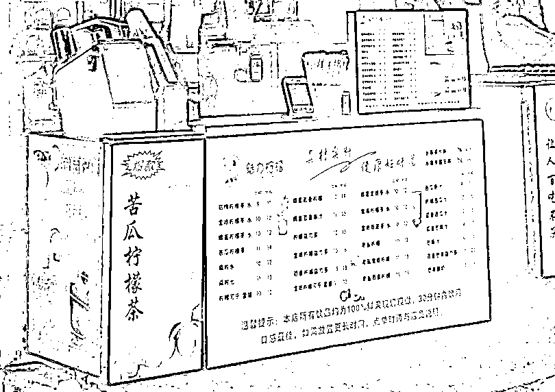

# 同样的街道和人流，为何这家小店获客是对手的几倍？

> 原文：[`www.yuque.com/for_lazy/thfiu8/cq2tgw0wy5qesb26`](https://www.yuque.com/for_lazy/thfiu8/cq2tgw0wy5qesb26)

<ne-h2 id="ff2b7776" data-lake-id="ff2b7776"><ne-heading-ext><ne-heading-anchor></ne-heading-anchor><ne-heading-fold></ne-heading-fold></ne-heading-ext><ne-heading-content><ne-text id="u05ada7c7">(24 赞)同样的街道和人流，为何这家小店获客是对手的几倍？</ne-text></ne-heading-content></ne-h2> <ne-p id="u598a521f" data-lake-id="u598a521f"><ne-text id="u71d22234">作者： 奋斗的木鱼</ne-text></ne-p> <ne-p id="u5bda5cb6" data-lake-id="u5bda5cb6"><ne-text id="ueeef3f18">日期：2023-07-07</ne-text></ne-p> <ne-p id="ud407e02d" data-lake-id="ud407e02d"><ne-text id="ue7c60420">一直偏向写大店，但大店很多经营技巧是我们无法模仿的，有些朋友就让我写一下小店，因为我们一般开店都是从一家小店开始，最近恰好在观察两家小店，就拆解他们的经营智慧，为大家奉上。</ne-text></ne-p> <ne-p id="u024d6ef8" data-lake-id="u024d6ef8"><ne-text id="u4dc259f4">在这一条 50 米长的街道上，有两家有趣的门店，都是果茶店。一家以水果茶为主，柠檬茶为辅，开在小吃街左边。另一家是柠檬茶为主，水果茶为辅，开在小吃街右边。</ne-text></ne-p> <ne-p id="ub19921ff" data-lake-id="ub19921ff"><ne-text id="u75b4158f">你们猜猜，哪家门店生意更好？</ne-text></ne-p> <ne-p id="u2a922ba9" data-lake-id="u2a922ba9"><ne-card data-card-name="image" data-card-type="inline" id="klktZ" data-event-boundary="card"></ne-card></ne-p> <ne-p id="u0989eae0" data-lake-id="u0989eae0"><ne-text id="u245abe27">图 1（左边）</ne-text></ne-p> <ne-p id="u3a58f413" data-lake-id="u3a58f413"><ne-card data-card-name="image" data-card-type="inline" id="TQhZj" data-event-boundary="card"></ne-card></ne-p> <ne-p id="u6e60ef95" data-lake-id="u6e60ef95"><ne-text id="u21b7e002">图 2（右边）</ne-text></ne-p> <ne-p id="u6f4c4528" data-lake-id="u6f4c4528"><ne-text id="ub0ffe55a">我潜意识的猜测是左边的这一家以柠檬茶为主的门店（图 1）会更胜一筹，因为他这家店是分店，首店就在 200 米外，而且这家店在这边沉淀了多年，有着众多的粘性客户。</ne-text></ne-p> <ne-p id="u51294327" data-lake-id="u51294327"><ne-text id="u0fdb1a0a">但是通过一段时间的观察，我发现我错了，原来右边的水果茶门店（图 2）生意更好，这引起了我的好奇，为什么同一街道，一家有着大量沉淀客户的老店输给了一家新店呢？</ne-text></ne-p> <ne-p id="u7a826d81" data-lake-id="u7a826d81"><ne-text id="u51c357ac">为了寻找答案，我连续蹲点，站在街道入门处开始观察。</ne-text></ne-p> <ne-p id="u80627e5e" data-lake-id="u80627e5e"><ne-text id="ufa1ff045">这一观察，才发现这家新店的奥妙与手段，今天，我带大伙一起来看看。</ne-text></ne-p> <ne-p id="uea8de89c" data-lake-id="uea8de89c"><ne-text id="u336bae90">战争的关键战略点【位置】</ne-text></ne-p> <ne-p id="u699fa8fb" data-lake-id="u699fa8fb"><ne-text id="u3db7087c">我没入行就听说一句话：线下门店生意好，关键是“位置、位置、还是位置”。</ne-text></ne-p> <ne-p id="ud55faf2f" data-lake-id="ud55faf2f"><ne-text id="u96d09c61">不管是餐饮门店还是其他行业的线下门店，位置的重要性必定排在前列，那这短短的 50 米，大家位置一左一右，面对面的直线距离也不过 5 米，怎么说位置也是他们的战争决胜点呢？</ne-text></ne-p> <ne-p id="u75171def" data-lake-id="u75171def"><ne-text id="u8903a4ec">这个问题我也疑惑良久，后面在黄老师的零售小店课程里找到了答案。</ne-text></ne-p> <ne-p id="u3d6d94ff" data-lake-id="u3d6d94ff"><ne-text id="u066587a4">【客户进店，是先迈左脚向右看】就是这句话，让我茅舍顿开。</ne-text></ne-p> <ne-p id="uc0f37bec" data-lake-id="uc0f37bec"><ne-text id="u36267247">首先，我们可以将这条街道当作一家门店，两边当成零售的货架，按照大多数人的习惯，客户进店（进街）是先迈左脚向右看的，那会首先注意到的是谁？</ne-text></ne-p> <ne-p id="ub2862ab9" data-lake-id="ub2862ab9"><ne-text id="ueda4c69e">就是在右边开店的水果茶店。</ne-text></ne-p> <ne-p id="u6f7e5a64" data-lake-id="u6f7e5a64"><ne-text id="u05682f1b">这样一来，水果茶店是抢夺了先机，先吸引到顾客的注意力。</ne-text></ne-p> <ne-p id="u50ae2c6f" data-lake-id="u50ae2c6f"><ne-text id="uff1590cf">我们来看看他们门店的灯箱。</ne-text></ne-p> <ne-p id="u772e5a07" data-lake-id="u772e5a07"><ne-card data-card-name="image" data-card-type="inline" id="wfAaJ" data-event-boundary="card"></ne-card></ne-p> <ne-p id="u99f4989d" data-lake-id="u99f4989d"><ne-text id="ucbfd1a22">图 3</ne-text></ne-p> <ne-p id="u8ce75af4" data-lake-id="u8ce75af4"><ne-text id="uaaf00400">他们有一个灯箱是侧向展示的（图 3），你在远处可以看到全貌，但正面点单时就只能看到一半图像。</ne-text></ne-p> <ne-p id="u8439d74f" data-lake-id="u8439d74f"><ne-text id="u76ef8d7c">我看到这个灯箱是疑惑良久，那这块灯箱装错了？</ne-text></ne-p> <ne-p id="u27b67590" data-lake-id="u27b67590"><ne-text id="uf78738a7">恰恰相反，在客户首先向右看的逻辑下，这块灯箱装对了。</ne-text></ne-p> <ne-p id="ub75ad260" data-lake-id="ub75ad260"><ne-text id="u67b4f284">因为这个水果茶灯箱并不是给点单的客户看的，而是给进街【右看】的客户看的，因此它的角度才侧向面对街口。</ne-text></ne-p> <ne-p id="u008d51f8" data-lake-id="u008d51f8"><ne-text id="u6c2fc0a8">这样一来，客户看向右面这家门店时，顺着门店的灯源看向了招牌灯箱。而且这家店为了增大可视面积【减少客户负担】，调整了字体，表明了价格，用大块的面积突出主产品，让客户瞬间了解这家店【买啥，价钱多少】。</ne-text></ne-p> <ne-p id="u3294f7c0" data-lake-id="u3294f7c0"><ne-text id="u7e6b2a8c" style="color: rgb(216, 57, 49);">行为学家有个有趣的实验结论：让客户多将注意力放在你这里，你就赢得客户更多的好感。</ne-text></ne-p> <ne-p id="uf23a1d21" data-lake-id="uf23a1d21"><ne-text id="u67577574">这家店不但做到了让客户原本极短的注意力变长了，赢得了客户好感，还做到了抢先占据用户心智（让客户以它为起点，作为衡量接下来饮品的价格、容量、材料丰富度）。</ne-text></ne-p> <ne-p id="uaa9b8a7e" data-lake-id="uaa9b8a7e"><ne-text id="ua38bd414">为了验证这家门店是否赢在【迈左脚向右看】的原因上，我连续多天（中午、晚上）观察客流步行迈脚情况和视线变化。</ne-text></ne-p> <ne-p id="u3e89ecc0" data-lake-id="u3e89ecc0"><ne-text id="ue8896d97">发现了同样有趣的知识：</ne-text></ne-p> <ne-p id="u49a73fe6" data-lake-id="u49a73fe6"><ne-text id="u8dfd236c" style="color: rgb(216, 57, 49);">迈左脚向右看是极大多数客户的习惯。</ne-text></ne-p> <ne-p id="ue0c0efe7" data-lake-id="ue0c0efe7"><ne-text id="ubf290d30">其次，迈右脚，向左看客户也会分为两拨，一直看左和先看左，在观察几眼后转向右面。而转向看右的客户占据迈右脚的大部分客户，但迈左脚转向左看的客户却是少数。</ne-text></ne-p> <ne-p id="ue6577400" data-lake-id="ue6577400"><ne-text id="uea487b0d">总体而言，向右看的客户居多数，不管迈左脚还是右脚。</ne-text></ne-p> <ne-p id="ud5fa48e8" data-lake-id="ud5fa48e8"><ne-text id="uf2d529bb">（PS：以上数据是连续 1 周观察千人以上数据）</ne-text></ne-p> <ne-p id="u32b3d7e5" data-lake-id="u32b3d7e5"><ne-text id="u514dd933">后面还得出一个验证信息：迈右脚向左看，看了几眼又转向看右边的客户，转向的第一眼是从街道中间开启，而这家水果店恰恰在中间的位置。</ne-text></ne-p> <ne-p id="u9e803b4f" data-lake-id="u9e803b4f"><ne-text id="uf6ff4fec">（PS：可能和街道距离长短有关）</ne-text></ne-p> <ne-p id="u281875a2" data-lake-id="u281875a2"><ne-text id="ued24b6fc">分析完位置，我们来看看门店的灯箱</ne-text></ne-p> <ne-p id="u0ca12bc3" data-lake-id="u0ca12bc3"><ne-text id="u2e829d67">这里，两家的灯箱都大同小异，不同的是展示菜单的位置有所区别</ne-text></ne-p> <ne-p id="uabc330c9" data-lake-id="uabc330c9"><ne-card data-card-name="image" data-card-type="inline" id="CZwVz" data-event-boundary="card"></ne-card></ne-p> <ne-p id="u88a3859a" data-lake-id="u88a3859a"><ne-text id="uab3dd3fe">图 4</ne-text></ne-p> <ne-p id="u0703aade" data-lake-id="u0703aade"><ne-card data-card-name="image" data-card-type="inline" id="C3Zxi" data-event-boundary="card"></ne-card></ne-p> <ne-p id="u0d677f74" data-lake-id="u0d677f74"><ne-text id="udfa7d7f6">图 5</ne-text></ne-p> <ne-p id="u0494df06" data-lake-id="u0494df06"><ne-text id="u48876a63">左边（图 4）这一家，我们可以看到上方是以“大图+主打产品“，下面是“菜单价格图”。</ne-text></ne-p> <ne-p id="u2b155493" data-lake-id="u2b155493"><ne-text id="u81591105">右边（图 5）这家上方是“菜单价格图”，下方是“招牌大图+针对竞对对手的菜单产品图”。</ne-text></ne-p> <ne-p id="u2a13acf2" data-lake-id="u2a13acf2"><ne-text id="u2b3cd029">哪个好呢？</ne-text></ne-p> <ne-p id="u1759dcfa" data-lake-id="u1759dcfa"><ne-text id="u21d7f0f3">好与坏怎么分辨？</ne-text></ne-p> <ne-p id="ud7b5d97a" data-lake-id="ud7b5d97a"><ne-text id="u0c98fe93">是图片？大小？价格展示作为分辨吗？</ne-text></ne-p> <ne-p id="u6184e7f3" data-lake-id="u6184e7f3"><ne-text id="u27fddcdb" style="color: rgb(216, 57, 49);">华与华老师说过“现场有神明”。</ne-text></ne-p> <ne-p id="uc3f3d330" data-lake-id="uc3f3d330"><ne-text id="u37755df7">【灯箱位置的好坏让客户自主的反应来判断】</ne-text></ne-p> <ne-p id="u5872b483" data-lake-id="u5872b483"><ne-text id="u5e181f66">我观察到，在客户选择产品的时候，都会自主的将注意力放在菜单上，但身体有所不同。</ne-text></ne-p> <ne-p id="u10200cc4" data-lake-id="u10200cc4"><ne-text id="u235a6b24">看向左边柠檬茶门店菜单时，客户视线向下，【身体微微往后】，因为要看的更清楚。</ne-text></ne-p> <ne-p id="u7a21e4a7" data-lake-id="u7a21e4a7"><ne-text id="u69d9d207">看向右边水果茶门店菜单时，客户视线向上，【身体微微靠近】，因为要看的更清楚。</ne-text></ne-p> <ne-p id="u5d727d27" data-lake-id="u5d727d27"><ne-text id="u0f3f3e95" style="color: rgb(216, 57, 49);">人天生对外界有警惕性，不会贸然靠近陌生的事物，一般选择站在安全的位置上。</ne-text></ne-p> <ne-p id="u81da4428" data-lake-id="u81da4428"><ne-text id="u4fb3a011">这时，因为导致客户距离的不同，灯箱的好坏便体现出来了。</ne-text></ne-p> <ne-p id="u15388d2b" data-lake-id="u15388d2b"><ne-text id="udc8f04fa">这两家门店的菜单让客户有截然不同的反应，一个让客户靠得近，一个让客户离得远。</ne-text></ne-p> <ne-p id="u62b3bb99" data-lake-id="u62b3bb99"><ne-text id="ufa60cbd1" style="color: rgb(216, 57, 49);">客户要靠得近，潜意识引导身体接近对方，易于产生信任。</ne-text></ne-p> <ne-p id="udd7f9e59" data-lake-id="udd7f9e59"><ne-text id="u239d480e" style="color: rgb(216, 57, 49);">客户要离得远，潜意识引导身体远离对方，易于产生防备。</ne-text></ne-p> <ne-p id="u669a9494" data-lake-id="u669a9494"><ne-text id="u1bc8d922">一个信任，一个防备，换来的结果是截然不同。</ne-text></ne-p> <ne-p id="ub411b380" data-lake-id="ub411b380"><ne-text id="u976647b1">其次，由于街上的人流众多，而街道空间有限，左边门店需要远离才能看到菜单，那更容易受到人流的冲击，在点单过程中形成了无形的紧迫感。</ne-text></ne-p> <ne-p id="u2d64521e" data-lake-id="u2d64521e"><ne-text id="ubc1b75b8">试想在点单时，来来往往的人与小电车穿梭越过，你的感觉会好吗？</ne-text></ne-p> <ne-p id="u7b3d094e" data-lake-id="u7b3d094e"><ne-card data-card-name="image" data-card-type="inline" id="dS9Ho" data-event-boundary="card"></ne-card></ne-p> <ne-p id="u05979559" data-lake-id="u05979559"><ne-text id="u701da0fd">图 6</ne-text></ne-p> <ne-p id="u16f9efaf" data-lake-id="u16f9efaf"><ne-card data-card-name="image" data-card-type="inline" id="Ff16W" data-event-boundary="card"></ne-card></ne-p> <ne-p id="u855702bb" data-lake-id="u855702bb"><ne-text id="u90a3e98d">图 7</ne-text></ne-p> <ne-p id="u84e707f3" data-lake-id="u84e707f3"><ne-text id="ub4c63837">来到价格</ne-text></ne-p> <ne-p id="u587444d8" data-lake-id="u587444d8"><ne-text id="u76fad4bd">同样产品，水果茶为主的门店就对标柠檬茶的门店，你有的，我也有，我还比便宜一点。</ne-text></ne-p> <ne-p id="u37cd1f6d" data-lake-id="u37cd1f6d"><ne-text id="u07c4af55">因为柠檬茶有两家店，如果贸然改价跟进，就会导致总店受损，在价格策略上，柠檬茶店只能看着对方无奈叹气。</ne-text></ne-p> <ne-p id="ufe360714" data-lake-id="ufe360714"><ne-text id="ued1a4e75">在同样柠檬茶的价格设置上，水果茶店还玩了小心思，增加一个超大杯（图 6）。</ne-text></ne-p> <ne-p id="u6241ff2d" data-lake-id="u6241ff2d"><ne-text id="ua90c419a">我们了解“价格锚点”的会知道，客户选择产品一般趋向于中间的价格，这样安全系数更高。</ne-text></ne-p> <ne-p id="uae4ac8dd" data-lake-id="uae4ac8dd"><ne-text id="u42b034f5">你看，对方买和你同样的产品，可能买的还都是你的最高价，真是气人......</ne-text></ne-p> <ne-p id="u799574ab" data-lake-id="u799574ab"><ne-text id="u0bd1f220">都说高手在民间，今天这两家店就让我看到了众多的学问，也了解到为什么一家老牌茶饮店，在客流上输于新的茶饮店，因为里面都是满满的经营智慧啊。</ne-text></ne-p> <ne-hole id="u0acfda2c" data-lake-id="u0acfda2c"><ne-card data-card-name="hr" data-card-type="block" id="oibCL" data-event-boundary="card"><ne-p id="u6f9e206f" data-lake-id="u6f9e206f"><ne-text id="uae445da9">评论区：</ne-text></ne-p> <ne-p id="u86c7a176" data-lake-id="u86c7a176"><ne-text id="u882baf79">暂无评论</ne-text></ne-p></ne-card></ne-hole>