# Web3 工具，比特浏览器如何创建批量账号

> 原文：[`www.yuque.com/for_lazy/thfiu8/nm4fqgwd6dmt0i2v`](https://www.yuque.com/for_lazy/thfiu8/nm4fqgwd6dmt0i2v)

<ne-h2 id="b64f7cd5" data-lake-id="b64f7cd5"><ne-heading-ext><ne-heading-anchor></ne-heading-anchor><ne-heading-fold></ne-heading-fold></ne-heading-ext><ne-heading-content><ne-text id="u72f26a54">(29 赞)Web3 工具，比特浏览器如何创建批量账号</ne-text></ne-heading-content></ne-h2> <ne-p id="ud70e32e7" data-lake-id="ud70e32e7"><ne-text id="u35781541">作者： 清水哥</ne-text></ne-p> <ne-p id="u76b530a3" data-lake-id="u76b530a3"><ne-text id="uacbdbbc7">日期：2023-07-05</ne-text></ne-p> <ne-p id="uef324d81" data-lake-id="uef324d81"><ne-text id="u75d51966">大家好，我是清水哥，一个玩 Web3 的跨境电商人，目前玩 web3 已经一年半时间。</ne-text></ne-p> <ne-p id="u65104b6a" data-lake-id="u65104b6a"><ne-text id="u8493105f">在 Web3，不管撸空投做交互，还是抽奖之类的，一般都建议多账号，才能提高收益或者提高中奖率。</ne-text></ne-p> <ne-p id="ubeb0c221" data-lake-id="ubeb0c221"><ne-text id="u6d42d510">那多开账号，同时又要兼顾避免女巫关联，这就需要用到指纹浏览器了。</ne-text></ne-p> <ne-p id="u8af16842" data-lake-id="u8af16842"><ne-text id="u9688d779">指纹浏览器一般常见有 2 种，一种是比特浏览器，另一种是 ads 浏览器，2 种各有优缺点，ads 相对比较高，比特浏览器相对性价比高。</ne-text></ne-p> <ne-p id="ue04cab5c" data-lake-id="ue04cab5c"><ne-text id="u67304255">接下来，我以比特浏览器实操，希望对大家有所帮助。</ne-text></ne-p> <ne-p id="u88723575" data-lake-id="u88723575"><ne-text id="u5d4c01c6" ne-bold="true">打开比特浏览器官网</ne-text><ne-text id="u89921ec4">：</ne-text>[<ne-text id="uda3cd555">https://www.bitbrowser.cn/?code=c800c7</ne-text>](https://www.bitbrowser.cn/?code=c800c7)</ne-p> <ne-p id="u50c42bb6" data-lake-id="u50c42bb6"><ne-text id="u3bebcc39">点击右上角的注册，按要求如实填写</ne-text></ne-p> <ne-p id="ua07c8c51" data-lake-id="ua07c8c51"><ne-card data-card-name="image" data-card-type="inline" id="lR6gD" data-event-boundary="card">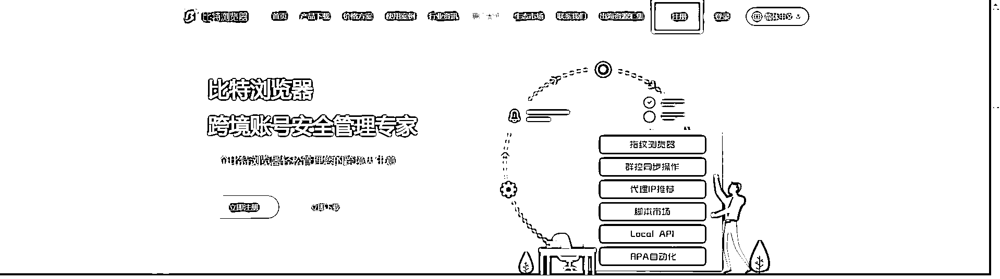  <ne-p id="u4319e73b" data-lake-id="u4319e73b"><ne-card data-card-name="image" data-card-type="inline" id="SbdQO" data-event-boundary="card">  <ne-p id="ubd3b9dec" data-lake-id="ubd3b9dec"><ne-text id="ucb023d87">注册好账号，就可以直接点击产品下载</ne-text></ne-p> <ne-p id="u8a5854f4" data-lake-id="u8a5854f4"><ne-card data-card-name="image" data-card-type="inline" id="xfArw" data-event-boundary="card">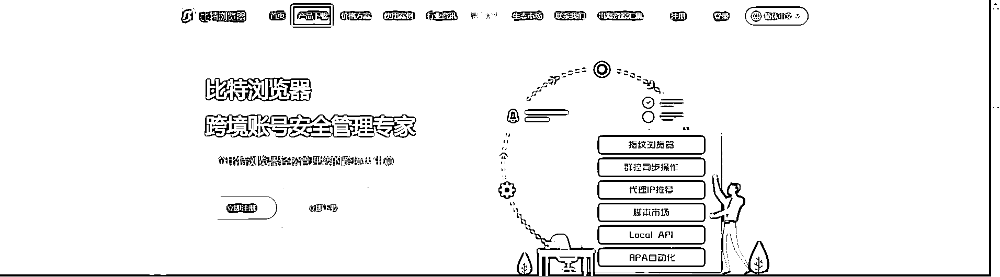  <ne-p id="u92edd0dd" data-lake-id="u92edd0dd"><ne-text id="u3c01bb6b">根据自己电脑的配置，下载对应的客户端</ne-text></ne-p> <ne-p id="u8ea61fd2" data-lake-id="u8ea61fd2"><ne-card data-card-name="image" data-card-type="inline" id="Lg0YB" data-event-boundary="card">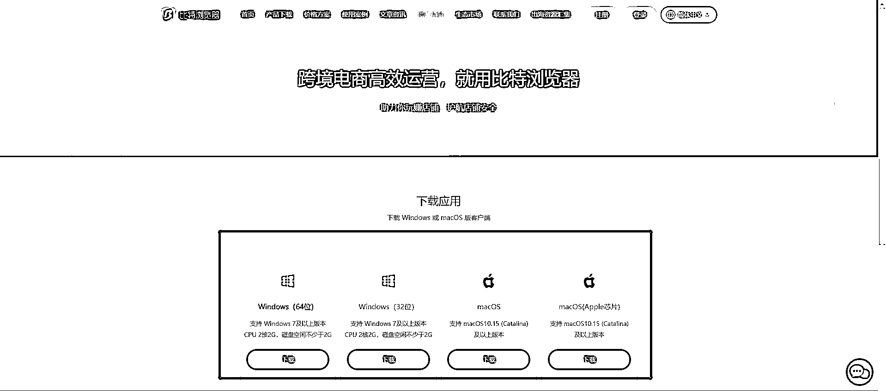  <ne-p id="uf5a45aa9" data-lake-id="uf5a45aa9"><ne-text id="u2276aec9">在客户端输入自己的用户名和密码就可以登录了</ne-text></ne-p> <ne-p id="u98c0548a" data-lake-id="u98c0548a"><ne-text id="u2b53be13">如果有时登录不上，可以切换线路，如下图所示，就可以直接登录了</ne-text></ne-p> <ne-p id="u76ef20fb" data-lake-id="u76ef20fb"><ne-card data-card-name="image" data-card-type="inline" id="A6are" data-event-boundary="card">  <ne-p id="ud59c4530" data-lake-id="ud59c4530"><ne-text id="uf431dff8" ne-bold="true">第一步，我们先配置好第一个账号</ne-text></ne-p> <ne-p id="ue71eff4b" data-lake-id="ue71eff4b"><ne-text id="u9df4dda7">浏览器窗口-----创建窗口</ne-text></ne-p> <ne-p id="u4d6b73b9" data-lake-id="u4d6b73b9"><ne-card data-card-name="image" data-card-type="inline" id="tWdkK" data-event-boundary="card">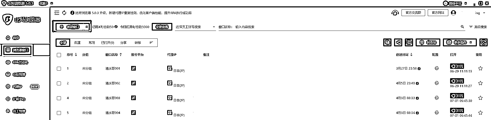  <ne-p id="uf5360d9a" data-lake-id="uf5360d9a"><ne-text id="u994c9282">窗口名称这里备注好，其他选项，先按默认的，后面我们再更改</ne-text></ne-p> <ne-p id="u44597b1e" data-lake-id="u44597b1e"><ne-card data-card-name="image" data-card-type="inline" id="ybIyk" data-event-boundary="card">  <ne-p id="ue7e9825a" data-lake-id="ue7e9825a"><ne-text id="u3d57d55d">这里的代理类型，选择：</ne-text><ne-text id="uf82d977d" ne-bold="true">Socks5</ne-text></ne-p> <ne-p id="u1de7a12c" data-lake-id="u1de7a12c"><ne-card data-card-name="image" data-card-type="inline" id="sPu7D" data-event-boundary="card">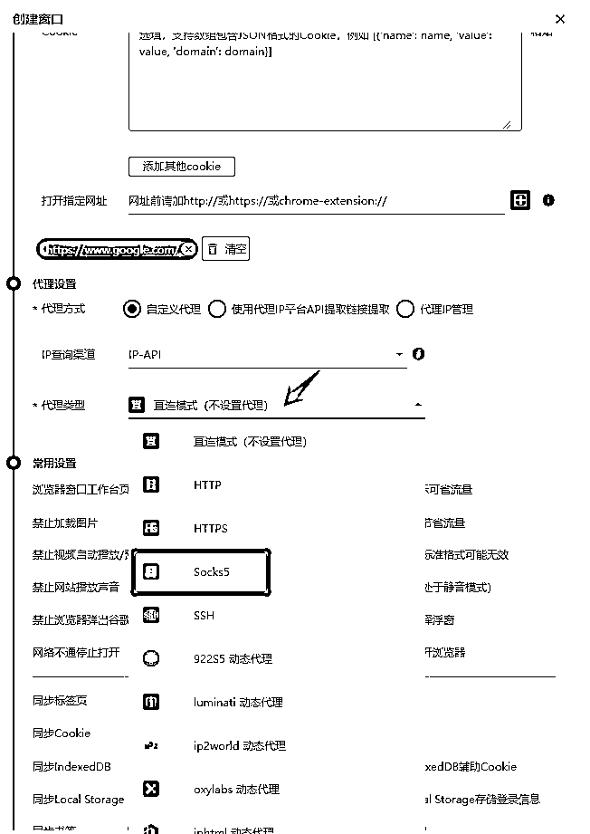  <ne-p id="u50f1483b" data-lake-id="u50f1483b"><ne-text id="uccd6dd34">之后把我们之前购买好的 IP 资料，一一对应复制进去，点确认就行</ne-text></ne-p> <ne-p id="u097cd5df" data-lake-id="u097cd5df"><ne-text id="ue50177f3">IP：203.166.143.75 端口:12324  账号：14af23abef863  密码：bb76ddb86a （这个 IP 我只购买 1 天，只为实操给大家看的哦）</ne-text></ne-p> <ne-p id="u4ccdea06" data-lake-id="u4ccdea06"><ne-text id="ue9cf6d97">如果需要购买静态住宅 IP,可以去这个的官网购买</ne-text>[<ne-text id="u35757163">https://dashboard.iproyal.com/</ne-text>](https://dashboard.iproyal.com/) <ne-text id="ub03f3f5d">，大约一个月 5U，成本比较高，比较稳定速度比较快</ne-text></ne-p> <ne-p id="ud6e3a10a" data-lake-id="ud6e3a10a"><ne-text id="u766ce463">我自己用的大部分 IP 是 8 元一个月的，相对静态住宅 IP 来讲，没有静态住宅 IP 那么快的速度，但是感觉用了几个月同，还是满足 web3 的大部分需求的，比较推荐。</ne-text></ne-p> <ne-p id="u5f6d5211" data-lake-id="u5f6d5211"><ne-card data-card-name="image" data-card-type="inline" id="HhA4m" data-event-boundary="card">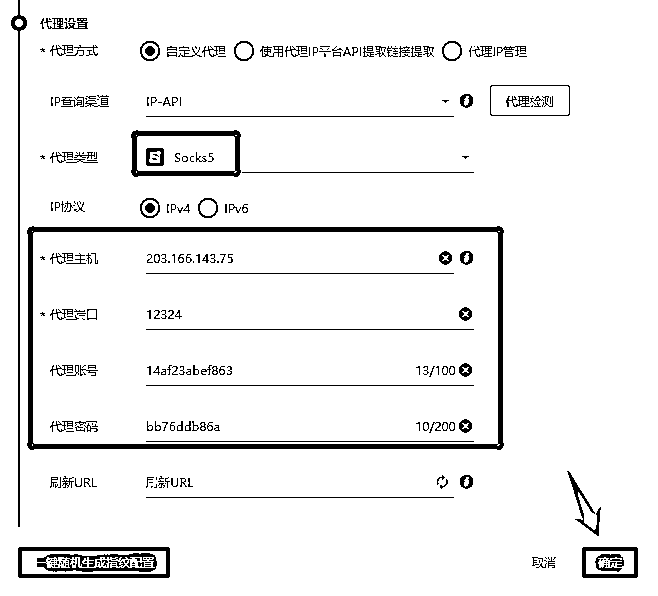  <ne-p id="ub4a1dfca" data-lake-id="ub4a1dfca"><ne-text id="uc7040cae">这样我们的浏览器就配置成功了，刚刚配置的是清水哥 048 这个号，右边有个打开的入口，点击后，浏览器就成功找开了，如下图，而且还可以看到每个账号的 IP</ne-text></ne-p> <ne-p id="u57d5a71a" data-lake-id="u57d5a71a"><ne-card data-card-name="image" data-card-type="inline" id="zwr1p" data-event-boundary="card">  <ne-p id="u06f0b4e2" data-lake-id="u06f0b4e2"><ne-text id="ubbd3a345" ne-bold="true">第二步，书签导入</ne-text></ne-p> <ne-p id="ufb009924" data-lake-id="ufb009924"><ne-text id="u8d4256d5">在刚刚配置好的这个账号，打开 web3 几个常用的网址(其他的网址自行添加进来），保存为书签</ne-text></ne-p> <ne-p id="ucf549784" data-lake-id="ucf549784"><ne-text id="ub549adef" style="color: rgb(47, 48, 52);">推特：</ne-text>[<ne-text id="ua44b4de6">https://twitter.com/</ne-text>](https://twitter.com/)</ne-p> <ne-p id="u45a6aeb2" data-lake-id="u45a6aeb2"><ne-text id="u863e842b" style="color: rgb(47, 48, 52);">discord:</ne-text> [<ne-text id="u8ecaf6e4">https://discord.com/channels/@me</ne-text>](https://discord.com/channels/@me)</ne-p> <ne-p id="u81933463" data-lake-id="u81933463"><ne-text id="uf6ff0869">Opensea：</ne-text>[<ne-text id="uaf98c8ac">https://opensea.io/</ne-text>](https://opensea.io/)</ne-p> <ne-p id="u7e347773" data-lake-id="u7e347773"><ne-text id="ufdd74927" style="color: rgb(47, 48, 52);">谷歌邮箱：</ne-text>[<ne-text id="ub4b61478">https://mail.google.com/</ne-text>](https://mail.google.com/)</ne-p> <ne-p id="u558d9251" data-lake-id="u558d9251"><ne-text id="u61dae322">谷歌翻译：</ne-text>[<ne-text id="u8d31b385">https://translate.google.com/</ne-text>](https://translate.google.com/)</ne-p> <ne-p id="ucd08af59" data-lake-id="ucd08af59"><ne-text id="u068af682" style="color: rgb(47, 48, 52);">然后右上角三个点，书签---书签管理器---导出书签</ne-text></ne-p> <ne-p id="u41ac472f" data-lake-id="u41ac472f"><ne-card data-card-name="image" data-card-type="inline" id="V0dKl" data-event-boundary="card"><ne-card data-card-name="image" data-card-type="inline" id="PC3xz" data-event-boundary="card">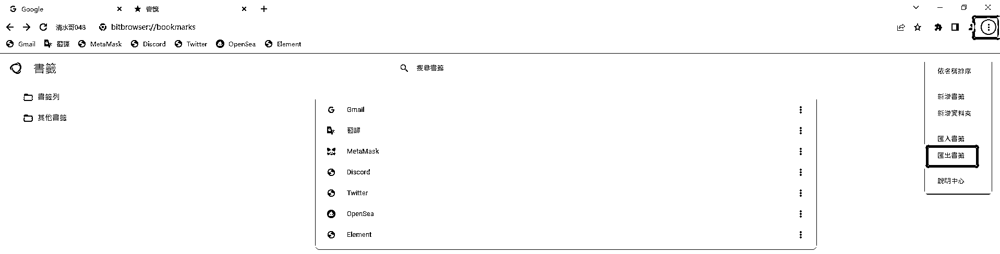  <ne-p id="u6a642a2c" data-lake-id="u6a642a2c"><ne-text id="ufc2c9b0b">在系统设置---全局配置--选择我们刚刚导出的书签，点保存就可以，如果有平时其他网址，也是按这种方法导入的，不用每个账号一个一个保存了</ne-text></ne-p> <ne-p id="u76f591e9" data-lake-id="u76f591e9"><ne-card data-card-name="image" data-card-type="inline" id="VcrQd" data-event-boundary="card">  <ne-p id="u35cef500" data-lake-id="u35cef500"><ne-text id="u7e7cc62e" ne-bold="true">第三步，打开各种常用插件</ne-text></ne-p> <ne-p id="ud78cd9d9" data-lake-id="ud78cd9d9"><ne-text id="uab7e2f6a">先在拓展中心，把常用的几个插件按纽按开，比如 MetaMask、Google 翻译和 Unisat 等等</ne-text></ne-p> <ne-p id="ufa621d0c" data-lake-id="ufa621d0c"><ne-text id="u0e0d0086">当然如果做跨镜电商的，这里也可以打开其他的插件</ne-text></ne-p> <ne-p id="u07ebbd13" data-lake-id="u07ebbd13"><ne-card data-card-name="image" data-card-type="inline" id="tGrvi" data-event-boundary="card"><ne-card data-card-name="image" data-card-type="inline" id="OJb65" data-event-boundary="card">  <ne-p id="u3e65d349" data-lake-id="u3e65d349"><ne-text id="u9be5eca4" ne-bold="true">第四步：浏览器缓存</ne-text></ne-p> <ne-p id="u978af508" data-lake-id="u978af508"><ne-text id="uf73befe2">系统设置---基础设置---浏览器缓存，原来默认在 C 盘的系统盘的，建议更改到其他盘，毕竟多开账号，平时的内容又保存起来，这样 C 般很难承受的</ne-text></ne-p> <ne-p id="u648dc93a" data-lake-id="u648dc93a"><ne-card data-card-name="image" data-card-type="inline" id="q4giK" data-event-boundary="card">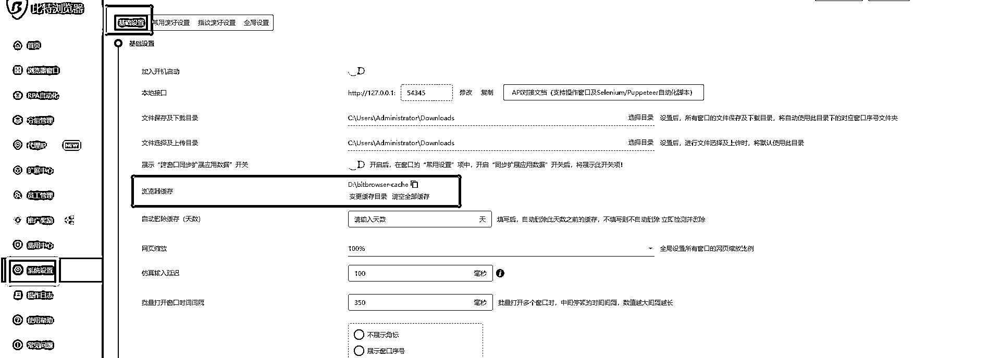  <ne-p id="u5ee945ec" data-lake-id="u5ee945ec"><ne-text id="uef72612b" ne-bold="true">第五步：常用偏好设置</ne-text></ne-p> <ne-p id="u247d4cb1" data-lake-id="u247d4cb1"><ne-text id="u7e2b6865">系统设置---常用偏好设置--把红框内几个同步按纽全部打开即可，如下图</ne-text></ne-p> <ne-p id="u72967a79" data-lake-id="u72967a79"><ne-card data-card-name="image" data-card-type="inline" id="oGL4k" data-event-boundary="card">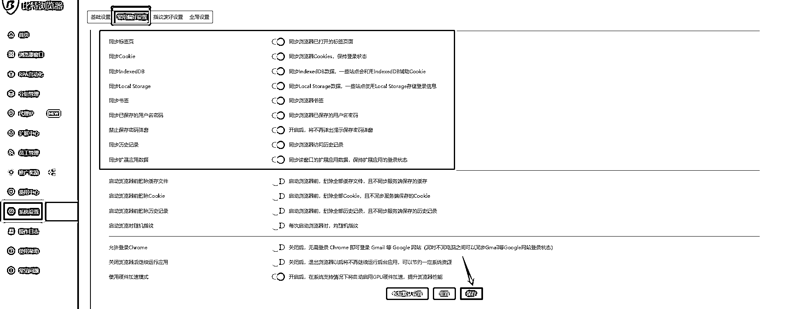  <ne-p id="u90123161" data-lake-id="u90123161"><ne-text id="ue7ed052e" ne-bold="true">第六步：指纹偏好设置</ne-text></ne-p> <ne-p id="u0eb407c5" data-lake-id="u0eb407c5"><ne-text id="ud213c99b">系统设置---指纹偏好设置---账号平台：其他平台，选择语言：中文，选择界面语言：中文，时区：打开按纽，点保存</ne-text></ne-p> <ne-p id="ud13978d7" data-lake-id="ud13978d7"><ne-card data-card-name="image" data-card-type="inline" id="ddp0n" data-event-boundary="card">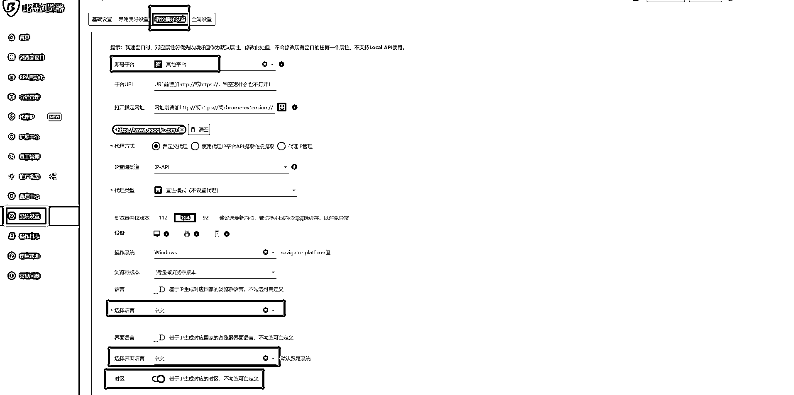  <ne-p id="u4419e80f" data-lake-id="u4419e80f"><ne-text id="u7db15ba1" ne-bold="true">第七步：子账户</ne-text></ne-p> <ne-p id="u08c3c384" data-lake-id="u08c3c384"><ne-text id="ueab8bce3">如果需要在不同的电脑使用比特浏览器，就可以开启子账户，员工管理---添加用户，之后按要求填写就可以</ne-text></ne-p> <ne-p id="u653d0b01" data-lake-id="u653d0b01"><ne-card data-card-name="image" data-card-type="inline" id="Bqo6p" data-event-boundary="card">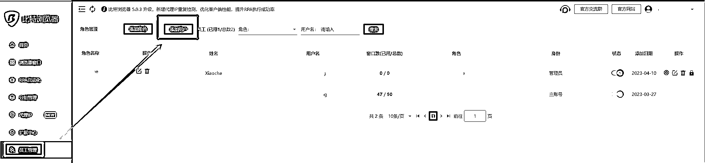<ne-card data-card-name="image" data-card-type="inline" id="hz8oP" data-event-boundary="card">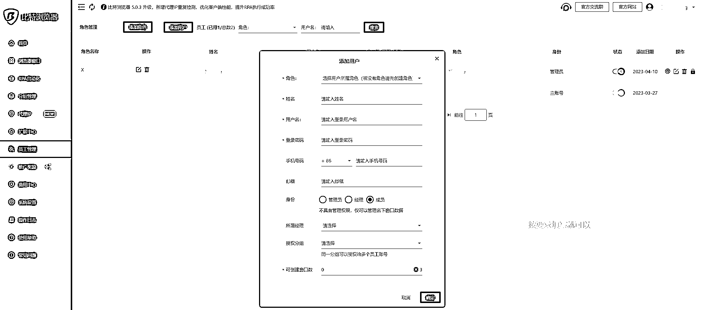  <ne-p id="u69dea07c" data-lake-id="u69dea07c"><ne-text id="uc4c1c031">以上基本指纹浏览器已经配置完成，如果需要配置多个账号的，就可以按第一步那样，创建窗口，把 IP 等资料填写进来就行了，可以批量打开，批量关闭，很方便</ne-text></ne-p> <ne-p id="u8eec060a" data-lake-id="u8eec060a"><ne-card data-card-name="image" data-card-type="inline" id="c2kIZ" data-event-boundary="card">  <ne-p id="u6de99da8" data-lake-id="u6de99da8"><ne-text id="ua458b0bd">比特浏览器刚开始可以用免费版本，可以创建 10 个账号，如果需要创建更多账号，就可以购买比特的付费套餐，我是购买了 50 元一个月的，有 50 个账号的名额，对于一般人来说，也足够了</ne-text></ne-p> <ne-p id="u9db90227" data-lake-id="u9db90227"><ne-card data-card-name="image" data-card-type="inline" id="uwn9T" data-event-boundary="card">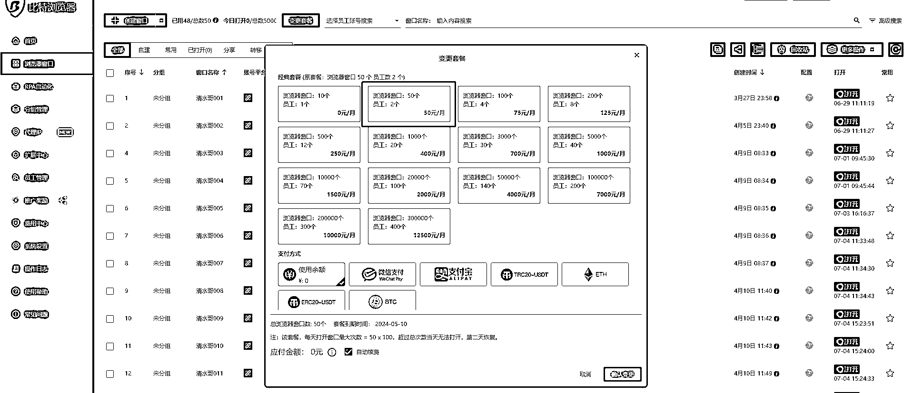  <ne-p id="ucfe54be0" data-lake-id="ucfe54be0"><ne-text id="u999a44bd" ne-bold="true">以上就是关于比特浏览器的创建和使用了。</ne-text></ne-p> <ne-p id="u861a53f3" data-lake-id="u861a53f3"><ne-text id="ufaa09b19" ne-bold="true">除了 Web3，跨境电商多账号也可以用比特浏览器的，希望对大家有所帮助。</ne-text></ne-p> <ne-p id="u21d23bf9" data-lake-id="u21d23bf9"><ne-text id="u06e93c59" ne-bold="true">欢迎大家链接，一起 Web3。</ne-text></ne-p> <ne-hole id="ua6dbd88a" data-lake-id="ua6dbd88a"><ne-card data-card-name="hr" data-card-type="block" id="JFfHw" data-event-boundary="card"><ne-p id="u7c2635c8" data-lake-id="u7c2635c8"><ne-text id="ub5f1cc8a">评论区：</ne-text></ne-p> <ne-p id="ue005513d" data-lake-id="ue005513d"><ne-text id="u28d90e4d">太迟 : [强]介绍的很详细，需要静态 socks5 的圈友可以找我链接。</ne-text> <ne-text id="u5b4531f5">清水哥 : 感谢认可</ne-text> <ne-text id="uaee57644">HelloCsl : 8 块一个月的 ip 是哪个平台买的？</ne-text> <ne-text id="ue44f3866">清水哥 : 一个朋友那边买的，有需要也可以推给你</ne-text> <ne-text id="u89c35822">毛豆 : 这个，和多台电脑物理隔离的效果差不多？</ne-text> <ne-text id="u60728744">清水哥 : 对的，做 web3,这已经很足够了，但是对跨境电商,换更好一点的 ip,应该没问题的</ne-text></ne-p></ne-card></ne-hole></ne-card></ne-p></ne-card></ne-p></ne-card></ne-card></ne-p></ne-card></ne-p></ne-card></ne-p></ne-card></ne-p></ne-card></ne-card></ne-p></ne-card></ne-p></ne-card></ne-card></ne-p></ne-card></ne-p></ne-card></ne-p></ne-card></ne-p></ne-card></ne-p></ne-card></ne-p></ne-card></ne-p></ne-card></ne-p></ne-card></ne-p></ne-card></ne-p></ne-card></ne-p>