# 作为职场宝妈兼团长，我是如何从卖包浆豆腐到营业额超 100w 的？

> 原文：[`www.yuque.com/for_lazy/thfiu8/orr0irzg871ukolp`](https://www.yuque.com/for_lazy/thfiu8/orr0irzg871ukolp)

<ne-h2 id="0e5b7419" data-lake-id="0e5b7419"><ne-heading-ext><ne-heading-anchor></ne-heading-anchor><ne-heading-fold></ne-heading-fold></ne-heading-ext><ne-heading-content><ne-text id="u01a5092c">(精华帖)(199 赞)作为职场宝妈兼团长，我是如何从卖包浆豆腐到营业额超 100w 的？</ne-text></ne-heading-content></ne-h2> <ne-p id="u07039aad" data-lake-id="u07039aad"><ne-text id="u46a8d7c6">作者： 小野</ne-text></ne-p> <ne-p id="udd6e4f74" data-lake-id="udd6e4f74"><ne-text id="ud0289eaf">日期：2023-07-04</ne-text></ne-p> <ne-p id="uc0298549" data-lake-id="uc0298549"><ne-text id="u0acc358c">大家好，我是小野，一个职场宝妈，在国内 Top5 药企做医药互联网营销，同时也在不停折腾自己的副业。</ne-text></ne-p> <ne-p id="u4f6b26e0" data-lake-id="u4f6b26e0"><ne-text id="ud78e6f7e">可以一边做好主业、一边陪伴育儿、一边坚持副业的六边形妈妈，大概就是我本人了。事业和孩子陪伴得以兼顾，我觉得这是这个时代的礼物，是互联网和生财有术给了妈妈们多一种人生选择。</ne-text></ne-p> <ne-p id="u6eeeea27" data-lake-id="u6eeeea27"><ne-text id="u13216583">目前我运营了 2 个快团团账号，一个美食团、一个母婴团，团购 GMV 累计近 150w；另外也在做大健康方向的产品服务。之前分享过一次我的 2 年副业经历复盘</ne-text>[<ne-text id="u50d777b1">《新手宝妈，职场副业两不误，跑通小红书引流和私域卖货，累计利润 30 万+的经验复盘》</ne-text>](https://wx.zsxq.com/dweb2/index/topic_detail/181544551421122)<ne-text id="u7e5e88d4">。</ne-text></ne-p> <ne-p id="ue8bde019" data-lake-id="ue8bde019"><ne-text id="u4fafd0a0">今天我想分享下我卖包浆豆腐的故事。因为我做团购，就是从小小的包浆豆腐开始的。</ne-text></ne-p> <ne-p id="uf50ff90f" data-lake-id="uf50ff90f"><ne-text id="u1d8bd3ad">这个经历对我来说意义重大，不仅是我做团购的起点；复盘时，我自己也从中再次受益，所以希望也对圈友们也能有所启发。如果你也想要启动做团购、或者做团购时遇到了一些瓶颈，可以参考实践。</ne-text></ne-p> <ne-p id="ue72958c0" data-lake-id="ue72958c0"><ne-text id="u858bbbcd" ne-bold="true">一、做美食 IP，是我一直以来的梦想</ne-text></ne-p> <ne-p id="u986fa959" data-lake-id="u986fa959"><ne-text id="u46bce625">我是云南昆明人，从出来上大学到现在已经十几年。作为家乡宝，我一直有个梦想，就是想把云南美食大声安利给身边的所有人。于是，我从 2015 年就开始写「小野食堂」公众号，写关于各种云南美食和好吃的店，只是后来工作太忙断更了。</ne-text></ne-p> <ne-p id="u36c61c90" data-lake-id="u36c61c90"><ne-card data-card-name="image" data-card-type="inline" id="xVJ8Y" data-event-boundary="card">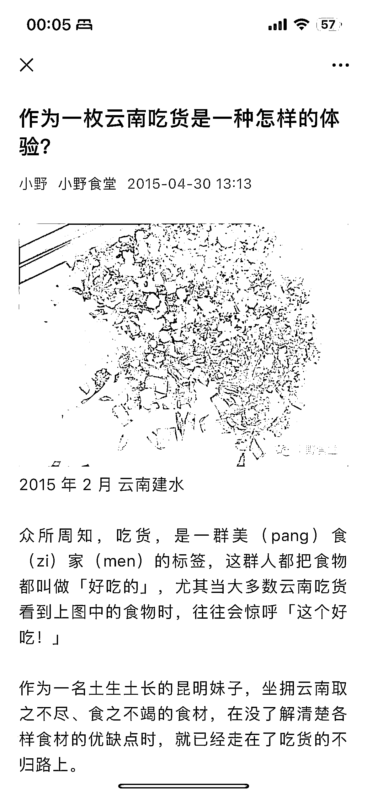  <ne-p id="u75994404" data-lake-id="u75994404"><ne-text id="u92515c92">2021 年初，在我生完孩子的 2 个月后，觉得带孩子这件事很轻松了，于是盖洛普优势「成就」第一的我闲不住，开始想要做副业卖货。我第一想法就是，卖云南美食。</ne-text></ne-p> <ne-p id="u86c3fee5" data-lake-id="u86c3fee5"><ne-text id="ud5e1b828">闺蜜帮我找到了云南建水的包浆豆腐货源，我认为这个产品很有云南特色，虽然当时很多人对它还没什么心智和了解，但是它足够好吃、足够猎奇，我抱着试试看的心态，开始卖货了。</ne-text></ne-p> <ne-p id="u9655e157" data-lake-id="u9655e157"><ne-text id="ueac6c419">我记得特别清楚，1 月 19 日那天，我发了一条朋友圈，拉了个「小野食堂云南美食」群，还厚着脸皮把亲戚朋友全私聊拉进群里，有 100 多人，我自己把素材凑了凑，草率地编辑了一个团文，然后就正式开团包浆豆腐了。</ne-text></ne-p> <ne-p id="u710334f8" data-lake-id="u710334f8"><ne-card data-card-name="image" data-card-type="inline" id="W2Toq" data-event-boundary="card">  <ne-p id="u0c91c1d2" data-lake-id="u0c91c1d2"><ne-text id="u903dba7a">回头看，刚开始我做对了一件事，就是给自己做了个很垂直的定位：一个云南美食团长。</ne-text></ne-p> <ne-p id="ue08ca69c" data-lake-id="ue08ca69c"><ne-text id="u8cebc702">一方面，我之前就断断续续有在写美食公众号；另一方面，基于我是云南人的地域背景，我也一直在朋友圈表达自己对美食的热爱。所以，朋友圈对我已经有美食的定位和印象了，那么我以这个定位开始卖货，是很丝滑的。</ne-text></ne-p> <ne-p id="u22bdb6ac" data-lake-id="u22bdb6ac"><ne-text id="u0d7386db">刚开始做团购，定位很重要。我个人建议是，做快团团私域的第一步，不用着急去推很多品，而是先想好自己的定位。</ne-text></ne-p> <ne-p id="ufd99e4ac" data-lake-id="ufd99e4ac"><ne-text id="ue1721ea9" ne-bold="true">二、如果你只有一个团品，如何把它卖爆？</ne-text></ne-p> <ne-p id="u395a1c32" data-lake-id="u395a1c32"><ne-text id="u44966ceb" ne-bold="true">2.1 讲好一个团品的故事</ne-text></ne-p> <ne-p id="u21c7836d" data-lake-id="u21c7836d"><ne-text id="u703f2ab6">开团以后，就要去推广了。我发的第一个包浆豆腐朋友圈广告，是一篇小作文，跟闺蜜合作写的。追了当时过年期间比较火的电影《送你一朵小红花》的热点。</ne-text></ne-p> <ne-p id="ub4c4ca5f" data-lake-id="ub4c4ca5f"><ne-card data-card-name="image" data-card-type="inline" id="reyvD" data-event-boundary="card">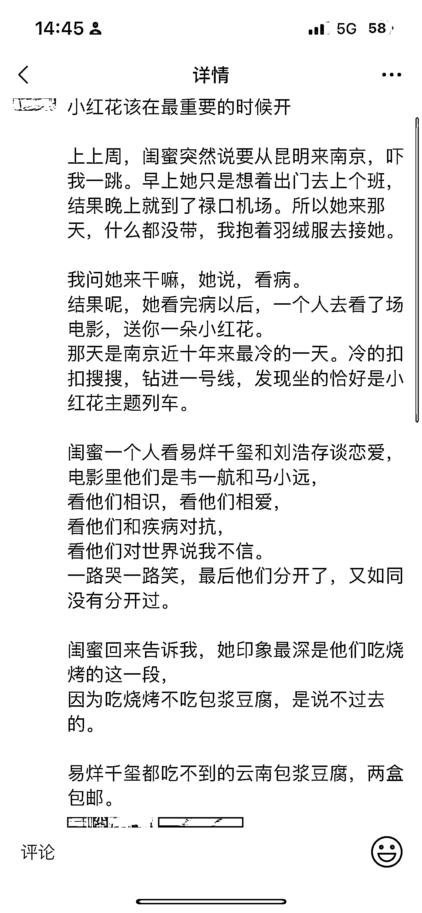  <ne-p id="ua4ada735" data-lake-id="ua4ada735"><ne-text id="ua572059a">这篇小作文收获了第一批好评。</ne-text></ne-p> <ne-p id="ua262c136" data-lake-id="ua262c136"><ne-card data-card-name="image" data-card-type="inline" id="C2veS" data-event-boundary="card">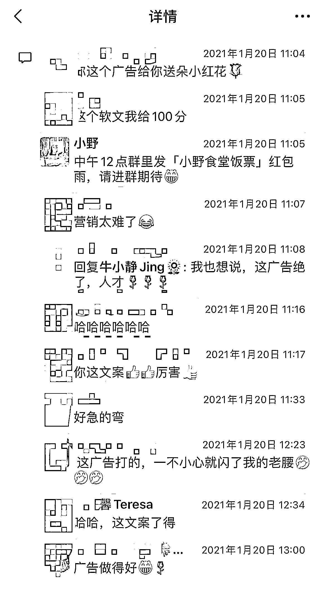  <ne-p id="uc2e24de7" data-lake-id="uc2e24de7"><ne-text id="ufec4f51f">也收获了第一个团的 63 个订单。</ne-text></ne-p> <ne-p id="u8d461420" data-lake-id="u8d461420"><ne-card data-card-name="image" data-card-type="inline" id="VUOg0" data-event-boundary="card">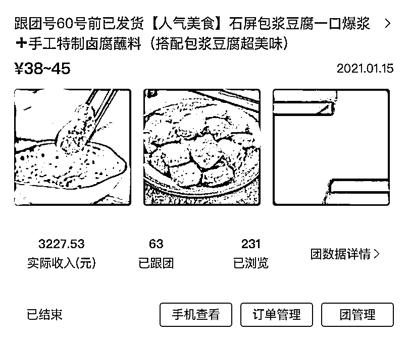  <ne-p id="u3e9716e8" data-lake-id="u3e9716e8"><ne-text id="u3083eb17">好好讲一个团品的故事，比单纯做硬广，更能吸引人。</ne-text></ne-p> <ne-p id="u913600df" data-lake-id="u913600df"><ne-text id="ub8c0ac77">那么，到底怎么样去讲一个团品的故事？</ne-text></ne-p> <ne-p id="ub8b37dce" data-lake-id="ub8b37dce"><ne-text id="u99cb62fa">分享我自己喜欢用的几种方式：</ne-text></ne-p> <ne-p id="uc47236ae" data-lake-id="uc47236ae"><ne-text id="u0210bf7e" ne-bold="true">1、结合当下热点讲。</ne-text><ne-text id="uc59ca7e2">比如我最开始推包浆豆腐时，就是抓住当下电影热点，通过影评引出产品；</ne-text></ne-p> <ne-p id="u6833775b" data-lake-id="u6833775b"><ne-text id="u199c2ddd" ne-bold="true">2、结合产品优势卖点讲。</ne-text><ne-text id="u8bef1285">产品优势和卖点是要反复去告诉用户的，不要指望发过一次用户就会都知道。可以在一段时间内集中 360 度展示一个团品，但不是机械地去讲卖点，而是把卖点融在场景里来讲。</ne-text></ne-p> <ne-p id="uc46d3bd0" data-lake-id="uc46d3bd0"><ne-card data-card-name="image" data-card-type="inline" id="OJrVw" data-event-boundary="card">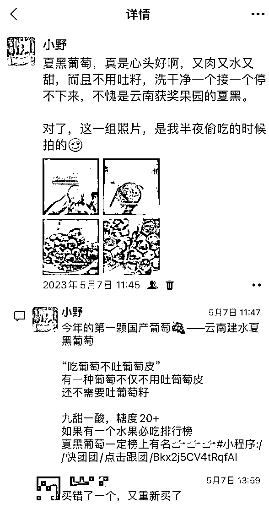  <ne-p id="u8191acd2" data-lake-id="u8191acd2"><ne-text id="ub62a6c49" ne-bold="true">3、结合用户痛点讲。</ne-text><ne-text id="uc809f641">除了产品卖点，更关键的是要结合用户痛点。即使是吃的，每个人吃它的理由都是不一样的。比如讲玉米，就不能只讲玉米的香糯和甜脆，要讲吃玉米粗粮可以让你瘦 10 斤。比如这条朋友圈，发了以后就秒开了十几单，这款玉米也是后来卖爆的一个小单品。</ne-text></ne-p> <ne-p id="uabaa90e7" data-lake-id="uabaa90e7"><ne-card data-card-name="image" data-card-type="inline" id="pcHpV" data-event-boundary="card">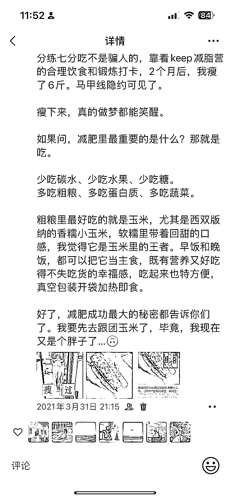  <ne-p id="u81333aef" data-lake-id="u81333aef"><ne-text id="uac40ee76">对每个团品，要思考什么用户在什么场景下可能会用到/吃到它，然后去把那个场景描绘或者展示出来，说到痛处了，用户自然就会下单了。</ne-text></ne-p> <ne-p id="ue8803b61" data-lake-id="ue8803b61"><ne-text id="u8ca8b786" ne-bold="true">4、结合自己的经历讲。</ne-text><ne-text id="ub8766373">团购跟其他业务场景不同的地方在于，团长有着天然的好物分享官的属性，核心推广的团品一定要自用/测品，并且把自用的场景和获益展示给用户看，这样去推荐才更有说服力。</ne-text></ne-p> <ne-p id="uc3a31ab9" data-lake-id="uc3a31ab9"><ne-card data-card-name="image" data-card-type="inline" id="tfCu1" data-event-boundary="card">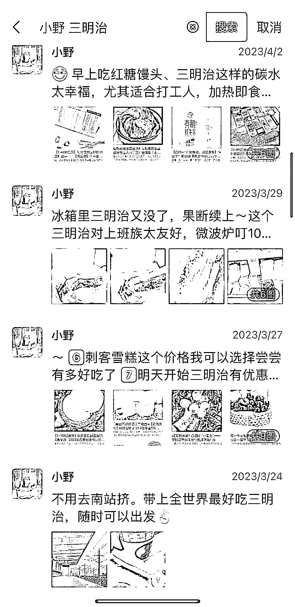  <ne-p id="u2b05bc5c" data-lake-id="u2b05bc5c"><ne-text id="u25ebe00e" ne-bold="true">2.2 要持续反复推一个好团品，植入心智</ne-text></ne-p> <ne-p id="ub7f8ee7a" data-lake-id="ub7f8ee7a"><ne-text id="u4dfe3ee6">后来，凭着我对包浆豆腐这个品的热爱，接下来的一段时间，我几乎每天都在朋友圈和社群里全方位给大家讲包浆豆腐有多好吃、怎么吃、有多受欢迎。</ne-text></ne-p> <ne-p id="ud1e9ee8c" data-lake-id="ud1e9ee8c"><ne-card data-card-name="image" data-card-type="inline" id="Lz4i2" data-event-boundary="card">  <ne-p id="u4b9c350b" data-lake-id="u4b9c350b"><ne-text id="ud9ab9962">也收到了一片好评，以至于到过年那几天不能发货，群里一片“哀嚎”。</ne-text></ne-p> <ne-p id="uea21ce95" data-lake-id="uea21ce95"><ne-card data-card-name="image" data-card-type="inline" id="xM6g7" data-event-boundary="card">  <ne-p id="u484bafe4" data-lake-id="u484bafe4"><ne-text id="u715d6a0c">其实那段时间，我也开团了其他云南美食，但是包浆豆腐我是去花了最多心思、最多时间的，销量自然也是最高的。</ne-text></ne-p> <ne-p id="uc8565c80" data-lake-id="uc8565c80"><ne-card data-card-name="image" data-card-type="inline" id="ICW2B" data-event-boundary="card">  <ne-p id="u98fb27ca" data-lake-id="u98fb27ca"><ne-text id="ufe580b49">这就告诉我们一件很重要的事，想要推出一个爆品，我们首先要讲好团品的故事，然后要持续反复的去推，这样才能在你私域的用户心里植入好产品的心智。</ne-text></ne-p> <ne-p id="u49e37c94" data-lake-id="u49e37c94"><ne-text id="u370bc671">除了过年两个月卖了 200 多单之外，后来我每个月都会开一个包浆豆腐的团，我后来发现团不能一直开着，一直开的话大家就失去了兴趣，觉得它很容易获得。所以，后来每个月只开一个星期，有限的时间里反复去推。</ne-text></ne-p> <ne-p id="u3e32a303" data-lake-id="u3e32a303"><ne-card data-card-name="image" data-card-type="inline" id="tzrlt" data-event-boundary="card"><ne-card data-card-name="image" data-card-type="inline" id="LB1D7" data-event-boundary="card">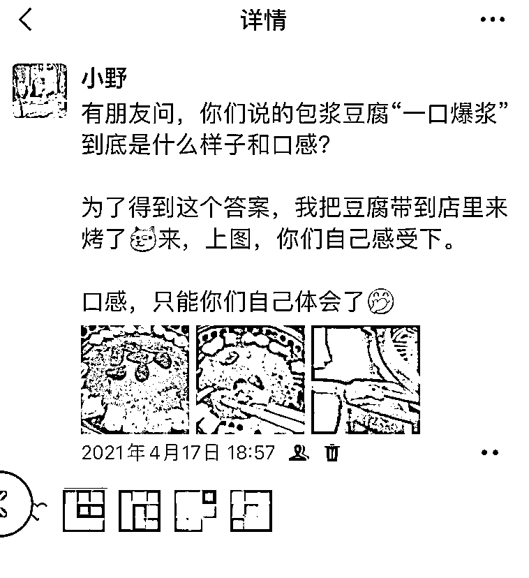  <ne-p id="uab0dc604" data-lake-id="uab0dc604"><ne-text id="ub369a391">后来因为产假结束开始上班了，投入时间变少了，每个月包浆豆腐只卖了几十单。但是，很有意思的是，当我长时间在朋友圈反复去推这个品的时候，每次都有新用户来下单，大家会有猎奇心态。</ne-text></ne-p> <ne-p id="uae54c866" data-lake-id="uae54c866"><ne-text id="u1781110a">同时，反复推同一个品，老客户复购也超级高，我很多网友如果想吃包浆豆腐，第一时间来找我。可以说，我应该是把云南包浆豆腐「代言人」的这样的人设在私域里立住了哈哈哈哈。</ne-text></ne-p> <ne-p id="u69aff67e" data-lake-id="u69aff67e"><ne-card data-card-name="image" data-card-type="inline" id="pQzvp" data-event-boundary="card">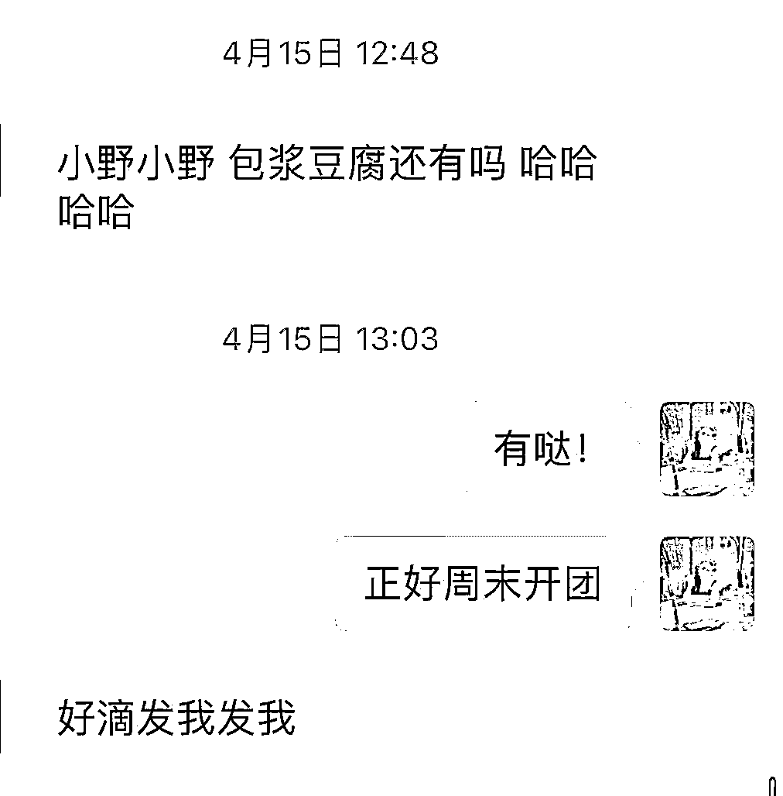<ne-card data-card-name="image" data-card-type="inline" id="iFmVw" data-event-boundary="card">  <ne-p id="u72d81c56" data-lake-id="u72d81c56"><ne-text id="ud8f44030">后来我的供应链发货太慢，我就很久没开团。直到我在去年 12 月航海里遇到了生财有术推荐的忘忧惠团，当我看到星宇他们开团了包浆豆腐，我眼睛立马亮了！！！立刻朋友圈发了一条。好在我的客户们没有忘记我，后来又卖了 70 多份包浆豆腐。</ne-text></ne-p> <ne-p id="ucca999b4" data-lake-id="ucca999b4"><ne-card data-card-name="image" data-card-type="inline" id="wD9BI" data-event-boundary="card">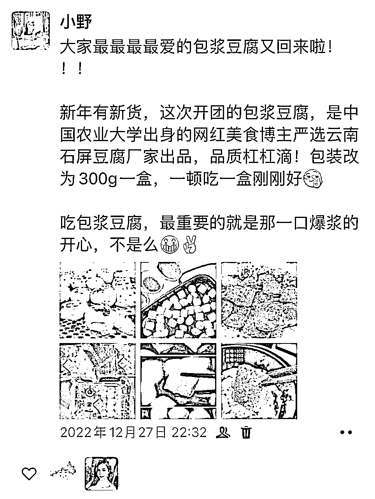<ne-card data-card-name="image" data-card-type="inline" id="gcSbb" data-event-boundary="card">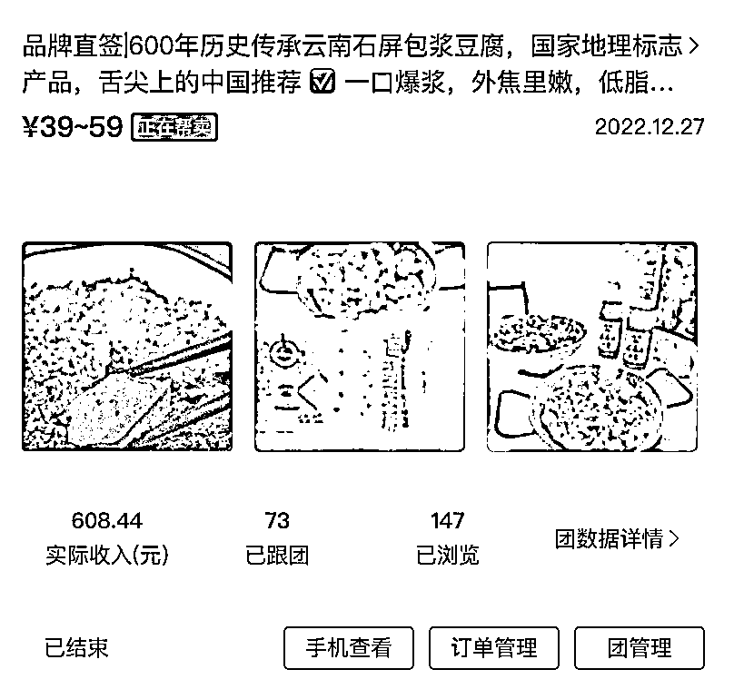  <ne-p id="uab931122" data-lake-id="uab931122"><ne-text id="u97134309">定位和心智这件事在私域里一旦立住了，就等于收获了客户的喜欢和信任。</ne-text></ne-p> <ne-p id="udb0b4915" data-lake-id="udb0b4915"><ne-text id="ufe559e15" ne-bold="true">2.3 把团品当奖品或礼物，既是运营、也是种草</ne-text></ne-p> <ne-p id="u74ebd006" data-lake-id="u74ebd006"><ne-text id="uada95650">大家应该都知道团购社群里免不了做一些抽奖、送礼物的运营动作。那么到底选择什么礼物作为奖品呢？</ne-text></ne-p> <ne-p id="u0a4a3f28" data-lake-id="u0a4a3f28"><ne-text id="u228f5d46">我觉得最好的运营方式，就是把我们要推的团品，当作奖品或礼物。当我们把要推广团品作为奖品时，其实也是多了一次触达用户的机会。抽奖前，总要介绍下奖品是什么吧，那么就等于我们再一次向用户去介绍了团品。而参与抽奖的人，哪怕没有抽中，但他也再次被种草了，就可能去下单。</ne-text></ne-p> <ne-p id="ude65d175" data-lake-id="ude65d175"><ne-text id="u8135284d">此外，也可以把团品送给想要维护的 vip 客户试吃/试用，继续种草。我今年 5 月份就把忘忧惠的云澜挂耳咖啡，作为礼物给我 60 多个 vip 客户都分别送了一份，后来的确也带来了不少心智植入和复购，现在不少客户在等着云澜咖啡复团。</ne-text></ne-p> <ne-p id="u8b0e714b" data-lake-id="u8b0e714b"><ne-card data-card-name="image" data-card-type="inline" id="zu0To" data-event-boundary="card"><ne-card data-card-name="image" data-card-type="inline" id="QnUe8" data-event-boundary="card">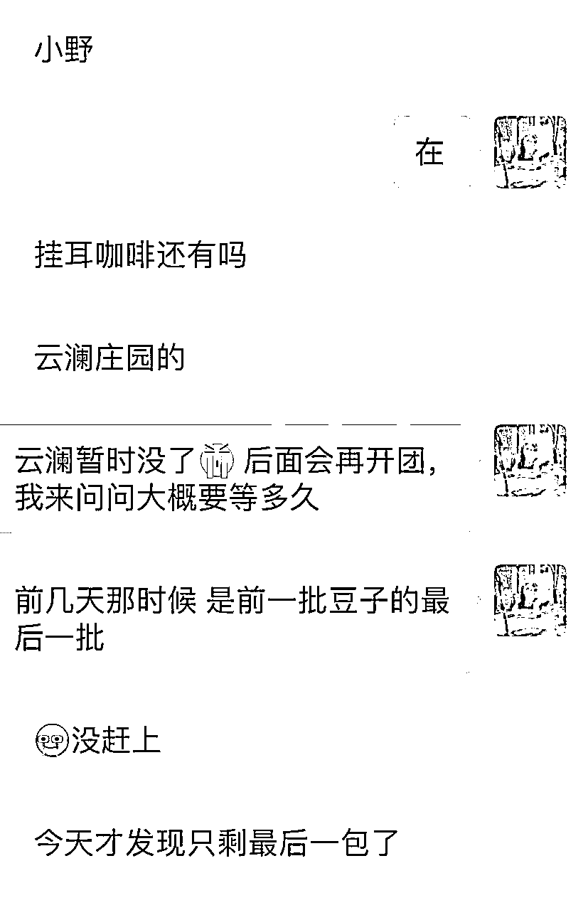  <ne-p id="ub4be21ce" data-lake-id="ub4be21ce"><ne-text id="u6c1ef8e8" ne-bold="true">2.4 收集好评反馈，别人说好才是真的好</ne-text></ne-p> <ne-p id="u9ed93261" data-lake-id="u9ed93261"><ne-text id="u4389b320">最早开团包浆豆腐时，我是没想到能收到很多好评的，但我知道，好评和反馈图一定要存好，反复利用起来。因为好评反馈是促进新用户下单和老客户复购的很重要的证据链。</ne-text></ne-p> <ne-p id="u0ea403be" data-lake-id="u0ea403be"><ne-card data-card-name="image" data-card-type="inline" id="eX5jw" data-event-boundary="card"><ne-card data-card-name="image" data-card-type="inline" id="mBT6d" data-event-boundary="card">  <ne-p id="u72c2e74e" data-lake-id="u72c2e74e"><ne-text id="u5ef37f61">团购这件事的底层逻辑在于信任团长和从众心理，因此，除了产品价值以及团员对团长信任外，好评反馈对于促进下单占了非常大的影响比重。毕竟，别人说好才是真的好 。所以在集中推一个团品时，一定要收集客户对团品的好评反馈然后截图。</ne-text></ne-p> <ne-p id="u67f52d74" data-lake-id="u67f52d74"><ne-text id="uc4b0c195">如果没有好评怎么办？没有好评，那就想办法创造好评。方法有很多种：</ne-text></ne-p> <ne-p id="u1f3b7df0" data-lake-id="u1f3b7df0"><ne-text id="udf778b8f">方法一：有客户下单后，主动去问问收货情况，表达关心，同时收集好评；</ne-text></ne-p> <ne-p id="uebaaf3af" data-lake-id="uebaaf3af"><ne-text id="u2f4da304">方法二：擅用小号，上个月我让家人用他们的微信号在我团里下单云南小芒果，然后收货以后去群里发图和好评，每次他们一发反馈，就能带动好几个客户下单。真的，好评促单，亲测有效；</ne-text></ne-p> <ne-p id="u39bb9ec8" data-lake-id="u39bb9ec8"><ne-text id="u26ac2486">方法三：我带荔枝到办公室给同事分享，然后让关系好的几个同事，每人在微信上给我一个好评反馈，素材和证据这就有了（当然，前提是产品本身足够优秀）。</ne-text></ne-p> <ne-p id="ubd26ae95" data-lake-id="ubd26ae95"><ne-text id="u9180d832" ne-bold="true">2.5 有了自己爆品后，再去做选品拓展和领域延伸</ne-text></ne-p> <ne-p id="u2d7efced" data-lake-id="u2d7efced"><ne-text id="u78fe9120">刚开始，我的美食团定位只做云南美食，也做出过自己团里的几个小爆品，除了包浆豆腐，还有咖啡、鲜花饼、西双版纳玉米、云南米线……分别都自己开团卖了一两百单。</ne-text></ne-p> <ne-p id="ucd0e8787" data-lake-id="ucd0e8787"><ne-text id="u6b93ce8f">但因为我自己一个人又做供应链开团、又要做营销，实在忙不过来，而当时做云南美食供应链的大团长并不多，能帮卖的团很少，于是我决定做选品拓展和领域延伸，我把定位从云南美食拓展到了全国特色美食。</ne-text></ne-p> <ne-p id="uba9a0dc4" data-lake-id="uba9a0dc4"><ne-card data-card-name="image" data-card-type="inline" id="gx6NO" data-event-boundary="card">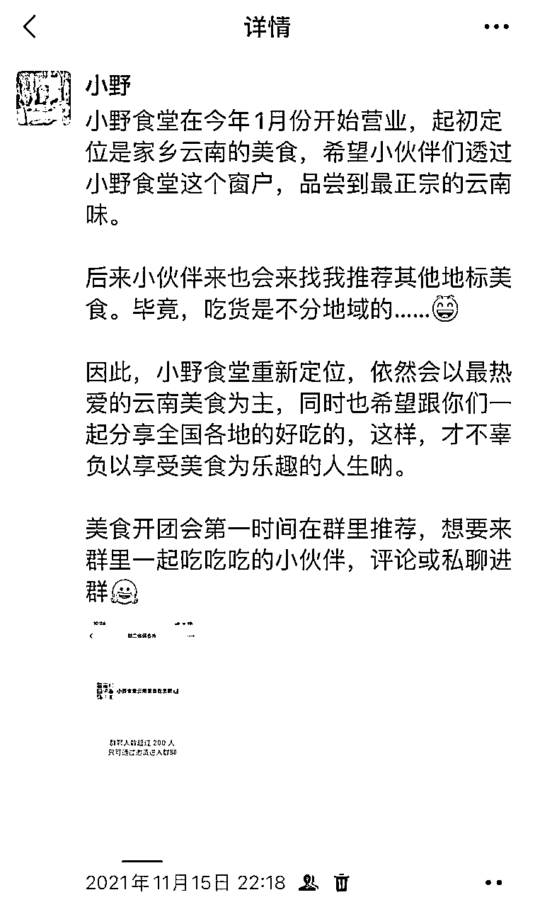  <ne-p id="u4c1a63b2" data-lake-id="u4c1a63b2"><ne-text id="ueffa9702">我那会儿纠结过到底要不要做定位的延展，后来想明白了，在有了自己私域定位和爆品后，再去做延展其实是不突兀的。只要讲清楚你为什么要做、有什么立场去做就可以了。</ne-text></ne-p> <ne-p id="u4592b1cc" data-lake-id="u4592b1cc"><ne-text id="ubce1b0a2">前面说，刚开始不要着急推太多品，要集中去推属于自己的爆品；而当有了爆品后，也不要怕去拓展选品和领域，大大方方做生意，兢兢业业去挣钱。</ne-text></ne-p> <ne-p id="u2f91ab85" data-lake-id="u2f91ab85"><ne-text id="u49fd48a7" ne-bold="true">三、不仅要拓展选品、也要引流扩大用户数</ne-text></ne-p> <ne-p id="ufa56b10b" data-lake-id="ufa56b10b"><ne-text id="u70139c90">决定社群团购业绩的，除了复购率，还有用户数量。那么，团长必不可少的一个运营动作就是持续引流。</ne-text></ne-p> <ne-p id="ubd959ced" data-lake-id="ubd959ced"><ne-text id="u061bc405">大家可能都有这个困惑，做社群团购到底怎么引流？我分享几个自己用过的引流方法：</ne-text></ne-p> <ne-p id="u7000fbbf" data-lake-id="u7000fbbf"><ne-text id="ub885f052" ne-bold="true">1.、从公域里吸引同频的人</ne-text></ne-p> <ne-p id="u771bfae5" data-lake-id="u771bfae5"><ne-text id="ua18c58a0">我从小红书引流，是从备孕就开始的。在真实记录自己生活的同时，可以把自己关心的事情，用心加工输出成为对别人有价值的内容。我认为这是我们普通人做引流这件事最容易做到的了，因为选题、素材就在你的生活里，吸引来的也是同频和精准的流量。虽然我的小红书目前为止只有 700 多粉丝，但引流到微信私域的粉丝应该有一两千人，也让我成功变现了近 40 万利润。</ne-text></ne-p> <ne-p id="u090a7be1" data-lake-id="u090a7be1"><ne-text id="uebfeb17c">举个例子，我在生孩子之前，发现鼓楼医院竟然没有官方孕妈交流群，于是我发了一篇小红书笔记「南京鼓楼医院助产士才会告诉你的待产注意事项」，就这一篇帖子，帮我建了一个近 500 人的鼓楼医院孕妈交流群。后来我的母婴团购群，就是这样建起来的，孕妈交流群里大多数人，后来理所当然地都成了我母婴团购群的客户。</ne-text></ne-p> <ne-p id="u7d867d38" data-lake-id="u7d867d38"><ne-card data-card-name="image" data-card-type="inline" id="hPtOe" data-event-boundary="card">  <ne-p id="u36d62a1f" data-lake-id="u36d62a1f"><ne-text id="u3256561d" ne-bold="true">2\. 从自建的主题交流社群引导到团购群</ne-text></ne-p> <ne-p id="u70ad92f0" data-lake-id="u70ad92f0"><ne-text id="ue3674064">围绕某类用户的需求和周期，是可以建很多种主题交流群的，比如围绕母婴这个群体，从备孕群、怀孕群，到妈妈交流群以及二手闲置群等等。</ne-text></ne-p> <ne-p id="u34156619" data-lake-id="u34156619"><ne-text id="u943757b1">当有了自己的群以后，怎么引导到团购群里呢？</ne-text></ne-p> <ne-p id="u0dca5897" data-lake-id="u0dca5897"><ne-text id="ud4400852">一种方法是，通过正式发布告知大家群主做了一个团购群，并且以分享的方式讲清楚为什么要做团购群、自己有什么优势/背景可以做好这件事、可以为大家提供什么价值和服务，这样应该能转化一批人进群。大多数情况下，用户是不会排斥群主做这件事的。就算有人排斥也没关系，这也是个双向选择的过程。</ne-text></ne-p> <ne-p id="ueb31dc29" data-lake-id="ueb31dc29"><ne-card data-card-name="image" data-card-type="inline" id="yq0Bq" data-event-boundary="card">  <ne-p id="uf67e5f86" data-lake-id="uf67e5f86"><ne-text id="u2078db7f">一种方法是通过群公告让进群这件事成为日常，在正式发过一次另建团购群的分享后，可以把这件事挂在日常群公告里，本来的主题交流群在运营过程里，只要有人进群就需要再次发公告，那么就有人会看到你还有团购群这件事，感兴趣的人自然会找你进群。</ne-text></ne-p> <ne-p id="u22918d18" data-lake-id="u22918d18"><ne-card data-card-name="image" data-card-type="inline" id="AM19k" data-event-boundary="card">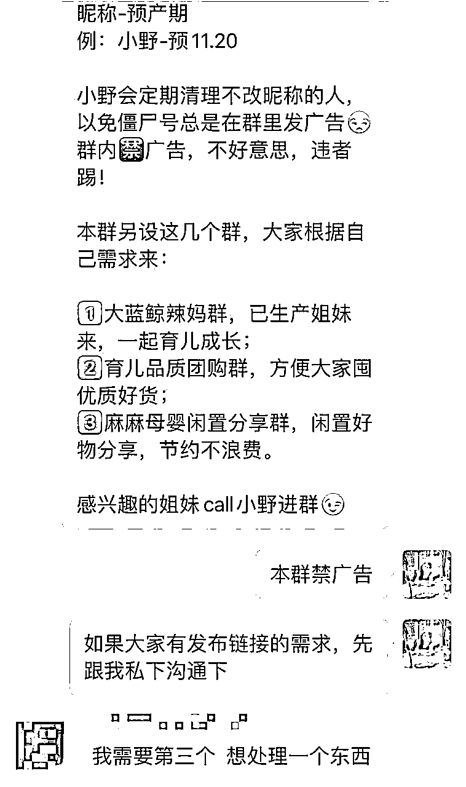  <ne-p id="u3459ff60" data-lake-id="u3459ff60"><ne-text id="ua4dd5969" ne-bold="true">3、从你线下的圈子引流</ne-text></ne-p> <ne-p id="udb5bcdec" data-lake-id="udb5bcdec"><ne-text id="u751a5c2c">做团购社群还有个很天然适合引流的场景，就是线下圈子，例如跟你同一个小区、跟你孩子同一个学校、跟你参加了同一次活动……</ne-text></ne-p> <ne-p id="uf9868939" data-lake-id="uf9868939"><ne-text id="ud9fede6b">我前几年办了一场线下行业会议，当时建了一个现场群用来给大家发现场讲者的 PPT，我把个人二维码放在了大屏幕上，只有加我微信才能进群，于是那场会我加了 300 多个同行业的人。</ne-text></ne-p> <ne-p id="u3f2246b9" data-lake-id="u3f2246b9"><ne-text id="u114b0eac">类似思路都可以用起来。比如积极参与组织线下活动，找个契机加到参与活动所有人的微信；比如在小区做一次试吃活动、或是公益玩具赠书，然后加到同小区的邻居微信；甚至直接建一个小区团购群，虽然现在每个小区很多团购群，但有差异化的好产品和好服务依然是稀缺的。</ne-text></ne-p> <ne-p id="ue6def920" data-lake-id="ue6def920"><ne-text id="u0995c6ed" ne-bold="true">四、当用户和团品多了，也不要忘记初心</ne-text></ne-p> <ne-p id="ua3d4766a" data-lake-id="ua3d4766a"><ne-text id="u04da001f">我做团购 2 年多，无论是美食团、还是母婴团，每天会保持一定数量的团品上新开团。可有段时间我开始迷茫，每天开团、每天发素材，都在机械化地运营，离当初那个充满热情、卖家乡美食的自己越来越远。</ne-text></ne-p> <ne-p id="u0d658ba1" data-lake-id="u0d658ba1"><ne-text id="ud7b26af7">后来当我在回顾复盘当初怎么卖包浆豆腐、怎么把团购做起来时，我突然意识到，团购的特点决定了团品品类繁多，但我们的团购爆品不能只有几个，团购的销量业绩是由无数个细分领域的爆品组成的。</ne-text></ne-p> <ne-p id="u5a4cb26d" data-lake-id="u5a4cb26d"><ne-text id="uc4388568">不管每天能开团多少个品，我们都应该在一段特定时间内，抓住主要的核心团品作为主线去推，集中、密集地给用户植入心智，这样才能去让用户持续去信任你，形成持续的口碑，然后团购这个雪球得以越滚越大。</ne-text></ne-p> <ne-p id="u61b2c220" data-lake-id="u61b2c220"><ne-text id="ue905be5a">日常推广核心团品的节奏可以是这样：预热种草-开团宣传-自用分享-客户好评-促单复购。按照这个节奏一步步走，很难不爆单。</ne-text></ne-p> <ne-p id="u08635f1b" data-lake-id="u08635f1b"><ne-text id="uf70d3a6b" ne-bold="true">五、最后总结一下，如何通过一个小小的团品来启动并扩大快团团这个项目？</ne-text></ne-p> <ne-p id="ud9739d38" data-lake-id="ud9739d38"><ne-text id="ue0f8667b" ne-bold="true">第一点：打造属于你的爆品。</ne-text></ne-p> <ne-p id="u3fb693dc" data-lake-id="u3fb693dc"><ne-text id="u9a88baaa">对新手团长来说，结合好你的私域定位，先集中打造出几个爆品。爆品不一定非得是成百上千单才可以，而是在你的选品中跑出来数据是相对比较优秀的，形成口碑，让客户信任你。</ne-text></ne-p> <ne-p id="u025277f4" data-lake-id="u025277f4"><ne-text id="u8c28cf3d" ne-bold="true">第二点：拓展丰富你的选品。</ne-text></ne-p> <ne-p id="u3de7abac" data-lake-id="u3de7abac"><ne-text id="u6a24befb">有了属于你自己的爆品后，可以大方地去拓展选品，通过更多细分领域的爆品，让客户继续对你有粘性。如果需要，甚至可以重新定位你的私域 IP。</ne-text></ne-p> <ne-p id="u3483c029" data-lake-id="u3483c029"><ne-text id="u5a6cf9b5" ne-bold="true">第三点：持续引流、持续爆单。</ne-text></ne-p> <ne-p id="u40cc0d11" data-lake-id="u40cc0d11"><ne-text id="u476ae2ed">找到属于自己的同频流量，输出内容也好、线下沟通也罢，引流这个动作始终要持续去做，把流量持续注入到团购群里，然后持续爆单。</ne-text></ne-p> <ne-p id="u332ee2ce" data-lake-id="u332ee2ce"><ne-text id="u5af446d1" ne-bold="true">第四点：不忘初心，保持热爱。</ne-text></ne-p> <ne-p id="ue60efec0" data-lake-id="ue60efec0"><ne-text id="u032f96fe">把每一个值得的团品都当作爆品去推，用户会感受到你对团品的重视、用心、和热爱。当无数个小小的团品汇在一起，终将成就属于团长的口碑和财富。</ne-text></ne-p> <ne-p id="u099e77ca" data-lake-id="u099e77ca"><ne-text id="u0fa1622f">最后，感谢从去年到今年生财的快团团航海项目，遇到了有趣又厉害的教练@星宇、@深藏 blue…以及有趣的领队和志愿者，@筱媛、@九儿…收货满满！</ne-text></ne-p> <ne-p id="u71043310" data-lake-id="u71043310"><ne-text id="udd3e6bec">感谢 @梁靠谱、@张亚萨和@芷蓝对这次复盘分享的修改建议和指导，也感谢@亦仁大大给团长提供了那么多好的团购资源！团购这条路还很漫长，也非常值得深耕，让我们一起走下去啊。</ne-text></ne-p> <ne-hole id="u1c03e9c1" data-lake-id="u1c03e9c1"><ne-card data-card-name="hr" data-card-type="block" id="d4zVR" data-event-boundary="card"><ne-p id="u642e5fb4" data-lake-id="u642e5fb4"><ne-text id="u9bed973a">评论区：</ne-text></ne-p> <ne-p id="u8e17ea02" data-lake-id="u8e17ea02"><ne-text id="u630d66ad">小田 : 第二个链接没有权限</ne-text> <ne-text id="u3fb30c7a">小野 : 我把内容重新放文章里了，现在可以看到了吗？</ne-text> <ne-text id="u2ac4bd9f">小田 : OK 了</ne-text> <ne-text id="u000b462c">小野 : 😊</ne-text> <ne-text id="u83680b00">芷蓝 : 哈哈，太牛了！</ne-text> <ne-text id="u7d83ae25">做团购卖的就是生活方式，让商品在场景里出现，让自己的风格在卖货的过程中展现。</ne-text> <ne-text id="u7c305efe">卖货要有一个目的，一个目的就是一个故事，一个故事就是自己的背书</ne-text> <ne-text id="u27ddaa3b">小野 : 嘿嘿，蓝姐说得对！团购就是在卖自己的生活方式[害羞]</ne-text> <ne-text id="u6ffb1648">自律更自由 : 写的太好了，我也想买</ne-text> <ne-text id="u51852a09">梁靠谱 : 野总 yyds 啊</ne-text></ne-p></ne-card></ne-hole></ne-card></ne-p></ne-card></ne-p></ne-card></ne-p></ne-card></ne-p></ne-card></ne-card></ne-p></ne-card></ne-card></ne-p></ne-card></ne-card></ne-p></ne-card></ne-card></ne-p></ne-card></ne-card></ne-p></ne-card></ne-p></ne-card></ne-p></ne-card></ne-p></ne-card></ne-p></ne-card></ne-p></ne-card></ne-p></ne-card></ne-p></ne-card></ne-p></ne-card></ne-p></ne-card></ne-p></ne-card></ne-p>