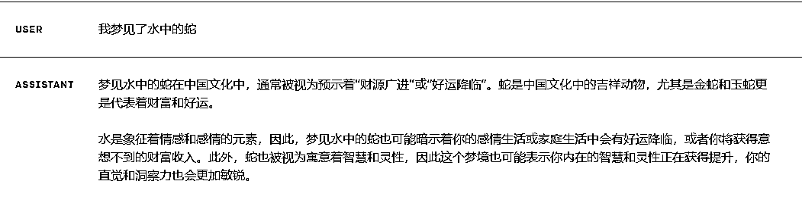
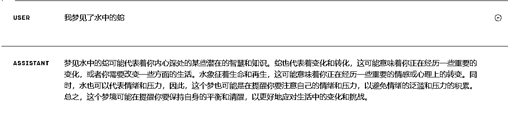
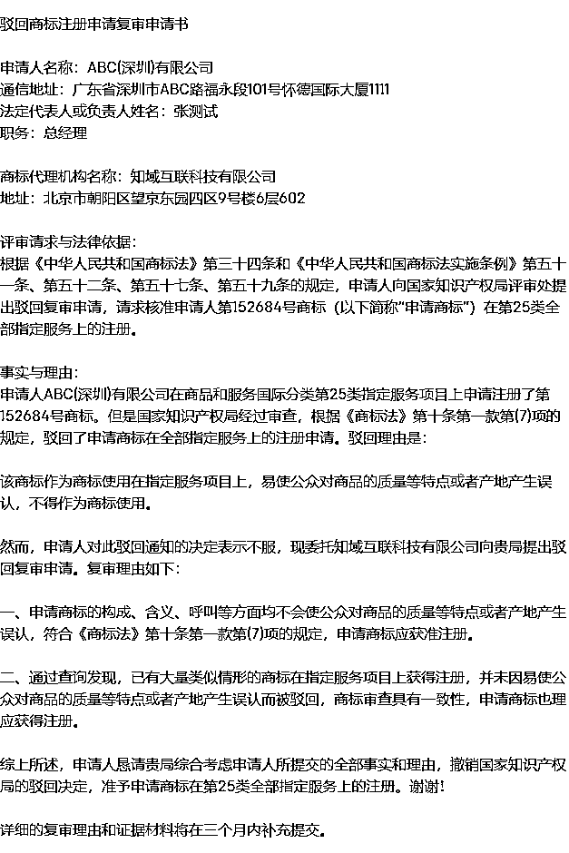

# 深度解析 ChatPAN：基于语料的 AI 聊天工具的设计与落地过程

> 原文：[`www.yuque.com/for_lazy/thfiu8/uodwzdimc055c7n1`](https://www.yuque.com/for_lazy/thfiu8/uodwzdimc055c7n1)

<ne-h2 id="5a780472" data-lake-id="5a780472"><ne-heading-ext><ne-heading-anchor></ne-heading-anchor><ne-heading-fold></ne-heading-fold></ne-heading-ext><ne-heading-content><ne-text id="u04ca3bac">(精华帖)(40 赞)深度解析 ChatPAN：基于语料的 AI 聊天工具的设计与落地过程</ne-text></ne-heading-content></ne-h2> <ne-p id="u27192640" data-lake-id="u27192640"><ne-text id="u1f327486">作者： 大铭🍀</ne-text></ne-p> <ne-p id="u564c2036" data-lake-id="u564c2036"><ne-text id="u4260741b">日期：2023-07-07</ne-text></ne-p> <ne-p id="ub8e1fcf2" data-lake-id="ub8e1fcf2"><ne-text id="ub2a2ae09">深度解析 ChatPAN：基于语料的 AI 聊天工具的设计与落地过程</ne-text></ne-p> <ne-p id="u4d024f69" data-lake-id="u4d024f69"><ne-text id="u640e7be9">6 月 7 日《深度解析</ne-text> <ne-text id="ufb116c2e">ChatPAN</ne-text><ne-text id="udf034b37">：基于语料的</ne-text> <ne-text id="u73256530">AI</ne-text> <ne-text id="ub310055e">聊天工具的设计与落地过程》@大铭</ne-text><ne-text id="u11269efb">一、</ne-text><ne-text id="u967e0823">ChatPAN</ne-text> <ne-text id="u9d0536d7">缘起</ne-text><ne-text id="ud116d175">大家晚上好，</ne-text><ne-text id="uf3211e10">我是大铭，一直在生财潜水</ne-text><ne-text id="u43a9b59c">，感谢生财的邀请来和大家做分享</ne-text><ne-text id="u2987497b">。</ne-text><ne-text id="ucee63dd5">先做个介绍，我是程序员出身，初中开始写程序，拿到过天津市程序设计奥赛一等奖。后来在大厂、豆瓣都待过，也在硅谷短暂创业。回国后加入月嫂公司，通过数字化的方式，2 年时间把月嫂公司从每个月 15 万收入不到增长到 1000 万每个月。</ne-text><ne-text id="uec56f09c">在今年 3 月开始研究 ChatGPT，做了很多技术上的尝试，也有一些产品的思考。现在正在开发 ChatPAN.ai 这个产品</ne-text><ne-text id="u92522d45">1.1</ne-text> <ne-text id="u85459cc3">研究</ne-text> <ne-text id="u7735f4c9">Prompt</ne-text> <ne-text id="ube3925a5">还是研究</ne-text> <ne-text id="u49ab5a9c">API</ne-text><ne-text id="u137342f8">？</ne-text><ne-text id="u3e98e692">在上次参加航海的时候，我开始正式研究 ChatGPT，因为感觉已经有点晚了。</ne-text><ne-text id="u9dfdf58f">当时我注意到了一种普遍的现象：许多人已经在制作基于 ChatGPT 的</ne-text> <ne-text id="u2900cf93">Prompt</ne-text> <ne-text id="uaf047d75">套壳。简单有效，能够将这个强大的</ne-text> <ne-text id="ud3a7157b">AI</ne-text> <ne-text id="u62fa1086">模型应用到各种场景中。</ne-text><ne-text id="u2b84569c">但是这个太薄了，而且想做出来估计也就是一周两周的时间，所以我跳过了对</ne-text> <ne-text id="u975b8836">Prompt</ne-text> <ne-text id="uc0db0613">之类的学习，直接开始从接口</ne-text> <ne-text id="u214b3d91">API</ne-text> <ne-text id="ud659778a">下手看还有没有什么机会。</ne-text><ne-text id="u55b43314">我认为</ne-text> <ne-text id="uf9e62de2">API</ne-text> <ne-text id="ua21aefea">是一种更为灵活和强大的工具，它可以让我更深入地探索和利用 ChatGPT 的能力。而且，通过 API，我可以更加灵活地集成和定制 ChatGPT 的功能，从而做一些不一样的产品。</ne-text><ne-text id="ufb68ad86">1.2</ne-text> <ne-text id="u7055f3ba">技术实验 & 产品需求</ne-text><ne-text id="ue69bcb91">1.2.1</ne-text> <ne-text id="u7073351d">技术实验的坑</ne-text><ne-text id="u56a59aed">在前期的实验中，我大概遇到了以下这些坑：</ne-text><ne-text id="ue37a5a6c">封号，封</ne-text> <ne-text id="u9ee4e78b">API</ne-text><ne-text id="u9fd3c0e3">同一个 IP ，不断轮询换 Key 请求，会把这个 IP 放入黑名单，然后这个 IP 粘过的 key 对应的账号全都被封杀</ne-text><ne-text id="u0c95833d">completion 接口 vs chat 接口</ne-text><ne-text id="u7d159152">刚开始研究的时候还没有 chat 接口，全部是使用 completion 接口进行访问。 就必须自己定义身份的定义词， STOP 词等。有了 chat 接口就简单很多，但同时也更容易理解一些对 OpenAI 的调用方式</ne-text><ne-text id="u4deacec2">。</ne-text><ne-text id="u009abd22">Fine</ne-text> <ne-text id="u5f388a3a">Tuning</ne-text> <ne-text id="u3f4ed620">vs embedding</ne-text><ne-text id="u2ff61aa0">Fine Tuning 是第一时间想到的方式，也做了测试，1 万字需要花费 3-5 美金，测出来效果很奇怪。而且需要很大的验证集进行验证，但是一般我们是没有这种数量的验证集的。如果能够覆盖全部的场景倒是没问题，但是我们无法完全涵盖业务</ne-text><ne-text id="u40c1345a">中</ne-text><ne-text id="ubb2378e7">可能的场景</ne-text><ne-text id="u0679e9b5">。</ne-text><ne-text id="u32883554">如何使用 embedding</ne-text><ne-text id="uf569d886">本地保存向量</ne-text><ne-text id="u03917f70">使用数据库工具</ne-text><ne-text id="u110766e5">坑可以快速掠过，</ne-text><ne-text id="u955fed8a">我这个阶段</ne-text><ne-text id="u3fd35143">最大的收获</ne-text><ne-text id="u892ebc67">，</ne-text><ne-text id="u46b0af72">是对调用和一些底层的机制有了很大的了解</ne-text><ne-text id="u45a346ff">。</ne-text><ne-text id="uc8ad0df4">1.2.2 对一个客服</ne-text><ne-text id="u88c15f6f">产品需求的</ne-text><ne-text id="u87668c56">初步</ne-text><ne-text id="u1a0ee9c3">思考</ne-text><ne-text id="uce6c0f03">我在看市面上已有的工具产品时，发现</ne-text><ne-text id="u27970a7b">这时候网上已经开始有 ChatPDF 等产品出现了，从这些产品上看，很容易看到是一个基于文件的问答，如果把一个单独的文件转换成多个文件的支持，这就是一个非常方便的客服的雏形。</ne-text><ne-text id="uf9f2de50">如果我们看手册可以发现，需求的来源是有如下的几个方面的，这里感谢 @刘小排</ne-text><ne-text id="u68d9a285">💡</ne-text><ne-text id="ue3dec3d3">✅原生 idea ★★★★★</ne-text><ne-text id="u13c256a9">✅抄竞品做出差异化 ★★★★</ne-text><ne-text id="uffa3822b">✅通过关键词挖掘需求 ★★★</ne-text><ne-text id="ub4a2a885">✅通过痛点挖掘需求 ★★★</ne-text><ne-text id="ue97be64e">✅通过围绕平台挖掘需求 ★★★</ne-text><ne-text id="u0c68ec8d">✅通过围绕自身需求拓展需求 ★★★</ne-text><ne-text id="u53a33cc5">✅个性化需求定制 ★★</ne-text><ne-text id="u27ce5ecf">✅重点关注：ChatGPT 相关工具站需求挖掘</ne-text><ne-text id="u238dbf04">从我自己的场景出发，</ne-text><ne-text id="u2a3b0077">我是做母婴服务生意的，现在可以应用的场景有公司的月子中心 5 个，月嫂公司 1 个，朋友的月嫂联盟 20-30 家，这个基础的用户量是可以有保障的。</ne-text><ne-text id="u1cae4c02">所以</ne-text><ne-text id="ud21f468a">我可以确定我做出来的东西一定会有人用，而且这个应用场景还不会很小</ne-text><ne-text id="u01ca278f">。</ne-text><ne-text id="u2d54eabd">然后我进行了初次的产品功能</ne-text><ne-text id="uad099022">抽象</ne-text><ne-text id="u3cdd2b2b">提炼：</ne-text><ne-text id="u149e5da4">完全是基于语料库进行后续的操作，结合特定的内容填充至 ChatGPT</ne-text><ne-text id="ufda61e7e">。</ne-text><ne-text id="ufb0b5177">凡是需要有自己的语料库进行处理，就可以使用类似的技术</ne-text><ne-text id="uccc438f9">。</ne-text><ne-text id="u3b37c2d2">抽象</ne-text><ne-text id="uf5167f29">提炼完成后，我发现一个很多开发者都会碰到的问题：</ne-text><ne-text id="u6fb663a1">虽然这个产品已经具备了解决实际问题的</ne-text><ne-text id="u263977c6">能力，但是用户</ne-text><ne-text id="u1a6a06fd">还是有可能</ne-text><ne-text id="ufa1dfc73">看不懂</ne-text><ne-text id="ud2afd4d7">，不会用</ne-text><ne-text id="u5473f146">。</ne-text><ne-text id="u0fc4765e">很多工具从开发者的角度，是能够看明白可以应用在很多的场景下的，但是从用户的角度是看不到也看不懂的，因为用户看不到技术的深度，也无法想象技术可以延展的点。</ne-text><ne-text id="u2191c2b9">比如对企业知识库的问答、客服系统、名人的角色扮演，都可以利用基于语料库 + 特定 prompt 的方式来做。技术上很类似，但是场景差异很大。</ne-text><ne-text id="uc1067424">如果不能把场景展示给用户，用户是无法明白可以利用这些技术来干什么。</ne-text><ne-text id="u86d3ead9">换言之，如果你只给技术，用户不知道怎么用。</ne-text><ne-text id="u9c27a756">用户只能看懂自己熟悉的东西，然后做一些变化。如果你给他一个拥有很多</ne-text><ne-text id="ucdd11af8">新</ne-text><ne-text id="ud928c783">功能的产品，更像工具的产品，用户是不知道怎么用的</ne-text><ne-text id="u21c69e34">。</ne-text><ne-text id="ud5a481b9">比如：</ne-text><ne-text id="ubb122e75">你给用户用乐高组装好的变形金刚，用户很爽</ne-text><ne-text id="u5e2f9ed3">；</ne-text><ne-text id="u6f9e1db3">你给一堆散件乐高和组装说明书，少数用户愿意这么干</ne-text><ne-text id="u0af99f78">；</ne-text><ne-text id="u661b6221">你给用户一堆乐高，告诉他释放你的想象力吧，用户说这是个啥啊</ne-text><ne-text id="u825b6b39">；</ne-text><ne-text id="u81851e74">所以，</ne-text><ne-text id="u1a623350">用户需要的是场景落地</ne-text><ne-text id="ufd528dd3">。</ne-text><ne-text id="u044977dc">因此我现在也</ne-text><ne-text id="u01edf5b7">还在寻找真正的落地场景</ne-text><ne-text id="ub9793c75">。</ne-text><ne-text id="ucbb02047">二、</ne-text><ne-text id="u071870ef">实验室代码</ne-text><ne-text id="uaecfad8f">尝试</ne-text><ne-text id="ud3dd3eba">2.1 尝试一：通过微调数据进行训练</ne-text><ne-text id="u7a529bc1">首先看到的是 Fine</ne-text> <ne-text id="u907f9d87">Tuning</ne-text> <ne-text id="ubdf7f7d7">这种方式，对数据进行微调，但是失败了</ne-text><ne-text id="uc29a2ef1">💡</ne-text><ne-text id="u430d7ae4">Q: 到家月嫂提供什么服务？</ne-text><ne-text id="uc2869a3f">A: 到家月嫂是一个非常纯洁的工作</ne-text><ne-text id="u105d15b7">原因是需要一个很大的验证集，每次训练的成本是</ne-text><ne-text id="u0cba64cb">1 万字</ne-text> <ne-text id="u016de9a7">3-5 美金，但是不知道需要训练多少时间。</ne-text><ne-text id="ue36fed49">2.2 尝试二：</ne-text><ne-text id="u480a7cbd">抄作业， How ChatPDF works</ne-text><ne-text id="uc4e2f2da">发现了很多的类似的</ne-text> <ne-text id="u38784802">G</ne-text><ne-text id="u74372f8e">it</ne-text><ne-text id="u2ba09345">H</ne-text><ne-text id="u62ee9734">ub 的项目</ne-text><ne-text id="u37dfc455">，</ne-text><ne-text id="u4f78d5e1">比如向  Naval 提问</ne-text><ne-text id="u3bf4c151">：</ne-text><ne-text id="ubce76a8c">https://github.com/mckaywrigley/naval-gpt</ne-text><ne-text id="u28ead51e">，</ne-text><ne-text id="u7a2ffab1">AI</ne-text> <ne-text id="ucd9e3847">search & chat for Naval Ravikant Twitter thread "How To Get Rich."</ne-text><ne-text id="u75833233">从这个项目中获得的知识，使用 OpenAI Embedding，和 pgvector</ne-text><ne-text id="ub0c89879">。</ne-text><ne-text id="u5e344849">研究 Embedding</ne-text><ne-text id="ufb31c642">本地做了测试，深入了解  Embedding 的原理</ne-text><ne-text id="ua6d3e10c">汉堡和热狗的关系比较近，但是和桌子差距比较远</ne-text><ne-text id="u68e6ed53">通过 Embedding 可以做很多相似度的查询</ne-text><ne-text id="u776e9fae">当你从</ne-text> <ne-text id="u508718be">King</ne-text> <ne-text id="u31120edf">中减去</ne-text> <ne-text id="ubc7ba8c5">Man</ne-text> <ne-text id="u2a97308a">这个词，再加上</ne-text> <ne-text id="u34b1e53d">Woman</ne-text><ne-text id="ua133ff6c">，就会得到</ne-text> <ne-text id="u0e94bf79">Queen</ne-text> <ne-text id="u6e7d2c36">这个最接近的结果之一。</ne-text><ne-text id="ub1c41753">国王-男人+女人≈女王</ne-text><ne-card data-card-name="image" data-card-type="inline" id="Jfglc" data-event-boundary="card"><ne-text id="u62bf0802">解释 Gensim 中的 Word2Vec，用于创建单词嵌入模型（预训练和自定义）</ne-text><ne-text id="ud19400d8">。</ne-text><ne-text id="u62d1d8e3">原文：</ne-text><ne-text id="ue9ea4eb3">https://juejin.cn/post/7120088845604880421</ne-text><ne-text id="u0ad60034">其他的项目</ne-text><ne-text id="uc673626c">Gpt-index</ne-text><ne-text id="ud5d6f720">Langchain</ne-text><ne-text id="u7cc4eabe">这是两个项目，从里面我获得了很多灵感，也对一些不确定的技术进行了验证</ne-text><ne-text id="u615a99c5">。</ne-text><ne-text id="ubfbd83bd">另外很多人也问</ne-text> <ne-text id="ua6510fc3">ChatPAN</ne-text> <ne-text id="ueda37d98">是否是使用了 langchain，并没有，因为开发</ne-text> <ne-text id="u857da9f8">ChatPAN</ne-text> <ne-text id="ud21e149d">时候 langchain 还向现在这么成熟，而且也想把最关键的技术掌握在自己手里</ne-text><ne-text id="u428f2f0e">。</ne-text><ne-text id="u4cb6e5a1">2.3 尝试三：做了一个</ne-text> <ne-text id="ucfe16c0a">ChatWangchuan</ne-text><ne-text id="u72dba4c2">我需要一个完整的 App 把上面的所有零散的点串联起来，来证明整体上是可行的，所以我尝试做了一个</ne-text> <ne-text id="ue5c60741">AI</ne-text> <ne-text id="u5cb663a1">版本「Chat WangChuan」。</ne-text><ne-text id="uf27fe4a1">王川是一个硅谷的投资人，善于输出，很容易的就可以拿到</ne-text><ne-text id="ua0505f90">以下平台上的公开信息：</ne-text><ne-text id="u95db2ca1">微博</ne-text><ne-text id="u1134027c">Twitter</ne-text><ne-text id="u8e9cb176">博客</ne-text><ne-text id="ub4153678">我整理了这些渠道上的所有的内容，大约 200 万字，进行本地的 Embedding，存储到</ne-text> <ne-text id="u4ee2b3e3">SQLite</ne-text> <ne-text id="u1b29efe5">数据库，使用代码进行相似度的计算，效率低，但是可以证明可行。</ne-text><ne-card data-card-name="image" data-card-type="inline" id="IATcM" data-event-boundary="card"><ne-text id="u33852bf5">在这个</ne-text><ne-text id="ubc7ff36a">这个过程</ne-text><ne-text id="u793f4b10">中，我有以下</ne-text><ne-text id="uccab738d">收获</ne-text><ne-text id="u334762c5">：</ne-text><ne-text id="ud7ea6ba5">经验一：</ne-text><ne-text id="uccfebe28">语料如何切分？</ne-text><ne-text id="uba461c8d">王川的特点是按照 1</ne-text><ne-text id="uf9b14924">/</ne-text><ne-text id="u1b31dd6b">2</ne-text><ne-text id="uc82e1a2b">/</ne-text><ne-text id="u1b7ffcef">3 这样的方式，所以就按照自然段进行切分。 效果在王川上还可以，但是在其他的文档就不行，因为上下文太少了</ne-text><ne-text id="u2d9a7417">经验二：</ne-text><ne-text id="uf0f5f028">语料库命中的问题</ne-text><ne-text id="uc78c0bce">是否有效</ne-text><ne-text id="u53c9da7f">王川的语料库中大量的，参考我的文章 XXX，这时候如果一个用户问的问题就是标题关键字，则命中的全部是“参考我的文章 XXXX”，比如摩尔定律，</ne-text><ne-text id="u9905c2e9">这时候</ne-text><ne-text id="uf0d94a17">就会</ne-text><ne-text id="uea07b67a">给不出来什么有效的内容</ne-text><ne-text id="udb60cc2d">。</ne-text><ne-text id="u8f86ea93">引起的启发是，语料必须进行人工处理</ne-text><ne-text id="ub18b15ac">——清洗整理才能达到一个比较好的效果。</ne-text><ne-text id="ueaa7fc61">但是在很多的场景下我们无法对语料库进行特定的业务切分，所以只能有通用的做法，也就是按照字数进行切分</ne-text><ne-text id="uae99d066">。</ne-text> <ne-text id="uf7a857db">ChatPDF 和很多类似的产品都是这样做的</ne-text><ne-text id="u13918ffc">。</ne-text><ne-text id="uad12249d">另外</ne-text><ne-text id="u4734dcc9">被王川大佬翻牌子，发了微博和推特，本人感觉挺好的</ne-text><ne-text id="ua1eedef3">。</ne-text><ne-card data-card-name="image" data-card-type="inline" id="URZrb" data-event-boundary="card"><ne-text id="u26d29fc4">三、做出</ne-text> <ne-text id="ue8c4d10c">ChatPAN</ne-text> <ne-text id="u327cf70d">产品</ne-text><ne-text id="uf046ff81">基于自己的语料库，进行后续的提问，这本身就是一个强需求，虽然我</ne-text><ne-text id="uc893abde">当时</ne-text><ne-text id="ud37aa27b">还不清楚落地的场景，</ne-text><ne-text id="u8475752c">但是已经决定</ne-text><ne-text id="u9e9e3454">开始把  </ne-text><ne-text id="u4d1b19ec">C</ne-text><ne-text id="u74fb0e34">hat</ne-text><ne-text id="u818f328c">W</ne-text><ne-text id="u619a718e">ang</ne-text><ne-text id="uec23099c">C</ne-text><ne-text id="udc099476">huan 通用化，产品化</ne-text><ne-text id="u115ae57a">：</ne-text><ne-text id="u822f80e3">1.</ne-text><ne-text id="uf85419ca">用户上传自己的语料，理论上可以无限</ne-text><ne-text id="ub6020b8a">2.</ne-text><ne-text id="u686e2d4a">对自己的语料进行提问，获得对应的结果</ne-text><ne-text id="u5b8e6a03">3.1 考虑可能的落地应用</ne-text><ne-text id="u1b1bad8a">场景</ne-text><ne-text id="u42a3fb19">客服</ne-text><ne-text id="u306cc458">学习助手</ne-text><ne-text id="u73044bf6">企业知识库</ne-text><ne-text id="u5e0b6ea8">……</ne-text><ne-text id="u89f311a2">3.2</ne-text> <ne-text id="u34b39221">先做出来再说</ne-text><ne-text id="u4c9b1919">——</ne-text> <ne-text id="u920e3209">ChatPAN</ne-text> <ne-text id="u18509882">0.9.0</ne-text><ne-card data-card-name="image" data-card-type="inline" id="DyZsz" data-event-boundary="card"><ne-text id="ub06faf04">从</ne-text><ne-text id="udbe82c7b">实验室代码到产品代码，中间有很多的事情要做</ne-text><ne-text id="uea17b99a">。例如：</ne-text><ne-text id="u99c8db3e">稳定性</ne-text><ne-text id="u62ccc561">在实验室环境下，我可以随时修改和调试代码，但在正式产品中，我不能这么做。我需要确保我的代码在各种情况下都能稳定运行，不会出现错误或崩溃</ne-text><ne-text id="ua57814a4">。</ne-text><ne-text id="uc72ddbae">异常处理</ne-text><ne-text id="u8b602cd2">在实验室环境下，我可以忽略一些异常，但在正式产品中，我不能这么做。我需要确保我的代码能够正确地处理各种异常情况，而不是简单地崩溃或者停止运行</ne-text><ne-text id="ue6d45fb7">。</ne-text><ne-text id="u21ff388b">性能优化</ne-text><ne-text id="u77a189c3">在实验室环境下，性能可能并不是一个大问题，但在正式产品中，性能就变得非常重要了。我需要确保我的代码能够快速且高效地运行，满足用户的需求</ne-text><ne-text id="u9640e0b4">。</ne-text><ne-text id="u87447e25">用户体验</ne-text><ne-text id="u02a6ee75">我需要确保我的产品不仅功能强大，还易于使用，能够给用户带来良好的体验</ne-text><ne-text id="u5d68f46a">。</ne-text><ne-text id="u6c5b5016">在这过程中，我也有</ne-text><ne-text id="u00a0b6da">一些收获</ne-text><ne-text id="ud259fac6">首先，如果你</ne-text><ne-text id="ubf9ced70">对产品的</ne-text><ne-text id="ub3298b32">第一个版本</ne-text><ne-text id="u3a2bc6f8">不</ne-text><ne-text id="ubd277aab">感到尴尬，那就意味着你</ne-text><ne-text id="u165dba60">推出的</ne-text><ne-text id="udc05b3fa">时间太</ne-text><ne-text id="ue38d7c8c">晚</ne-text><ne-text id="uce1f4080">了</ne-text><ne-text id="u705ab999">。</ne-text><ne-text id="u4b96c7c6">这句话是 LinkedIn 的联合创始人 Reid Hoffman 说的：</ne-text><ne-text id="u2d125ec2">If you're not embarrassed by the first version of your product, you've launched too late</ne-text><ne-text id="uf48b27aa">，原文：</ne-text><ne-text id="uc577dfbb">https://twitter.com/reidhoffman/status/847142924240379904</ne-text><ne-text id="ud983f82e">所以，</ne-text><ne-text id="u6791c874">这次我就开始第一时间就尝试上线，为了安抚产品给用户带来的不好的体验，暂时定义为免费的产品</ne-text><ne-text id="uf227991d">而且只有上线了，</ne-text><ne-text id="u8b00cb84">我才能：</ne-text><ne-text id="u617306e6">1.</ne-text><ne-text id="u472032eb">验证客户假设，很多我们理解的客户需求，并不是真的需求</ne-text><ne-text id="u05fac72d">；</ne-text><ne-text id="u8f5fc4bb">2.</ne-text><ne-text id="u96690729">收集到很多用户的需求，才更好的进行下一个版本的迭代</ne-text><ne-text id="u14b14e47">。</ne-text><ne-text id="u284e9076">3.3</ne-text> <ne-text id="uc03dc50f">产品升级  </ne-text><ne-text id="ub7d6f54e">ChatPAN</ne-text><ne-text id="u5cae25bb">.ai 0.9.2</ne-text><ne-text id="u54f3173e">这次升级，</ne-text><ne-text id="u8a173a60">主要增加了对助手的开发的扩展，因为是希望用户可以方便的基于</ne-text> <ne-text id="u6771f87c">ChatPAN</ne-text> <ne-text id="u3e260f19">进行扩展，扩展出来自己的应用，初期时针对开发者，提供接口</ne-text> <ne-text id="ufc3ce11a">API</ne-text><ne-text id="u2576ec3b">。</ne-text><ne-text id="u7e5224af">开发部分不多说了，大家可以看文档</ne-text> <ne-text id="ua8910792">扩展 ChatPan（0.9.2）</ne-text><ne-text id="ud6e1230c">我现在给</ne-text> <ne-text id="ub40c48b8">Cha</ne-text><ne-text id="u867b0951">tPAN</ne-text><ne-text id="u8c57a610">这个工具的定位是【支撑】</ne-text><ne-text id="u52890940">，帮助各位长官更好的赚钱，大家赚大钱，</ne-text><ne-text id="uf18c2893">ChatPAN</ne-text> <ne-text id="u2783ae74">顺便喝口汤</ne-text><ne-text id="u00894473">。</ne-text><ne-text id="ud5bb2e64">四、</ne-text><ne-text id="u872ff908">针对产品的再次思考</ne-text><ne-text id="u3666f5f2">4.1</ne-text> <ne-text id="u4cf20186">不做定制开发</ne-text><ne-text id="u4962d2ea">首先，定制开发虽然看起来很有吸引力，因为它允许我为每个用户创建一个独特的、完全符合他们需求的产品，但这也带来了很多问题。</ne-text><ne-text id="uf0f224d7">定制开发需要大量的时间和资源，这意味着我需要更多的人手和资金来支持这个过程。此外，定制开发也会带来维护问题。每个定制的产品都有其自身的特性和问题，这使得维护和更新工作变得更加困难。</ne-text><ne-text id="uf5c3692f">并且在定制开发中，我永远是被我的甲方带着走，无法实现产品层面的积累。本质上</ne-text><ne-text id="ude5792e6">是</ne-text><ne-text id="u6262e53e">出卖体力，无法形成杠杆</ne-text><ne-text id="ud1bab314">。</ne-text><ne-text id="u13ccac5b">这个决定也影响了我开发的工作流程。我不再需要为每个用户创建一个独特的解决方案，而是需要创建一个可扩展的、可配置的产品，</ne-text><ne-text id="u59fd7126">这个产品可以通过设置和选项来满足不同用户的需求。这使得我能够更加专注于产品的核心功能，而不是花费大量时间在为每个用户定制产品上。</ne-text><ne-text id="u8077403d">所以才有了</ne-text> <ne-text id="u3b595d7e">ChatPAN</ne-text> <ne-text id="ua9e05848">0.9.2 的扩展性。</ne-text><ne-text id="ub08aa4b9">4.2</ne-text> <ne-text id="uabde0698">扩展性</ne-text><ne-text id="u7b5ba18e">Unix 编程思想，一个产品只解决一个问题，</ne-text><ne-text id="u65a99152">ChatPAN</ne-text> <ne-text id="uc63b1449">只解决如何更好的处理自己的语料内容，此外全部通过扩展实现</ne-text><ne-text id="ud897da42">这给了</ne-text> <ne-text id="uf4185fc1">ChatPAN</ne-text> <ne-text id="u07245ebf">一个非常好的边界，只要是更好的和语料相关的，就应该做，其他的就不做</ne-text><ne-text id="uefc72a3f">。</ne-text><ne-text id="u72c6d864">比如从数据库、网页读取，OCR 等，更好的整理语料，对语料处理偏应用层的可以通过扩展实现，比如 Summarize 总结。</ne-text><ne-text id="u4404906e">4.3</ne-text> <ne-text id="uc695535e">ChatGPT 是用来读，还是用来写</ne-text><ne-text id="ub078c325">在现在大量的场景下， ChatGPT 都是用来读内容</ne-text><ne-text id="ubf4e6c6d">。</ne-text><ne-text id="uceb132da">还有一个巨大的市场使用 ChatGPT 进行写。这种场景包括根据已有的内容进行扩展、仿写、续写等。</ne-text><ne-text id="u63e2090f">在不结合自己语料的时候，进行写操作并不难，但是这样通用性太强，也就意味着千人一面。就好像现在小红书的文案，已经出现了大量的同质性了</ne-text><ne-text id="u1faab573">。</ne-text><ne-text id="u5d622648">结合自己的语料</ne-text><ne-text id="u5c22ed1e">有这三个好处：</ne-text><ne-text id="ud7a7c16b">真实性和正确性保障</ne-text><ne-text id="u849e42ee">文案的风格，个性化</ne-text><ne-text id="ud582cab8">特定领域的专业知识支持</ne-text><ne-text id="u13ea090a">而要实现这样的特点，需要大量的特定场景的定制开发，</ne-text><ne-text id="u3ca7014d">ChatPAN</ne-text> <ne-text id="u3285ac3f">提供了语料处理能力和定制开发能力，说明之前的产品的判断是 OK 的。</ne-text><ne-text id="u2a342076">五、</ne-text><ne-text id="ubd552682">能确定的很多</ne-text><ne-text id="u6e994b34">落地</ne-text><ne-text id="ud4cd5ba8">场景</ne-text><ne-text id="uf022b739">客服</ne-text><ne-text id="ufc03ac04">/</ne-text><ne-text id="u0b093688">企业场景</ne-text><ne-text id="u695e49ab">首先是，</ne-text><ne-text id="u48735c34">企业微信侧边栏</ne-text><ne-text id="uf2e3c5a5">，</ne-text><ne-text id="u115c09d7">实验室测试完成</ne-text><ne-text id="u96be03e0">，下面是演示视频：</ne-text><ne-card data-card-name="image" data-card-type="inline" id="j39uQ" data-event-boundary="card">图片加载失败<ne-text id="u089fea85">企业微信侧边栏问答功能.mp4</ne-text><ne-text id="ucb5aefca">然后是，</ne-text><ne-text id="u6272a1ec">CRM</ne-text><ne-text id="u77d36d4e">、 订单系统</ne-text><ne-text id="ue5fd2411">的</ne-text><ne-text id="u3b377e5a">结合</ne-text><ne-text id="ue71c107a">，这我们也在</ne-text> <ne-text id="u23613f10">API</ne-text><ne-text id="udcc66750">上</ne-text><ne-text id="u0482c8fb">接通测试完成</ne-text><ne-text id="u91603f6d">了。</ne-text><ne-text id="ue329d813">角色扮演</ne-text><ne-text id="u7de0cb6a">，</ne-text><ne-text id="u11dbcb27">解梦</ne-text><ne-text id="u5f1a6afd">，同样也</ne-text><ne-text id="u9625bb23">验证</ne-text><ne-text id="ueb034cc4">成功</ne-text><ne-text id="u57f4a0a3">这是</ne-text><ne-text id="u8637365c">完全依赖 ChatGPT</ne-text> <ne-text id="ud10ecda2">的版本。</ne-text><ne-card data-card-name="image" data-card-type="inline" id="aABpq" data-event-boundary="card"><ne-text id="ua97deafb">下面是</ne-text><ne-text id="ucd6b5c8d">结合语料库</ne-text><ne-text id="ua55247a7">的版本。</ne-text><ne-card data-card-name="image" data-card-type="inline" id="AOeAq" data-event-boundary="card"><ne-text id="u30a4ad84">内容生成</ne-text><ne-text id="u89514afb">同样是卖手机壳，赛博朋克风和小清新风，创建的小红书文案是不一样的</ne-text><ne-text id="ua0fa5a98">根据已有的内容进行仿写，比如商标驳回申请（已验证）</ne-text><ne-card data-card-name="image" data-card-type="inline" id="Wkui1" data-event-boundary="card"><ne-text id="uaa600a03">以上就是我的分享，感谢生财有术的邀请，也感谢大家的时间，希望我的分享能够给你带来启发。</ne-text>  <ne-hole id="uaac82417" data-lake-id="uaac82417"><ne-card data-card-name="hr" data-card-type="block" id="qNI6T" data-event-boundary="card"><ne-p id="u748a7f27" data-lake-id="u748a7f27"><ne-text id="u2d2ab56d">评论区：</ne-text></ne-p> <ne-p id="u8ad22695" data-lake-id="u8ad22695"><ne-text id="uf2b69025">胖大魔 : 大佬太厉害了！！！我一直想投喂 ai 王川辅导我功课[呲牙]</ne-text> <ne-text id="u9c8c4ecf">胖大魔 : 我是老豆瓣人了，现在还在用，蓦然回首，豆瓣才是金山[呲牙]</ne-text> <ne-text id="uae3bf97f">大铭🍀 : 现在还可以访问 chatwangchuan.yotouch.com</ne-text> <ne-text id="ub2762fb3">胖大魔 : 好滴感谢[呲牙]</ne-text> <ne-text id="u4fc8af88">大铭🍀 : ChatPAN.ai 升级后我会再弄一个新版本的王川</ne-text> <ne-text id="ua745f248">大铭🍀 : 正在用豆瓣读书做一个新的测试</ne-text> <ne-text id="u0624c317">胖大魔 : 今天进微信读书，在用看广告变现，豆瓣读书依然佛性。我之前试过把微信读书写的好的，搬运到豆瓣读书去</ne-text> <ne-text id="ue9daa280">胖大魔 : 期待期待[呲牙]</ne-text></ne-p></ne-card></ne-hole></ne-card></ne-card></ne-card></ne-card></ne-card></ne-card></ne-card></ne-card></ne-p>