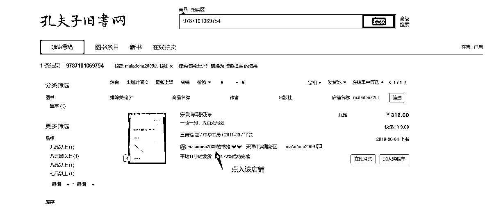
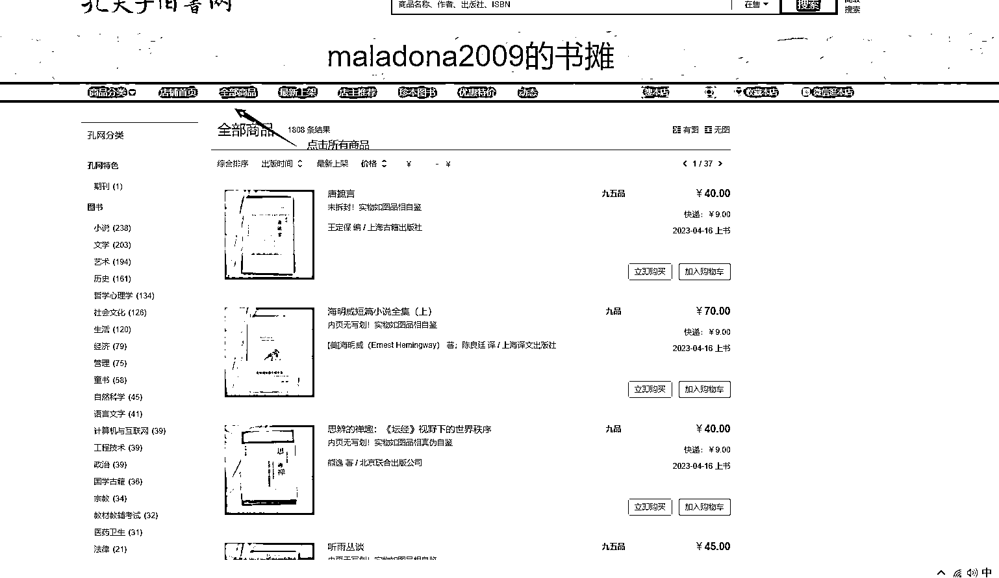
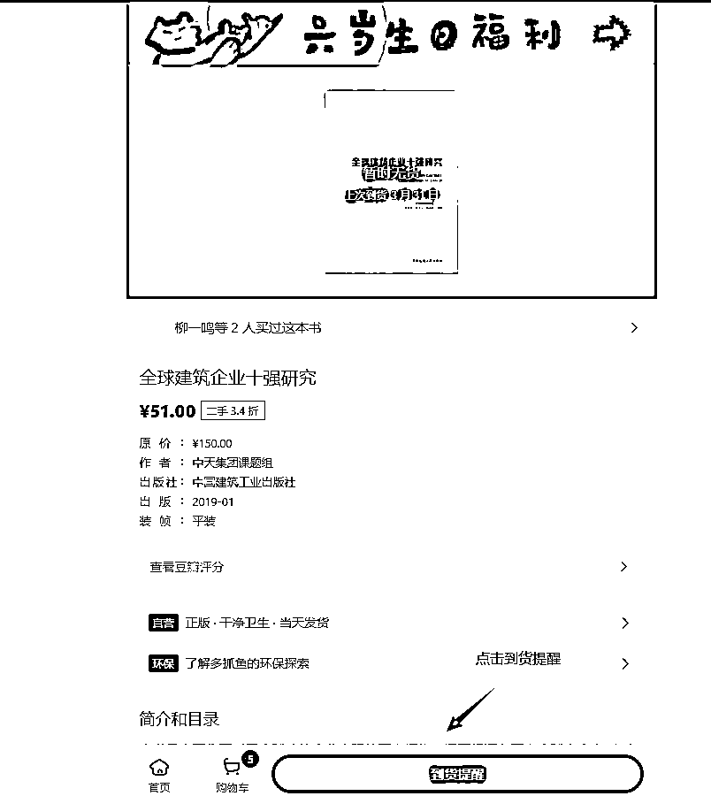
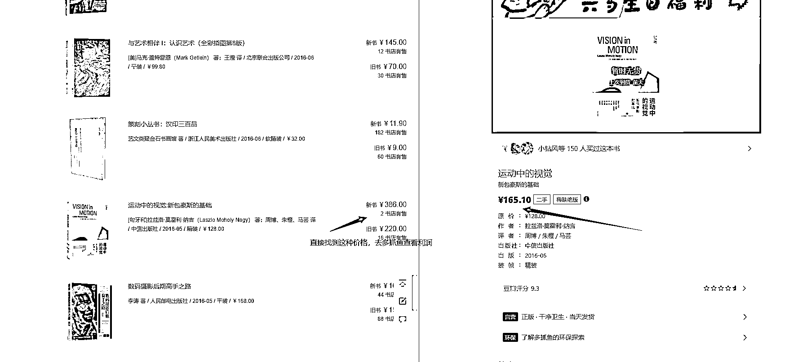
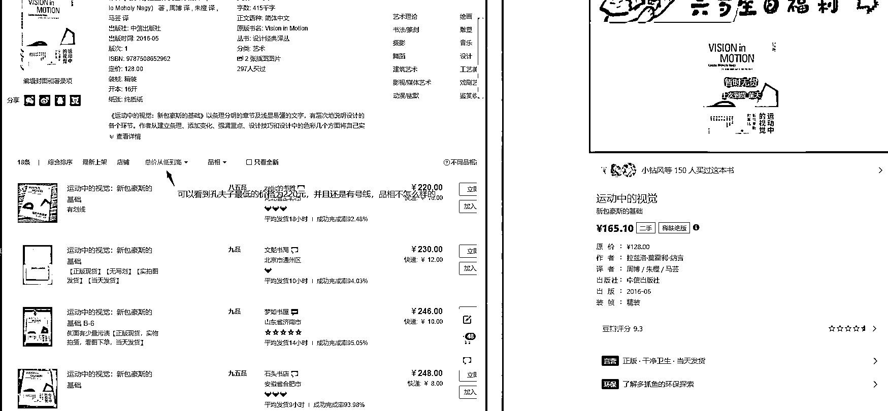

# 有货源的绝版二手书玩法分享

> 原文：[`www.yuque.com/for_lazy/thfiu8/flvlqwc1ehluhiag`](https://www.yuque.com/for_lazy/thfiu8/flvlqwc1ehluhiag)

<ne-h2 id="f88786bd" data-lake-id="f88786bd"><ne-heading-ext><ne-heading-anchor></ne-heading-anchor><ne-heading-fold></ne-heading-fold></ne-heading-ext><ne-heading-content><ne-text id="ub3048c7f">(精华帖)(161 赞)有货源的绝版二手书玩法分享</ne-text></ne-heading-content></ne-h2> <ne-p id="uda926b7c" data-lake-id="uda926b7c"><ne-text id="u089f82c6">作者： 一游</ne-text></ne-p> <ne-p id="ua7c1192e" data-lake-id="ua7c1192e"><ne-text id="uae35c88e">日期：2023-07-05</ne-text></ne-p> <ne-p id="u5d795342" data-lake-id="u5d795342"><ne-text id="u41d39987">有货源的绝版二手书玩法分享</ne-text></ne-p> <ne-p id="u002dd7e6" data-lake-id="u002dd7e6"><ne-text id="u539ab619">6 月 1 日《二手书行业的另一种玩法——有货源的绝版书》@一游</ne-text><ne-text id="u7ecaea74">6</ne-text><ne-text id="u3552a925">月</ne-text><ne-text id="uc4414091">1</ne-text><ne-text id="uaa0fd5a8">日《</ne-text><ne-text id="u4ff17fe7">二手书行业的另一种玩法——有货源的绝版书</ne-text><ne-text id="u89c56c08">》@一游</ne-text><ne-text id="u83b806dc">大家好，我是一个在深圳卖书赚钱的小游。我很高兴能与大家分享我的经验和见解。</ne-text><ne-text id="u56f684d0">一、故事分享</ne-text><ne-text id="u5685bbb6">我对书籍的热爱始于我很小的时候。阅读是我生命中不可或缺的一部分。通过阅读，我可以了解到各种不同的文化、思想和知识。然而，我也知道很多人对于购买新书感到有些昂贵。因此，我开始在网上购买二手书，并且将这些书籍出售给其他人，希望能够让更多人有机会享受阅读的乐趣。</ne-text><ne-text id="u043a158a">以上纯属扯淡</ne-text><ne-text id="ua25cf0c8">实际情况是，我爱读书，但也是比不怎么读书的人爱看一点而已，我很喜欢尝试新的事物，我记得我刚开始接触二手书，是看了一个盗版课程，那时候也没什么钱，他的课又贵，我又怕被割韭菜，只能在网上找关于二手书赚钱的资料</ne-text><ne-text id="udf363021">。</ne-text><ne-text id="uee525940">后面又付费了进了关于二手书的社群，懂了如何操作绝版书，赚到第一块钱的时候，就开始走条路了</ne-text><ne-text id="u74367f66">。</ne-text><ne-text id="u3ca8d55b">我操作绝版书到现在三年了，今年大家也因为我发的一篇文章，认识了我，知道我还在操作闲鱼无货源二手书</ne-text><ne-text id="ud0850fc7">。</ne-text><ne-text id="u1449736f">我参与过很多项目，跟大家一样，总是想着，多接触，肯定会有合适自己的项目，到最后呢，什么都懂一点，又什么都不懂，生财很多文章，真的不是看看才理解的，等我真正理解了，才知道大佬们一些简单的话，才是真理</ne-text><ne-text id="ud379a0d1">。</ne-text><ne-text id="u9754d84a">原来，我们不是因为兴趣而去做某件事情，而是，做了某件事有了反馈，我们才有了兴趣</ne-text><ne-text id="ud2633074">。</ne-text><ne-text id="u4636b229">二、入场建议</ne-text><ne-text id="uef1123c8">这次参加闲鱼二手书航海的人很多，也已经有很多圈友添加我，希望跟我付费学习，我在这里给你们一个真诚的建议</ne-text><ne-text id="u6019046e">：</ne-text><ne-text id="ua106367e">请严格按照航海步骤去走，等得到反馈，再去深入了解这个行业，找能够跟自己前行的战友</ne-text><ne-text id="u18640246">。</ne-text><ne-text id="udaefc392">生财真的是一个很好的平台，能够给你们避免很多坑，就不要给自己找坑跳了，盲目付费，并不能给你们带来帮助，只会让自己的钱包越来越扁，努力让自己先确定下来定位，再深耕</ne-text><ne-text id="u72371fda">。</ne-text><ne-text id="ucb11e1c8">总之，我很乐意向大家分享我在卖二手书方面的经验和建议。我相信，只要我们不断学习和努力，就能够在这个行业中获得成功。谢谢！</ne-text><ne-text id="u9d26486a">三、项目前期筹备</ne-text><ne-text id="u3c5a5101">今天，给</ne-text><ne-text id="uaa3d831e">大家介绍一下</ne-text><ne-text id="uaac23916">关于操作绝版书</ne-text><ne-text id="uc426fc90">的</ne-text><ne-text id="u6708943f">有货源模式</ne-text><ne-text id="u2dca9be1">玩法。</ne-text><ne-text id="u54614db5">目前还是更推荐</ne-text><ne-text id="u3e79f631">大家</ne-text><ne-text id="ubb12bb95">做无货源的类目，</ne-text><ne-text id="u0ba3cea7">有货源模式对于刚入门的新手而言还是太重了，很难操作起来。</ne-text><ne-text id="ua05c11c8">但如果是有货源的同学们，也可以看看这个绝版书的玩法。</ne-text><ne-text id="uebc25c2d">绝版书在市场上有一席之地，这种书极其抢手，且这个版本不再印刷了，能收到的量很少，加上这种书可能需要更高等级的鉴定、修复、清洁等环节，存在售价比原价高的情况。</ne-text><ne-text id="u5d7b3d5f">今天将会从绝版书的前期筹备、选品、注意事项等给大家一一展开介绍</ne-text><ne-text id="u5b927bef">。</ne-text><ne-text id="ud22a0615">3.1</ne-text> <ne-text id="ub00a7cda">平台</ne-text><ne-text id="u657e0cc7">介绍</ne-text><ne-text id="ud399244d">一般绝版书的玩法，都离不开这两个平台——</ne-text><ne-text id="uc110fba9">多抓鱼、孔夫子旧书网</ne-text><ne-text id="ub734f68f">。绝版书，在任何平台都可以进行售卖，但通常情况下，我们都是在多抓鱼收书，去孔夫子卖书，具体原因下面会介绍。</ne-text><ne-text id="u981600ca">3.1.1</ne-text> <ne-text id="uf447703c">多抓鱼介绍</ne-text><ne-text id="u12053bc2">首先介绍一下这两个平台，关于孔夫子旧书网的介绍，航海手册里已经说得很清楚了，这里主要介绍一下多抓鱼。</ne-text><ne-text id="ucbcef9f6">多抓鱼(</ne-text><ne-text id="uada1eed8">Duohuzhu.com</ne-text><ne-text id="ub1a75d0c">)是一家专注于二手书回收和交易的平台，主要提供以下服务：</ne-text><ne-text id="u594b5f4d">1.</ne-text><ne-text id="uea6796f2">回收旧书：用户可以将自己的闲置书籍寄送到多抓鱼指定的仓库，多抓鱼会对其进行评估并给出回收价格。</ne-text><ne-text id="u4a893618">2.</ne-text><ne-text id="u4ee3927b">线上购买：用户可以在多抓鱼平台上浏览、搜索并购买其他用户出售的二手书籍。</ne-text><ne-text id="u2ac8c6bb">3.</ne-text><ne-text id="u8337da63">线下门店：多抓鱼在一些城市设有线下门店，用户可以直接前往门店挑选心仪的二手书籍。</ne-text><ne-text id="uf10b84bd">4.</ne-text><ne-text id="u184c5748">快递取书：用户可以选择将书籍寄送到指定地址，多抓鱼会安排快递上门取件。</ne-text><ne-text id="u15606dbd">多抓鱼平台的优势在于它提供了一个便捷、高效、安全的二手书交易渠道，同时也帮助减少了浪费和环境污染。此外，多抓鱼还提供了专业的评估和鉴定服务，确保所售出的二手书籍的质量和真实性。</ne-text><ne-text id="uad60d4fe">3.1.2</ne-text> <ne-text id="u69c84090">为什么要在多抓鱼买书？</ne-text><ne-text id="ud5842e27">1.</ne-text><ne-text id="uddd35837">价格优势：多抓鱼会对其回收的二手书籍进行评估，然后给出合理的价格，能够让我们以低廉的价格购买到绝版书籍</ne-text><ne-text id="u14375210">2.</ne-text><ne-text id="uc02b2836">种类齐全：多抓鱼平台上有大量的二手书籍供用户选择，涵盖了各种类型、各个年龄段的图书，可以满足不同用户的需求，是目前所有二手书平台种类最齐全的了</ne-text><ne-text id="ua0910d58">3.</ne-text><ne-text id="u58b7bfb3">方便快捷：手机电脑均可以操作，交易流程简单、快捷、便利。</ne-text><ne-text id="ua44a74b9">4.</ne-text><ne-text id="u9074bbae">品质有保证：多抓鱼有鉴定部门，会对所有售出的二手书籍进行质量检验和鉴定，保证书籍正版且有质量，品相至少八五新。</ne-text><ne-text id="u273c9312">3.1.3</ne-text> <ne-text id="u5b50e689">为什么要在孔夫子旧书网卖书？</ne-text><ne-text id="u3366219a">1.</ne-text><ne-text id="u82940863">用户精准：孔夫子旧书网是国内知名的二手书交易平台之一，</ne-text><ne-text id="u16ea3032">覆盖面非常广，基本上</ne-text><ne-text id="u80f97a20">所有书籍爱好者都会在该平台购书</ne-text><ne-text id="u965df2e5">，简单来说，孔夫子上有很多愿意高价购买绝版书的人。反观闲鱼，什么都能卖，主打一个性价比，适合热销书籍，买书的人群大部分为宝妈，学生，白领，付费意愿比较低。所以相对来说，孔夫子旧书网会更适合卖绝版书。</ne-text><ne-text id="u6def8c74">2.</ne-text><ne-text id="u4104a6cc">可以获得更高的价格：孔夫子旧书网对售出的二手书籍进行严格的质量检验和鉴定，有强大的背书，打击售卖盗版书籍，确保书籍的真实性和品质，比别的平台，更受用户信任</ne-text><ne-text id="u46fffdad">。</ne-text><ne-text id="u526b55ee">3.</ne-text><ne-text id="u70f0b656">能够节省时间和精力：在孔夫子旧书网上卖书相对于传统的线下销售方式来说更加方便快捷。只需要在平台上发布信息即可，上传商品方便，只要扫一下书背后的编码二维码就会出来书的所有信息，自动填在书的信息栏，填写 3 个信息：书籍实拍图，价格和品相</ne-text><ne-text id="u4878a48e">。</ne-text><ne-text id="u5c4ad332">4.</ne-text><ne-text id="u12032946">个人开店选择开书摊不需要营业执照、保证金，但是卖出去平台要抽 5%手续费，运费不收手续费</ne-text><ne-text id="u9f8a7374">。</ne-text><ne-text id="u70738e4c">孔夫子平台最大的好处对我来说，就是没有售前售后，用户已经形成默契，基本没有售前咨询，售后服务。适合时间较少但想要发展副业的人群</ne-text><ne-text id="u0b10229f">。</ne-text><ne-text id="u843bb62c">3.2 找绝版书的方法</ne-text><ne-text id="ubb0dce40">1、寻找绝版书的渠道</ne-text><ne-text id="u0167d370">①</ne-text> <ne-text id="u62abcb7b">废品回收站</ne-text><ne-text id="u6b64b50d">去找家附</ne-text><ne-text id="u5ed82d91">近</ne-text><ne-text id="ucede7905">的回收站，跟老板协商，以合适的价格进行选书，我一般是 2 元一斤挑选，可以</ne-text><ne-text id="u10f3523f">用</ne-text><ne-text id="uf0924413">孔夫子的数据库，对书籍进行扫码，有利润的均可以拿下，该玩法仅合适一二三线城市</ne-text><ne-text id="u546fdbe1">。</ne-text><ne-text id="u421eb98a">②</ne-text> <ne-text id="u4a684713">孔夫子线上收书服务</ne-text><ne-text id="u75077aab">打开孔夫子公众号，有一个孔网服务，点击上门收书，定位自己所在</ne-text><ne-text id="ub336c86f">的</ne-text><ne-text id="uef958566">位置，有闲置书出售的人群发布售卖书籍，可以根据其发的图片，进行查询，看是否有合适利润书籍，进行当地交易</ne-text><ne-text id="ub87b72f1">。</ne-text><ne-text id="u4d626b48">③</ne-text> <ne-text id="u33fda837">闲鱼打包出售书籍</ne-text><ne-text id="u79f7a995">闲鱼也是利用当地资源，比如，输入关键字：搬家 书，很多人离开所在城市，会大批量打包出售自己所拥有过的书籍，同样利用孔夫子数据库，查询是否有利润</ne-text><ne-text id="u392dbb0e">④</ne-text> <ne-text id="ucf4ae7d0">图书馆换书（目前我只知道深圳）</ne-text><ne-text id="ub31ead44">这个只针对深圳小伙伴，深圳图书馆有换书活动，有在深圳的小伙伴可以查一下，我每个月都会去拿一些低成本书籍去图书馆换一些书，基本都是挑绝版书进行兑换</ne-text><ne-text id="ua7ef0366">2、</ne-text><ne-text id="ue0a7adbd">判断绝版书的方法</ne-text><ne-text id="uc2e2b155">核心判断标准就是这本书目前的售价，高于书籍本身价格的书籍。</ne-text><ne-text id="u31b35cbd">我们可以</ne-text><ne-text id="ua1dfa4e5">直接打开孔夫子 APP，扫描书籍背后条形码，选择最低价格，便可知其是否为绝版书籍</ne-text><ne-text id="u659f1004">。</ne-text><ne-text id="uaf821488">四、</ne-text><ne-text id="u6071e2f4">选品</ne-text><ne-text id="u776405b8">相信大家现在应该对绝版书玩法有了一定了解，接下来，我们需要选择利润合适的绝版二手书来卖，建议利润在 50 以上。</ne-text><ne-text id="uc5dc7a0c">下面我</ne-text><ne-text id="uc91b87b6">会分享两种我常用的</ne-text><ne-text id="udab20543">选品</ne-text><ne-text id="u818fd79d">方式给大家，</ne-text><ne-text id="u989e4fdf">分别是</ne-text><ne-text id="u021795ca">通过【以书找店寻找同行店铺】和【图书条目找到绝版书】。这两种办法本质上都是通过孔夫子看书籍行情，确定有利可图后，就去多抓鱼低价收书。</ne-text><ne-text id="ua2f0338f">4</ne-text><ne-text id="u57e59b96">.1</ne-text><ne-text id="ub8433909">以书找店寻找同行店铺</ne-text><ne-text id="u850156c6">第一种方法是，拿一本绝版书去孔夫子搜，找到同行店铺点进去，看他们都在卖哪些书。再打开多抓鱼查看利润差，确定利润后再返回孔夫子复核，确认行情后，就可以去多抓鱼收书，没书的话就点到货提醒。</ne-text><ne-text id="u5e99660f">具体操作如下：</ne-text><ne-text id="ubc30f862">1.</ne-text><ne-text id="u5a3c98d7">登录「孔夫子旧书网」</ne-text><ne-text id="udcb34037">输入一本</ne-text><ne-text id="ud3add952">绝版书籍</ne-text><ne-text id="u5eb3de17">，如</ne-text><ne-text id="udac59b8d">《</ne-text><ne-text id="uf431dc41">宋朝军制初探</ne-text><ne-text id="u3c80c4af">》，</ne-text><ne-text id="u7d0ab790">ISBN 码：9787101069754</ne-text><ne-card data-card-name="image" data-card-type="inline" id="SvwEz" data-event-boundary="card"></ne-card><ne-text id="u4cbf6d7d">2.</ne-text><ne-text id="uabd0df9d">选择一个店铺，点击进入，如</ne-text><ne-card data-card-name="image" data-card-type="inline" id="lzhNO" data-event-boundary="card"><ne-text id="uad6de9c1">3.</ne-text><ne-text id="ub5605a86">点击所有商品</ne-text><ne-card data-card-name="image" data-card-type="inline" id="ldAbN" data-event-boundary="card"></ne-card><ne-text id="u3d8ecde7">4.</ne-text><ne-text id="u67c8b35d">打开多抓鱼网页版</ne-text><ne-text id="u33dd7ec1">5.</ne-text><ne-text id="uc9eaf31a">复制店铺上的书籍名称到多抓鱼网页搜索栏，查看是否有利润差，如</ne-text><ne-card data-card-name="image" data-card-type="inline" id="Gvogo" data-event-boundary="card"></ne-card><ne-text id="u1784b63f">6.</ne-text><ne-text id="ubfb512eb">确定有利润差后，可进行复核，再次确认是否真的可以售卖 262 元的价格</ne-text><ne-card data-card-name="image" data-card-type="inline" id="FbIsM" data-event-boundary="card"><ne-text id="u9d243696">7.</ne-text><ne-text id="u716a76ca">确认无误后，去多抓鱼点击到货提醒，如有货，可直接买下</ne-text><ne-card data-card-name="image" data-card-type="inline" id="WWeTS" data-event-boundary="card"><ne-text id="uc03cc810">注意事项：</ne-text><ne-text id="u81ea4701">多抓鱼</ne-text><ne-text id="u107318e3">新号注册有权重优势，一个账号可以添加 1000 本到货提醒，最好能在一星期内完成，能够获得更多书籍</ne-text><ne-text id="ucdb6327c">4.</ne-text><ne-text id="u54abd36c">2</ne-text><ne-text id="u4f7c9162">通过图书条目找到绝版书</ne-text><ne-text id="u878c9379">第二种方法则是，通过孔夫子官网找绝版书，通过首页的图书分类条，可以随机找到价格合适的二手绝版书，只要售价高于原价，基本都是绝版书。后续收书的操作，跟第一种方法一致，这里不再赘述。</ne-text><ne-text id="ufb60937b">接下来讲讲具体操作：</ne-text><ne-text id="u0da5cc4c">1.</ne-text><ne-text id="u3de54f63">打开孔夫子旧书网官网：</ne-text><ne-text id="ud29d6f17">https://www.kongfz.com/</ne-text><ne-text id="ucbfdeed0">2.</ne-text><ne-text id="uf3c5ee24">随机选一个类目，点击进去</ne-text><ne-card data-card-name="image" data-card-type="inline" id="WVqok" data-event-boundary="card"><ne-text id="ua2851cfc">3.</ne-text><ne-text id="u9ac69928">根据价格来找到绝版书书籍</ne-text><ne-card data-card-name="image" data-card-type="inline" id="EJv08" data-event-boundary="card"></ne-card><ne-card data-card-name="image" data-card-type="inline" id="I9bgu" data-event-boundary="card"></ne-card><ne-text id="ud1f6c2b8">五、注意事项</ne-text><ne-text id="uff7bb898">5.1</ne-text> <ne-text id="u21a3500d">书籍上架到孔夫子旧书网</ne-text><ne-text id="u2a61a8d8">1.</ne-text><ne-text id="u2517ac26">保证书籍品质：上传书籍时，应清楚地说明书籍的状况，包括是否有划线、破损、污渍等。不要隐瞒或掩盖任何问题</ne-text><ne-text id="ud6608626">2.</ne-text><ne-text id="u02570caa">拍摄清晰的图片和详细描述：在上传书籍时必须提供至少 3 张清晰的图片以及详细的描述，如果可能的话，提供一些照片来展示书籍的实际情况。</ne-text><ne-text id="u9380d3b0">3.</ne-text><ne-text id="uac5a35cc">标明价格：在描述中明确标明书籍的价格，并说明是否包含划线或其他损坏情况。这样可以让买家更好地了解书籍的实际价值，避免因为误解而导致不必要的纠纷。</ne-text><ne-text id="u2be3de2e">4.</ne-text><ne-text id="u2129ff89">不接受退换货：二手市场比较特殊，如果书籍没有什么问题，有权拒绝退货，如果人家态度好，真的有个人原因想退，还是可以给退，要记住退货的邮费是由买家自己出，我们不出邮费。</ne-text><ne-text id="ud54f8e4a">后面的上架、擦亮等步骤，航海手册里面有提到，我这边就不多展开讲解了，直接直接点击链接进行跳转：</ne-text><ne-text id="u85c51863">https://search01.shengcaiyoushu.com/docx/R8eUd7TcModS7RxYaogceiZgnOb</ne-text><ne-text id="ued403f9d">5.2</ne-text> <ne-text id="uf192f996">快递问题</ne-text><ne-text id="uc9d0c780">短期可以直接使用孔夫子提供的在线发货，</ne-text><ne-text id="u6cc26e9e">后期单子多了就需要你自己和本地的快递站谈，一般价格可以谈成 4-6 块之间。</ne-text><ne-text id="u4d6025d7">写在最后</ne-text><ne-text id="u736e1185">今天的内容</ne-text><ne-text id="u028a21b6">主要是</ne-text><ne-text id="u88b14a2d">给有货源的同学们做个分享，</ne-text><ne-text id="u4f6fc550">我知道这次很多人因为证件的问题耽误了，有的也不知道下一步该做什么，希望这个分享能够让你们继续做二手书这个项目，以后等证件出来了，继续做闲鱼无货源，我个人是</ne-text><ne-text id="u052d5740">更建议新人朋友们做无货源，会更稳妥些</ne-text><ne-text id="ued07eaf2">。</ne-text><ne-text id="u73af5924">做项目嘛，更会出现各种各样的问题，没事，一个个解决就好了，没什么是解决不了的</ne-text><ne-text id="u6258cd5d">。</ne-text><ne-text id="ue66e5da3">希望未来我们能够成为并肩作战的伙伴，祝你们海航顺利，顺利下船</ne-text><ne-text id="ubc3119be">。</ne-text>  <ne-hole id="ubd1cab95" data-lake-id="ubd1cab95"><ne-card data-card-name="hr" data-card-type="block" id="yn3fR" data-event-boundary="card"><ne-p id="u498ad1e5" data-lake-id="u498ad1e5"><ne-text id="u8ed0ab70">评论区：</ne-text></ne-p> <ne-p id="ufe2c45d5" data-lake-id="ufe2c45d5"><ne-text id="u8dab0913">芷蓝 : 想起我曾将在孔夫子上买的一套绝版漫画书。。。</ne-text> <ne-text id="ufdc4eeb5">亦仁 : 感谢分享，已加精华。</ne-text> <ne-text id="u785e95d7">昊东.Lee : 想到当初我在孔夫子二手书网找《林 biao 军事文选》这本书，竟然炒到了上千元一本。</ne-text> <ne-text id="u4137c534">美少女守护者 : 感谢分享[愉快]</ne-text> <ne-text id="u56ed533e">星辰 : 请教一下，多抓鱼买绝版书，不是需要鱼来预定么？那批量买绝版书的话，去哪里弄这么多的鱼呢？</ne-text> <ne-text id="ubb49be2b">胖大魔 : 有没有电子档分享一下[呲牙]</ne-text> <ne-text id="u58181616">昊东.Lee : 没有</ne-text> <ne-text id="u37d01c68">哈皮 : 再加一个 RPA 自动找出绝版书，是不是就可以批量化操作了</ne-text></ne-p></ne-card></ne-hole></ne-card></ne-card></ne-card></ne-card></ne-p>