# 月销百万选品宝典供应链避坑打假人辨别

> 原文：[`www.yuque.com/for_lazy/thfiu8/ysg464ko1dk9kdnf`](https://www.yuque.com/for_lazy/thfiu8/ysg464ko1dk9kdnf)

<ne-h2 id="da09e5a7" data-lake-id="da09e5a7"><ne-heading-ext><ne-heading-anchor></ne-heading-anchor><ne-heading-fold></ne-heading-fold></ne-heading-ext><ne-heading-content><ne-text id="ue0851d28">(精华帖)(97 赞)月销百万选品宝典供应链避坑打假人辨别</ne-text></ne-heading-content></ne-h2> <ne-p id="u85f298fa" data-lake-id="u85f298fa"><ne-text id="u9c87ef92">作者： 云端行走</ne-text></ne-p> <ne-p id="u4972390c" data-lake-id="u4972390c"><ne-text id="ue5882cb7">日期：2023-07-03</ne-text></ne-p> <ne-p id="uf17449d5" data-lake-id="uf17449d5"><ne-text id="ufd5cd61c">圈友们好，我是云端行走，5 月小红书店铺航海的教练。十余年的一线电商实战经验，全网店群百家，年销过千万。</ne-text></ne-p> <ne-p id="u13852e36" data-lake-id="u13852e36"><ne-text id="uf5967be4">6 月 1 日《</ne-text><ne-text id="u002d6b81">月销百万选品宝典+供应链避坑+打假人辨别</ne-text><ne-text id="uc738549a">》@云端行走</ne-text><ne-text id="u514130c6">感谢生财，很荣幸可以担任本次小红书航海的教练和分享官，很高兴能和这么多优秀的小伙伴分享小红书店铺相关的内容，看到很多熟悉的小伙伴和一些新的圈友。</ne-text> <ne-text id="u9a798fe1">先做一个简单的自我介绍</ne-text><ne-text id="u882af3ec">【昵称】云端行走</ne-text><ne-text id="ud825de7f">【所在地区】成都</ne-text><ne-text id="ue2789ae6">【自我介绍】十余年电商一线实战，每个电商平台的第一波掘金人，全网店群百家，年销过千万。目前主要业务为天猫、京东、视频号、美团、小红书店群。擅长简单高效的变现方式，喜欢高门槛可复制项目。</ne-text><ne-text id="u707edf62">【提供资源】</ne-text><ne-text id="ud3f68425">高门槛可复制的红利项目分享</ne-text><ne-text id="u0b9ec244">电商店群的提效工具</ne-text><ne-text id="ua3667459">【需要资源】</ne-text><ne-text id="u4a9eb9e1">母婴供应链实力厂家深度对接</ne-text><ne-text id="ub5ed4d11">RPA 机器人在电商管理提效上的实际应用</ne-text><ne-text id="ucad43941">我们是去年年初开始做小红书，当时很多拿到结果的人用到的方法大致是这三种：</ne-text><ne-text id="u9055db0c">https://t.zsxq.com/0eHgWLzai</ne-text><ne-text id="u4be88f2f">（可以先收藏，等会儿去慢慢看）。</ne-text><ne-text id="uc0ef57fd">其中我们有个故事分享给大家，就是我们通过一个作品获得了单日近 400w 播放，涨粉 4w 多，数据在</ne-text><ne-text id="ua163f700">前端</ne-text><ne-text id="uee9d22df">都拉满了，原作者找过来，我们把账号送给她了，到现在一直还在给她做后端供货。</ne-text><ne-card data-card-name="image" data-card-type="inline" id="YGduV" data-event-boundary="card"><ne-card data-card-name="image" data-card-type="inline" id="aASSV" data-event-boundary="card">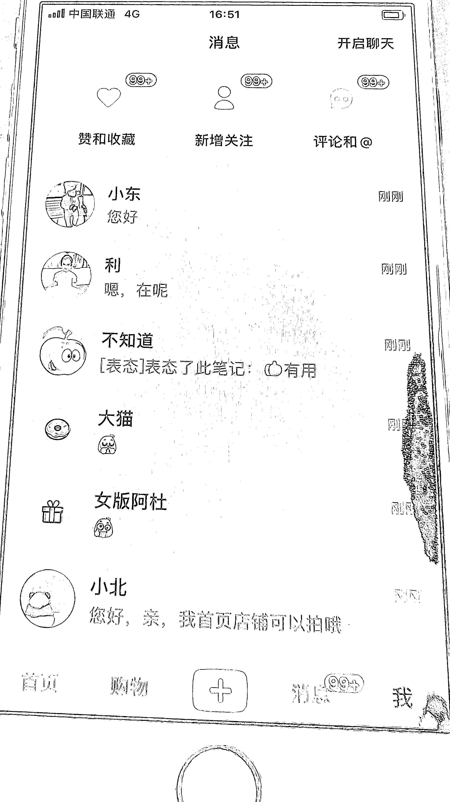<ne-text id="u781b717e">就这么简单的方法，我们去年大概用了大半年时间，一直没有换，无需原创无需剪辑，一个人一天时间可以生产出一个月要发的内容。</ne-text><ne-text id="u258b2759">这个分享我想告诉大家的是</ne-text><ne-text id="u10daf88f">：</ne-text><ne-text id="u488c8186">在电商行业往往那些很赚的事情，方法都是极其简单高效的！</ne-text><ne-text id="u734b0074">本次航海，我挑选了三个大家常问到的一些问题作为本次分享。</ne-text><ne-text id="u413f6152">这三个问题也是我觉得做好店铺很核心的问题，我将把复杂的道理</ne-text><ne-text id="u187ff6ba">用简单的形式告诉大家</ne-text><ne-text id="uaff09d23">，希望对大家有所帮助。</ne-text><ne-text id="u3b86b041">好了，正式开始分享，今天分享三个话题：</ne-text><ne-text id="u76b78a63">一</ne-text><ne-text id="u5b4282ab">、</ne-text><ne-text id="u9810e97d">电商人如何选品</ne-text><ne-text id="ua55ea586">二</ne-text><ne-text id="u254fc727">、</ne-text><ne-text id="ucc625a4d">无货源供应链到底有哪些坑</ne-text><ne-text id="u43de72d4">三</ne-text><ne-text id="ubaaf0978">、</ne-text><ne-text id="ue369fd27">开始盈利后遇到假打人如何应对</ne-text><ne-text id="ubedd3f20">一</ne-text><ne-text id="ub6d14aff">、</ne-text><ne-text id="u4d583fb4">电商人的选品秘籍</ne-text><ne-text id="ude59477b">如果你做的是个人</ne-text><ne-text id="u0a11daad">ip</ne-text><ne-text id="uc34b510b">或者品牌原创笔记带货，那就是</ne-text><ne-text id="u824d2e1c">7</ne-text><ne-text id="u7dbcba96">分选品，3</ne-text><ne-text id="ud139142b">分运营。</ne-text><ne-text id="u4b3e64c7">但是如果你的目的就是纯卖货</ne-text><ne-text id="uf134990c">，</ne-text><ne-text id="ubfb01158">那一定就是 9 分选品，1 分运营。</ne-text><ne-text id="u6012397d">就好比一只股票一样，你是大神不重要，你选对了股更重要</ne-text><ne-text id="u308edc35">。</ne-text><ne-text id="ude9247d3">选对赛道，你可能纯搬运都比别人原创的小眼睛都还要多。</ne-text><ne-text id="u7cf460af">1、</ne-text><ne-text id="u6295e5a2">抖音爆款跟踪及潜力预判</ne-text><ne-text id="u11088fe6">作为</ne-text><ne-text id="u7a44187a">主要风向标</ne-text><ne-text id="u8fb73a9f">选品就是找商机，找最近什么东西卖得好，或者未来</ne-text><ne-text id="ud9c08c19">什么</ne-text><ne-text id="u11444738">东西将可能成为热点。</ne-text><ne-text id="u8dd2f54a">那么能供我们参考的主要平台就是抖音</ne-text><ne-text id="u93e2a1ce">。</ne-text><ne-text id="u66536925">在我们团队，如果一个新人培训了一周</ne-text><ne-text id="u0d4f6ff5">，但还是</ne-text><ne-text id="u4ca03b24">说不出这个大品类中的</ne-text><ne-text id="ue303dca3">30</ne-text><ne-text id="uff7ee3bb">个热品和未来能做的</ne-text><ne-text id="u20fccda1">10</ne-text><ne-text id="ua6407651">个潜力产品，是</ne-text><ne-text id="u6fcd9cfe">会</ne-text><ne-text id="u71430c8a">直接被</ne-text><ne-text id="u6fab199a">pass</ne-text><ne-text id="ud293e358">掉的。</ne-text><ne-text id="ub8b6eeb4">今天</ne-text><ne-text id="u0fd9f792">，</ne-text><ne-text id="u59884bbb">我就把内部培训的资料毫无保留</ne-text><ne-text id="u20fa3976">地</ne-text><ne-text id="u8ab9dc8f">分享给大家。</ne-text><ne-text id="u46fe2d01">首先，我们要知道作为抖音达人他们选品的后台是长什么样，我们作为达人</ne-text><ne-text id="u98b65d96">，</ne-text><ne-text id="u02888e31">官方其实已经给到了很多一些热卖榜，爆款榜，高佣榜的一些产品推荐。</ne-text><ne-text id="u1247ecf9">官方就是怕新人不会选品！</ne-text><ne-card data-card-name="image" data-card-type="inline" id="SlOXq" data-event-boundary="card"><ne-card data-card-name="image" data-card-type="inline" id="tzkQD" data-event-boundary="card">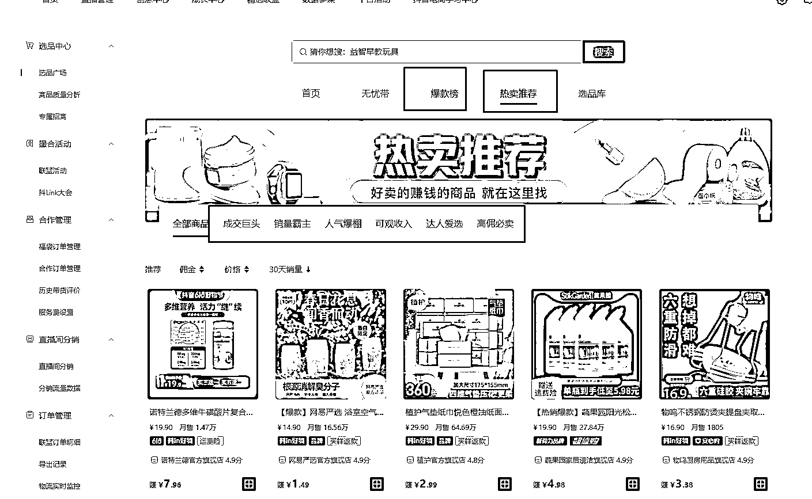<ne-text id="u5af00d46">如果说这些品，在小红书还没有带爆，那你</ne-text><ne-text id="uc42262c3">很可能</ne-text><ne-text id="ud7c5406c">就发现了第一个商机。</ne-text><ne-text id="ufa490e8f">但是以目前的市场来说，这种概率</ne-text><ne-text id="ue69219e7">已经</ne-text><ne-text id="ub8d2cf4d">很低了，因为小红书基本上很多坑位都有人占了。</ne-text><ne-text id="u2c1b1b63">这里插一个概念</ne-text><ne-text id="u13762450">：</ne-text><ne-text id="ube216200">小红书卖货，你可以把小红书当做一个城市新开的片区，而抖音就是这个城市的</ne-text><ne-text id="u8d0c24eb">CBD，抖音里面什么都有，什么都很完善。</ne-text><ne-text id="u98ff8bac">而我们要做的就是</ne-text><ne-text id="ucc87b119">：</ne-text><ne-text id="u5414f1d2">在一个新的城市</ne-text><ne-text id="u19ecca3b">，</ne-text><ne-text id="ue505f9b0">找到市场里面没有被占或者还有机会的坑位，所有的生意本质就是信息差！</ne-text><ne-text id="uf7b4aef0">大家应该都接触过抄爆款话题</ne-text><ne-text id="u43601018">、</ne-text><ne-text id="ua07f80e6">抄爆款产品这样的</ne-text><ne-text id="u812a236f">说法。</ne-text><ne-text id="u99b53590">不过只</ne-text><ne-text id="ubef711ae">通过抖音后台</ne-text><ne-text id="u03d2d3e4">的话，</ne-text><ne-text id="u500860ab">我们还是很难知道最近一周</ne-text><ne-text id="u80153cb9">、</ne-text><ne-text id="u73ed705f">甚至是昨天或者最近 24 小时内爆的品。</ne-text><ne-text id="uc625ff37">那么这个时候就要用到第三方软件了</ne-text><ne-text id="u2daed983">。</ne-text><ne-text id="uf8562639">这里我为大家列出了几个问题，通过第三方软件，大家主要就是</ne-text><ne-text id="u7ec05a3f">去找到几个问题的答案：</ne-text><ne-card data-card-name="image" data-card-type="inline" id="Grxlk" data-event-boundary="card"><ne-text id="uf748f7ea">以上问题只是我列举的一些常见问题，希望大家认真的去</ne-text><ne-text id="u0ce18e02">思考一下</ne-text><ne-text id="u8fdd67f0">，</ne-text><ne-text id="u6431b05d">看看</ne-text><ne-text id="u30775ad2">你心里是否有正确答案。</ne-text><ne-text id="u1e054b68">如果你能搞懂上面的这些问题，今天的选品分享就可以</ne-text><ne-text id="ua73bb849">不用再看</ne-text><ne-text id="uc58d9928">了，因为你一定能拿到好的结果。</ne-text><ne-text id="u9e5b1fc9">考古加选品演示：</ne-text><ne-text id="u62903ef4">接下我就以考古加为例</ne-text><ne-text id="ue1dd10eb">，</ne-text><ne-text id="uce71faf8">为大家实际展示如</ne-text><ne-text id="u29acfcac">何</ne-text><ne-text id="uf9965664">通过第三方软件来选品（其他软件也有对应的功能）。</ne-text><ne-text id="ufeb6f31a">这块内容较多，原本是想通过直播的方式来给大家视频演练的，但是飞书改版后不能承载我们几千人的直播，因此就以图文形式给大家演示了，如果有表述不清楚的，欢迎大家分享结束后提问。</ne-text><ne-text id="u2f0f7960">全网这季节哪个行业卖的东西最火？</ne-text><ne-card data-card-name="image" data-card-type="inline" id="N3yYS" data-event-boundary="card"><ne-text id="u5e712028">哪种产品适合直播卖？</ne-text><ne-card data-card-name="image" data-card-type="inline" id="mJ9ml" data-event-boundary="card">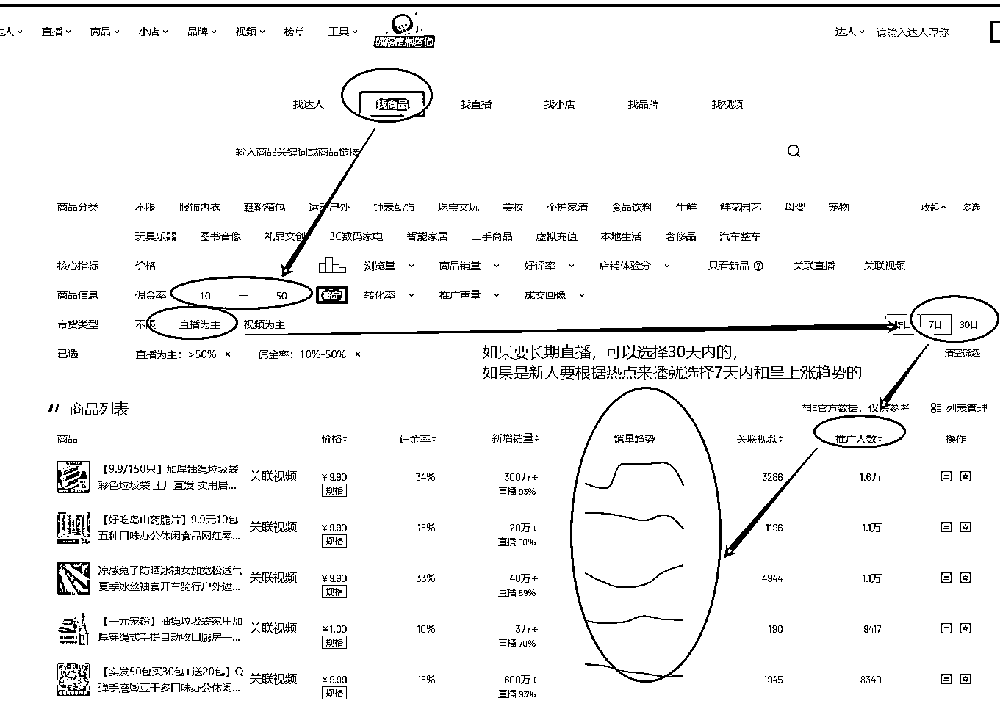<ne-text id="ueb973eac">哪种产品适合用短视频推？</ne-text><ne-card data-card-name="image" data-card-type="inline" id="NHfsj" data-event-boundary="card"><ne-text id="ub7baec12">用图文笔记推广的方式卖得好的是哪些产品？</ne-text><ne-card data-card-name="image" data-card-type="inline" id="A2Q37" data-event-boundary="card">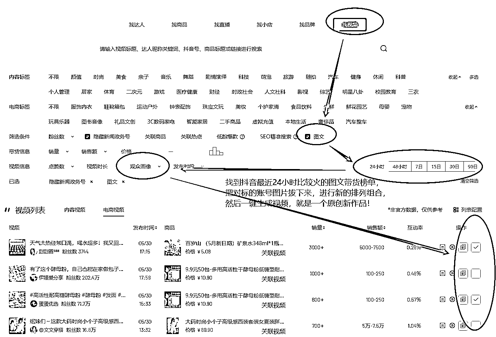<ne-text id="u882f160c">我选择的这个品类卖得最好的商家是谁？</ne-text><ne-text id="u0e518754">他是用什么方式来卖的，我能不能跟着抄，他接下来可能会去推什么产品？</ne-text><ne-card data-card-name="image" data-card-type="inline" id="ozJMY" data-event-boundary="card">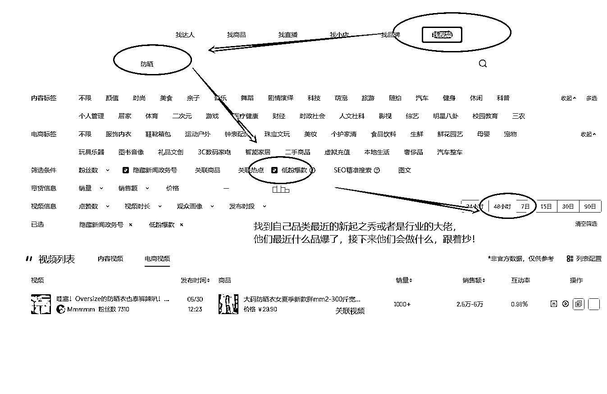<ne-card data-card-name="image" data-card-type="inline" id="EvRlP" data-event-boundary="card"><ne-text id="ue9dea3eb">由于篇幅和时间有限，我就不在这里一一列举了，只要你能把某一个软件研究透彻，选品就变得非常简单了！</ne-text><ne-text id="ub30181c2">2</ne-text><ne-text id="u0e852521">、</ne-text><ne-text id="u225c2fcd">淘宝拼多多等传统电商平台爆款及新爆款预测</ne-text><ne-text id="uee72d4bf">这里</ne-text><ne-text id="u32b1f584">再说下如何通过淘宝、拼多多这类传统电商平台来选品</ne-text><ne-text id="u974d4e8b">，</ne-text><ne-text id="ua16b122a">我们主要看的是商品飙升榜，这样可以对未来即将热的品有个更好的判断。大家都要去这些平台拍单，就好比你不知道你的超市要卖什么产品，你去批发市场看看大家在批发什么，你回去就卖这些品</ne-text><ne-text id="u1ad768e6">，</ne-text><ne-text id="u80a06bf8">道理</ne-text><ne-text id="ud59a024b">是一样的</ne-text><ne-text id="ue5f5c7be">。</ne-text><ne-card data-card-name="image" data-card-type="inline" id="nUKMM" data-event-boundary="card">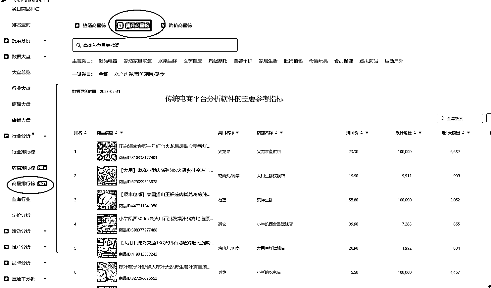<ne-text id="ud11db59e">这里分享一个测品方法：</ne-text><ne-text id="u9a0fce9b">把传统电商平台的爆款产品传到自己小红书店铺后台，批量传，先不制作笔记，最后根据产品自然访客来生成笔记。每个商品生成 10 个不同内容的笔记，如果某个品本身自然访客就有，笔记发布数据也好，那这个品绝对不错！这张图片是我们一个小店，没有任何笔记，只是传了几十个产品，全是平台自然搜索流量，每天都能出一两单。</ne-text><ne-card data-card-name="image" data-card-type="inline" id="xpCVZ" data-event-boundary="card">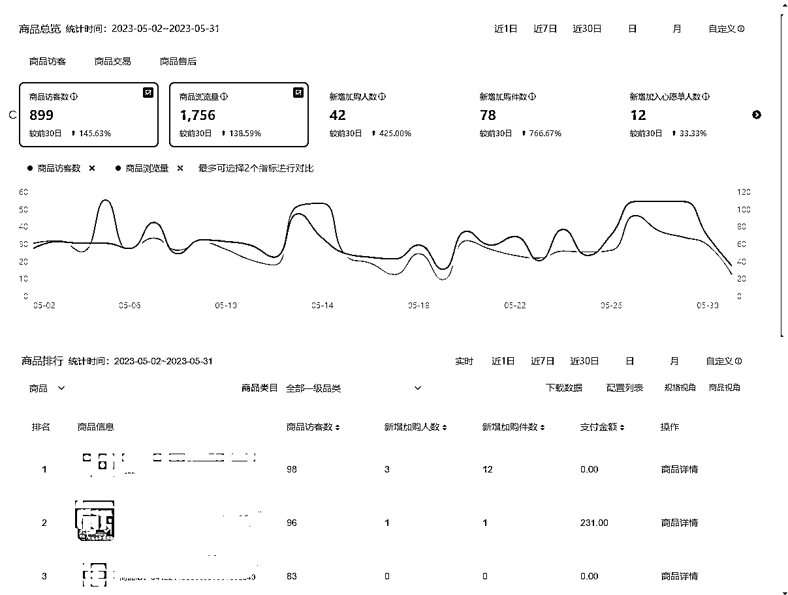<ne-text id="u0d244ab7">这</ne-text><ne-text id="uc9f58d01">就说明这款产品在小红书上有人群需求，她可能就是在其他平台看了某个评测或者来小红书找博主笔记的，结果发现小红书上有这个产品，就会点进来选购。</ne-text><ne-text id="uf9faf16f">根据小红书后台店铺自然流量，批量生成笔记，比如你店铺有 100 个品，每天自然访客的有 50 个产品，把这个 50 个产品通过第三方软件可以批量的生成不同的笔记，然后通过笔记去测哪个产品的数据更好，再重点来做哪几个产品。</ne-text><ne-text id="u12b04935">这个过程我们称之为先繁后减，就是先做从 0-100，最后做 100-1 的事。比如有的店铺最开始我们会传几千上万个产品，最后测出方向后这个店铺可能也就做几个产品了。这个方法目前我们一直还在用，不容易爆，但是很稳定，每个账号每天稳定出单数，不容易被同行抄。</ne-text><ne-text id="u8c5b4385">选品的方法特别多，不一定要全部学会，但是大概的思维方式你得会。总得来说，就是要搞懂我</ne-text><ne-text id="ua413eddb">前面</ne-text><ne-text id="u9edd5913">问的那几个问题，接下就是把执行力拉满！一定会有很好的结果！！</ne-text><ne-text id="u822f1e85">二、供应链避坑</ne-text><ne-text id="ud3fd71f9">第二大板块分享的就是在我们有订单后，开始大规模盈利后要注意的两个核心点，一是供应链，二是打假人。</ne-text><ne-text id="u8d44b8cb">供应链我先总结下几个常见问题再分享点其他额外创营收的干货：</ne-text><ne-text id="uf5c2d268">1</ne-text><ne-text id="u20586bfe">、</ne-text><ne-text id="u7de259f5">供应链常见问题</ne-text><ne-text id="u008538a2">1</ne-text><ne-text id="u633f681b">）</ne-text><ne-text id="u03c5aedc">淘宝或者拼多多给客户发短信</ne-text><ne-text id="u0e99d092">常用应对方式：</ne-text><ne-text id="uae77754e">①</ne-text> <ne-text id="ub6107cb7">客户手机号不写真实的，在客户收件地址后面加真实电话，比如张三 1894263109，四川省成都武侯区玉林路 88 号小酒馆</ne-text><ne-text id="u003f025b">拍单的时候改成：张三 18900001339，四川省成都武侯区玉林路 88 号小酒馆到了打 1894263109。（这种方式目前单量大的时候客户还是可能会收到短信，那就用第二种方法）</ne-text><ne-text id="ud32cc061">②</ne-text> <ne-text id="u922c5ed6">把数字变成字母，偷换概念。这个一说就懂，在手机号码里面选一两个数字换成字母，例如就把 1 打成 I，2 打字成 z，6 打字成 b，类似这样，平台检测不出完全的数字，但是快递效果能看到。</ne-text><ne-text id="uad454626">最后大概就是这样张三 18900001339，四川省成都武侯区玉林路 88 号小酒馆到了打 I8942b3I09</ne-text><ne-text id="u6edd249a">③</ne-text> <ne-text id="ubf9196fe">用中转仓。你上架下单的时候，地址填中转仓的，中转仓给你把包裹进行二次面单，二次面单就是客户的真实地址，再发出去。这就完全规避了客户收短信的问题，只是中间会多一两天的时间。</ne-text><ne-text id="u6bb01597">2</ne-text><ne-text id="u2f45cc8f">）</ne-text><ne-text id="u4dac3908">上家不发货，或者发的产品太差了！</ne-text><ne-text id="u65c336dd">目前拼多多的无货源商家是最多的，因为多多无货源成本最低，所以很多商家是一个人几十家几百家的铺，当你在他店铺下单后，他可能又找不到这个产品，或者说容易亏本，那么商家就会不发货或者以次充好。</ne-text><ne-text id="u6fb6190b">针对多多（其他平台道理一样）进货要学会辨别几点：</ne-text><ne-text id="u1bd82b9b">①</ne-text> <ne-text id="ubdcf725b">不看成交件数，尤其是 10W+成交的不看，只看评论数和最近评论数</ne-text><ne-text id="uaba2a5ab">。</ne-text><ne-text id="u3caa15c8">②</ne-text> <ne-text id="uf36fc87d">看发货时效，只要前面标记多少小时发货之类的这种商家，出货都比较快</ne-text><ne-text id="ueb1bef19">。</ne-text><ne-text id="ub8c2405f">③</ne-text> <ne-text id="ud1c99781">看商家店铺的产品数量，如果产品数量非常多（图书食品类目除外），也尽量不选择，大多数为无货源或者经销商</ne-text><ne-text id="u737eb455">。</ne-text><ne-text id="u5e025a5d">④</ne-text> <ne-text id="u0f0f0990">看店铺爆款和店铺评分，店铺评分四星半以下的尽量不选。</ne-text><ne-text id="ua658754d">⑤</ne-text> <ne-text id="u16362b42">看店铺资质，点击店铺首图，能看到这家开店主体，如果你卖的产品涉及到打假的可能性比较高，尽量只选择公司主体的店铺。</ne-text><ne-text id="u0a44746e">上面就是一些常见问题了，接着我再分享一个我们平时拍单的时候能让我们额外获得返点的一个方式</ne-text><ne-text id="ufe4035ab">。</ne-text><ne-text id="u86df3155">2</ne-text><ne-text id="uab3c153f">、</ne-text><ne-text id="ue8b46c9f">供应链端如何拉大利润空间</ne-text><ne-text id="u38c1eaae">推广链接推广给自己拍单，把差价和佣金都吃掉！</ne-text><ne-text id="u56e0e9c5">以抖音平台举例，有的品你会发现只有抖音商家在卖，你去其他平台会发现他的价格甚至比抖音还贵，那是因为其他平台的商家卖了货之后也会去抖音这家拍。我们把这种品称之为</ne-text><ne-text id="ud4cce142">“</ne-text><ne-text id="u395fcbfb">独品</ne-text><ne-text id="u3a9461c3">”</ne-text><ne-text id="u7a4bc88e">。</ne-text><ne-text id="uf39712dd">由于</ne-text><ne-text id="ucf356e7d">抖音这家不</ne-text><ne-text id="ue4c59612">支持</ne-text><ne-text id="u988c8642">代发，</ne-text><ne-text id="uca44d0b4">所以其他人</ne-text><ne-text id="u3000c312">只能去他店铺下单，这种品传到自己店铺，是可以高溢价的。</ne-text><ne-text id="uaafad1b8">举个例子，</ne-text><ne-text id="uf5513d81">比如</ne-text><ne-text id="ue0498937">一</ne-text><ne-text id="u7e20af3d">个独品</ne-text><ne-text id="u5f3fd11b">，</ne-text><ne-text id="uff8812e7">抖音售价</ne-text><ne-text id="u4efcc3d0">98，佣金</ne-text><ne-text id="uf4e0d25c">50%，你可以</ne-text><ne-text id="u622d8a38">在小红书上</ne-text><ne-text id="uefafeeac">售价</ne-text><ne-text id="ue53c329e">168，</ne-text><ne-text id="ua1a1003f">单看</ne-text><ne-text id="uca98770f">利润</ne-text><ne-text id="ua281b299">就有</ne-text> <ne-text id="u4ccd8ff7">70</ne-text><ne-text id="u351711cd">元</ne-text><ne-text id="uf59be14b">。</ne-text><ne-text id="uf67a8636">如果是</ne-text><ne-text id="ubc9823e7">自己</ne-text><ne-text id="u3a1051c1">带货，那</ne-text><ne-text id="ua492a7e6">就可以</ne-text><ne-text id="u9a4feb0b">直接</ne-text><ne-text id="u3ff8f99d">赚</ne-text><ne-text id="u8ecd32d4">70</ne-text><ne-text id="u190d8a1c">元</ne-text><ne-text id="ue1b86983">的利润；如果有找其他达人带货，那就吧大部分利润分给达人，而你是</ne-text><ne-text id="ucd573432">一定能赚到</ne-text><ne-text id="u26c4dcd0">这个商家在抖音设置的</ne-text> <ne-text id="u2a756d36">98*50%</ne-text><ne-text id="uc56603b5">的佣金。</ne-text><ne-text id="uc8b0f4fa">操作方法就是：拍单的时候把商家的产品加购到自己橱窗，再用另一个抖音号去拍自己橱窗的产品，最后佣金就是自己的了！</ne-text><ne-text id="u533d39e4">最后</ne-text><ne-text id="uc708710d">，</ne-text><ne-text id="uea7582d8">这个产品</ne-text><ne-text id="u35189aa9">在小红书的</ne-text><ne-text id="ue1489075">售价</ne-text><ne-text id="u7f6d7c26">是</ne-text> <ne-text id="ue6d72ad6">168，</ne-text><ne-text id="u93f48999">而我们</ne-text><ne-text id="uccfd38fd">获取的利润是</ne-text><ne-text id="u182910d7">168-98+98*50%=70+49=119 元</ne-text><ne-text id="udd7dfd83">（不考虑找达人的情况下）</ne-text><ne-text id="u9cd54ea7">这种产品在小红书上</ne-text><ne-text id="ud3d4e225">是</ne-text><ne-text id="u7fd642fd">绝对存在的，通过我上面的选品方法你能找到。</ne-text><ne-text id="uabbd05db">顺便</ne-text><ne-text id="u73c85c00">给大家看看我们自己一个抖音橱窗的真实成交数据（我们有二十多个这样的橱窗，每个月拿返点能有几万）。</ne-text><ne-card data-card-name="image" data-card-type="inline" id="EoXfU" data-event-boundary="card">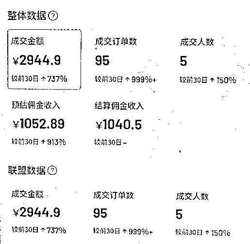<ne-text id="ucab67e49">这个方法需要注意的点：</ne-text><ne-text id="u66db2319">1.多平台对比最后的进货价，哪里进最划算就去哪里</ne-text><ne-text id="u1133c28f">2 尽量是</ne-text><ne-text id="ua87b9f35">独品</ne-text><ne-text id="uf1f95388">，高佣，能溢价的。（比如抖音上某位化妆品达人新出了款服装或者化妆品或者辣椒酱，她就在抖音上卖，而且是高佣，其他平台都还没上货）</ne-text><ne-text id="u48a05dc0">2.</ne-text><ne-text id="u8c119d08">拍单的时候用表格整理成一个字段，自动识别地址，下单非常之快</ne-text><ne-text id="ud2d0adc8">3.</ne-text><ne-text id="u92b41757">一个号每天不要拍太多（看你的拍单号权重，权重越高异常越低），橱窗分开来，有时候会异常几天，但不影响金额。</ne-text><ne-text id="u8da5b6a0">对了，如果哪位圈友有在开发这类软件的，并且成熟应用到市场上了，请私下 Q 我一下。</ne-text><ne-text id="u7f911f35">同样的套路，在淘宝那边叫淘宝客，在拼多多那边叫进宝，</ne-text><ne-text id="uba2cad9f">每个平台大部分产品都有推广链接。</ne-text><ne-text id="ud1a6d2f4">也就是说你一个月如果拍单要拍</ne-text><ne-text id="u1827dd82">3w</ne-text><ne-text id="ue7c3e6d8">的货款，通过这个思路，你每个月可以拿到</ne-text><ne-text id="ua7e4494b">2%-50%</ne-text><ne-text id="u662b2ef8">不等的返款。自己推广给自己，然后再拿到这个返点！</ne-text><ne-text id="u14577eb4">需要注意的是</ne-text><ne-text id="u18a6ad4e">：</ne-text><ne-text id="u78deeaef">淘宝容易封联盟号，你订单少（几十几百）无所谓，像我们之前一个月拍单就要拍</ne-text><ne-text id="u0e319e0f">100w</ne-text><ne-text id="u00295a16">+</ne-text> <ne-text id="uefe93eab">的金额（每个月进货能拿到的佣金返点 10w+），直接被永封了一大批联盟号。</ne-text><ne-text id="u5f2ec93e">总结下就是，</ne-text><ne-text id="ue67f12a5">利用这种方法，</ne-text><ne-text id="u29fd9de7">除了能赚产品的利润之外，每单产品</ne-text><ne-text id="u97ada7ad">还</ne-text><ne-text id="u5884b7c8">能拿到产品的返点的，这是一笔不小的数目！</ne-text><ne-text id="u349defb0">平时如果爆单了，或者考虑到平台发短信之类的，就直接找商家代发。</ne-text><ne-text id="u81a1aa62">大家如果是</ne-text><ne-text id="uf45c9782">去</ne-text><ne-text id="ucc35e04c">1688</ne-text><ne-text id="u19195533">进货，这里注意的一点就是</ne-text><ne-text id="ua16c4046">：</ne-text><ne-text id="u2599662a">1688</ne-text><ne-text id="u9240b123">上面也开始有很多无货源卖家</ne-text><ne-text id="ucd19de41">了</ne-text><ne-text id="u810d4ad9">，</ne-text><ne-text id="uca2a5e6f">他们</ne-text><ne-text id="ub212d9a7">知道很多人</ne-text><ne-text id="ubfbbfa22">在找</ne-text><ne-text id="u7f94d087">代发，所以他们也会去截</ne-text><ne-text id="ud08888f3">流</ne-text><ne-text id="uab09ec76">这部分生意。</ne-text><ne-text id="u71551f56">如果他的整体评价和信誉度比较好，加上产品有优势，我们是可以合作的。如果要找产地供应商家，尽量找实力厂家和最近一件代发的评价比较好的商家进行合作。</ne-text><ne-text id="u7ee8e6c3">三、</ne-text><ne-text id="u79de3241">如何</ne-text><ne-text id="uefa377e0">辨别</ne-text><ne-text id="ub0dd0537">和应对打假人</ne-text><ne-text id="uaaf07bc6">我就直接明了的说结果了，道理说太多有点绕</ne-text><ne-text id="ub9c1ae1d">：</ne-text><ne-text id="u05a4d3b1">打假人我分成三种，要饭的</ne-text><ne-text id="ufd1b44ac">、</ne-text><ne-text id="ua53f9663">坐班的</ne-text><ne-text id="uefaf7359">、</ne-text><ne-text id="u0450c8ad">职业玩家。</ne-text><ne-text id="u88d0e6e3">要饭的大多数就是找茬的</ne-text><ne-text id="ue76c0536">、</ne-text><ne-text id="uf6bc3cf5">刚入行的，这类人的常见方式第一种是钻平台漏洞，比如知道平台最近打击无货源，他就去举报你，然后让你给钱协商</ne-text><ne-text id="ucfeb3dc8">。</ne-text><ne-text id="ud7833379">这种就是属于乞讨讹人的类型，给钱就能打发。</ne-text><ne-text id="ubc584e7e">第二种是工商举报，这类就是一些想搞偏门的，甚至是一些卖家被别人搞了，他又去想去搞别人这种情况。</ne-text><ne-text id="ub3bda3af">遇到工商举报听工商老师的建议，除了是</ne-text><ne-text id="ufbd12736">自己产品本身的质量问题</ne-text><ne-text id="u50577576">之外，拒绝一切赔付。</ne-text><ne-text id="u4c79fcdc">可以给工商出一个情况说明书，说明发生原因，事情经过，最后一定要加上拒绝赔付。过程中在和打假人协商处理方案，最后一般都很容易轻松处理。</ne-text><ne-text id="uc97e3547">坐班的，就是他每天都在找不同的商家批量买东西</ne-text><ne-text id="u8bae9f0b">、</ne-text><ne-text id="ucbceed47">批量的写文件</ne-text><ne-text id="uba7aeeda">、</ne-text><ne-text id="ucac001fc">批量的投诉。这类人就属于专业吃饭，是每天花时间和精力来认真对待自己职业的一部分人，大多数为全职。</ne-text><ne-text id="u7fec9005">这类人大多数就是发现了某个品这段时间是有问题的，比如有段时间</ne-text><ne-text id="udb71eb78">有关部门</ne-text><ne-text id="u83f35f4f">就明令禁止辣条里面不能有谷氨酸钠，那这个类打假人这段时间就一直</ne-text><ne-text id="ub143dc47">打</ne-text><ne-text id="u34bf3bce">这个品，这个感觉就像我们选品的思路一样，跟热点。。。</ne-text><ne-text id="uf2d40ce3">遇到这类人</ne-text><ne-text id="u6f5dc355">，如果</ne-text><ne-text id="u6a9fb887">没有在客服端给你聊天索赔就直接起诉的，那大概率就是你这个产品存在问题。他们的投诉方式一般是两种：工商或者律师函。</ne-text><ne-text id="u520654d5">这种应对方式：联合同行，一起去谈，这类人除了换自己的投诉人身份之外，一般在工商里面都有很多记录的。</ne-text><ne-text id="u221b0128">也就是说根据不同地方的政策，哪怕是你的产品有问题，但是工商面对职业打假人都会考虑从轻处理。然后找到你上家源头，拿到相关资质和质检，给到工商，最后处罚都不会很严重。</ne-text><ne-text id="u0817fc77">职业玩家，这类人就比较专业了，能遇到这种的，你的产品百分百有问题。</ne-text><ne-text id="ubde02cf3">这种人只用一种方式，那就是起诉，一般索赔金额是 1w 起，如果起诉的金额是 5000 内，这种不用去应诉，打电话协商金额赔偿就好了。</ne-text><ne-text id="u292255d7">这种应对方式：</ne-text><ne-text id="uc3ac964f">找有处理过这种电商类案件的律师</ne-text><ne-text id="u6b48e771">去应诉，他会教你比如管辖权异议、申请破产清算等方式如何把损失降到最低。</ne-text><ne-text id="u099933c2">当然能被这类打假人起诉的</ne-text><ne-text id="u96fdb951">，</ne-text><ne-text id="ueb1516a4">那一定是你店铺最近生意很好，也就是说他在起诉之前</ne-text><ne-text id="ub12e0b0f">，</ne-text><ne-text id="uc9acc737">绝对是看了你的资产是够赔付的。</ne-text><ne-text id="u7c4ab32a">以上三种方式就常见的打假方式，别问我为什么知道这么多，哎，全是血淋淋的教训！</ne-text> <ne-text id="uad19f381">曾经有一两年天天和各种打假人周旋，去过的法院和去过的旅游景点差不多数了。</ne-text><ne-text id="u071f10d1">最后加个餐（近期团队新人培训要学的小技巧）：</ne-text><ne-text id="uf5c70eac">1.小红书常用的实用技巧与细节</ne-text><ne-card data-card-name="image" data-card-type="inline" id="tZ4UK" data-event-boundary="card"><ne-card data-card-name="image" data-card-type="inline" id="gGwpf" data-event-boundary="card">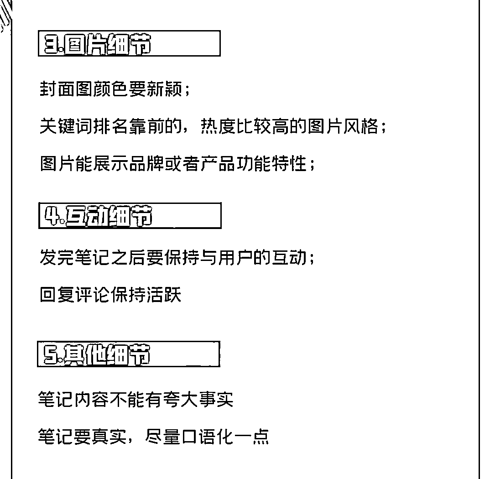<ne-text id="u79aa16c8">2.小红书被限流的的十大原因</ne-text><ne-card data-card-name="image" data-card-type="inline" id="MqDVx" data-event-boundary="card"><ne-card data-card-name="image" data-card-type="inline" id="Ybah1" data-event-boundary="card">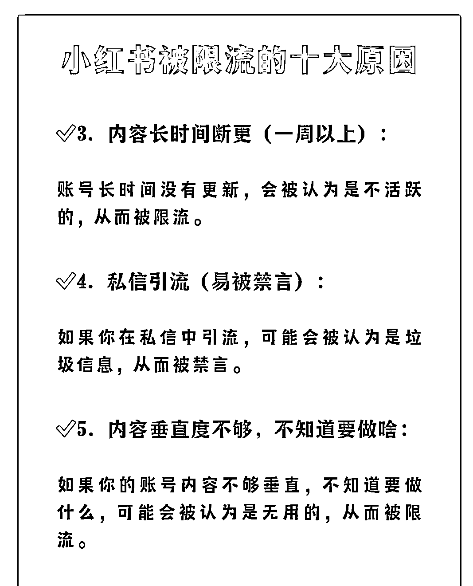<ne-card data-card-name="image" data-card-type="inline" id="b0JzX" data-event-boundary="card">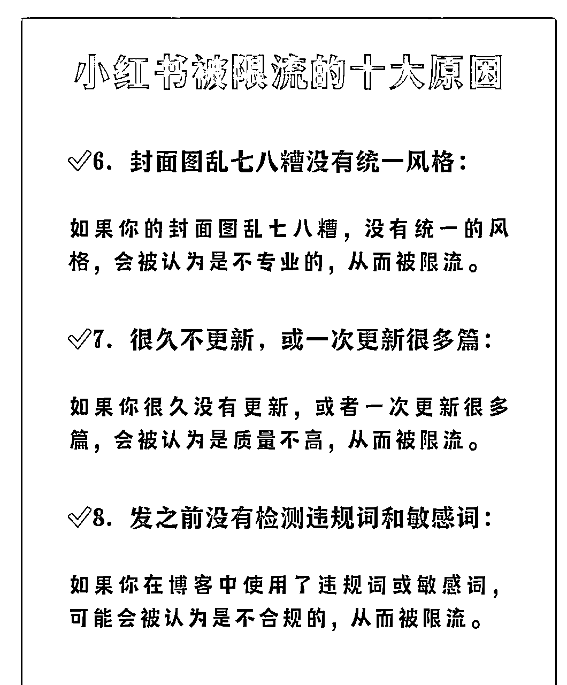<ne-card data-card-name="image" data-card-type="inline" id="j3ocT" data-event-boundary="card"><ne-text id="u3dddb775">3.近期 50 个爆款关键词</ne-text><ne-card data-card-name="image" data-card-type="inline" id="G51wo" data-event-boundary="card"><ne-card data-card-name="image" data-card-type="inline" id="kmlks" data-event-boundary="card"><ne-text id="uc5d8244b">再告诉大家一个非常实用的方法，多加几个官方小二，没事多看看他的朋友圈最近在说什么。</ne-text><ne-text id="u1fb0d24f">好了，总结一下今天的分享：</ne-text><ne-text id="uc1ccdb12">1.不管什么选品方法，你要知道爆款和潜力款</ne-text><ne-text id="u28e0c678">。</ne-text><ne-text id="ua22a83cd">解题的方式很多种，答案就一种。</ne-text><ne-text id="u49888c7d">2.生意的本质就是信息差，红海中找到蓝海品，短期做红利的生意，上次做门槛的生意。</ne-text><ne-text id="u02c14353">3.不管二剪还是原创，只要你的内容没有出现在平台，那就是原创。</ne-text><ne-text id="u67505a42">4.一些小技巧可避免平台发短信给客户。</ne-text><ne-text id="u58c22d30">5.平时拍单可拿到返点，让我们多一份营收。</ne-text><ne-text id="u5970f8b7">6.</ne-text><ne-text id="u8935a42b">辨别打假人</ne-text><ne-text id="u8c45a576">的级别，在每个阶段尽可能把风险降到最低。</ne-text><ne-text id="u264b119c">7.和官方的小二更近一些。</ne-text><ne-text id="u29c0e03b">我的分享就先到这里，有幸和各位优秀的圈友一起航行。</ne-text>  <ne-hole id="u10457ac5" data-lake-id="u10457ac5"><ne-card data-card-name="hr" data-card-type="block" id="O2eFS" data-event-boundary="card"><ne-p id="u7d7a5575" data-lake-id="u7d7a5575"><ne-text id="u46f78c60">评论区：</ne-text></ne-p> <ne-p id="uccfa7d87" data-lake-id="uccfa7d87"><ne-text id="u6743bbd7">饭饭 : 分享的干货！</ne-text> <ne-text id="ud3d5da46">北辰 : 干货满满，学到了！感谢分享！</ne-text> <ne-text id="u429d5da0">亦仁 : 感谢分享，已加精华。</ne-text> <ne-text id="ue9951859">王舒林 : 哈哈哈哈  妥妥干货  补充一句  我是玩抖店  可以直接找商家谈下佣金和价格  精选联盟上的都没拉满（我自己的品全部拉满了，直接卷死所有抖音商家，带货的人我们家就最多）</ne-text> <ne-text id="u5b71f03c">邹公子🌞野望 : 打假人这个坑实在是太经典了！最近经济下行，大家火气都大，咱就主打一个和气生财~</ne-text> <ne-text id="u60e11637">听潮 plus : [强][强][强][强]</ne-text> <ne-text id="ub9a2fc12">Nick : 我有个吹风筒货源可以合作吗？</ne-text></ne-p></ne-card></ne-hole></ne-card></ne-card></ne-card></ne-card></ne-card></ne-card></ne-card></ne-card></ne-card></ne-card></ne-card></ne-card></ne-card></ne-card></ne-card></ne-card></ne-card></ne-card></ne-card></ne-card></ne-card></ne-card></ne-p>