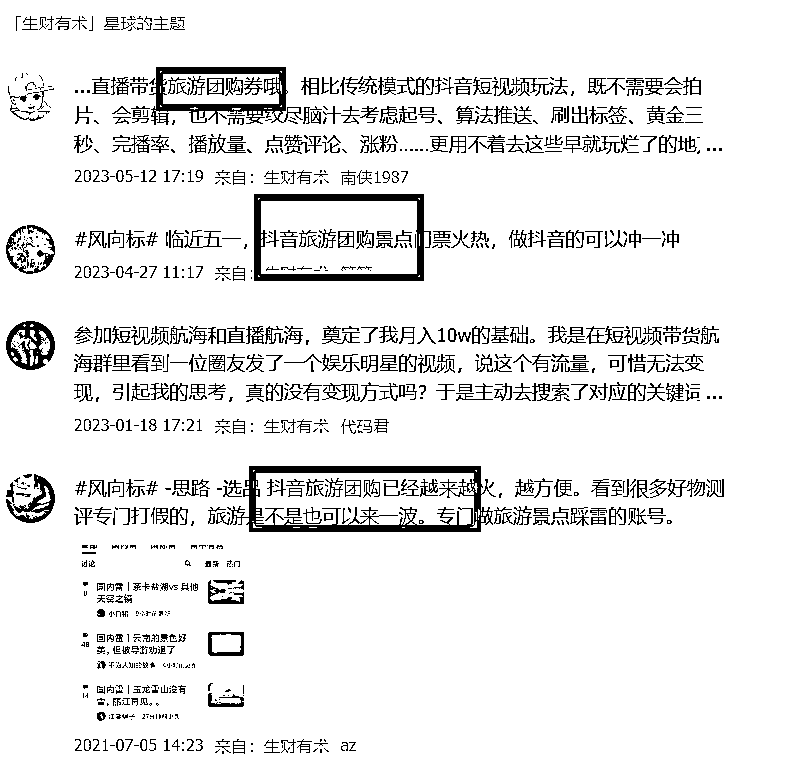
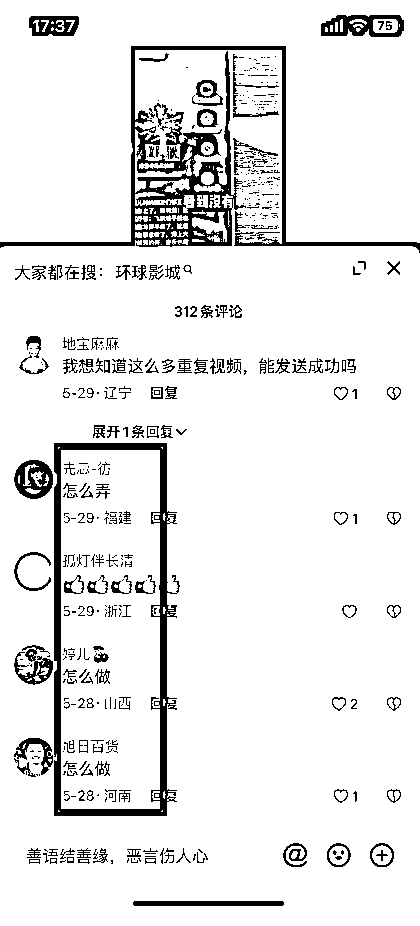
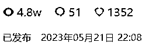

# 我是如何通过航海，拿到 4K 精准粉的实操经验分享

> 原文：[`www.yuque.com/for_lazy/thfiu8/sgr6ukvqow0l9m8g`](https://www.yuque.com/for_lazy/thfiu8/sgr6ukvqow0l9m8g)

<ne-h2 id="2401ab41" data-lake-id="2401ab41"><ne-heading-ext><ne-heading-anchor></ne-heading-anchor><ne-heading-fold></ne-heading-fold></ne-heading-ext><ne-heading-content><ne-text id="uff36ccf1">(精华帖)(22 赞)我是如何通过航海，拿到 4K 精准粉的实操经验分享</ne-text></ne-heading-content></ne-h2> <ne-p id="u47a00ced" data-lake-id="u47a00ced"><ne-text id="u542474fb">作者： 行</ne-text></ne-p> <ne-p id="u87c9f7ec" data-lake-id="u87c9f7ec"><ne-text id="u5ef700d0">日期：2023-07-06</ne-text></ne-p> <ne-p id="u27a079b0" data-lake-id="u27a079b0"><ne-text id="uac9d0cfe">6 月 8 日《我是如何通过航海，拿到 4K 精准粉的实操经验分享》@八斤</ne-text><ne-text id="u4c8e5484">6 月 8 日《我是如何通过航海</ne-text><ne-text id="u0134fb9c">，</ne-text><ne-text id="u0642fc52">拿到 4K 精准粉的实操经验分享》@八斤</ne-text><ne-text id="uf18c92a9">各位圈友大家好，我是八斤，目前在做私域这个难而正确的事。</ne-text><ne-text id="u5d35d39e">很荣幸被子安邀请分享，今天分享主题是：我是如何通过航海拿到 4K 精准粉的实操经验分享。</ne-text><ne-card data-card-name="image" data-card-type="inline" id="WHvoe" data-event-boundary="card"><ne-text id="ue84d60ef">在正式分享前，先分享一下我对抖音</ne-text> <ne-text id="ubc1263b9">SEO</ne-text> <ne-text id="u1674afb3">的理解。</ne-text><ne-text id="ue890bb32">这件事的底层逻辑是内容逻辑，提升搜索排名的原理是系统数据反馈。</ne-text><ne-text id="u54d632f6">系统是用数据反馈来评选好的内容的，发现用户通过自己的需求搜索答案，看到你的视频点击观看，对视频是有贡献的，比如点赞、评论、收藏、关注、分享；</ne-text><ne-text id="u9806268e">用户的行为动作能让系统认为咱视频是有用的，排名靠前也是基于这些数据。</ne-text><ne-text id="uc5a9a318">所以，我们做内容的目的就是让用户对视频产生正向的行为动作，以此来优化排名。所以，我对</ne-text> <ne-text id="uf0939818">SEO</ne-text> <ne-text id="ue1474ce8">内容获客的理解公式：用户需求够大+痛点够痛+干货够干</ne-text><ne-text id="u43259021">一、我是怎么找到这个项目的</ne-text><ne-text id="u0bc3f271">我的找项目方法：</ne-text><ne-text id="ue4909050">勤刷生财风向标，保持在自己行业最小信息差。</ne-text><ne-text id="uebc5bf67">分享一个刷风向标不遗漏小技巧，我一般是今天早上刷昨天的风向标作为时间节点的。生财风向标真的是个宝藏库，第一次靠风向标吃到流量红利是靠圈友这条百度问答风向标，我做到了抖音</ne-text> <ne-text id="uc86b5db3">SEO</ne-text> <ne-text id="ud1ca55e4">第一。</ne-text><ne-card data-card-name="image" data-card-type="inline" id="oNHNB" data-event-boundary="card"><ne-text id="ue02e9ca5">复盘结果：当时没有</ne-text> <ne-text id="uef0a5d78">SEO</ne-text> <ne-text id="u1a430b36">优化意识，就吃老本，有流量了就引流，也没认证蓝 v，最后被恶意举报，导致歇菜。</ne-text><ne-text id="uc5c7668f">所以参加了本次</ne-text> <ne-text id="u60dcef82">SEO</ne-text> <ne-text id="u872e6c20">航海，本次航海期间选题也是来自生财风向标，旅游赛道：</ne-text><ne-card data-card-name="image" data-card-type="inline" id="VBKLU" data-event-boundary="card"><ne-text id="u4bd54ee2">二、选题做内容</ne-text><ne-text id="u983c6e66">确定好项目方向后接下来就是找选题和做内容，还是生财那句话，试试看，成本不大！</ne-text><ne-text id="ua2f7a0c6">准备在一个陌生领域着手前，一定要带着疑问去搜索答案的，从了解项目的整体玩法、挖掘用户痛点到内容发布，一共花了 12 个小时。</ne-text><ne-text id="u8dc785ba">2.1 摸清项目链路</ne-text><ne-text id="u972b6f57">在抖音、知乎、生财上搜索相关帖子，基本上能解决大部分问题，实在不行那就找人问了</ne-text><ne-text id="ue5211b2b">。</ne-text><ne-text id="u24e1926c">可以</ne-text><ne-text id="u62dee6f1">带着以下几个问题去搜索：</ne-text><ne-text id="ua2bbc4e8">01：项目怎么玩的</ne-text><ne-text id="u35208f5b">02：项目的底层逻辑是什么</ne-text><ne-text id="u5d39d6b7">03：项目怎么变现的</ne-text><ne-text id="uec555dde">04：我做这个项目需要具备哪些技能</ne-text><ne-text id="u0d857e51">除此之外，还可以通过别人的交付大纲，来逐步搜索；只需要清楚一个大概的项目玩法就行</ne-text><ne-text id="uf5673f40">2.2 找选题</ne-text><ne-text id="u9ed109f9">了解了整体想法之后，我开始着手确定内容的选题，戳中目标用户痛点的选题更容易爆，更容易被搜索到，所以我在刷抖音时，最关注的就是用户的声音。</ne-text><ne-text id="ub51a8fad">我当时</ne-text><ne-text id="u40076f08">在抖音上刷到谋事他们跑的关于旅游的信息流广告和直播，看到</ne-text><ne-text id="u94315f61">了</ne-text><ne-text id="ud4fe6a45">他们砸钱跑广告，说明这事有搞头，就留了一个心眼</ne-text><ne-text id="u2fccf839">。然后我</ne-text><ne-text id="udd1fd8ba">看了一下他们直播间和短视频的评论区讨论</ne-text><ne-text id="ud573459a">内容</ne-text><ne-text id="u15ff2bb5">，发现这块是有大需求的，用户痛点也是暴露的一览无余，这一下子选题方向和用户痛点全明了</ne-text><ne-text id="ue5e52b85">。</ne-text><ne-card data-card-name="image" data-card-type="inline" id="Bn4oP" data-event-boundary="card"><ne-card data-card-name="image" data-card-type="inline" id="pf4DQ" data-event-boundary="card"><ne-text id="ubd260e40">大家找选题就可以按照这个方式找，找别人砸钱推广告做的事，这件事大可能有搞头</ne-text><ne-text id="ucbf61d77">。</ne-text><ne-text id="u65447b7a">用户需求都在评论区里需要被挖掘</ne-text><ne-text id="uddb7d03c">。</ne-text><ne-text id="u4cfc7313">2.3 内容制作</ne-text><ne-text id="u9bf96aca">找到符合用户需求的选题之后，就开始制作内容了。</ne-text><ne-text id="u8e9b2be8">我做内容的标准是</ne-text><ne-text id="u6a542cfd">：</ne-text><ne-text id="u01df62ac">文案：通俗易懂，给用户一种听到即得到的感觉</ne-text><ne-text id="uc2d611a4">；</ne-text><ne-text id="ua5506f79">内容展现：减少用户的思考成本</ne-text><ne-text id="u3eb715d8">内容展现形式用的是 PPT 讲解，真的好用，大部分领域可以用，制作起来也很简单。</ne-text><ne-text id="uce66686a">第一步：根据选题来列大纲</ne-text><ne-text id="ua8dd9062">第二步：制作 PPT 内容</ne-text><ne-text id="u8930a295">第三步：跟着 PPT 写文案植入</ne-text> <ne-text id="u70949340">SEO</ne-text> <ne-text id="u0a431e4e">关键词+植入钩子</ne-text><ne-text id="u0cc5e871">第四步：后期剪辑合成即可</ne-text><ne-text id="u90118b4a">三、做优化及维护</ne-text><ne-text id="u81cd52e7">这是第一条视频的数据（以下视频数据均是跑到现在的数据）</ne-text><ne-card data-card-name="image" data-card-type="inline" id="ldLz6" data-event-boundary="card"><ne-text id="ua6b2f666">第一条视频的选题尽可能大一点，</ne-text><ne-text id="u6020e43e">比如</ne-text><ne-text id="u875c9267">旅游团购</ne-text><ne-text id="u7b78b327">怎么做</ne-text><ne-text id="u7092a72c">？</ne-text><ne-text id="u8b21a40c">如何做</ne-text><ne-text id="u0b413a97">？根据这个选题</ne-text><ne-text id="ua05049f8">做一个保姆级教程类的，</ne-text><ne-text id="u3fc09288">这样做的好处是用户需求大，流量大。</ne-text><ne-text id="uf5f28d96">视频发布时间是晚上 21：29，第二天起来看了一下数据，发现流量大部分来自综合搜索页，这时候继续抓</ne-text><ne-text id="ubd03bfc7">用户痛点</ne-text><ne-text id="ufd898e58">，</ne-text><ne-text id="uf19703e9">第二条视频在第一条视频里选针对性的话题去详细补充，</ne-text><ne-text id="u7ae483c5">建立合集补一条视频进去，这是第二条视频数据。</ne-text><ne-card data-card-name="image" data-card-type="inline" id="RCFhi" data-event-boundary="card"><ne-text id="u0a82b779">看到第一条视频综合搜索页流量排第一后，选择投放了两百豆荚，激活一下，豆荚跑了一晚上，效果巨差，烧了 70 来块就选择止损了。原因是选择了涨粉，这里大家一定要避坑！</ne-text><ne-text id="u398771ab">关于投放豆荚，这里跟大家分享个心得</ne-text><ne-text id="ufdb1ff79">豆荚流量和推荐流量可以理解为两个流量管道，投放豆荚不要把人群限制，就投点赞评论就行了。投放的目的和我们做内容的目的一样，就是让用户对视频产生正向的行为动作，以此来优化排名，推动自然流</ne-text><ne-text id="ucd1438d5">。</ne-text><ne-text id="u56e1863d">到第三天，第一条视频推荐流量开始跑起来了，看到有流量后继续抓用户痛点往合集里补视频，</ne-text><ne-text id="ud12a1229">第三条视频切入用户痛点是来自评论区，</ne-text><ne-text id="ubdee63cf">这是第三条视频数据</ne-text><ne-text id="u47cecd5c">。</ne-text><ne-card data-card-name="image" data-card-type="inline" id="q6Vyl" data-event-boundary="card"><ne-text id="u831570b5">第三天这时候，第一条视频流量爆了完全能带动了后面这几条视频的，因为三条合集视频流量是有联动作用的。</ne-text><ne-text id="u556646b3">然后我就又踩了个坑：</ne-text><ne-text id="u3348888c">当时看到我的视频已经是旅游细分赛道</ne-text> <ne-text id="u34c346e4">SEO</ne-text> <ne-text id="u0eae681f">排名第一，而且踩了两个关键词后开始松懈了，准备办理营业执照认证蓝 V，引流，就把心思放在这件事上了。</ne-text><ne-text id="u94eaa7e5">然后</ne-text><ne-text id="u93128bd5">动作</ne-text><ne-text id="u62ac03e6">就</ne-text><ne-text id="u89924aea">开始变形，啥也不知道</ne-text><ne-text id="u0b7e9722">，</ne-text><ne-text id="uaac3e0dd">一顿</ne-text><ne-text id="ua6a87c32">瞎</ne-text><ne-text id="u90343bcb">摸索</ne-text><ne-text id="u9484cbda">。虽然</ne-text><ne-text id="u1cf34c3c">看到大家说可以网上代办，</ne-text><ne-text id="u1a5eb831">但是</ne-text><ne-text id="u5da9622d">第一次干这事，首先</ne-text><ne-text id="u901230e8">我</ne-text><ne-text id="u50c7ca97">怕</ne-text><ne-text id="u4f139a66">代办</ne-text><ne-text id="u16702037">不靠谱，其次是想自己把这件事落实一遍涨涨经验，最后，还是被经营场所打败，选择了代办，一共花了一周时间左右。</ne-text><ne-text id="u2c1e929a">后面再去搜索关键词的时候，排名已经掉到前五了，这个时候毫不犹豫补合集视频，在评论区发现用户痛点，就回复「下期我出个教程吧」，几经周折排名又回归到第一。</ne-text><ne-text id="u48762d41">这个时候还没有蓝 V 认证，排名一直不稳定，所以蓝 V 认证是有必要的，但建议大家在还没认证蓝 V 之前，不要做任何引流动作，不然非常容易被封号，最近已经封了一批伙伴了。</ne-text><ne-text id="ua4cd4d40">现在蓝 V 认证后，想引流效果也是大大折扣的，因为流量是有时效性的，最好是在最短时间内把引流到转化小闭环</ne-text><ne-text id="u39c1c9a6">完成，流量来了，不要松懈多挖用户需求补视频合集，这也是我踩的一个坑吧，没有及时去维护。</ne-text><ne-text id="uc0d53997">3.1 关于变现</ne-text><ne-text id="u71797972">我认为</ne-text><ne-text id="ue74a2973">在设计引流获客到变现交付的时候，</ne-text><ne-text id="u968c0c2b">可以</ne-text><ne-text id="u8d69dec0">本着小需求做钩子，大需求做变现的原则进行</ne-text><ne-text id="u1e278b40">。</ne-text><ne-text id="ubedfcd98">即</ne-text><ne-text id="u97ee3cbe">用视频内容解决用户痛点，钩子植入用户需求（转化到私域），通过聊天等形式了解用户的大需求，顺理成章的把产品推出去</ne-text><ne-text id="u4fa3f998">。</ne-text><ne-text id="uf1fd4c06">用来盈利转化的</ne-text><ne-text id="u83f6abc7">产品</ne-text><ne-text id="u7bc72b38">，</ne-text><ne-text id="u2272da2a">可以是本身自营的，</ne-text><ne-text id="ub52e21d2">也可以找其他人合作。</ne-text><ne-text id="u38dc0306">如果</ne-text><ne-text id="uf91d3e46">自己</ne-text><ne-text id="uc4d0570f">没有</ne-text><ne-text id="uda144f10">产品，可以考虑</ne-text><ne-text id="u2f22d99a">跟我一样找生财圈友合作</ne-text><ne-text id="u92d2e1ab">。这样</ne-text><ne-text id="u29f224a8">我们</ne-text><ne-text id="u790f9c67">自己只</ne-text><ne-text id="ud7036849">搞流量就好了，</ne-text><ne-text id="ue715b785">后续的</ne-text><ne-text id="u93f3cc63">交付给靠谱的培训方，剩下的就是分钱的事儿</ne-text><ne-text id="u62ffb35a">。</ne-text><ne-text id="ud2123485">变现的两大难点</ne-text><ne-text id="ubc4dfafb">：</ne-text><ne-text id="u861cbf36">01</ne-text><ne-text id="u86689b2f">拉近信任</ne-text><ne-text id="ud44b1632">02</ne-text><ne-text id="u0441ddd5">丝滑推产品，不引起反感</ne-text><ne-text id="u7a485cca">这两个难点我也在一直找更多的办法解决，目前有一个沟通小技巧，分享给大家：</ne-text><ne-text id="ue99e1e67">在跟用户聊天的时候，</ne-text><ne-text id="u8691a59f">可以</ne-text><ne-text id="uf2036640">尽量用语音沟通，拉近用户对我们的信任</ne-text><ne-text id="u8570ca36">。</ne-text><ne-text id="uc220d3ea">3.2</ne-text> <ne-text id="uf955caca">我踩过的坑合集</ne-text><ne-text id="u325bd3a3">01：认证蓝 V，大家可以提前准备营业执照，不要等到流量来了再去准备，不然跟我一样措手不及</ne-text><ne-text id="u2eff502d">02：投放豆荚，投放的目的就是要迎合</ne-text> <ne-text id="ud3e3bdfe">SEO</ne-text> <ne-text id="ud3a28ac7">的底层逻辑，加速视频权重（这是我后面明白的）</ne-text><ne-text id="u160f2796">03：流量是具有时效性的，来了就要及时承接住，最好在最短时间内完成小闭环</ne-text><ne-text id="u1aacdfe7">3.3</ne-text> <ne-text id="u59ec5ff2">最后总结</ne-text><ne-text id="u7fe8c223">找选题=找用户关注点</ne-text><ne-text id="ud6abe772">做内容=帮助用户解决痛点</ne-text><ne-text id="u30e2ee8d">优化排名=迎合</ne-text> <ne-text id="u9d563df7">SEO</ne-text> <ne-text id="u12bc2f27">底层逻辑做数据</ne-text><ne-text id="u94e1a048">SEO</ne-text> <ne-text id="u3c2abab9">一定要去做，不做 SEO，爆一条视频，你只能拿到 7 天的推荐流量，做了 SEO，这条视频能吃一年甚至更久</ne-text>  <ne-hole id="u5e6a37ce" data-lake-id="u5e6a37ce"><ne-card data-card-name="hr" data-card-type="block" id="vNbjr" data-event-boundary="card"><ne-p id="u604acd08" data-lake-id="u604acd08"><ne-text id="u11b7d143">评论区：</ne-text></ne-p> <ne-p id="u30614cdc" data-lake-id="u30614cdc"><ne-text id="u68407745">亦仁 : 感谢分享，已加精华。</ne-text></ne-p></ne-card></ne-hole></ne-card></ne-card></ne-card></ne-card></ne-card></ne-card></ne-card></ne-card></ne-p>