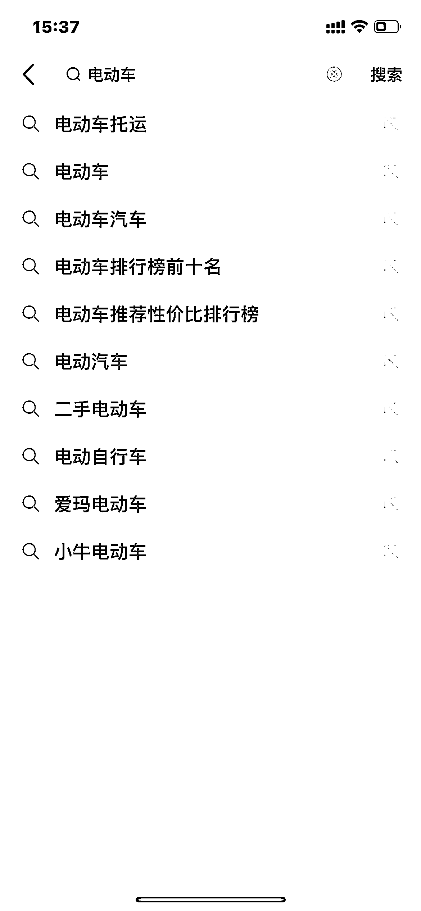
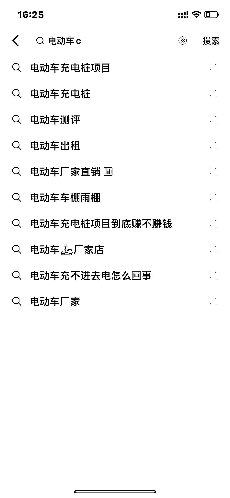
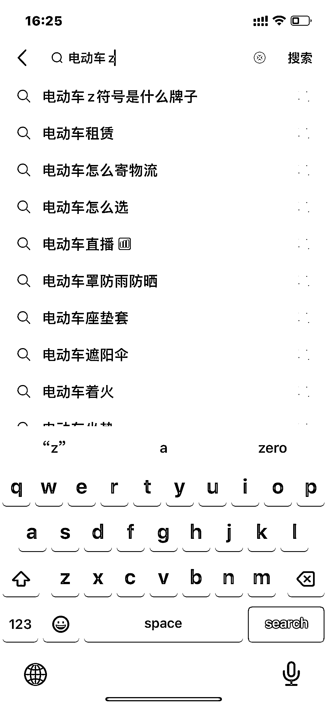
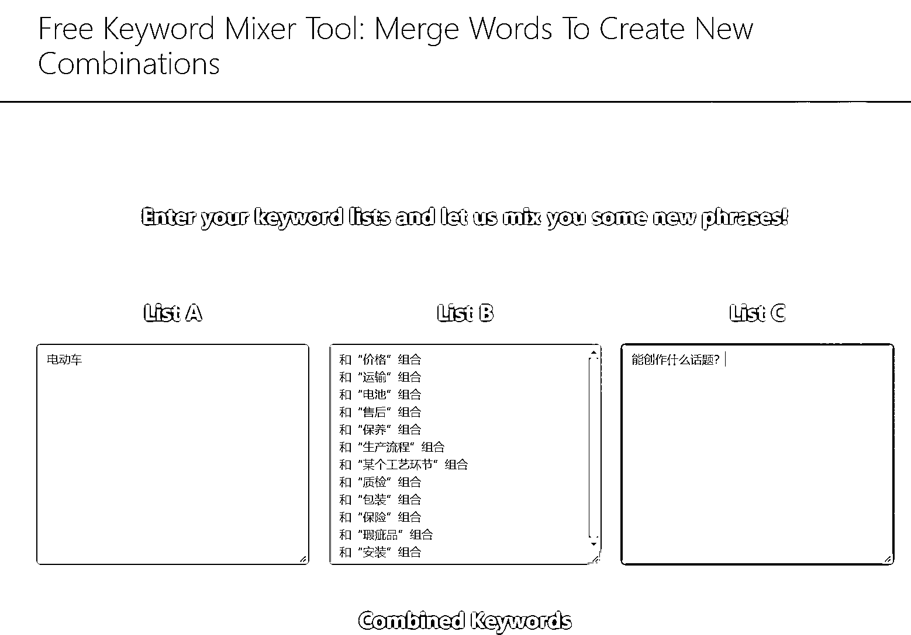

# 如何用谷歌 SEO 的内容营销方式做抖音 SEO

> 原文：[`www.yuque.com/for_lazy/thfiu8/uh347vtdybu8f455`](https://www.yuque.com/for_lazy/thfiu8/uh347vtdybu8f455)

## (32 赞)如何用谷歌 SEO 的内容营销方式做抖音 SEO 

作者： 马钱钱|玩赚独立站 

日期：2023-07-04 

6 月 1 日《如何用谷歌 SEO 的内容营销方式做抖音 SEO》@马钱钱6 月 1 日《如何用谷歌 SEO 的内容营销方式做抖音 SEO》@马钱钱个人介绍📌马钱钱玩赚独立站创始人， 谷歌 SEO 内容营销规划师，会搞流量能拿订单的 8 年外贸人 一、目前在做的方向大家好，我是马钱钱，一名谷歌 SEO 内容营销规划师，曾用 2 个月时间，在谷歌搜索引擎上拿到精选摘要，获得了能持续固定在第一位置曝光的机会（即下图自然排名为第 0 名的位置），这可以说是谷歌最大的免费广告位。我主业是帮助外贸企业，在谷歌上进行品牌推广，用 SEO 内容营销的方式，争取自然排名，获得流量和订单。在今年新启动的外贸独立站项目中，用 3 个月实现月询盘（客户线索）100+，变现 50w+，其他客户线索还在转化中。同时，我也用这个方式来尝试了抖音 SEO, 在抖音上，同样拿到了某关键词的第一位，并持续了 1 年了。那么，接下来，我想跟大家聊聊我在做 SEO 内容营销过程中的一些心得，希望能在抖音 SEO 的内容创作中，给你一点启发。二、0 基础新手，我是如何做谷歌 SEO，拿到精选摘要？你可能会注意到，我更愿意提到内容营销，而不是仅仅 SEO 这三个字母。为什么？我们知道 SEO，它原本指的是搜索引擎优化，是持续地优化网站的内容，在搜索引擎上获得更好的自然排名。但是，SEO 还包含很多其他的板块，比如内容营销、外链建设、用户体验、编码和网络开发等等。而这其中，最重要的是内容营销，它在竞争自然排名中的权重占了 80%左右。为什么？ 因为平台的算法已经足够智能，它能判断内容的好坏，它能够自动抓取它想要的东西，然后把这些有价值的内容，进行爬取、收录、分析、匹配，再推送到需要它的客户面前。所以我个人是不做外链、不堆砌关键词、不盯着没用的数据的，有这些时间，我可以用来写好多博客文章了，用来写视频脚本，用来拍视频了。因此，我的主打原则只有一个：内容为王，为用户提供价值、为用户解决问题。你要坚信，只要内容足够好，足够专业，足够用心，足够利他，剩下的请交给时间，方法正确的前提下，排名上去的迟早的事。你肯定不能想着为了特地留个钩子引流，录一个 1 分钟视频，然后用学来的知识，就指望它给你排到第一名，然后哗哗哗的流量就来了。如果是这样，那你的出发点就错了。你喜欢看没料，还老带广告的视频吗？还肯定不能，对吧。所以方法，就很重要了。以下是我总结出来做谷歌 SEO 内容营销的九个步骤，也是我拿到谷歌精选摘要的实操方法：💡一、摸透搜索意图本质，才能抓住客户的“胃二、以终为始，学习谷歌排名的搜索结果页三、做好 SEO 站内优化，提升精准流量转化率四、掌握十大 SEO 技术要点，提升用户体验五、深度调研关键词，全面分析竞对同行六、创作源源不断的话题，敲定 365 天的内容输出七、四大标准文章模型，掌握谷歌内容营销精髓八、搭建国外专业写手团队，持续创作高质量文章九、AI 博文智能写作，用 ChatGPT 轻松写专业文章三、实操过程中有哪些小技巧那我们把这个方法，放到抖音 SEO 这件事上来，有哪些可以借鉴呢？第一点，搜索意图。我看到咱们群里很多小伙伴在问关于相关性的问题，其实它底层逻辑就是你输出的内容，跟用户的搜索意图，也就是用户想要的，是不是匹配的。你在输出一个话题前，肯定要知道用户搜索这个关键词背后的目的和想法是什么。你可以换位思考，如果你是用户，你去搜索这个关键词，会是出于什么原因？那么你再从你想要得到的结果出发，去写文案、录视频，这样的输出，一定会是用户想看的。比如电动车这个关键词，我看到了电动车托运，你觉得它背后的搜索意图是什么？我们来头脑风暴一下：这个人换工作，需要换城市生活，他有一辆电动车，但是扔了又很可惜，当二手的卖了又很亏，如果他托运到另一个城市还能继续用啊。这时候，他的需求就是电动车托运。那么，与电动车托运相关的话题，你会想到什么？你是用户，你会关心什么呢？电动车托运的运费、价格？电动车能不能托运到 XXX 城市？电动车托运的注意事项？会不会弄坏、刮花、怎么打包等等，电动车托运的保险等等那么，你把这些相关的话题，做成一个视频集合，你觉得你能在"电动车托运"这个关键词下，你能拿到排名吗？前提仍然是，你的分享从对别人有价值的角度出发，真诚的分享出来。这样一来，搜这个关键词的人，就会觉得你分享很用心，爱看、播放时长也上去了，再给你点赞、收藏、评论、转发，是不是数据也就上去了，排名也就上去了。如果你是做物流、托运的服务商，由电动车托运，你还能做摩托车托运，对吧？比如很多人去西藏骑行，去的时候，兴奋的骑过去了，但是回来就乏了，骑不动了，这类群体，也是需要托运服务的，你就可以针对性地输出内容。因此，从你的产品、业务角度出发，去挖掘用户背后的搜索意图，你创作出来的内容，才算有意义的，才是有人想看的，吸引来的这类客户，也会是更精准、垂直的潜在客户。第二点：搜索结果页搜索结果页的呈现，在谷歌上太多种多样了，有图片、文字、地图、计时器、视频、数字、表格等等，但咱们把它用在抖音上来，就很纯粹了。因为咱们抖音上的搜索结果，都是视频，它是视频赛道，对吧？所以我们能做的是什么？把我们的视频结果做得漂亮些。封面、标题、文本颜色等等，一定是简单明了，突出重点，最吸睛的，用户才更愿意点进去。这些内容咱们之前生财有术商业 IP 大航海，抖音直播大航海，以及有很多优秀的圈友已经分享过，我就不展开啦。第三点：关键词深度调研这部分在咱们的学习手册里以及前几天教练的分享里，也有很详细地讲过啦，由于我平时主要是做英文内容的输出，因此关键词工具，英文版本用的比较多，但是国内的工具，仍在学习阶段，这里也不展开说明了。第四点：源源不断的话题创作我想问大家一个问题，你们在做了关键词调研后，会不会不知道怎么确定话题？怎么输出？要写什么呢？比如：我的关键词那么少，没有值得用来创作的怎么办？ 一年 365 天，我能绞尽脑汁想出来 50 个都很不容易了，咋整？我这里分享给大家 2 个方法：字母调研法和工具组合法，能帮助大家去收集更多的关键词，用于源源不断的话题的创作。方法一：字母调研法字母很简单，从 A-Z 有 26 个，我们都知道。那我们要做的产品或者品类的关键词也是知道的。那么，我们把二者结合一下，放到抖音的搜索框里：【关键词+字母】来搜索看看，记得从 a-z 哦~比如我们还是用电动车来举例：你有发现什么吗？是不是仅仅一个关键词，就可以和 26 和字母组合，找到至少 260 个相关的话题。你再从这些话题里，筛选过滤，找出跟自己业务相关的词去进行短视频创作，把按照对应的话题，提炼一个爆款标题放到封面，就完成了一个作品的创作。是不是很简单呢？那么，【电动车】这个关键词，你还可以无穷变换，再结合 26 个字母去挑选话题，你认真规划一个周，一年的视频创作内容都整理出来了，对不对？方法二：工具组合法这个方法，主要是用来帮助你创作话题的，给你更多的灵感和提示。首先你要根据自己的产品和业务，把能创作的话题方向收集整理出来，越多越好，然后将它跟不同的流量词结合。📌公式：非同义词的流量词 + 和“XXX”组合 + 能创作什么话题？比如流量词：电动车 + 和“XXX”组合（这里需要自行发挥）+ 能创作什么话题？那么，我需要整理一些跟电动车相关的话题，同时最好也跟我的业务相关。什么意思呢？这些可以用来组合的词，引来的流量，最好尽可能帮我引来的是潜在客户。所以，你造的话题，跟你的业务越相关，粉丝越精准，越容易转化。那举个例子，电动车，我随便写几个：和“价格”组合和“运输”组合和“电池”组合和“售后”组合和“保养”组合和“生产流程”组合和“某个工艺环节”组合和“质检”组合和“包装”组合和“保险”组合和“瑕疵品”组合和“安装”组合📌拿出我们的组合工具：https://seoscout.com/tools/keyword-combinerhttp://kombinator.org/可自行在谷歌上搜索 Merge words or Keywords Combinator，找一款能用的工具就行然后我能拿到一系列的话题创作提示，把它放到我的表格里，开始头脑风暴，借助爆款标题的公式来创作就好了。最后，我们把上面 2 种方法，收集的关键词和造的话题，放到你的关键词表格对应的地方。比如下面是我的关键词库，我从里面挑选好一个词去创作，就打勾，它就自动地到我的【已入库关键词】。已入库的词，我可以结合自己的业务，又可以进行话题创作。每确定好输出的话题，想好一个标题，又自动入库到【话题清单库】，这个话题清单库，就可以是我一整年的输出计划了。这个方法，能解决你话题枯竭的烦恼吗？四、实操过程中有踩过什么坑，你是怎么解决的抖音 SEO，也就是抖音短视频的创作，更多的是一个熟练的过程。它由很多个环节组成，才能创作出来一个作品，最需要的是我们的执行力和毅力，而这往往是最难的。虽说，说工欲善其事，必先利其器。我中间在工具上浪费了很多时间，比如我买了佳能 G7X III， 买了 Blue Yeti， 买了 DJI Pocket，等等一堆的东西，试图通过工具来缓解我每个环节遇到的不适。但发现，做好短视频口播，在方法跑顺了的前提下，最重要的还是执行力。而最简单的设备，也就是一部手机和一个支架了。五、对新手小伙伴的建议和鼓励1.专注内容质量与其不断地纠结自己的长相、出镜效果、有没有开美颜、需不需要化妆， 反而你传递出去的知识、经验、观点才是最重要的，没有人真正在乎你长什么样，而是更在乎的是能从你的视频里收获什么。2\. 多学习吸收、不断优化迭代持续地练习，通过学习优质创作者的封面制作、标题、字幕配色、背景音乐、转场等剪辑方法，不断地优化自己视频的质量，特别是多拆解优质文案，提升自己的文案输出功底，做好一个短视频跟写好一篇高质量文章一样重要，因为它会持续给你带去流量。3.形成自己的 SOP，提高效率，让整个创作流程更顺滑从关键词调研，到话题创作，文案写作框架，到视频拍摄、剪辑流程，最后到上传发布的技巧，我们都可以整理成自己的 SOP 文档，每一次学习来的新的知识点和技巧，又能不断地优化、迭代，再及时地更新进这个抖音 SEO 知识库。这样，咱们就能更轻松地去做好抖音短视频输出，于是也就能做好抖音SEO这件事啦。  

评论区： 

暂无评论