# AI 绘画变现思路分享

> 原文：[`www.yuque.com/for_lazy/thfiu8/rbfsgdvx8l1w0fe3`](https://www.yuque.com/for_lazy/thfiu8/rbfsgdvx8l1w0fe3)

<ne-h2 id="2d2fbd04" data-lake-id="2d2fbd04"><ne-heading-ext><ne-heading-anchor></ne-heading-anchor><ne-heading-fold></ne-heading-fold></ne-heading-ext><ne-heading-content><ne-text id="u307eb485">(精华帖)(158 赞)AI 绘画变现思路分享</ne-text></ne-heading-content></ne-h2> <ne-p id="u98d6db8b" data-lake-id="u98d6db8b"><ne-text id="uead40fde">作者： 蕃茄</ne-text></ne-p> <ne-p id="u8727c4fe" data-lake-id="u8727c4fe"><ne-text id="u1687e490">日期：2023-07-04</ne-text></ne-p> <ne-p id="u14f9552c" data-lake-id="u14f9552c"><ne-text id="ubc764f38">6 月 1 日《AI 绘画的几种变现模式》@蕃茄</ne-text><ne-text id="ue089b302">6 月 1 日《AI 绘画的几种变现模式》@蕃茄</ne-text><ne-text id="uc1e4029e">哈喽，大家好。我是蕃茄，非常感谢大家能在百忙之中，抽空来听我的分享。</ne-text><ne-text id="u1048299e">在这个快节奏的社会中，不知道大家是否想找一种稳定且可持续的副业来源。虽然许多项目号称可以让您迅速致富，但很少有能够确保长期稳定收入的方法。今天，我</ne-text><ne-text id="ue78a1ebf">来</ne-text><ne-text id="uf9f1a838">分享一些自己实践过的 AI 绘画变现方法，</ne-text><ne-text id="ucd11aaf8">希望</ne-text><ne-text id="u502b5680">能够帮助大家从</ne-text><ne-text id="u1d3bc1e2">0</ne-text><ne-text id="uf5def38a">到</ne-text><ne-text id="u1a891a07">1</ne-text><ne-text id="u900474fc">迈出第一步。</ne-text><ne-text id="ud0d4fca2">这次分享内容的特点是，虽然这些项目的收益不会让您一夜暴富，但只要您每天坚持投入一点的时间和精力，就会看到收益稳定增长。通过学习和应用这些内容将能够在各位日常生活中创造额外的收入来源。</ne-text><ne-card data-card-name="image" data-card-type="inline" id="pUBbO" data-event-boundary="card">图片加载失败<ne-text id="ue9b886b0">动态头像.mp4</ne-text><ne-text id="uf4f04840">感谢大家喜欢这篇</ne-text><ne-text id="u41bf3d6f">精华帖</ne-text><ne-text id="u09b197ef">，也谢谢生财团队的认可和邀请。</ne-text><ne-text id="u1508e22e">今天的分享主题是</ne-text> <ne-text id="u75186b89">AI</ne-text> <ne-text id="uc5c3ed74">绘画的变现方式。我从 2 月开始接触 AI 绘画，3 个月来尝试了各种变现方法，虽然变现不是很多，但也算是跑通了项目，希望可以给大家作为拓展思路的参考~</ne-text><ne-text id="ua739e337">下面我将分享</ne-text> <ne-text id="uf3a1258c">AI</ne-text> <ne-text id="uc2da7083">绘画不同变现方式的优缺点。</ne-text> <ne-text id="ufe90c6d6">一：新媒体图文、视频变现</ne-text><ne-text id="u68e865ee">上面这个视频是我早期尝试的一种变现方式中的作品之一</ne-text><ne-text id="u38bfdea7">主要使用的是 Ai 绘画工具绘制一个美女图，然后搭配腾讯智影等这类工具做成动态视频</ne-text><ne-card data-card-name="image" data-card-type="inline" id="iO62T" data-event-boundary="card"><ne-text id="ucf0c1e0d">收益数据</ne-text><ne-text id="u3c039b50">制作这类动态图的时间成本非常低、预计 15 分钟不到就能做完一个，这是当时的一个数据</ne-text><ne-text id="ue9f998d5">在今日头条平台上，展现量有 57W+，阅读量 5W9+</ne-text><ne-text id="ud3153736">最后的收益是 22.46 元</ne-text><ne-card data-card-name="image" data-card-type="inline" id="Rrjeu" data-event-boundary="card">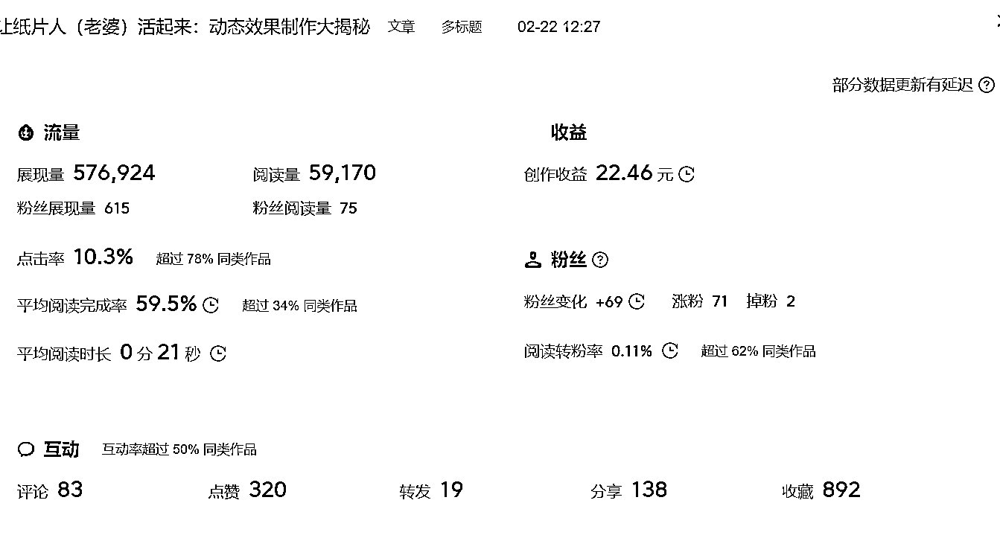<ne-text id="u91955b85">绘图工具</ne-text><ne-text id="ueadce484">现在</ne-text> <ne-text id="u57af9fb6">AI</ne-text> <ne-text id="u99389657">绘画的软件也很多</ne-text><ne-text id="u7778fc79">小红书用的比较多的： mewxai  （搜微信小程序）</ne-text><ne-text id="uba7a9274">抖音用的比较多的：</ne-text><ne-text id="u0ea88ccd">无界 Ai</ne-text><ne-text id="uc3073e5d">其他的类似于：小狸猫（微信小程序）幻火</ne-text> <ne-text id="ub922b47b">Ai</ne-text><ne-text id="u84fc00a1">（App）</ne-text><ne-text id="u74528910">不管用什么软件、每个程序里的绘画广场里都有很多用户自己生成的图片</ne-text><ne-text id="uf1b2ca91">我们一键同款就好</ne-text><ne-text id="ub5ad5794">操作流程 1：（绘制美女图）</ne-text><ne-text id="u9ad544dc">以</ne-text><ne-text id="uee65d24f">无界 Ai</ne-text> <ne-text id="ua183f96a">举例，进入广场后，随便翻一下，可以看到很多美女图</ne-text><ne-card data-card-name="image" data-card-type="inline" id="U3tcY" data-event-boundary="card">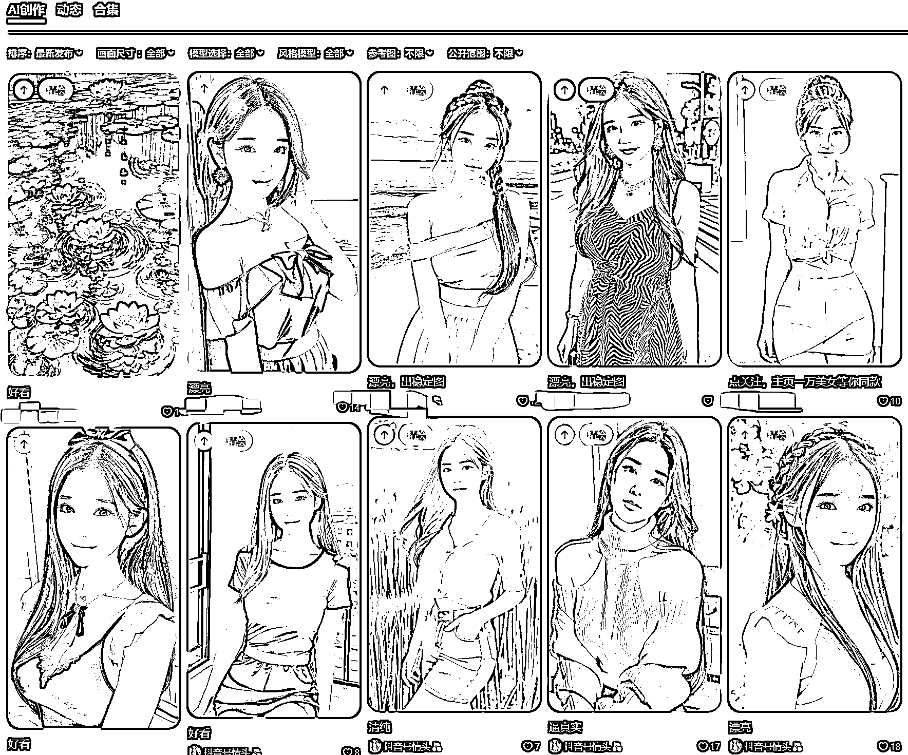<ne-text id="ub4f8be28">随便点一个美女进去，点击右下角一键同款，这样我们就可以得到和作者一样的美女图了</ne-text><ne-card data-card-name="image" data-card-type="inline" id="vbf73" data-event-boundary="card"><ne-card data-card-name="image" data-card-type="inline" id="uu8ye" data-event-boundary="card"><ne-text id="ub9931cd3">操作流程 2：（</ne-text><ne-text id="u364613f6">如何</ne-text><ne-text id="ufc6d4c3a">让纸片人老婆动起来</ne-text><ne-text id="u577c0195">？</ne-text><ne-text id="u165ddd3b">）</ne-text><ne-text id="u8e33f86b">打开腾讯智影小程序，点击数字人→人像照片播报→插入图片→输入文字→点击生成</ne-text><ne-card data-card-name="image" data-card-type="inline" id="adV9G" data-event-boundary="card">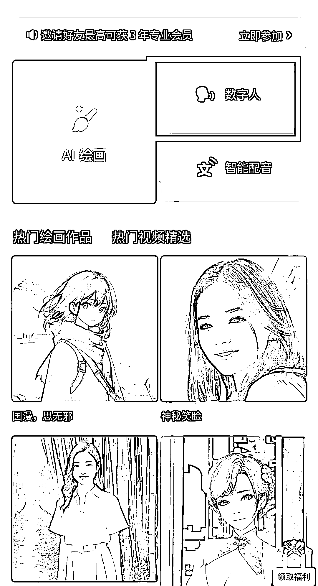<ne-card data-card-name="image" data-card-type="inline" id="jSsgx" data-event-boundary="card"><ne-card data-card-name="image" data-card-type="inline" id="QZHSa" data-event-boundary="card"><ne-text id="uc791c2da">文案怎么来？chatgpt 帮忙写</ne-text><ne-text id="u62db4a65">给美女一个人设</ne-text><ne-text id="u077296a6">chatgpt 咒语（1）：创建一个中国偶像人设，需要的参数有 姓名、身高、体重、星座、血型、出生地、爱好、和喜欢吃的美食</ne-text><ne-text id="u9de7e82a">chatgpt 咒语（2）：以王婵娟 自己的口吻介绍自己，口语化，用可爱俏皮的口气</ne-text><ne-card data-card-name="image" data-card-type="inline" id="wEBGe" data-event-boundary="card">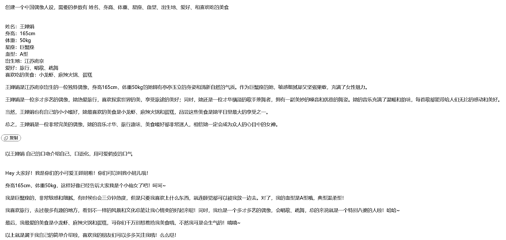<ne-text id="u91487cad">然后一个美女说话的动态视频就生成啦</ne-text><ne-card data-card-name="image" data-card-type="inline" id="FT9EH" data-event-boundary="card">图片加载失败<ne-text id="u555baee9">WeChat_20230531203704.mp4</ne-text><ne-text id="u397b2f16">操作流程 3：上传平台</ne-text><ne-text id="ua09affd5">类似的平台有今日头条的图文、百家号、知乎等，基本上只要发文就会有收益（记得打开投放广告）、知乎对应的活动是想法创作</ne-text><ne-text id="u9aa40613">平台的收益如何算？</ne-text><ne-text id="u7f9bda4e">基础千次阅读单价  0.1307</ne-text><ne-text id="u4d0f2541">×</ne-text><ne-text id="uc52e6050">作者系数  </ne-text><ne-text id="u96292cd4">（ 原创内容系数 ×优质作者系数 ×用户偏好系数 ×涨粉系数  ）</ne-text><ne-text id="u3d48c3bf">在今日平台网页版的收益数据可以看自己的作者系数和千次阅读的收益价格</ne-text><ne-card data-card-name="image" data-card-type="inline" id="ayJfy" data-event-boundary="card">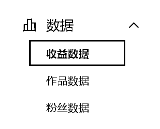<ne-text id="u273b3eb2">知乎想法收益，每天发一个想法可以提高账号等级、之后也可以申请好物带货、付费问答以及接商单。</ne-text><ne-card data-card-name="image" data-card-type="inline" id="jHodY" data-event-boundary="card"><ne-text id="u9a6d9735">新媒体图文、视频变现优缺点</ne-text><ne-text id="u608e78cd">优点：只要看的人多，收益没有上限。通过</ne-text> <ne-text id="u57068d70">Ai</ne-text> <ne-text id="u4b88e880">创作的成本也很低</ne-text><ne-text id="u6fa09518">缺点：同质化会严重、如果没有爆款收益非常低，可能只有几分钱。需要大家有好的网感和对平台用户的了解。</ne-text><ne-text id="u7bb7c740">这里只是给大家一个思路，各位圈友可以举一反三。根据这些工具发挥自己的创造力去创作优质的内容，从而变现。</ne-text><ne-text id="ue7ecb94e">二：取图变现  </ne-text><ne-text id="u612f9d3e">收益数据</ne-text><ne-card data-card-name="image" data-card-type="inline" id="rYwKW" data-event-boundary="card"><ne-text id="ub067c097">创作工具</ne-text><ne-text id="u018891ba">AI</ne-text> <ne-text id="u111aeb99">绘图工具：</ne-text><ne-text id="u18d09dc1">无界 Ai</ne-text><ne-text id="u1874438f">、mewxai、小狸猫、</ne-text><ne-text id="ud70346f6">剪映、醒图</ne-text><ne-text id="uc4d87f2e">操作流程</ne-text><ne-text id="uf22baed3">微信搜索疯狂取图→ 输入疯狂取图助手→进入平台→爆单教程→找到相关的变现教程</ne-text><ne-card data-card-name="image" data-card-type="inline" id="jR42S" data-event-boundary="card"><ne-card data-card-name="image" data-card-type="inline" id="NEoEf" data-event-boundary="card">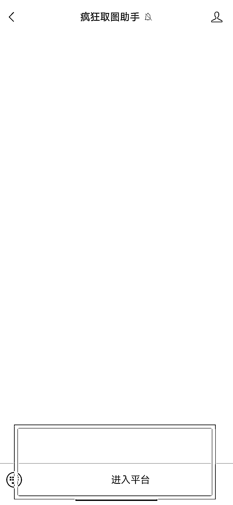<ne-card data-card-name="image" data-card-type="inline" id="WWlIu" data-event-boundary="card">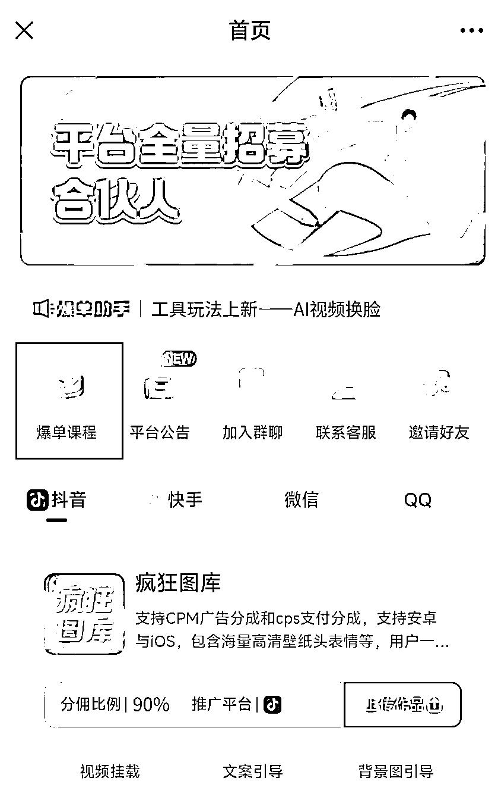<ne-card data-card-name="image" data-card-type="inline" id="Opu2G" data-event-boundary="card">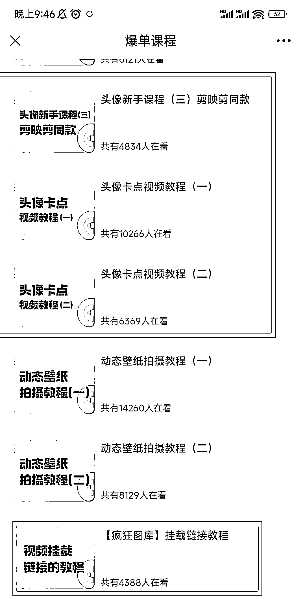<ne-text id="u3a3f4bfa">案例视频，更多的案例视频大家可以在抖音搜神图君或者疯狂取图看下别人怎么做的</ne-text><ne-card data-card-name="image" data-card-type="inline" id="M9ZGk" data-event-boundary="card">图片加载失败<ne-text id="u84c2fc1a">71e5bdcf2f64f380793c57ad63013faf.mp4</ne-text><ne-text id="ua89531ca">取图类变现优缺点</ne-text><ne-text id="uedd3528a">优点</ne-text><ne-text id="ufc9442d8">1：边际成本低。符合副业规则，即使是 600W+ 甚至是 1000W+的流量承接，也不会有多出来的人力 物力成本。</ne-text><ne-text id="ufd13d957">2：有复利：与拉新类注册一次性奖励不同。即使一年后别人看了你视频下载也是有收益的。</ne-text><ne-text id="u4170b080">还有不管你是上班路上，还是半夜凌晨 2 点在睡觉，只要有人看了视频下载就有收益。相当于多了一台 24 小时赚钱机器。</ne-text><ne-text id="u2a1f7084">3：创作难度低。</ne-text><ne-text id="uf0e93d6b">AI</ne-text> <ne-text id="u3f1b4606">绘图现在太发达了，创作图片也就是一个咒语的事情。</ne-text><ne-text id="u4a2f942e">4：变现平台多，抖音、快手、视频号、小红书都可以</ne-text><ne-text id="ub36e0397">5：设备要求低。一部手机即可以完成所有操作</ne-text><ne-text id="u97f6c99e">缺点</ne-text><ne-text id="u19edc33a">官方给的图有可能会侵权被举报，刚开始会没有流量、同质化严重，最好能自己设计图片</ne-text><ne-text id="u1ba23f1d">不是刚需，换头像这种事情做得人少，下载的人也少。</ne-text><ne-text id="u763c9a06">一般来说，小红书用户对下载头像的需求会高很多。建议大家可以在小红书引流下载</ne-text><ne-text id="u06fab71a">三 ：取图【团队】变现</ne-text><ne-text id="u9cc7eae8">操作流程</ne-text><ne-text id="ud72dfcbd">进入平台→点击我的→邀请好友。邀请后就自动入团了</ne-text><ne-text id="u3ee07e81">只要你的团员有收益，你也会分到收益</ne-text><ne-text id="u28d7d776">而且课程官方平台里都有</ne-text><ne-text id="ud921097f">内容自己也几乎不用做</ne-text><ne-card data-card-name="image" data-card-type="inline" id="tShRZ" data-event-boundary="card"><ne-card data-card-name="image" data-card-type="inline" id="oummM" data-event-boundary="card">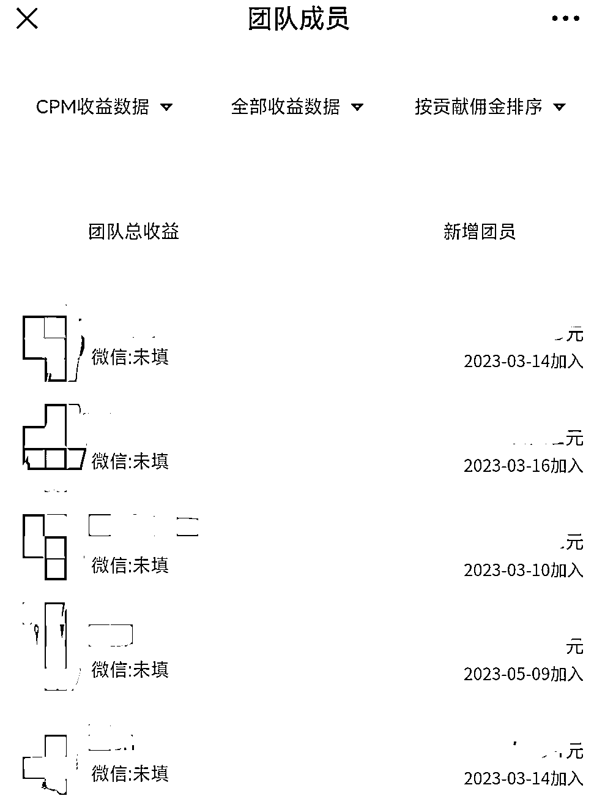<ne-text id="u351a004e">朋友圈的文案也可以写：Ai 头像、壁纸，抖音闭环站内渠道，全网分成最高，想副业赚点零花钱的过来联系。</ne-text><ne-text id="ub6308c94">取图团队优缺点</ne-text><ne-text id="ub11477fd">优点：这几乎是一个零门槛的项目,通过拉团员的网络系统,你可以轻松实现“躺赚”。</ne-text><ne-text id="ufcf15ed2">缺点：需要花时间管理徒弟，持续激励，并且提供相关教程素材以及去公域引流拉人进团队</ne-text><ne-text id="u5b6ea4ac">四：网盘拉新变现</ne-text><ne-text id="u837831bb">收益数据</ne-text><ne-text id="ub0c651d9">几十～～几千不等</ne-text><ne-text id="uc1d0c505">操作流程</ne-text><ne-text id="u6ab13ed9">星球已经有不少圈友分享了，大家去星球搜一下，有很多关于网盘拉信的玩法。</ne-text><ne-text id="u51e1d693">在小红书、知乎绘制 Ai 图并发布→将图片放入网盘→创建群聊→设置公告→私信后发网盘链接</ne-text><ne-text id="u28cfa7df">只要有用户注册或付费，就有收益</ne-text><ne-text id="u46e6bde2">当然小红书群聊也可以放取图类的抖音口令变现，不过要当心被小红书检测到站外引流。</ne-text><ne-card data-card-name="image" data-card-type="inline" id="NeGnX" data-event-boundary="card">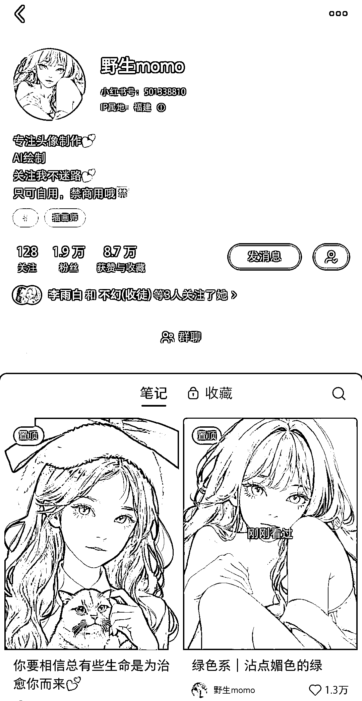<ne-card data-card-name="image" data-card-type="inline" id="aDmll" data-event-boundary="card">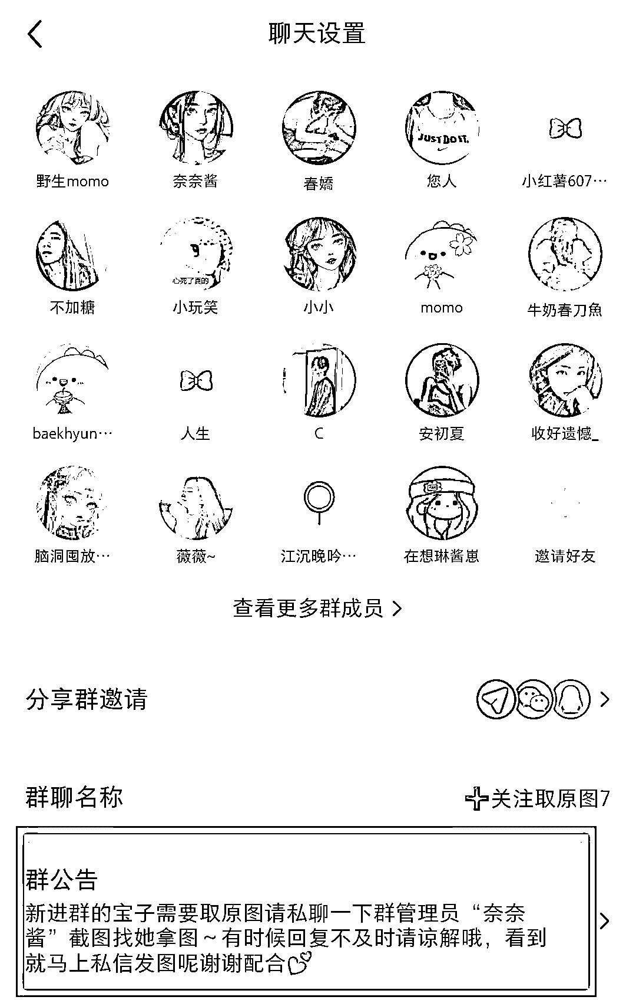<ne-card data-card-name="image" data-card-type="inline" id="ypvuV" data-event-boundary="card">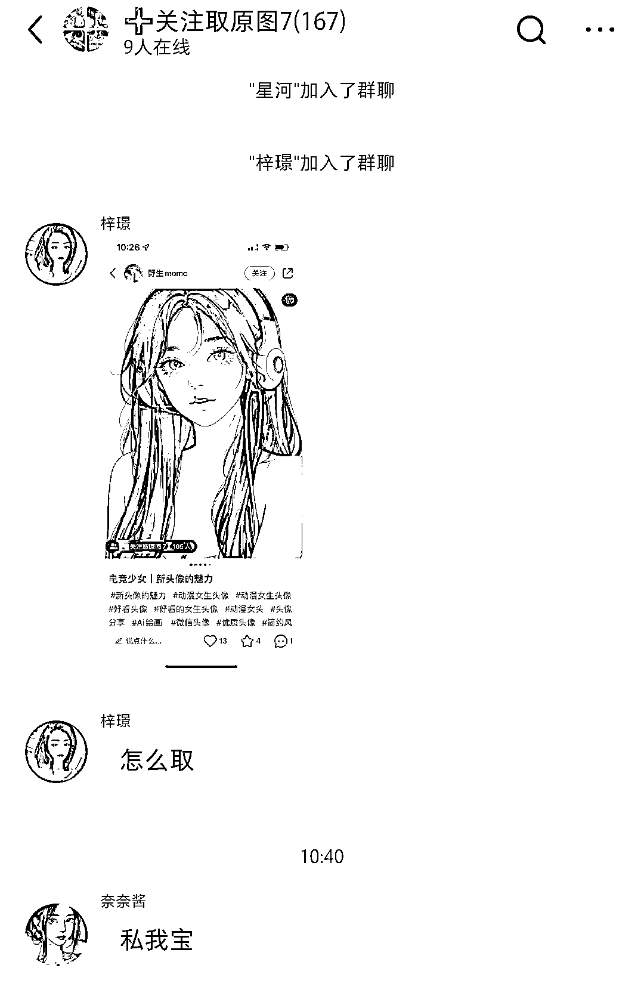<ne-text id="u49f42c27">网盘变现优缺点</ne-text><ne-text id="u62fd2c13">优点：快捷，简单，只要把内容或者资料传到网盘里就可以了</ne-text><ne-text id="u74dcbcd5">缺点：一次性收益 ， 没有复利，赚点小钱</ne-text><ne-text id="u325a66e1">五：销售作品</ne-text><ne-text id="u34d3d508">变现</ne-text><ne-text id="ucac1217c">如何创建店铺？看生财的官方手册即可：</ne-text><ne-text id="uccd63901">https://search01.shengcaiyoushu.com/docx/T8Zfd0iJjoSKEnxEWJXcZFCen2Y</ne-text><ne-text id="u54ccd450">你可以将一幅幅新锐且创意十足的 Ai 绘画作品添加进小红书店铺</ne-text><ne-text id="u15694238">这个时候小红书店铺不再是一个没有温度的小店</ne-text><ne-text id="ud50d9574">而是你个人的虚拟画廊</ne-text><ne-text id="ua98791a6">如果你是设计师、它不但能展现你的作品、还能多一份收益？</ne-text><ne-text id="uca3d28fe">何乐而不为呢？</ne-text><ne-card data-card-name="image" data-card-type="inline" id="iiWTE" data-event-boundary="card"><ne-text id="u1804fc6a">小红书案例</ne-text><ne-card data-card-name="image" data-card-type="inline" id="MrgOm" data-event-boundary="card"><ne-card data-card-name="image" data-card-type="inline" id="T8dpi" data-event-boundary="card">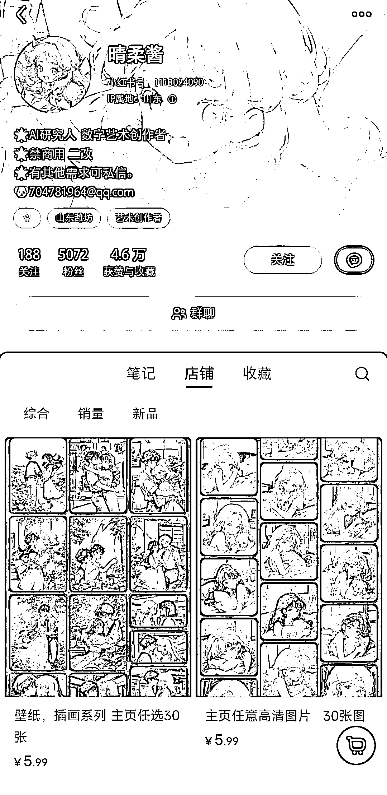<ne-text id="ueeea5180">六：定制变现</ne-text><ne-text id="u9c842939">收益数据</ne-text><ne-text id="u92c48d82">定价在 50  ～99，低于 50 就太亏了</ne-text><ne-text id="uc58219a7">毕竟同样的词、就算固定 seed 值，有时候也很难出同样的图</ne-text><ne-text id="u9aa94689">那这幅图就是世界上独一无二的画作！</ne-text><ne-text id="ucf1e2456">如果你把自己订制的图上传到区块链上做认证</ne-text><ne-text id="uffa2e68e">那就更显得这个作品的稀缺性了</ne-text><ne-text id="u09a28f5d">当然除非出图特别简单快速也可以订 9.9 这种</ne-text><ne-text id="ud81fc1f1">这样的价格就显得非常的亲民</ne-text><ne-text id="u0c3d1e17">小红书上还有前三张免费，用来引流</ne-text><ne-text id="u44fb24e0">然后再接 99 的订制</ne-text><ne-text id="u95cbcee6">宝宝头像、职业头像订制都非常受欢迎</ne-text><ne-text id="u3e3ec649">圈友们可以多多尝试</ne-text><ne-text id="u7094cd4b">每天接 2-3 单，</ne-text><ne-text id="u7134a57e">一天赚个几百是很轻松的。</ne-text><ne-card data-card-name="image" data-card-type="inline" id="PsSRZ" data-event-boundary="card"><ne-card data-card-name="image" data-card-type="inline" id="pf83E" data-event-boundary="card"><ne-card data-card-name="image" data-card-type="inline" id="utNdZ" data-event-boundary="card">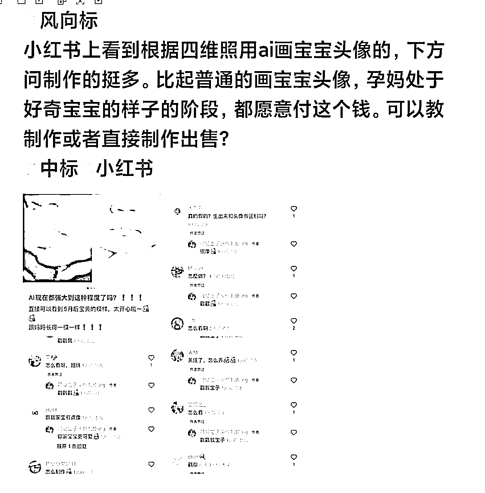<ne-text id="u34282d49">操作流程</ne-text><ne-text id="u62cc8534">把生财有术</ne-text> <ne-text id="ue5f98a92">Ai</ne-text> <ne-text id="u71497ae6">绘画的手册看完，基本就能接单了</ne-text><ne-text id="u3cf895ee">手册链接：</ne-text><ne-text id="u16c7ebb4">https://search01.shengcaiyoushu.com/docx/S38TdhmTsosK6Uxlo9tcYec9nxh</ne-text><ne-text id="u2dddde2b">当然有些定制比较考验设计能力，有很多需求 Ai 不能做，这个时候就需要 PS 等</ne-text><ne-text id="u4c9b939e">其他</ne-text><ne-text id="u8981e5ae">软件</ne-text><ne-text id="u6e48569f">同时也可以去一些接单群，把自己接到的单子转出去</ne-text><ne-text id="uf5a0488f">并且有些客户的奇葩要求会比较多，沟通会比较耗时间</ne-text><ne-text id="u680c1c67">在接定制前 最好 有个 SOP，让客户提供一些基础的信息，减少沟通成本</ne-text><ne-card data-card-name="image" data-card-type="inline" id="dcXhv" data-event-boundary="card"><ne-card data-card-name="image" data-card-type="inline" id="eipO8" data-event-boundary="card"><ne-text id="u7896a34f">七：小说+AI 绘画变现</ne-text><ne-text id="u33153a60">收益数据</ne-text><ne-card data-card-name="image" data-card-type="inline" id="OeSgm" data-event-boundary="card"><ne-text id="ucc7ff28d">操作流程</ne-text><ne-text id="u298ec3e8">下载创作猫 APP ，在首页学习频道有官方的教程</ne-text><ne-text id="u16dcefa8">。应该说是很详细了</ne-text><ne-text id="ud6b4b119">当然他</ne-text><ne-text id="u63fa89b2">平台内</ne-text><ne-text id="uc96229d3">的</ne-text><ne-text id="u17a38c1c">模版</ne-text><ne-text id="u53f9ed55">视频不是很好，如果自己用 Ai 画一下效果会好一些</ne-text><ne-card data-card-name="image" data-card-type="inline" id="LfWIE" data-event-boundary="card">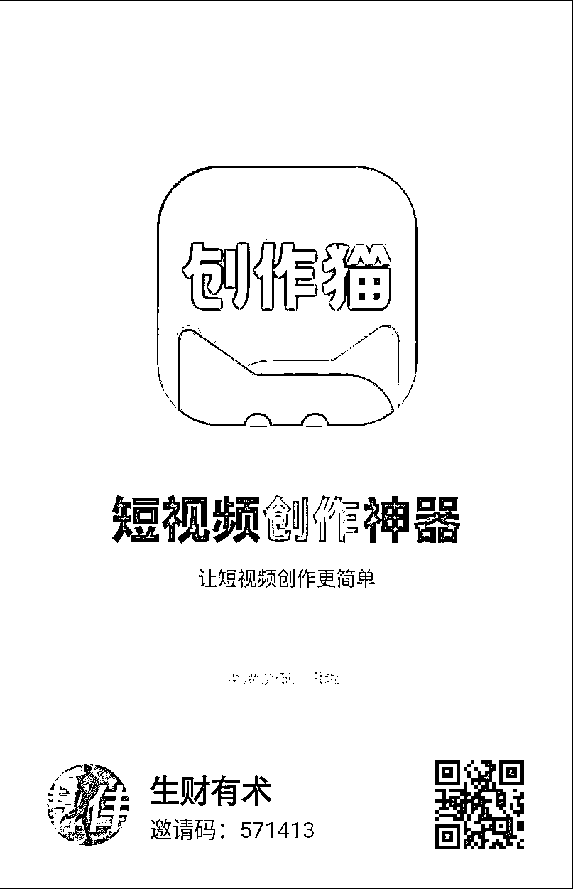<ne-card data-card-name="image" data-card-type="inline" id="cYato" data-event-boundary="card">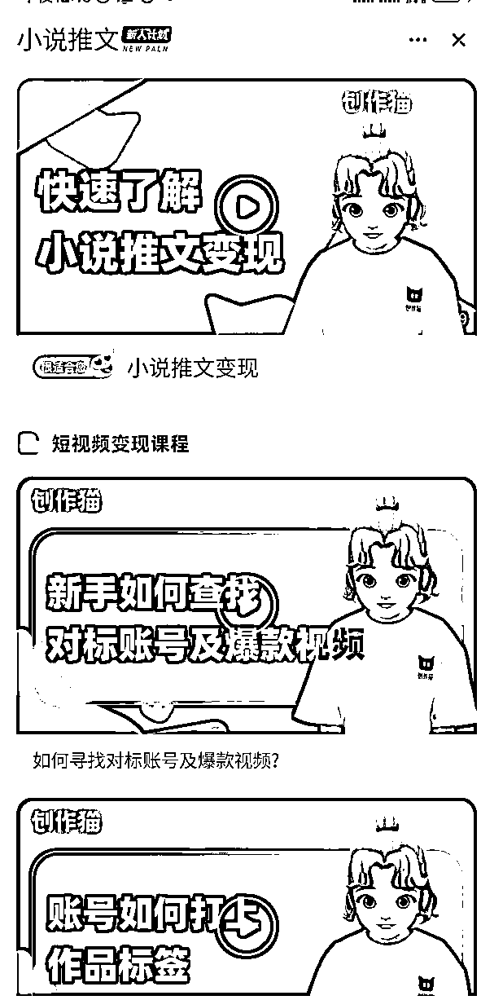<ne-text id="u543f1e32">比如 黄毛青年正死死拉住我的手</ne-text><ne-text id="uf03f8942">直接输入进 Ai 创作软件，然后选择想对应的模型就可以了</ne-text><ne-card data-card-name="image" data-card-type="inline" id="aT3Pc" data-event-boundary="card"><ne-text id="ubfbf714e">八：其他变现模式</ne-text><ne-text id="u02d77308">1：知识付费</ne-text><ne-text id="ud551084b">如果你有非常多的粉丝，并且还有设计或者绘画的功底，为什么不结合 Ai 绘画多赚一份专属的收入呢？</ne-text><ne-text id="u9f68a8a1">不要抗拒粉丝们的关注</ne-text><ne-text id="u20aa90bc">可能这些忠实的粉丝们，正在热切等待着你为他们制作独家的网络课程！</ne-text><ne-text id="u9c84c528">如果你的画非常有风格，研究提示词也很个性化</ne-text><ne-card data-card-name="image" data-card-type="inline" id="kEuHf" data-event-boundary="card"><ne-text id="uab6a1fff">想象一下，当你做出了令人惊叹的作品</ne-text><ne-text id="u42726afd">粉丝们会不会在评论区求着你出教程呢？</ne-text><ne-card data-card-name="image" data-card-type="inline" id="S4HDN" data-event-boundary="card">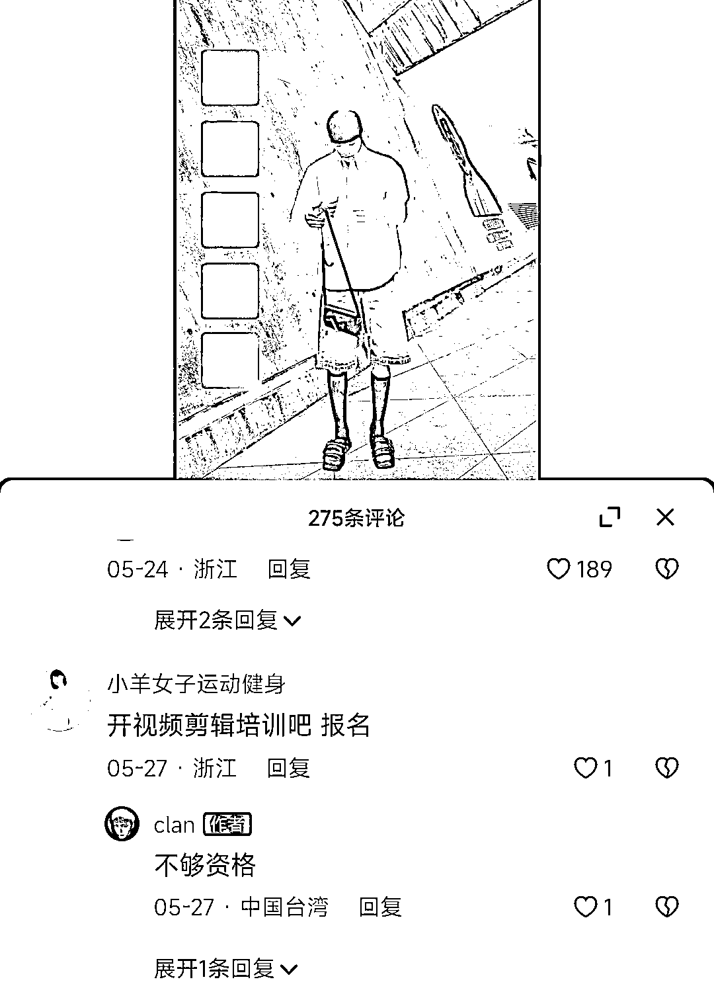<ne-text id="ue124eb06">小红书案例</ne-text><ne-card data-card-name="image" data-card-type="inline" id="Ggddz" data-event-boundary="card"><ne-card data-card-name="image" data-card-type="inline" id="BW18c" data-event-boundary="card"><ne-text id="u25478aeb">2 ：Ai 模特</ne-text><ne-text id="u71366709">需要电脑比较好，或者会 SD 云部署</ne-text><ne-text id="uec398954">这个需要炼丹，就是炼衣服的模型，然后套到模特身上</ne-text><ne-text id="u657430cb">以下为 AI 绘画 航海手册的内容</ne-text><ne-text id="u621e1fd0">https://search01.shengcaiyoushu.com/docx/S38TdhmTsosK6Uxlo9tcYec9nxh</ne-text><ne-text id="u6f2244bd">目前使用 AI 绘画技术，可以完全实现简单基础纯色款衣物的模特图，比如：</ne-text><ne-text id="u189be6bc">简单产品的不同场景图，比如形状规则的护肤品包装瓶等。</ne-text><ne-text id="u5498edd3">大面积纯色块的 T 恤、卫衣、外套、裙子；</ne-text><ne-text id="uf3437a3a">电商的产品拍摄图；</ne-text><ne-card data-card-name="image" data-card-type="inline" id="gp2Qw" data-event-boundary="card">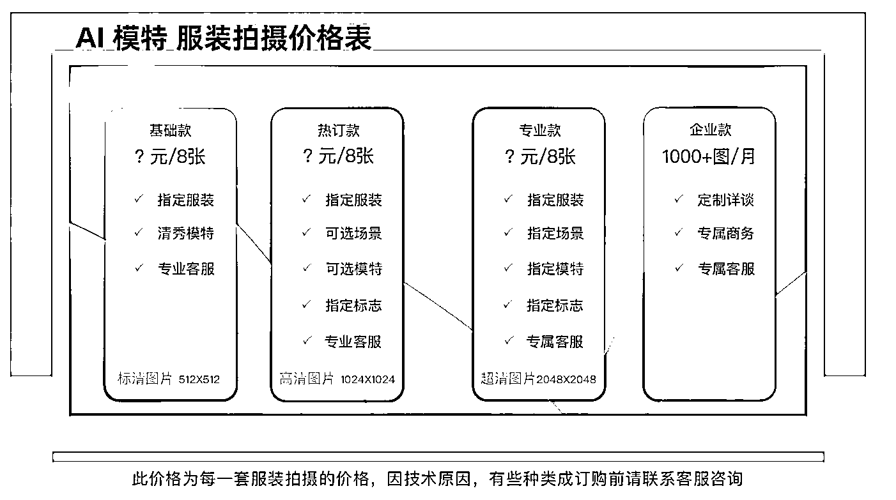<ne-text id="u3d420c9c">当然也有很多淘宝的服装类卖家会有这样的需求，如果你学会了，也可以出相关的知识付费产品</ne-text><ne-card data-card-name="image" data-card-type="inline" id="OnDrS" data-event-boundary="card"><ne-text id="ud8f2fa21">缺点</ne-text><ne-text id="u88c402d7">目前如果要 100% 比较困难，通常来说 可以做到 90%</ne-text><ne-text id="u5dc77d3e">，最后的还原度目前是 98%，但制作过程非常复杂。</ne-text><ne-text id="u0845a3d8">而且找人拍很便宜。。。但</ne-text> <ne-text id="ud544cf19">Ai</ne-text> <ne-text id="ub99a7c79">训练的成本很高</ne-text><ne-text id="ub2120d93">3：室内设计</ne-text><ne-card data-card-name="image" data-card-type="inline" id="vvS1k" data-event-boundary="card">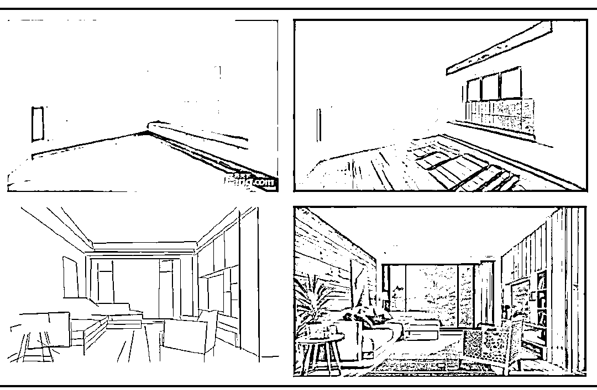<ne-text id="u31e6ca2c">这是一个比较成熟商业化的变现方式</ne-text><ne-text id="u023fe698">国内已经有老板跑通</ne-text><ne-text id="u7300a702">先通过 MJ 做效果图，后期再用 SD 以及 专业的软件接</ne-text> <ne-text id="uc44103dd">政府</ne-text><ne-text id="udf124bc1">工程</ne-text><ne-text id="u716413b4">教程可以看 Ai 绘画航海手册，或者 B 站搜一下相关的视频</ne-text><ne-text id="u274dfc12">这是一家国内知名设计工作室使用 Ai 绘图软件</ne-text><ne-card data-card-name="image" data-card-type="inline" id="b1mg7" data-event-boundary="card"><ne-text id="u7565aa2c">利用 mj  sd 出的汽车 4S 店 设计概念稿</ne-text><ne-card data-card-name="image" data-card-type="inline" id="K0psn" data-event-boundary="card"><ne-text id="u9c0b56ee">4：利用 Ai 绘画技能找工作</ne-text><ne-text id="ueb21a9e1">你是否对 Ai 绘画充满热情与想象力?是否一直想将自己的创意变成一份收入?</ne-text> <ne-text id="udaf82bd8">现在,机会来了!各行各业都在招募 Ai 绘画人才,你的梦想终于可以变成现实。</ne-text><ne-text id="ud3164e59">想象一下,你可以为文创企业设计概念图,为游戏公司制作人物形象,为广告公司撰写视觉剧本......各种各样的机会随处可见,只等待你来发掘!</ne-text><ne-text id="u82d452b7">如果你对 Ai 绘画怀有无限创意和热情,并不甘于将其只当一份业余爱好。那么,就来和生财一</ne-text><ne-text id="u624a7b55">起,利用你的天赋与技能,去寻找一份理想的工作。</ne-text><ne-card data-card-name="image" data-card-type="inline" id="KNlFP" data-event-boundary="card">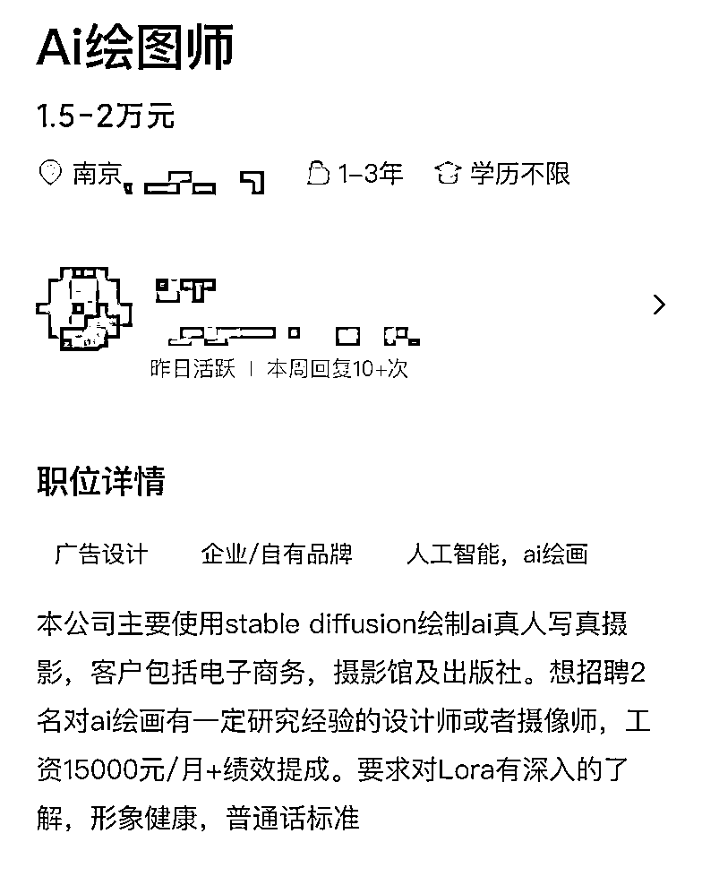<ne-card data-card-name="image" data-card-type="inline" id="IVALD" data-event-boundary="card"><ne-card data-card-name="image" data-card-type="inline" id="Jy19C" data-event-boundary="card">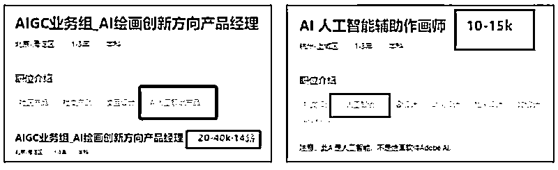<ne-text id="u30e1ae7a">九：结尾</ne-text><ne-text id="udfcadc96">在这个分享里,我们一起见证了</ne-text><ne-text id="ud30aed01">A</ne-text><ne-text id="u0fc89ef2">I</ne-text><ne-text id="ue561ba28">绘画在商业领域的无限可能。它正以惊人的速度融入各个行业,为企业带来全新的视觉体验与想象力。</ne-text><ne-text id="u4cfed022">A</ne-text><ne-text id="ucbea4692">I</ne-text><ne-text id="u9a6aa262">的出现意味着什么？意味着你能以最快的速度复制自己，复制其他创作者。</ne-text><ne-text id="u8023e8fd">AI</ne-text><ne-text id="u32b0ea17">不仅节省了内容生产时间，更节省了复制时间。</ne-text><ne-text id="ud2cd33b4">我是一个没有任何绘画基础的普通人</ne-text><ne-text id="u3f24abb2">，</ne-text><ne-text id="u5cbd1856">但利用这个新技术，我在这几个月的时间里也做出了一些爆款内容，并且通过以上的变现方法</ne-text><ne-text id="ua6765bb5">持续获得收益</ne-text><ne-text id="uc1187db8">。</ne-text><ne-card data-card-name="image" data-card-type="inline" id="UHdU1" data-event-boundary="card">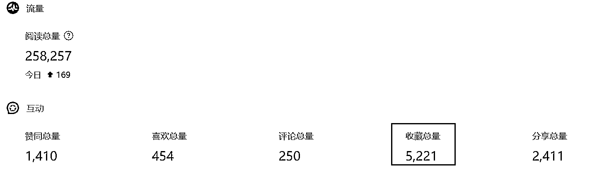<ne-text id="u6f9842d2">如果没有</ne-text><ne-text id="u1eb93cad">A</ne-text><ne-text id="ud4275efc">I</ne-text><ne-text id="u5be25a0e">绘画，我这个互联网小透明也不会接到甲方爸爸的投流</ne-text><ne-text id="u8e6e059c">如果没有 Ai 绘画，我也不会在才进生财一个月，便获得了精华帖（在 IDO 老徐这次拉新的生财新用户里，应该是第一个拿精华帖的）</ne-text><ne-text id="u47a9e441">如果像我这样没有任何美术、设计、绘画基础的普通人也能做到，我相信大家也可以利用 Ai 快速复制优秀创作者，进行变现。</ne-text>  <ne-hole id="u64d257e6" data-lake-id="u64d257e6"><ne-card data-card-name="hr" data-card-type="block" id="KSRwb" data-event-boundary="card"><ne-p id="u80174a46" data-lake-id="u80174a46"><ne-text id="u7cb890af">评论区：</ne-text></ne-p> <ne-p id="u8ab2062d" data-lake-id="u8ab2062d"><ne-text id="u9d754dc8">高尚坏孩（大学生） : [偷笑]太干了</ne-text> <ne-text id="ub7ce0ec1">亦仁 : 感谢分享，已加精华。</ne-text> <ne-text id="u39c1a8f8">蕃茄 : 谢谢亦仁老大[憨笑]</ne-text> <ne-text id="u59e634a2">半人马星空 : 写的层层递进，</ne-text> <ne-text id="u165cb471">FF_23531 : 请教大佬：现在打开智影，没有插入数字人功能了，只能用平台自带的形象了？</ne-text> <ne-text id="u43ca58b4">蕃茄 : 的确是这样子的，现在没有了</ne-text> <ne-text id="ue4ed39fc">美少女守护者 : 最近很多平台都看到很多好看的 AI 作品</ne-text> <ne-text id="u657e172a">FF_23531 : 多谢回复[抱拳][抱拳]</ne-text></ne-p></ne-card></ne-hole></ne-card></ne-card></ne-card></ne-card></ne-card></ne-card></ne-card></ne-card></ne-card></ne-card></ne-card></ne-card></ne-card></ne-card></ne-card></ne-card></ne-card></ne-card></ne-card></ne-card></ne-card></ne-card></ne-card></ne-card></ne-card></ne-card></ne-card></ne-card></ne-card></ne-card></ne-card></ne-card></ne-card></ne-card></ne-card></ne-card></ne-card></ne-card></ne-card></ne-card></ne-card></ne-card></ne-card></ne-card></ne-card></ne-card></ne-card></ne-card></ne-card></ne-p>