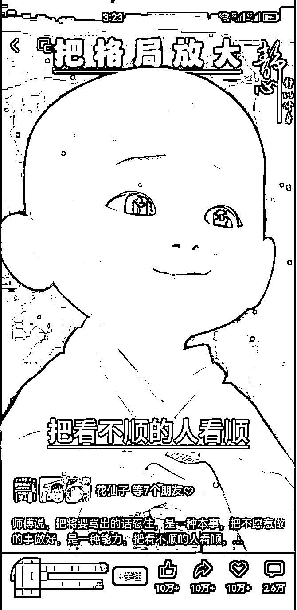
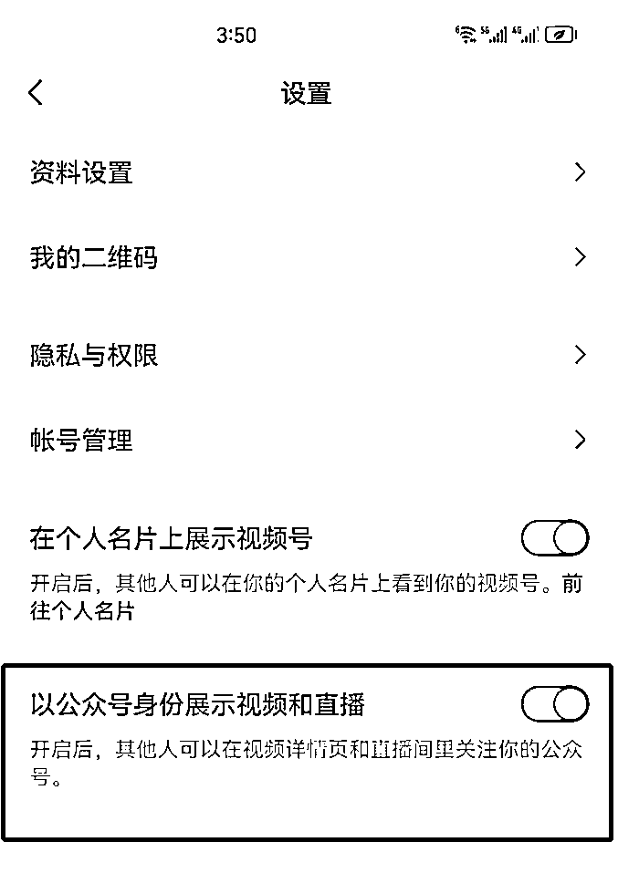
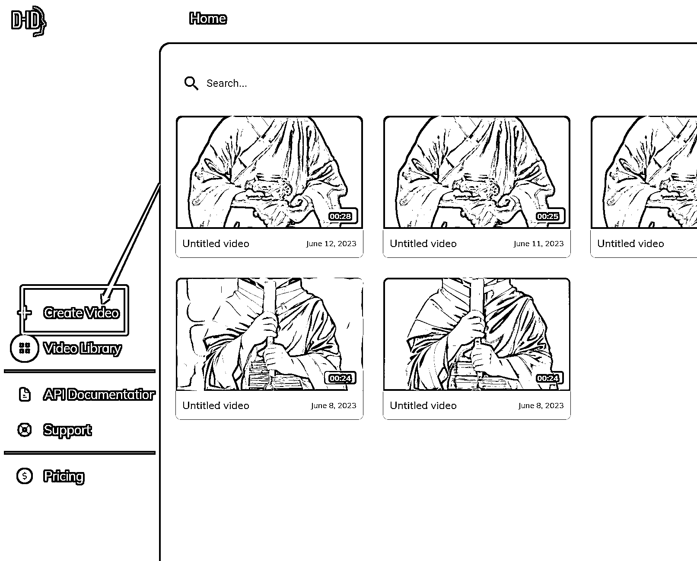
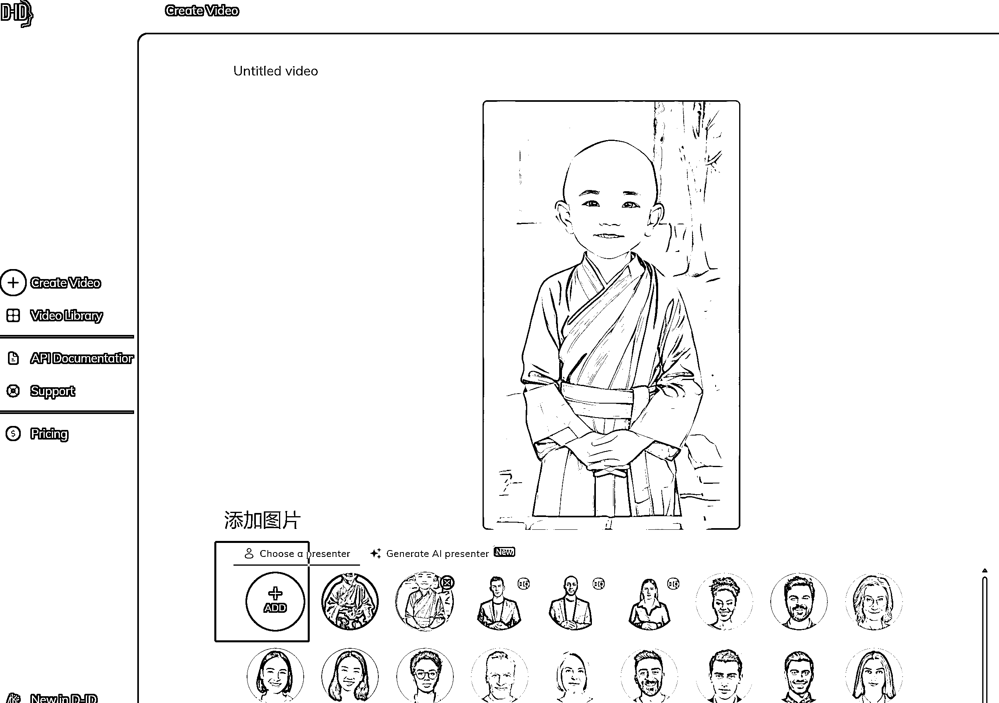
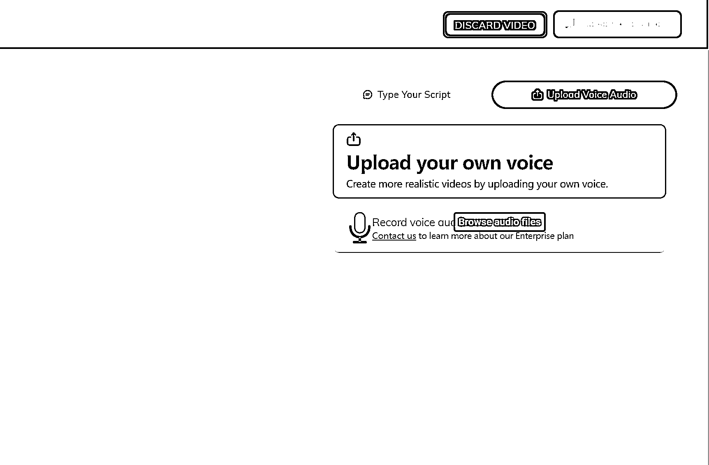
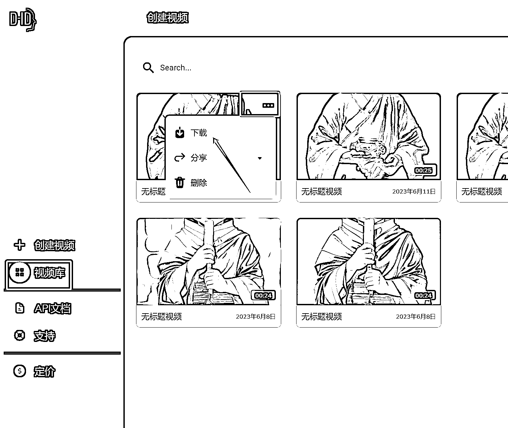
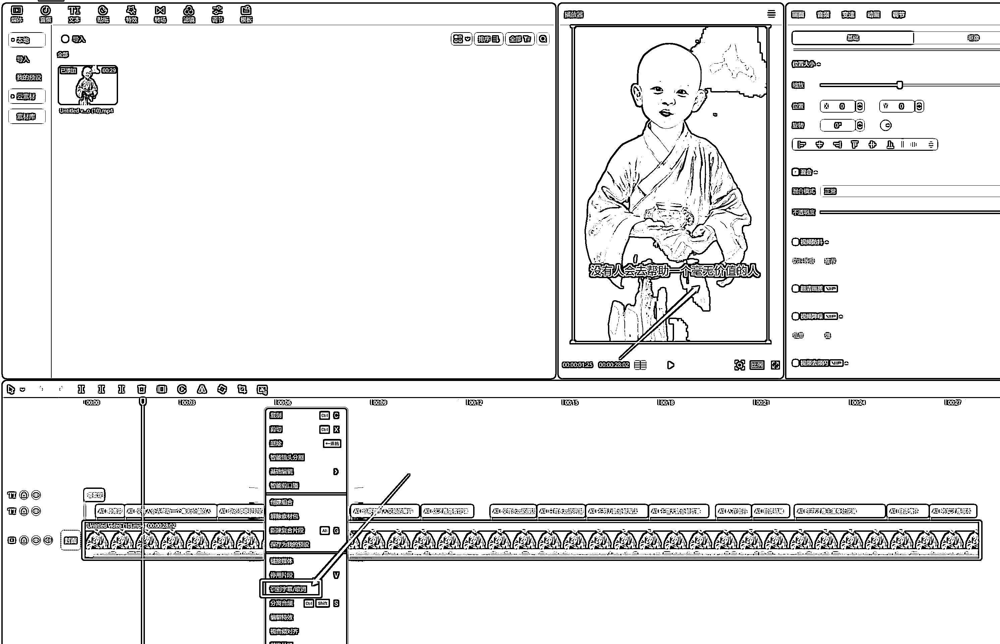

# 图片数字人视频制作全套教程

> 原文：[`www.yuque.com/for_lazy/thfiu8/gflct5k1shl3sc71`](https://www.yuque.com/for_lazy/thfiu8/gflct5k1shl3sc71)

<ne-h2 id="1346b4a2" data-lake-id="1346b4a2"><ne-heading-ext><ne-heading-anchor></ne-heading-anchor><ne-heading-fold></ne-heading-fold></ne-heading-ext><ne-heading-content><ne-text id="u19510fb8">(112 赞)图片数字人视频制作全套教程</ne-text></ne-heading-content></ne-h2> <ne-p id="ub7aa08f0" data-lake-id="ub7aa08f0"><ne-text id="u42e08c98">作者： 郭耀天</ne-text></ne-p> <ne-p id="u315a26e7" data-lake-id="u315a26e7"><ne-text id="uc1dd3500">日期：2023-06-26</ne-text></ne-p> <ne-p id="uf0df8302" data-lake-id="uf0df8302"><ne-text id="ua6b2b8cb">大家好，我是郭耀天，人称郭少</ne-text></ne-p> <ne-p id="ud74a7126" data-lake-id="ud74a7126"><ne-text id="u51b6aae7">四年圈友，很久没有更新内容，昨天看到圈友分享关于制作图片制作老人视频，最近也研究，把我操作得细节给大家分享出来，简单直接，最快三分之搞定一个视频。</ne-text></ne-p> <ne-p id="u1187b876" data-lake-id="u1187b876"><ne-text id="u0f492a82">最近一直研究时候，关注比较多的是视频号，抖音上出现比较多的小和尚，老人经典语录视频，开始以为这些视频是自己录制的，后面研究发现这些视频都是一张图片制作出来的。统称为图片数字人视频，目前借助软件可以快速这样的短视频，几分钟就能制作一个。很多人借助视频号，配合视频号展示功能，疯狂在倒流到公众号，开通视频号公众号展示功能账号，粉丝关注视频号默认关注公众号，认识一个兄弟做了 2000 万公众号粉丝。</ne-text></ne-p> <ne-p id="uf9fd82a5" data-lake-id="uf9fd82a5"><ne-card data-card-name="image" data-card-type="inline" id="JcRyT" data-event-boundary="card">  <ne-p id="u603f2529" data-lake-id="u603f2529"><ne-text id="ub3d150b9">目前视频号展示功口子被关闭了，可以去看看自己的视频号，有没有开通展现功能的，就算没有展现功能的，这样的账号起来，后期可以带货，可以做其他的变现，还是比较可以的，涨粉很牛逼的，打开视频号，点击视频右上角，看看你有没有开通展示功能，有的恭喜你，速度运营，别错过。</ne-text></ne-p> <ne-p id="uc1e6364e" data-lake-id="uc1e6364e"><ne-card data-card-name="image" data-card-type="inline" id="srE5P" data-event-boundary="card">  <ne-p id="uc56884c7" data-lake-id="uc56884c7"><ne-text id="udefbab35">开通这功能的，说明开通视频号展示功能，视频号火了，粉丝就关注视频号</ne-text></ne-p> <ne-p id="u4f76c4a7" data-lake-id="u4f76c4a7"><ne-text id="u956cf6d3">下面我把最近研究的关于制作图片数字人教程写出来，目前偏国学的，不仅可以制作这方面的教程，可以制作很多领域的，很多行业都可以制作，根据自己的情况选择，目的是借助图片快速制作视频，其实抖音火的时候，抖音上有类似的视频，只是以前的视频没有现在的质量高，现在抖音还有很多，目前在很多领域都有。</ne-text></ne-p> <ne-p id="u3ff879d4" data-lake-id="u3ff879d4"><ne-text id="uc542a39d">以前的玩法是网上找相关的图片，经过处理，最后制作成视频，现在操作是借助 Ai 绘画软件，绘制高清的视频，再经过软件制作出视频，关于绘画软件，有很多，目前行业天花板是</ne-text><ne-text id="u6c0a1203" style="color: rgb(18, 18, 18);">Midjourney，不会 mj 的也可以使用其他的绘画软件，比如搞定设计，无界 ai，都可以制作，能高清人像就可以。</ne-text></ne-p> <ne-p id="ua045a357" data-lake-id="ua045a357"><ne-text id="u34f94876">这里说说关于制作视频的软件，目前实名上有几款软件都可以制作，国内有闪剪可以制作，不过制作效果不怎么样，国外目前有两款软件，一款是</ne-text> [<ne-text id="u610a5f58" ne-underline="true">Home (</ne-text>](https://studio.d-id.com/)[<ne-text id="uebada4ae" ne-underline="true">d-id.com</ne-text>](http://d-id.com/)[<ne-text id="u5589d5f1" ne-underline="true">)</ne-text>](https://studio.d-id.com/) <ne-text id="uf39aa1b9">一款是 Heygen  不过 Heygen 成本太高，目前没有测试，目前用的都是 did 这款，制作出来的视频比较到位，有伙伴说 did 成本也高，下面会分享低价白嫖玩法。</ne-text></ne-p> <ne-p id="u208accea" data-lake-id="u208accea"><ne-text id="ufd08f906">这里说一个白嫖低价方法，可以通过无限注册账号，获得体验账号，一个体验账号能制作 10 个左右的视频，这里可以使用一个无限邮，目前算是比较好用的平台，注册一个主邮箱，在主邮箱后面添加任意数字又是新的邮箱，不过验证码还是主邮箱收，这样对于白嫖这样的系统就比较方便了，用完一个继续换一个注册就可以。</ne-text></ne-p> <ne-p id="ueca6d710" data-lake-id="ueca6d710"><ne-card data-card-name="image" data-card-type="inline" id="myMvQ" data-event-boundary="card">  <ne-p id="u6cb15caa" data-lake-id="u6cb15caa"><ne-text id="u8e226f21">使用系统时候，遇到打不开时候可以开魔法，毕竟是国外的，一般是可以打开的，多测试几次，</ne-text></ne-p> <ne-p id="u066fb801" data-lake-id="u066fb801"><ne-text id="u24ac6125">觉得贵，低价开通使用权限，淘宝找人购买会员，价格低，买得时候购买最低门槛的，38 元左右开通一个，开通时候会让你提供支付链接，他们会绑定一个支付卡，不建议绑定自己的卡，支付不需要密码，支付很快的。当别人给你开通一个最低权限，绑定的卡还在，这个时候，你再打开升级，点击付费，可以直接开通最高级权限，可以制作一百多个视频，够做很久了，可以多开几个账号放着，用这样的方式，懂的能节省几千元，就这个点。</ne-text></ne-p> <ne-p id="ueb3fec8d" data-lake-id="ueb3fec8d"><ne-card data-card-name="image" data-card-type="inline" id="eB9d3" data-event-boundary="card">  <ne-p id="u6f5414d6" data-lake-id="u6f5414d6"><ne-text id="u77ca3730">制作就比较简单，打开系统，登录账号，把你需要制作的图片上传，由于系统是英文的可以直接翻译网页，也可以下载一个火山翻译，这个插件很到位，很多无法翻译都可以直接翻译，点击创建视频，</ne-text></ne-p> <ne-p id="u791779aa" data-lake-id="u791779aa"><ne-card data-card-name="image" data-card-type="inline" id="C4ag3" data-event-boundary="card">  <ne-p id="u4dda218d" data-lake-id="u4dda218d"><ne-text id="u04769bc1">进入创建页面，上传你需要制作的图片数字人，就是前面绘画 Ai 制作的人，这里测试了，目前只能制作人的图片，其他的图无法制作，。</ne-text></ne-p> <ne-p id="u21dac4fd" data-lake-id="u21dac4fd"><ne-card data-card-name="image" data-card-type="inline" id="bOx50" data-event-boundary="card">  <ne-p id="u4281127d" data-lake-id="u4281127d"><ne-text id="udc489bf9">选择好你制作的图片，点击右上角，添加音频，可以使用系统配音，也可以使用自己的音，一般都是自己的，要么是搬运的，我目前操作的是去抖音，快手搬运比较火的音频，直接下载下来，这里说一个点，系统能直接识别视频的音频，不需要提取，所有直接传视频即可。</ne-text></ne-p> <ne-p id="uc3ed3db6" data-lake-id="uc3ed3db6"><ne-card data-card-name="image" data-card-type="inline" id="h7dYE" data-event-boundary="card">  <ne-p id="ucd1447dd" data-lake-id="ucd1447dd"><ne-text id="uaf2e9998">当上传好音频，视频也可以，直接点击右上角的生成视频，一分钟左右就能制作出一个视频出来</ne-text><ne-card data-card-name="image" data-card-type="inline" id="TQ698" data-event-boundary="card">  <ne-p id="uef26db35" data-lake-id="uef26db35"><ne-text id="ue754614d">制作出来的视频，点击下载，下载视频，发现有 logo，借助软件处理下，</ne-text></ne-p> <ne-p id="u58a5ea31" data-lake-id="u58a5ea31"><ne-card data-card-name="image" data-card-type="inline" id="MKmqj" data-event-boundary="card">  <ne-p id="u97046106" data-lake-id="u97046106"><ne-text id="u36e3cb3d">下载视频，导入剪影软件，找到识别字幕，字幕出来，调整下文字的展示格式，一个视频就搞定，全部操作下来十来分钟，熟悉操作了，一个视频三五分钟就能搞定。</ne-text></ne-p> <ne-p id="u75a405d5" data-lake-id="u75a405d5"><ne-card data-card-name="image" data-card-type="inline" id="uy8la" data-event-boundary="card">  <ne-p id="u9369ac3a" data-lake-id="u9369ac3a"><ne-text id="u745077d4">这样一张图片就能制作成为一个视频，对于一些做霸屏的，或者是引流的，都可以操作，特别是前面说的视频号倒流公众号的额，借助这样快速制作视频，这里制作视频不仅仅是小和尚这类，其实很多领域都可以制作，选择适合自己的领域操作，这玩法目前好像没有人公布玩法，后期应该有更多人进入操作。</ne-text></ne-p> <ne-p id="ufdc37bc2" data-lake-id="ufdc37bc2"><ne-text id="ud37b2653">看到这里，也告诉大家，看到很多视频未必是真人，可能就是一张图片合成的，图片还是 ai 制作的，也告诉大家掌握点 ai 技能很重要，可以做的事情还是很多的，特别是对于推广需要大量的视频的时候，这样快速制作，还可以制作视频去带货，比如一些书，自己录制音频，借助系统生成的视频实现带货。</ne-text></ne-p> <ne-p id="u1d0eb296" data-lake-id="u1d0eb296"><ne-text id="u2fcb1c9b">对于操作中不清楚的，可以留言</ne-text></ne-p> <ne-hole id="u1c212948" data-lake-id="u1c212948"><ne-card data-card-name="hr" data-card-type="block" id="EwmXX" data-event-boundary="card"><ne-p id="u23e4c90b" data-lake-id="u23e4c90b"><ne-text id="ud0ad27ab">评论区：</ne-text></ne-p> <ne-p id="u690b3067" data-lake-id="u690b3067"><ne-text id="uf0b31ead">书豪 : 郭少很棒</ne-text> <ne-text id="u7262f9d1">陈仔 : 升级这里无法升级到最高费用哦</ne-text> <ne-text id="ua708fe93">郭耀天 : 感谢</ne-text> <ne-text id="u7261da80">郭耀天 : 先去淘宝开通最低的，他开通你马上升级</ne-text> <ne-text id="u695fb7a0">豆豆 : 这样的话，是不是就相当于花了店家卡里面的钱？还是说是系统漏洞呀</ne-text> <ne-text id="ua3000995">郭耀天 : 懂就懂了</ne-text> <ne-text id="ufa6d037f">豆豆 : 懂了哈哈哈</ne-text> <ne-text id="ub0388e00">景清 : 微软邮箱注册时候选美区，注册 Heygen 是会获得两分钟，用完后，通过邀请链接注册新号，原号可以得一分钟，有时候得两分钟（我也没搞懂），相当于三分钟，每月有上线，就是比较琐碎麻烦</ne-text></ne-p></ne-card></ne-hole></ne-card></ne-p></ne-card></ne-p></ne-card></ne-p></ne-card></ne-p></ne-card></ne-p></ne-card></ne-p></ne-card></ne-p></ne-card></ne-p></ne-card></ne-p></ne-card></ne-p>