# PS2023beta 版的 Ai 创成式填充应用实例分享

> 原文：[`www.yuque.com/for_lazy/thfiu8/wxvzca3dv95kb59k`](https://www.yuque.com/for_lazy/thfiu8/wxvzca3dv95kb59k)

<ne-h2 id="5fd080b2" data-lake-id="5fd080b2"><ne-heading-ext><ne-heading-anchor></ne-heading-anchor><ne-heading-fold></ne-heading-fold></ne-heading-ext><ne-heading-content><ne-text id="u8c92de64">(43 赞)PS2023beta 版的 Ai 创成式填充应用实例分享</ne-text></ne-heading-content></ne-h2> <ne-p id="uc973eb8d" data-lake-id="uc973eb8d"><ne-text id="u1f165cda">作者： 李谢谢</ne-text></ne-p> <ne-p id="ub576dfa9" data-lake-id="ub576dfa9"><ne-text id="uee97d581">日期：2023-06-26</ne-text></ne-p> <ne-p id="u4a8cf676" data-lake-id="u4a8cf676"><ne-text id="ubd82dbda">大家好，我是李谢谢，今天来和大家分享最近收获非常多的 PS+Ai</ne-text></ne-p> <ne-p id="uc46921f9" data-lake-id="uc46921f9"><ne-text id="u53a1e382">PS+Ai 的这个组合真的超乎我的想象，可能有很多人对 PS 的印象都是专业难懂的工具，各种细节化的参数等等，但是今天要分享的东西小白也可以放心观看不用担心看不懂，相信看过以后一定会对自己现在的工作有很大的帮助</ne-text></ne-p> <ne-p id="uaccb5519" data-lake-id="uaccb5519"><ne-text id="ua3dc5557" ne-bold="true">一，什么是 PSbeta 版的 Ai 创成式填充？</ne-text></ne-p> <ne-p id="ub017b661" data-lake-id="ub017b661"><ne-text id="u8a86fcf6">（1）简要介绍 PSbeta 版及其 AI 功能</ne-text></ne-p> <ne-p id="uf0af1f21" data-lake-id="uf0af1f21"><ne-text id="ue2a33edc">PSbeta 版是 Adobe 公司开发的图像编辑和设计软件，旨在提供创意工具和功能，PSbeta 版的 AI 功能整合了人工智能技术，为用户提供更强大的创意填充和设计支持。（来源 chatGPT）</ne-text></ne-p> <ne-p id="u6e867f9d" data-lake-id="u6e867f9d"><ne-text id="ufb6af1a5">（2）什么是创成式填充？</ne-text></ne-p> <ne-p id="u879f4fc6" data-lake-id="u879f4fc6"><ne-text id="u9c6fb8a5">创成式填充应用是指利用人工智能技术，自动生成和填充创意元素、设计要素或艺术灵感的工具。</ne-text></ne-p> <ne-p id="u9f03036f" data-lake-id="u9f03036f"><ne-text id="u96ad3a8c">它能够通过分析大量的图像、数据和模式，为用户提供创意灵感、图案生成和设计建议，AI 技术能够处理复杂的图像识别、模式生成和语义理解，从而提供更多元化和创新的创成式填充，在电商领域，创成式填充应用可以帮助电商平台生成吸引人的产品展示图、广告宣传素材和界面设计，在日常工作中，创成式填充应用可以为设计师、营销人员和创作者提供灵感和快速设计支持，节省时间和精力。（来源 chatGPT）</ne-text></ne-p> <ne-p id="u8190010c" data-lake-id="u8190010c"><ne-text id="u4aa65a48">（3）创成式填充的操作路径</ne-text></ne-p> <ne-p id="u13c16fe1" data-lake-id="u13c16fe1"><ne-text id="ue8654835">打开 PS，进入图像编辑页面，用选取框选取需要生成位置，可以输入或者不输入提示词，进行创成式填充</ne-text></ne-p> <ne-p id="uff66c684" data-lake-id="uff66c684"><ne-text id="ub185a2d3">Adobe 官方的宣传视频：https://www.adobe.com/products/photoshop/generative-fill.html#watch-video</ne-text></ne-p> <ne-p id="u6594414f" data-lake-id="u6594414f"><ne-text id="u08e3aa44" ne-bold="true">二 , 实例应用分享</ne-text></ne-p> <ne-p id="u621bb709" data-lake-id="u621bb709"><ne-text id="uba525709">（1）：创成式填充+电商应用</ne-text></ne-p> <ne-p id="u6d1164c1" data-lake-id="u6d1164c1"><ne-card data-card-name="image" data-card-type="inline" id="CKYjS" data-event-boundary="card">  <ne-p id="u11d6b8c2" data-lake-id="u11d6b8c2"><ne-text id="u4c235b25">在开始这个案例之前，大家先看一下，左右两张图那个是原创？</ne-text></ne-p> <ne-p id="u5bbf02ef" data-lake-id="u5bbf02ef"><ne-text id="u1ca6cadf">是不是很明显左边的这张图截取了右边这张图的中间位置，然后添加了字体，成为了电商主图？</ne-text></ne-p> <ne-p id="u6537aa73" data-lake-id="u6537aa73"><ne-text id="ub66fdd28">直接揭晓答案是：</ne-text><ne-text id="u11b3d7ce" ne-bold="true" ne-italic="true" ne-underline="true">不是</ne-text><ne-text id="u6bf55a4f">，左边这张才是原创，是我在淘宝找的一个卖杯子的图片</ne-text></ne-p> <ne-p id="u2c463ae5" data-lake-id="u2c463ae5"><ne-text id="ue9e48c62">这个功能最吸引的我一点就是可以进行很写实的二创，甚至在某种程度你可以成为原创，在做电商的玩家，无论什么淘宝的主图，别人拍的产品图，你随时都可以通过 PS 的创意填充达到原创的效果，别说平台的机器审核，今天就是人工在面前审核，也很难说清谁是原创</ne-text></ne-p> <ne-p id="ubc558cf2" data-lake-id="ubc558cf2"><ne-text id="ue4f622e8">抖音上面有很多图文你刷到的时候已经爆了，即使你换个方式，还用这个品可能也不会爆，你想用他这个图再发一次，你就觉得这个图一定会爆，但是会面临平台审核，这个时候你就可以采用这个办法</ne-text></ne-p> <ne-p id="u06762b13" data-lake-id="u06762b13"><ne-card data-card-name="image" data-card-type="inline" id="gmYcF" data-event-boundary="card">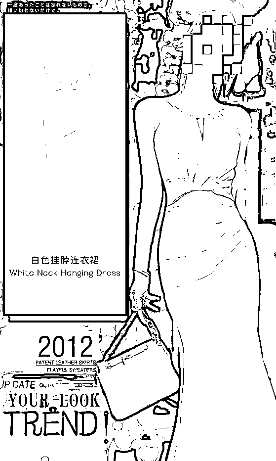<ne-card data-card-name="image" data-card-type="inline" id="jF415" data-event-boundary="card">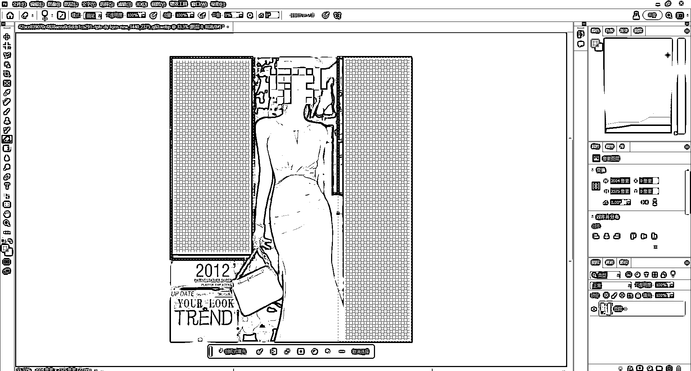  <ne-p id="u29cb041d" data-lake-id="u29cb041d"><ne-card data-card-name="image" data-card-type="inline" id="CyZoZ" data-event-boundary="card">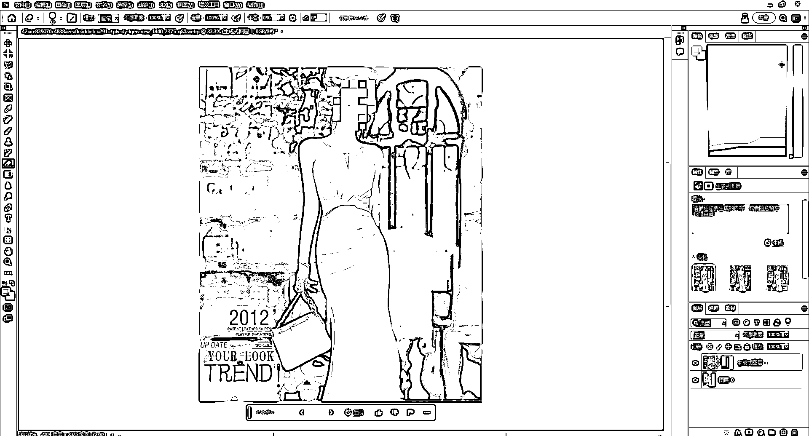  <ne-p id="uf04985e3" data-lake-id="uf04985e3"><ne-text id="u2ee05af8">只要你的电脑配置 OK，一个小白他可以轻松上手并且帮助你批量做任何产品图，如果你觉得还是不太好，你给他重新换个头或者换个背景问题也是不大的</ne-text></ne-p> <ne-p id="uc21a7c8c" data-lake-id="uc21a7c8c"><ne-text id="u90cf1606">比如这是坤哥抖音男装的一个没头像的透明图</ne-text></ne-p> <ne-p id="u62fafca5" data-lake-id="u62fafca5"><ne-card data-card-name="image" data-card-type="inline" id="HrNxM" data-event-boundary="card">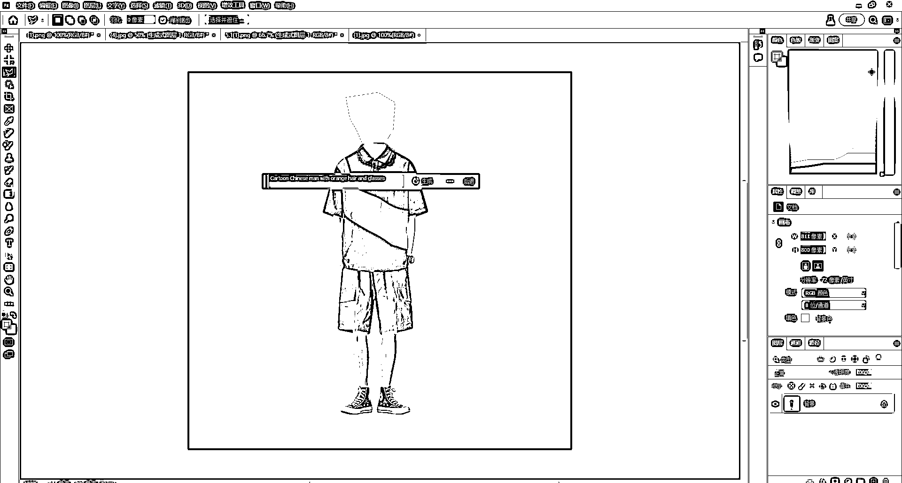  <ne-p id="uf8968bf3" data-lake-id="uf8968bf3"><ne-card data-card-name="image" data-card-type="inline" id="DeRhZ" data-event-boundary="card">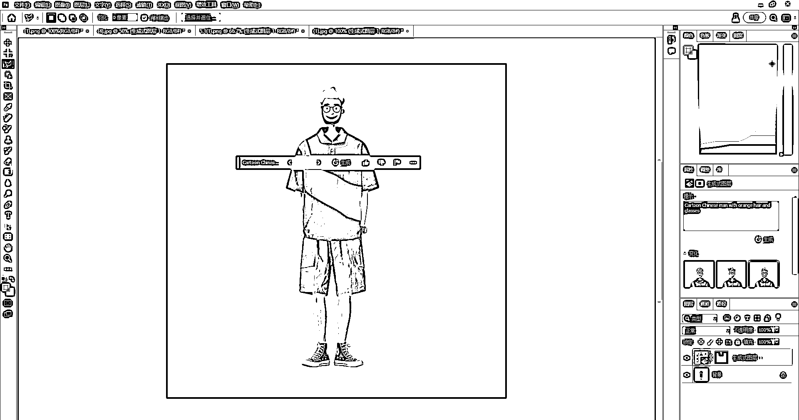  <ne-p id="u3bcdb839" data-lake-id="u3bcdb839"><ne-card data-card-name="image" data-card-type="inline" id="cGldZ" data-event-boundary="card">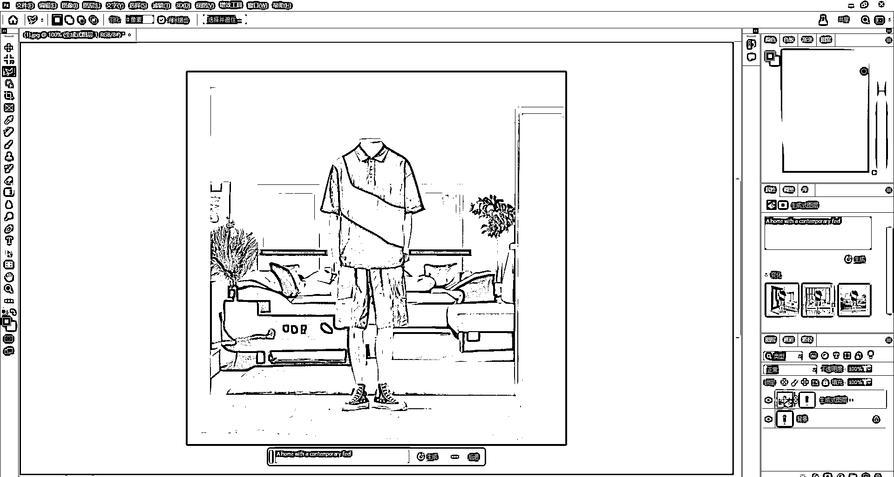  <ne-p id="ubb970e28" data-lake-id="ubb970e28"><ne-text id="u0aa3a311">当然你的生成效果也是和提示词有很密切的关系，这个在玩 chatGPT 和 Mj 的人相信都不陌生，肯定是从鼻子到眼镜描述的越详细，生成最后的效果你是越满意的，但是我觉得人像的凭空生成还是有很大的缺陷以及细节上面的瑕疵，这点的话大家都可以多多尝试</ne-text></ne-p> <ne-p id="u90adc54f" data-lake-id="u90adc54f"><ne-text id="ud7c3bfd7">还有就是尽量不要透明图操作，有个背景比较好</ne-text></ne-p> <ne-p id="ubf4ca8ac" data-lake-id="ubf4ca8ac"><ne-text id="u1cb28b81">（2）：创成式填充+Midjourney</ne-text></ne-p> <ne-p id="ueb012830" data-lake-id="ueb012830"><ne-card data-card-name="image" data-card-type="inline" id="wosB7" data-event-boundary="card">  <ne-p id="uf4ce5e26" data-lake-id="uf4ce5e26"><ne-card data-card-name="image" data-card-type="inline" id="NBTYW" data-event-boundary="card">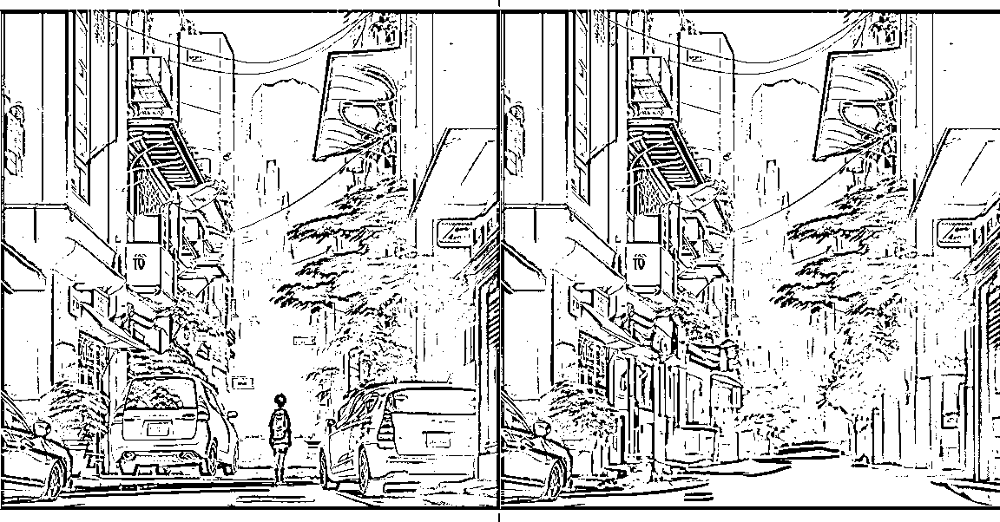  <ne-p id="u5c2bee9f" data-lake-id="u5c2bee9f"><ne-text id="uc4798a2e">有很多人在玩 MJ 的时候其实面临很多细节上面的修改，比如手的不完美，或者这个图片我觉得还可以，但是某一个地方不好，我需要做修改，在修改提示词等出图就比较麻烦，那这个时候就可以用 PS 的创意填充进行修改，比如上图手的位置有问题就可以进行细节上面的调整，或者有些地方不想要都是可以进行修改的</ne-text></ne-p> <ne-p id="ub6c2db68" data-lake-id="ub6c2db68"><ne-text id="ua7446af0">（3）：创成式填充+固定机位视频比例修改</ne-text></ne-p> <ne-p id="u4b72a282" data-lake-id="u4b72a282"><ne-card data-card-name="image" data-card-type="inline" id="C0MWx" data-event-boundary="card">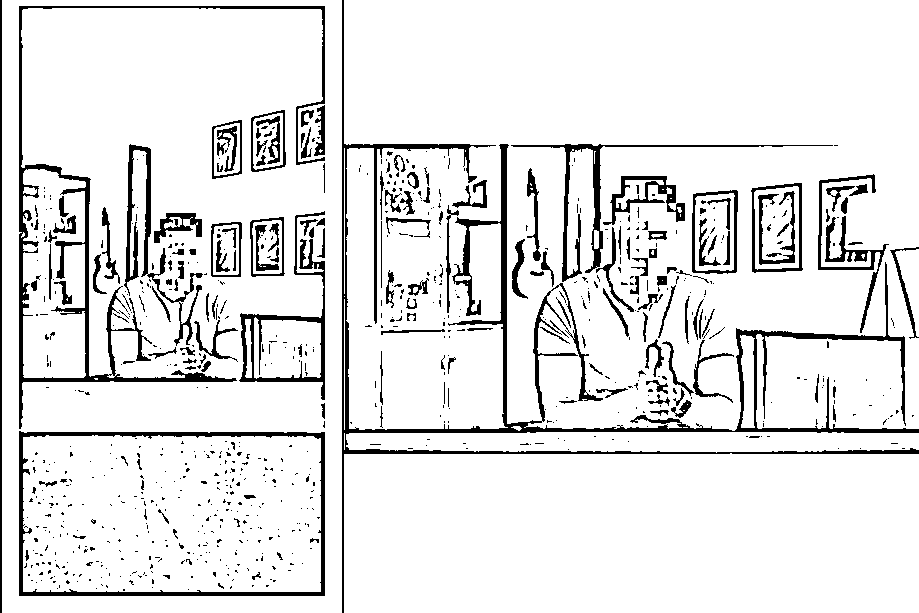  <ne-p id="u7de7b0a6" data-lake-id="u7de7b0a6"><ne-text id="u1c084d9e">就是有很多人可能感觉拍的比如说 9：16 或者 16：9 比例不是很满意，那这个时候你可能在重新拍太费时间了，我们可以通过 AI 创意填充去生成周围的这个图片从而达到这个效果，但是这里大家需要注意一下，图片四周都是静止的才可以生成哦，如果四周有动像的话会导致错位，这个局限性是比较高的</ne-text></ne-p> <ne-p id="u20de747e" data-lake-id="u20de747e"><ne-text id="u954c5e4e">比如这种视频我想给它改成横屏就可以两边生成图像，生成了以后导入到剪映或者 PR 做个背景就好了</ne-text></ne-p> <ne-p id="ua299ff62" data-lake-id="ua299ff62"><ne-card data-card-name="image" data-card-type="inline" id="FSeVm" data-event-boundary="card">  <ne-p id="u74c7921d" data-lake-id="u74c7921d"><ne-card data-card-name="image" data-card-type="inline" id="GRF9a" data-event-boundary="card">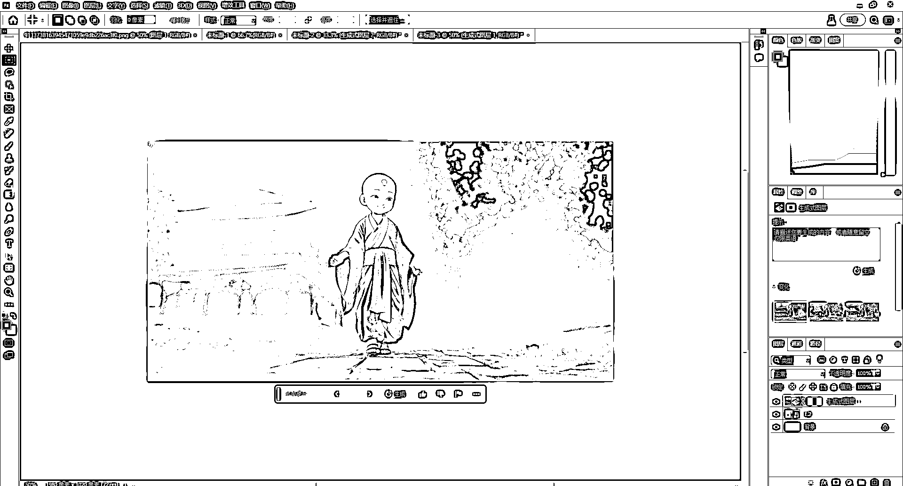  <ne-p id="u375340e0" data-lake-id="u375340e0"><ne-text id="u961f668f" ne-bold="true">三 , PS2023beta 下载安装注册</ne-text></ne-p> <ne-p id="u1223555c" data-lake-id="u1223555c"><ne-text id="ud93db87e">（1）安装：Adobe Creative Cloud</ne-text></ne-p> <ne-p id="u873cccae" data-lake-id="u873cccae"><ne-text id="ucf7ef1a2">官方网站：</ne-text>[<ne-text id="u2a280f05">https://www.adobe.com/cn/lead/creativecloud/business.html</ne-text>](https://www.adobe.com/cn/lead/creativecloud/business.html)</ne-p> <ne-p id="u4b1bd95f" data-lake-id="u4b1bd95f"><ne-text id="u42584964">点进网址以后，选择立即试用，就会自动下载了</ne-text></ne-p> <ne-p id="u849f63cc" data-lake-id="u849f63cc"><ne-text id="uad4f80a8">（2）注册账户</ne-text></ne-p> <ne-p id="u67338978" data-lake-id="u67338978"><ne-card data-card-name="image" data-card-type="inline" id="laeWJ" data-event-boundary="card">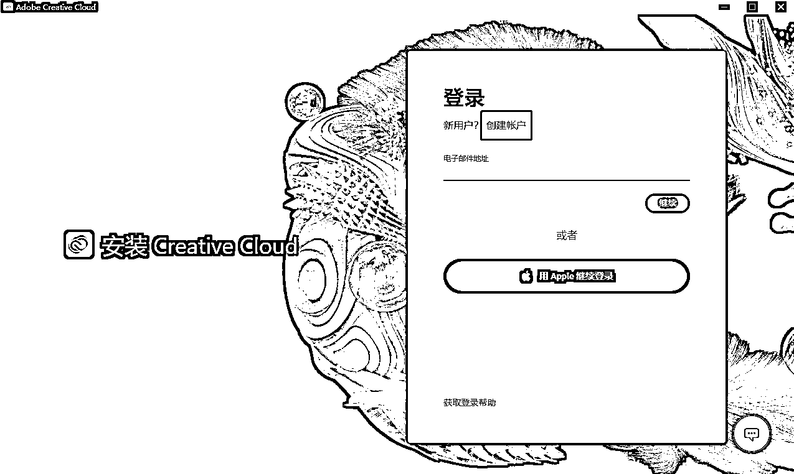  <ne-p id="uc2b990ff" data-lake-id="uc2b990ff"><ne-card data-card-name="image" data-card-type="inline" id="jxc6Y" data-event-boundary="card">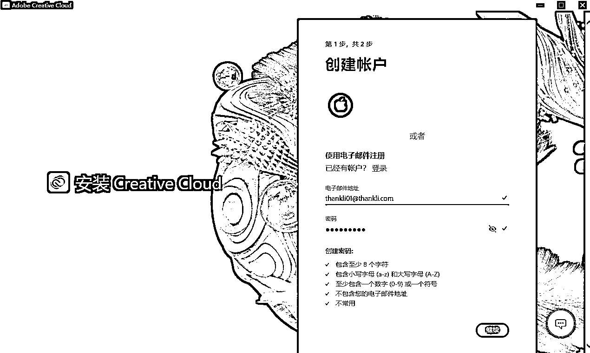  <ne-p id="u3fb476f2" data-lake-id="u3fb476f2"><ne-text id="u20dad55a">这里我用的是域名邮箱</ne-text></ne-p> <ne-p id="u1c8f1fc3" data-lake-id="u1c8f1fc3"><ne-card data-card-name="image" data-card-type="inline" id="wflfR" data-event-boundary="card">  <ne-p id="u1102da27" data-lake-id="u1102da27"><ne-text id="u689b8c62">这个地方一定要注意一下地区是必须要选择</ne-text> <ne-text id="uc7e41acd" ne-bold="true" ne-italic="true" ne-underline="true">美国</ne-text> <ne-text id="ufe6f0b4d">的，否则的后面是没有测试这个版本的</ne-text></ne-p> <ne-p id="ud5e70e28" data-lake-id="ud5e70e28"><ne-card data-card-name="image" data-card-type="inline" id="weP10" data-event-boundary="card">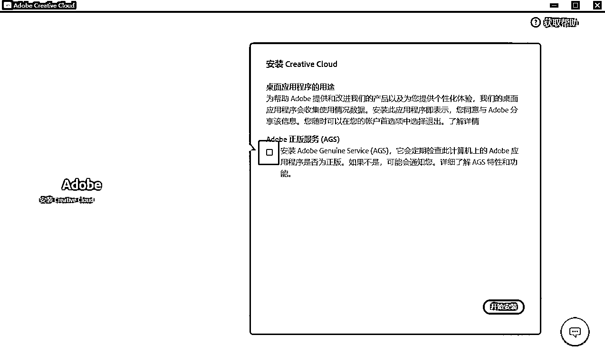  <ne-p id="u7f0b066f" data-lake-id="u7f0b066f"><ne-text id="u43851ea8">这里的要选择取消</ne-text></ne-p> <ne-p id="uc7800676" data-lake-id="uc7800676"><ne-card data-card-name="image" data-card-type="inline" id="MrhLf" data-event-boundary="card">  <ne-p id="u58b2e45b" data-lake-id="u58b2e45b"><ne-card data-card-name="image" data-card-type="inline" id="Pbpp8" data-event-boundary="card">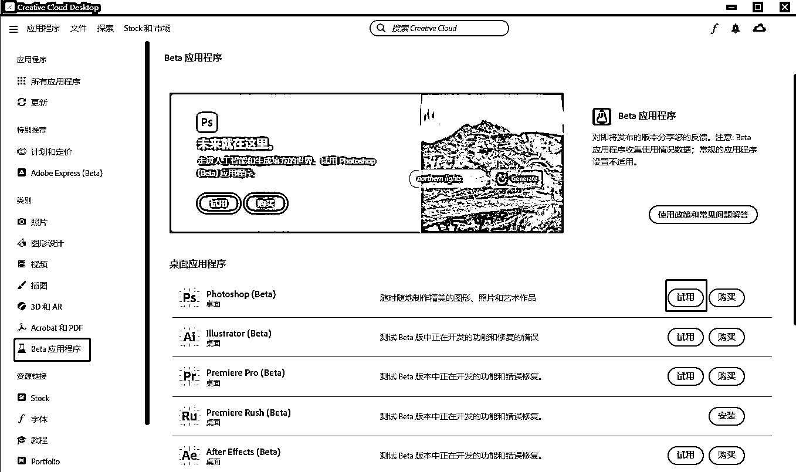  <ne-p id="ud653ad37" data-lake-id="ud653ad37"><ne-text id="ub937b0c7">当你安装好了以后，左边出现 beta 应用程序以及有这个 Photoshop（beta）试用就可以了</ne-text></ne-p> <ne-p id="u170fe19b" data-lake-id="u170fe19b"><ne-text id="u485c75dc">试用的时间只有 7 天，如果装爱国版的话，在 PS 装好了以后，下面这个软件点击 search</ne-text></ne-p> <ne-p id="u7b50604a" data-lake-id="u7b50604a"><ne-text id="ufe8b744b">百度网盘链接：</ne-text>[<ne-text id="u8143a3b2">https://pan.baidu.com/s/1RorYWCHUkBWJLFB8niKU4A?pwd=bl86</ne-text>](https://pan.baidu.com/s/1RorYWCHUkBWJLFB8niKU4A?pwd=bl86)</ne-p> <ne-p id="ud09b5699" data-lake-id="ud09b5699"><ne-text id="u2f438096">提取码：bl86</ne-text></ne-p> <ne-p id="u6cf2ca7a" data-lake-id="u6cf2ca7a"><ne-text id="u166ebae5">Q＆A</ne-text></ne-p> <ne-p id="ud89aeb4d" data-lake-id="ud89aeb4d"><ne-text id="u52ae4742">Q：为什么点击创成式填充一直都会出现正值高峰耐心等待？</ne-text></ne-p> <ne-p id="u093f80cc" data-lake-id="u093f80cc"><ne-text id="uda6ddf50">A：生成的时候是需要</ne-text><ne-text id="u4295db16" ne-bold="true">科学上网</ne-text><ne-text id="u24d020b4">的，并且在打开 PS 之前就需要把科学上网打开</ne-text></ne-p> <ne-p id="ua90a759e" data-lake-id="ua90a759e"><ne-text id="u34ae2112">Q：确定没问题都安装好了，发现创意生成这个按钮还是灰色</ne-text></ne-p> <ne-p id="u9e92f38b" data-lake-id="u9e92f38b"><ne-text id="u3366e3f4">A：点击帮助登录自己的账户就行了</ne-text></ne-p> <ne-p id="u0071819d" data-lake-id="u0071819d"><ne-text id="u5fe48514">Q：安装好了以后发现怎么都打不开</ne-text></ne-p> <ne-p id="u8d2b31ab" data-lake-id="u8d2b31ab"><ne-text id="ucd6bffff">A：win10 的系统才可以，我本来是 win10 的企业版发现不行，后来刷到了 win10 的专业版可以了</ne-text></ne-p> <ne-p id="u4f019cdd" data-lake-id="u4f019cdd"><ne-text id="u353768fe" ne-bold="true">四 , 补充</ne-text></ne-p> <ne-p id="u912931ae" data-lake-id="u912931ae"><ne-text id="uf117a1ef">这种 Ai 生成完全可以天天找个第三方数据软件跟别人的图文爆款</ne-text></ne-p> <ne-p id="u84536625" data-lake-id="u84536625"><ne-text id="u3de42af9">做电商很多的地方都是需要图片的，像商品大图，做小红书，做抖音图文等等，重要性就不多说了</ne-text></ne-p> <ne-p id="u09d26290" data-lake-id="u09d26290"><ne-text id="ub11b924f">直客告诉我：</ne-text><ne-text id="u58e50afe" ne-bold="true" ne-italic="true" ne-underline="true">千川在内测图文投放 （图文是这个真图文）</ne-text></ne-p> <ne-p id="u0e53ad40" data-lake-id="u0e53ad40"><ne-text id="u0f878d81">确实图文会更容易上手一些，成本相对短视频也更低一些，不用到处找拍摄剪辑，自己可以第一时间就开始做了，图文爆了以后可以接直播，现在也可以投放千川了，所以还是很值得尝试的</ne-text></ne-p> <ne-p id="uafb47862" data-lake-id="uafb47862"><ne-text id="ucd36bdb3">目前的话如果你直接投会显示低效素材，需要联系直客报名，没有条件的也可以先布局，相信后面都会开放的</ne-text></ne-p> <ne-p id="u55078ccd" data-lake-id="u55078ccd"><ne-text id="u0eee3177">本文的话到这里就结束了，希望能帮助到你，各位要是有问题也欢迎留言~</ne-text></ne-p> <ne-p id="u24a926b5" data-lake-id="u24a926b5"><ne-card data-card-name="image" data-card-type="inline" id="qWD7w" data-event-boundary="card">  <ne-p id="u5f13d366" data-lake-id="u5f13d366"><ne-card data-card-name="image" data-card-type="inline" id="jy4ir" data-event-boundary="card">  <ne-hole id="u63a960e8" data-lake-id="u63a960e8"><ne-card data-card-name="hr" data-card-type="block" id="GDEfd" data-event-boundary="card"><ne-p id="ueb09671c" data-lake-id="ueb09671c"><ne-text id="uccbe92b6">评论区：</ne-text></ne-p> <ne-p id="u88479a2e" data-lake-id="u88479a2e"><ne-text id="uf8e177a9">淇方 : 大佬，请问对电脑配置有啥要求没</ne-text> <ne-text id="u034cb99b">李谢谢 : 我的显卡是 1060 用起来还行</ne-text> <ne-text id="u59438ec0">如意郎君 : 谢谢，分享，写的灰常详细。我的效率又要提升了。[呲牙]</ne-text> <ne-text id="u2360b2bf">一时 : 刷系统的意思是重装系统吗</ne-text> <ne-text id="u77c14fc7">✨🍒恋小呆🍒✨ : 及时雨</ne-text> <ne-text id="u7acdbf84">Kyo" : 请问出现试用过期还有救吗。已经卸载过重新装过重新申请的账号。一来还是提示试用过期，打开很快就被秒关。</ne-text> <ne-text id="ua2ffa645">李谢谢 : 换个邮箱重新装就好了</ne-text> <ne-text id="u78e7b9ac">李谢谢 : 是的</ne-text></ne-p></ne-card></ne-hole></ne-card></ne-p></ne-card></ne-p></ne-card></ne-p></ne-card></ne-p></ne-card></ne-p></ne-card></ne-p></ne-card></ne-p></ne-card></ne-p></ne-card></ne-p></ne-card></ne-p></ne-card></ne-p></ne-card></ne-p></ne-card></ne-p></ne-card></ne-p></ne-card></ne-p></ne-card></ne-p></ne-card></ne-p></ne-card></ne-card></ne-p></ne-card></ne-p>