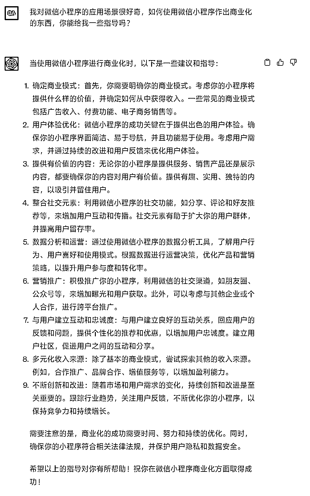
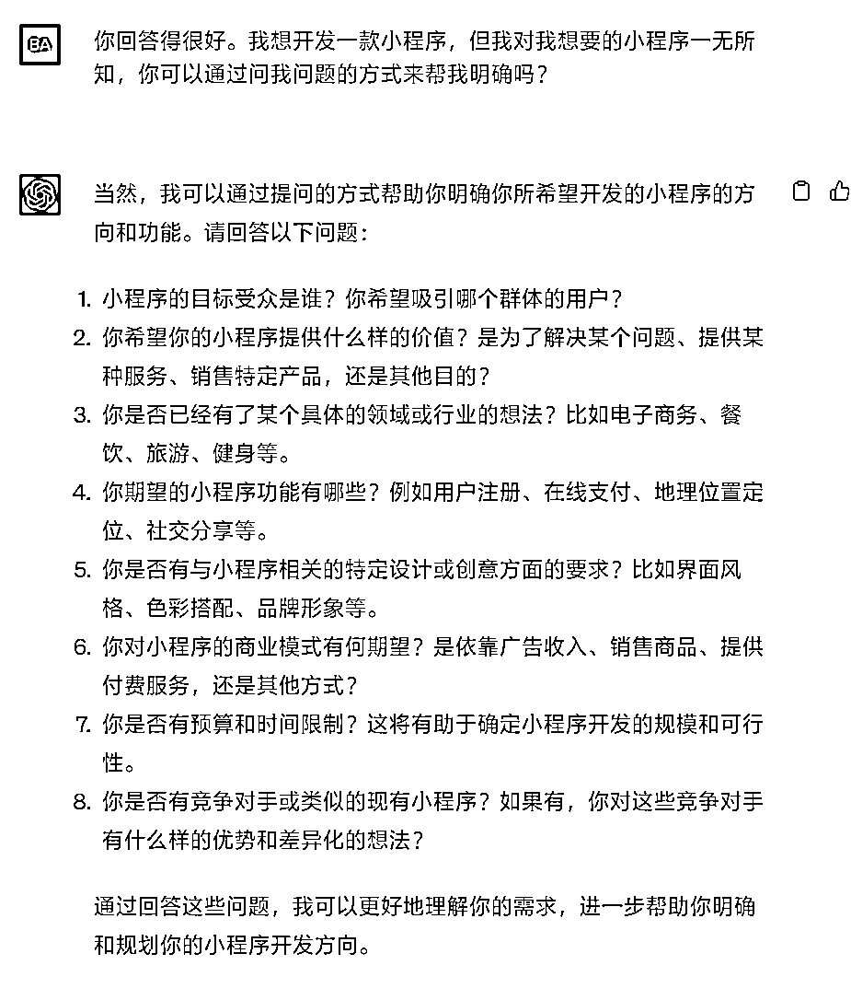
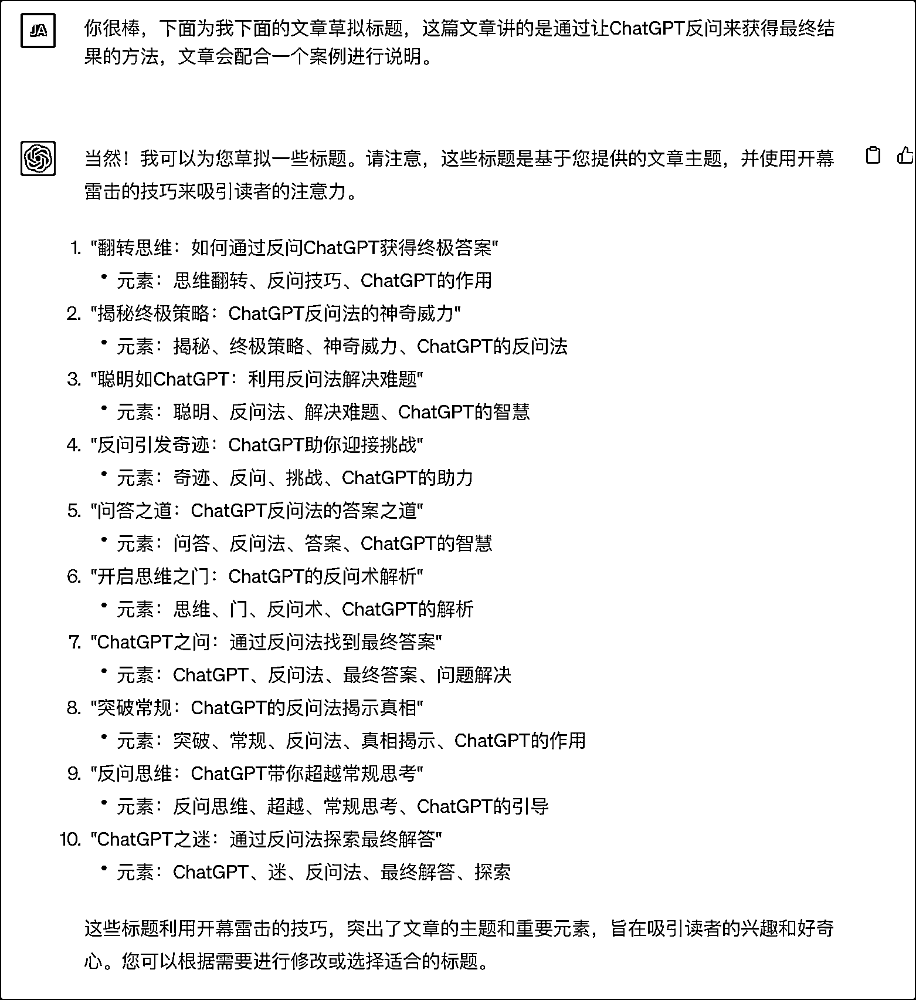

# 翻转思维：如何通过反问 ChatGPT 获得终极答案

> 原文：[`www.yuque.com/for_lazy/thfiu8/bmifc3rdom074zhz`](https://www.yuque.com/for_lazy/thfiu8/bmifc3rdom074zhz)

## (39 赞)翻转思维：如何通过反问 ChatGPT 获得终极答案 

作者： 星河君 

日期：2023-06-28 

众所周知，用好 ChatGPT 的关键就是进行高质量地提问，但有些时候我们对我们想要获得的内容也所知甚少。这种情况下，别说高质量地提问，我们甚至连问什么都不清楚。为了应对这种情况， 我们可以换个思路，让 ChatGPT 向我们提问，以此来获得终极答案。 

下面以一个案例进行展示，我的诉求是，我想要开发一个微信小程序，但这个诉求毫无疑问过于宽泛了。这个时候，就可以让 ChatGPT 来帮忙了。 

我的第一个问题是关于小程序的应用： 

回答如下： 

 

由此可见，过于宽泛的问题只能得到泛泛的回答。于是我开始让 ChatGPT 来问我。我的问题是： 

下面是 ChatGPT 的回答： 

 

这个问题的质量已经相当不错了。下面继续： 

 

ChatGPT 给的思路相当不错。如果只专注大学生，完全可以做一个大学本地版的大众点评。遥想前两年，一位大学生收集了大学附近的店铺信息，然后通过传单等方式发给新生。通过一系列操作赚了好几万。 

 

实际上到这里可以看出，通过让 ChatGPT 反问的方式已经得到不错的回答了。 

这个思路也可以用在探索未知领域上，比如摄影。可以向它提问： 

ChatGPT 会告诉你摄影的注意事项，然后一步一步深入即可。它甚至可以根据你的器材给你推荐拍摄参数： 

 

最后，题目标题是 ChatGPT 生成的。它生成了十个，我选取了第一个。 

 

图标不一样是因为我用了两台电脑，两个 ChatGPT 账号。 

评论区： 

希声 : 很赞 星河君 : 提供一个思路，可以试试