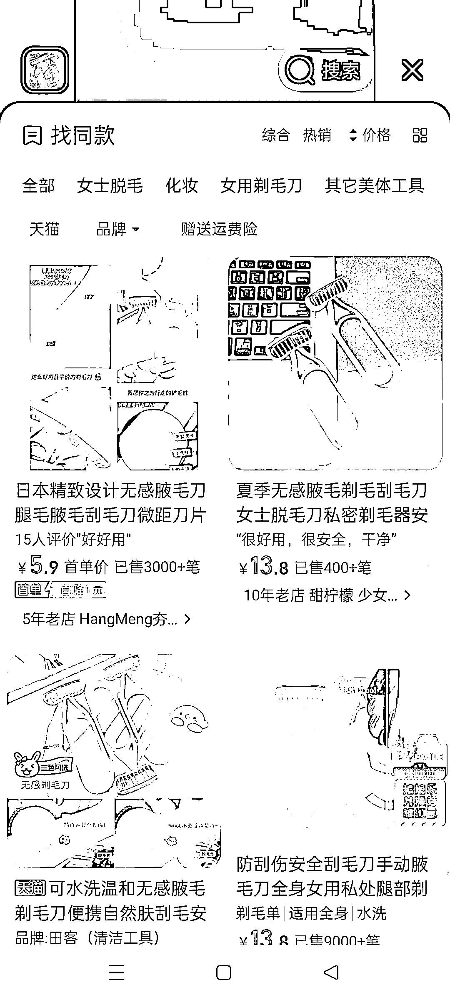

# 小红书低粉爆款案例拆解教程

> 原文：[`www.yuque.com/for_lazy/thfiu8/vwp5k30fdtygktg0`](https://www.yuque.com/for_lazy/thfiu8/vwp5k30fdtygktg0)

<ne-h2 id="bebfb5b7" data-lake-id="bebfb5b7"><ne-heading-ext><ne-heading-anchor></ne-heading-anchor><ne-heading-fold></ne-heading-fold></ne-heading-ext><ne-heading-content><ne-text id="u9c85549a">(91 赞)小红书低粉爆款案例拆解教程</ne-text></ne-heading-content></ne-h2> <ne-p id="u6e2413e9" data-lake-id="u6e2413e9"><ne-text id="u14978e16">作者： 书豪</ne-text></ne-p> <ne-p id="uc86740a6" data-lake-id="uc86740a6"><ne-text id="u6469a6ca">日期：2023-06-27</ne-text></ne-p> <ne-p id="u7d8fe2ea" data-lake-id="u7d8fe2ea"><ne-text id="u448f0243" style="color: rgb(73, 73, 73);">各位朋友好，我是在杭州的圈友书豪，一个连续创业四年的 95 后，目前连续四年都年入百万。</ne-text></ne-p> <ne-p id="u1485ef1e" data-lake-id="u1485ef1e"><ne-text id="u72aaeb2e" style="color: rgb(73, 73, 73);">都说小红书要想成功，七分靠选品，三分靠笔记</ne-text></ne-p> <ne-p id="u03aa0e7c" data-lake-id="u03aa0e7c"><ne-text id="u2994f6a8" style="color: rgb(73, 73, 73);">那么在小红书上选品真的难吗？！其实一点都不难，用</ne-text><ne-text id="u51c1998c" ne-bold="true">低粉爆款</ne-text><ne-text id="u2683272e" style="color: rgb(73, 73, 73);">这一招就能找到容易出单的品类。</ne-text></ne-p> <ne-p id="u28a28a54" data-lake-id="u28a28a54"><ne-text id="ue4aa7085" style="color: rgb(73, 73, 73);">今天我们来直接拆解低粉爆款的案例！</ne-text></ne-p> <ne-h2 id="a1dd8b0d" data-lake-id="a1dd8b0d"><ne-heading-ext><ne-heading-anchor></ne-heading-anchor><ne-heading-fold></ne-heading-fold></ne-heading-ext><ne-heading-content><ne-text id="u279c4e9d" ne-bold="true">一、低粉爆款法选品策略案例拆解</ne-text></ne-heading-content></ne-h2> <ne-p id="uc56fa5d1" data-lake-id="uc56fa5d1"><ne-text id="ue8cb7a06" style="color: rgb(47, 48, 52);">所谓</ne-text><ne-text id="uc4b5063d" ne-bold="true">低粉爆款法选品策略</ne-text><ne-text id="u28af7b04" style="color: rgb(47, 48, 52);">本质上就是</ne-text><ne-text id="ue4b9688c" ne-bold="true">跟品</ne-text><ne-text id="u682bf35e" style="color: rgb(47, 48, 52);">，只不过</ne-text><ne-text id="uf9c23470" ne-bold="true">跟谁的品</ne-text><ne-text id="u47488dc1" style="color: rgb(47, 48, 52);">是门学问。</ne-text></ne-p> <ne-p id="u1f003895" data-lake-id="u1f003895"><ne-text id="udc9d058a" style="color: rgb(47, 48, 52);">跟品，按照低粉爆款的思路去跟品，原则是：</ne-text></ne-p> <ne-p id="u566c815c" data-lake-id="u566c815c"><ne-text id="ue50aafea" ne-bold="true">对标模仿的小红书账号低于 200 粉丝，同时最近 7 天发的单篇带货笔记点赞过 100，同时该带货笔记商品销量大于 100。</ne-text></ne-p> <ne-p id="u4d7d640e" data-lake-id="u4d7d640e"><ne-text id="u17ccc4b4" style="color: rgb(73, 73, 73);">我们先看一个例子，大家可以去搜索一个小红书号：637261892，名称是：小樱爱分享</ne-text></ne-p> <ne-p id="u0d498da9" data-lake-id="u0d498da9"><ne-card data-card-name="image" data-card-type="inline" id="hm1Vl" data-event-boundary="card" style="color: rgb(73, 73, 73);">  <ne-p id="u56f11beb" data-lake-id="u56f11beb"><ne-card data-card-name="image" data-card-type="inline" id="twKrp" data-event-boundary="card" style="color: rgb(73, 73, 73);">  <ne-p id="uc0aba54e" data-lake-id="uc0aba54e"><ne-text id="u2ce55a8b" style="color: rgb(73, 73, 73);">这个账号在 2023 年 6 月 22 号发的刮毛刀这个笔记，有 122 点赞，且【刮毛刀】这个商品有 307 单。</ne-text></ne-p> <ne-p id="u061490fe" data-lake-id="u061490fe"><ne-text id="ubca39c88" style="color: rgb(73, 73, 73);">符合我们的</ne-text><ne-text id="u897f7b14" ne-bold="true">低粉爆款策略的选品原则</ne-text><ne-text id="u5843e390" style="color: rgb(73, 73, 73);">。那么这个品我们就可以直接跟！</ne-text></ne-p> <ne-p id="ue8df06c7" data-lake-id="ue8df06c7"><ne-text id="u321413b1" style="color: rgb(47, 48, 52);">这种爆款方法，本质就是找</ne-text><ne-text id="u777bc87c" ne-bold="true">没多少粉丝但已经有品在爆</ne-text><ne-text id="ubfd20a6c" style="color: rgb(47, 48, 52);">的对手，去跟品！</ne-text></ne-p> <ne-p id="u0afbf572" data-lake-id="u0afbf572"><ne-text id="ud72445ef" style="color: rgb(47, 48, 52);">所以低粉爆款这四个字可以等价于六个字，那就是</ne-text><ne-text id="ucfa5641a" ne-bold="true">粉丝少成交多</ne-text><ne-text id="u047eacc1" style="color: rgb(47, 48, 52);">！</ne-text></ne-p> <ne-p id="u8aad2804" data-lake-id="u8aad2804"><ne-text id="ufd1b7f62" style="color: rgb(47, 48, 52);">在符合低粉爆款原则之后，我们就可以去淘宝/拼多多等上家看这款商品的利润可以到哪里。</ne-text></ne-p> <ne-p id="u5b04634a" data-lake-id="u5b04634a"><ne-text id="ueee1d411" style="color: rgb(47, 48, 52);">在淘宝上该同款刮毛刀 6.7 元就可以买到，而小樱爱分享这个小红书账号上，同款商品的定价是 12.6 元，目前为止出了 307 单，按照每单 6 元的利润计算，这个单品小赚 1842 元，并且超低价类百货单品的退货率是不到 5%的，即使我们出一个 15.6 元的单价，拉高单品的利润率也是可以的，小红书不打价格战。</ne-text></ne-p> <ne-p id="uc0bf3b3e" data-lake-id="uc0bf3b3e"><ne-card data-card-name="image" data-card-type="inline" id="jnHNH" data-event-boundary="card" style="color: rgb(73, 73, 73);">  <ne-h2 id="24ac3dcf" data-lake-id="24ac3dcf"><ne-heading-ext><ne-heading-anchor></ne-heading-anchor><ne-heading-fold></ne-heading-fold></ne-heading-ext><ne-heading-content><ne-text id="u25947ffb" style="color: rgb(47, 48, 52);">二、选品确定后如何测品</ne-text></ne-heading-content></ne-h2> <ne-p id="u35479eb2" data-lake-id="u35479eb2"><ne-text id="ub3f6eb01" style="color: rgb(73, 73, 73);">我们做无货源电商，测品只就记住一个字，</ne-text><ne-text id="ub0b07ab3" ne-bold="true">抄！</ne-text></ne-p> <ne-p id="ucc51dfc6" data-lake-id="ucc51dfc6"><ne-text id="u2fd4efca" ne-bold="true">测试你选好的品，重要的是抄得精准，抄到极致。</ne-text><ne-text id="u12d8e274" style="color: rgb(73, 73, 73);">把对标账号的爆款笔记的视频素材的每一秒都抄到位。尤其是</ne-text><ne-text id="uf25dc5b7" ne-bold="true">封面</ne-text><ne-text id="ufbc4a55d" style="color: rgb(73, 73, 73);">，决定了用户会不会点击视频笔记去看（点击率）。过于平淡的封面是不会有持续的流量的。</ne-text></ne-p> <ne-p id="u47d759bc" data-lake-id="u47d759bc"><ne-text id="u3ccc10ec" style="color: rgb(73, 73, 73);">可以按照以下步骤去测品。</ne-text></ne-p> <ne-p id="uc828c3e3" data-lake-id="uc828c3e3"><ne-text id="u46509c35" style="color: rgb(73, 73, 73);">1、</ne-text><ne-text id="u4ba0dca5" ne-bold="true">搜集素材</ne-text><ne-text id="u445e0d7e" style="color: rgb(73, 73, 73);">。比如这款刮毛刀，可以通过抖音的以图搜视频功能找到大量同款刮毛刀的</ne-text><ne-text id="u4c5ee973" ne-bold="true">视频素材</ne-text><ne-text id="u63556152" style="color: rgb(73, 73, 73);">。然后用至尊宝的以图搜图功能，找淘宝上的同款商品买家秀，搜集</ne-text><ne-text id="ud537294b" ne-bold="true">视频和图片素材。</ne-text><ne-text id="uda7b829b" style="color: rgb(73, 73, 73);">再用轻抖小程序等可以下载小红书视频的软件把同款商品的爆款视频下载到本地，为了获取它的</ne-text><ne-text id="u5d780c5d" ne-bold="true">音频素材</ne-text><ne-text id="uee5e9f87" style="color: rgb(73, 73, 73);">。</ne-text></ne-p> <ne-p id="u4bf55306" data-lake-id="u4bf55306"><ne-card data-card-name="image" data-card-type="inline" id="D3jBF" data-event-boundary="card" style="color: rgb(73, 73, 73);">  <ne-p id="u2db17b87" data-lake-id="u2db17b87"><ne-text id="u427e948f" style="color: rgb(47, 48, 52);">2、</ne-text><ne-text id="u9e8f87bb" ne-bold="true">混剪</ne-text><ne-text id="u62b01129" style="color: rgb(47, 48, 52);">。素材搜集完后，需要开始混剪，混剪的教程就不多说了，剪映的教程网络上很多，但混剪的方法就是</ne-text><ne-text id="u34a295f0" ne-bold="true">小红书爆款视频的音频+抖音视频/淘宝买家秀的素材</ne-text><ne-text id="ud02744c5" style="color: rgb(47, 48, 52);">，后续只需要把这些素材再进行替换，就是一个新的混剪视频。</ne-text></ne-p> <ne-p id="ua696d91c" data-lake-id="ua696d91c"><ne-text id="ucf63d494" style="color: rgb(47, 48, 52);">3、</ne-text><ne-text id="u63e2fee3" ne-bold="true">封面</ne-text><ne-text id="uedea4d41" style="color: rgb(47, 48, 52);">。直接用抖音/小红书同款商品爆款视频的封面来做封面，省时省力，人家已经帮我们测试好了，我们为什么不去用呢？</ne-text></ne-p> <ne-p id="u030efd74" data-lake-id="u030efd74"><ne-text id="u29ac0830" style="color: rgb(47, 48, 52);">上面三点都搞定后，那就直接发带货笔记就好啦！</ne-text></ne-p> <ne-p id="u68177857" data-lake-id="u68177857"><ne-text id="ucdf6024f" style="color: rgb(73, 73, 73);">低粉爆款策略的案例就是想告诉大家</ne-text><ne-text id="u42c0c9e3" ne-bold="true">花最少的功夫，赚最多的钱</ne-text><ne-text id="u0672069a" style="color: rgb(73, 73, 73);">的一种跟品策略</ne-text></ne-p> <ne-p id="u81db8b5d" data-lake-id="u81db8b5d"><ne-text id="u218b3aee" style="color: rgb(73, 73, 73);">我今天特别拆解这个账号的原因，也是昨天在生财写的小红书低粉爆款选品策略深受大家的欢迎和认可，于是再写一篇直接拆解如何找低粉爆文和复制账号！</ne-text></ne-p> <ne-p id="u32c16eac" data-lake-id="u32c16eac"><ne-text id="u04037084" style="color: rgb(73, 73, 73);">用低粉爆款策略法选品对新手是特别友好的，而且难度低，可复制到多个小红书店铺的经营上。</ne-text></ne-p> <ne-p id="uea6e3474" data-lake-id="uea6e3474"><ne-text id="u41f41f1b" style="color: rgb(73, 73, 73);">最后我有句肺腑之言想分享给大家，所有的玩法，都不是我们幻想出来的，没有谁能想象出一种玩法，</ne-text><ne-text id="u6bc2a655" ne-bold="true">所有的玩法都来自多观察同行再实践测试。</ne-text></ne-p> <ne-p id="uc7cf5bf3" data-lake-id="uc7cf5bf3"><ne-text id="u48339428" style="color: rgb(73, 73, 73);">当绝大多数同行都能通过低粉爆款策略选品铺货出单，也就说明低粉爆款选品这种带货玩法是适用于当前的小红书平台的。</ne-text></ne-p> <ne-p id="u34ab5d95" data-lake-id="u34ab5d95"><ne-text id="ucaae6997" ne-bold="true">选品策略有很多种，万变不离其宗，但只有实践彻底了，才有出单赚钱的可能。</ne-text></ne-p> <ne-p id="u34d11aee" data-lake-id="u34d11aee"><ne-text id="u1e89405e">往期文章：</ne-text></ne-p> <ne-h2 id="6f573f91" data-lake-id="6f573f91"><ne-heading-ext><ne-heading-anchor></ne-heading-anchor><ne-heading-fold></ne-heading-fold></ne-heading-ext><ne-heading-content>[<ne-text id="u820448f9">人生的第一个 100 万，我是怎么赚到的？！</ne-text>](https://articles.zsxq.com/id_kek27cqo56wf.html)</ne-heading-content></ne-h2> <ne-h2 id="49811bb1" data-lake-id="49811bb1"><ne-heading-ext><ne-heading-anchor></ne-heading-anchor><ne-heading-fold></ne-heading-fold></ne-heading-ext><ne-heading-content>[<ne-text id="ub7c9aa22">小红书单店铺单月 6000+利润选品保姆级教程</ne-text>](https://articles.zsxq.com/id_xwveu3e0usfv.html)</ne-heading-content></ne-h2> <ne-h2 id="45edf875" data-lake-id="45edf875"><ne-heading-ext><ne-heading-anchor></ne-heading-anchor><ne-heading-fold></ne-heading-fold></ne-heading-ext><ne-heading-content>[<ne-text id="u0b2bee2c">小红书无货源电商，单品 4w+利润，我做了什么？</ne-text>](https://articles.zsxq.com/id_8o3ptacdp6mj.html)</ne-heading-content></ne-h2> <ne-h2 id="8de77b3d" data-lake-id="8de77b3d"><ne-heading-ext><ne-heading-anchor></ne-heading-anchor><ne-heading-fold></ne-heading-fold></ne-heading-ext><ne-heading-content>[<ne-text id="ucdd629cd">抖音直播间月消耗过百万的千川投流经验分享</ne-text>](https://articles.zsxq.com/id_d3zembkeh2cw.html)</ne-heading-content></ne-h2> <ne-h2 id="971a8372" data-lake-id="971a8372"><ne-heading-ext><ne-heading-anchor></ne-heading-anchor><ne-heading-fold></ne-heading-fold></ne-heading-ext><ne-heading-content>[<ne-text id="u720f04ec">2023 小红书幼教考编保姆级教程</ne-text>](https://articles.zsxq.com/id_cpdec6j4xtho.html)</ne-heading-content></ne-h2> <ne-hole id="ud4cbff95" data-lake-id="ud4cbff95"><ne-card data-card-name="hr" data-card-type="block" id="Jjuuu" data-event-boundary="card"><ne-p id="u6ddef9b8" data-lake-id="u6ddef9b8"><ne-text id="ue866c834">评论区：</ne-text></ne-p> <ne-p id="ud87c41a7" data-lake-id="ud87c41a7"><ne-text id="u1595fe21">刘勇 : 豪哥真是高产！</ne-text> <ne-text id="u5478b21f">书豪 : 谢谢夸奖，输出倒逼输入，下笔写出来也是对过往的实践做总结</ne-text> <ne-text id="ue67c9a21">要快乐鸭 : 感谢分享[强][强]，刚好做百货，苦于打不开播放</ne-text> <ne-text id="u84fcbe0a">FF_23531 : 真的是想睡觉有人递枕头[强][强][强]感谢豪哥</ne-text> <ne-text id="u3c177dfe">书豪 : 谢谢认可，希望对大家有用！</ne-text> <ne-text id="u5d6c99d1">书豪 : 选品+素材视频做好，会出单的！</ne-text> <ne-text id="u2cfa41a1">书情小跟班 : 大佬，围观下朋友圈</ne-text> <ne-text id="u597eab40">谢安生 : 豪哥 NB[强][强][强]</ne-text></ne-p></ne-card></ne-hole></ne-card></ne-p></ne-card></ne-p></ne-card></ne-p></ne-card></ne-p>