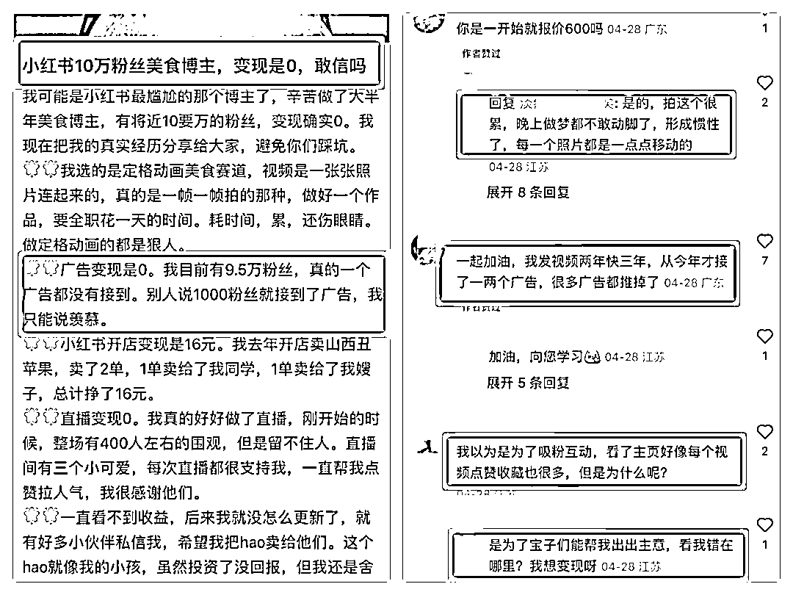
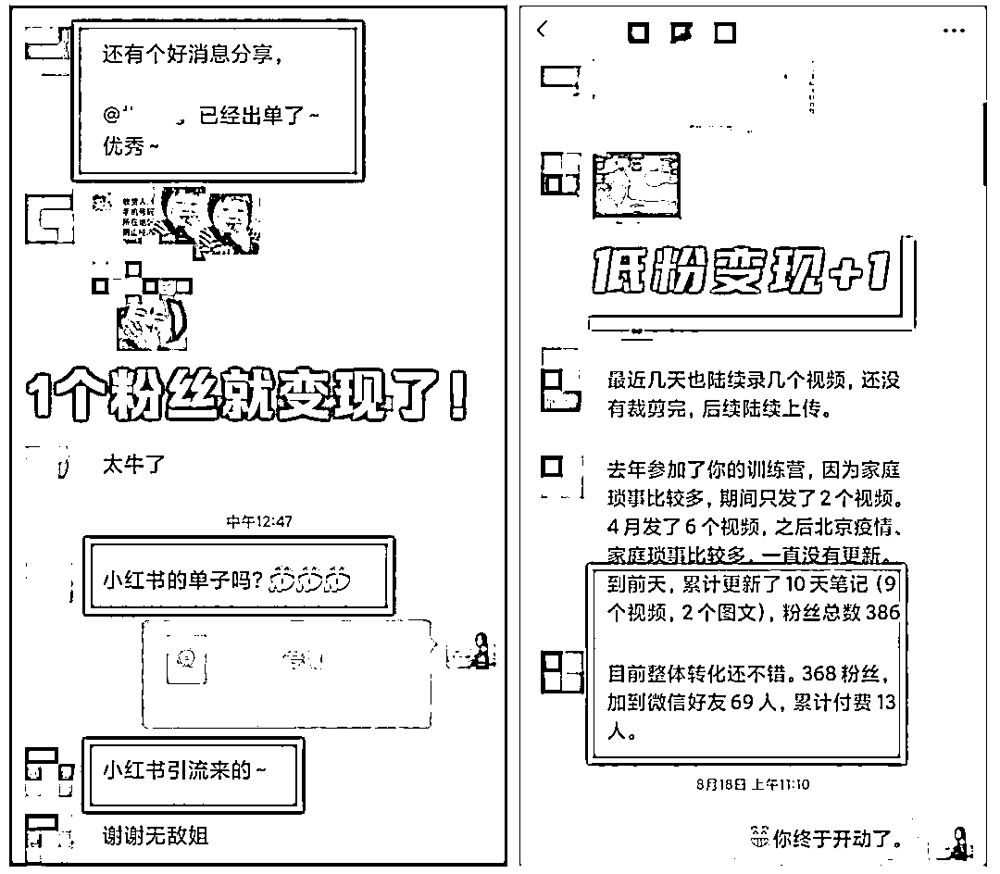
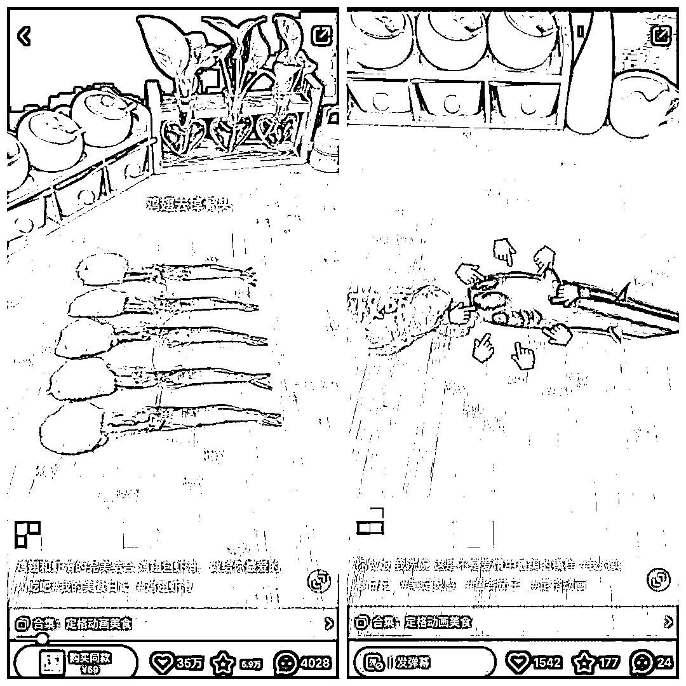
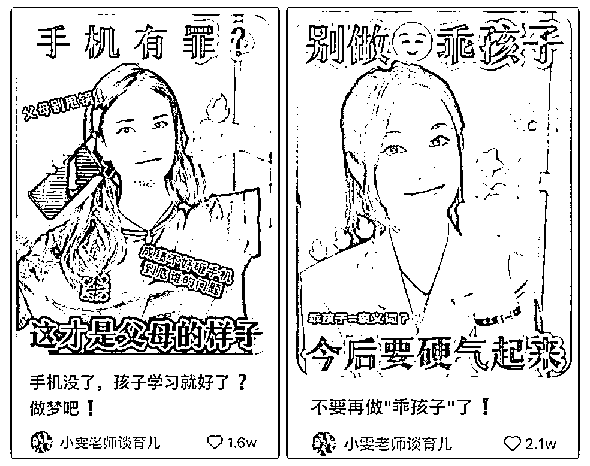
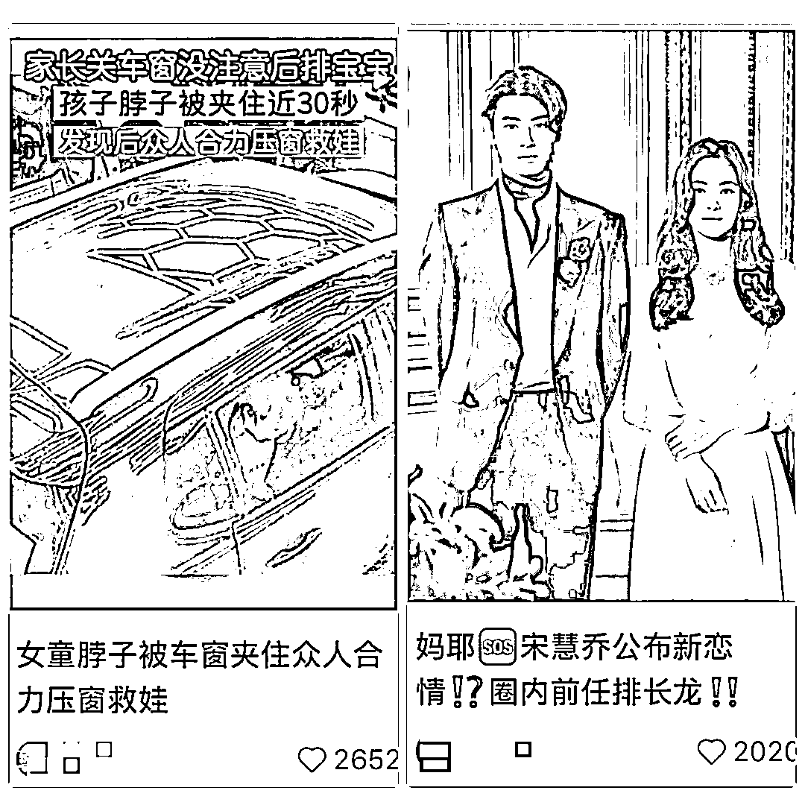
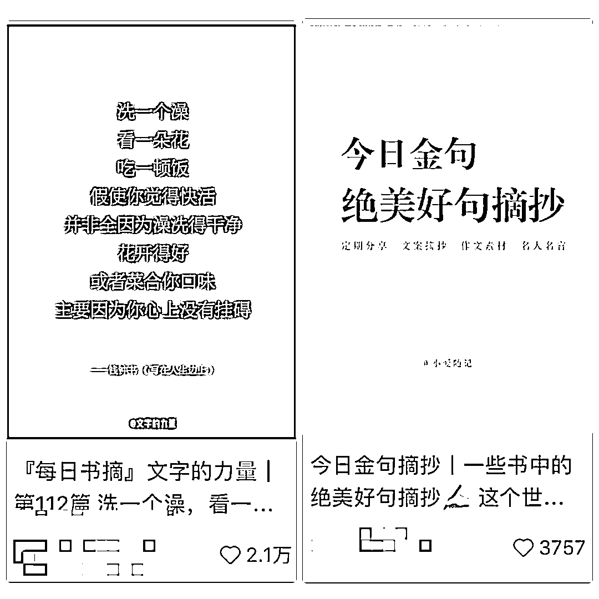
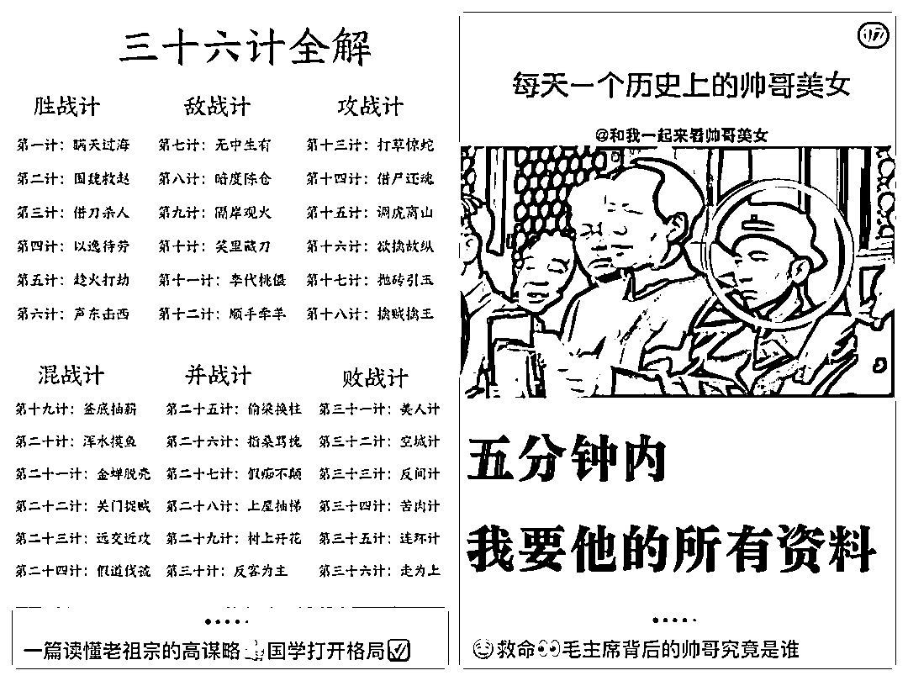

# 粉丝 10 万变现为 0？劝你千万不要做这三种账号！

> 原文：[`www.yuque.com/for_lazy/thfiu8/agulntt8gw3qqb8d`](https://www.yuque.com/for_lazy/thfiu8/agulntt8gw3qqb8d)

## (76 赞)粉丝 10 万变现为 0？劝你千万不要做这三种账号！ 

作者： Sherry💎谢无敌 

日期：2023-06-28 

Hi～生财的朋友们大家好~我是你们的老朋友-谢无敌，小红书 MCN 闪亮猫传媒创始人。 

前几天在小红书刷到一个美食博主，粉丝做到了 10w，但是一分钱也没有赚到。 

  

虽然像这样的案例不是个例，但我还是替她惋惜。 

我们做自媒体、做小红书，可能只有极少数人是为爱发电，把账号做成自己的树洞，除此之外，我相信大多数人的目标都是为了获得商业价值，简单来说就是希望能够赚钱。 

然而在实际操作中，很多人存在一个误区，就是错误地认为流量=变现，涨粉=变现。 

事实还真不是这样，我带了 3000+博主，涉及的赛道也不下 30+了，但我们的学员中，有很多低粉爆单、低粉变现，甚至 0 粉变现的案例。 

  

为什么有的人粉丝很少就忙着收钱了，而有的人做到万粉、10 万粉都赚不到钱呢？ 

原因其实大多跟定位有关，今天给大家分享一下那些变现难、不变现的账号有什么样的特点，方便各位小伙伴们作为避坑自查。 

▍没留广告位 

对于小红书纯博主来说，接广告是一条非常重要的变现途径。然而，因为接广变现通常跟粉丝量直接相关，所以导致很多人走入了误区：过于追求涨粉和爆款。 

比如我们开头提到的那个账号，它的定位是利用定格动画制作美食教程，大致的操作就是先拍很多张照片，然后把照片连成视频，创造出食材自己动的效果。 

  

虽然创意新颖，让人过目不忘，但是制作过程非常复杂。 

每一个动作都要精心设计和摆拍，拍一个视频可能要一整天，还要把 1000 多张照片剪辑，加上配音，连成动画。 

  

这些系列型的动画，让博主在半年内涨了 10 万粉丝，但结果也让她心寒：10 万个粉丝，一个广告也没有接到。 

为什么呢？因为博主“成功”地把自己塑造成了“工具人”。 

对于这样的内容，大多数用户只是看个新鲜，感叹一下：好有创意！好有趣！然后关注博主，期待获得视觉上的享受。 

视频的主角是那些“会动的食材”，只有极少数用户可能会真正关心她的美食教程。 

再加上，由于这位博主使用了固定机位拍摄，展示的场景非常有限，只有一个菜板和几个调料罐子。导致她的视频里，除了食材本身，其他任何产品的植入都会显得突兀和不自然。 

换句话说，即使有广告主想找她，也找不到合适的植入空间。毕竟，广告主也不希望看到评论区都在指责博主接硬广。 

所以，如果你有接广的打算，那你就要有广告位思维，想要接什么样的产品广告，就提前把广告位留出来，后期植入的时候就不会太跳跃。 

同样是定格动画美食，有一位聪明的博主就多做了一个动作，除了菜市场上常见的大众食材，她会在视频中加入一些产品类的食材，比如图片中的这样： 

  

这个其实就是广告位，观众习惯了这样的露出，那她去接同类型的广告，植入就会更加自然。 

但是总体来说，这种形式的笔记内容，投入产出比不太理想，除非你希望通过制作动画教学来实现变现。 

▍人群不精准 

很多小伙伴对自己的用户画像很模糊，也没有去研究目标人群的痛点和需求，造成的结果就是内容方向很容易走偏。 

常见的内容误区，主要有三类： 

### 1、呈现形式不对 

比如有的博主自身条件不错，原本可能是想利用颜值优势接一些穿搭、配饰类的广告。 

  

但是内容只有随意的自拍，风格也比较媚，可想而知，吸引来的都是一些 lsp，变现就不容乐观，品牌方也不愿意投。 

### 2、人设立场不对 

有一位母婴博主，本身具备专业优势，提供的内容也很干货，第一篇笔记就爆了 81w 点赞量。 

但因为选题和观点引起了许多学生的共鸣，吸引来了一大批学生群体。 

  

博主也投其所好，继续站在孩子的角度输出大量笔记，为孩子们“发声”。 

例如：成绩差不是玩手机玩的；不要再做“乖孩子”；发朋友圈屏蔽父母；家长别总觉得孩子欠你的...等等。 

  

可想而知，虽然数据很好看，但她的粉丝画像中，18 岁以下的人群占了一大半。 

  

显然，这个人群的消费能力十分有限，也间接限制了博主的商业价值和变现。 

直到粉丝涨到 40 万以上时，她才陆续接到一些学习机类产品的广告。幸运的是，后来她也意识到了这个问题，并调整了内容视角，更多会从父母的痛点和需求出发。 

### 3、选题方向不对 

这个问题常见于艺术、设计类等专业性比较强的领域。 

举个例子，一个设计师博主，本来是想接设计单变现的，但是他的选题都是下面这种： 

1.  高级感配色分享； 

2.  设计流行趋势分析； 

3.  提升设计效率的工具推荐; 

4.  ................. 

  

你想一想，对这些内容感兴趣的是什么样的人？没错，也是设计师！ 

所以，他的内容吸引来的大概率也都是同行，这样的人群更适合做知识付费转化，想要接单变现？恐怕比较难。 

记住一句话：你的内容是要为变现服务的。 

你想要什么样的人为你买单，就要把这类人群的痛点和需求作为你的内容指南针。 

▍赛道离钱远 

有些赛道可能流量很好、涨粉也很快，但是变现真的很难。下面这五类赛道，离钱太远，建议新手一定要避开！ 

### 1、新闻八卦类 

新闻资讯和娱乐八卦类的内容，流量很好，但由于没有人设，用户只是关心内容本身，而不会注意到背后的你，所以很难变现。 

  

### 2、文案摘抄类 

金句摘抄、书单推荐类内容，也很容易出爆文，可以偶尔作为提升流量的选题来做。 

但如果你是纯摘抄类的账号，那用户基本只把你当成工具号，没啥信任感可言，吸引的也是白嫖党，无论接广还是带货都比较难。 

  

### 3、影视剧情类 

影视剧情类的混剪和解说，流量同样很大，因为人们天生喜欢看故事。 

但是，这类内容的娱乐属性远大于商业属性，粉丝群体也很杂乱，而且还可能涉及版权问题，所以不建议选择这个赛道。 

有些博主可能会认为：“我可以同时发布其他内容，只要流量足够多，总会有人来看。” 

就像下面这个账号： 

  

但实际上，这样的主页给人的感觉非常割裂，粉丝进来是希望看到更多与影视相关的内容，但你却在向他们推销美妆护肤品。想一想，这样的转化效果会好吗？ 

品牌商家也不是傻瓜，他们除了关注粉丝数量，也会考虑粉丝的精准度。 

### 4、游戏解说类 

没有真实场景露出，只做玩法攻略、游戏分享类的账号，虽然也能接一些游戏 app 类的广告，但是变现有限。 

  

### 5、文化科普类 

分享纯知识文化科普类的账号，尤其是小众、硬核的冷知识或故事类，互动量可能也不错，但是没办法植入广告，你也很难做知识付费，只能说是纯粹的在利他。 

  

千万不要想着等粉丝量起来后再考虑变现，到时候你会面临转型很困难，弃之又可惜的境地。 

以上就是三大类变现差的账号特点，所以我经常说，做博主的第一步，不单单要确定定位，选择赛道，你还要考虑你的变现方式，梳理好整个变现的闭环，不能凭着一腔热血就盲目地开干。 

做账号的底层逻辑，其实就是做流量，然后再把流量变现。 

但是为了获得更好地变现效率，你要在起始阶段，就去做有商业目的的流量，然后再根据你的变现方式，去做有目的的内容。 

希望今天的分享能给你一些启发和帮助～ 

更多分享： 

[博主必看！2023 年小红书八大运营趋势解读](https://t.zsxq.com/0eFBeisHS) 

[做对小红书关键词布局，拿捏消息 99+的流量密码！](https://t.zsxq.com/0eLiWlm9B) 

[客单价 4 位数的玄学博主，教你一个公式写出高转化笔记](https://t.zsxq.com/0eMdKqJbg) 

[（附选品清单）如何选择小红书蓝海赛道和产品？3 个方法搞定！](https://t.zsxq.com/0eUR5OYuT) 

[一晚涨粉 400+、引流 80+，人人都可以复制小红书群聊引流法](https://t.zsxq.com/0eG1wH8d5) 

[船长复盘：小红书小航海 ｜乘风破浪会有时，直挂云帆济沧海](https://t.zsxq.com/0e63wt9Iw) 

[1 篇笔记引流 200+精准客，破解小红书真正的流量密码](https://t.zsxq.com/0eKZ3bNvk) 

[《0 基础新手，如何在 1 个月内通过小红书快速变现？（附 10 种变现渠道整理）](https://t.zsxq.com/0eeQyLczW) 

评论区： 

骏马 : 本地信息差类呢？ Sherry💎谢无敌 : 除非能接本地商家广告 Blue : 最近富人信息差涨粉很快，这种怎么变现的呢？ Aimmon : 正确的赛道可以展开讲讲吗，哪些赛道离💰近 Sherry💎谢无敌 : 小红书直播每晚看一下 Aimmon : 好 倪大胖 : 资料引流创业粉 AT 魏诚钢 : 这些账号估计都是为了 MAI 号而做的