# 海外抖音 TIKTOK 讲故事玩法 3 天 10 个万粉

> 原文：[`www.yuque.com/for_lazy/thfiu8/ow7pllqdtwwrgagl`](https://www.yuque.com/for_lazy/thfiu8/ow7pllqdtwwrgagl)

<ne-h2 id="61ab8a28" data-lake-id="61ab8a28"><ne-heading-ext><ne-heading-anchor></ne-heading-anchor><ne-heading-fold></ne-heading-fold></ne-heading-ext><ne-heading-content><ne-text id="u7ef5a769">(81 赞)海外抖音 TIKTOK 讲故事玩法 3 天 10 个万粉</ne-text></ne-heading-content></ne-h2> <ne-p id="ud856995c" data-lake-id="ud856995c"><ne-text id="u0a5706e3">作者： A   😇路途</ne-text></ne-p> <ne-p id="uf8e15ee8" data-lake-id="uf8e15ee8"><ne-text id="u0192650a">日期：2023-06-30</ne-text></ne-p> <ne-p id="u146d2f49" data-lake-id="u146d2f49"><ne-text id="u625d003e">大家好，我是路途，专注在海外抖音 tiktok 上的玩家</ne-text></ne-p> <ne-p id="u763baff9" data-lake-id="u763baff9"><ne-text id="ua51e3977">相信最近几个月有留心 TK 的都有发现一个很有意思的玩法吧。</ne-text></ne-p> <ne-p id="ud37cf7ea" data-lake-id="ud37cf7ea"><ne-text id="u07101188">一个照片经过 AI 处理以后，在那里说话，然后配上字幕，播放量还都特别可观，而且动不动就是百万千万的播放。</ne-text></ne-p> <ne-p id="ua2b4dfa7" data-lake-id="ua2b4dfa7"><ne-text id="uad9cb18b">这个玩法，5 月份的时候我在上一篇文章的分享里提到过，还有幸获得一枚龙珠，原文链接是</ne-text>[<ne-text id="ude5677fd">《我是如何通过 tiktok 中视频计划月入 10 万》</ne-text>](https://articles.zsxq.com/id_98xdiad8ciw0.html)<ne-text id="u3331eb91">，很多星球伙伴后台私信 AI 数字人是怎么批量制作的，我把详细的教程写出来。我们一天用这个 AI 数字人玩法批量上产上千条视频，最重要的是阔以过 tiktok 的中视频基金，收益非常可观，1000 播放就有 1 美刀，大约人民币 7 块钱。</ne-text></ne-p> <ne-p id="u3c0baff7" data-lake-id="u3c0baff7"><ne-text id="u7e11cf9f">大家接着往下看。</ne-text></ne-p> <ne-p id="ue9729db1" data-lake-id="ue9729db1"><ne-card data-card-name="image" data-card-type="inline" id="aG6JF" data-event-boundary="card">  <ne-p id="u17f34fc8" data-lake-id="u17f34fc8"><ne-text id="ue3ffa6e0">视频平均长度在 1 分钟到 1 分半居多。而这样的一个视频你猜猜要花多长时间？</ne-text></ne-p> <ne-p id="uf9392b14" data-lake-id="uf9392b14"><ne-text id="u11f5f039">平均每条视频最快只需要几分钟时间即可完成！！！</ne-text></ne-p> <ne-p id="u31e02b27" data-lake-id="u31e02b27"><ne-text id="u8bd2cc54">而这样的一个视频的收益和转粉率却是十分惊人的。</ne-text></ne-p> <ne-p id="uadb48ab4" data-lake-id="uadb48ab4"><ne-text id="u5779c89a">比如说下面群里有个小伙伴做的一个题材，3 天就直接爆了 4W 多粉丝，而他最高的一个视频播放才不过 1 百多万而已。</ne-text></ne-p> <ne-p id="ue73b3ef0" data-lake-id="ue73b3ef0"><ne-text id="u9ed80866">换做我们平时做影视都是不敢想象的，起码要大爆一个视频才有机会破万粉。</ne-text></ne-p> <ne-p id="ub21012e7" data-lake-id="ub21012e7"><ne-text id="u6a63b8a8">看来喜欢听故事是人类的共性啊哈哈哈！！！</ne-text></ne-p> <ne-p id="u7efda6df" data-lake-id="u7efda6df"><ne-card data-card-name="image" data-card-type="inline" id="vmiek" data-event-boundary="card">  <ne-p id="u8290e3c2" data-lake-id="u8290e3c2"><ne-text id="ud5f6a12b">其实这只是目前 AI 玩法中的一种，我们称之为数字人讲故事。目前 TK 上这类账号有不少都是我们团队做的。最高的时候 3 天就能出 10 来个万粉。群里面也开展了 2 次陪跑，总的来说呢，小伙伴们跑的还是不错。</ne-text></ne-p> <ne-p id="u685f7de7" data-lake-id="u685f7de7"><ne-card data-card-name="image" data-card-type="inline" id="o3nMm" data-event-boundary="card">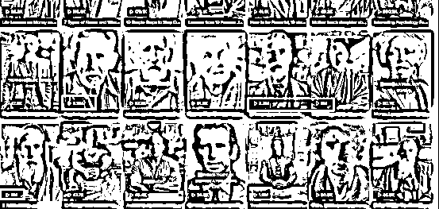  <ne-p id="u9b598d8d" data-lake-id="u9b598d8d"><ne-text id="u34ae8828">那么这种 AI 讲故事的玩法怎么做呢，今天我来给大家讲讲，巨简单，可以说简直就是有手就行。</ne-text></ne-p> <ne-p id="ucb1665b1" data-lake-id="ucb1665b1"><ne-text id="ubfacfb45">文章放不了视频，不太理解作品含义的可以找我发账号给你看哈</ne-text></ne-p> <ne-p id="u2050901d" data-lake-id="u2050901d"><ne-text id="uec59e45b">简单的来说呢，我们要呈现的效果呢，就是有个人物在画面里张嘴说话讲故事，故事的内容越吸引观众，就能获得更多的流量。是一个非常有意思又简单的玩法。</ne-text><ne-card data-card-name="image" data-card-type="inline" id="Iikeh" data-event-boundary="card"></ne-card></ne-p> <ne-p id="u705621f9" data-lake-id="u705621f9"><ne-text id="ua06dbe62" style="color: rgb(0, 0, 0);">那我们来拆解一下，要做这么一个视频我们需要什么东西。</ne-text></ne-p> <ne-p id="u465272ee" data-lake-id="u465272ee"><ne-text id="u1909466d" style="color: rgb(0, 0, 0);">一个故事（文案）</ne-text></ne-p> <ne-p id="uceea7ba2" data-lake-id="uceea7ba2"><ne-text id="u7609a531" style="color: rgb(0, 0, 0);">一个人物（图片）</ne-text></ne-p> <ne-p id="u1d2bfa00" data-lake-id="u1d2bfa00"><ne-text id="u77c72681" style="color: rgb(0, 0, 0);">让它讲话（配音）</ne-text></ne-p> <ne-p id="u9ce5b6c7" data-lake-id="u9ce5b6c7"><ne-text id="ueaa84951" style="color: rgb(0, 0, 0);">合成视频（剪辑）</ne-text></ne-p> <ne-p id="u5ecd4abb" data-lake-id="u5ecd4abb"><ne-text id="u94549011" ne-bold="true">一、我们先来看一下故事文案怎么写呢</ne-text></ne-p> <ne-p id="uae7e1993" data-lake-id="uae7e1993"><ne-text id="u396a8e21" style="color: rgb(0, 0, 0);">这里呢有几个办法哈</ne-text></ne-p> <ne-p id="u68435985" data-lake-id="u68435985"><ne-text id="u703b28ce" style="color: rgb(0, 0, 0);">1、让 AI 比如 CHATGPT 帮我们直接写一个故事</ne-text></ne-p> <ne-p id="uad122eaa" data-lake-id="uad122eaa"><ne-text id="u677c0e00" style="color: rgb(0, 0, 0);">如果生成的故事不满意，可以多给他提供一些作品案例，然后让他写一个好的作品出来。本质上还是要训练</ne-text></ne-p> <ne-p id="u05dddef5" data-lake-id="u05dddef5"><ne-card data-card-name="image" data-card-type="inline" id="QOlmH" data-event-boundary="card">  <ne-p id="u2217a211" data-lake-id="u2217a211"><ne-text id="u63d860e7">2、 </ne-text><ne-text id="u030d0af0" style="color: rgb(0, 0, 0);">也直接用同类作品的文案</ne-text></ne-p> <ne-p id="u99e502ca" data-lake-id="u99e502ca"><ne-text id="u329aa240">3、 </ne-text><ne-text id="ufcef9f57" style="color: rgb(0, 0, 0);">把你想要模仿的爆款视频下载下来，然后把他的文案直接识别保存下来。这里可以用剪映来做最简单。先智能识别字幕，之后再把字幕导出即可。</ne-text></ne-p> <ne-p id="ud0170a67" data-lake-id="ud0170a67"><ne-card data-card-name="image" data-card-type="inline" id="vJuQm" data-event-boundary="card">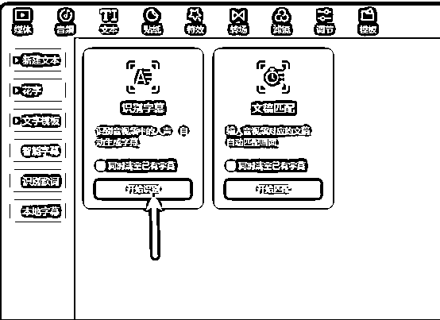  <ne-p id="u4b1a10bb" data-lake-id="u4b1a10bb"><ne-text id="u0ec5165d" style="color: rgb(0, 0, 0);">一下子就把文案搞出来了。</ne-text></ne-p> <ne-p id="ufe33d826" data-lake-id="ufe33d826"><ne-card data-card-name="image" data-card-type="inline" id="CdmbO" data-event-boundary="card">  <ne-p id="ucd2bf1ea" data-lake-id="ucd2bf1ea"><ne-text id="u3d15c2a7" style="color: rgb(0, 0, 0);">3、让 AI 工具帮我们改写故事</ne-text></ne-p> <ne-p id="uff77c597" data-lake-id="uff77c597"><ne-text id="u7014afd8" style="color: rgb(0, 0, 0);">如果不想用跟别人一样的文案，那也可以借助强大的 AI 给你重新写一个故事，可以先把别人的故事喂给 AI，然后让他给我们出一个类似的作品</ne-text></ne-p> <ne-p id="ua4b09145" data-lake-id="ua4b09145"><ne-card data-card-name="image" data-card-type="inline" id="k05p1" data-event-boundary="card">  <ne-p id="u0f82a056" data-lake-id="u0f82a056"><ne-text id="u3772ef1d" style="color: rgb(0, 0, 0);">就这样我们很容易就得到了我们想要的故事文案。</ne-text></ne-p> <ne-p id="u03019d88" data-lake-id="u03019d88"><ne-text id="u787fca3c" style="color: rgb(0, 0, 0);">那么接下来我们来看一下第二点</ne-text></ne-p> <ne-p id="uf4c1deee" data-lake-id="uf4c1deee"><ne-text id="u097fa041" ne-bold="true">二、如何画一个人物呢？</ne-text></ne-p> <ne-p id="uf5e729c8" data-lake-id="uf5e729c8"><ne-text id="ub38a16cb" style="color: rgb(0, 0, 0);">相信大家肯定都听说过 Midjourney 了，目前应该是最强大的 AI 画图平台之一了。</ne-text></ne-p> <ne-p id="u5955a62a" data-lake-id="u5955a62a"><ne-card data-card-name="image" data-card-type="inline" id="FK8tB" data-event-boundary="card">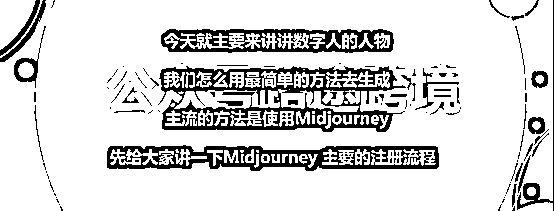  <ne-p id="ua309b911" data-lake-id="ua309b911"><ne-text id="ua7ac1211" style="color: rgb(0, 0, 0);">这里给没用过 MidJouney 的简单过一下注册流程的，我感觉还是很有必要学习一下的。后面我会介绍一个比 Midjourney 更简单的方法</ne-text></ne-p> <ne-p id="u717c4a9c" data-lake-id="u717c4a9c"><ne-text id="u5343d86d" style="color: rgb(0, 0, 0);">第一步去 MidJourney 官网，点击 Join the Beta</ne-text></ne-p> <ne-p id="u9b0ca5fb" data-lake-id="u9b0ca5fb"><ne-card data-card-name="image" data-card-type="inline" id="TmMnt" data-event-boundary="card">  <ne-p id="u4fec9d16" data-lake-id="u4fec9d16"><ne-text id="u237fc047" style="color: rgb(0, 0, 0);">第二步，接下来会跳转到 Discord，一个新的平台类似 QQ 频道或者说贴吧，然后去注册一下 Discord 账号</ne-text></ne-p> <ne-p id="u5591af25" data-lake-id="u5591af25"><ne-card data-card-name="image" data-card-type="inline" id="OkQtu" data-event-boundary="card">  <ne-p id="u49d8a4fd" data-lake-id="u49d8a4fd"><ne-text id="u8d6b8eba" style="color: rgb(0, 0, 0);">第三步</ne-text></ne-p> <ne-p id="ufb178767" data-lake-id="ufb178767"><ne-text id="u5c17a3c4" style="color: rgb(0, 0, 0);">在 Discord 频道里面创建一个新的服务器，并且添加 MJ 机器人到自己服务器里面。</ne-text></ne-p> <ne-p id="ua4d3909a" data-lake-id="ua4d3909a"><ne-card data-card-name="image" data-card-type="inline" id="S1hrx" data-event-boundary="card">  <ne-p id="uea377107" data-lake-id="uea377107"><ne-text id="u90d628c8" style="color: rgb(0, 0, 0);">第四步</ne-text></ne-p> <ne-p id="u664e55b4" data-lake-id="u664e55b4"><ne-text id="u503c82f6" style="color: rgb(0, 0, 0);">进入到自己的 Discord 服务器里面，并且使用 /image 功能调用 MJ 机器人。</ne-text></ne-p> <ne-p id="ua9361c38" data-lake-id="ua9361c38"><ne-text id="u3439afc3" style="color: rgb(0, 0, 0);">前提是你要先订阅付款哈不然是用不了的。</ne-text></ne-p> <ne-p id="ubbf25783" data-lake-id="ubbf25783"><ne-card data-card-name="image" data-card-type="inline" id="R0OzJ" data-event-boundary="card">  <ne-p id="ud972d25d" data-lake-id="ud972d25d"><ne-text id="u6e6cad0f" style="color: rgb(0, 0, 0);">怎么样，虽然我只是简单说一下是不是都觉得整个流程很麻烦了，我还没提这整个过程还需要学会使用魔法哦。</ne-text></ne-p> <ne-p id="u528d4b93" data-lake-id="u528d4b93"><ne-card data-card-name="image" data-card-type="inline" id="WBmSN" data-event-boundary="card">  <ne-p id="u82c8e5d0" data-lake-id="u82c8e5d0"><ne-text id="u7f4df090" style="color: rgb(0, 0, 0);">如果对 MJ 感兴趣的小伙伴网上有太多太多的资料了，大家可以自己看哈。</ne-text></ne-p> <ne-p id="ubf91e71a" data-lake-id="ubf91e71a"><ne-text id="u42f72821" style="color: rgb(0, 0, 0);">太复杂的方法必然不适合普通人的，那怎么办呢？</ne-text></ne-p> <ne-p id="ue92c7df0" data-lake-id="ue92c7df0"><ne-text id="ub9fc59db" style="color: rgb(0, 0, 0);">于是呢，我找到了一个替代方案，也是直接调用 MJ 接口实现的</ne-text></ne-p> <ne-p id="u25ef3be1" data-lake-id="u25ef3be1"><ne-text id="u3ae5fe2a" style="color: rgb(0, 0, 0);">看会我们最初的目的，我们无非就是要画一个跟原作品相似的人物嘛，我这里直接随手画了两张，大家看效果怎么样？</ne-text></ne-p> <ne-p id="u0c8d191e" data-lake-id="u0c8d191e"><ne-card data-card-name="image" data-card-type="inline" id="T2zzS" data-event-boundary="card">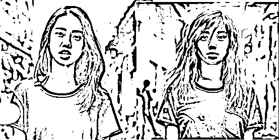</ne-card><ne-card data-card-name="image" data-card-type="inline" id="Kxb8e" data-event-boundary="card">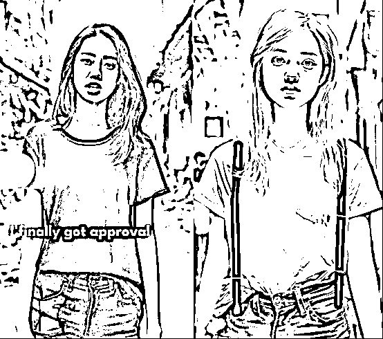</ne-card></ne-p> <ne-p id="u6bebd360" data-lake-id="u6bebd360"><ne-text id="u70b6b686" style="color: rgb(0, 0, 0);">怎么样效果还不错吧？那怎么实现呢，很简单</ne-text></ne-p> <ne-p id="u0c19e89d" data-lake-id="u0c19e89d"><ne-text id="uc17ce473" style="color: rgb(0, 0, 0);">第一步，在平台上传你要模仿的图片，合理可以直接截图别人的作品</ne-text></ne-p> <ne-p id="u74e95c85" data-lake-id="u74e95c85"><ne-card data-card-name="image" data-card-type="inline" id="vMORj" data-event-boundary="card">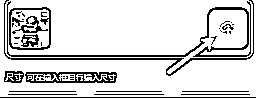  <ne-p id="u341e7324" data-lake-id="u341e7324"><ne-text id="u0812523a" style="color: rgb(0, 0, 0);">第二步，输入关键词以后直接生成</ne-text></ne-p> <ne-p id="u19fa32f5" data-lake-id="u19fa32f5"><ne-card data-card-name="image" data-card-type="inline" id="AmVq1" data-event-boundary="card"></ne-card></ne-p> <ne-p id="uffac22a4" data-lake-id="uffac22a4"><ne-text id="u80eb19e2" style="color: rgb(0, 0, 0);">怎么样简单吧？</ne-text></ne-p> <ne-p id="ueec30f4a" data-lake-id="ueec30f4a"><ne-text id="u417c10b6" style="color: rgb(0, 0, 0);">这个是我目前找到的比较好的替代方案，有更好方案的小伙伴欢迎和我一起交流</ne-text></ne-p> <ne-p id="ua9ab504e" data-lake-id="ua9ab504e"><ne-text id="u5ea1828a" style="color: rgb(0, 0, 0);">接口也是使用的 mj, 命令阔以使用中文，省去了复杂的路径，对国内伙伴比较友好（有可能也是生财圈友开发的）</ne-text></ne-p> <ne-p id="u853093d0" data-lake-id="u853093d0"><ne-text id="u9c355bda" style="color: rgb(0, 0, 0);">说一下他的价格吧，新用户有 10 次作图试用机会，有多个手机号码可以注册多个账号。然后购买网站会员的话，是 68 一个月。</ne-text></ne-p> <ne-p id="u5839fc0f" data-lake-id="u5839fc0f"><ne-text id="u16e05712" style="color: rgb(0, 0, 0);">网站链接是：</ne-text>[<ne-text id="ufb7e2d4a" ne-underline="true">https://2gpt.ai/?shareKey=VU69AOL3</ne-text>](https://2gpt.ai/?shareKey=VU69AOL3)</ne-p> <ne-p id="u63a553c7" data-lake-id="u63a553c7"><ne-text id="ud2c44440" style="color: rgb(0, 0, 0);">如果页面出现没有邀请码无法注册的情况的话，就输入</ne-text><ne-text id="ue6f9ae65" ne-underline="true">VU69AOL3</ne-text></ne-p> <ne-p id="ud359aaef" data-lake-id="ud359aaef"><ne-text id="u5c9bac88" style="color: rgb(0, 0, 0);">同时呢我也找到了一些免费的平台，就是出图效果我不太满意，达不到我想要的要求，所以我没有去用。这里也列出来推荐给大家，可以自己试试看。</ne-text></ne-p> <ne-p id="u7f037950" data-lake-id="u7f037950"><ne-card data-card-name="image" data-card-type="inline" id="FOPrc" data-event-boundary="card">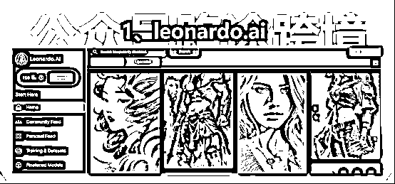</ne-card></ne-p> <ne-p id="u9c770aae" data-lake-id="u9c770aae"><ne-card data-card-name="image" data-card-type="inline" id="FGnel" data-event-boundary="card"></ne-card></ne-p> <ne-p id="u47e662da" data-lake-id="u47e662da"><ne-card data-card-name="image" data-card-type="inline" id="NHioX" data-event-boundary="card"></ne-card></ne-p> <ne-p id="uc6b80ae5" data-lake-id="uc6b80ae5"><ne-text id="u11c339e8" ne-bold="true">三、如何让人物说话呢？</ne-text></ne-p> <ne-p id="u6b030099" data-lake-id="u6b030099"><ne-text id="u117b75ae" style="color: rgb(0, 0, 0);">那么接着说，我们搞定了文案和人物以后就可以让人物讲话就行了</ne-text></ne-p> <ne-p id="u61fd2479" data-lake-id="u61fd2479"><ne-text id="u47130267" style="color: rgb(0, 0, 0);">这里呢，也很简单，我们只需要使用下面这个网站就可以了。</ne-text></ne-p> <ne-p id="u81eafcf1" data-lake-id="u81eafcf1">[<ne-text id="u9d9c7350">网址  ：</ne-text>](https://studio.d-id.com/)[<ne-text id="u745b8774">https://studio.d-id.com/</ne-text>](https://studio.d-id.com)</ne-p> <ne-p id="u8fb538f5" data-lake-id="u8fb538f5"><ne-text id="uff896643" style="color: rgb(0, 0, 0);">第一步，点击上传自己做好的图片，生成新人物</ne-text></ne-p> <ne-p id="ud9582a9b" data-lake-id="ud9582a9b"><ne-card data-card-name="image" data-card-type="inline" id="eW4SQ" data-event-boundary="card">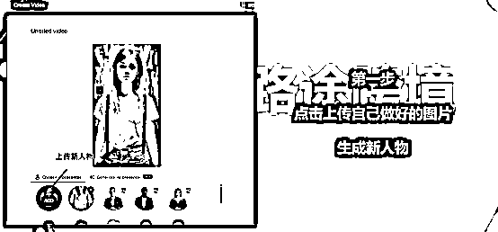</ne-card></ne-p> <ne-p id="u3680331e" data-lake-id="u3680331e"><ne-text id="u568fb574" style="color: rgb(0, 0, 0);">第二步，输入文案，并直接生成作品。</ne-text></ne-p> <ne-p id="u7c57ce90" data-lake-id="u7c57ce90"><ne-card data-card-name="image" data-card-type="inline" id="INgeo" data-event-boundary="card">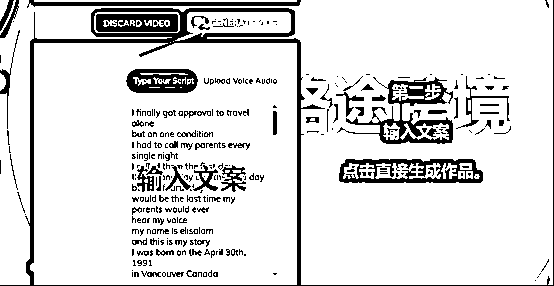</ne-card></ne-p> <ne-p id="uc8c27cad" data-lake-id="uc8c27cad"><ne-text id="u2eca90c6" style="color: rgb(0, 0, 0);">这样就直接得到了一个会说话的人物咯，如下图所示</ne-text></ne-p> <ne-p id="u9d3570ff" data-lake-id="u9d3570ff"><ne-card data-card-name="image" data-card-type="inline" id="BpMiI" data-event-boundary="card"></ne-card></ne-p> <ne-p id="ub4bdfbf6" data-lake-id="ub4bdfbf6"><ne-text id="ub2ca17e8" style="color: rgb(0, 0, 0);">当然，如果你要做一些名人的作品，你也可以选择使用声音克隆。目前网上有很多克隆模型，大部分呢，都是需要训练的。</ne-text></ne-p> <ne-p id="ue9640e1c" data-lake-id="ue9640e1c"><ne-text id="u1ff71812" style="color: rgb(0, 0, 0);">这里呢我也找到一个效果还不错的方案，就是直接上传一段目标对象的录音，之后呢输入要说的话，直接就可以生成了。</ne-text></ne-p> <ne-p id="u341911dc" data-lake-id="u341911dc"><ne-text id="uf1359fe9" style="color: rgb(0, 0, 0);">不过遗憾的是目前只支持英文，不过确实简单，基本傻瓜操作。</ne-text></ne-p> <ne-p id="u62c6ac35" data-lake-id="u62c6ac35"><ne-card data-card-name="image" data-card-type="inline" id="rAONC" data-event-boundary="card"></ne-card></ne-p> <ne-p id="uc08c8213" data-lake-id="uc08c8213"><ne-text id="u1c0e856e">4、 </ne-text><ne-text id="ua9cebcd1" ne-bold="true">那些接下来最后一步，就是剪辑合成了，这里推荐大家使用剪映</ne-text></ne-p> <ne-p id="u24569a7d" data-lake-id="u24569a7d"><ne-text id="u142066e4" style="color: rgb(0, 0, 0);">把素材拖进去，然后选择识别字幕</ne-text></ne-p> <ne-p id="u0e6b8aee" data-lake-id="u0e6b8aee"><ne-card data-card-name="image" data-card-type="inline" id="Pdy6C" data-event-boundary="card">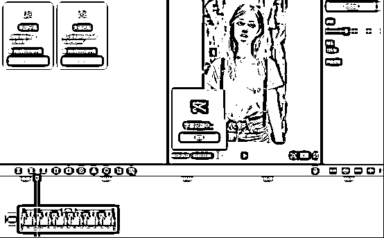</ne-card></ne-p> <ne-p id="u825fe691" data-lake-id="u825fe691"><ne-text id="ufe95e6e2" style="color: rgb(0, 0, 0);">这样我们就配好了字幕</ne-text></ne-p> <ne-p id="u319f095c" data-lake-id="u319f095c"><ne-card data-card-name="image" data-card-type="inline" id="sKOUF" data-event-boundary="card">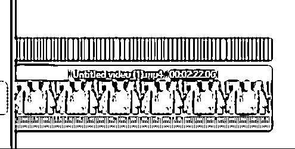</ne-card></ne-p> <ne-p id="ue20f29d8" data-lake-id="ue20f29d8"><ne-text id="uc294d2dd" style="color: rgb(0, 0, 0);">然后在调整一下字幕的字体还有动画，到此大功告成！</ne-text></ne-p> <ne-p id="u3bcb3815" data-lake-id="u3bcb3815"><ne-card data-card-name="image" data-card-type="inline" id="O0QkG" data-event-boundary="card">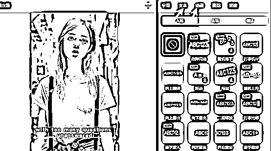</ne-card></ne-p> <ne-p id="u19c2449e" data-lake-id="u19c2449e"><ne-text id="u3525fe82" style="color: rgb(0, 0, 0);">熟悉流程以后，就算是新手，也基本上几分钟就能做一个视频了~ 超级快。</ne-text></ne-p> <ne-p id="u788f78b1" data-lake-id="u788f78b1"><ne-text id="ued2367df" ne-bold="true">一个超级小技巧</ne-text></ne-p> <ne-p id="u53e7c30b" data-lake-id="u53e7c30b"><ne-text id="u9cf779ac">可能有人会问：</ne-text></ne-p> <ne-p id="u60ebfb16" data-lake-id="u60ebfb16"><ne-text id="u45707f61">路途，我是 100%的纯小白，还有没有办法可以更快速的去生产这类视频呢？</ne-text></ne-p> <ne-p id="uba4787c8" data-lake-id="uba4787c8"><ne-text id="u361ea679">好吧，那我就再教大家一个超级小技巧，有手就行！</ne-text></ne-p> <ne-p id="u59768818" data-lake-id="u59768818"><ne-text id="u09224f57">前面大家还记得我们的步骤吗</ne-text></ne-p> <ne-p id="u063d8fea" data-lake-id="u063d8fea"><ne-card data-card-name="image" data-card-type="inline" id="Ne9K2" data-event-boundary="card"></ne-card></ne-p> <ne-p id="u2b2368dc" data-lake-id="u2b2368dc"><ne-text id="udc304caa">其实比较麻烦的是，文案和配音把，文案原创写不出感觉，或者配音配的没有那么好听，或者找不到自己想要的音色。</ne-text></ne-p> <ne-p id="u7c5fe67b" data-lake-id="u7c5fe67b"><ne-text id="u1e1db257">这个时候我们可以取巧一点，怎么做呢？</ne-text></ne-p> <ne-p id="u42a41256" data-lake-id="u42a41256"><ne-text id="u026bcbf7">记得上面制作配音的步骤我们是使用的文案对吧。</ne-text></ne-p> <ne-p id="u20caaaa3" data-lake-id="u20caaaa3"><ne-text id="uac27dbcd">其实我们也可以直接借用别人的声音和文案就行了，上传以后，1 秒完成。我们就会得到一个完美配音和口型的数字人了。</ne-text></ne-p> <ne-p id="ud3fa670c" data-lake-id="ud3fa670c"><ne-card data-card-name="image" data-card-type="inline" id="rp4B4" data-event-boundary="card"></ne-card></ne-p> <ne-p id="uf076244d" data-lake-id="uf076244d"><ne-text id="u4753e22c">所以取巧的话，这个流程可以是</ne-text></ne-p> <ne-p id="uae6cd367" data-lake-id="uae6cd367"><ne-card data-card-name="image" data-card-type="inline" id="R97v2" data-event-boundary="card"></ne-card></ne-p> <ne-p id="u95dece98" data-lake-id="u95dece98"><ne-text id="u8980fa95">基本上做完以后，我们得到的就是一个成品的作品了，再配个字幕就完事儿了~</ne-text></ne-p> <ne-p id="u28442666" data-lake-id="u28442666"><ne-text id="u7e89fd6b">当然如果需要的话我有大几个 G 的数字人的视频素材，需要的话阔以加我 v：tok385 备注：生财</ne-text></ne-p> <ne-p id="u7ea082cb" data-lake-id="u7ea082cb"><ne-text id="u3615c69a">怎么样，学废了吗，有帮助的话记得点个赞哈。</ne-text></ne-p> <ne-hole id="u8d07c412" data-lake-id="u8d07c412"><ne-card data-card-name="hr" data-card-type="block" id="llxAs" data-event-boundary="card"><ne-p id="u62870666" data-lake-id="u62870666"><ne-text id="u619d0b17">评论区：</ne-text></ne-p> <ne-p id="u92c39078" data-lake-id="u92c39078"><ne-text id="ua13e5c99">柏 : Did 限制时间，后面收费，缴费吗？</ne-text> <ne-text id="uc855a39d">A   😇路途 : 有两种方法，前两天郭耀天郭总分享的了一个办法，另外就是域名邮箱批量注册[呲牙]</ne-text> <ne-text id="ue30b7828">书情小跟班 : 已加好友[抱拳]</ne-text> <ne-text id="uac74899b">周宇 : 厉害</ne-text> <ne-text id="uaccde547">A   😇路途 : [愉快]</ne-text> <ne-text id="u919fbfa8">闲米 : 核心在于故事内容</ne-text> <ne-text id="u9aa02976">Lzl : 收益来源就是 tiktok 的中视频激励吗</ne-text> <ne-text id="u21eeab53">A   😇路途 : 嗯嗯，国外目前这个最快，收益也最高</ne-text></ne-p></ne-card></ne-hole></ne-card></ne-p></ne-card></ne-p></ne-card></ne-p></ne-card></ne-p></ne-card></ne-p></ne-card></ne-p></ne-card></ne-p></ne-card></ne-p></ne-card></ne-p></ne-card></ne-p></ne-card></ne-p></ne-card></ne-p></ne-card></ne-p></ne-card></ne-p>