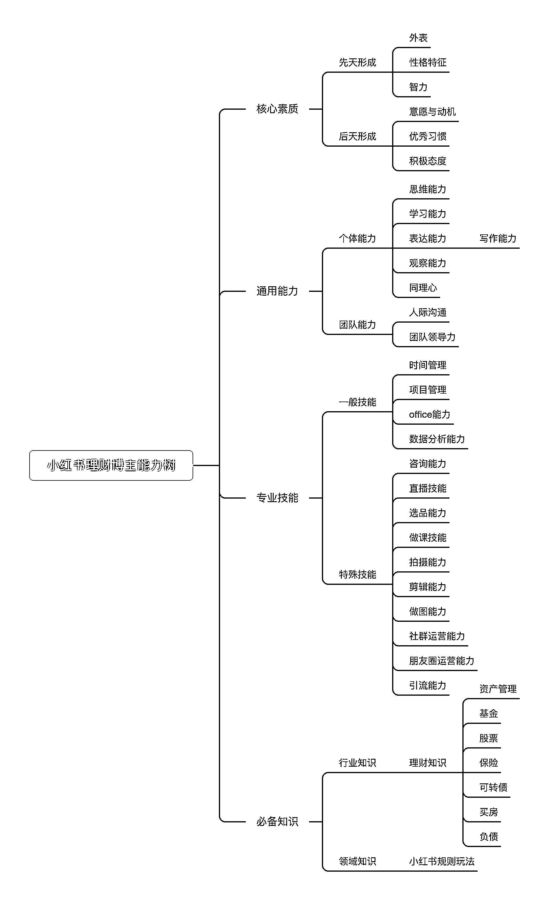
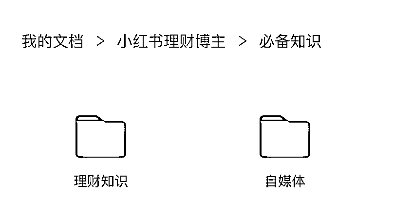

# 让知识为你所用让框架为你工作让体系帮你变现

> 原文：[`www.yuque.com/for_lazy/thfiu8/pm00bsgfu0u0b7mz`](https://www.yuque.com/for_lazy/thfiu8/pm00bsgfu0u0b7mz)

<ne-h2 id="324972b9" data-lake-id="324972b9"><ne-heading-ext><ne-heading-anchor></ne-heading-anchor><ne-heading-fold></ne-heading-fold></ne-heading-ext><ne-heading-content><ne-text id="u0fca3019">(38 赞)让知识为你所用让框架为你工作让体系帮你变现</ne-text></ne-heading-content></ne-h2> <ne-p id="u7eca8833" data-lake-id="u7eca8833"><ne-text id="u387fef2e">作者： 我安了个安安</ne-text></ne-p> <ne-p id="u6e74bafd" data-lake-id="u6e74bafd"><ne-text id="u8338c847">日期：2023-06-29</ne-text></ne-p> <ne-p id="u9d5e9ae4" data-lake-id="u9d5e9ae4"><ne-text id="u83597f49">5 月 30 日《让知识为你所用，让框架为你工作，让体系帮你变现》@我安了个安安</ne-text><ne-text id="u51915908">hello，大家好，我是我安了个安安，大家可以叫我安安，</ne-text><ne-text id="u0defae74">在上一期的航海成功用资料整理技能在社群航海卷上本船第一，全航程第二，实现两条船梦幻联动的女人。</ne-text><ne-text id="u98a50fa3">今天我分享的主题是：让知识为你所用，让框架为你工作，让体系帮你变现</ne-text><ne-text id="u93d41c41">追溯我与知识框架的渊源，应该能到我高中自建全科笔记吧，但这个不重要，毕竟当你步入社会之后，职场学习已经与学生时代大有不同，所以严格来说，我的知识框架打造经历大概是从 2015 年开始的，那时候我做记者，需要整理很多的素材资料，于是开始有了资料整理的需求。</ne-text><ne-text id="ubb6df105">但真正形成我自己的知识打造体系，是从 7 年前开始的。自此之后，知识框架就成了我最好的合作伙伴</ne-text><ne-text id="u6ab4aeb7">知识框架帮助我三年从文案小妹做到运营总监</ne-text><ne-text id="u62425eef">知识框架帮我 8 年跨 8 个行业，无痛迁移</ne-text><ne-text id="ua48b6aba">知识框架帮助我一周打造一门课，在 2018 年就赚到了第一笔知识付费变现的钱</ne-text><ne-text id="u1dea8940">知识框架帮我从 0 基础做到理财自媒体</ne-text><ne-text id="u3d576a32">知识框架帮助我两年打造了 8 门课</ne-text><ne-text id="u8ac891eb">知识框架也帮我从生财小透明到成为教练站在这里给大家做分享</ne-text><ne-text id="u6403dec8">讲到这里，我想问大家一个问题：你觉得搭建知识框架，或者来参加这个资料整理的航海是为了什么？大家可以好好思考一下，我们一会儿还会再聊到</ne-text><ne-text id="ua6d9ebef">就像手册里说的，资料整理可以分为三个阶段：</ne-text><ne-text id="u10e6a6ef">第一阶段：仓鼠式囤货整理，什么都想要，什么资料都囤着，越积越多，在工具和方法间反复横跳</ne-text><ne-text id="u38882eeb">第二阶段：目的性整理，有选择的专项学习和积累</ne-text><ne-text id="u99a8d1f6">第三阶段：整体性整理，体系化整理，分领域有系统的整理，打造底层认知逻辑</ne-text><ne-text id="ud36ee823">一、资料整理和知识框架的关系</ne-text><ne-text id="u2e2526f5">我相信大家应该看过很多关于资料整理或者打造知识库的教程，大部分的教程会一步到位地教你打造大而全的框架，这是资料整理的最终形态，就是打造你的底层认知体系，比较像手册中提到的第三个阶段，但是对于刚开始准备搭建框架的同学而言，往往越全面的框架，我们越难开始，也越难坚持，原因有两个：</ne-text><ne-text id="u8976fc0d">1.在我们认知还不足够的时候，想要搭建大而全的适合自己的框架是很难的，往往就被这个难度劝退了</ne-text><ne-text id="u1dd79cc2">2.在大而全的框架里，一定有很多看起来“无用”的内容，很多时候你会觉得，这些内容在当下与你无关，驱动力就没那么强</ne-text><ne-text id="ub8857505">那么，我们该如何避免这个问题呢？这就回到我们一开始提出的那个问题：打造知识框架的目的是什么？</ne-text><ne-text id="u06163be8">二、打造知识框架的目的</ne-text><ne-text id="ue1aad853">我的答案是为了让我学到及看过的知识最大程度的为我所用</ne-text><ne-text id="u6b2d3bd0">要做到这点，就是要功利性学习，从工作/项目的实际需要出发，学习后立马应用。最快学习一个知识的方式就是你马上需要用到它，任何的知识，你学了并不一定就是你的，只有你学了并且用上了，用完还复盘改进迭代了，才能变成你的知识，你的能力。</ne-text><ne-text id="u2d5b5618">也就是利用功利性学习的逻辑来搭建你自己的知识体系，是的，是“你自己的知识体系”。而这个知识体系框架中的所有知识一定都指向同一个应用目标，也就是你定的主线。</ne-text><ne-text id="u52a299bf">我非常不建议直接复制别人的体系模式，因为每个人都有自己的逻辑，当下面临的情况也不同，那么你需要的体系也不同，所以别人的模式，你可以参考借鉴，但一定不能直接套用。</ne-text><ne-text id="ud6cb714e">不要一开始就追求大而全的框架，要不光整理框架就足够让你焦虑了，既然我们做框架或资料整理是为了更好地用它，那么就以自己方便</ne-text><ne-text id="u6e78a1fa">取为宗旨，</ne-text><ne-text id="u41aadc3e">去打造第一个大框架，然后不断去迭代</ne-text><ne-text id="u2be161d6">三、构建知识体系</ne-text><ne-text id="u1049f2a7">构建知识体系，就是勾勒出需要实现目标对应的知识版块</ne-text><ne-text id="ub4a6baea">具体如何实施呢？</ne-text><ne-text id="ua8ef52d0">3.1 通过功利性学习找到你的知识系统主线</ne-text><ne-text id="u3247d10c">这一步就是定目标，以工作为例，不是说当前的岗位你应该会什么，基本上你会在这个岗位，你的能力基本就八九不离十了，所以我们要确定的是下一级的目标，也就是写下你想要拿下的是哪个职位，然后按照能胜任这个职位的情况去搭建能力树，只有为了这个应用目标构建出的职业能力树，才能真的帮助你升职。</ne-text><ne-text id="u397631d8">同样的，想做副业也一样，</ne-text><ne-text id="u1ceaa5a0">比如</ne-text><ne-text id="uaa7de767">你现在想成为一个小红书博主，那你就可以以这个主线为你的应用目标来搭建你的能力树。</ne-text><ne-text id="u2a098b7d">3</ne-text><ne-text id="u2798ce3e">.2 根据主线打造你的能力树</ne-text><ne-card data-card-name="image" data-card-type="inline" id="wzwOe" data-event-boundary="card"><ne-text id="u126fe075">这样做的好处：</ne-text><ne-text id="u8ccde9bd">沉淀已有的方法论，落到纸面上，让经验显化</ne-text><ne-text id="udf7a3d0c">明确自己当前的不足，找到改进的发力点</ne-text><ne-text id="ud630dcfc">3</ne-text><ne-text id="ub53af033">.2.1 打造框架</ne-text><ne-text id="u29149415">有的人可能没有办法直接从这个框架角度去完善，那就可以考虑先做流程化的梳理，再将流程中的各个部分嵌套进框架之中。</ne-text><ne-text id="ufc3b968a">我最开始做自媒体的时候也是先做流程梳理，再将每个部分从中拆分出来搭建成框架的</ne-text><ne-text id="u52e72ab2">如果是岗位的能力树的话，还可以去求职网站找相对应的岗位要求来提示自己，可以多找几个同岗位的，然后整合起来，就成了一个大概的能力树。</ne-text><ne-text id="u660c903b">还是以小红书博主这个能力树为例</ne-text><ne-text id="u2b6dab75">要做一个博主，首先要学会定位你做什么垂类的博主，这个垂类的知识有哪些，这就属于行业知识的部分</ne-text><ne-text id="u70736cd6">然后要定自己如何变现，每个变现方式下需要什么能力，就属于专业技能这部分的，比如要知识变现就要学会做课，要直播带货还要学会直播，控场，带货能力，讲解能力之类的</ne-text><ne-text id="ud1b13c16">还要产出笔记，选题，就需要了解用户心理，文案技巧，做封面就需要做图能力，审美能力，拍视频也要学习构图，剪辑之类的</ne-text><ne-text id="u3891f913">比如接广告的话，还要跟甲方沟通，就需要你的沟通能力</ne-text><ne-text id="u38c34d8e">想要做粉丝群或者私域的话，还要学会引流逻辑，私域运营、朋友圈运营，社群运营等等</ne-text><ne-text id="u5ebde8fa">比如做内容发布，得学会时间管理，排期，内容准备，拍摄，剪辑，发布，每一个步骤都有对应需要的知识和技能。</ne-text><ne-text id="u4107e032">就这样再往下去细分，把流程梳理完了，基本上能力树也出来了，不用求完美，只要有一个雏形即可，我们还会在实际应用过程中不断去优化他</ne-text><ne-text id="u983c4e61">你就可以形成下面这个框架</ne-text><ne-card data-card-name="image" data-card-type="inline" id="IptSd" data-event-boundary="card"><ne-text id="u1a67939c">在框架之下，主题系统性学习，有意识的碎片化信息萃取，寻找积木，填充进去逐步完善能力树</ne-text><ne-text id="u321c5ac1">3</ne-text><ne-text id="u869017a8">.2.2 打造文件系统</ne-text><ne-text id="u79969fe1">打造出来框架以后，就可以按框架去打造一个文件系统。</ne-text><ne-text id="u727aefcf">我是直接在幕布里做的，我基本整个体系都是在幕布中完成的，大概的形式就是这样，但是有些工具型的东西需要用外链形式来呈现，这是它的弊端。</ne-text><ne-card data-card-name="image" data-card-type="inline" id="OO9ft" data-event-boundary="card"><ne-card data-card-name="image" data-card-type="inline" id="Odm1r" data-event-boundary="card"><ne-card data-card-name="image" data-card-type="inline" id="o6w1U" data-event-boundary="card"><ne-text id="ub9a09e89">这里就涉及到选择资料收集工具如何选择，这个我没有特别的推荐的东西，只要符合：你用起来舒服方便，可以多平台同步，方便搜索提取，这几点就够了。</ne-text><ne-text id="uc69a769a">我之前用过挺多的，有道云，印象笔记，marginnote，OneNote，语雀，flomo 之类的，用下来还是觉得幕布最符合我自己的习惯和逻辑，目前为止用了 7 年左右，所以大家选择自己用起来最舒服最顺的工具就好。</ne-text><ne-text id="u213db753">3</ne-text><ne-text id="u5dfdb3d4">.2.3 主题性学习</ne-text><ne-text id="ud3a5ce87">确定学习 list，比如相关领域权威书籍或课程等</ne-text><ne-text id="u0937e517">找权威领域的基本书籍，这些你可以去知乎，豆瓣之类的地方找行业书单，多次再版，重叠推荐的基本上就是好书，列出书单，同样相关领域的高手也可以用这个方法去找。</ne-text><ne-text id="u140ec616">在主题式学习过程中，遇到问题的时候，就需要用到搜商，如何精准搜索也是一门学问。我记得高手分享里是有这部分的内容的，可以去看看。</ne-text><ne-text id="u3903b075">要想发挥主题性学习的最大功效，不能像之前那样做大而全的读书笔记，不要追求完美，资料整理的目的是为了使用，让资料为我们所用，你要做的是摄取里面的增量信息，切碎书籍，打散，用你方便的使用的方式重组，分配，存档，方便随时提取。</ne-text><ne-text id="u1fe5f715">具体的学习步骤（这个方式</ne-text><ne-text id="u993190ca">比较适合</ne-text><ne-text id="ud1d05161">你有比较大块的时间去做学习的时候用）</ne-text><ne-text id="ud05c88a6">1、</ne-text><ne-text id="u051f534a">打散：切碎你看到的文章，书籍之类的</ne-text><ne-text id="ud53e50b4">2、</ne-text><ne-text id="u29f09bca">增量：筛选对你有价值的增量知识</ne-text><ne-text id="u61a24f3f">3、</ne-text><ne-text id="u36693d05">记录：思考这个知识属于哪个部分，存到相对应的位置，记录下出处</ne-text><ne-text id="u8597ab02">4、</ne-text><ne-text id="u6930cdf6">划重点：给重点内容标粗，如果有自己的感受想法也可以写下来</ne-text><ne-text id="uf51df21e">5、</ne-text><ne-text id="ue4220cfd">延伸：有些知识如果你能当下想到什么例子或者使用场景，也建议写下来</ne-text><ne-text id="u734269aa">，这对后续你的输出很有帮助</ne-text><ne-text id="u6c26213c">6、</ne-text><ne-text id="uf627d08a">形成框架：这样长久积累下来，你的逻辑框架就逐步形成了</ne-text><ne-text id="u87def15f">7、</ne-text><ne-text id="u2ab70ca5">删减整理：然后定期去整理，同类信息合并，留下最优的部分</ne-text><ne-text id="u3700f961">8、</ne-text><ne-text id="u080e1a10">输出：尝试主题性输出，并且发布出来</ne-text><ne-text id="ua56375ba">，我比较喜欢用视觉笔记和手帐之类的方法去呈现，发朋友圈或者小红书</ne-text><ne-text id="u8fcff815">3</ne-text><ne-text id="u8169ecdc">.2.4 沉淀工作方法论或 sop（工具）</ne-text><ne-text id="uc8944644">可以把资料做成工具，</ne-text><ne-text id="u59285716">这是最容易让你出圈的方式，别问我怎么知道</ne-text><ne-text id="u0b5add90">比如说航海，航海手册其实是一个很好的系统资料，你可以尝试先从一个你感兴趣的航海手册开始，把它整理成一个工具，整理到你的资料库中，或者输出到生财，也可以尝试让他成为你其他产品的加成，比如你做自媒体，就可以成为你的钩子，你做社群，就可以成为你的社群附加工具</ne-text><ne-text id="u55583e46">如果没有现成的手册资料，可以尝试自己去整理沉淀</ne-text><ne-text id="u5b704302">步骤 1：按时间逻辑顺序梳理流程</ne-text><ne-text id="uc7b39da2">步骤 2：用二维表格梳理细化流程</ne-text><ne-text id="ucc301f3f">步骤 3：在流程中需要有各个标准化的文档去辅助，比如文档，标准</ne-text><ne-text id="u8797e3e8">，话术</ne-text><ne-text id="u5f61dad6">等</ne-text><ne-text id="u8c034258">步骤 4：使用这个流程工具，在使用过程中去迭代优化</ne-text><ne-text id="u0486968a">我不建议盲目去积累，没有目的性</ne-text><ne-text id="u589f7bbb">的收集资料</ne-text><ne-text id="u51dce989">，你的知识框架一定是会基于你个人成长不断变化的，让知识系统为你服务，而不是让自己为了打造它累死累活，那就本末倒置了</ne-text><ne-text id="u72bcc7cf">以上就是我给大家带来的分享内容，最后再给大家分享几本书：《学习力》、《思维力》、《个体赋能》，希望和大家一起在资料整理上进步。</ne-text>  <ne-hole id="u6f0efdfb" data-lake-id="u6f0efdfb"><ne-card data-card-name="hr" data-card-type="block" id="uC5Z7" data-event-boundary="card"><ne-p id="ud70db184" data-lake-id="ud70db184"><ne-text id="ubbe77d01">评论区：</ne-text></ne-p> <ne-p id="u02474ca7" data-lake-id="u02474ca7"><ne-text id="uce2b3f6b">芷蓝 : 打到这是体系从我的过往经验有 3 个坑不能踩。</ne-text></ne-p> <ne-p id="ud4281392" data-lake-id="ud4281392"><ne-text id="uf2811fbe">1、不要让自己被工具驾驭，当学习使用工具的成本大于用工具完成目的的成本时，就要果断放弃。</ne-text></ne-p> <ne-p id="u9d553657" data-lake-id="u9d553657"><ne-text id="u9ff10bd5">2、不要为了自洽而去做知识管理，否则那个就叫做文件整理。</ne-text></ne-p> <ne-p id="u87cd89c6" data-lake-id="u87cd89c6"><ne-text id="u7abf3737">3、最好能把你的这是底层模型，做成一个产品，这样就可以去进行传播，当越来越多的人知道了你的知识管理模型，你的模型就可以根据更多的数据进行迭代。</ne-text> <ne-text id="uaf7265f0">我安了个安安 : 是的，但是最开始的新手比较难打造底层模型，要做一小段的积累后开始，先闭环再迭代</ne-text></ne-p></ne-card></ne-hole></ne-card></ne-card></ne-card></ne-card></ne-card></ne-p>