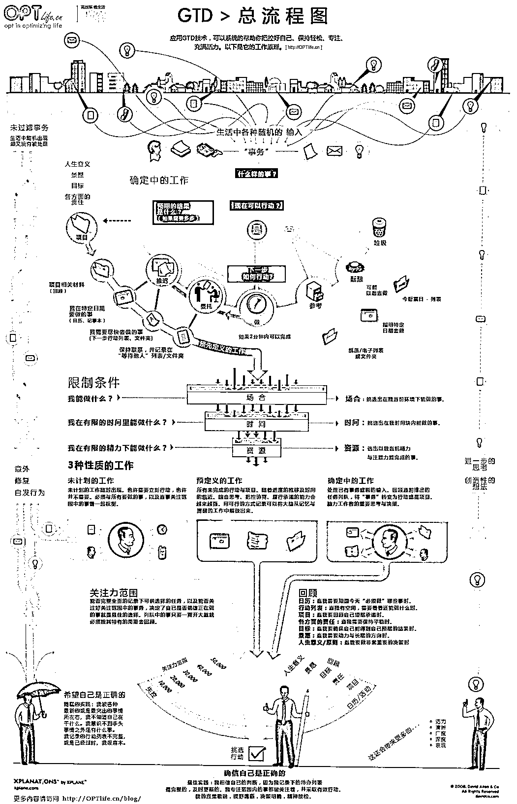
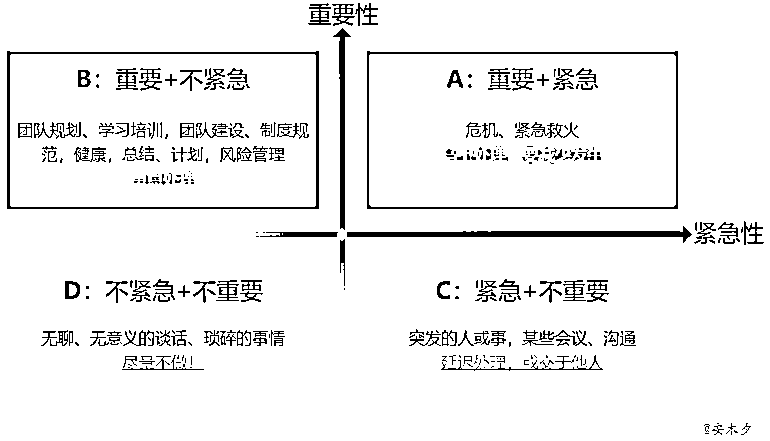

# 给时间管理新手的极简入门“ 行动管理 ”指南

> 原文：[`www.yuque.com/for_lazy/thfiu8/rx4iogsrr9yt7o72`](https://www.yuque.com/for_lazy/thfiu8/rx4iogsrr9yt7o72)

## (41 赞)给时间管理新手的极简入门“ 行动管理 ”指南 

作者： 饭先生 

日期：2023-06-29 

5 月 30 日《给新手入门的极简“ 行动管理 ”指南》@饭先生大家好我是阿饭，4 年生财有术老圈友，资深潜水党，现在浮出水面希望可以给圈友们提供一些价值。我在 17 年还上学的时候接触个人成长领域，开始学习并践行时间管理与目标管理等理论；工作之后基本工作日都会进行每日记录，周复盘也持续了三年以上；使用的工具从有道云笔记到印象笔记再到 notion 和 Obsidian也体验过各类时间管理方法和工具，曾经因为在产品社区写了多篇泛时间管理类产品的分析被邀请参与“时间管理应用”的创业项目，作为知识付费老韭菜，近几年也担任过一些个人 OKR、时间管理等课程的助教工作，帮助大家设计自己的自我管理策略。目前，经过了多年的理论学习和自己的实践。我打造了一套自己的知识+行动管理方法论和对应的模板，目前运行的还算顺利。帮助我在长期远程办公，外加参与多个项目的游民生活中，保持了持续的生产力和效能感。当然，我的流程也并不适合所有人，我觉得没有适用所有人的时间管理方法。所以今天的主题是分享常见的时间管理的方法，但更多的还是分享个人管理的思路，帮助大家来自己设计适合的方法。一、心态和思维的转变1.1 明确目标，我们管理时间是为了“成事”我们小航海的主题是“时间管理”。但对我而言，比起管理时间，目标和行动管理更加有效，经过我反复实践（caikeng）多年的经验，我阶段性的认为「目标重于时间管理方法论」时间是流动的，是一个客体，我们很难对它进行约束，只能进行觉察。我们只能对自己可以“掌控”的东西进行管理。对于自由职业者或者以「成果为导向」的职场人来说，时间管理可以被简化成，想清楚自己要啥（定目标）+拆解到能做 + 给相应的任务安排时间去干。如果我们以时间为指标去划分关键里程碑，在特定时间点未能实现目标，会感到失败或没有进步。但如果以我们想要实现的目标为基础，将目标分解，然后根据任务来安排时间资源，可能心态会好很多。仔细想一下，我们学习时间管理的原因是什么？无非是希望好钢花在刀刃上，有足够的时间完成自己想做的事情。对大多数人而言，每天能够实现既定的目标。那么剩下的时间爱干嘛就干嘛，享受生活就好了。这仅为我个人的实践经验，大家可以选择自己更喜欢的管理方式，核心是找到适合自己成长的方式。这就涉及到下面一条思维的转变1.2 以自我为主体市场上有各种时间管理、目标管理的流派和方法论。但是一个方法好不好用，需要“自己”来确认。很多人可能在小航海之前就已经使用过一些时间管理的方法，但在具体运行的过程中，总会出现各种各样的 bug。这种时候还会怀疑自己。觉得自己自控力、意志力不行，然后就放弃了。过段时间卷土重来，或者转而去寻找其他的方法，就这样循环往复。但其实每个人的特点不一样，所处的外部环境也不一样。没有适合所有人的时间管理、目标管理方法。例如我的情况跟大多数人可能并不太一样。我目前是远程办公，除了主业之外，也是一个资深斜杠青年，在并行推进很多的项目，这些项目可能都处在不同的阶段。所以我的时间相对自主可控，同时并行的事情又比较多。那跟我生活状态不一致的人照搬我的方法可能就会出问题。所以，时间管理应该是以自己为主体，具体情况具体分析。这个时候应该有“甲方思维”，一个方法、一种技巧不适用，那就是方案跟我们的问题不匹配。对于进行时间管理的新人，更需要的是先尝试起来，在这个过程中掌握原理，根据自己的实际情况进行方案调整和修改。1.3 时间管理是个无限游戏，培养自己的系统思维时间管理是结果导向的，我们会关注自己每天时间的使用效率。但我也提倡大家关注过程，思考如何持续优化自己的生活而不仅仅是目标的达成。这是一种思维的转变，我们学习时间管理，因为我们想过上更好的生活。时间管理是手段而非目的。因此循序渐进的搭建一个系统并逐渐优化，比追寻一个目标的实现更容易持续。这有点像是有限游戏和无限游戏的区分。有限的游戏，其目的在于赢得胜利；无限的游戏，却旨在让游戏永远进行下去。万维钢老师有句话我很喜欢：“凡夫畏果，菩萨畏因，佛畏系统”。如果我们有个系统，那么每个目标不过是一个个例、一个数字而已。我们要担心的不是这个目标是否可以实现，而是自己的系统运行是否运转正常。比如说如果目标是在体育比赛中得第一名，那么系统就是优化自己的身体状态，训练方法，竞技能力，而达成目标只不过是系统改善后的必然结果。如果以这样的心态工作生活，就不会在完成之前痛苦，完成后空虚。因为系统的改进没有终点。就算拿到冠军，你的身体素质，心态以及训练方法都有改善空间。回到我们的生财小航海，每个人会给自己定下不同的目标。例如完成**次打卡，成功变现**元。但这个目标完成之后就是终点吗？大家参加小航海，或许是期待最低成本的进行行动，去落地实战项目。那更好的状态或许是日有所进，将今天学到的有用的方法应用起来，去应对更多的挑战，在出现问题的时候再持续调整。比起我们离目标差距的数值，实现这个目标有哪些过程，过程的各个步骤及其所用时间，过程的衡量标准，每个环节的优化空间……这些都是“无限游戏”，可以让我们持续玩下去大家也可以更加关注目标完成的前置条件，并不断思考改变一个条件之后会带来什么连锁反应。当你处在一个不断优化自己系统的状态时，结果的达成会是自然而然的。二、时间管理领域的几大流派说完比较虚的心态和思维，下面我分享更具体实操的内容，来看看时间管理的几个流派，以及他们的应用场景。2.1 GTD（Getting Things Done）GTD（Getting Things Done）：旨在帮助人们更好地组织和管理他们的任务清单。GTD 包括五个步骤：收集，处理，组织，回顾和执行。这个方法强调要将任务逐一地收集起来，避免任何事项被遗漏。然后，将它们分类和组织，以便更容易地处理和执行。这种方法可以说是时间管理最经典的方法，也是下面我要分享的我自己的行动系统的基石。比较适用于事情比较多，注意力不够用的人群。如果你经常感到被淹没在各种事情当中，那么用这方法，先记录再行动就会比较有效。2.2 艾森豪威尔矩阵艾森豪威尔矩阵（紧急-重要四象限）：这个方法基于一个四象限矩阵，用于区分任务的重要性和紧急程度。将任务分为四个象限：紧急且重要，紧急但不重要，重要但不紧急和不重要也不紧急。这可以帮助人们更好地了解他们的任务和优先级，并且确保优先完成最重要的任务。这一工具其实更适合用于管理者，或者跟很多人协作互动的过程中。其核心理念是，做重要的事情而非紧急的事情。不要把一些事情拖到成为紧急的事情。不重要的事情要么放弃，要么授权给别人做。2.3 二八法则二八法则：也被称为帕累托法则，这个方法认为，80%的结果来自于 20%的投入。大部分成果来自于少数重要的任务。因此，这个方法鼓励人们集中精力在最重要的任务上，并忽略那些不重要或没有太大价值的任务。这个问题的核心在于分析，找到什么是那 20%的事情？难点就在于需要对自己的日常进行仔细思考，找到那些导致一些现象经常出现的根本问题。例如跟上面的四象限法则结合，思考自己为会啥让重要的事情拖到最后，让其变得紧急2.4 吃青蛙吃青蛙：强调人们应该首先完成最难的任务。如果你首先完成最重要和最困难的任务，那么你就能够更轻松地完成其他任务，并避免拖延。这个方法的重点在于行动，比较适用于“思想家”只想不做这种情况。可以说，目前所有的时间管理的方法都脱胎于这几种方法。结合这几种方法的原理，其实就可以设计自己的行动方案了。下面，我就来介绍一下我常用的目标管理流程。三、极简化的行动流程我的整体框架来源于 GTD：总共分为几个步骤：收集-分类-排序-行动-复盘。Step 1：清空大脑，将待思考、待行动的全部都列出来很多人可能听过一个概念“第二大脑”。本质上是善于利用工具，时刻进行认知卸载，让大脑做更擅长的事情。初期可以直接用白纸或者手机便签，打造一个放置盒/收集箱，将头脑里引起你关注的所有事情，全部从工作记忆中转移到外部，从抽空思考事业规划，到周末跟朋友聚会吃啥……统一到收集箱，让脑子保持清爽。Step 2：分类，清空收集箱对收集箱进行处理，可以选择一个固定的时间，例如每天晚上或者早上，对收集箱的各种想法进行评估和处理。将记录下来的事情转移到适合的位置，清空收集箱，开始下一步行动。在分类时，可以参考 GTD 的原理。能在几分钟内完成的就立即行动，剩下的可以具体评估之后划入不同的领域。例如下面这个是我的操作系统，会将收集箱的 idea 更具象化之后划分到不同的位置：我分的类型比较多。大家其实可以简单按照是否需要现在行动，以及行动所需步骤来处理和分类。简单划分为任务、项目、目标和资料等。任务：一系列有组织的行动的集合，一般会有一个明确的产出物，可以在一天或者几天之内完成。例如做一个 PPT，用 ChatGPT 写一篇文章，完成今天的小航海打卡等项目：一系列任务的集合。支持目标的实现，满足 SMART（具体、可衡量、可达成、现实、有截止期限）要求。例如我会将完成小航海作为一个项目。目标：心中长期期望实现的想法，要成为什么样的人等比较宏观的概念。一般需要较长周期，多个项目来支持目标的达成。资料：无需采取行动的信息，可归入参考资料。Step 3：排序排序，筛选出重要的事情，这个要从外部环境和自身出来设计。可以结合前文我们提到的几种理念来设计。例如-紧急且重要-老板让你马上交给他的-吃青蛙，挑选剩下的任务中最难受，最困难的事情-解决很多问题重复出现的根本问题-在一个协作链条的前置环节，后面的步骤在等待你这个排序的原则没有对错之分，完全以自己为主体进行规划。但尽可能跟自己的长期目标和价值观对齐。Step 4：行动我认为思考和行动应该适当的分开。前面的思考步骤必须做的充分，这样才能使你确信穷尽了所有可能。经过前面的环节，把现在要做什么想清楚了。这个时候就不要纠结、不要内耗了，直接去做。在做事的过程时刻以产出为导向。过程中不断积累各种具体的认知，争取让执行的流程越来越顺利。Step 5:复盘迭代我习惯每天晚上或者早上的时候重复上面的环节。清空大脑清空收集箱更新任务、更进项目进展确定优先事项同时也会在每周或者每个月，以及一个项目结束后复盘，主要是为了让自己做过的事情价值最大化。这里也提供几个我在做复盘的时候常用的问题。脱胎于 KPT 复盘法，比较适合在一个项目结束，或者每天的工作结束之后用于自我提问进行思考。KPT 复盘法是K（Keep）：今天有那些做的好的地方，夸夸自己，可以继续保持。如果能抽象成一个经验或者流程就总结下来。P（Problem）：在今天的工作中，遇到了哪些问题？T（Test）：有什么想法可以在下次任务/明天工作当中进行测试，尝试改进？复盘一方面看细节。做事的过程中有什么经验和积累，沉淀下来。甚至总结成 SOP，让自己做熟悉的事情时可以既快又好。另外也能在协作中帮助到其他人。一方面也要看整体流程，还记得前面我们说的系统思维吗。复盘也是优化系统的过程。经过实干有了更多一手经验之后，每个环节都可以逐渐替换成对自己更舒服更有效的。以上就是我今天要分享的内容，听完这个分享之后，我也希望大家思考一下， 你马上可以去做的第一步行动是什么，以及现在自己的行为系统里面有什么可以马上去调整的部分。如果大家也有好的复盘模板，也欢迎提出来一起交流哇  

评论区： 

暂无评论