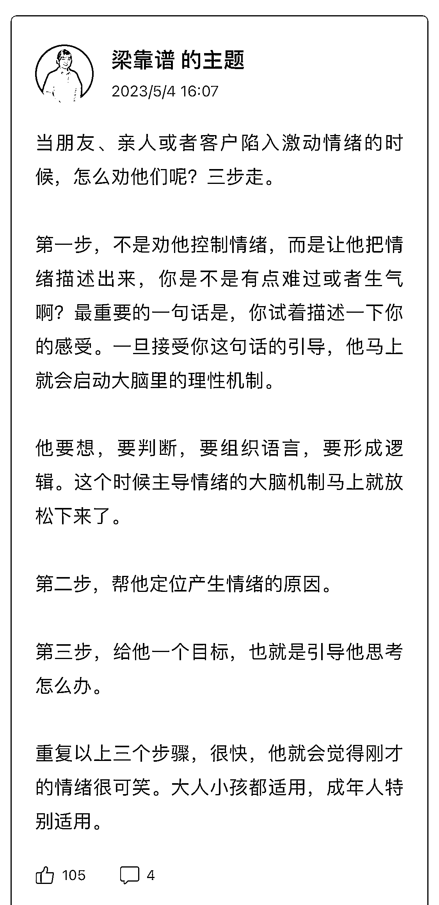

# 如何运用影响力提升商业价值并营造更好的个人发展环境

> 原文：[`www.yuque.com/for_lazy/thfiu8/wv0ze1hgssnwdxl3`](https://www.yuque.com/for_lazy/thfiu8/wv0ze1hgssnwdxl3)

<ne-h2 id="362318df" data-lake-id="362318df"><ne-heading-ext><ne-heading-anchor></ne-heading-anchor><ne-heading-fold></ne-heading-fold></ne-heading-ext><ne-heading-content><ne-text id="ub8b5b4ab">(精华帖)(182 赞)如何运用影响力提升商业价值并营造更好的个人发展环境</ne-text></ne-heading-content></ne-h2> <ne-p id="uee9d8e5f" data-lake-id="uee9d8e5f"><ne-text id="u06980ec1">作者： 梁靠谱</ne-text></ne-p> <ne-p id="u6c108ee0" data-lake-id="u6c108ee0"><ne-text id="u0640d74a">日期：2023-06-26</ne-text></ne-p> <ne-p id="u866c4d2e" data-lake-id="u866c4d2e"><ne-text id="u6867bf39">5 月 31 日</ne-text><ne-text id="ub58dd77e">《如何运用影响力提升商业价值，并营造更好的个人发展环境》</ne-text><ne-text id="u96c7d342">@梁靠谱</ne-text><ne-text id="u1ed1a8f4">各位海上最耀眼的大老板们晚上好！你们比灯塔都亮，比比星星闪光，如果用红外照一下咱们盖洛普的船，一定红彤彤一片，这十天来看着大家的察觉和进步，真是好感动啊！</ne-text><ne-text id="u7541e48d">我是梁靠谱，一个平平无奇的</ne-text><ne-text id="u7b150d2a">销冠。今年 418，我们醒谱白战队是榜单第一名，也创造了生财拉新史上的最高业绩。同时，我本人每年也帮品牌方、资本家、各类课程和产品的主理人，规划内容方向和发售事件，帮他们达成业绩，赚点嘴和手的辛苦钱。</ne-text><ne-text id="u22cbf14d">不知道在座各位有多少是看完我关于</ne-text><ne-text id="ua8f0e9e1">《</ne-text><ne-text id="ub3e174e3">一个</ne-text><ne-text id="u6d6bf03d">工具和</ne-text><ne-text id="ud3bfede5">两个</ne-text><ne-text id="u04a8687f">贵人》</ne-text><ne-text id="u5206b0aa">帖子来报名的</ne-text><ne-text id="u3d6776a8">：</ne-text><ne-text id="ua6c47a80">https://t.zsxq.com/0et0FvM3a</ne-text> <ne-text id="uf68c5521">这里链接直达，已经近千赞了。</ne-text><ne-text id="u36c29d8d">记得发帖前，咱们个人优势航海的人数是一千出头，发完后一天就是一千九百多人了。这个就是影响力才干的特点，看热闹嫌事儿不大，风浪越大鱼越贵，人越多越兴奋。来，我先自报家门。</ne-text><ne-text id="u274fc171">在今天分享之前，我想先问大家一个问题---假设你是一个武士，现在要去斩杀恶龙，救出共处，或者你是一个将军，要上阵杀敌，你是要在自己的兵器库里抽出一把来干翻这个世界呢？还是要去村东头的李铁匠那里现打一把趁手的武器？还是去你朋友家借一把？</ne-text><ne-text id="uf41d58da">等你弄完和借完，王朝都要更替了吧，再说不是自己常用的武器，人机磨合是不是也有问题呢？</ne-text><ne-text id="ud5d27e62">OK，靠谱想说的是，这里的“武器”，就是你的</ne-text><ne-text id="udfd82e5e">盖洛普才干</ne-text><ne-text id="ufe810f5b">。</ne-text><ne-text id="ueeff34dc">之前看到小伙伴拿到报告的第一反应，并不是“哇塞，我的战略思维这么多，有很多的点子可以给我的朋友和家人”，也不是“我的关系建立好靠前啊，怪不得我跟这么多朋友都这么好”，而是“我的执行好靠后”或者“我一点影响力都没有”。</ne-text><ne-text id="u1fe4e892">所以呢？你关注自己没有的东西干嘛嘞？一点好处都没有啊。优势这个事情，它是三分天注定，七分靠打拼，剩下九十分，利用靠前的才干，好好应用，好好做事。</ne-text><ne-text id="u227e6477">每个人的报告前十名，都是满的，都有 20 个字，对不对？</ne-text><ne-text id="udbcd33cb">好好运用优势的前提，一定是察觉和自我认同。天生我材必有用，说的就是千人千面的盖洛普。它是一个工具，工具一定是为人服务，让我们更好地做事和更幸福地生活，而不是为了让我们产生焦虑的。</ne-text><ne-text id="ubc17794d">大家都知道，靠谱本人是医生，从医十几年了。医学上的诊断学和内外妇儿，学科的交叉有一个特点，就是个体差异化，即，同样的疾病有时会表现出不同的临床症状，不同的疾病呢，有时候也会表现出相同的症状。</ne-text><ne-text id="u12159509">比如同样是肺炎，有的人咳嗽，有的人胸痛，有的人咯血，还有的人发热。那表现为发热的患者呢，有的人是肺炎，有的人是阑尾炎，有的人是脑炎，还有的人是风湿系统疾病。所以根本目的，就是诊断/鉴别，最终治病，它是一个方法论，以结果为导向。</ne-text><ne-text id="ud77e69f8">类比到人类身上呢，我们看到生财很多 KOL，他们都赚到钱了，但他们赚钱的方式、策略和项目完全不同有的人擅长直播，享受舞台，频频出现，用声音和形象来跟大家传递自己的价值，这是影响力，但有的人呢，是幕后英雄，写文章娓娓道来，思路清晰，但朋友圈从不发自己的照片，搞不好还有点社恐，这是战略思维，有的人呢，可以肝项目三个月不出门，这是执行力，而有的人自己没做共域，但一大堆人帮她不遗余力宣传（比如不愿透露姓名的醒姓教练），把她的影响力深埋于大关系建立之中。</ne-text><ne-text id="u17dbc54c">比如靠谱本人，可以直播、运营社群，愿意大量跟人沟通，但如果你让我从事剪辑、电商运营等工作，制作表格，分析数据，那我就死给你看了，为啥？因为我的分析、搜集、思维、理念等等，任何跟数据相关的才干都靠后。你会发现，我们是完全不同的人，但是都能赚到钱，都能跑闭环，都能提供价值，都能解决问题，又能求同存异，成为很好的朋友。</ne-text><ne-text id="ub66d96a8">所以你看，生财今年三月的见面会，有一句金句叫做，没有赚不到钱的项目，只有赚不到钱的人，那靠谱在这里再加上一句，</ne-text><ne-text id="u38b20cc4">没有赚不到钱的才干，只有没发挥和驾驭好才干的个体，以及没有匹配适度的项目和主理人之间的关系。</ne-text><ne-text id="u93921b8c">是鱼就别想爬树，是猴子也别想游泳。那如果你问，我就是鱼，我也想要树上的香蕉，我要如何做到呢？</ne-text><ne-text id="uf056c8c2">很简单，跟别人合作。</ne-text><ne-text id="u5d47dee9">咱们生财有很多个活动和环节，都是促成这件事情的，比如航海家俱乐部的项目孵化，比如最近生财铁杆局的流量合作，比如星球资源对接板块，你想拿你有的，换你想要的，在这个平台，机会一定是比其它场合大得多的。</ne-text><ne-text id="u8687cacd">另外呢，可以花钱买别人的时间，协同别人的时间。</ne-text><ne-text id="uae82ad1f">比如很圈友都在好奇，为什么生财有那么多大佬，赚很多钱，家庭也幸福，甚至于他们还有时间健身和身材管理，对吧？</ne-text><ne-text id="udd7b7da9">所以有的小伙伴，可能是成就+纪律，把起床、吃饭、工作、娱乐的时间严格划分，精确到每个小时，不断看看我还有没有时间做别的事情？加法做得多了，最后会活得有点累。</ne-text><ne-text id="u35525930">那你也可以出动成就、战略、统率，然后尝试做减法，想要保证业务的营收状态，甚至是良性增长，那我的哪部分业务是不太盈利的？我的盈利业务的哪个环节是可以外包出去，花钱或者跟别人一起分钱的？</ne-text><ne-text id="uaa10cba7">可以跟适合的人合作，大家把资源放在一起孵化，然后各自拿走想要的部分。还可以筛选人和圈子，有谁是买不起我的服务的？有谁是拿钱过来我也不想服务的，不仅节省自己的时间，更要爱护情绪。</ne-text><ne-text id="ued59967d">时间不止是一种资源，如果跟自媒体，跟盖洛普结合在一起，它的价值取决于两点，第一，你可以使用多少别人的时间，不擅长做的事，或大量消耗时间的事，就花钱雇别人做</ne-text><ne-text id="ufd87a1e6">，比如剪辑视频。</ne-text><ne-text id="u4c6aa96a">第二</ne-text><ne-text id="u2f0b140f">，</ne-text><ne-text id="u13e2ce64">你能和多少人的时间发生协同。</ne-text><ne-text id="u39798780">比如，一次直播，100 个来看，和 10000 个人来看，效果完全不一样。</ne-text><ne-text id="u44e21946">所以你看，人之所以处在食物链的顶端，是因为人会使用工具，人有战略。</ne-text><ne-text id="u3fd77367">听到这里，应该很多小伙伴已经觉得，好像有点懂了。但是靠谱要泼你们一点冷水了。为什么呢？因为眼睛会了，耳朵会了，但是下次再运用的适合，可能是脑子不会。</ne-text><ne-text id="uf5c090d4">一般情况下，你能取得正反馈的时候，做事顺利的时候，往往不是才干察觉的最好时机，往往是，不开心的时候，觉得挫折、沮丧、嫉妒等，出现负面情绪的时候，会是一个“诊断”和“治病”的好时机。</ne-text><ne-text id="uda1fc21a">成就闲出屁会不开心，交往得不到好朋友的回应会不开心，竞争落后会不开心，追求被忽略会不开心，搜集的信息缺失会你开心，一千个哈姆雷特，有一千种意难平的方式。</ne-text><ne-text id="u1cd548bf">比如很常见的场景，你跟别人起了冲突，是为什么觉得难受呢？因为你和谐靠前，天生就回避冲突，还是你统率靠前，在冲突中没有取得上风呢？</ne-text><ne-text id="ued6685e8">那你就可以分析一下这个冲突发生的底层逻辑，对方是你的老板还是合作伙伴，TA 如果因为你的工作失误跟你吵架，那你下次就不要失误，如果是跟客户沟通的过程中没协调好，那未来可以沟通+个别，也可以体谅+取悦，总之有什么就用什么，如果是数据处理没有做好，那之后就出动责任和审慎，把事情做好，如果任务拖拉了，就纪律+前瞻，想在老板之前。</ne-text><ne-text id="u45ef1356">如果是对方无理由跟你冲突，你不服气，那就趁早辞职或者另寻高就，但不要冲动，你要具备随时能找到更好的下家的实力。</ne-text><ne-text id="ue29e9ecd">总之，谁痛苦，谁改变，谁改变，谁受益。</ne-text><ne-text id="u9113eae2">行有不得，反求诸己，过去的靠谱本人如果遇到白嫖党，会生气，会喷对方，但现在，我就一个反应，梁靠谱，你没本事，你做内容和流量的时候不用心，你成交不了高净值客户，你的 IP 穿透力不够，你继续努力吧你。</ne-text><ne-text id="ufa2b5765">每种才干都有它各自的功课要做，要规避才干的阴暗面，且用擅长的才干去弥补自己没有的才干，才能做事顺滑、事半功倍。影响力的功课是看见别人，用能力来覆盖占有欲和控制欲，关系建立的功课，是对关系的付出，要大于对关系的需求，否则失衡了，和你相处的人不舒服，你自己也要郁闷得长甲状腺和乳腺结节的。</ne-text><ne-text id="u4cc45419">所以就我沟通第一，但过去不肯让别人表达意见的这个阴暗面，让我吃尽了苦头，学了盖洛普之后，我就开始转换方式去说服对方，再也不硬碰硬了。我开发了“沟通三步”和“成交五步”法，这使得我和我学员、好朋友的情绪和业绩都有了极大的改善，篇幅原因，给大家贴图片，一定要好好看并且用起来，去年可是有圈友，用了一年，就在广州买房了的！</ne-text><ne-card data-card-name="image" data-card-type="inline" id="qrnLh" data-event-boundary="card"></ne-card><ne-card data-card-name="image" data-card-type="inline" id="si2FF" data-event-boundary="card"></ne-card><ne-text id="u1eb3b42a">总得来说，沟通和个别用来询问和判断对方的需求，取悦和交往用来给对方提供专业价值和情绪价值，战略用来帮对方规划路线，统率用来定义对方的痛点，达成 ta 的目标，解决 ta 的困惑，一切以 ta 为中心点，最后，一致了，成交了，我自己的成就+专注，自然就被满足了。成交就是问题的解决，和情感的愉悦，有一样就能成交，两样都满足，持续成交，皆大欢喜。</ne-text><ne-text id="u6dfa0ec6">都说世界上最难的两件事，第一是让你的观点进入到别人的脑袋，第二是让别人的钱进到你的口袋里，但是通过管理和利用你的才干组合，最难的事都可以做到。</ne-text><ne-text id="u75d5d867">人啊，一定要学会 PUA 自己，不是说让你觉得这里不行和那里不行，而是让你为自己搭建一个舒适的环境，追求就找人夸夸你，进个好社群，如果需要关系建立来驱动执行力，就和别人一起创业和组建团队。</ne-text><ne-text id="u5ecdb80f">总之不要无限消耗意志力，那是很痛苦的。</ne-text><ne-text id="ued91dc2a">你比如靠谱影响力+执行力主题，关系建立特别靠后，很少主动找别人，甚至是跟关系比较近的亲戚联系，有时候都当成任务。更遑论主动推销产品了，我至今每年赚几百万，卖啥都是销冠，没有谁是主动去卖的。但是如果有运营活动，我把跟人私聊跟进这件事情，转化成为完成任务，这我就有满满的干劲儿了，成就才干就喜欢完成任务。</ne-text><ne-text id="u07fbae4a">同样地，很多人关系建立靠前，执行力靠近，他们可以表现为，帮朋友可以两肋插刀，自己的事儿反而不上心，那就跟朋友一起合作。来用外力反塑造自己的执行，不管内驱还是外驱，只要动起来就是好驱。</ne-text><ne-text id="u46a0ea79">总之，你如果是一个手表的机芯儿，找到自己的启动点，让自己上弦然后跑起来，这很重要。</ne-text><ne-text id="u3133af9f">另外，你一定一定要清楚，让自己快乐和痛苦的因素是什么，并且为自己塑造一个，适合你才干的，舒适的环境，就像植物和庄稼的湿度和光照一样。你追求才干，就做自媒体，你会发现，在互联网上被人喜欢是很容易的事，别因为点情绪价值被渣男骗，你竞争才干，别光思想上想拆过别人，行动更要快起来，我从来没见过第一名因为竞争满足不了而难受的。</ne-text><ne-text id="u32ad3b67">一个人活在这个世上，十八岁以前靠父母养育，十八岁之后自己谋生，要找到养家糊口的工作是第一步，然能在工作中获得快乐，也是很幸福的了。比如靠谱是医生，是可以用我语言来帮助别人，它虽然是服务行业，但是是专家型，患者必须听我的话。在我看来这个场景就是有正反馈的。</ne-text><ne-text id="uefb3e87e">但是体制是钱少事儿多，限制我发展的，所以我就折腾到互联网了，我的经历很多小伙伴都能背下来了，之前的精华帖和公众号都介绍过了，从微商到知识付费，从 C 端到 B 端到自己开公司，不断在“忙完这一阵，就可以忙下一阵”中成长。</ne-text><ne-text id="u431c08aa">所以这里划一个重点，有的年轻人做工作，也能赚钱，又能胜任，但是自己却觉得不快乐，可能会被不理解我们的长辈评价为“不知足”，我真的不这么看，建议你测一测盖洛普，找找自己的正反馈。人这一辈子啊，终究要做一个热爱的工作，和喜欢的人在一起，太阳升起，为生活努力，夕阳西下，与爱人相拥，才算没白来。</ne-text><ne-text id="u9236b792">作为影响力，我觉得自己最大的幸运，就是年纪轻轻就学了盖洛普，一路选择大于努力，在该发挥影响力的地方发挥影响力，比如做微商，做知识付费，开公司，做顾问，但我在单位一直很低调，弱化自己的存在感，你想我如果在单位统率，那不早就被干死了二百多个来回了。</ne-text><ne-text id="u8d09928f">就像《进化的力量》里说的，活得最久的不是最大的也不是最快的，是最会进化的，所以大家要找到适合生长的环境，跟环境互相影响，以获得成长。</ne-text><ne-text id="u00b6fda0">另外，我的第二曲线和非线性成长里，少不了很多的贵人，比如我文章里提到的教练们，从小到大的老师，生财的圈友，各种金主爸爸。遇到的好人，他们的盖洛普报告，都不尽相同，但他们有一个共同点，就是最大限度发挥了自己优势的长板，又通过后天学习和修炼，最大限度克制了自己的短板，有条件作恶却从不作恶，又条件放纵但极少放纵，私人若彩虹，遇上方知有。</ne-text><ne-text id="u14c8312f">我在这生财两年，度过了从小到大最快的两年，很大的一个感触是，这个门票的底层逻辑，是用钱换时间。前两天我报医院个人所得税的时候算了一下，这两年赚的钱，够我在医院赚上至少 15 年。</ne-text><ne-text id="ua08a88e1">其实大部分人都能赚一百万，但有人需要十几年，有人需要五年，有人需要一年，甚至都不用一年，我们不用去讨论那些赚不到的人，因为他们并不在这个圈子里，人是人的环境。</ne-text><ne-text id="u50112a88">所以，我觉得是，学盖洛普，它大大缩短了我的时间。还节省了我的情绪，让我多赚钱，少长结节，功德无量。</ne-text><ne-text id="u96fe1cf8">那除此之外，管理优势还在很多地方有应用，比如说呢，跟朋友一起合作，我的很多朋友都比我优秀，他们在雄鹰高飞的时候，愿意跟我这个小麻雀结下善缘，但我虽然竞争也靠前，可交往更靠前，我从没有像甄嬛传里的安陵容一样，敏感、嫉妒，而是感恩，并且反哺、提供价值、做力所能及的事，所以得到了很多机会。</ne-text><ne-text id="uea8c2aa3">你想让一个人脱下棉袄，使劲吹西北风没有用，TA 只会越裹越近，相反照着大太阳，出汗了自然就脱了，所以识别一个人内心所需，才能达成你的目的，用在合作和亲密关系上，也是百试百灵的。</ne-text><ne-text id="ud416687e">以上，今天的分享就是这么多，我有两个版本的结尾，这跟我的才干也非常匹配。</ne-text><ne-text id="uad4a3ca0">启强读孙子兵法，我们学盖洛普，发挥优势的人生很爽，祝大家火力全开。</ne-text><ne-text id="u7de2148d">盖洛普也不是说就能解决世界上所有的问题，比如很多人，也不是哪个发挥好或者不好，就纯是懒的，大多数的努力程度之低，根本轮不到拼天赋和天花板。</ne-text><ne-text id="u3238e6b4">是吧，如果靠谱今天的分享，能给你一点点启示和快乐，希望你由衷认同自己，大喊并牢记这句话，我要发挥优势，火力全开，不负青春，努力生财！</ne-text></ne-p> <ne-hole id="u6b14ac46" data-lake-id="u6b14ac46"><ne-card data-card-name="hr" data-card-type="block" id="s4YXX" data-event-boundary="card"><ne-p id="u5d17c74a" data-lake-id="u5d17c74a"><ne-text id="ucf63a5ab">评论区：</ne-text></ne-p> <ne-p id="u973db309" data-lake-id="u973db309"><ne-text id="u9033dcf9">老侃 : 梁老师讲的靠谱。</ne-text> <ne-text id="udfa64397">理白 : 盖洛普看病！</ne-text> <ne-text id="u0cb4548a">sea : 靠谱 yyds，发挥优势，努力生财！</ne-text> <ne-text id="uf612a5ea">清一 : 启强有孙子兵法，我们有盖洛普！！</ne-text> <ne-text id="ua0c17519">张可粒 : 梁老师 YYDS</ne-text> <ne-text id="u44916c76">安壹🍊 : 靠谱 yyds</ne-text> <ne-text id="ub808c723">早早 : 靠谱 YYDS</ne-text> <ne-text id="u45e0a084">熊孩子不差！ : 盖洛普发挥优势还得看梁院呀</ne-text></ne-p></ne-card></ne-hole>