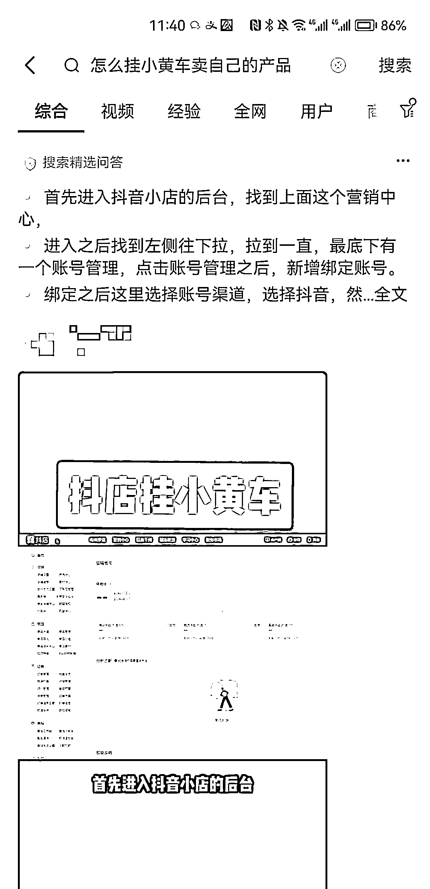

# 13 个 实操后总结的抖音 SEO 获客经验技巧

> 原文：[`www.yuque.com/for_lazy/thfiu8/yxr2qekg5f0zgn9u`](https://www.yuque.com/for_lazy/thfiu8/yxr2qekg5f0zgn9u)

<ne-h2 id="285a5b69" data-lake-id="285a5b69"><ne-heading-ext><ne-heading-anchor></ne-heading-anchor><ne-heading-fold></ne-heading-fold></ne-heading-ext><ne-heading-content><ne-text id="u3efa5e3a">(44 赞)13 个 实操后总结的抖音 SEO 获客经验技巧</ne-text></ne-heading-content></ne-h2> <ne-p id="u4054eea7" data-lake-id="u4054eea7"><ne-text id="u452fe7fa">作者： Kid</ne-text></ne-p> <ne-p id="u051c3000" data-lake-id="u051c3000"><ne-text id="u29d5bc0b">日期：2023-06-28</ne-text></ne-p> <ne-p id="u22b37a45" data-lake-id="u22b37a45"><ne-text id="u6efe410b">5 月 30 日《</ne-text><ne-text id="u5cc4f08a">抖音 SEO 两个月获客 600+，我的经验分享</ne-text><ne-text id="ua33ac179">》@张棪</ne-text><ne-text id="uabe8654e">大家好，我是迅课科技创始人张棪，公司主营业务是做微信生态的</ne-text><ne-text id="u2f5fb12f">在线教育</ne-text><ne-text id="u183fd28e">、题库变现、私域直播工具，累计服务了 4800 多商户，目前在题库方向应该是全国第一的水平，不过去年以来市场在萎缩，目前也是在探索更多的方向。</ne-text><ne-text id="u8cb95094">去年年底公司立项了一个关于抖音的新项目，经过前期调研之后确定了使用抖音 seo 获客的方式，年后开始着手这个项目，因之前有一定的百度 seo 的经验，过度到抖音 seo 之后，对排名算法很敏感，上手非常快。</ne-text><ne-text id="u6fa63378">从 3 月</ne-text> <ne-text id="u7fb36d7a">中旬</ne-text><ne-text id="uf26087dc">发布第一条视频以来，累计通过抖音获取了 1</ne-text><ne-text id="u25061508">8</ne-text><ne-text id="ud5d254a9">00 多条线索，目前这个领域相关的词基本都被我们霸榜了，平均每天的线索量是 40 条左右。</ne-text><ne-text id="u757d0774">尽管由于抖音的用户特征，有一部分线索较低（面向 B 端</ne-text><ne-text id="ub29e459a">和大 C</ne-text><ne-text id="u08936ec3">，实际上有很多小 C 提交信息），但是抖音</ne-text> <ne-text id="u27d66537">seo</ne-text> <ne-text id="ud15b24c2">还是帮我们节省了大量广告费，并且流量具有可持续性，目前第一条视频发布两个月了，依然源源不断的有播放量和线索。</ne-text><ne-text id="u0638a64c">我个人觉得抖音</ne-text> <ne-text id="u217c6af1">seo</ne-text> <ne-text id="u6eed6101">相比于百度 seo 的最大优势有两点：</ne-text><ne-text id="uc099ab9f">一是排名更迭很快，有些调整见效可能就十几分钟，对反推其各排名因素带来了各种便利；</ne-text><ne-text id="u1fc53111">二是通过投放可以叠加权重，这对于新手很友好，无需花很长时间去养一个账号，对比之下百度投放竞价对于排名没有任何增益。</ne-text><ne-text id="uedead942">从日常的操作过程中，也能明显感觉到抖音排名算法相对传统搜索引擎的各种不成熟，</ne-text><ne-text id="ud9c55c79">其</ne-text><ne-text id="uddfd5862">算法也在不断更迭中的，这就意味着抖音 seo 还有相当长的一段红利期。</ne-text><ne-text id="u8f681aee">总之，抖音</ne-text> <ne-text id="ua8d04a3e">seo</ne-text> <ne-text id="u148c6b65">很香，并且没有什么绝对的门槛，今天就结合这段时间的操作经验，把一些经验技巧分享一下。一家之言，不一定适用于所有领域。我觉得主要是给大家展示一个“大胆假设，小心求证”的例子，大家可以通过自己不断的去实验，找出适合自己的排名套路。</ne-text><ne-text id="ua8df8c6b">0.选词很重要，从巨量千川后台中找到的词有很多数据是伪数据，例如一个大词 90%的流量是其包含的一个小词</ne-text><ne-text id="u0e1a5b0b">的</ne-text><ne-text id="u2e4ad590">量，</ne-text><ne-text id="ua2fcbff6">基于巨量千川的数据去</ne-text><ne-text id="u2706883a">做分析</ne-text><ne-text id="u6d325556">，筛选的</ne-text><ne-text id="udad3462d">工作量会非常大，选词错了后续的工作就白费了。极客增长的工具很好用，我们也是一开始就买了企业版</ne-text><ne-text id="ub4ad8267">，对比巨量千川，选词就像开卷考试一样</ne-text><ne-text id="ud09ae23e">，节约了大量工作量。</ne-text><ne-text id="u95efe728">1.蓝 v/黄 v</ne-text><ne-text id="u95452942">></ne-text><ne-text id="u29935c08">关键词精确匹配</ne-text><ne-text id="ufc420a5b">></ne-text><ne-text id="u48beeb8d">真人出镜口播</ne-text> <ne-text id="ue6a4bf94">>>> 其他因素</ne-text><ne-text id="u6ce41c70">，什么意思呢，就是这三项</ne-text><ne-text id="u45dc353f">因素</ne-text><ne-text id="uc5baee28">对排名带来的增益</ne-text><ne-text id="u865a0e56">远大于其他因素，程度依次降低：</ne-text><ne-text id="ud409ad22">一个蓝 v 新账户的排名能轻而易举的超过一个几万粉的个人账户；</ne-text><ne-text id="u16d7398a">关键词精确匹配，即把词选好，文案里适度的重复，如果排名靠前的视频没有精确匹配的，你可能直接就第一了；</ne-text><ne-text id="u3f3ef53b">真人口播出镜，这个不用多说了，真人口播出镜的权重远大于其他任何的视频形式，例如</ne-text> <ne-text id="u1adeb581">AI</ne-text> <ne-text id="u094cb193">配音，动画形象，图文等。</ne-text><ne-text id="u1b1228df">这三项做好可以节约大量精力和时间，省下很多投放费用。</ne-text><ne-text id="u2af5d5c2">2.</ne-text><ne-text id="u38a5966a">点击提权，互联网产品有搜索排名得地方都绕不开点击提权这一个问题，例如在百度</ne-text> <ne-text id="u1554f7e1">seo</ne-text> <ne-text id="u2444686f">领域，一个点击提权养活了多少做快排的团队。</ne-text><ne-text id="u532c13e5">不过在抖音里的点击提权要换一种形式，不是点击视频进去观看，因为在视频流你就已经能把视频看完了，此时的视频就相当于搜索引擎里的文章详情，无需再点击了，所以考核的重点就变成了你观看视频之后退出当前搜索的概率。如果你搜索到的内容完美解决了你的问题，那你大概率就不会刷下一个视频了，对吧？</ne-text><ne-text id="uac3d3d06">3.</ne-text><ne-text id="ubf0b0bc0">收藏数据的重要性容易被忽视，因为收藏无法通过投放取得，抖音近期已经在增加收藏对权重的影响。如果视频的点赞与收藏接近 1:1，甚至收藏比赞多，视频会有一定概率变成“搜索精选问答”。 搜索精选问答可以稳定排在第一位，不受千人千面影响。</ne-text><ne-card data-card-name="image" data-card-type="inline" id="xsROs" data-event-boundary="card"><ne-text id="u1d0582f7">4.自身排名高的视频</ne-text><ne-text id="u8836c299">如</ne-text><ne-text id="ub9b795d1">非必要不要加到合集里，可能产生 1+1<1 的效果，因为合集在搜索结果里呈现的不一定是你设置的第一个视频，影响转化，如果视频已经被选为精选问答，加到合集里就没效果了，巨亏。</ne-text><ne-text id="uc7bed581">视频+合集 vs 合集+合集，可以实现前 5 中占两个位置的效果，实现同一个账户做霸屏，两个视频占两个位置也有可能，但是概率要大大降低了。</ne-text><ne-text id="u80f6a25e">5.排名高的文案拿来仔细研究下关键词的分布，会有惊喜，不要一味的去抄。一个是抖音现在在打击文案抄袭，另一个是有些视频有排名也是一个偶然，自己掌握了关键词怎么在文案里分布，才能对排名手到擒来。</ne-text><ne-text id="u5f84cfd5">6.如果你实在懒得分析文案，就给按这个作业抄：开头 10 个字以内一定要开始提及关键词，结尾</ne-text><ne-text id="u41090e8f">最后一句话</ne-text><ne-text id="uf2b7d241">再提及一次，中间部分可以设法合理的重复关键词 1～5 次（根据视频的长度做处理，1 分钟的视频总共出现 3 次关键词就可以了，我们日常做得视频一般 2:30 秒左右，关键词出现 6 次。为什么视频这么长，因为做搜索要把问题给用户讲明白，不要为了做完播率缩减视频长度而让用户看得一头雾水，搜索排名跟推荐流是两回事儿）。  </ne-text><ne-text id="u25b75908">7.越新的视频越容易有好排名，所以隔段时间把文案简单动一下重新拍一条，不要嫌麻烦。我们的文案，会有竞争对手一字不改的抄了去，然后利用新视频的优势超过我们，怎么把他给折腾下去是另一回事儿了。</ne-text><ne-text id="ufaa5d23f">8.搞多个账号做矩阵，毕竟你的文案放在哪里，别人照抄也能有排名，不如自己拿来做矩阵霸榜。</ne-text><ne-text id="u46957faf">9.抖音依靠语音识别出的文字未必准确，所以视频一定要加字幕和封面，封面里要提及主关键词，且字体不要用不规范的字体，不利于抖音识别。 在视频背景里放关键词也有用，这招儿在直播时很常见，但很少见在视频里的使用。</ne-text><ne-text id="u91241a07">10.抖音的分词存在一定缺陷，例如关键词“挂载小黄车”是不包含“挂小黄车”的，为了覆盖更多关键词而使用这种包含形式写标题和文案，有时得不偿失，必要时视频可以整两个版本，具体关键词是否受到影响，要根据自己的实践判断。</ne-text><ne-text id="u5882f476">11.视频封面、标题、标签，在视频发布后 30 天内</ne-text><ne-text id="ua34f1d10">在手机版上可以改</ne-text><ne-text id="u356cdf58">，利用好这段时间，如果排名不好，或者选错词了，还有补救的余地。</ne-text><ne-text id="uabc1e2c5">发布 30 天后依然可以登录 PC 版在创作者中心里修改，不过效果没那么明显，适合用到老视频创建合集时增加视频的相关性。</ne-text><ne-text id="u7a529491">12.视频有营销性质不能投抖+，怎么做数据：</ne-text> <ne-text id="u8f59f31b">挂小黄车的直接用小店随心推，不要投放商品购买，点前往自定义设置投放点赞评论，之后就跟抖+一样了。要注意视频挂小黄车后，权重会明显降低，数据要做得更漂亮，其次小店随心推投放结束后，点赞评论才会计入排名，如果是新视频投放期间视频可能搜不到，给人一种视频没被收录的错觉，根搞人心态；</ne-text><ne-text id="u9abc9418">蓝 v 用官方的表单获客工具，一般不会被拒，如果被拒了，可以尝试投放一个 200 块以上的大单，只包含这一个视频，会有概率通过，毕竟抖音也是要努力赚广告费的；</ne-text><ne-text id="u739410c3">蓝 v 还可以一开始不挂表单，排名上去了去抖音企业号后台再添加，然后评论区里做</ne-text><ne-text id="u4f4f76d9">置顶</ne-text><ne-text id="u997a73ef">引导。（所以蓝 v 在很多方面都是碾压式的存在，抖音 seo 必备）</ne-text><ne-text id="ue54b4a53">合集法，用没有营销性质的视频做数据，再建一个合集包含这个视频，把营销性质的视频放在第一位，这招儿一开始很好用，现在会有一定概率不展示第一位视频，适合其他方案都不行的视频用。</ne-text><ne-text id="ua0808962">以上就是今天的分享，希望对大家有所帮助，也希望在接下来的航海旅程里，能跟大家碰撞出更多搜索排名的经验</ne-text><ne-text id="u35948908">，</ne-text><ne-text id="uf9f02952">感谢大家～～</ne-text>  <ne-p id="u1d11dc0c" data-lake-id="u1d11dc0c"><ne-text id="u55f2a4dd">暂无评论</ne-text></ne-p></ne-card></ne-p>