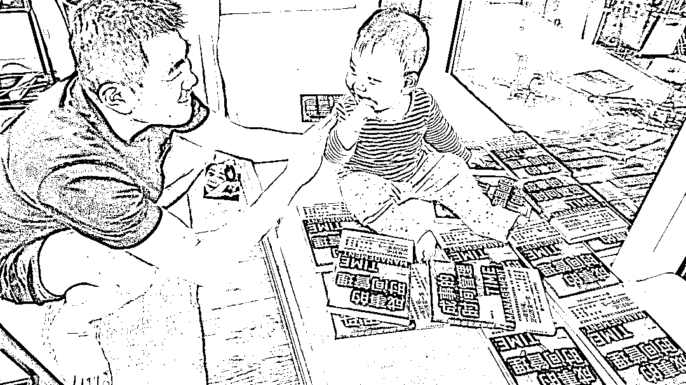

# 为什么一定要出书，以及从中得到的一个赚钱思考

> 原文：[`www.yuque.com/for_lazy/thfiu8/tw4ovev155uc4rgt`](https://www.yuque.com/for_lazy/thfiu8/tw4ovev155uc4rgt)

<ne-h2 id="5b6ebd39" data-lake-id="5b6ebd39"><ne-heading-ext><ne-heading-anchor></ne-heading-anchor><ne-heading-fold></ne-heading-fold></ne-heading-ext><ne-heading-content><ne-text id="ud87651b6">(精华帖)(283 赞)为什么一定要出书，以及从中得到的一个赚钱思考</ne-text></ne-heading-content></ne-h2> <ne-p id="u2ba0518a" data-lake-id="u2ba0518a"><ne-text id="u78cab6da">作者： 粥左罗</ne-text></ne-p> <ne-p id="u5cd11dc1" data-lake-id="u5cd11dc1"><ne-text id="u3412a26c">日期：2023-07-24</ne-text></ne-p> <ne-p id="u30930d45" data-lake-id="u30930d45"><ne-text id="u3db84cb0">【粥左罗：为什么一定要出书，以及从中得到的一个赚钱思考】</ne-text></ne-p> <ne-p id="u6c758ba4" data-lake-id="u6c758ba4"><ne-text id="uc81b4702">出书的好处特别特别多，大家都知道的一些这次我就不讲了，讲讲我最近思考的一个点。</ne-text></ne-p> <ne-p id="ub5628290" data-lake-id="ub5628290"><ne-text id="u68c12263">对于知识 IP 来说，出书的本质是你做了一个优质的内容产品，但这个产品不是主要靠你来卖，主要的收益也不是你。</ne-text></ne-p> <ne-p id="u854aa405" data-lake-id="u854aa405"><ne-text id="u13f1c280">这一点好好体会一下，其实是一个非常牛的模式。</ne-text></ne-p> <ne-p id="ue9c44c98" data-lake-id="ue9c44c98"><ne-text id="u4f0b6f18">就是你做了一个可以给自己带来很多收益的产品，但是这个产品【有一帮人比你更希望它卖得好，也比你更愿意多花时间去卖这个产品，会想尽各种办法去推广它】，你这本书的工作室、产品经理、营销编辑，等等，各个渠道的分销商以及在网上做书单号荐书卖书的，等等。</ne-text></ne-p> <ne-p id="u45743070" data-lake-id="u45743070"><ne-text id="ufa7dcfcb">知识 IP 的很多其它产品，其实做不到这一点，比如课程，训练营，社群，一对一咨询等等，都是核心你做出来的，又核心要靠你自己来卖，核心的收益又是你自己的。也就是你需要在做产品上，卖产品上，服务上都要花很多时间精力和人力、资源。</ne-text></ne-p> <ne-p id="u6b401e0f" data-lake-id="u6b401e0f"><ne-text id="ue531105b">而出书，由于刚才的说那个特性，决定了，你只管出最好的产品就可以，因为有一帮人要围绕着它开发它的价值来赚取自己的收益。他们收益的过程中你也会顺便得到。</ne-text></ne-p> <ne-p id="u54fd4765" data-lake-id="u54fd4765"><ne-text id="u7379b659">因此，我每年都会出书，但是基本上我只负责一件事，就是把内容做好交给出版社，剩下的基本上我都不会管，大家也很少看到我在宣传书卖书，我也很少在朋友圈公众号上去推广我的书，这些都不是靠自己，其他人会努力的卖这些书。</ne-text></ne-p> <ne-p id="u1d5a5d35" data-lake-id="u1d5a5d35"><ne-text id="ue972f548">当然这也是对的，我的核心贡献就应该是写出一本本有机会卖得好的书，而不是在卖上下功夫。</ne-text></ne-p> <ne-p id="u99fb9ae7" data-lake-id="u99fb9ae7"><ne-text id="ua34d94eb">因此，出书是一个真正的躺赚的事情。</ne-text></ne-p> <ne-p id="udf32f7ff" data-lake-id="udf32f7ff"><ne-text id="uacbad2a1">我的《学会写作》第一版卖了超过 10 万册了，现在出了第二版又卖得很好，也就是说这样一本书持续卖了四五年了。</ne-text></ne-p> <ne-p id="u74d122f3" data-lake-id="u74d122f3"><ne-text id="ub840c3f9">我的《学会成长》，卖得不是特别好，但是也超过 3 万册，也算畅销书了。</ne-text></ne-p> <ne-p id="u71aef102" data-lake-id="u71aef102"><ne-text id="ueff4b4c0">我的《成事的时间管理》，这本书出版还不到一年，春节出的，也卖得很不错，最近在抖音上被一些号推爆了，基本上每天稳定的在抖音上能卖 300 本左右，已经持续了差不多一个月了，还在持续。</ne-text></ne-p> <ne-p id="u7efb253f" data-lake-id="u7efb253f"><ne-text id="ucaa5cd8b">我今年还有打造个人 IP 的书，在出版流程中。现在基本上确定了一个模式，每年出一本到两本书，把持续出书当作一个战略，只要每年认真对待出版的那一两本书，销量都会不错，出的足够多，后面也总会有机会出现大几十万册甚至百万册畅销书，而且有一些书有机会成为经典，经典就是没几年再办一次能持续卖十年二十年。</ne-text></ne-p> <ne-p id="u40385636" data-lake-id="u40385636"><ne-text id="u2ae21789">【而且在出书这件事上，其实我一直没有专门花时间，我平时写文章写课程，我都会用一个标准来要求自己，就是每一篇每一节的质量得是能够出书的标准，因此我每年出的书都是现成的一些内容，不需要专门写书。】</ne-text></ne-p> <ne-p id="uc14cb3e3" data-lake-id="uc14cb3e3"><ne-text id="u0201a0fb">另外就是，在知识 IP 所有的产品中，书是最容易被别人免费传播的一个东西，如果你有自己的公众号，你有自己的朋友圈，你很可能不是那么愿意免费的去宣传我的课程，训练营，社群，但是书就不一样，很多人发朋友圈去晒一本书，拍一个短视频讲一本书的读后感，写公众号去总结读一本书的收获，都是很自然的一件事，大家也不会把这个当成是给别人做宣传，但是呢，确实又顺便做了很好的宣传。</ne-text></ne-p> <ne-p id="ua802d062" data-lake-id="ua802d062"><ne-text id="u49693651">做流量做转化是让别人直接为你付钱，做品牌是让别人不断地更喜欢你更爱你。书可以很好地帮你做到这一点。</ne-text></ne-p> <ne-p id="ud6f45a47" data-lake-id="ud6f45a47"><ne-text id="uf86d1d64">最后再总结一点，从上面出书的那个特性里面得到的一个思考，如果你做一个项目业务，如果大部分收益都是你自己的，必然不能很好的形成围绕着你赚钱同时又帮你赚钱的一个生态，所以我们以后做产品做业务，是不是可以想想怎么把更多的钱分出去一些，如果有一帮人能够通过你赚钱，你自然不会差钱。这个讲到最后又回归到一个基本的逻辑，分钱的重要性，你越会分钱你就越会赚钱，只不过以前我们更多的是从你创业做团队的逻辑去想这个事情，其实本身产品的机制、业务的机制、项目的机制里本身就可以引入这个思想，主动的，刻意的。</ne-text></ne-p> <ne-p id="u6b3a48ed" data-lake-id="u6b3a48ed"><ne-text id="u8f9f19e5">希望对你有启发，点个赞吧，感谢你的收看୧(๑•̀◡•́๑)૭</ne-text><ne-card data-card-name="image" data-card-type="inline" id="oWvpI" data-event-boundary="card">  <ne-p id="ue660f46f" data-lake-id="ue660f46f"><ne-card data-card-name="image" data-card-type="inline" id="PV2BE" data-event-boundary="card"></ne-card></ne-p> <ne-p id="u4b932efc" data-lake-id="u4b932efc"><ne-card data-card-name="image" data-card-type="inline" id="zfl4F" data-event-boundary="card">  <ne-hole id="ub89105a2" data-lake-id="ub89105a2"><ne-card data-card-name="hr" data-card-type="block" id="i1oG1" data-event-boundary="card"><ne-p id="uef2f8b80" data-lake-id="uef2f8b80"><ne-text id="ucef0151b">评论区：</ne-text></ne-p> <ne-p id="u57cab80c" data-lake-id="u57cab80c"><ne-text id="u2db3c496">希声 : 666</ne-text> <ne-text id="u7de4921c">米斗设计 : 666</ne-text> <ne-text id="ubb485350">乐澄 : 这是多赢啊，这个思路牛🐮</ne-text> <ne-text id="u33c6a35a">飞 : 花花轿子众人抬</ne-text> <ne-text id="ubbe5addd">发愤的草莓 : 向大佬学习，今年出第二本</ne-text> <ne-text id="u88bb6db5">粥左罗 : 👏👏</ne-text> <ne-text id="u2b104c06">阿妮 : 666</ne-text> <ne-text id="u13494397">喵图灵 : 尤其对于新媒体的下半场，流量的价格被拉的很高，想做知识 IP 需要一个强背书，既做背书，也做内容核心，内容输出和书籍销售是双向关联的，更容易起号的同时，也能增加书籍的知名度，也是一件双赢的事</ne-text></ne-p> <ne-p id="uc914e97f" data-lake-id="uc914e97f"><ne-card data-card-name="image" data-card-type="inline" id="TYa6S" data-event-boundary="card">  <ne-hole id="u92d94346" data-lake-id="u92d94346"><ne-card data-card-name="hr" data-card-type="block" id="szYS9" data-event-boundary="card"></ne-card></ne-hole></ne-card></ne-p></ne-card></ne-hole></ne-card></ne-p></ne-card></ne-p>