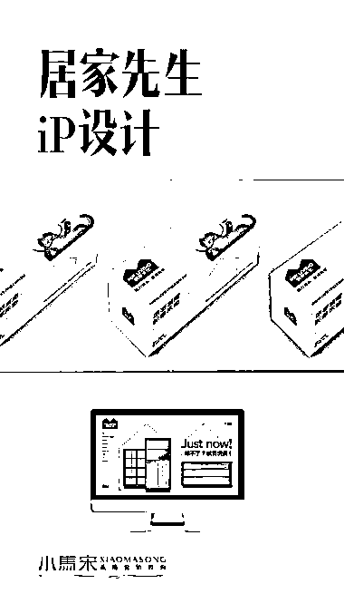
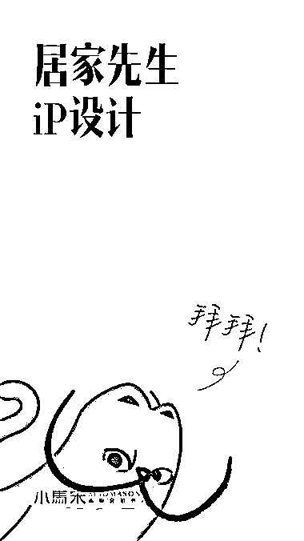

# 商业应用的 IP 设计有几个原则

> 原文：[`www.yuque.com/for_lazy/thfiu8/ngoegz9rtbkgvp7z`](https://www.yuque.com/for_lazy/thfiu8/ngoegz9rtbkgvp7z)

<ne-h2 id="48f655e1" data-lake-id="48f655e1"><ne-heading-ext><ne-heading-anchor></ne-heading-anchor><ne-heading-fold></ne-heading-fold></ne-heading-ext><ne-heading-content><ne-text id="ua15d1723">(52 赞)商业应用的 IP 设计有几个原则</ne-text></ne-heading-content></ne-h2> <ne-p id="ub74273eb" data-lake-id="ub74273eb"><ne-text id="ucb97e289">作者： 小马宋</ne-text></ne-p> <ne-p id="uef1e14a4" data-lake-id="uef1e14a4"><ne-text id="ud76b83f6">日期：2023-07-28</ne-text></ne-p> <ne-p id="ue8cb1685" data-lake-id="ue8cb1685"><ne-text id="u7fe350d3">商业应用的 IP 设计有几个原则：</ne-text></ne-p> <ne-p id="udfea7c54" data-lake-id="udfea7c54"><ne-text id="u68ee2d9b">1、有原型，顾客看起来要有熟悉感</ne-text> <ne-text id="uf6196e0f">2、独特性，要与其他品牌 IP 有区别</ne-text> <ne-text id="ud374188e">3、关联性，要与品牌的产品有关联</ne-text></ne-p> <ne-p id="u3e5cf508" data-lake-id="u3e5cf508"><ne-text id="u6aa76c7d">因为居家先生的产品是家居，所以我们选择了家居生活中最熟悉的一个动物“猫”作为原型设计。</ne-text></ne-p> <ne-p id="u56ef7a95" data-lake-id="u56ef7a95"><ne-text id="u1b144404">如何增加独特性？因为居家先生是一个设计品牌，具有很高的审美风格，我们把艺术家达利的形象与猫结合，于是就创造了独特的 IP“达利猫”。</ne-text></ne-p> <ne-p id="u57d131cd" data-lake-id="u57d131cd"><ne-text id="u19283c75">而且猫的耳朵也与居家先生的“家 logo”有关联。</ne-text><ne-card data-card-name="image" data-card-type="inline" id="L2oz4" data-event-boundary="card"></ne-card></ne-p> <ne-p id="u0be06c8a" data-lake-id="u0be06c8a"><ne-card data-card-name="image" data-card-type="inline" id="n9FAH" data-event-boundary="card"></ne-card></ne-p> <ne-p id="ufde2ae1e" data-lake-id="ufde2ae1e"><ne-card data-card-name="image" data-card-type="inline" id="DNURa" data-event-boundary="card">  <ne-p id="u3914e1e6" data-lake-id="u3914e1e6"><ne-card data-card-name="image" data-card-type="inline" id="FFVjw" data-event-boundary="card"></ne-card></ne-p> <ne-p id="uf9c9690b" data-lake-id="uf9c9690b"><ne-card data-card-name="image" data-card-type="inline" id="oLnYk" data-event-boundary="card"></ne-card></ne-p> <ne-p id="ud7b166a0" data-lake-id="ud7b166a0"><ne-card data-card-name="image" data-card-type="inline" id="pZkF8" data-event-boundary="card"></ne-card></ne-p> <ne-p id="u7d5c956c" data-lake-id="u7d5c956c"><ne-card data-card-name="image" data-card-type="inline" id="Wp7ng" data-event-boundary="card"></ne-card></ne-p> <ne-p id="u65f9438f" data-lake-id="u65f9438f"><ne-card data-card-name="image" data-card-type="inline" id="swKWT" data-event-boundary="card"></ne-card></ne-p> <ne-p id="uc7f68b93" data-lake-id="uc7f68b93"><ne-card data-card-name="image" data-card-type="inline" id="rkqLB" data-event-boundary="card"></ne-card></ne-p> <ne-hole id="u2222a676" data-lake-id="u2222a676"><ne-card data-card-name="hr" data-card-type="block" id="KYC1h" data-event-boundary="card"><ne-p id="u70a1d62e" data-lake-id="u70a1d62e"><ne-text id="u8bd11b0e">评论区：</ne-text></ne-p> <ne-p id="u05467785" data-lake-id="u05467785"><ne-text id="ud943f19e">Tina｜禹萱 : 感谢🙏分享</ne-text></ne-p> <ne-p id="uab3ca9fb" data-lake-id="uab3ca9fb"><ne-card data-card-name="image" data-card-type="inline" id="EGJvB" data-event-boundary="card"></ne-card></ne-p> <ne-hole id="uf93e494e" data-lake-id="uf93e494e"><ne-card data-card-name="hr" data-card-type="block" id="cCfvG" data-event-boundary="card"></ne-card></ne-hole></ne-card></ne-hole></ne-card></ne-p>