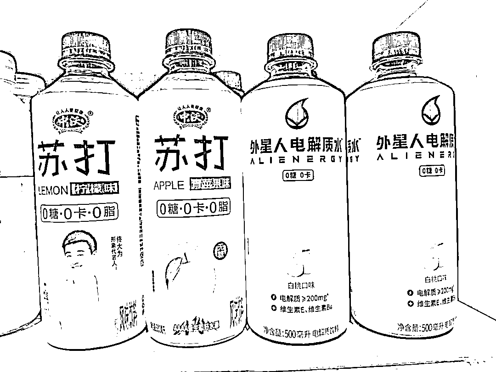

# 被别人抄袭怎么办？

> 原文：[`www.yuque.com/for_lazy/thfiu8/ydq2sfkbyhwt2kzb`](https://www.yuque.com/for_lazy/thfiu8/ydq2sfkbyhwt2kzb)

<ne-h2 id="6a5b9081" data-lake-id="6a5b9081"><ne-heading-ext><ne-heading-anchor></ne-heading-anchor><ne-heading-fold></ne-heading-fold></ne-heading-ext><ne-heading-content><ne-text id="ubbca3dff">(98 赞)被别人抄袭怎么办？</ne-text></ne-heading-content></ne-h2> <ne-p id="udbd1f5a8" data-lake-id="udbd1f5a8"><ne-text id="u9b1b2922">作者： 小马宋</ne-text></ne-p> <ne-p id="u7a81f2ea" data-lake-id="u7a81f2ea"><ne-text id="u56391a56">日期：2023-07-27</ne-text></ne-p> <ne-p id="udc38199b" data-lake-id="udc38199b"><ne-text id="u567a06ba">被别人抄袭怎么办？</ne-text></ne-p> <ne-p id="u74832735" data-lake-id="u74832735"><ne-text id="u14f5c858">商业世界中，最容易打得头破血流的就是抄袭问题。</ne-text></ne-p> <ne-p id="u4568923c" data-lake-id="u4568923c"><ne-text id="u95e2a2c6">我的观点可能很多人都不同意，但这是一个事实，人类世界，是不可能避免模仿的，而且人类社会是靠模仿传承延续的。</ne-text></ne-p> <ne-p id="u11187a1a" data-lake-id="u11187a1a"><ne-text id="u1eca6814">这个观点来自法国传播学鼻祖塔尔德。</ne-text></ne-p> <ne-p id="uaa1a44e2" data-lake-id="uaa1a44e2"><ne-text id="u0b99137f">因为有模仿，我们的文化和风俗才会代代相承。同样的，商业世界也是一样。</ne-text></ne-p> <ne-p id="u446e2e00" data-lake-id="u446e2e00"><ne-text id="uc5687bd6">早年德国就是靠山寨英国开始发展的，中国互联网早期也是靠模仿美国起步。但移动互联网时代，好多美国公司开始模仿中国企业。比如抖音，美国的巨头们也在模仿它。</ne-text></ne-p> <ne-p id="ua3a193ba" data-lake-id="ua3a193ba"><ne-text id="u6b48bde6">某品牌的产品外观设计一出来，一大堆模仿的同行。这家企业很气愤，但没办法，这是必然的。</ne-text></ne-p> <ne-p id="u276e34cc" data-lake-id="u276e34cc"><ne-text id="ua5a1a656">如果你说你的外观设计是首创，抄袭者无耻。那你也可以这么想，口味算不算模仿，文案算不算模仿，产品形态算不算模仿，加工工艺算不算模仿。你可以检视一下这些方面，你有没有“抄袭”别的同行？</ne-text></ne-p> <ne-p id="uffa2833c" data-lake-id="uffa2833c"><ne-text id="uc39c9d6f">我不信你搞的东西都是原创。</ne-text></ne-p> <ne-p id="u7cd91ff1" data-lake-id="u7cd91ff1"><ne-text id="u11edcc68">喜茶的芝士奶盖，春水堂的珍珠奶茶，瑞幸的生椰拿铁，塔斯汀的中国汉堡，椒爱的椒盐水煮鱼，好利来的半熟芝士。不都被模仿了嘛，那抄别人的原创口味不算无耻呢？</ne-text></ne-p> <ne-p id="u85a551b3" data-lake-id="u85a551b3"><ne-text id="u1d3bc29b">丰田的 TPS 方法，你要学习，那算不算抄袭呢？华莱士的合伙人加盟制，你去学习，算不算抄袭呢？直播风格，包装写法，短视频剧情，私域玩法，客服话术，如果是别家公司原创，那你抄不抄？</ne-text></ne-p> <ne-p id="u67271ad5" data-lake-id="u67271ad5"><ne-text id="uf8d10548">难道只有产品造型和外观设计才算原创？所以，只要是商业，模仿就不了避免，你不可能都是原创。</ne-text></ne-p> <ne-p id="u5a54c9bb" data-lake-id="u5a54c9bb"><ne-text id="ua05bc88d">我们的合理策略，一个是要快速学习别人，还有一个就是提高别人模仿自己的难度和壁垒。</ne-text></ne-p> <ne-p id="ud0aaecd9" data-lake-id="ud0aaecd9"><ne-text id="ucfa6531b">比如戴森，它用工业设计+技术专利等组合拳，才能勉强维持这个壁垒。</ne-text></ne-p> <ne-p id="ue4bca7c3" data-lake-id="ue4bca7c3"><ne-text id="u42ff3747">最后讲一个故事，前一阵子认识了高樟资本的老范，最近他在自己的读者群里也开始每日分享。不过他有创新，就是做成了图片带二维码的形式。</ne-text></ne-p> <ne-p id="ue0f8c531" data-lake-id="ue0f8c531"><ne-text id="ubc8e0646">他发给我看，我说这就是模仿律，而且最近我把小宇宙播客从“小马宋”改成“小马宋商业观察”，也跟学习“老范聊创业”这个名字有关。我们在互相模仿罢了。</ne-text></ne-p> <ne-p id="ue717448c" data-lake-id="ue717448c"><ne-text id="u2190d523">即使按照对等原则，你也不能在别人模仿你的时候咬牙切齿，你模仿别人的时候心安理得吧。</ne-text><ne-card data-card-name="image" data-card-type="inline" id="tNrcZ" data-event-boundary="card"></ne-card></ne-p> <ne-hole id="ufef47857" data-lake-id="ufef47857"><ne-card data-card-name="hr" data-card-type="block" id="f29ei" data-event-boundary="card"><ne-p id="ue58315d7" data-lake-id="ue58315d7"><ne-text id="ude457961">评论区：</ne-text></ne-p> <ne-p id="ua5bb0726" data-lake-id="ua5bb0726"><ne-text id="u3d8389ad">树杨 Yang : 学习了</ne-text> <ne-text id="u510b29a3">祁磊 : 元气森林表示很无语</ne-text> <ne-text id="u2e297d4f">精灵 : 哈哈哈</ne-text> <ne-text id="uf7e6c14b">风轻云淡 : 有道理</ne-text> <ne-text id="u1ccc64bd">七七姑娘 : 谢谢小马宋老师</ne-text> <ne-text id="ud79b6657">泉州百度营销顺 : 时光机原理嘛，学习成功经验是必然的</ne-text> <ne-text id="u3eee21bb">未子央木 : 学习的本质就是基于模仿的反复练习。</ne-text> <ne-text id="u812d682f">喵图灵 : 概念不一样，一些人抄袭是拿去直接获取利益，同时忽略甚至否定原创，这种是彻头彻尾的无耻，时代进程自有自己的进化方式，但是无节制的抄袭且没有规则框架去限制，本质上就是会让抑制超前意识的出现</ne-text></ne-p> <ne-p id="ub87780a6" data-lake-id="ub87780a6"><ne-card data-card-name="image" data-card-type="inline" id="ikwcS" data-event-boundary="card"></ne-card></ne-p> <ne-hole id="ud948a5d7" data-lake-id="ud948a5d7"><ne-card data-card-name="hr" data-card-type="block" id="ksHzj" data-event-boundary="card"></ne-card></ne-hole></ne-card></ne-hole>