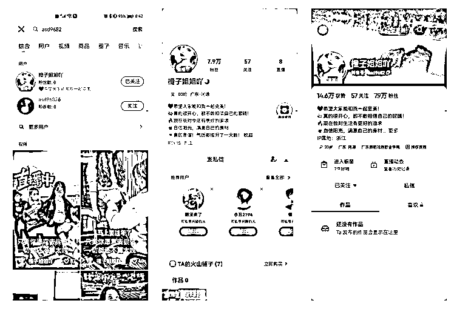
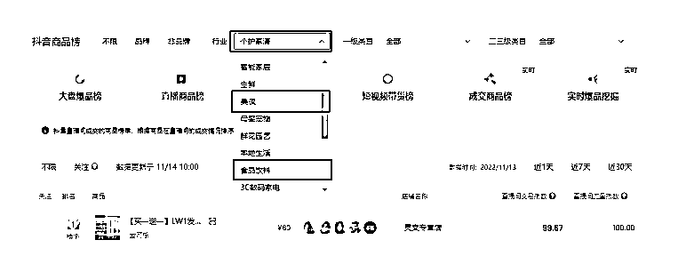

# 带货短视频全网素材寻找途径，个人&团队全攻略！

> 原文：[`www.yuque.com/for_lazy/thfiu8/abua6ov93y0smy47`](https://www.yuque.com/for_lazy/thfiu8/abua6ov93y0smy47)

## (72 赞)带货短视频全网素材寻找途径，个人&团队全攻略！ 

作者： 书豪 

日期：2023-07-26 

各位朋友好，我是在杭州的生财龙珠圈友书豪，一个连续创业四年的 95 后，目前连续四年都年入百万。 

### 今天给大家分享的这篇文章，不仅仅适用于视频号抖音短视频带货，也希望对想做小红书店铺带货的朋友有帮助。 

因为我们不论是抖音短视频带货矩阵，还是批量矩阵经营 30 个小红书店铺，发现提高短视频素材的寻找途径效率，能更好的帮助我们经营小红书店铺； 

不论是自由职业者做短视频带货，还是有 5 人左右的剪辑师的内容素材团队的短视频公司，还是几百人规模的电商公司，带货短视频的素材寻找途径都不外如此，方法和途径都是一样的！ 

太阳底下没有新鲜事，也并没有所谓的绝招。 

⼀、快手 

1.根据商品名称搜索 

（例如：吸油贴/艾草贴/草本贴/去湿贴/脂流贴/肚脐贴） 

 

通过商品名称搜索的视频，契合度最⾼，基本可以原搬，⼩部分视频需要微改后上计划 

①综合：直接获取视频 

⾃然排序 / 筛选最新发布 / 播放最多 

 

②直播：关注同类型产品在播号，从在播号主⻚间接获取视频 

 

2.根据功效词搜索 

（例如：减肥/瘦肚⼦/瘦⾝/暴汗/） 

可以寻找新的框架⽅向：例如之前的故事性⽚头、3D 动画 

⼆、抖音火山版 

1.根据商品名称搜索-直接获取视频 

 

2.根据商品名称搜索-关注在播号-间接获取视频 

（此时需要取关其他号，只关注⼀个号，可以看到该账号完整的视频） 

 

3.搜索在播号抖⾳ID-直接获取视频 

 

三、抖⾳ 

1.通过商品名称搜索在播号 

复制账号 ID-抖⾳⽕⼭版-搜索 ID-直接获取视频（默认点赞量⾼低排序） 

-关注该账号-在关注栏查看发布视频（默认发布时间先后排序） 

2.通过同⾏账号命名习惯搜索在播号 

如：“形体管理师”、“形体⽼师”、“⾝材管理” 

 

 

复制账号 ID-抖⾳⽕⼭版-搜索 ID-直接获取视频（默认点赞量⾼低排序） 

-关注该账号-在关注栏查看发布视频（默认发布时间先后排序） 

四、抖⾳罗盘 

1.登录⽹址： 

[https://compass.jinritemai.com/login](https://compass.jinritemai.com/login) 

 

2.关注类⽬： 

三⼤类--个护家清、⻝品饮料、美妆 

 

3.关注榜单类别： 

两个类别--直播商品榜、短视频带货榜 

抖⾳⽕⼭搜索抖⾳ID-直接获取视频（默认点赞量⾼低排序） 

-关注该账号-在关注栏查看发布视频（默认发布时间先后排序） 

 

五、巨量创意 

[https://cc.oceanengine.com/inspiration/creative-hot/qianchuan?materialType=3](https://cc.oceanengine.com/inspiration/creative-hot/qianchuan?materialType=3) 

 

 

六、第三方软件 

通过蝉妈妈、考古加、飞瓜等第三⽅软件寻找素材 

以上，诸君一起生财有术！欢迎各位圈友前来交流，微信  wshinvest1 

## 往期文章： 

### [如何矩阵化经营 30 个小红书店铺月利润过 20 万？](https://articles.zsxq.com/id_3qslvwfcmwn3.html) 

[人生的第一个 100 万，我是怎么赚到的？！](https://articles.zsxq.com/id_kek27cqo56wf.html) 

#### [组织生财有术福建厦门圈友聚会复盘！](https://articles.zsxq.com/id_7gqhllpk7tpk.html) 

### [小红书单店铺单月 6000+利润选品保姆级教程](https://articles.zsxq.com/id_xwveu3e0usfv.html) 

### [小红书无货源电商，单品 4w+利润，我做了什么？](https://articles.zsxq.com/id_8o3ptacdp6mj.html) 

### [抖音直播间月消耗过百万的千川投流经验分享](https://articles.zsxq.com/id_d3zembkeh2cw.html) 

### [2023 小红书幼教考编保姆级教程](https://articles.zsxq.com/id_cpdec6j4xtho.html) 

### [小红书爆款封面最新设计攻略！带你掌握流量密码](https://articles.zsxq.com/id_bbisxulzsup1.html) 

### [如何拆解一个小红书爆款视频](https://articles.zsxq.com/id_opo78sxacew9.html) 

### [小红书无货源电商做女装如何选品？](https://articles.zsxq.com/id_1wxixz3rofb3.html) 

### [小红书颜值测评变现保姆级教程](https://articles.zsxq.com/id_15njj2g5hxfr.html) 

### [小红书低粉爆款案例拆解教程](https://articles.zsxq.com/id_0nmnwdg6mb0l.html) 

### [小红书新人入局月入 100-1000 元保姆级教程](https://articles.zsxq.com/id_sbk8lqv5unca.html) 

###   

### [抖音单品短视频带货 1000 万 GMV，我是怎么做到的？！](https://articles.zsxq.com/id_qoak1w7ptnwf.html) 

### [抖音直播间月消耗过百万的千川投流经验分享](https://articles.zsxq.com/id_d3zembkeh2cw.html) 

###   

评论区： 

谢安生 : 很实用！[强][强][强] 蓝子鱼 : [强][强][强] 书豪 : 蓝子鱼老师对小红书的流量玩法让我受益匪浅[呲牙] 微笑 : 豪哥牛 书豪 : 一起生财有术，我安生总是那么支持我！ 书豪 : 有机会面基！ 四叶草 : 大佬威武，可以加个 v 吗，请教几个千川问题 书豪 : wshinvest1 

 